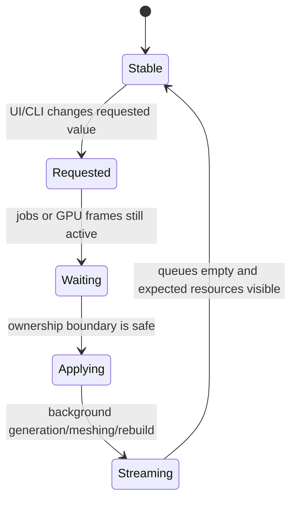

# T850 Scene Runtime Controls

Use this workflow when a setting crosses authored scene data, runtime state, ImGui, background work, or GPU resources. A control is not complete merely because its value changes in the panel.

## 1. Find the Owning Value and Precedence

Establish roots:

```powershell
$RepoRoot = git rev-parse --show-toplevel
$SourceRoot = Join-Path $RepoRoot 'T850'
```

Trace in this order:

1. authored `.t8scene` component value;
2. selected scene profile override;
3. control descriptor default;
4. runtime scene member / `SceneProps` field;
5. ImGui getter and setter;
6. code that consumes the value;
7. save/persistence path.

Do not assume `Scenes/<SceneName>.json` wins. For Minecraft, `.t8scene` profile sliders/checkboxes are applied after control-descriptor defaults and can override them.

Useful owners:

```text
Framework/include/scene/EditorSceneFile.h
Framework/src/scene/EditorSceneFile.cpp
Framework/include/scene/SceneSetup.h
Framework/src/scene/SceneSetup.cpp
Framework/include/scene/RenderGraph.h
Framework/src/scene/RenderGraph.cpp
DayScene/<Scene>.h/.cpp
Assets/Scenes/*.t8scene
Assets/Scenes/*Scene.json
Assets/Scenes/*RenderGraph.json
```

Unknown JSON keys may be ignored. A typo can look like a valid save while having no runtime effect. Verify the parsed member or startup log.

## 2. Classify the Change

| Class | Examples | Application rule |
|---|---|---|
| immediate scalar | exposure, bias, intensity | assign on UI change |
| shader feature | shadows, DOF, parallax | update state and enable/disable dependent render-graph passes |
| GPU resource shape | shadow resolution, attachment count | mark dirty; recreate at a safe render-thread boundary |
| streamed world shape | draw distance, chunk radius | queue request; wait for jobs; generate/unload/remesh incrementally |
| bounded entity population | enemy count 0..8 | pre-create slots; reset/show additions; invalidate/hide removals |
| live entity tuning | enemy speed | update shared settings and every active/reserved controller immediately |
| navigation/physics topology | navmesh, collision bodies | rebuild after source geometry is committed |
| camera/input mode | player/free/light mode | clear stale input and synchronize owning camera state |

Never resize arrays, destroy GPU objects, shift chunk rings, or publish a navmesh directly inside ImGui drawing.

## 3. Implement a Live State Machine

For nontrivial changes, separate:

```text
requested value
active value
transition/build target
completion state
```

Typical flow:



Requirements:

- clamp and validate requests;
- keep stable storage/IDs when possible;
- reject or coalesce duplicate requests;
- do not publish results built for a stale center/version/epoch;
- suppress consumers while active data is stale;
- expose progress or `(streaming)` in the panel;
- log request and completion separately;
- completion logs must include expected versus actual resource counts.

For async work, completion means all relevant queues are empty, not merely that generation finished:

```text
generation future invalid
mesh dispatch queue empty
pending mesh jobs empty
GPU commit/upload queue drained enough for visibility
navigation rebuild accepted for current center/version
```

## 4. Startup Is Not a Live-Transition Test

This is a mandatory distinction.

A startup test at value B validates:

```text
load B -> allocate B -> build B -> render B
```

A live control must validate:

```text
load A -> render A -> request B -> apply delta -> render B
```

These paths commonly differ. Example failure pattern:

- startup creates every mesh instance synchronously;
- live expansion generates data and queues uploads;
- upload assumes the mesh already exists and silently returns;
- panel shows B but rendering remains at A.

The discriminating check is an actual A-to-B transition with counts.

Minecraft enemy population uses `--minecraftEnemyCount N` as its test hook. It must call the same `SetMobCount` path as the **Enemy count** slider after the authored count and all eight render slots load. Validate both 1-to-0 and 1-to-8 transitions; startup authored at 0 or 8 does not cover live behavior.

Minecraft enemy speed uses `--minecraftEnemySpeed N` to exercise the same `SetMobSpeed` path as the slider. Compare fixed-frame positions at low and high values; a changed label alone is not sufficient evidence that controller settings updated.

## 5. Add a CLI/Test Hook When UI Automation Is Weak

A bounded CLI override can drive the same deferred path after scene load:

```powershell
.\DayScene.exe `
  --api d3d12 --scene 6 `
  --minecraftDrawDistance 32 `
  --dump-frame 5000 `
  --logLevel info
```

Do not implement the CLI as a startup shortcut. Queue the same request the ImGui setter uses after authored startup is complete.

Require logs shaped like:

```text
Authored scene ... renderDistance=6
Draw distance changed 6 -> 32 chunks
Draw distance ready: radius=32 chunkMeshes=4225 expected=4225
```

For settings without a CLI hook, add a narrowly scoped runtime command/test seam or use deterministic input automation. Remove temporary probes before completion.

## 6. Validate Side Effects

### Scene/profile precedence

- confirm the loaded `.t8scene` and selected profile;
- print/read the active value after all overrides;
- save/reload when persistence is part of the request.

### Render graph

When a toggle disables a feature, verify every dependent pass and input:

- producing pass skipped;
- shared passes remain only when another feature needs them;
- stale texture slots are cleared;
- downstream input fallback is valid.

### Streaming

Require:

- actual visible mesh count matches radius;
- old/out-of-range meshes become hidden/unloaded;
- new slots create instances before upload;
- negative coordinates and ring modulo remain valid;
- movement/recenter works after changing radius;
- navmesh rebuild occurs after generated blocks commit;
- no stale worker result publishes after a center/radius change.

### Memory

Large maximums require measurement. For a square chunk radius $r$:

$$
\text{chunk count} = (2r + 1)^2
$$

Measure startup/live peak memory. Check retained CPU snapshots, backend `sysMemCpy`, upload staging, retired buffers, and navigation snapshots. Do not accept a high cap that trivially OOMs a target platform.

## 7. Focused Gates

After the first edit:

```powershell
.\T850\scripts\build.ps1 -Config Release -Platform x64 -Action Build
```

Then run the smallest live transition that proves the behavior. Require:

- request log;
- completion log;
- expected/actual count match;
- finite dump after completion;
- no `[ERROR]`, device loss, OOM, validation, or stale-result line.

For renderer-visible changes, capture D3D11, D3D12, Vulkan, and GL. For deterministic before/after comparison, use `t850-api-frame-comparison`.

For Deck behavior, use `t850-deck-performance` and repeat the live transition on Vulkan. Startup-at-target does not substitute for this gate.

## 8. Common Failure Patterns

| Symptom | Likely cause / check |
|---|---|
| panel value changes, image does not | consumer still reads authored/other runtime field |
| startup works, live change does not | live path missed allocation/instance creation/delta work |
| value snaps back | getter reads different source than setter writes |
| JSON edit has no effect | profile override or ignored/unknown key |
| outer chunks never appear | upload path assumes pre-existing mesh; pending queues not drained |
| nav errors after moving | active navmesh center/version does not match streamed world |
| brief device loss after control | GPU resources destroyed before in-flight frames retire |
| memory explodes at high radius | retained snapshots/system copies/staging or quadratic resource count |
| completion logged too early | generation done but meshing/upload queue still active |

## 9. Completion Report

State:

- authored source and profile precedence;
- requested/active/completion state;
- startup A and live target B;
- expected versus actual resource counts;
- transition duration and peak memory for large changes;
- nav/physics/render-graph side effects;
- API/platform gates and visual results;
- persistence behavior;
- remaining latency or scale limits.

Related skills:

- `t850-voxel-terrain`
- `t850-api-frame-comparison`
- `t850-gpu-resource-lifetime`
- `t850-deck-performance`

Related documentation:

- `documentation/scenes/scene-format-and-runtime.md`
- `documentation/editor/imgui-system.md`
- `documentation/rendering/render-graph.md`
- `documentation/terrain/voxel-terrain.md`
- `documentation/development/runtime-configuration.md`
