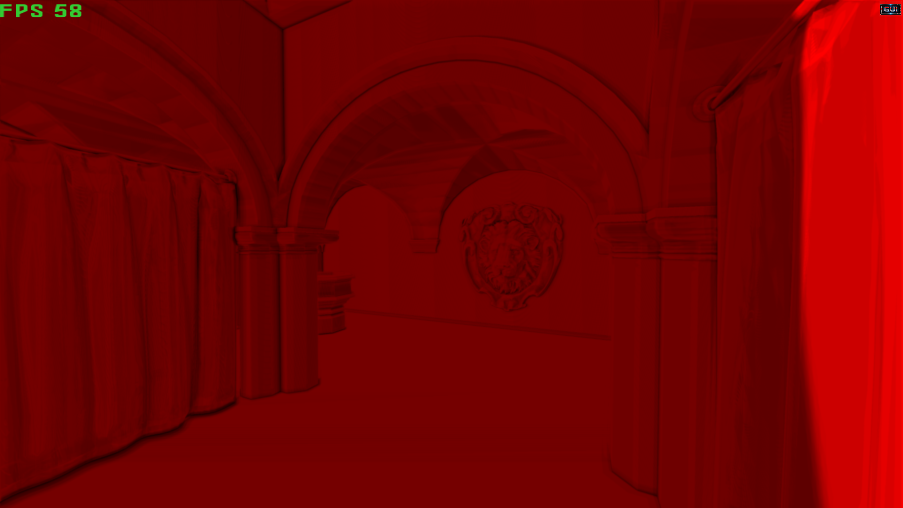
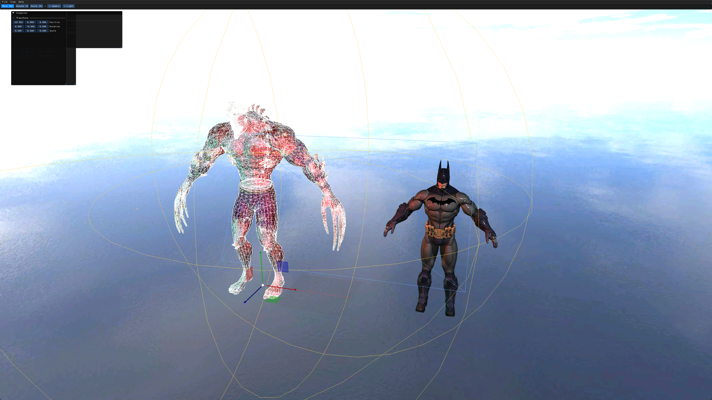
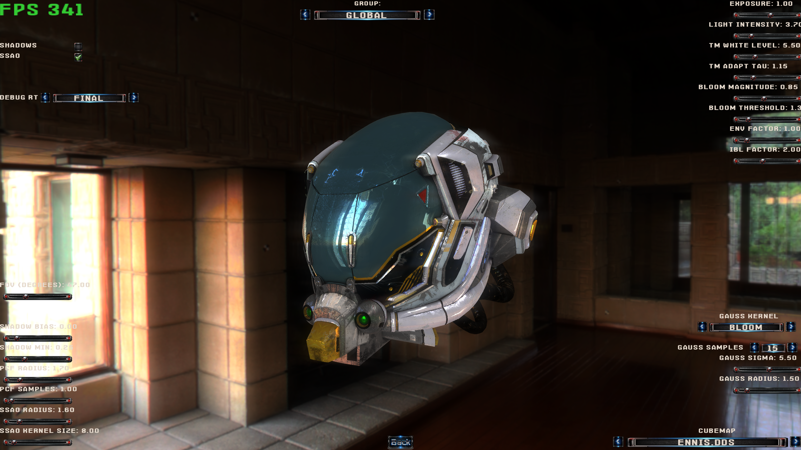
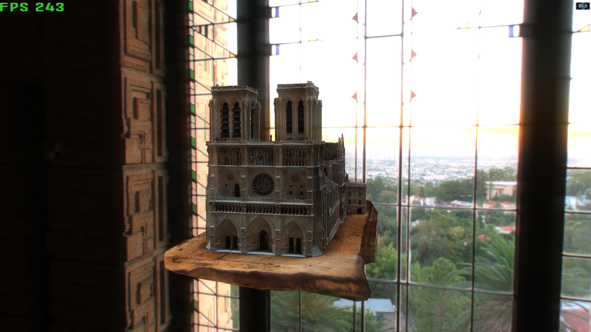
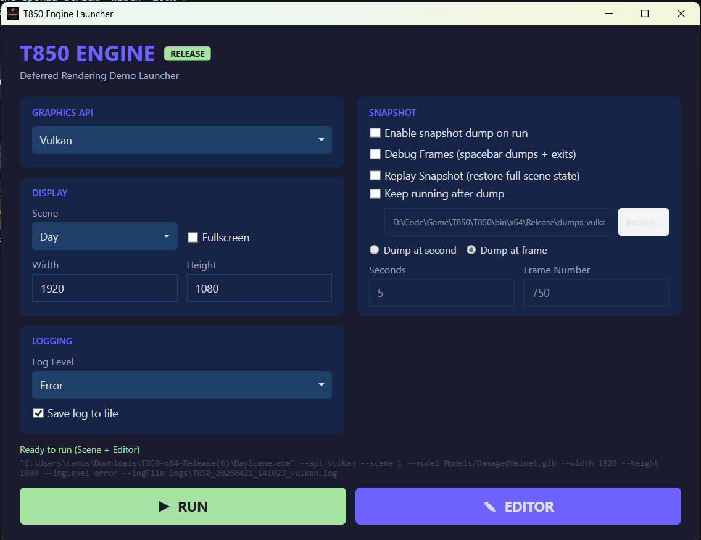
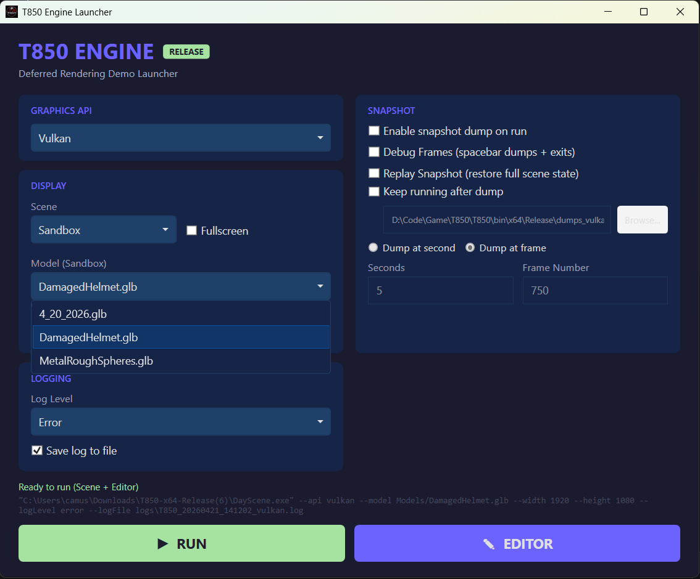

# T850

[](https://github.com/0Camus0/T850/actions/workflows/build.yml)

A cross-platform 3D rendering engine written in C++ with a deferred rendering pipeline, PBR materials, four graphics backends, and a built-in scene editor.

<p align="center">
  
</p>

## What Is This?

T850 started as a learning project to understand how real-time rendering works under the hood — from raw vertex buffers to full deferred pipelines with post-processing. Over the years it has grown into a multi-API engine that runs the same scene on **D3D11, D3D12, OpenGL, and Vulkan**, loads **glTF 2.0** models with PBR materials, and includes a **built-in editor** for tweaking scenes in real time. It's not trying to be Unity or Unreal — it's a playground for graphics programming where every line of the rendering code is yours to read, break, and learn from.

## Screenshots

<p align="center">
  
  <br><em>SSAO, PCF shadow mapping, and deferred lighting in the Sponza atrium</em>
</p>

<p align="center">
  
  <br><em>Built-in scene editor (T8ditor) with ImGui, gizmos, grid, and real-time parameter tuning</em>
</p>

<p align="center">
  
  
  <br><em>PBR metallic-roughness workflow with image-based lighting — Sandbox scene with orbit camera and cubemap selector</em>
</p>

## Launcher

The release package includes a GUI launcher (`T850Launcher.exe`) that lets you configure everything before running — no command line needed.

<p align="center">
  
  <br><em>Launcher with Day scene selected — the Sponza atrium with full deferred pipeline, shadows, bloom, god rays, and SSAO</em>
</p>

- **Graphics API** — Choose between D3D11, D3D12, Vulkan, or OpenGL
- **Scene** — **Day** loads the Sponza atrium scene with directional sun, point lights, spline camera, and all post-processing effects. **Sandbox** opens the glTF model viewer with orbit camera and PBR rendering.
- **Resolution** and **Fullscreen** — Set your preferred window size or go fullscreen
- **Snapshot** — Dump all render targets to disk at a specific frame or time (useful for debugging and comparison across APIs)
- **Logging** — Set verbosity level and optionally save logs to file
- **RUN** launches the scene, **EDITOR** opens the built-in T8ditor (always runs on D3D12)

<p align="center">
  
  <br><em>Sandbox mode scans the Models/ directory and lists all available .glb/.gltf files — drop your own models in and they show up automatically</em>
</p>

When **Sandbox** is selected, a **Model** dropdown appears listing every `.glb` and `.gltf` file found in the `Models/` directory. Just drop your own glTF models into that folder and they'll appear in the list on the next launch.

## Features

### Graphics Backends

| Backend | Status | Notes |
|---------|--------|-------|
| **Direct3D 11** | Stable | Full HLSL pipeline, runtime API switching |
| **Direct3D 12** | Stable | Triple-buffered, PSO cache, ring buffer CB allocator, debug layer |
| **Vulkan** | Stable | HLSL→SPIR-V via glslang, VMA memory management, triple-buffered |
| **OpenGL** (GLEW) | Stable | Desktop GL 3.3+, GLSL shaders with automatic attribute parsing |

All four backends share the same shader logic, scene code, and render graph — switch between them at launch with a single flag.

### Rendering Pipeline

- **Deferred shading** — G-Buffer with 5 color attachments (albedo, normals, PBR data, geometric normals, depth) plus shadow accumulation
- **PBR materials** — Metallic-roughness workflow with GGX normal distribution, Schlick-GGX geometry, Fresnel-Schlick; separate skybox and IBL intensity controls
- **Image-Based Lighting** — Specular reflections from cubemap mip chain, approximate diffuse irradiance from high-mip env sampling
- **Shadow mapping** — Directional light with configurable PCF kernel (radius, samples, scale)
- **SSAO** — Screen-space ambient occlusion with hemisphere sampling and noise texture
- **HDR pipeline** — Luminance map → adaptive exposure → Reinhard tone mapping → bloom extraction → Gaussian blur → composite
- **Bloom** — Bright-pass threshold with configurable factor and white level
- **Depth of Field** — Circle-of-Confusion based near/far blur with auto-focus option
- **Volumetric lighting / God rays** — Screen-space ray marching with Mie scattering
- **Parallax mapping** — Configurable sample count, height scale, self-shadowing with soft shadows
- **Gaussian blur** — Separable blur with runtime-configurable kernel size, radius, and sigma
- **Lens flare** and **vignette** post-processing
- **Fade transitions** between scenes
- **Render graph** — JSON-driven multi-pass pipeline definition (render targets, attachments, blend/depth/cull states, texture bindings)

### glTF 2.0 Loader

Built from scratch with no third-party glTF library:

- **Formats**: `.gltf` (JSON + external bins) and `.glb` (binary container)
- **Draco decompression** — `KHR_draco_mesh_compression` with parallel decode
- **MikkTSpace tangents** — Generated at load time when tangents are missing
- **Parallel image decode** — stb_image on a thread pool for fast texture loading
- **PBR material extraction** — Base color, metallic-roughness, normal, occlusion, emissive maps
- **Static meshes** — Full vertex attribute support (position, normal, tangent, texcoord, color)

### Scene Editor (T8ditor)

- ImGui-based editor with gizmos (translate, rotate, scale)
- Real-time parameter tuning via GUI sliders, checkboxes, and selectors
- Grid overlay and line renderer for debugging
- Scene serialization to `.t8scene` JSON format
- LDR deferred pass with depth-discard for clean viewport

### Engine Systems

- **AABB frustum culling** — Per-subset bounding boxes with frustum plane extraction; per-frame culling stats
- **GUI system** — Atlas-backed slider bars, checkboxes, selectors, and popup text editing with layout serialization and snap-to-grid editing mode
- **Orbit camera** — Sandbox scene with left-drag rotate, right-drag zoom, auto-framing to model bounding sphere
- **Cubemap selector** — Runtime environment map switching (DDS RGBA16F HDR cubemaps + DXT compressed sky cubemaps)
- **Spline system** — Catmull-Rom splines with agents, per-control-point velocity, and camera attachment for cinematic fly-throughs
- **Snapshot / replay** — Frame dumper with RT-level BMP/PPM export, matrix replay for deterministic camera positioning
- **Profiler** — GPU + CPU per-scope timing, draw call and triangle counts (opt-in via `--profile`)
- **Logging** — Thread-safe, multi-backend (console with ANSI color, VS Output window, file), 5 severity levels, timestamps with PID:TID and RAM usage
- **Scene descriptors** — JSON-defined scenes with cameras, lights, splines, meshes, render settings, and slider/checkbox/selector GUI definitions
- **GUI atlas generator** — Packs individual GUI textures into a single atlas with edge extrusion and configurable max sprite size
- **Text rendering** — stb_truetype with screen-space text, used for FPS counter and debug overlays

### Build & Tooling

- **CI pipeline** — GitHub Actions building x86/x64/ARM64 × Debug/Release on Windows via MSBuild + vcpkg
- **WPF Launcher** — GUI launcher for selecting API, scene, model, resolution, snapshot settings, and log level; dev version includes build button and editor launch
- **LaunchSolution.bat** — One-click setup: clones vcpkg, installs dependencies (GLEW, SDL3, Draco, MikkTSpace, ImGui), opens VS solution
- **Dual shader languages** — HLSL for D3D11/D3D12/Vulkan, GLSL for OpenGL; technique XML files define shader profiles with per-profile preprocessor defines

## Demo Scenes

| Scene | Description |
|-------|-------------|
| **Sandbox** | glTF model viewer with orbit camera, PBR rendering, cubemap selector, and full HDR pipeline. Load any `.glb`/`.gltf` from the Models dropdown. |
| **Day** | Sponza atrium lit by directional sun + warm point lights; shadows, bloom, DOF, god rays, SSAO, parallax mapping, lens flare; spline camera fly-through |
| **Night** | Night variant with omnidirectional shadow mapping (cubemap depth), moving light agent on a spline path |
| **Tech** | Technical showcase scene |

## Editor Guide (T8ditor)

T8ditor is a standalone scene editor that ships alongside the engine. It uses ImGui for its interface and always runs on D3D12. Launch it from the **EDITOR** button in the Launcher, or directly:

```
T8ditor.exe --api d3d12 --width 1920 --height 1080
```

### Importing .X Models

There are two ways to bring DirectX `.X` models into the editor:

1. **File → Import .x** (or `Ctrl+I`) — Opens a file dialog. Navigate to any `.X` file on disk, and it will be loaded with all its materials, textures, and normals. The model appears in the viewport and is automatically selected.

2. **Command line** — Pass `--mesh <path>` when launching T8ditor to pre-load a model on startup.

You can import multiple models into the same scene. Each one gets its own entry in the Hierarchy panel on the left.

### Saving and Loading Scenes

Scenes are saved as `.t8scene` files — plain JSON that you can version-control or edit by hand.

- **Save**: `File → Save Scene` (`Ctrl+S`) — Opens a save dialog. Choose a location and filename.
- **Load**: `File → Load Scene` (`Ctrl+O`) — Opens a file dialog. The current scene is cleared and replaced with the loaded one (the load is deferred to the next frame to safely release GPU resources).

A `.t8scene` file stores everything needed to reconstruct the scene:
- **Objects** — Mesh file path, position, rotation (degrees), scale, visibility, and frozen state
- **Cameras** — Name, type (perspective/orthographic), position, target, FOV, near/far planes
- **Lights** — Name, type (directional/omni), position, direction, color, intensity, radius, enabled state
- **Editor state** — Camera orbit target, yaw, pitch, distance, wireframe toggle

### Adding Cameras

Click the **+ Camera** button in the toolbar and choose:
- **Perspective** — Standard 3D camera with FOV and near/far planes
- **Orthographic** — Flat projection with configurable width/height

Cameras appear in the Hierarchy panel. Select one to see its properties in the Inspector:
- **Position** and **Target** — Both have separate gizmo handles in the viewport so you can drag them independently
- **FOV**, **Near/Far Planes** — Adjust in the Inspector panel
- Use the **radio button** next to a camera in the Hierarchy to make it the active viewport camera. Click **[E] Editor Camera** to return to the free orbit camera.

### Adding Lights

Click the **+ Light** button in the toolbar and choose:
- **Directional** — Infinite-distance light defined by a direction vector (sun-like)
- **Omni** — Point light with position, radius, and falloff

Lights appear in the Hierarchy with **Enabled**, **Visible**, and **Frozen** checkboxes. In the Inspector you can adjust:
- **Color** (color picker), **Intensity**, and **Direction** (directional) or **Radius** (omni)
- Omni lights can be scaled in the viewport using the Scale gizmo (`R`) — this adjusts the light radius

### Editor Controls

| Key | Action |
|-----|--------|
| `W` | Gizmo → Translate |
| `E` | Gizmo → Rotate |
| `R` | Gizmo → Scale |
| `Z` | Frame camera on selected object |
| `Delete` | Delete selected entity |
| `Ctrl+Z` | Undo |
| `Ctrl+Shift+Z` / `Ctrl+Y` | Redo |
| `Ctrl+S` | Save scene |
| `Ctrl+O` | Load scene |
| `Ctrl+I` | Import .X model |
| `Space` | Dump all render targets to disk |

| Mouse | Action |
|-------|--------|
| Middle-drag | Orbit camera around target |
| Shift + Middle-drag | Pan camera |
| Right-drag | Orbit (alternate) |
| Scroll wheel | Zoom in/out |
| Left-click | Select entity in viewport |

### Scene File Example

Here's what a `.t8scene` file looks like:

```json
{
  "version": 1,
  "editor": {
    "camera_target": { "x": 0, "y": 3, "z": 0 },
    "camera_yaw": -45.0,
    "camera_pitch": 20.0,
    "camera_distance": 15.0
  },
  "objects": [
    {
      "name": "Batman",
      "mesh": "Models/NuBatman.X",
      "position": { "x": 2, "y": 0, "z": 0 },
      "rotation": { "x": 0, "y": 180, "z": 0 },
      "scale": { "x": 1, "y": 1, "z": 1 }
    }
  ],
  "cameras": [
    {
      "name": "Main Camera",
      "type": 0,
      "position": { "x": 0, "y": 5, "z": -10 },
      "target": { "x": 0, "y": 0, "z": 0 },
      "fov_deg": 50,
      "near_plane": 0.1,
      "far_plane": 1000
    }
  ],
  "lights": [
    {
      "name": "Sun",
      "type": 0,
      "direction": { "x": 0.5, "y": -1, "z": 0.3 },
      "color": { "x": 1, "y": 0.95, "z": 0.85 },
      "intensity": 2.0,
      "enabled": true
    },
    {
      "name": "Fill Light",
      "type": 1,
      "position": { "x": -5, "y": 8, "z": 3 },
      "color": { "x": 0.8, "y": 0.9, "z": 1.0 },
      "intensity": 1.5,
      "radius": 20,
      "enabled": true
    }
  ]
}
```

## Project Structure

```
T850/
├── screenshots/                # README screenshots
├── .github/workflows/          # CI pipeline (build.yml)
├── LaunchSolution.bat          # One-click dev setup
├── ARCHITECTURE.md             # Detailed architecture documentation
├── T850/
│   ├── Assets/
│   │   ├── Fonts/              # TrueType fonts
│   │   ├── Layouts/            # GUI layout + atlas JSON
│   │   ├── Models/             # .X and .glb/.gltf models
│   │   ├── Scenes/             # Scene descriptors + render graphs (JSON)
│   │   ├── Shaders/            # GLSL + HLSL shader pairs
│   │   ├── Techniques/         # XML shader technique definitions
│   │   └── Textures/           # DDS cubemaps, PBR textures
│   ├── DayScene/               # Application + scene implementations
│   │   ├── App.cpp             # main(), CLI parsing, framework bootstrap
│   │   ├── Application.cpp/h   # App lifecycle, fade, scene management
│   │   ├── SC_SandBox.cpp/h    # Sandbox (glTF viewer + orbit camera)
│   │   ├── SC_Day.cpp/h        # Day scene (Sponza)
│   │   ├── SC_Night.cpp/h      # Night scene
│   │   └── SC_Tech.cpp/h       # Tech scene
│   ├── Framework/              # Engine library
│   │   ├── Config.h            # Compile-time configuration
│   │   ├── include/
│   │   │   ├── core/           # Platform abstraction (Win32, Linux)
│   │   │   ├── scene/          # Primitives, render graph, GUI, text, splines
│   │   │   ├── utils/          # Math, camera, timer, input, glTF loader, profiler, log
│   │   │   └── video/          # Base driver + D3D11, D3D12, Vulkan, GL backends
│   │   └── src/                # Implementation (mirrors include/)
│   ├── Librerias/              # Third-party libraries (vcpkg, GLEW, SDL3, stb, etc.)
│   ├── scripts/                # Build scripts, launchers, analysis tools
│   └── bin/                    # Build outputs (x86, x64, ARM64)
```

## Building from Source

### Quick Start (Windows)

1. **Clone:**
   ```bash
   git clone https://github.com/0Camus0/T850.git
   cd T850
   ```

2. **Run the setup script** (clones vcpkg, installs dependencies, opens VS):
   ```
   LaunchSolution.bat
   ```

3. **Build** in Visual Studio (Release / x64) or via MSBuild:
   ```powershell
   msbuild T850/T850.sln /p:Configuration=Release /p:Platform=x64 /m
   ```

4. **Run:**
   ```
   T850/bin/x64/Release/DayScene.exe --api d3d12
   ```
   Or use the **Launcher** (`T850/T850Launcher.exe`) for a GUI.

### Command-Line Options

```
--api <d3d11|d3d12|vulkan|gl>    Graphics backend (default: d3d11)
--scene <0|1>                     Scene index (0=Sandbox, 1=Day)
--model <path>                    glTF model for Sandbox (default: Models/DamagedHelmet.glb)
--width <W> --height <H>          Window resolution
--fullscreen                      Launch in fullscreen
--logLevel <error|info|debug|verbose|trace>
--d3d12debug                      Enable D3D12 debug/validation layer
--profile                         Enable GPU+CPU profiler
--debugFrames                     Spacebar pauses, dumps RTs, and exits
```

### Linux (CMake)

```bash
cd T850/build
cmake .. -DHEADLESS=OFF
make
```

Headless mode (`-DHEADLESS=ON`) enables EGL/GBM offscreen rendering for CI.

## Controls

| Key | Action |
|-----|--------|
| `W` / `A` / `S` / `D` | Move camera (FPS mode) |
| `Q` / `E` | Move up / down |
| Mouse drag | Orbit (Sandbox) or look around (Day/Night) |
| `G` | Toggle GUI overlay |
| `Tab` | Save current scene settings to JSON |
| `C` | Toggle scene / light camera |
| `K` | Print camera position |
| `Space` | Dump RT snapshots (when `--debugFrames`) |

## Third-Party Libraries

| Library | Purpose |
|---------|---------|
| **SDL3** | Window management, input, GL context |
| **GLEW 2.0** | OpenGL extension loading |
| **glaze** | Fast JSON parsing (scene descriptors) |
| **stb** | Image loading (`stb_image`), font rendering (`stb_truetype`) |
| **MikkTSpace** | Tangent generation for glTF models |
| **Draco** | Google's mesh compression (glTF extension) |
| **tinyxml2** | XML parsing for shader techniques |
| **VMA** | Vulkan Memory Allocator |
| **glslang** | HLSL → SPIR-V compilation for Vulkan |
| **ImGui / ImGuizmo** | Editor UI and 3D gizmos |
| **vcpkg** | Package manager (bundled in repo) |

## License

This project is released under [The Unlicense](https://unlicense.org) — dedicated to the public domain. See [LICENSE.md](LICENSE.md) for details.
