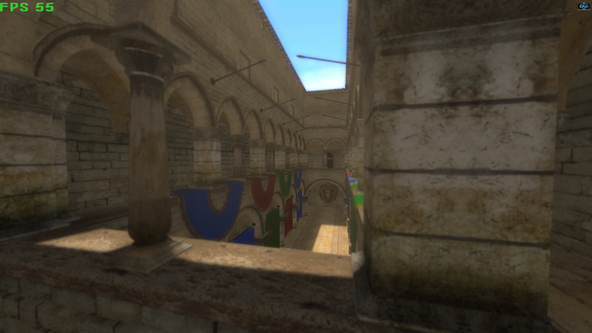

# T850

<div align="center">

[](https://github.com/0Camus0/T850/actions/workflows/build.yml)
&nbsp;&nbsp;
&nbsp;&nbsp;
&nbsp;&nbsp;

**A C++23 rendering/game engine with four graphics backends, JSON render graphs, glTF/PBR, animation, Jolt physics, Recast/Detour navigation, gameplay simulation, and a built-in scene editor.**



</div>

## What Is Implemented

### Rendering

- D3D11, D3D12, OpenGL, and Vulkan peer backends on Windows.
- Vulkan runtime on Android and Steam Deck/Linux.
- JSON-driven render graph with deferred shading and post processing.
- PBR metallic/roughness materials, IBL, shadows, SSAO, HDR/tone mapping, bloom, depth of field, God Rays, parallax/self-shadowing, lens flare, and vignette.
- Shader permutations, disk caches, reflection, and D3D12/Vulkan PSO caches.
- Deterministic render-target/frame dumps and same-API visual regression comparison.

### Assets and Animation

- `.gltf` and `.glb`, including Draco compression and supported material extensions.
- Legacy `.x` loading remains available in the engine.
- Parallel image/geometry work, MikkTSpace tangents, mesh/material pools and caches.
- Skeletal animation with GPU RGBA32F bone textures, snapshots, wireframe, and skeleton visualization.
- Environment/IBL loading and generated caches.

### Simulation and Gameplay

- Jolt static/dynamic/kinematic bodies, triangle mesh cooking/cache, gameplay collision layers, filtered casts/overlap, characters, and ragdolls.
- Recast NavMesh build/cache/bake, Detour path queries, volumes, area costs, and authored/generated traversal links.
- Scene-owned fixed-tick gameplay system with stable IDs, components, controllers, movement intents, queued events, state machines, physics/navigation facades, path following, groups/formations/flocking, and RTS/FPS examples.
- 39 CLI self-tests for schema, validation, lifecycle, events, tick semantics, state machines, physics, mutable meshes, voxel terrain, and navigation fallback.

### T8ditor

- Multi-object scene authoring, cameras, lights, transforms, splines, physics, navigation, ragdolls, profiles, and render controls.
- Game entity/group hierarchy and inspectors for identity, control, links, components, behavior, formation/flock settings, and simulation settings.
- Validation panel with jump-to-entity/group and validation before Play.
- Editor overlays for game labels/state, health, sensor/combat radii, and groups.
- Whole-scene undo/redo plus transform/group commands.
- Fidelity Play exports a temporary `.t8scene` and loads it through the real SceneTemplate serializer/runtime path.
- Direct CLI supports D3D11, D3D12, OpenGL, and Vulkan on Windows. The WPF launcher maps editor launches to D3D12/Vulkan on x64 and ARM64, and D3D11/Vulkan on Win32.

## Quick Start: Windows

Prerequisites:

- Visual Studio 2022 with Desktop development with C++ and v143;
- Windows SDK;
- Git and PowerShell;
- internet access for first-time vcpkg and cloud assets.

From the repository root:

```powershell
.\LaunchSolution.bat --setup-only
Set-Location .\T850
.\scripts\build.ps1 -Config Release -Platform x64
```

Run DayScene:

```powershell
Set-Location .\bin\x64\Release
.\DayScene.exe --api d3d11 --scene 1
```

Run an authored scene:

```powershell
.\DayScene.exe --api d3d12 --scene 4 --sceneFile Scenes/DayScene.t8scene
```

Run T8ditor:

```powershell
.\T8ditor.exe --api d3d12 --sceneFile Scenes/DayScene.t8scene
```

Open the developer launcher:

```powershell
Set-Location ..\..\..
.\scripts\Launcher.ps1
```

Full guide: [Windows setup, build, and run](documentation/development/windows-build-and-run.md).

## Runtime Hosts

`DayScene.exe` contains six selectable hosts:

| Index | Host | Typical use |
|---:|---|---|
| 0 | SandboxScene | isolated model/material/animation inspection |
| 1 | DayScene | Sponza demo, full renderer, benchmarks |
| 2 | Quake3Mock | legacy Q3 compatibility/experiments |
| 3 | RagdollEditor | animated model and runtime ragdoll work |
| 4 | SceneTemplate | authored `.t8scene`, gameplay, physics, navigation |
| 5 | VoxelScene | generated mutable chunks, grounded FPS, streaming and block edits |

Use `DayScene.exe --help` for the current CLI. See [Runtime hosts](documentation/runtime/runtime-hosts.md) and [Runtime configuration](documentation/development/runtime-configuration.md).

## Build Matrix

Primary Windows commands, from `T850/`:

```powershell
.\scripts\build.ps1 -Config Debug   -Platform x64
.\scripts\build.ps1 -Config Release -Platform x64
.\scripts\build.ps1 -Config Debug   -Platform ARM64
.\scripts\build.ps1 -Config Release -Platform ARM64
```

Run the exact local Windows PR/CI matrix, including full-solution builds and all runnable self-tests:

```powershell
.\scripts\RunWindowsBuildMatrix.ps1
```

Outputs:

```text
T850/Lib/<Config>/<Platform>/Framework.lib
T850/Lib/<Config>/<Platform>/FrameworkImGui.lib
T850/bin/<Platform>/<Config>/DayScene.exe
T850/bin/<Platform>/<Config>/T8ditor.exe
```

MSBuild/`.vcxproj` is primary on Windows. Android and Steam Deck use CMake; new Framework sources must be registered in both systems.

## Tests and Visual Regression

Gameplay self-tests:

```powershell
Set-Location T850
& .\bin\x64\Release\DayScene.exe --game-selftest
```

Expected: 39 `PASS` lines and exit code 0.

Full deterministic candidate capture and comparison:

```powershell
.\scripts\CaptureVisualBaselines.ps1 -RunSet candidate -Force -ContinueOnError
.\scripts\CompareVisualBaselines.ps1 -Tolerance 2 -OutputPath .\VisualBaselines\final-comparison.json
```

The accepted 2026-08-19 matrix has 26 comparable 1280x720 captures and zero failures. Hardware/missing-asset skips remain explicit in manifests.

See [Verification gates](documentation/testing/verification.md) and [Visual regression](documentation/debug/visual-regression.md).

## Android

One-time setup from the repository root:

```powershell
.\SetupAndroidToolchain.bat
```

Build/install/launch ARM64 Debug:

```powershell
.\T850\scripts\android\BuildAndroid.bat Debug --abi arm64-v8a --install --launch
```

Local Release builds require signing by default. The fast APK script repacks a previously built APK and debug-keystore signs it; it is a development path, not production publishing.

See [Android build and deployment](documentation/platform/android.md).

## Steam Deck

On a Podman-capable Linux/Deck host:

```bash
cd T850
./steamdeck/BuildSteamRuntime.sh --configuration Release
./steamdeck/T850.sh --game-mode --scene 1
./steamdeck/PackageSteamDeckRelease.sh --configuration Release --skip-build
```

The official build uses Valve SteamRT `sniper`, Clang 16, and libc++. A Windows SSH orchestrator can prepare/build/deploy/run on a remote Deck.

See [Steam Deck build and deployment](documentation/platform/steam-deck.md).

For a local Windows-to-Deck development update, configure ignored `deckConfig.json` and run `./UpdateSteamDeck.ps1`. Add `-Run` to launch the updated Minecraft scene after the SteamRT build.

## Cloud Assets

Download runtime assets:

```powershell
.\LaunchSolution.bat --assets-only
```

Download all cloud models:

```powershell
.\LaunchSolution.bat --all-models --assets-only
```

Downloads validate size/SHA-256 when present and atomically replace missing/invalid files. See [Cloud asset workflow](documentation/development/cloud-assets.md).

## CI and Releases

`.github/workflows/build.yml` builds:

- Windows Win32/x64/ARM64 crossed with Debug/Release;
- Android arm64-v8a and x86_64 Release APKs;
- Steam Deck SteamRT Release and tarball package.

A `v*` tag creates a GitHub Release containing Windows ZIPs, Android APKs, the Steam Deck tarball, and the compiled launcher.

## Repository Layout

```text
documentation/                 Current authoritative documentation
T850/
  T850.sln                     Windows solution
  Framework/                   Core rendering/game/physics/navigation library
  FrameworkImGui/              Reusable ImGui layer
  DayScene/                    Runtime executable and scene hosts
  T8ditor/                     Editor executable
  Assets/                      Authored and downloaded runtime resources
  scripts/                     Build, launcher, asset, dump, comparison tools
  android/                     Gradle/NativeActivity project
  steamdeck/                   SteamRT build/run/package/launcher scripts
```

## Documentation

Start with [Documentation index](documentation/README.md) and [Current status](documentation/current-status-and-roadmap.md). For local agents, the workspace skills route build/run, visual regression, and platform deployment into focused procedures.

## License

See [LICENSE.md](LICENSE.md).
