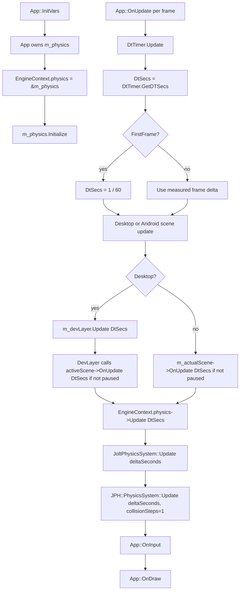
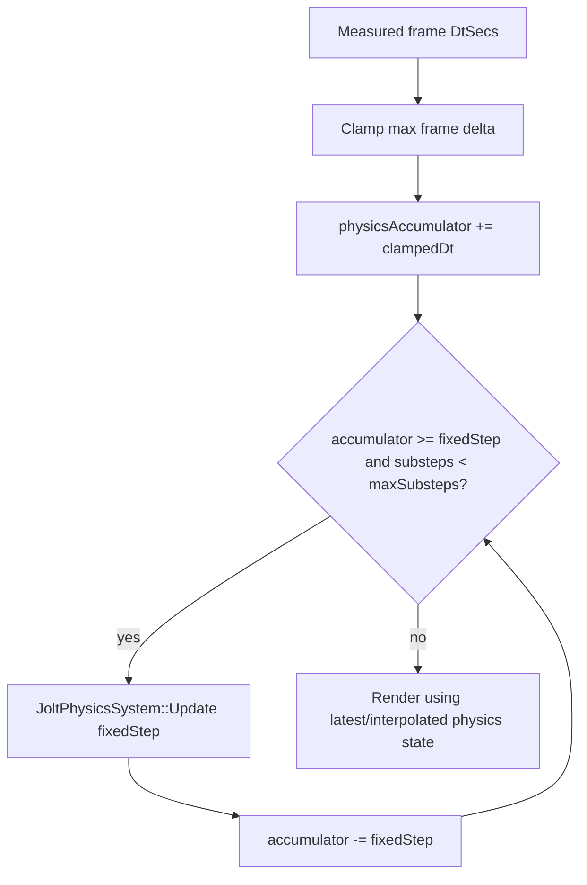

# Physics update flow

This describes the current Jolt integration update path.

## Short answer

- Jolt is owned by `App` through `App::m_physics`.
- `App::InitVars()` stores that system in `EngineContext.physics`.
- `App::OnUpdate()` computes a frame delta from `DtTimer.GetDTSecs()`.
- The first frame is forced to `1.0f / 60.0f`.
- After the scene update path, `App::OnUpdate()` calls `EngineContext.physics->Update(DtSecs)`.
- `JoltPhysicsSystem::Update(deltaSeconds)` passes that same value directly to `JPH::PhysicsSystem::Update`.
- There is no fixed timestep accumulator yet. Current behavior is variable/real frame delta, except for the first frame.

## Current call flow



## Where the update is in code

| Responsibility | Location |
| --- | --- |
| Physics ownership | `DayScene/Application.h` has `t850::JoltPhysicsSystem m_physics` |
| Core pointer wiring | `DayScene/Application.cpp`, `App::InitVars()`: `engineContext.physics = &m_physics` |
| Delta source | `DayScene/Application.cpp`, `App::OnUpdate()`: `DtTimer.Update()` then `DtTimer.GetDTSecs()` |
| First frame clamp | `DayScene/Application.cpp`, `App::OnUpdate()`: `DtSecs = 1.0f / 60.0f` when `FirstFrame` |
| Desktop scene update | `Framework/src/core/DevLayer.cpp`, `DevLayer::Update(float dt)` calls `m_activeScene->OnUpdate(dt)` |
| Android scene update | `DayScene/Application.cpp`, `App::OnUpdate()` calls `m_actualScene->OnUpdate(DtSecs)` directly |
| Physics step | `DayScene/Application.cpp`, `App::OnUpdate()` calls `EngineContext.physics->Update(DtSecs)` |
| Jolt step | `Framework/src/physics/JoltPhysicsSystem.cpp`, `JoltPhysicsSystem::Update(float deltaSeconds)` calls `m_impl->physicsSystem.Update(deltaSeconds, collisionSteps, ...)` |

## Is physics part of DevLayer?

No. DevLayer is only in the desktop scene update path. On desktop, `App::OnUpdate()` calls `m_devLayer.Update(DtSecs)`, and DevLayer forwards to `activeScene->OnUpdate(DtSecs)` when not paused. Physics is then stepped after that through `EngineContext.physics`.

On Android there is no DevLayer path; `App::OnUpdate()` calls the active scene directly, then steps physics the same way.

## Current timestep behavior

Current behavior is:

```cpp
physics->Update(DtSecs);
```

and inside the physics system:

```cpp
constexpr int collisionSteps = 1;
m_impl->physicsSystem.Update(deltaSeconds, collisionSteps, &m_impl->tempAllocator, &m_impl->jobSystem);
```

That means Jolt receives the real measured frame delta. There is currently no accumulator such as:

```cpp
while (accumulator >= fixedStep) {
  physics->Update(fixedStep);
  accumulator -= fixedStep;
}
```

## Recommended next change

For ragdolls, character physics, and deterministic-feeling simulation, the Framework should move to a fixed physics tick, for example `1 / 60` or `1 / 120`, with an accumulator and a max substep cap. Rendering can stay variable-rate, while physics advances in fixed slices.

Recommended future flow:


