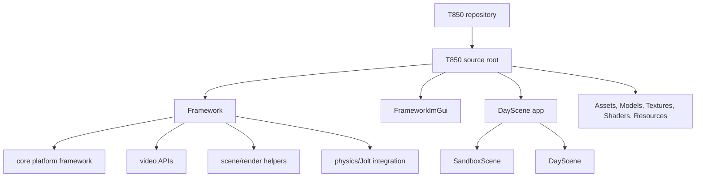

# T850 architecture documentation

This directory documents the current engine architecture. Paths are relative to the repository root, where engine source code lives under `T850\`.

## Documents

| Document | Scope |
| --- | --- |
| [Framework](framework.md) | Application lifecycle, core interfaces, platform hosts, services, and ownership. |
| [Graphics layer](graphics-layer.md) | Driver abstraction, render graph, API backends, shaders, resources, frame pacing, and debugging hooks. |
| [Scene, meshes, and physics](scene-meshes-physics.md) | Scene file formats, mesh loading, material/asset flow, Jolt physics, collision, and ragdoll synchronization. |

## High-level map

The engine is intentionally split between a reusable framework (`T850\Framework`) and the current sample/product application (`T850\DayScene`). Android is not a separate renderer: it is a platform host that drives the same app and Vulkan graphics path with Android-specific window, input, resource, and lifecycle glue.
