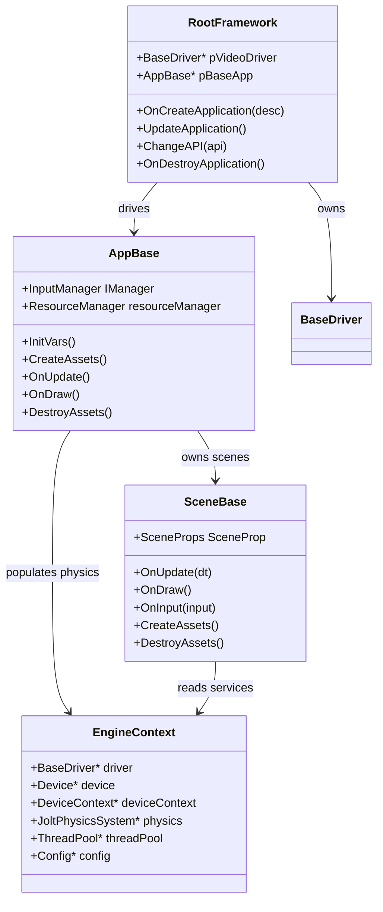
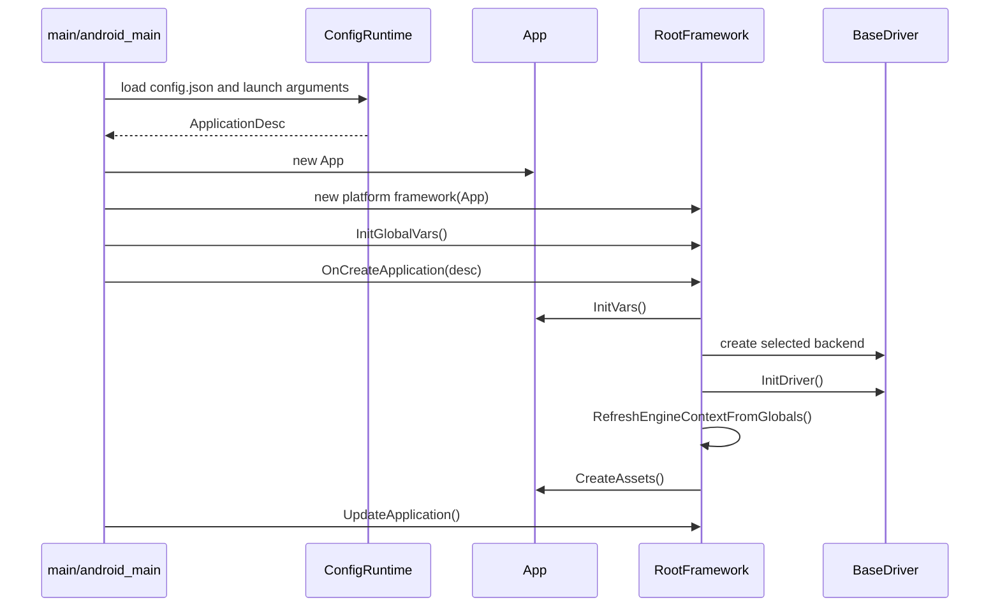
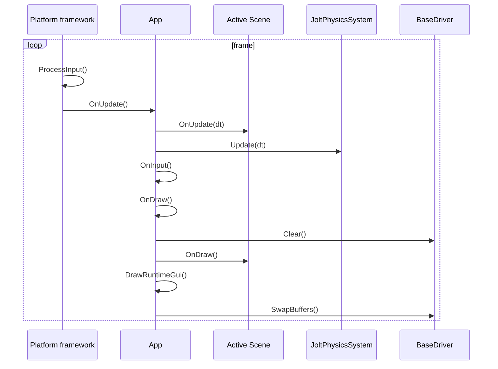
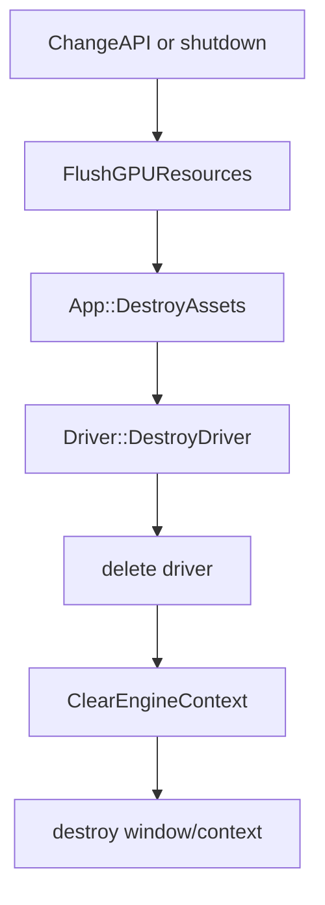

# Framework architecture

This document explains the reusable T850 framework: application ownership, platform hosts, lifecycle, input, runtime services, and how `DayScene` plugs into the engine.

## Source layout

| Area | Main paths | Purpose |
| --- | --- | --- |
| Core contracts | `T850\Framework\include\core\Core.h` | Defines `AppBase`, `SceneBase`, and `RootFramework`. |
| Runtime context | `T850\Framework\include\core\EngineContext.h`, `T850\Framework\src\core\EngineContext.cpp` | Shared pointer bundle for driver, device, physics, thread pool, and config. |
| Platform hosts | `T850\Framework\src\core\windows\Win32Framework.cpp`, `T850\Framework\src\core\android\AndroidFramework.cpp`, `T850\Framework\src\core\LinuxFramework.cpp` | Own window/native lifecycle and create the selected graphics driver. |
| App implementation | `T850\DayScene\App.cpp`, `T850\DayScene\AndroidEntry.cpp`, `T850\DayScene\Application.cpp`, `T850\DayScene\Application.h` | The concrete app that owns scenes, physics, ImGui, dev UI, and frame update/draw. |
| Config/runtime | `T850\Framework\include\core\Config.h`, `T850\Framework\include\utils\ConfigRuntime.h`, `T850\Framework\src\utils\ConfigRuntime.cpp` | Loads `config.json`, applies CLI/Android launch extras, validates, and builds `ApplicationDesc`. |
| Resources | `T850\Framework\include\utils\ResourceLocator.h`, `T850\Framework\src\utils\ResourceLocator.cpp` | Resolves files from disk or Android assets. |
| Input | `T850\Framework\include\utils\InputManager.h`, platform framework files | Normalizes keyboard, mouse, touch, text, and scroll input into `InputManager`. |

## Core ownership model

The framework is built around three interfaces:

| Type | Defined in | Role |
| --- | --- | --- |
| `t850::AppBase` | `Core.h` | Application contract. The framework calls `InitVars`, `CreateAssets`, `OnUpdate`, `OnDraw`, `OnInput`, `OnPause`, `OnResume`, `DestroyAssets`, and `LoadScene`. It also owns `InputManager` and `ResourceManager`. |
| `t850::SceneBase` | `Core.h` | Scene contract. A scene receives input, updates, draws, loads/destroys scene content, can expose dev UI, and receives `EngineContext`. |
| `t850::RootFramework` | `Core.h` | Platform host contract. It owns the graphics driver and calls the app lifecycle. Implementations are Windows, Linux, and Android. |



`EngineContext` is the bridge between systems that do not directly own each other. After a graphics driver is created, `RefreshEngineContextFromGlobals()` stores the current `BaseDriver`, `Device`, and `DeviceContext`. `Application.cpp` stores the app-owned `JoltPhysicsSystem` into the same context before scenes are initialized.

## Startup flow

Desktop starts at `T850\DayScene\App.cpp`. Android starts at `T850\DayScene\AndroidEntry.cpp`, then constructs the same `App` class and an `AndroidFramework`.



### Desktop path

`Win32Framework::OnCreateApplication()` initializes the global thread pool and SDL video, calls `App::InitVars()`, then calls `ChangeAPI(desc.api)`.

`Win32Framework::ChangeAPI()` is the central desktop graphics bootstrap:

1. If an API is already running, flush GPU resources, destroy app assets, destroy the old driver, and clear the engine context.
2. Destroy the old SDL window/GL context if needed.
3. Create an SDL window with API-specific flags.
4. Construct the selected backend: `GLDriver`, `D3D12Driver`, `VulkanDriver`, or D3D11 fallback.
5. Set dimensions/window, initialize the driver, refresh `EngineContext`, create app assets, and build pipeline objects.

The desktop loop is simple: `ProcessInput()` then `pBaseApp->OnUpdate()` until `m_alive` is false.

### Android path

Android is Vulkan-only. `AndroidFramework::OnCreateApplication()` forces `GraphicsApi::VULKAN`, initializes the thread pool, calls `App::InitVars()`, and waits for a native window.

The Vulkan runtime is created lazily in `OnNativeWindowCreated()`:

1. Store the current `ANativeWindow`.
2. Notify the app via `AppBase::OnAndroidNativeWindowChanged()`.
3. Create or resume the Vulkan runtime.
4. Initialize the driver, refresh `EngineContext`, create app assets, and build pipelines.

When Android destroys the surface, `OnNativeWindowDestroyed()` clears touch state, notifies the app with a null window, and suspends Vulkan window resources without tearing down the entire app object unless the activity is actually destroyed.

```mermaid
flowchart TD
  A[NativeActivity created] --> B[AndroidFramework::OnCreateApplication]
  B --> C[App::InitVars]
  C --> D{Native window exists?}
  D -- no --> E[wait in looper]
  D -- yes --> F[OnNativeWindowCreated]
  F --> G[CreateVulkanRuntime or ResumeVulkanWindow]
  G --> H[App::CreateAssets]
  H --> I[active frame loop]
  I --> J{APP_CMD_TERM_WINDOW}
  J -- yes --> K[App::OnAndroidNativeWindowChanged(null)]
  K --> L[SuspendVulkanWindow]
  L --> E
```

The app-specific Android hook matters because subsystems such as ImGui also hold the native window. When Android recreates the surface, the framework must tell the app so those subsystems drop stale window pointers before the old `ANativeWindow` becomes invalid.

## Application lifecycle

`App` in `T850\DayScene\Application.cpp` is the concrete `AppBase` implementation.

| Method | Key work |
| --- | --- |
| `InitVars()` | Starts timers, creates `SandboxScene` and `DayScene`, initializes Jolt physics, injects `EngineContext` into scenes, selects the active scene, initializes desktop dev layer, and creates a default camera. |
| `CreateAssets()` | Creates active scene assets, text renderer, primitive manager, fade quad, ImGui runtime UI, Android GUI settings, render trace/profiler when enabled, and initial fade. |
| `OnUpdate()` | Updates frame delta, updates dev layer or active Android scene, steps physics, handles input, then draws. |
| `OnDraw()` | Begins profiling/tracing, clears the driver, draws the active scene or dev layer, draws fade overlay, draws runtime GUI, and presents after the first frame. |
| `DestroyAssets()` | Destroys profiler/tracer, dev layer, ImGui, text/primitives, active scene assets, mesh/material caches, physics, and clears `EngineContext.physics`. |
| `LoadScene(id)` | Fades out, destroys the old scene runtime state, switches scene, calls `OnLoadScene()`, updates dev layer, fades in. |



## Input model

Input is normalized into `AppBase::IManager`.

Desktop input is handled in `Win32Framework::ProcessInput()` using SDL events:

- Keyboard state maps through `SDL3KeyToSTDKEY`.
- Escape exits unless the app reports a modal UI through `IsModalActive()`.
- Mouse buttons, wheel, cursor position, deltas, and UTF-8 text input are copied into `InputManager`.

Android input is handled in `AndroidFramework::OnInputEvent()`:

- The app gets first chance through `HandleAndroidInputEvent()`, used by ImGui and app-specific Android UI.
- Touch is mapped to mouse-like position/delta/button state.
- Multi-touch pinch updates scroll-style input.
- Back key/close handling routes through framework close requests.

## Runtime services

| Service | Files | Notes |
| --- | --- | --- |
| Logging | `T850\Framework\include\utils\Log.h` | Console, file, and Windows debug output backends. Session tag uses the active API. |
| Config | `Config.h`, `ConfigRuntime.*` | Loads defaults, JSON config, CLI arguments, Android launch extras, validation, and `ApplicationDesc`. |
| Resource location | `ResourceLocator.*` | Resolves read/write/cache paths. On Android, reads packaged assets through the asset manager. |
| Runtime profile | `RuntimeProfile.*` | Scores platform/architecture/GPU profiles and selects scene quality/profile overrides. |
| Timers | `Timer.*` | Provides frame delta and fade timing. |
| Thread pool | `ThreadPool.*` | Global worker pool initialized by platform frameworks. |
| ImGui | `T850\FrameworkImGui` | Runtime UI layer. On Android it must track native window lifetime. |
| Dev layer | `T850\Framework\include\core\DevLayer.h` | Desktop editor/debug layer that wraps scene update/draw/input. Android draws scenes directly. |
| Profiler/frame dump/render trace | `T850\Framework\include\debug` | Optional instrumentation controlled by config/compile flags. |

## Platform comparison

| Platform | Framework | Window/input | Graphics APIs |
| --- | --- | --- | --- |
| Windows | `Win32Framework` | SDL3 window/events plus Win32 cursor/icon helpers | Vulkan, D3D12, D3D11, OpenGL when compiled. |
| Android | `AndroidFramework` | `android_native_app_glue`, `ANativeWindow`, `AInputEvent` | Vulkan only. |
| Linux | `LinuxFramework` | Linux/GL setup path | OpenGL-oriented path with similar app lifecycle. |

The application code is shared. Differences should stay in the platform framework, resource locator, and low-level graphics backend. If Android and Windows behave differently at scene level, first check launch config/profile selection and asset packaging before assuming the scene is rebuilt differently.

## Shutdown and API switching

Desktop API switching and shutdown intentionally flush GPU resources before scene destruction. This protects explicit APIs where descriptors, command buffers, and staging resources may still reference scene objects.



On Android, surface loss is not the same as app destruction. Surface loss suspends window-dependent Vulkan resources; activity destruction calls `DestroyVulkanRuntime()`, shuts down the thread pool, and clears framework state.

## Adding a new app or scene

To add another app, implement `AppBase` and construct it from the platform entry point. To add another scene to the current app:

1. Implement a `SceneBase` subclass.
2. Create it in `App::InitVars()`.
3. Assign `pFramework` and `EngineContext`.
4. Implement `InitVars`, `CreateAssets`, `OnUpdate`, `OnDraw`, `OnInput`, and `DestroyAssets`.
5. Add selection logic in config/launcher if it should be user-selectable.

The important rule is ownership: the platform owns the driver, the app owns scenes and physics, and scenes borrow shared services through `EngineContext`.
