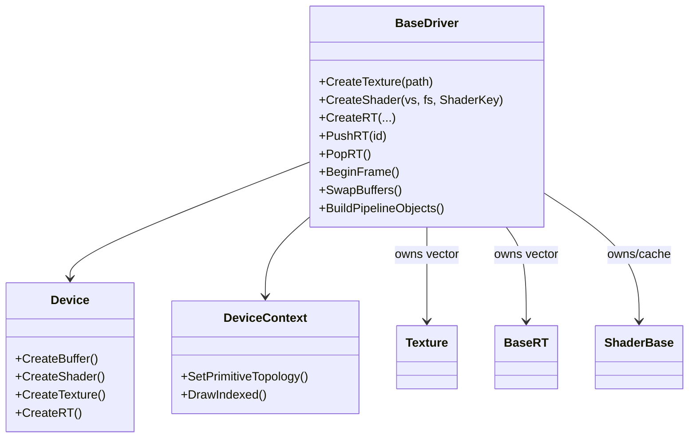
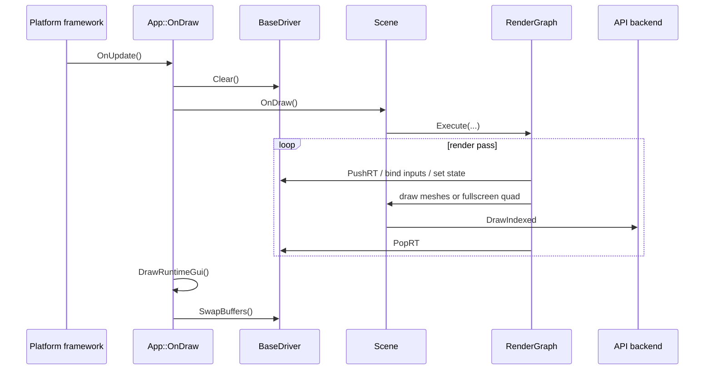
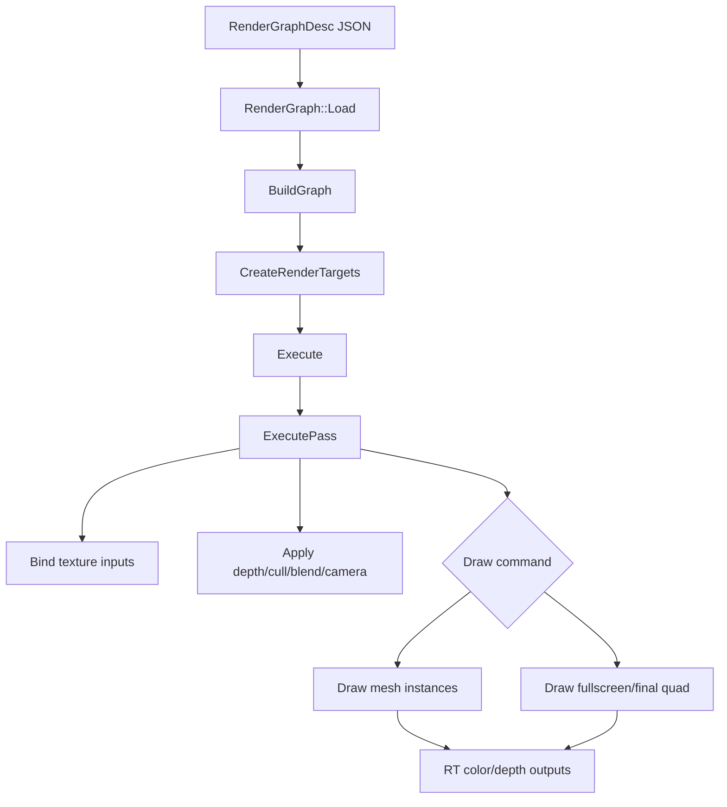
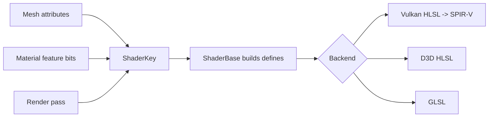
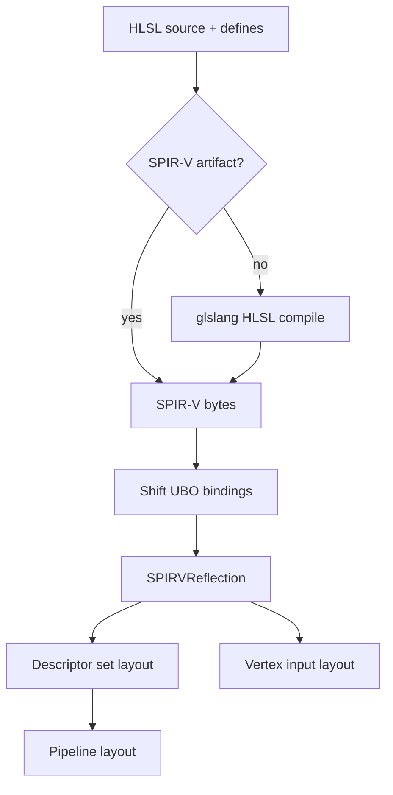
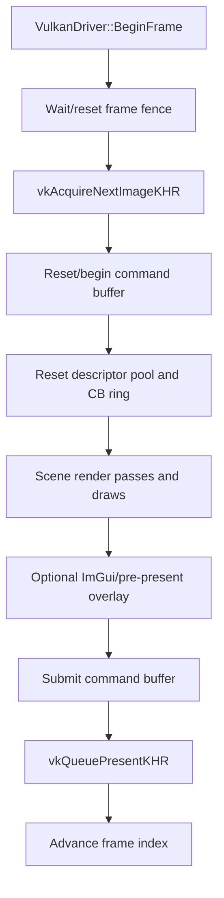
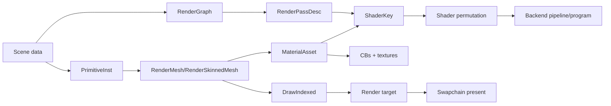

# Graphics layer architecture

This document explains the rendering layer: the API abstraction, backend implementations, render graph, shader/material system, frame lifecycle, Android Vulkan specifics, and debug/performance tools.

## Source layout

| Area | Main paths | Purpose |
| --- | --- | --- |
| API abstraction | `T850\Framework\include\video\BaseDriver.h`, `T850\Framework\src\video\BaseDriver.cpp` | Shared driver/device/resource interfaces and common caches. |
| Vulkan backend | `T850\Framework\include\video\vulkan`, `T850\Framework\src\video\vulkan` | Main explicit backend for Windows and Android. |
| D3D12 backend | `T850\Framework\include\video\d3d12`, `T850\Framework\src\video\d3d12` | Explicit Windows backend. |
| D3D11 backend | `T850\Framework\include\video\d3d11`, `T850\Framework\src\video\d3d11` | Legacy/immediate Windows backend. |
| OpenGL backend | `T850\Framework\include\video\gl`, `T850\Framework\src\video\gl` | GL/GLSL backend. |
| Render graph | `T850\Framework\include\scene\RenderGraph*.h`, `T850\Framework\src\scene\RenderGraph.cpp` | Data-driven render pass DAG. |
| Materials | `T850\Framework\include\scene\MaterialAsset.h`, `T850\Framework\src\scene\MaterialAssetCache.cpp` | Deduplicated material parameters, feature keys, and texture slots. |
| Mesh drawing | `T850\Framework\include\scene\RenderMesh.h`, `RenderSkinnedMesh.h`, `PrimitiveInstance.h` | Draw-time geometry, constant buffers, skinning, and per-instance state. |
| Shaders | `T850\Shaders`, `ShaderBase`, backend shader files, `SPIRVReflection.*` | HLSL/GLSL source, permutation defines, compilation, reflection, and binding. |

## Core abstraction

`BaseDriver.h` defines the engine-facing rendering API.

| Type | Responsibility |
| --- | --- |
| `BaseDriver` | Owns textures, render targets, shaders, techniques, current render target, and API-independent render states. Exposes frame, swapchain, resource, and explicit-API hooks. |
| `Device` | Creates API resources: buffers, shaders, textures, cubemaps, float textures, render targets. |
| `DeviceContext` | Binds current resources and submits draw calls. Tracks actual constant buffer, vertex buffer, index buffer, and shader. |
| `Buffer`, `VertexBuffer`, `IndexBuffer`, `ConstantBuffer` | API resource wrappers with system-memory update support. |
| `Texture` | Loads 2D/cube/float textures and binds them to shader slots. |
| `BaseRT` | Render target wrapper with color/depth attachments and generated texture outputs. |
| `ShaderBase` | Common shader creation entry point. Builds `ShaderKey` defines before calling backend shader compilation. |

The abstraction is not a full modern render hardware interface. It is a pragmatic wrapper around the operations T850 needs: create resources, bind them by slot, switch render targets, draw primitives, and present.

## Frame lifecycle

The platform framework owns the outer loop. The app drives rendering inside `App::OnDraw()`.

Explicit APIs such as Vulkan and D3D12 use `BeginFrame`, command infrastructure, descriptor/constant-buffer allocation, and pipeline objects behind the common calls. Immediate-style APIs do more work directly in `Set`/`Draw`/`SwapBuffers`.

## Render graph

`RenderGraph` is a data-driven directed acyclic graph of render passes. It loads a `RenderGraphDesc` from JSON, creates render targets, resolves texture dependencies, and executes passes in order.

Important structures:

| Type | File | Meaning |
| --- | --- | --- |
| `RTDesc` | `RenderGraphDescriptor.h` | Declares named render targets, color/depth formats, dimensions, mips, and size references. |
| `TextureInput` | `RenderGraphDescriptor.h` | Connects pass inputs to another pass output, e.g. `GBuffer:DEPTH`, or built-ins like `@environment_map`. |
| `RenderPassDesc` | `RenderGraphDescriptor.h` | Declares target, clear behavior, state overrides, camera, texture inputs, draw commands, cubemap loops, and pop/push behavior. |
| `GraphNode` | `RenderGraph.h` | Runtime pass node with resolved render target and adjacency. |
| `GraphEdge` | `RenderGraph.h` | Runtime texture dependency between passes. |

Pass type is encoded in `ShaderKey::getPass()` and converted to shader defines by `ShaderBase::CreateShader()`. Common pass defines include:

- `G_BUFFER_PASS`
- `SHADOW_MAP_PASS`
- `DEFERRED_PASS`
- `SHADOW_COMP_PASS`
- `VERTICAL_BLUR_PASS` / `HORIZONTAL_BLUR_PASS`
- `BRIGHT_PASS`
- `HDR_COMP_PASS`
- `DOF_PASS`
- `SSAO_PASS`
- `DEFERRED_LIGHT_VOLUME_PASS`
- `BACKBUFFER_PASS`

## Shader permutation system

The engine uses `ShaderKey` to describe both mesh/material features and the current pass. `ShaderBase::CreateShader()` converts the key to preprocessor defines before calling the backend compiler.

Feature groups include:

| Group | Example defines |
| --- | --- |
| Vertex attributes | `USE_NORMALS`, `USE_TEXCOORD0..3`, `USE_TANGENTS`, `USE_BINORMALS` |
| Texture maps | `DIFFUSE_MAP`, `SPECULAR_MAP`, `GLOSS_MAP`, `NORMAL_MAP`, `METALLIC_MAP`, `EMISSIVE_MAP`, `CLEARCOAT_MAP`, `OCCLUSION_MAP`, `LIGHTMAP_MAP` |
| Material conventions | `GLTF_TANGENT_SPACE` |
| Skinning | `USE_SKINNING`, `USE_SKINNING_QT`, `USE_SKINNING_TEXTURE` |
| Effects | `ENABLE_PARALLAX`, `ENABLE_SHADOWS`, `ENABLE_SSAO`, `ENABLE_GOD_RAYS`, `AUTO_FOCUS` |
| Special modes | `NO_LIGHT`, `OMNIDIRECTIONAL_SH` |
| Pass type | One of the pass defines listed above. |

### Techniques

`Technique` and `TechniqueInfo` parse XML technique files. A technique can contain global defines and multiple profiles such as HLSL, GLES, and GL. Runtime code can load a technique through `BaseDriver::CreateTechnique()` and select a profile with `Technique::UseProfile()`.

### Vulkan shader path

`VulkanShader.cpp` handles the Vulkan shader path:

1. Try to load precompiled SPIR-V from `Shaders\spirv` when names and keys are available.
2. If missing, compile HLSL to SPIR-V using glslang.
3. Shift UBO bindings by `VulkanShader::kMaxTextureSlots` so uniform buffers do not collide with texture binding slots.
4. Parse SPIR-V through `SPIRVReflection`.
5. Build descriptor set layout and pipeline layout.
6. Derive vertex input layout from reflected stage inputs.

On Windows, generated SPIR-V can be stored in `ShaderDiskCache` using a key that includes backend, driver signature, `ShaderKey`, shader names, and source text. On Android, runtime can use packaged precompiled SPIR-V and still falls back to runtime compilation if available.

## Materials and texture binding

`MaterialAsset` is the shader-facing material unit. It stores:

- A stable content hash for deduplication.
- `ShaderKey featureKey` for material feature bits.
- Texture pointers and texture IDs for `MatTexSlot` entries.
- A `MaterialParams` POD block mirroring the material constants consumed by mesh shaders.

`MaterialAssetCache` deduplicates identical materials by hash plus content equality. This lets multiple mesh subsets share the same material object without relying on pointer identity.

Material and environment slots are coordinated with the render graph:

| Slot group | Header | Examples |
| --- | --- | --- |
| Environment slots | `RenderGraph.h` | Diffuse IBL, specular IBL, BRDF LUT, Charlie IBL/LUT, sheen LUT. |
| Material extension slots | `RenderGraph.h`, `MaterialAsset.h` | Sheen, clearcoat, occlusion, specular factor/color, transmission, lightmap. |
| Bone texture slot | `RenderGraph.h` note | Slot 24 is reserved for skinned bone textures. |

## Backend specifics

### Vulkan

Vulkan is the most important backend because Android uses it exclusively.

Key classes:

| Class | Purpose |
| --- | --- |
| `VulkanDriver` | Instance/device/surface/swapchain, command buffers, sync, descriptor pools, render passes, frame lifecycle, pipeline cache. |
| `VulkanDevice` | Resource factory. |
| `VulkanDeviceContext` | Current command buffer, topology, and draw submission. |
| `VulkanShader` | SPIR-V modules, reflection, descriptor layout, pipeline layout, vertex input. |
| `VulkanTexture`, `VulkanRT`, `VulkanConstantBuffer`, `VulkanVertexBuffer`, `VulkanIndexBuffer` | API resource wrappers. |

Important implementation details:

- Triple-buffering uses `VulkanDriver::kBackBufferCount = 3`.
- Swapchain creation chooses surface format, present mode, image count, pre-transform, composite alpha, and usage flags.
- Android uses FIFO present mode; desktop prefers immediate, then mailbox, then FIFO.
- Backbuffer has clear and load render pass variants so rendering can return to the swapchain after offscreen passes.
- Descriptor pools are per frame in flight and reset in `BeginFrame()`.
- Constant buffers are uploaded into a 64 MB per-frame ring buffer.
- Descriptor sets are cached per frame by layout and texture fingerprint.
- VMA is used for Vulkan memory allocation.
- Pipelines are lazy-created and cached by shader plus blend/depth/cull/attachment state.
- Staging resources are deferred until the frame slot is safe to reuse.
- `SetLatePresentSource()` can copy a rendered RT into the swapchain immediately before present.
- `SuspendWindowSurface()` and `ResumeWindowSurface()` support Android surface teardown/recreation.

Android swapchain behavior has two important rules:

1. `VK_SUBOPTIMAL_KHR` is ignored when Android reports it every frame but the extent did not change. Recreating the swapchain every frame destroys frame pacing.
2. Surface orientation/pre-transform is selected carefully. Some Samsung devices report a rotated current transform while the app wants a stable landscape coordinate system.

### D3D12

The D3D12 backend has explicit command infrastructure similar to Vulkan:

- DXGI factory and adapter/device selection.
- Command queue, allocators, command lists, and fences.
- Flip-discard swapchain and frame-latency waitable object.
- Optional tearing support.
- Swapchain resize flushes GPU work, releases back buffers, resizes, recreates RTV/DSV resources, and resets viewport state.
- Pipeline and heap support is split into `D3D12PipelineKey.h` and `D3D12Heap.*`.

### D3D11

D3D11 is an immediate-style backend:

- `ResizeSwapchain()` unbinds render targets, resizes buffers, recreates RTV/DSV, and resets viewport.
- `SwapBuffers()` uses `Present(0, 0)`.
- Resource binding is generally direct and less state-explicit than Vulkan/D3D12.

### OpenGL

The GL backend supports desktop GL and GLES-style compilation paths:

- `GLDriver` owns GL/EGL/SDL surface setup depending on platform/compile flags.
- `GLShader` compiles GLSL and links programs.
- `GLSLParser` extracts reflected attributes/uniforms for binding.
- Program binary cache support stores/reloads GL program binaries where available.

OpenGL is the only backend that reports `BaseDriver::UsesGLSL() == true` and `NeedsVFlip() == true`. Vulkan uses HLSL-to-SPIR-V and D3D-style top-left render convention.

## Render targets and post-processing

`BaseDriver::CreateRT()` allocates render targets through the active backend. `RenderGraph::CreateRenderTargets()` resolves graph declarations to driver RT handles.

Common pass families:

- Forward and G-buffer geometry.
- Shadow map and omnidirectional shadow map.
- SSAO.
- Bright pass and bloom blur.
- HDR composition and adaptive luminance.
- DOF/COC.
- God rays and radial depth.
- Deferred lighting and light volumes.
- Final backbuffer pass.

Render target dependencies are explicit graph edges. For example, a deferred lighting pass can consume G-buffer color attachments, depth, shadow maps, SSAO, and environment maps.

## Debugging and performance hooks

| Tool | Files | Purpose |
| --- | --- | --- |
| `Profiler` | `T850\Framework\include\debug\Profiler.h` | CPU/GPU frame profiling and report generation. |
| `FrameDumper` | `T850\Framework\include\debug\FrameDumper.h` | Dumps backbuffer/RT images for comparison. |
| `RenderTrace` | `T850\Framework\include\debug\RenderTrace.h` | Optional compile-time trace of render state, RTs, textures, and draws. |
| `ShaderPermutationDump` | `T850\Framework\include\utils\ShaderPermutationDump.h` | Records shader keys, names, and generated defines. Useful for baking/diagnosing permutations. |
| Offscreen debug | `BaseDriver` offscreen helpers | Creates offscreen targets and can save debug output paths. |

When diagnosing API parity, dump the same scene/profile/resolution on Windows and Android, then compare:

1. Active scene profile and config.
2. Shader permutation defines.
3. Render graph pass enablement.
4. Constant buffer values.
5. Texture bindings and material feature bits.
6. Render target outputs before final composition.
7. Swapchain/present behavior only after the offscreen outputs match.

## Mental model

The rendering path is:

Most rendering bugs are caused by one of four things: a different profile/config, a different shader key/define set, a different constant buffer/texture binding, or backend-specific lifetime/synchronization behavior.
