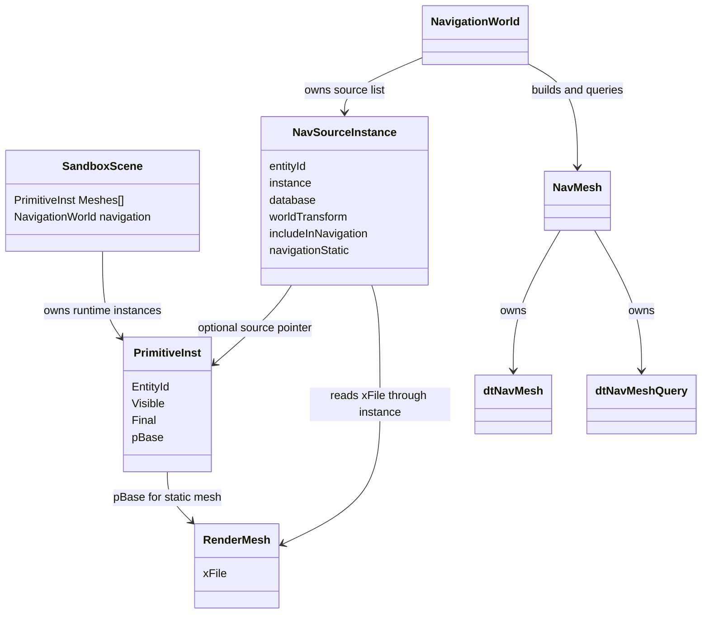
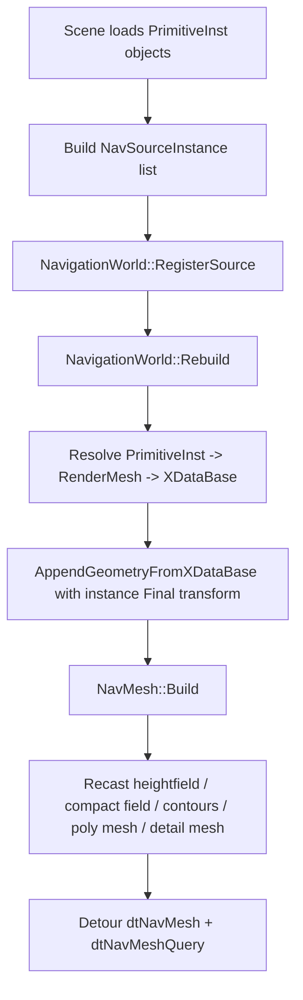
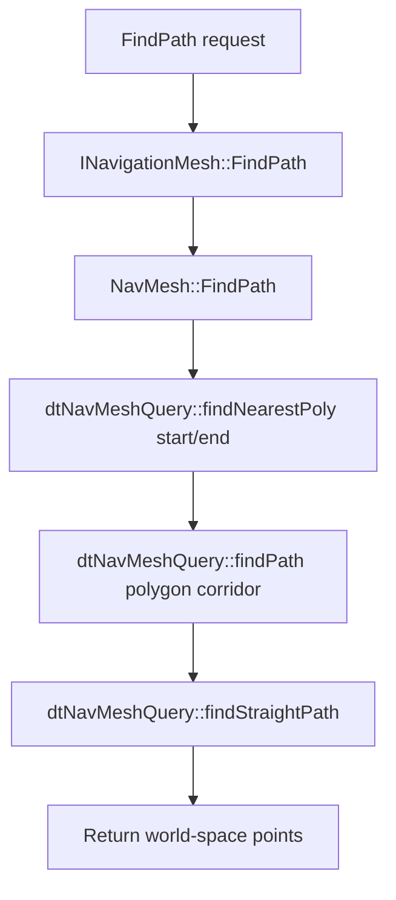

# Navigation architecture

This document describes the planned Framework navigation layer, how it relates to Recast/Detour, render meshes, scene entities, and how path search and source updates should work.

## Goals

- Keep game and scene code independent from raw Recast/Detour types.
- Build navmesh data from logical scene mesh instances, not only raw geometry.
- Preserve a Detour-backed path query implementation for `FindPath`.
- Allow later dynamic source updates, source removal, and full or partial rebuilds.
- Keep debug rendering separate from query/build logic.

## Main classes

| Class / struct | Layer | Responsibility |
| --- | --- | --- |
| `NavMeshGeometry` | Framework navigation data | Raw triangle soup: world-space vertices and triangle indices used by Recast. |
| `NavSourceInstance` | Framework navigation source | Logical source entity for navmesh building. Carries entity id, mesh database, optional `PrimitiveInst`, world transform, visibility, and nav flags. |
| `NavSourceBuildStats` | Framework navigation source | Reports how many runtime instances were considered, included, skipped as invisible, skipped as skinned/dynamic, or skipped as invalid. |
| `NavMeshBuildSettings` | Framework navigation config | Recast build parameters: cell size/height, agent dimensions, max climb/slope, region settings, and query extents. |
| `NavMeshBuildStats` | Framework navigation result | Build output counters: input vertices/triangles, Recast grid size, polygon count, detail triangle count. |
| `NavPathRequest` | Framework navigation query | Engine-facing path query input: start, end, and query extents. |
| `NavPathResult` | Framework navigation query | Engine-facing path query output: success flag, path points, and error string. |
| `INavigationMesh` | Framework interface | Common path-query interface. Scene/game code can query this without knowing Detour types. |
| `NavMesh` | Recast/Detour backend wrapper | Owns Detour `dtNavMesh` and `dtNavMeshQuery`, hides Detour from callers, and implements `INavigationMesh`. |
| `NavigationWorld` | Scene navigation owner | Owns logical nav sources and a built `NavMesh`. Supports register, remove, update, rebuild, and query operations. |
| `NavMeshDebugRenderer` | Debug rendering | Converts built navmesh data into debug line buffers. Does not own or mutate the navmesh. |

## Relationship to existing scene/render objects

`PrimitiveInst` is the runtime logical entity for a renderable mesh instance. It already has:

- `EntityId`
- visibility
- world transform (`Final`)
- render primitive pointer (`pBase`)
- physics/ragdoll handles

Navigation should treat `PrimitiveInst` as the default source of truth for static mesh contributions. `RenderMesh` and `xF::XDataBase` provide the triangle data, but the entity instance provides the transform, visibility, ownership, and future metadata.



## Build flow

Navigation build should start from scene/entity sources:



The initial implementation can rebuild the whole navmesh when sources change. Later, tile-based incremental rebuild can move into `NavigationWorld` using DetourTileCache.

## Finding a path

Scene/game code should call the interface, not raw Detour:

```cpp
t850::navigation::NavPathRequest request;
request.start = playerPosition;
request.end = targetPosition;

t850::navigation::NavPathResult result = navWorld.FindPath(request);
if (result.success) {
  // result.points contains straight-path waypoints in world space.
}
```

Internally:



## Multithreaded path queries

T850 already has a global engine thread pool (`t850::g_threadPool`) created during framework startup. Navigation batch queries use it by default:

```cpp
std::vector<t850::navigation::NavPathRequest> requests;
requests.push_back({bot0Position, targetPosition});
requests.push_back({bot1Position, targetPosition});

std::vector<t850::navigation::NavPathResult> results;
navWorld.FindPaths(requests, results); // fans out through the global thread pool
```

The important Detour threading rule is:

- `dtNavMesh` can be shared read-only after build.
- `dtNavMeshQuery` must not be shared across threads.

`NavMesh::FindPaths()` follows that rule by creating a separate `dtNavMeshQuery` for each batch item when it runs through the thread pool. That means 8 bots can submit 8 path requests, the pool can process them in parallel, and the caller receives all results after the batch joins.

If `FindPaths()` is called from a thread-pool worker, it falls back to sequential execution to avoid nested blocking work, matching the existing `ThreadPool` contract.

## Updating sources and removing nodes

The system should not expose "remove a Detour polygon" directly to scene code. Scene code removes or updates logical sources. The nav world decides whether to rebuild immediately or mark dirty.

### Add or update a source

```cpp
NavSourceInstance source;
source.entityId = instance.GetEntityId();
source.instance = &instance;
source.navigationStatic = true;
source.includeInNavigation = true;

navWorld.RegisterSource(source);
navWorld.Rebuild();
```

If the entity id already exists, `RegisterSource` replaces the previous source and marks the world dirty.

### Remove a source

```cpp
navWorld.UnregisterSource(entityId);
navWorld.Rebuild();
```

This removes the logical source from the build set. Current full-rebuild behavior regenerates the Detour mesh without that source.

### Update a transform

For static source movement or editor changes:

```cpp
navWorld.UpdateSourceTransform(entityId, newWorldTransform);
navWorld.Rebuild();
```

If sources still point at live `PrimitiveInst` objects, rebuild can also pull the current `Final` transform directly from each instance.

## Dynamic objects and future tile cache

Initial source rules:

- Include visible static `RenderMesh` instances.
- Skip `RenderSkinnedMesh` for navmesh source geometry by default.
- Keep dynamic obstacles out of the base navmesh initially.

Future dynamic support:

- Static world geometry stays in `NavigationWorld` as source geometry.
- Moving blockers become DetourTileCache obstacles or custom runtime avoidance inputs.
- Agents use DetourCrowd or a higher-level `INavigationCrowd` interface.

## Debug rendering

`NavMeshDebugRenderer` should visualize built navmesh data without owning it:

- Magenta geometry mode: detail/navmesh wireframe.
- Magenta nodes mode: node markers at polygon centers.
- Green graph edges: adjacency links between polygon centers.
- Offset slider: tiny default lift over the model, adjustable at runtime.

Debug draw should remain controlled by scene UI and should not trigger navmesh rebuild unless the navmesh is missing or marked dirty.

## Why this abstraction matters

Detour is the right backend for navmesh queries, but raw `dtNavMesh` references should not leak into gameplay or scene code. The engine-facing interface should talk in terms of:

- entity ids
- mesh instances
- world transforms
- path requests/results
- agent settings

This keeps the navigation system portable across Windows and Android, and it leaves room for DetourCrowd, DetourTileCache, editor nav annotations, and non-Detour experiments without rewriting scene code.
