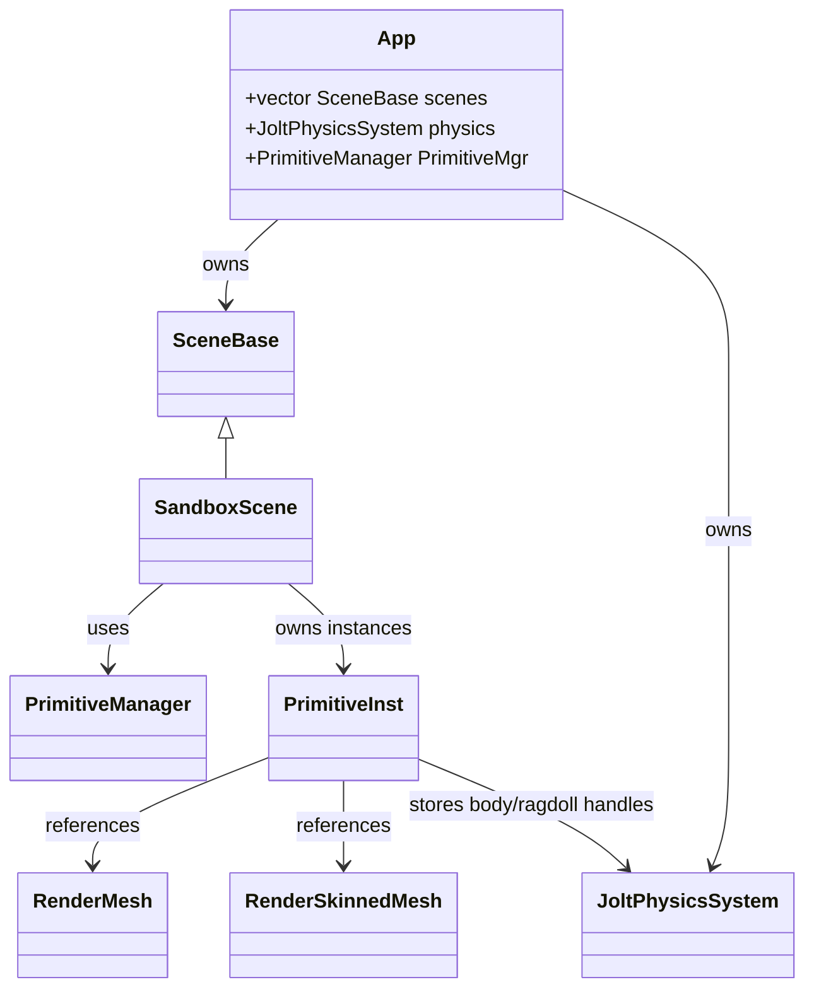
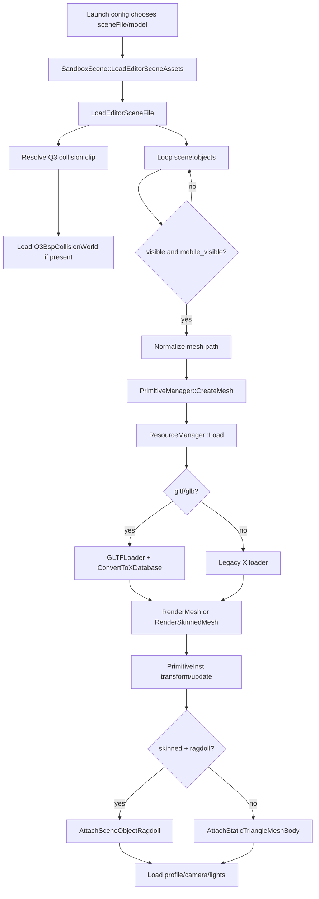
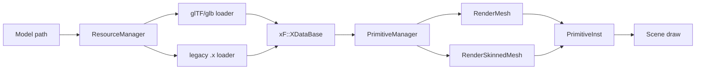
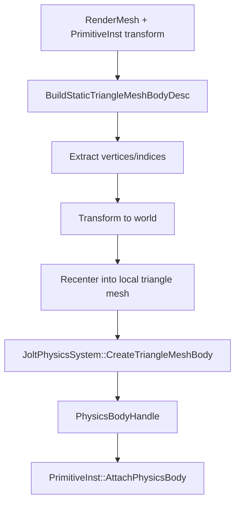
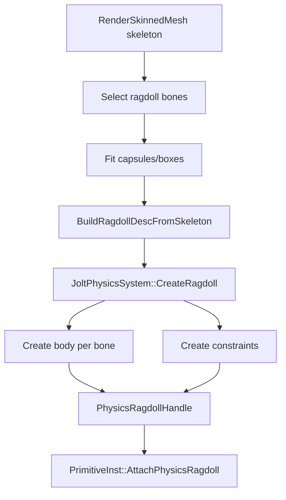
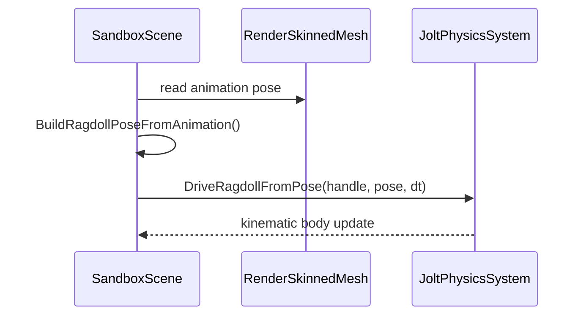
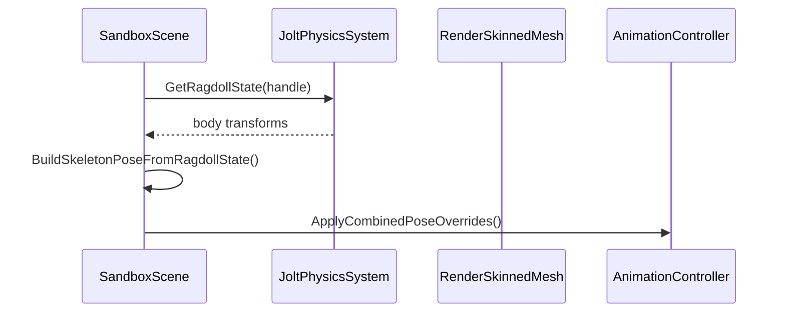
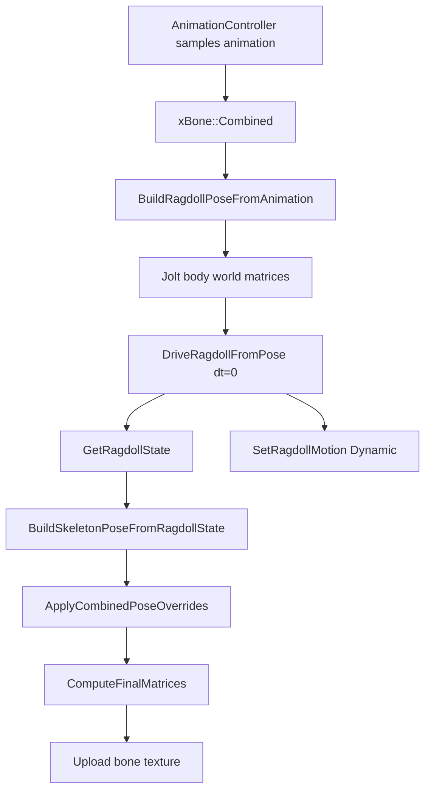
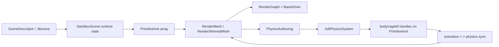

# Scene, meshes, and physics integration

This document explains how T850 loads scenes and models, builds renderable primitives, integrates Jolt physics, creates collision, and synchronizes ragdolls with animation.

## Source layout

| Area | Main paths | Purpose |
| --- | --- | --- |
| Scene contracts | `T850\Framework\include\core\Core.h` | `SceneBase` interface and `SceneProps`. |
| Scene descriptors | `T850\Framework\include\scene\SceneDescriptor.h`, `SceneDescriptor.cpp` | JSON scene schema for cameras, lights, render settings, meshes, profiles, and UI controls. |
| Editor scene files | `T850\Framework\include\scene\EditorSceneFile.h`, `EditorSceneFile.cpp` | `.t8scene` schema with objects, collision, cameras, lights, and profiles. |
| Scene setup | `T850\Framework\include\scene\SceneSetup.h`, `SceneSetup.cpp` | Applies descriptors to runtime cameras, lights, filters, splines, agents, settings. |
| Current scenes | `T850\DayScene\SandboxScene.cpp`, `T850\DayScene\DayScene.cpp` | Main runtime scenes. `SandboxScene` is the asset/profile/physics testbed. |
| Mesh loading | `T850\Framework\src\utils\ResourceManager.cpp`, `T850\Framework\src\utils\gltf`, legacy X loader | Loads glTF/glb or legacy `.x` into the internal `xF::XDataBase`. |
| Render meshes | `T850\Framework\include\scene\RenderMesh.h`, `RenderSkinnedMesh.h`, `PrimitiveManager.h`, `PrimitiveInstance.h` | Creates GPU resources and runtime instances from loaded mesh data. |
| Physics | `T850\Framework\include\physics`, `T850\Framework\src\physics` | Jolt system, triangle-mesh collision, ragdoll authoring, Q3 BSP collision, character controller. |

## Runtime ownership

The app owns the active scenes and physics system:

- `App::InitVars()` creates `SandboxScene` and `DayScene`.
- `App::InitVars()` initializes `JoltPhysicsSystem` and stores it in `EngineContext.physics`.
- Each scene receives the framework pointer and `EngineContext`.
- The active scene owns its runtime mesh instances, render graph state, cameras/lights, and scene-specific tools.
- `PrimitiveManager` owns reusable primitive/mesh resources; `PrimitiveInst` owns per-instance transforms and links to physics handles.



## Scene file formats

T850 currently uses two related scene descriptions.

### `SceneDescriptor`

Defined in `T850\Framework\include\scene\SceneDescriptor.h`, this is a JSON-serializable scene schema used for runtime scene configuration.

Important fields:

| Field | Meaning |
| --- | --- |
| `cameras`, `light_cameras` | Camera position/orientation/projection data. |
| `lights` | Directional and point light descriptors. |
| `gauss_filters` | Blur kernels for shadow, bloom, DOF, etc. |
| `splines` | Spline paths and agent camera attachment. |
| `meshes` | Model file paths. |
| `environment_*` | Skybox/IBL/BRDF/Charlie/sheen lookup textures. |
| `quality` | Shadow resolution, PCF, parallax, SSAO, DOF, light-volume quality. |
| `settings` | Exposure, bloom, tone mapping, active lights, shadow/SSAO/DOF/parallax/god rays, light scaling, material multipliers. |
| `sliders`, `checkboxes`, `selectors` | Runtime GUI controls. |
| `profiles` | Platform/GPU/profile overrides, including Android-specific overrides. |

`LoadSceneDescriptor()` and `SaveSceneDescriptor()` use glaze JSON and ignore unknown keys, so scene files can evolve without breaking older binaries as long as required fields have defaults.

### `EditorSceneFile` / `.t8scene`

Defined in `T850\Framework\include\scene\EditorSceneFile.h`, this is the editor-oriented scene format.

Important fields:

| Field | Meaning |
| --- | --- |
| `collision` | Optional collision clip path, often Q3 BSP collision data. |
| `objects[]` | Scene objects with `name`, `mesh`, optional `ragdoll`, transform, visibility, `mobile_visible`, frozen/wire flags. |
| `cameras[]` | Editor/runtime cameras. |
| `lights[]` | Directional/omni lights, including optional Q3 light metadata. |
| `profiles[]` | Same sandbox profile structure used by runtime profile overrides. |
| `editor` | Editor camera target/orbit and display state. |

`mobile_visible` is important for Android parity: it can intentionally hide an object on mobile. If Android and Windows load different geometry, check this flag and asset packaging first.

## Scene loading flow

`SandboxScene::LoadEditorSceneAssets()` is the central `.t8scene` loader.



After all visible objects are loaded, `SandboxScene` fits the view, applies cameras/lights from the editor scene, copies profiles into the control setup, and loads the selected sandbox profile.

## Mesh loading pipeline

Mesh loading normalizes different source formats into the internal `xF::XDataBase` representation.

1. `PrimitiveManager::CreateMesh(path)` requests a mesh primitive.
2. `ResourceManager::Load(path)` checks whether the resource is already loaded.
3. `.gltf` and `.glb` go through `gltf::LoadGLTF()` and `gltf::ConvertToXDatabase()`.
4. Other model paths use the legacy `.x` loader.
5. `PrimitiveManager` detects whether the data is static or skinned/animated.
6. Static meshes become `RenderMesh`; skinned/animated meshes become `RenderSkinnedMesh`.
7. `RenderMesh::Load()` stores the source database, material/subset information, and shared mesh cache data.
8. `RenderMesh::Create()` builds GPU buffers and culling metadata.
9. `PrimitiveInst::CreateInstance()` binds a render primitive to a transformable runtime entity.



## Materials and mesh caches

Static and skinned render meshes use shared caches:

| Cache | Purpose |
| --- | --- |
| `MeshAssetCache` | Deduplicates/preprocesses mesh asset data, including culling metadata. |
| `MaterialAssetCache` | Deduplicates materials by texture IDs, feature bits, and material parameter block. |

`MaterialAsset` stores the material constants and texture IDs consumed by the graphics layer. Its `featureKey` participates in shader key generation so a mesh subset with normal maps, skinning, lightmaps, or glTF tangent-space conventions gets the right shader permutation.

## Scene runtime data

`SceneProps` is the common render-scene state passed through the draw path. It contains cameras, lights, filters, render settings, and effect controls. `SceneSetup::Apply()` builds `SceneProps` from a `SceneDescriptor`, while `SandboxScene` can also apply `.t8scene` cameras/lights and profile overrides.

Typical scene draw responsibilities:

- Update camera and projection.
- Update per-scene settings from profile/UI.
- Update visible mesh instances and culling.
- Bind render graph resources.
- Draw shadow/depth/G-buffer/lighting/post passes.
- Draw debug overlays and physics visualization when enabled.

## Physics system

`JoltPhysicsSystem` is the framework physics backend. It is app-owned and exposed through `EngineContext.physics`.

Public API highlights:

| Method group | Examples |
| --- | --- |
| Lifecycle | `Initialize()`, `Shutdown()`, `Update(deltaSeconds)` |
| Rigid bodies | `CreateBody()`, `CreateTriangleMeshBody()`, `DestroyBody()`, `SetBodyMotion()`, `SetBodyVelocity()`, `DriveBodyKinematic()`, `SetBodyTransform()`, `GetBodyState()` |
| Casts | `CastCapsule()`, `CastBox()` |
| Ragdolls | `CreateRagdoll()`, `DestroyRagdoll()`, `SetRagdollMotion()`, `SetRagdollVelocity()`, `DriveRagdollFromPose()`, `GetRagdollState()` |
| Debug | `GetDebugBodies()` |

Core types are in `PhysicsTypes.h`:

- `PhysicsBodyHandle`, `PhysicsRagdollHandle`
- `PhysicsBodyMotion`: `Static`, `Kinematic`, `Dynamic`
- `PhysicsShapeDesc`: box, capsule, triangle mesh bounds
- `PhysicsTriangleMeshDesc` and `PhysicsTriangleMeshCookSettings`
- `PhysicsBodyDesc` and `PhysicsTriangleMeshBodyDesc`
- `PhysicsRagdollDesc`, `PhysicsRagdollBoneDesc`, `PhysicsRagdollAnimationBinding`
- `PhysicsRagdollAuthoringDesc`

## Static triangle-mesh collision

Static scene geometry can become exact triangle collision.

`PhysicsAuthoring::BuildStaticTriangleMeshBodyDesc()` extracts render mesh geometry:

1. Read mesh vertex/index data from `RenderMesh::xFile`.
2. Transform vertices by the instance world transform.
3. Build a world-space bounds.
4. Recenter vertices around the body transform center.
5. Fill `PhysicsTriangleMeshBodyDesc`.

`AttachStaticTriangleMeshBody()` then calls `JoltPhysicsSystem::CreateTriangleMeshBody()` and stores the returned handle on the `PrimitiveInst`.



Cook settings choose BVH/cook behavior:

- `maxTrianglesPerLeaf`
- `buildQuality`: favor runtime performance or build speed
- `useDiskCache`

Cook stats record cache hit/save, vertex/triangle count, extraction time, cache load/save time, cook time, and total time.

## Q3 BSP collision

`SandboxScene` can load a Q3 collision clip through `Q3BspCollisionWorld`. This is separate from Jolt triangle bodies and is used for Q3-style map/camera collision behavior, brushes, patch facets, and jump pads.

When a scene object's render mesh also matches the Q3 collision clip, `SandboxScene` can create the Jolt static body but remember that entity ID so the Q3 camera system ignores the duplicate Jolt body where appropriate.

## Ragdoll authoring and runtime

Ragdolls are derived from skinned meshes and skeletons.

`PhysicsAuthoring::BuildRagdollDescFromSkeleton()`:

1. Finds the reference skeleton in `RenderSkinnedMesh`.
2. Selects useful bones based on `PhysicsRagdollBuildSettings`.
3. Optionally collects skinned vertex samples to fit body shapes.
4. Builds capsule or box bodies per selected bone.
5. Infers parent links and joint positions.
6. Initializes swing/twist or fixed joint frames and limits.
7. Returns a `PhysicsRagdollDesc`.

`AttachSkeletonRagdoll()` creates the Jolt ragdoll and stores the `PhysicsRagdollHandle` on the `PrimitiveInst`.



## Animation and physics synchronization

T850 supports both animation-driven and physics-driven ragdolls.

### Animation-driven

The render animation drives Jolt bodies kinematically:



Relevant code path:

- `SandboxScene::UpdateAnimationDrivenRagdoll()`
- `BuildRagdollPoseFromAnimation()`
- `JoltPhysicsSystem::DriveRagdollFromPose()`

### Physics-driven

Jolt bodies drive the render skeleton:



Relevant code path:

- `SandboxScene::UpdateSkeletonFromRagdollPhysics()`
- `JoltPhysicsSystem::GetRagdollState()`
- `BuildSkeletonPoseFromRagdollState()`
- `AnimationController::ApplyCombinedPoseOverrides()`

### Handoff

Runtime UI/debug flow can switch a ragdoll from kinematic animation driving to dynamic physics. The key point is that there are two different matrix streams:

| Stream | Space | Owner | Meaning |
| --- | --- | --- | --- |
| Animation combined matrices | Skeleton mesh space, stored on `xF::xBone::Combined` | `AnimationController` | Parent-accumulated bone transforms produced by animation sampling. |
| Skinning final matrices | Shader/bone-texture space | `AnimationController::ComputeFinalMatrices()` and `RenderSkinnedMesh::UploadBoneTexture()` | `inverseBind * Combined`, then Z-flipped for the left-handed render vertex data. |
| Physics body matrices | World space | `JoltPhysicsSystem` | One rigid-body transform per ragdoll body. |
| Ragdoll binding offsets | Body-local/bone-local conversion matrices | `PhysicsRagdollAnimationBinding` | Stable offsets captured at authoring time so a physics body can be reconstructed from a bone and vice versa. |

The handoff does not directly copy shader skinning matrices into Jolt. It converts animation combined matrices into world-space rigid-body matrices, snaps Jolt to those matrices, then converts the resulting Jolt state back into skeleton combined matrices before enabling dynamic simulation.



### Animation matrices to physics bodies

`BuildRagdollPoseFromAnimation()` converts each controlled animation bone into a Jolt body transform:

```text
boneWorld = FlipZ(bone.Combined) * worldFromMesh
bodyWorld = bodyFromBone * boneWorld
jointWorld = TransformPoint(jointFromBone, boneWorld)
```

Details:

- `bone.Combined` is the animation controller's parent-accumulated skeleton matrix.
- `FlipZ()` changes the skeleton/render convention into the world convention used for physics body placement.
- `worldFromMesh` is the instance transform stored on `PrimitiveInst::Final`.
- `bodyFromBone` is authored once when the ragdoll is built or loaded. It preserves how the capsule/box body is offset and oriented relative to the animation bone.
- Basis rows are normalized before sending the transform to physics, because Jolt bodies need orientation and translation, not inherited mesh scale/shear.
- Joint world positions and joint frame axes are rebuilt from the same animated body matrices so constraints remain aligned with the current pose.

`JoltPhysicsSystem::DriveRagdollFromPose()` then loops over the ragdoll bodies and calls `DriveBodyKinematic(body, bodyWorld, deltaSeconds)`. While the ragdoll is animation-driven, this happens every frame, so Jolt follows the animation instead of simulating freely.

### Switching to dynamic physics

`SandboxScene::SwitchRagdollToPhysics()` performs the interactive handoff:

1. Export the current shader bone matrices for debug comparison.
2. If animation driving is active, rebuild the current `PhysicsRagdollDesc` from animation and call `DriveRagdollFromPose(..., 0.0f)`. The zero delta is an immediate snap, so the physics bodies start exactly at the current animated pose.
3. Read back the snapped body transforms with `GetRagdollState()`.
4. Convert those body transforms back to skeleton combined matrices with `BuildSkeletonPoseFromRagdollState()`.
5. Apply those combined matrices to the animation controller with `ApplyCombinedPoseOverrides()`.
6. Recreate/confirm the floor, switch every ragdoll body to `PhysicsBodyMotion::Dynamic`, clear linear/angular velocity to zero, pause animation, and clear snapshot bone matrices.
7. Set `m_driveRagdollFromAnimation = false` and `m_ragdollPhysicsDriven = true`.

Scene-file ragdolls use the same flow through `SwitchSceneRagdollsToPhysics()`: snap from animation with `DriveRagdollFromPose(..., 0.0f)`, switch the bodies to `Dynamic`, zero velocities, pause animation, and let the physics-to-skeleton path drive the mesh afterward.

### Physics bodies back to animation combined matrices

Once dynamic simulation is enabled, the data direction reverses. `UpdateSkeletonFromRagdollPhysics()` reads Jolt and rewrites the skeleton:

```text
physicsBodyWorld = state.worldTransform
boneFromBody = inverse(controlledBodyFromBone)
boneWorld = boneFromBody * physicsBodyWorld
boneMesh = boneWorld * inverse(worldFromMesh)
combined = FlipZ(boneMesh)
```

Details:

- `controlledBodyFromBone` is normally the same as `bodyFromBone`, but it can contain extra entries when one physics body controls multiple render bones.
- `boneFromBody` removes the authored capsule/box offset, giving the actual bone transform represented by that physics body.
- `inverse(worldFromMesh)` converts world-space physics back into the mesh's skeleton space.
- `FlipZ()` converts back to the skeleton convention expected by `xF::xBone::Combined`.
- `PreserveBasisLengths()` keeps the original skeleton bone scale from the current animation pose. Physics provides rigid transforms, but the skeleton may contain authored scale that must survive the round trip.

The result is not a final GPU skinning matrix yet. It is a list of desired `Combined` matrices plus their bone indices. `AnimationController::ApplyCombinedPoseOverrides()` converts those combined overrides back into local animation bones:

```text
localWithIntermediate = overrideCombined * inverse(parentCombined)
Bone = localWithIntermediate * inverse(IntermediateTransform)
Combined = Bone * IntermediateTransform * parentCombined
```

After any override is applied, `AnimationController::ComputeFinalMatrices()` rebuilds the matrices sent to the shader:

```text
finalSkinMatrix = FlipZ(inverseBindMatrix * Combined)
```

For glTF meshes, `inverseBindMatrix` comes from the imported skin weights when available. Otherwise the engine uses its computed bind-pose inverse. `RenderSkinnedMesh::UploadBoneTexture()` uploads these final matrices to the bone texture consumed by the skinned mesh shader.

### Why the round trip exists

The engine keeps animation, physics, and rendering separated:

- Animation owns local/combined skeleton state.
- Physics owns rigid bodies and constraints in world space.
- Rendering consumes final skinning matrices, not ragdoll body matrices.

The binding matrices are the bridge. They make the transition reversible:

```text
animation Combined -> boneWorld -> bodyWorld -> Jolt
Jolt -> bodyWorld -> boneWorld -> animation Combined -> final skinning matrices
```

This is why the F5 transition can be seamless: the dynamic ragdoll starts from the exact animated pose, and the rendered skeleton is immediately rewritten from the same Jolt bodies before simulation is allowed to diverge.

## Android parity notes

Android should load the same scene/model data through the same `SandboxScene`, `ResourceManager`, `PrimitiveManager`, and physics authoring paths. The differences are expected to be limited to:

- Resource path resolution through Android assets.
- Runtime profile selection based on platform/GPU.
- `.t8scene` object `mobile_visible` filtering.
- Vulkan-only graphics backend and Android surface lifecycle.
- Touch/Android GUI input.

If Android and Windows differ in collision, ragdolls, or scene contents, check in this order:

1. Was the same `.t8scene` or model path launched?
2. Was the same scene profile selected or saved?
3. Are the same assets packaged into the APK?
4. Did `mobile_visible` hide any objects?
5. Did static collision log triangle/vertex counts on both platforms?
6. Did ragdoll authoring load the same `.ragdoll` asset or generate the same body count?
7. Are Jolt bodies created successfully, and are handles attached to `PrimitiveInst`?

## Common debugging logs to look for

| Log prefix | Meaning |
| --- | --- |
| `[SandboxScene] Loading scene object` | Object path from `.t8scene` is being loaded. |
| `[SandboxScene] Q3 collision clip loaded` | Q3 collision file was found and parsed. |
| `[SandboxScene] Scene collision mesh ready` | Static triangle collision was cooked/loaded for an object. |
| `[SandboxScene] Failed to create scene collision mesh` | Render mesh extraction or Jolt triangle body creation failed. |
| `[PhysicsAuthoring] Ragdoll build` | Generated ragdoll body statistics. |
| `[SandboxScene] Driving humanoid ragdoll from animation pose` | Animation-driven ragdoll path is active. |
| `[SandboxScene] Driving skinned skeleton from dynamic ragdoll physics` | Physics-driven skeleton path is active. |

## Mental model



The key idea is that render meshes are the source for both graphics and most physics authoring. Static objects produce triangle bodies; skinned objects produce ragdolls. `PrimitiveInst` is the runtime join point where transform, render primitive, and physics handle meet.
