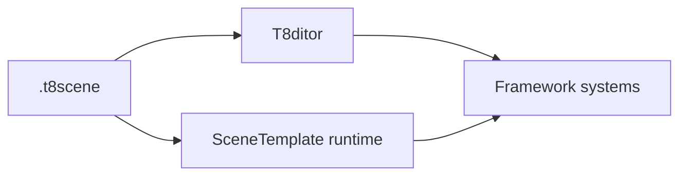

# T850 Engine Documentation

This folder is the long-form technical documentation for T850. It is separate from the root `docs/` folder and is intended to explain the engine deeply enough that a new developer can continue work without losing architectural context.

## Documentation map

| Area | File | Status |
|---|---|---|
| Documentation conventions | [doc-conventions.md](doc-conventions.md) | Stage 0 skeleton |
| Glossary | [glossary.md](glossary.md) | Stage 0 skeleton |
| Full documentation plan | [stage-plan.md](stage-plan.md) | Stage 0 skeleton |
| Main architecture | [architecture/main-architecture.md](architecture/main-architecture.md) | Stage 1 draft |
| Platform event loop and windows | [architecture/platform-event-loop.md](architecture/platform-event-loop.md) | Stage 1 draft |
| Geometry loading | [geometry/loading-geometry.md](geometry/loading-geometry.md) | Stage 2 draft |
| Shader management | [rendering/shader-management.md](rendering/shader-management.md) | Stage 3 draft |
| Render graph | [rendering/render-graph.md](rendering/render-graph.md) | Stage 4 draft |
| Geometry rendering flow | [rendering/geometry-rendering-flow.md](rendering/geometry-rendering-flow.md) | Stage 5 draft |
| Animation | [animation/animation-system.md](animation/animation-system.md) | Stage 6 draft |
| Physics | [physics/jolt-physics.md](physics/jolt-physics.md) | Planned |
| Navigation | [navigation/navmesh-detour.md](navigation/navmesh-detour.md) | Planned |
| Editor | [editor/editor-overview.md](editor/editor-overview.md) | Planned |
| Scenes and formats | [scenes/scene-format-and-runtime.md](scenes/scene-format-and-runtime.md) | Planned |

## Reading path

1. Start with [glossary.md](glossary.md) for naming and subsystem terms.
2. Read [architecture/main-architecture.md](architecture/main-architecture.md) to understand the high-level engine layers.
3. Read [architecture/platform-event-loop.md](architecture/platform-event-loop.md) to understand platform/window/API ownership.
4. Continue through geometry, shaders, render graph, and geometry rendering flow.
5. Read animation, physics, navigation, editor, and scene-format docs as needed.

## Expectations for each document

Every subsystem document should include:

- Purpose and responsibilities.
- Key classes/files.
- Ownership and lifetime rules.
- Data flow and frame/update flow.
- Mermaid diagrams for flowcharts, sequence diagrams, or dependencies.
- Runtime/editor differences.
- Extension points.
- Known limitations.
- Debugging and common failure modes.
- Links to related documents.

## Mermaid diagram policy

Use Mermaid diagrams directly in Markdown. Prefer small diagrams that explain one flow clearly over one large diagram that tries to cover everything.

Example:

