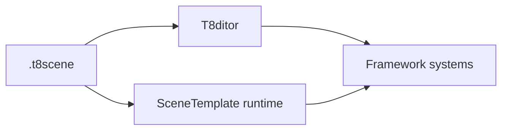

# T850 Engine Documentation

This folder is the long-form technical documentation for T850. It is separate from the root `docs/` folder and is intended to explain the engine deeply enough that a new developer can continue work without losing architectural context.

## Documentation map

### Index, conventions, and audit

| Area | File | Status |
|---|---|---|
| Documentation conventions | [doc-conventions.md](doc-conventions.md) | Stage 0 skeleton |
| Glossary | [glossary.md](glossary.md) | Stage 0 skeleton |
| Full documentation plan | [stage-plan.md](stage-plan.md) | Stage 0 skeleton |
| Dependency map | [dependency-map.md](dependency-map.md) | Stage 11 draft |
| Review and gaps | [review-and-gaps.md](review-and-gaps.md) | Stage 12 draft |

### Core architecture and platform

| Area | File | Status |
|---|---|---|
| Main architecture | [architecture/main-architecture.md](architecture/main-architecture.md) | Stage 1 draft |
| Platform event loop and windows | [architecture/platform-event-loop.md](architecture/platform-event-loop.md) | Stage 1 draft |
| Resource lookup and cache paths | [architecture/resource-locator.md](architecture/resource-locator.md) | Stage 14 draft |
| Input, camera, and controls | [input/camera-and-controls.md](input/camera-and-controls.md) | Stage 15 draft |
| Debug and diagnostics | [debug/diagnostics.md](debug/diagnostics.md) | Stage 13 draft |

### Rendering and assets

| Area | File | Status |
|---|---|---|
| Geometry loading | [geometry/loading-geometry.md](geometry/loading-geometry.md) | Stage 2 draft |
| Shader management | [rendering/shader-management.md](rendering/shader-management.md) | Stage 3 draft |
| Render graph | [rendering/render-graph.md](rendering/render-graph.md) | Stage 4 draft |
| Geometry rendering flow | [rendering/geometry-rendering-flow.md](rendering/geometry-rendering-flow.md) | Stage 5 draft |
| Textures, samplers, and IBL | [rendering/textures-and-ibl.md](rendering/textures-and-ibl.md) | Stage 17 draft |

### Runtime systems

| Area | File | Status |
|---|---|---|
| Animation | [animation/animation-system.md](animation/animation-system.md) | Stage 6 draft |
| Physics | [physics/jolt-physics.md](physics/jolt-physics.md) | Stage 7 draft |
| Navigation | [navigation/navmesh-detour.md](navigation/navmesh-detour.md) | Stage 8 draft |

### Editor, UI, and scene formats

| Area | File | Status |
|---|---|---|
| Editor overview | [editor/editor-overview.md](editor/editor-overview.md) | Stage 9 draft |
| FrameworkImGui runtime UI | [editor/imgui-system.md](editor/imgui-system.md) | Stage 16 draft |
| Scenes and formats | [scenes/scene-format-and-runtime.md](scenes/scene-format-and-runtime.md) | Stage 10 draft |
| SceneSetup descriptors | [scenes/scene-setup-descriptors.md](scenes/scene-setup-descriptors.md) | Stage 18 draft |

## Reading path

1. Start with [glossary.md](glossary.md) for naming and subsystem terms.
2. Read [architecture/main-architecture.md](architecture/main-architecture.md) to understand the high-level engine layers.
3. Read [architecture/platform-event-loop.md](architecture/platform-event-loop.md) to understand platform/window/API ownership.
4. Use [architecture/resource-locator.md](architecture/resource-locator.md) when a change touches asset paths, Android packaged assets, or generated caches.
5. Use [input/camera-and-controls.md](input/camera-and-controls.md) when a change touches input, controllers, camera profiles, hosted viewport input, or Android virtual controls.
6. Use [editor/imgui-system.md](editor/imgui-system.md) when a change touches runtime/editor ImGui, docking, platform windows, or hosted scene panels.
7. Continue through geometry, shaders, render graph, geometry rendering flow, and [textures/IBL](rendering/textures-and-ibl.md).
8. Read animation, physics, and navigation when a feature touches runtime simulation or pathing.
9. Read editor/UI and scene-format docs when a feature touches authoring, Play Scene, or runtime descriptor controls.
10. Use [dependency-map.md](dependency-map.md) when a change crosses subsystem boundaries.
11. Check [review-and-gaps.md](review-and-gaps.md) for known missing docs and troubleshooting entry points.
12. Use [debug/diagnostics.md](debug/diagnostics.md) when diagnosing load stalls, frame differences, telemetry, dumps, or profiling.

## Expectations for each document

Every subsystem document should include:

- Purpose and responsibilities.
- Key classes/files.
- Ownership and lifetime rules.
- Data flow and frame/update flow.
- Mermaid diagrams for flowcharts, sequence diagrams, or dependencies.
- Runtime/editor differences.
- Extension points.
- Known limitations.
- Debugging and common failure modes.
- Links to related documents.

## Mermaid diagram policy

Use Mermaid diagrams directly in Markdown. Prefer small diagrams that explain one flow clearly over one large diagram that tries to cover everything.

Example:

