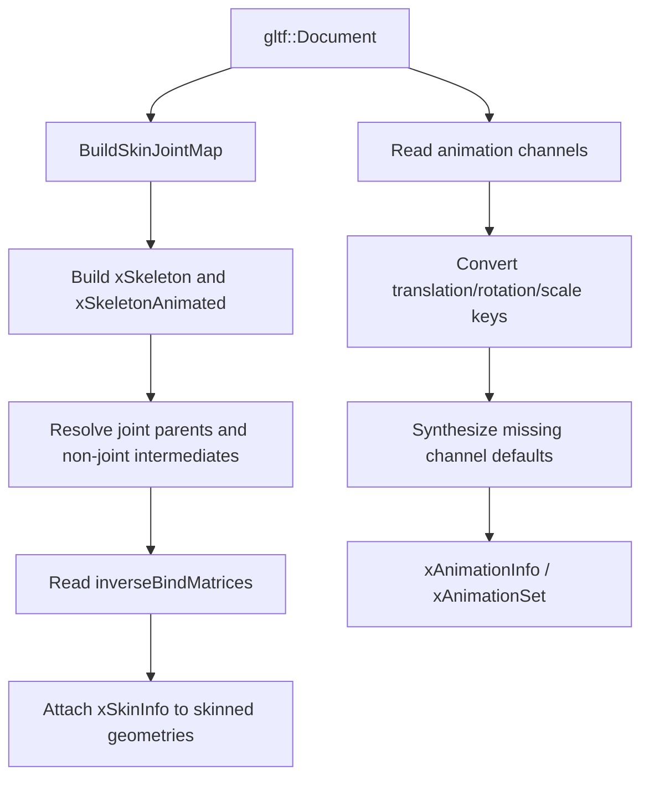
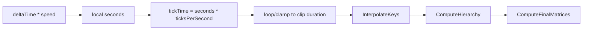
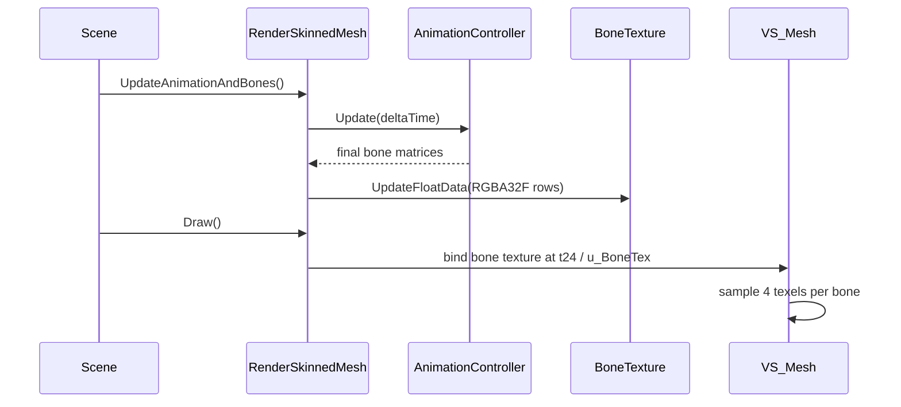

# Animation System

Status: Stage 6 draft.

This document explains T850's skeletal animation path: glTF skin/animation import, internal skeleton and clip data, `AnimationController` playback, interpolation and keyframe stepping, pose snapshots, bone texture upload, GPU skinning, debug visualization, and current limitations.

Related documents:

- [Loading geometry](../geometry/loading-geometry.md)
- [Dependency map](../dependency-map.md)
- [Shader management](../rendering/shader-management.md)
- [Geometry rendering flow](../rendering/geometry-rendering-flow.md)
- [Jolt physics](../physics/jolt-physics.md)

## Purpose and responsibilities

The animation system turns imported skinning and clip data into per-frame bone matrices that the mesh vertex shader can use for GPU skinning.

At runtime:

1. glTF import fills `xF::xSkeleton`, `xF::xAnimationInfo`, and `xF::xSkinWeights`.
2. `PrimitiveManager` detects skin/animation data and creates `RenderSkinnedMesh`.
3. `RenderSkinnedMesh::Create()` initializes `AnimationController` and compiles skinned shader variants.
4. Each frame, scene/editor code calls `UpdateAnimationPose()` or `UpdateAnimationAndBones()` before rendering.
5. `RenderSkinnedMesh` uploads final bone matrices to a texture.
6. `VS_Mesh` samples the bone texture and skins vertices on the GPU.

```mermaid
flowchart LR
  GLTF["glTF skins/animations"] --> Import["BuildSkinsAndAnimations"]
  Import --> XData["xSkeleton + xAnimationInfo + xSkinWeights"]
  XData --> Skinned["RenderSkinnedMesh::Create"]
  Skinned --> Ctrl["AnimationController"]
  Ctrl --> Update["Update / keyframe / snapshot pose"]
  Update --> Matrices["Final bone matrices"]
  Matrices --> Texture["RGBA32F bone texture"]
  Texture --> Shader["VS_Mesh USE_SKINNING_TEXTURE"]
  Shader --> Draw["GPU-skinned mesh draw"]
```



## Key files and classes

| File/class | Role |
|---|---|
| `Framework/src/utils/gltf/GLTFAnimation.cpp` | Converts glTF skins, joints, inverse bind matrices, and animation channels into engine `xF` structures. |
| `Framework/src/utils/gltf/GLTFMesh.cpp` | Calls `BuildSkinsAndAnimations()` after geometry conversion when skins or animations exist. |
| `Framework/include/utils/xDefs.h` | Defines `xBone`, `xSkeleton`, `xAnimationInfo`, `xAnimationSet`, `xAnimationBone`, key structs, and `xSkinWeights`. |
| `Framework/include/scene/AnimationController.h` | Playback API, final bone output arrays, keyframe mode, pose override APIs, debug dump. |
| `Framework/src/scene/AnimationController.cpp` | Animation update, interpolation, hierarchy computation, bind pose and final bone matrix computation. |
| `Framework/include/scene/RenderSkinnedMesh.h` | Skinned mesh renderer API: update/upload, playback controls, snapshots, wireframe/skeleton debug. |
| `Framework/src/scene/RenderSkinnedMesh.cpp` | Creates skinned shaders/bone texture, updates pose, uploads bone texture, draws skinned meshes and debug geometry. |
| `Assets/Shaders/VS_Mesh.hlsl` | HLSL skinning paths: texture, matrix, and quaternion/translation. |
| `Assets/Shaders/VS_Mesh.glsl` | OpenGL GLSL skinning paths. |
| `Assets/Shaders/FS_WireMesh.*` | Wireframe overlay fragment shaders with depth-texture occlusion. |

## Internal data model

Animation import stores data in the legacy `xF` structures used by the renderer.

| Structure | Meaning |
|---|---|
| `xF::xBone` | One skeleton joint. Stores local `Bone`, combined/world `Combined`, `IntermediateTransform`, parent `Dad`, child list `Sons`, and name. |
| `xF::xSkeleton` | Bone array plus `RootParentWorld`, the world transform of non-skeleton ancestors above the skeleton root. |
| `xF::xSkinWeights` | Per-bone skin metadata: inverse bind matrix in `MatrixOffset`, node name, and pointers to animated combined matrices. |
| `xF::xSkinInfo` | Per-geometry skin header and skin weights. |
| `xF::xAnimationInfo` | Clip list, ticks-per-second, and `isAnimInfo`. |
| `xF::xAnimationSet` | One clip. Stores animated bones in `BonesRef`, clip duration in ticks, and playback metadata. |
| `xF::xAnimationBone` | One animated bone channel set: position keys, rotation keys, scale keys, `ActualKey`, and output matrix. |
| `xF::xAnimationSingleKey` | Mutable per-channel playback indices/timing for one bone. |

The renderer currently supports a maximum of `kMaxBones = 256` bones in `AnimationController`.

## glTF import flow

`BuildSkinsAndAnimations()` is called after glTF geometry has been converted into `XDataBase`.



### Skeleton import

The importer:

- builds a global skin joint map across glTF skins,
- creates both bind-pose `mc->Skeleton` and runtime `mc->SkeletonAnimated`,
- maps node names into bones,
- resolves parent joints by walking the glTF node ancestry,
- stores non-joint ancestor transforms in `RootParentWorld`,
- stores non-joint transforms between joints in `xBone::IntermediateTransform`,
- copies each joint node's local TRS matrix into `xBone::Bone`.

This matters because glTF skeletons can contain helper nodes between joints. T850 preserves those transforms separately so animation keys can overwrite the actual joint local matrix without losing intermediate hierarchy transforms.

### Inverse bind matrices and skin weights

The importer reads every skin's `inverseBindMatrices` accessor, converts glTF column-major matrices to the engine row-major matrix layout, and stores them in global joint order as `xSkinWeights::MatrixOffset`.

Every geometry with skin attributes receives:

- `SkinMeshHeader.NumBones`,
- `MaxNumWeightPerVertex = 4`,
- one `xSkinWeights` entry per global joint,
- pointers from skin weights to `SkeletonAnimated.Bones[j].Combined`.

Vertex `JOINTS_0` data was already remapped from local skin joint indices to this global joint order during mesh conversion.

### Animation clips

For each glTF animation:

- supported target paths are `translation`, `rotation`, and `scale`;
- each target node is mapped to a joint index;
- sampler input times are converted to ticks using `kTicksPerSecond = 4800`;
- sampler output values become `xPositionKey`, `xRotationKey`, or `xScaleKey`;
- `CUBICSPLINE` data is read by taking the middle value record for each key;
- unsupported paths are skipped with a log message;
- missing translation/rotation/scale channels synthesize default keys from the node TRS or identity defaults;
- clip duration is the maximum final key tick across all channels.

Multiple animations can be converted in parallel through the global thread pool.

## `AnimationController`

`AnimationController` owns runtime playback state for one skinned renderer.

`Init()` deliberately clones the imported `xAnimationInfo`, bind skeleton, and animated skeleton into instance-owned copies. This prevents cloned mesh instances from mutating shared `XDataBase` animation state.

Initialization flow:

1. Copy imported animation/skeleton data into controller-owned instances.
2. Clamp bone count to `kMaxBones`.
3. Pick ticks-per-second from imported data, defaulting to `4800`.
4. Reset per-channel playback locals.
5. Compute missing animation durations when needed.
6. Compute bind-pose combined matrices.
7. Generate controller-owned inverse bind matrices from bind pose.
8. Initialize animated skeleton from bind pose.

`SetSkinWeights()` points the controller at the geometry's imported glTF inverse bind matrices. Final matrix computation prefers these glTF IBMs when present, falling back to computed bind-pose inverse matrices otherwise.

## Playback and interpolation

`AnimationController::Update(deltaTime)`:

1. Scales `deltaTime` by playback speed.
2. Adds it to local time.
3. Converts local seconds to animation ticks.
4. Wraps or clamps time based on looping.
5. Interpolates channel keys.
6. Computes combined hierarchy matrices.
7. Computes final GPU bone matrices.



Interpolation behavior:

- position: linear interpolation,
- scale: linear interpolation,
- rotation: SLERP by default, NLERP when `SetUseSlerp(false)` is used,
- local transform: `Scale * Rotation * Translation` using row-vector convention.

The controller assumes imported key arrays are sorted by time.

## Keyframe mode

Keyframe stepping is a no-interpolation inspection mode.

`SetKeyframeMode(true)` disables automatic `Update()` in `RenderSkinnedMesh::UpdateAnimationPose()`. `StepKeyframe(delta)` changes `m_currentKeyframe`, finds a tick from the first channel with that key index, snaps every animated channel to the nearest key at or before that tick, then recomputes hierarchy and final matrices.

This is useful for editor inspection, but it assumes channels share a compatible time axis. Odd clips with very different per-channel key layouts can step unexpectedly.

## Hierarchy and final matrices

`ComputeHierarchy()` performs parent-first traversal and writes each animated bone's combined matrix:

```text
localWithIntermediate = Bone * IntermediateTransform
Combined = localWithIntermediate * parentCombined
```

For root bones, `RootParentWorld` is used as the parent transform.

`ComputeFinalMatrices()` then computes the matrix sent to the shader:

```text
rhResult = inverseBindMatrix * animatedCombined
final = RH_to_LH_Z_flip(rhResult)
```

The right-handed to left-handed conversion is applied once at the final product. This keeps imported glTF skeleton/IBM data in its original space until the final shader-facing matrix is produced.

The controller also extracts a quaternion and translation from each final matrix for the alternate quaternion/translation skinning path.

## RenderSkinnedMesh creation

`RenderSkinnedMesh::Create()` starts by calling `RenderMesh::Create()`, so skinned meshes still receive the same geometry, material, mesh-pool, and static shader setup as normal meshes.

It then:

1. Detects skinning by checking for `HAS_SKINWEIGHTS0` and `HAS_SKININDEXES0`.
2. Adds `ShaderKey::HAS_SKINNING_TEX` to every subset key.
3. Allocates an RGBA32F bone texture.
4. Recompiles mesh shader variants with the skinning texture bit.
5. Compiles skinned wireframe shader variant.
6. Allocates constant buffers.
7. Initializes `AnimationController` from `mc->Animation`, `mc->Skeleton`, and `mc->SkeletonAnimated`.
8. Finds the first geometry with skin weights and calls `SetSkinWeights()`.
9. Builds skinned wireframe and octahedral skeleton debug buffers.

The bone texture width is chosen as `ceil(sqrt(numBones * 4))`, because every bone matrix uses four RGBA texels.

## Per-frame update and upload

`RenderSkinnedMesh` exposes two update calls:

- `UpdateAnimationPose()` updates the CPU animation pose only.
- `UpdateAnimationAndBones()` updates the pose and uploads the bone texture.

The header explicitly notes that `UpdateAnimationAndBones()` must run before the render graph and outside any render pass. This is important for Vulkan because texture uploads/copy commands must not happen inside a render pass.

`UpdateAnimationPose()`:

- early-outs when there is no skin,
- writes one debug bind-pose dump to `anim_debug_bindpose.txt` the first time it runs without a snapshot,
- advances the controller only when not in snapshot pose, playing is enabled, and keyframe mode is off.

`UploadBoneTexture()`:

- validates device context, texture width, and backing store size,
- uses snapshot matrices when a snapshot is active,
- otherwise uses `AnimationController::GetBoneMatrices()`,
- clamps upload count to `kMaxBones` and texture capacity,
- writes each matrix row to four RGBA texels,
- calls `Texture::UpdateFloatData()`.



## GPU skinning

The default active path is texture-based skinning:

- shader key bit: `HAS_SKINNING_TEX`,
- shader define: `USE_SKINNING_TEXTURE`,
- HLSL resource: `Texture2D<float4> BoneTexture : register(t24)`,
- GLSL resource: `uniform highp sampler2D u_BoneTex`,
- each bone matrix is reconstructed from four texels,
- vertex position, normal, tangent, and binormal are transformed before world/view/projection.

Alternative shader paths exist:

- `USE_SKINNING`: matrix array in constant/uniform buffer.
- `USE_SKINNING_QT`: quaternion plus translation arrays.

The current `RenderSkinnedMesh::Create()` path sets `HAS_SKINNING_TEX`, so matrix and QT paths are code-supported but not the default renderer path.

## Rendering relationship

The draw path for skinned meshes mirrors static mesh rendering, with these additions:

- final subset keys include `HAS_SKINNING_TEX`;
- `RenderSkinnedMesh::Draw()` binds the bone texture with `SetVS()` before `DrawIndexed()`;
- shader input layout includes `BLENDINDICES` and `BLENDWEIGHT`;
- CPU-side material, mesh pool, shader selection, texture binding, and `DrawIndexed` follow the same pattern documented in [Geometry rendering flow](../rendering/geometry-rendering-flow.md).

If `m_hasSkin` is false, `RenderSkinnedMesh::Draw()` falls back to `RenderMesh::Draw()`.

## Snapshot and pose override workflows

Snapshot support is used by frame capture/replay, editor tools, and animation-to-physics handoff workflows.

`RenderSkinnedMesh` provides:

- `ExportBoneMatrices(out)`: exports current shader-space matrices, or active snapshot matrices.
- `ApplySnapshotBoneMatrices(matrices)`: stores matrices, clamps to `kMaxBones`, and activates snapshot pose.
- `ClearSnapshotBoneMatrices()`: returns to controller-driven pose.
- `GetBoneTextureData()` and `GetBoneTextureWidth()` for inspecting uploaded texture data.

`AnimationController` also provides:

- `ExportCombinedPose(out)`: exports animated skeleton combined matrices.
- `ApplyCombinedPoseOverrides(indices, combinedMatrices)`: applies selected combined matrices and reconstructs local bone transforms from parent and intermediate transforms.
- `ApplyBindPose()`: resets animated skeleton to bind pose.

These APIs are used by scene/editor code for snapshot replay, ragdoll handoff, and skeleton editing.

## Debug visualization

### Matrix dump

On first animation pose update, `RenderSkinnedMesh` calls:

```text
AnimationController::DumpMatrices("anim_debug_bindpose.txt")
```

The dump includes skeleton hierarchy, inverse bind matrices, and final GPU matrices.

### Wireframe

`RenderSkinnedMesh::DrawWireframe()` draws the mesh wireframe through the skinned shader path:

- uses the same animated bone texture,
- binds per-geometry line-list index buffers,
- can bind GBuffer depth textures for manual depth-tested overlay,
- uses `FS_WireMesh`.

### Skeleton

`RenderSkinnedMesh::DrawSkeleton()`:

- reads current combined pose from `AnimationController::GetAnimSkeleton()`,
- CPU-updates octahedral bone line geometry,
- draws base skeleton and optional highlighted bone sets through `LineRenderer`,
- disables depth testing for the skeleton overlay.

SceneTemplate, SandboxScene, Quake3Mock, RagdollEditor, T8ditor, and editor panels all call these APIs for animation and skeleton inspection.

## Extension points

To extend animation:

1. Add new glTF channel support in `GLTFAnimation.cpp` if the source data is not translation/rotation/scale.
2. Preserve the `xF` data model unless replacing all downstream controller/render code.
3. Add new playback controls to `AnimationController`, then expose them through `RenderSkinnedMesh`.
4. If adding a new GPU skinning mode, add a `ShaderKey` bit, define mapping, shader code, and draw-time buffer/texture binding.
5. If changing bone count limits, update `kMaxBones`, shader array/texture assumptions, debug buffers, and validation logs.
6. Keep `UpdateAnimationAndBones()` before render graph execution to avoid backend upload hazards.

## Known limitations and gotchas

- Bone count is capped at 256.
- GL uniform matrix fallback is capped lower in shader comments; texture skinning avoids that limit.
- `UpdateAnimationAndBones()` must run outside render passes.
- Keyframe stepping assumes a shared time axis across channels.
- Imported keys are assumed sorted.
- `CUBICSPLINE` interpolation is not evaluated as cubic; the importer uses the value record and runtime interpolates linearly/SLERP.
- RH-to-LH conversion is applied only in final bone matrices, so intermediate skeleton debug values may not match final shader-space intuition.
- Bind-pose AABBs are not conservative for GPU-skinned vertices; the current skinned draw path avoids subset AABB culling.
- Matrix and quaternion/translation skinning paths exist in shaders but texture-based skinning is the default active renderer path.

## Debugging checklist

1. Confirm the glTF imported skin attributes: `HAS_SKINWEIGHTS0` and `HAS_SKININDEXES0`.
2. Check logs for `[glTF] Building skeleton`, `Skin weights applied`, and `Converted animations`.
3. Confirm `RenderSkinnedMesh::Create()` reports a nonzero bone count and animation set count.
4. Verify `UpdateAnimationAndBones()` runs before the render graph.
5. If animation is frozen, check playing state, keyframe mode, snapshot pose state, speed, and `FrameDeltaSec`.
6. Inspect `anim_debug_bindpose.txt` for skeleton hierarchy, inverse bind matrices, and final matrices.
7. Confirm bone texture width/data has enough capacity and `animation.bonesUploaded` telemetry is nonzero.
8. Verify the shader key includes `HAS_SKINNING_TEX` and the shader has `USE_SKINNING_TEXTURE`.
9. Check that `BoneTexture`/`u_BoneTex` is bound to slot 24.
10. Use `DrawSkeleton()` to validate hierarchy and `DrawWireframe()` to validate GPU-skinned vertex motion.
11. For snapshot/replay issues, compare `ExportBoneMatrices()` output with the uploaded bone texture data.
