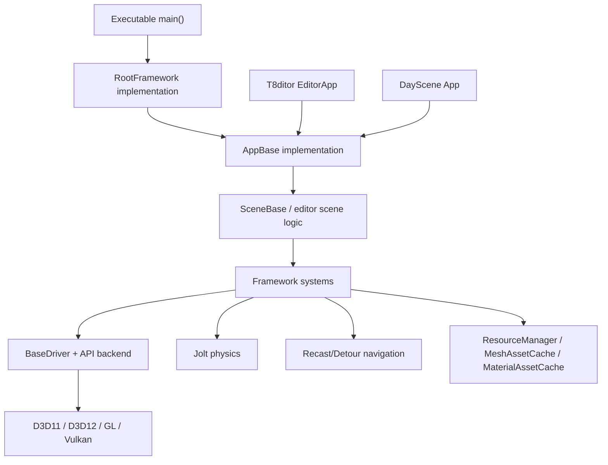
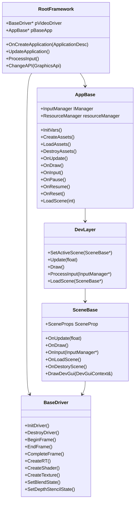
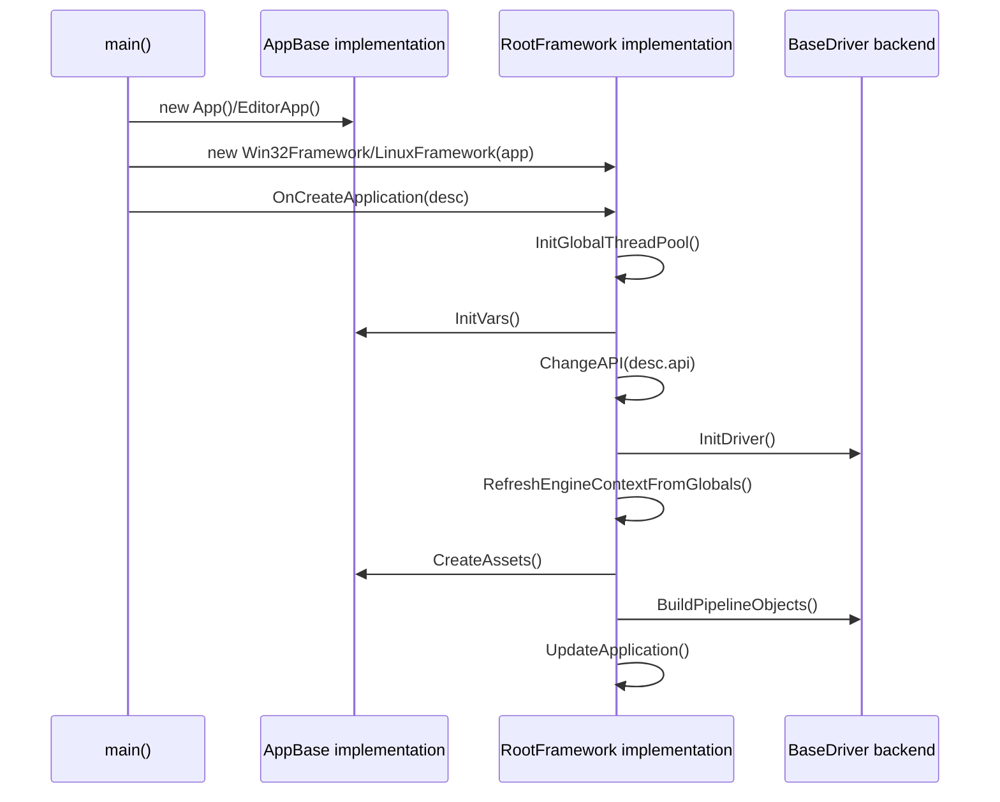
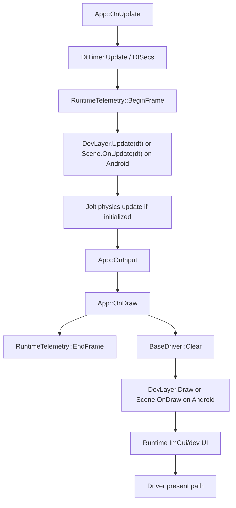
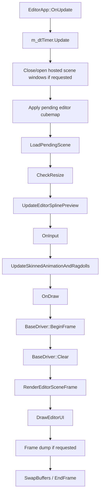
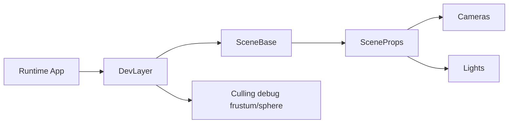
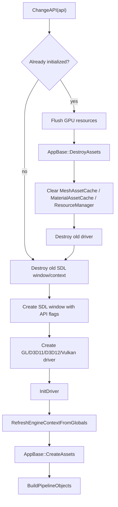

# Main Architecture

Status: verified against source on 2026-08-19.

This document describes the top-level architecture of T850: the Framework layer, scene applications, editor application, dev layer, and shared runtime context. It focuses on ownership and lifecycle rather than subsystem internals.

Related documents:

- [Dependency map](../dependency-map.md)
- [Platform event loop](platform-event-loop.md)
- [Resource locator and cache paths](resource-locator.md)
- [Input, camera, and controls](../input/camera-and-controls.md)
- [FrameworkImGui runtime UI](../editor/imgui-system.md)
- [Scene format and runtime](../scenes/scene-format-and-runtime.md)

## Purpose

T850 is organized around a reusable **Framework** plus executable **applications/scenes**:

- The **Framework** owns platform abstraction, graphics backends, common resources, input abstractions, physics, navigation, scene setup, and utilities.
- Runtime scenes such as **DayScene**, **Quake3Mock**, **SandboxScene**, **RagdollEditor**, and **SceneTemplate** use the Framework to render and simulate content.
- **T8ditor** is an editor executable that also uses the Framework, but has editor-only UI, gizmos, panels, authoring state, and `.t8scene` save/load workflows.

The key architectural idea is that platform loops and graphics APIs are behind `RootFramework`/`BaseDriver`, while scene/application logic is behind `AppBase` and `SceneBase`.

## Key files and classes

| Area | Key files/classes | Role |
|---|---|---|
| Application contract | `T850/Framework/include/core/Core.h` — `AppBase` | Executable-level lifecycle: `InitVars`, `CreateAssets`, `LoadAssets`, `DestroyAssets`, `OnUpdate`, `OnDraw`, `OnInput`, pause/resume/reset. |
| Scene contract | `T850/Framework/include/core/Core.h` — `SceneBase` | Runtime scene lifecycle and per-frame functions. Owns a `SceneProps` instance. |
| Platform framework | `T850/Framework/include/core/Core.h` — `RootFramework` | Abstract platform/application loop and API switching interface. |
| Windows framework | `T850/Framework/src/core/windows/Win32Framework.cpp` | SDL window, Win32 details, D3D11/D3D12/GL/Vulkan selection, input polling, resize, gamepads. |
| Linux/Steam Deck framework | `T850/Framework/src/core/LinuxFramework.cpp` | SDL + Vulkan-only runtime for Linux/Steam Deck. |
| Android framework | `T850/Framework/src/core/android/AndroidFramework.cpp` | Native activity glue, Vulkan-only runtime, native window lifecycle, touch/key input. |
| Global context | `T850/Framework/include/core/EngineContext.h`, `T850/Framework/src/core/EngineContext.cpp` | Lightweight global access to driver/device/context/physics/thread pool/config. |
| Dev layer | `T850/Framework/include/core/DevLayer.h`, `T850/Framework/src/core/DevLayer.cpp` | Runtime scene forwarding, pause toggle, culling debug visualization, input forwarding. |
| Runtime app | `T850/DayScene/Application.cpp`, `T850/DayScene/App.cpp` | Runtime application wrapper around active scene and dev layer. |
| Editor app | `T850/T8ditor/main.cpp`, `T850/T8ditor/EditorApp.cpp`, `T850/T8ditor/EditorApp.h` | Editor executable/application built on the same Framework contract. |
| Render backend abstraction | `T850/Framework/include/video/BaseDriver.h` | Common graphics API interface for driver creation, frame lifecycle, render targets, resources, states. |

## Layer model



## Core class relationships



### Graphics backend dispatch

Shared runtime, scene, editor, and debug code must not downcast `BaseDriver` or branch on `GraphicsApi` to perform backend work. Backend-owned behavior is exposed through virtual capabilities and lifecycle hooks on `BaseDriver`; substantial cross-API subsystems use strategy objects:

- `ImGuiRendererBackend` owns ImGui platform/renderer initialization, frame setup, draw submission, texture descriptors, viewport behavior, and shutdown for one API.
- `ProfilerGpuBackend` owns timestamp queries, frame rings, resolves, and cleanup for one API; `Profiler` owns only API-neutral CPU timing and reporting.
- `BaseDriver` capabilities describe shader dialect, texture origin, deferred rendering, render-target mip generation, native-surface lifecycle, late present, and pre-present overlays.

Graphics API switches remain only at composition boundaries where an implementation is selected: driver factories, ImGui/profiler backend factories, CLI/config parsing, API-switching UI, and benchmark scheduling. Typed casts are valid inside the selected backend implementation, not in shared callers.

## Runtime ownership

### `RootFramework`

`RootFramework` is the platform owner. It owns:

- the selected `BaseDriver` backend through `pVideoDriver`;
- the application pointer through `pBaseApp`;
- the active `ApplicationDesc`;
- the outer application loop.

Platform implementations:

- `Win32Framework` supports D3D11, D3D12, OpenGL, and Vulkan.
- `LinuxFramework` forces Vulkan and is used for Steam Deck/Linux.
- `AndroidFramework` forces Vulkan and is driven by native app glue events.

### `AppBase`

`AppBase` is implemented by executable-specific application classes:

- `DayScene/Application.cpp` implements the runtime application `App`.
- `T8ditor/EditorApp.cpp` implements the editor application `EditorApp`.

`AppBase` owns:

- its `InputManager`;
- its `ResourceManager`;
- its lifecycle hooks;
- state such as pause/init flags.

### `SceneBase`

`SceneBase` represents a runtime scene loaded inside the runtime app. Examples:

- `DayScene`
- `SceneTemplate`
- `Quake3Mock`
- `SandboxScene`
- `RagdollEditor`

Each scene owns the `SceneBase::SceneProp` member, whose type is `SceneProps`. The `SceneProps` struct bundles cameras, lights, rendering feature toggles, culling, God Rays, material parameters, and global scene render settings.

### `EngineContext`

`EngineContext` is a lightweight global bridge:

```cpp
struct EngineContext {
  BaseDriver* driver;
  Device* device;
  DeviceContext* deviceContext;
  JoltPhysicsSystem* physics;
  ThreadPool* threadPool;
  Config* config;
};
```

`RefreshEngineContextFromGlobals()` pulls current globals (`g_pBaseDriver`, `T8Device`, `T8DeviceContext`, `g_threadPool`, `g_config`) into `EngineContext`. This is called after graphics API creation. It lets subsystems avoid passing the driver/device/thread pool through every call.

### Managed textures and atlases

`BaseDriver` owns file-backed and memory-backed GPU textures in the same registry. `CreateTextureFromMemory(key, ...)` assigns a stable texture ID, deduplicates by the caller's content key, and releases the texture with the rest of the driver resources. Scenes must not release a managed texture directly.

`TextureAtlas` in `Framework/include/video/TextureAtlas.h` is immutable metadata over one managed texture ID. It validates exact tile divisibility, supports rectangular images and tiles, and computes half-texel-inset UV regions from pixel dimensions. File loading preserves source resolution by default; `TextureAtlasDesc::pixelationFactor` is an explicit opt-in for pixel-art downsampling followed by nearest expansion.

Materials that need a different texture use `MaterialAssetCache::AcquireTextureVariant()` before drawing. Cached `MaterialAsset` objects are immutable after acquisition; changing their texture pointers or IDs in place invalidates content hashing and deduplication.

## Application startup flow

Runtime and editor entry points are similar:

- Runtime: `T850/DayScene/App.cpp`
- Editor: `T850/T8ditor/main.cpp`



Important details:

- `main()` builds an `ApplicationDesc` from config/CLI.
- `Win32Framework::OnCreateApplication()` initializes SDL, input/gamepads, thread pool, telemetry, navigation backend logging, then calls `ChangeAPI`.
- `ChangeAPI()` creates or recreates the graphics driver/window and calls `AppBase::CreateAssets()`.
- Runtime app may enter `UpdateApplication()` immediately; the editor is also driven by the framework loop.

## Per-frame flow: runtime app

`T850/DayScene/Application.cpp` owns the runtime frame. The major flow is:



Notable runtime behavior:

- Non-Android uses `DevLayer` to forward scene update/draw/input and add dev tooling.
- Android calls the active scene directly in several paths to avoid desktop dev UI assumptions.
- Physics update is outside individual scenes if `EngineContext.physics` is initialized.
- Benchmark/offscreen paths can bypass the standard present loop and use `BaseDriver::FrameTargetMode::Offscreen`.

## Per-frame flow: editor

`T850/T8ditor/EditorApp.cpp` owns editor frames:



The editor uses the same graphics backend abstraction, but layers editor-only systems on top:

- ImGui docking/panels.
- ImGuizmo transforms.
- editor line renderer and grid.
- editor render graph.
- scene hierarchy/inspector.
- `.t8scene` load/save.
- Play Scene export/runtime hosting.
- Mesh Editor, Ragdoll Editor, NavMesh Authoring.

## Dev layer

`DevLayer` is a runtime scene wrapper, not the editor. It is used by the runtime app to:

- forward `Update`, `Draw`, and `ProcessInput` to the active `SceneBase`;
- block scene input when needed;
- support a pause toggle;
- save scene state on Tab;
- request frame dumps on F10;
- draw culling debug resources.



## Scene properties and shared scene state

`SceneBase::SceneProp` is the shared runtime scene state object. It carries:

- camera lists and active camera;
- light lists and active light camera;
- render feature toggles such as shadow, SSAO, DOF, parallax, God Rays;
- material/global lighting parameters;
- culling settings and debug counters;
- God Rays volume parameters;
- camera culling state.

Render systems and render graph passes read from `SceneProps`, so many editor/runtime features work by updating `SceneProps` before rendering.

## Global graphics objects

`BaseDriver.cpp` defines these global pointers:

- `g_pBaseDriver`
- `T8Device`
- `T8DeviceContext`

They are legacy/global access points used throughout Framework systems. `EngineContext` wraps the same pointers into a more structured object, but both paths still exist.

Important rule: after an API switch or driver recreation, GPU resource caches and `EngineContext` must be refreshed. `Win32Framework::ChangeAPI()` clears mesh/material caches and calls `RefreshEngineContextFromGlobals()` after the new driver initializes.

## API switching

The Windows path supports runtime API switching through `Win32Framework::ChangeAPI()`.

High-level flow:



This is why GPU-owned resources should be created in `CreateAssets()` or later and destroyed in `DestroyAssets()`.

## Platform summary

| Platform | Framework | Graphics APIs | Notes |
|---|---|---|---|
| Windows | `Win32Framework` | D3D11, D3D12, OpenGL, Vulkan | SDL window, Win32 icon/mouse confinement, gamepad handling, API switching. |
| Linux / Steam Deck | `LinuxFramework` | Vulkan only | SDL window, Steam Deck detection, Vulkan-only backend. |
| Android | `AndroidFramework` | Vulkan only | Native activity window lifecycle, `ANativeWindow`, Android input/touch/back handling. |

See [platform-event-loop.md](platform-event-loop.md) for details.

## Extension points

To add a new runtime scene:

1. Implement `SceneBase`.
2. Implement `InitVars`, `CreateAssets`, `DestroyAssets`, `OnUpdate`, `OnDraw`, `OnInput`, `OnLoadScene`, `OnDestoryScene`.
3. Register or instantiate it from the runtime `App`.
4. Ensure all graphics resources are recreated correctly after API switches.

To add a new platform:

1. Implement `RootFramework`.
2. Provide lifecycle, input, window/surface, API creation, resize, and destruction behavior.
3. Ensure `RefreshEngineContextFromGlobals()` is called after driver creation.
4. Ensure `AppBase::CreateAssets()` / `DestroyAssets()` are called around driver lifetime changes.

To add a new graphics backend:

1. Implement `BaseDriver`, `Device`, `DeviceContext`, buffers, textures, shaders, render targets.
2. Add creation path to the platform framework.
3. Ensure shader/resource binding conventions match existing renderers.
4. Implement frame lifecycle methods for explicit APIs.

## Known limitations and gotchas

- `OnDestoryScene` is misspelled in the `SceneBase` API and existing code; use the existing name unless doing a coordinated API rename.
- `g_pBaseDriver`, `T8Device`, and `T8DeviceContext` are still global; `EngineContext` is a structured wrapper, not a total replacement.
- API switches destroy and recreate GPU resources. Any cache that owns GPU handles must be cleared or rebuilt.
- Android and Steam Deck force Vulkan.
- Android bypasses some desktop dev-layer paths.
- Many scene examples still have very large monolithic `.cpp` files; documentation should explain the runtime flow even when code organization is legacy.

## Debugging checklist

- If rendering fails after an API switch, verify `CreateAssets()` recreated all GPU resources.
- If a subsystem sees null graphics pointers, check `RefreshEngineContextFromGlobals()`.
- If a scene does not receive input, check dev-layer input blocking, ImGui capture, app pause state, and platform event mapping.
- If a hidden mesh is expected to drive NavMesh, verify it has explicit `navigation.include=true`.
- If Android/Steam Deck behaves differently, check whether the desktop dev-layer path is bypassed.

## Related documents

- [Platform Event Loop and Window Management](platform-event-loop.md)
- [Geometry Loading](../geometry/loading-geometry.md)
- [Render Graph](../rendering/render-graph.md)
- [Geometry Rendering Flow](../rendering/geometry-rendering-flow.md)
- [Editor Overview](../editor/editor-overview.md)
- [Scene Format and Runtime](../scenes/scene-format-and-runtime.md)
