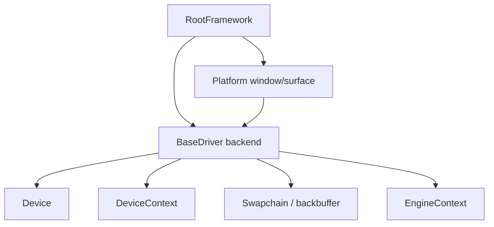
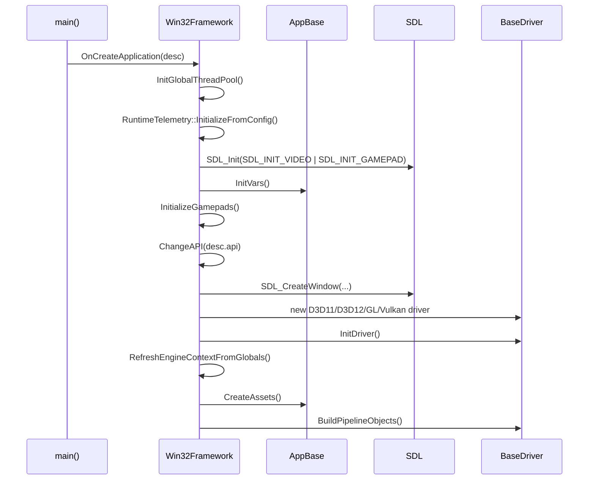
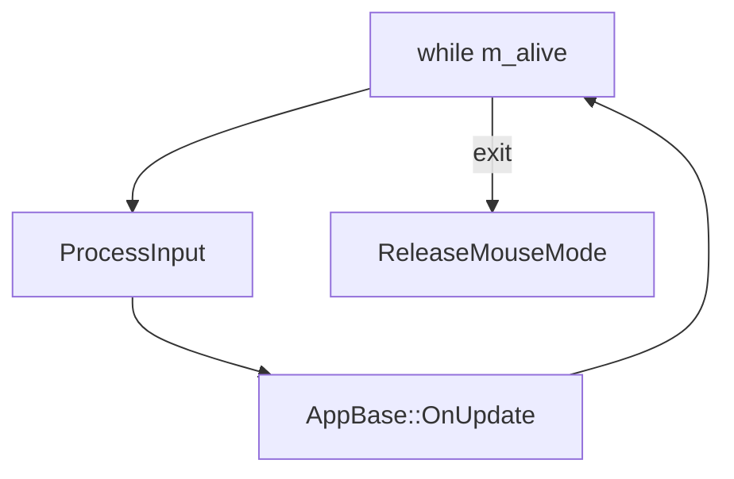
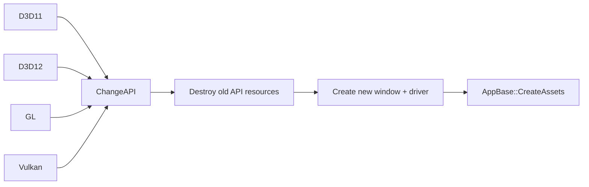
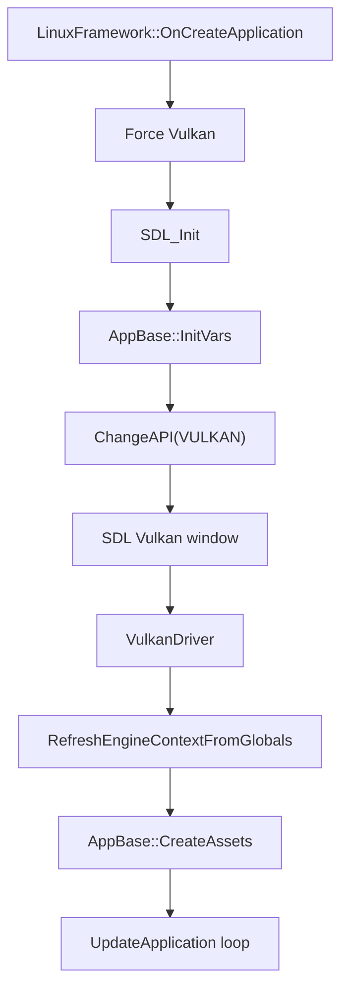
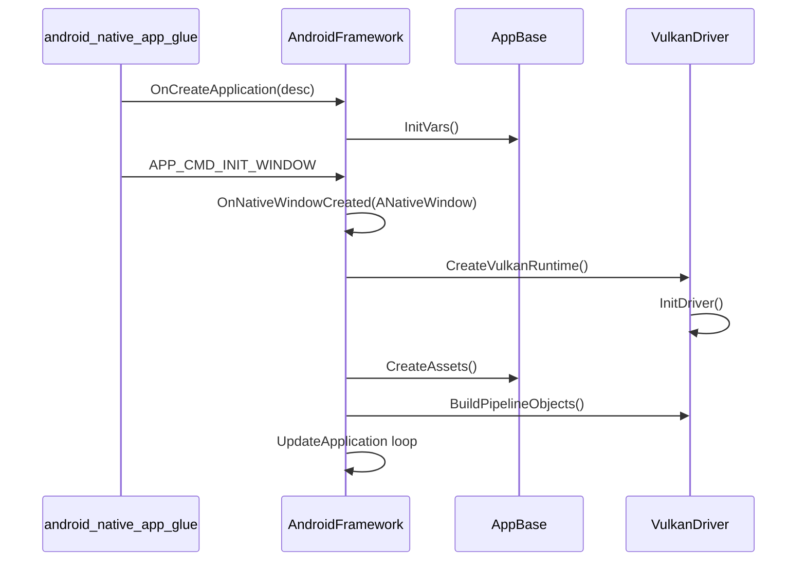
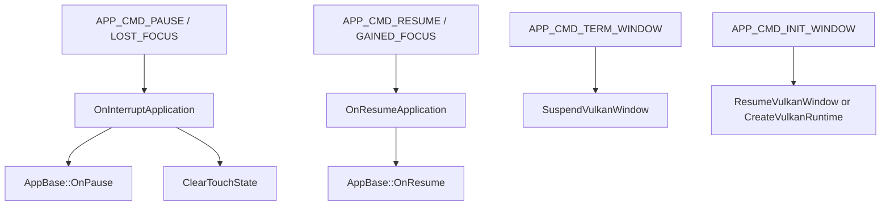
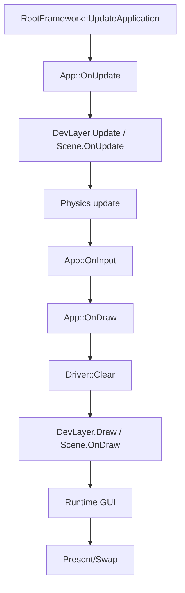
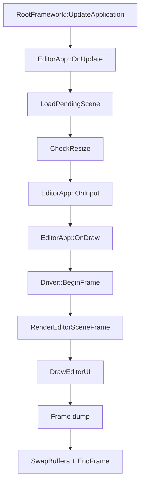
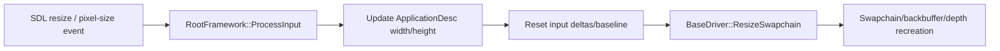

# Platform Event Loop and Window Management

Status: verified against source and PR CI on 2026-08-30.

This document describes how T850 runs on Windows, Linux/Steam Deck, and Android: event loops, window/surface ownership, graphics API creation, resize handling, and frame lifecycle.

For the high-level application/scene architecture, see [main-architecture.md](main-architecture.md). For input and camera routing details, see [Input, camera, and controls](../input/camera-and-controls.md). For runtime/editor ImGui backend details, see [FrameworkImGui runtime UI](../editor/imgui-system.md). For cross-subsystem ownership, see [dependency-map.md](../dependency-map.md).

## Purpose

The Framework hides platform differences behind `RootFramework`. Each platform implementation must:

- create and destroy native windows/surfaces;
- select or force a graphics API;
- create the correct `BaseDriver` backend;
- feed input into `AppBase::IManager`;
- run the application update loop;
- handle resize/surface loss/pause/resume;
- call app lifecycle methods at the right time.

## Platform implementations

| Platform | File | Class | Window/surface |
|---|---|---|---|
| Windows | `T850/Framework/src/core/windows/Win32Framework.cpp` | `t850::Win32Framework` | `SDL_Window*`, optional `SDL_GLContext`, HWND for icon/mouse confinement |
| Linux / Steam Deck | `T850/Framework/src/core/LinuxFramework.cpp` | `t850::LinuxFramework` | `SDL_Window*` with `SDL_WINDOW_VULKAN` |
| Android | `T850/Framework/src/core/android/AndroidFramework.cpp` | `t850::AndroidFramework` | `ANativeWindow*` from native activity glue |

## Window and API ownership

`RootFramework` owns the driver pointer. The driver owns API-specific objects such as device, swapchain, render passes, descriptor heaps, or GL context integration. `EngineContext` is refreshed after the driver is initialized.

## Windows lifecycle

`Win32Framework` is the most flexible platform implementation. It supports D3D11, D3D12, OpenGL, and Vulkan.

### Creation flow

### Update loop

`Win32Framework::UpdateApplication()` is simple:

The app itself usually calls draw from inside `OnUpdate()`. Runtime `App::OnUpdate()` calls `OnDraw()` after update/input. Editor `EditorApp::OnUpdate()` also calls `OnDraw()` at the end.

### Input processing

`Win32Framework::ProcessInput()` polls SDL events and writes into `AppBase::IManager`.

Input sources:

- keyboard down/up events;
- text input;
- mouse motion/buttons/wheel;
- window resize/pixel-size changes;
- gamepad add/remove and axis/button polling.

Escape closes the application unless `AppBase::IsModalActive()` returns true.

### Mouse modes

`Win32Framework` supports:

- relative mouse mode when `AppBase::WantsRelativeMouseMode()` is true;
- cursor hide/show;
- cursor confinement for modal UI;
- mouse delta reset on window state changes.

This matters for editor hosted windows, fullscreen, gameplay camera control, and ImGui modals.

### API switching

`Win32Framework::ChangeAPI()` handles:

1. Flush old GPU work.
2. Destroy app assets.
3. Clear mesh/material/resource caches.
4. Destroy old driver.
5. Destroy old SDL window/context.
6. Create new SDL window with API-specific flags.
7. Create backend driver.
8. Initialize driver.
9. Refresh `EngineContext`.
10. Recreate app assets.
11. Build pipeline objects.

## Linux / Steam Deck lifecycle

`LinuxFramework` is Vulkan-only.

Important behavior:

- forces `ApplicationDesc.api = GraphicsApi::VULKAN`;
- initializes SDL video/gamepad;
- detects Steam Deck-like hardware through DMI strings;
- creates an SDL Vulkan window;
- creates `VulkanDriver`;
- refreshes `EngineContext`;
- calls `AppBase::CreateAssets()`;
- runs an update loop similar to Windows.

`LinuxFramework::ProcessInput()` uses SDL key/mouse/gamepad/window events and feeds `InputManager`.

Resize handling:

- `SDL_EVENT_WINDOW_RESIZED`
- `SDL_EVENT_WINDOW_PIXEL_SIZE_CHANGED`
- calls `BaseDriver::ResizeSwapchain`.

## Android lifecycle

`AndroidFramework` is also Vulkan-only.

Important behavior:

- uses `android_native_app_glue`;
- stores `android_app*`;
- receives `ANativeWindow*` from app commands;
- creates/destroys/suspends/resumes Vulkan runtime as native window changes;
- forwards Android input events to `AppBase::HandleAndroidInputEvent` first;
- maps touch input to mouse-like input in `InputManager`;
- maps Android back key to Escape/close behavior.

### Android creation and surface flow

### Android pause/resume

### Android input

Android input uses:

- `AInputEvent` motion events for touch;
- one-finger touch mapped to mouse position/button;
- two-finger pinch mapped to scroll delta;
- back key mapped to Escape/close;
- app-specific input gets first chance through `AppBase::HandleAndroidInputEvent`.

## BaseDriver frame lifecycle

`BaseDriver` defines common frame methods:

- `BeginFrame(FrameTargetMode)`
- `EndFrame()`
- `CompleteFrame(FrameCompletionMode)`
- `Clear()`
- `SwapBuffers()`
- `ResizeSwapchain()`
- `WaitForGPU()`
- `FlushGPUResources()`

Explicit APIs override these:

- D3D12: `T850/Framework/src/video/d3d12/D3D12Driver.cpp`
- Vulkan: `T850/Framework/src/video/vulkan/VulkanDriver.cpp`

Default/simple APIs can rely on `SwapBuffers()`.

## Frame ownership by executable

### Runtime application

Runtime `App::OnUpdate()` and `App::OnDraw()` control most frame logic.

Every frame that records scene or ImGui commands must call `CompleteFrame()`. The runtime no longer leaves the first rendered frame open across the next logical update; this keeps command-buffer/fence and ImGui frame-resource rotation aligned on explicit APIs.

### Editor application

`EditorApp::OnUpdate()` owns editor timing, input, scene loading, and drawing.

## Resize handling

Platform resize enters through window events and ends at the driver.

The editor also has its own `CheckResize()` and hosted viewport/render-target management for editor windows and embedded scenes.

## API/platform constraints

| Platform | API behavior |
|---|---|
| Windows | Can select D3D11, D3D12, OpenGL, Vulkan. Runtime scenes also expose API switching hotkeys in some scenes. |
| Linux/Steam Deck | Vulkan-only. Non-Vulkan requests are forced to Vulkan. |
| Android | Vulkan-only. Native window controls surface creation/suspend/resume. |

Android calls virtual `BaseDriver::SuspendWindowSurface()` and `ResumeWindowSurface()` hooks. `VulkanDriver` implements them; platform code does not downcast the active driver. Pre-present UI/debug overlays and late-present render-target copies use `BaseDriver` virtual hooks for the same reason.

## Troubleshooting

### App starts but graphics pointers are null

Check:

- Did platform framework call `ChangeAPI()`?
- Did driver `InitDriver()` set `T8Device` and `T8DeviceContext`?
- Did framework call `RefreshEngineContextFromGlobals()`?

### Resources disappear after API switch

Expected if they were GPU resources. They must be recreated in `AppBase::CreateAssets()` and released in `DestroyAssets()`.

### Input sticks after alt-tab/resize/modal

Check platform reset paths:

- `Win32Framework::ResetInputAfterWindowStateChange`
- Linux resize handling
- Android `ClearTouchState`

### Android renders black after resume

Check:

- `OnNativeWindowCreated`
- `ResumeVulkanWindow`
- `CreateVulkanRuntime`
- `AppBase::OnAndroidNativeWindowChanged`

### Steam Deck uses wrong API

It should not. `LinuxFramework::ChangeAPI()` forces Vulkan.

## Related documents

- [Main Architecture](main-architecture.md)
- [Shader Management](../rendering/shader-management.md)
- [Render Graph](../rendering/render-graph.md)
- [Editor Overview](../editor/editor-overview.md)
- [Scene Format and Runtime](../scenes/scene-format-and-runtime.md)
