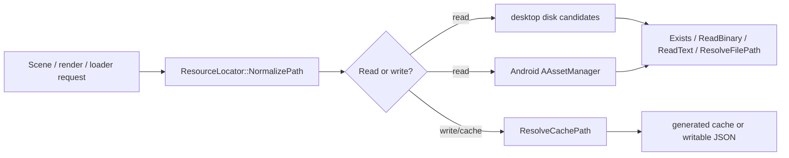
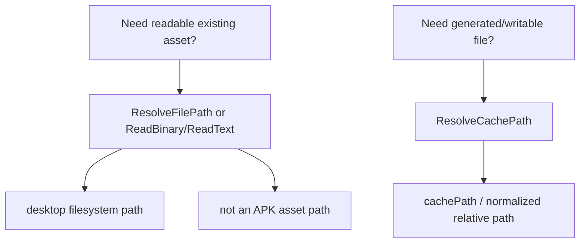
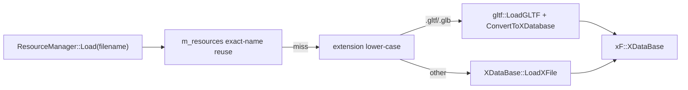
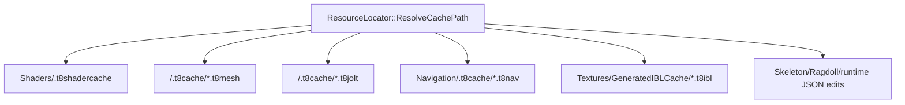

# Resource Locator and Cache Paths

Status: Stage 14 draft.

This document explains how T850 resolves asset paths, reads files on desktop and Android, chooses writable cache locations, and keeps generated cache files portable across editor, runtime scenes, and packaged builds.

Related documents:

- [Main architecture](main-architecture.md)
- [Platform event loop](platform-event-loop.md)
- [Loading geometry](../geometry/loading-geometry.md)
- [Shader management](../rendering/shader-management.md)
- [Textures, samplers, and IBL](../rendering/textures-and-ibl.md)
- [Jolt physics](../physics/jolt-physics.md)
- [NavMesh and Detour](../navigation/navmesh-detour.md)
- [Scene format and runtime](../scenes/scene-format-and-runtime.md)
- [Debug and diagnostics](../debug/diagnostics.md)

## Purpose and responsibilities

`ResourceLocator` is the central path abstraction for engine assets and generated runtime/editor caches.

It is responsible for:

1. Normalizing authored resource paths into engine-style relative names.
2. Reading bytes/text from desktop files or Android packaged assets.
3. Providing writable cache paths that work when assets are not directly writable.
4. Supporting recursive fallback lookup for moved scene meshes.
5. Keeping generated cache producers under consistent roots.



## Key files and classes

| File/class | Role |
|---|---|
| `Framework/include/utils/ResourceLocator.h` | Public singleton API for normalization, reads, lists, recursive lookup, file-path resolution, cache-path resolution, and Android asset-manager binding. |
| `Framework/src/utils/ResourceLocator.cpp` | Desktop candidate search, Android packaged-asset read/list/fallback logic, cache path resolution, and text/binary helpers. |
| `Framework/include/utils/AndroidAssets.h` / `Framework/src/utils/AndroidAssets.cpp` | Android wrapper functions that forward asset-manager setup and reads to `ResourceLocator`. |
| `DayScene/AndroidEntry.cpp` | Installs the Android `AAssetManager`, sets base/cache paths to app data storage, and changes the working directory on Android. |
| `Framework/src/utils/ResourceManager.cpp` | In-memory mesh database loader/reuser; dispatches `.gltf`/`.glb` to glTF and other paths to legacy `.x`. |
| `Framework/src/scene/EditorSceneFile.cpp` | `.t8scene` text read/write and recursive mesh fallback resolution. |
| `Framework/src/utils/gltf/GLTFLoader.cpp` | Reads `.gltf`/`.glb` and external glTF buffers through `ResourceLocator::ReadBinary`. |
| `Framework/src/utils/gltf/GLTFImage.cpp` | Reads external glTF images through `ReadBinary` and registers decoded texture bytes. |
| `Framework/src/video/BaseDriver.cpp` | Texture load path prepends `Textures/`, checks `Exists`, and falls back to checker texture when missing. |
| `Framework/src/utils/ShaderDiskCache.cpp` | Compiled shader artifact cache under `Shaders/.t8shadercache`. |
| `Framework/src/scene/MeshAssetCache.cpp` | Mesh preprocess/culling metadata cache under source-local `.t8cache` directories. |
| `Framework/src/physics/JoltPhysicsSystem.cpp` | Cooked Jolt triangle mesh cache under source-local `.t8cache` directories. |
| `Framework/src/navigation/NavigationSystem.cpp` | Generated and baked `.t8nav` cache/asset load-save paths. |
| `Framework/src/scene/IBLResources.cpp` | Generated IBL cache under `Textures/GeneratedIBLCache`. |

## Singleton lifetime and configured roots

`ResourceLocator::Instance()` owns one process-wide locator.

On construction:

- `m_basePath` defaults to `std::filesystem::current_path()`.
- `m_cachePath` defaults to the same value as `m_basePath`.

Callers can change them with:

| API | Meaning |
|---|---|
| `SetBasePath(path)` | Adds a preferred root for resolving relative readable assets. |
| `GetBasePath()` | Returns the configured readable root. |
| `SetCachePath(path)` | Sets the preferred root for relative writable/cache files. |
| `GetCachePath()` | Returns the configured cache root. |

Android startup is the only platform-specific setup currently performed by the app:

1. `AndroidEntry.cpp` calls `SetAndroidAssetManager(state->activity->assetManager)`.
2. It chooses `externalDataPath` or `internalDataPath`.
3. It calls `SetBasePath(dataPath)` and `SetCachePath(dataPath)`.
4. It attempts `chdir(dataPath)` and logs the Android working directory.

That means packaged APK assets are read through `AAssetManager`, while generated files and caches go to app data storage.

## Path normalization rules

`ResourceLocator::NormalizePath(path)` performs engine-resource normalization:

1. Convert backslashes to forward slashes.
2. Remove leading slashes.
3. Remove leading `./` segments.
4. Strip a top-level `Assets/` prefix case-insensitively.

Examples:

| Input | Normalized output |
|---|---|
| `Assets\Models\Robot.glb` | `Models/Robot.glb` |
| `/Textures/sky.dds` | `Textures/sky.dds` |
| `./Scenes/day.json` | `Scenes/day.json` |

Important: `NormalizePath` does not lower-case the whole path. It preserves authored case after stripping `Assets/`. Case-insensitive behavior is limited to Android packaged-asset fallback and specific subsystem keys such as `MeshAssetCache::Normalize()`.

## Desktop read lookup

For non-absolute paths, desktop disk lookup tries a fixed candidate list. Given `originalPath` and `normalizedPath`, `DiskCandidates()` tries:

1. the original relative path,
2. the normalized relative path when it differs,
3. `basePath / normalizedPath`,
4. `current_working_directory / normalizedPath`,
5. `current_working_directory / Assets / normalizedPath`,
6. `current_working_directory / T850 / Assets / normalizedPath`.

If the original request is absolute, the absolute path is the only disk candidate.

This makes the same authored path work from several launch locations:

```text
Models/robot.glb
Assets/Models/robot.glb
<cwd>/Models/robot.glb
<cwd>/Assets/Models/robot.glb
<cwd>/T850/Assets/Models/robot.glb
```

## Android packaged-asset lookup

Android assets inside the APK are not regular filesystem files. Callers must use `Exists`, `ReadBinary`, `ReadText`, or `List`; `ResolveFilePath` is only meaningful for directly addressable filesystem paths.

Android behavior:

- `Exists()` checks packaged assets first, then disk candidates.
- `ReadBinary()` tries disk candidates first, then packaged assets.
- `ReadText()` calls `ReadBinary()` and converts the bytes to a string.
- `List()` merges Android packaged entries and disk entries, then sorts and de-duplicates them.

`ResolveAndroidAssetPathCaseInsensitive()` gives packaged builds a case-insensitive fallback:

1. Try to match the filename inside the requested parent directory.
2. If that fails, walk path segments from the root and match each segment case-insensitively.

This helps when desktop development succeeds on a case-insensitive filesystem but packaged Android asset casing differs.

## Public API behavior

| API | Behavior |
|---|---|
| `Exists(path)` | Normalizes the path, checks Android packaged assets on Android, then checks desktop disk candidates for a file or directory. |
| `ReadBinary(path, out)` | Clears `out`, normalizes the path, reads the first readable disk candidate, then falls back to Android packaged assets on Android. |
| `ReadText(path, out)` | Uses `ReadBinary`; clears `out` on failure. |
| `WriteText(path, text)` | Writes absolute paths directly. For relative paths, writes to an existing resolved file when found; otherwise writes under `ResolveCachePath`. |
| `List(directory, recursive)` | Lists files from Android assets and/or desktop disk, returns engine resource paths, sorts and de-duplicates results. |
| `ResolveFilePath(path)` | Returns the first regular desktop filesystem candidate; if nothing exists, returns the original requested path. |
| `ResolveCachePath(path)` | Returns absolute paths unchanged; otherwise normalizes and appends to `m_cachePath`, or returns the normalized relative path if no cache root exists. |
| `FindFileByNameRecursive(requestedPath, outPath, searchDirectories)` | Searches by filename under caller directories, requested parent, requested first top-level directory, `Models` for glTF/GLB, then root. |

## ResolveFilePath versus ResolveCachePath

Use the APIs for different purposes:



Use `ReadBinary` or `ReadText` when the data may live in an Android APK asset. Use `ResolveFilePath` only when a subsystem truly needs a `std::filesystem::path` to a disk file.

Use `ResolveCachePath` for generated data because packaged assets are read-only on Android and may be read-only in installed desktop builds.

## Scene and mesh fallback behavior

`.t8scene` files are loaded through `LoadEditorSceneFile()` using `ResourceLocator::ReadText()`.

After parsing, `EditorSceneFile.cpp` tries to repair missing mesh references:

1. Normalize object mesh paths with `NormalizeSceneResourcePath()`.
2. If the normalized glTF/GLB path exists, store that normalized path.
3. Otherwise search recursively by filename.

The fallback directories are:

- the scene file's parent directory,
- the mesh path's parent directory,
- the first top-level directory in the mesh path,
- `Models`.

`FindFileByNameRecursive()` also adds the requested parent, the first top-level directory, `Models` for `.gltf`/`.glb`, and root. It matches filenames case-insensitively and returns the first normalized resource path found.

This is a recovery path for moved scene meshes. It should not be used as a substitute for saving correct relative resource paths.

## ResourceManager path role

`ResourceManager::Load(filename)` is not a general path resolver. It is an in-memory `xF::XDataBase` reuse layer plus format dispatcher:



The actual file bytes are read deeper in the glTF loader, `XDataBase`, texture loader, shader source loader, or other subsystem through `ResourceLocator`.

## Read path users

| Subsystem | ResourceLocator dependency |
|---|---|
| Config/runtime JSON | `ConfigRuntime.cpp` reads config text through `ReadText`. |
| Render graph | `RenderGraph.cpp` reads render graph JSON through `ReadText`. |
| Scene descriptors | `SceneDescriptor.cpp` reads and writes descriptor JSON through `ReadText`/`WriteText`. |
| `.t8scene` | `EditorSceneFile.cpp` reads scene JSON through `ReadText` and writes JSON through `WriteText`. |
| Shader sources | `Utils.cpp::file2string()` reads shader/source text through `ReadText`. |
| Vulkan SPIR-V | `VulkanShader.cpp` reads binary shader artifacts through `ReadBinary`. |
| glTF buffers | `GLTFLoader.cpp` resolves external buffers relative to the `.gltf` and reads them through `ReadBinary`. |
| glTF images | `GLTFImage.cpp` resolves external images relative to the `.gltf` and reads them through `ReadBinary`. |
| Texture loading | `Texture::LoadTexture()` checks `Textures/<name>` with `Exists`; lower-level CIL file reads also use `ReadBinary`. |
| Q3 BSP collision | `Q3BspCollision.cpp` reads collision text through `ReadText`. |
| Ragdoll authoring | `PhysicsAuthoring.cpp` reads authoring JSON through `ReadText` and chooses writable paths through locator-aware helpers. |

## Cache-producing subsystems

Generated caches should be rooted through `ResolveCachePath()` unless the user explicitly provides an absolute output path.



| Cache | Path rule | Key/invalidation inputs |
|---|---|---|
| Shader disk cache | `ResolveCachePath("Shaders/.t8shadercache") / <api> / <sha1>` | cache format/version, API, driver signature, shader key bits, shader names, shader source contents. Driver metadata changes clear the API directory. |
| Mesh preprocess cache | `<source parent>/.t8cache/<stem>_v<version>_<hash>.t8mesh`, resolved under cache root for relative sources | cache version, clustering settings, source size, source write ticks or byte hash, normalized source path; header validates source signature, settings, and metadata ranges. |
| Jolt cooked mesh cache | `<source parent>/.t8cache/<stem>_joltmesh_v<version>_<hash>.t8jolt`, resolved under cache root for relative sources | cache version, Jolt version, platform tag, cook settings, normalized source path, vertices, indices; header validates version/Jolt/platform/counts. |
| Generated NavMesh cache | `Navigation/.t8cache/navmesh_<key>.t8nav` under cache root | cache version, Recast/T850 build settings, query extents, auto-link settings, off-mesh validation key, vertices, indices, off-mesh links, modifiers, area costs. |
| Baked NavMesh asset | caller path; relative save paths are resolved through `ResolveCachePath`, load paths through `ResolveFilePath` | baked files use expected key `0` and are treated as explicit assets rather than generated key-addressed cache entries. |
| IBL generated cache | `Textures/GeneratedIBLCache/<kind>_v<version>_<hash>.t8ibl` under cache root | cache version, IBL kind, source bytes or source path/file metadata, dimensions, mip/face/sample settings, generated sizes. |
| Runtime/editor JSON writes | absolute path, existing resolved file path, or cache path fallback | depends on owning subsystem; examples include runtime ImGui settings, skeleton edits, ragdoll edits, and descriptor writes. |

## Shader cache path

`ShaderDiskCache.cpp` uses:

```text
Shaders/.t8shadercache/
  metadata.json
  d3d11/<sha1>/...
  d3d12/<sha1>/...
  opengl/<sha1>/...
  vulkan/<sha1>/...
```

The root is always `ResourceLocator::Instance().ResolveCachePath("Shaders/.t8shadercache")`.

`metadata.json` stores per-API driver signatures. If a driver signature changes, the API-specific directory is removed before new artifacts are written. Individual shader directories include a `manifest.json` with cache format, cache version, API, SHA-1, shader key, shader source names, and driver signature.

## Mesh preprocess cache path

`MeshAssetCache` has two cache layers:

- in-memory `MeshAsset` entries keyed by a lower-case, forward-slash source path;
- disk preprocess metadata keyed by source signature and preprocess settings.

The disk path is:

```text
<source parent>/.t8cache/<stem>_v2_<hash>.t8mesh
```

For relative sources, the path is passed through `ResolveCachePath()`. For absolute sources, the `.t8cache` directory is placed next to the absolute source.

The source signature uses desktop file size/write time when the source is a real file. If a source is not a filesystem file but `ReadBinary()` succeeds, it hashes the bytes; this matters for Android packaged assets.

## Jolt cooked mesh cache path

`JoltPhysicsSystem` stores cooked triangle mesh shapes as:

```text
<source parent>/.t8cache/<stem>_joltmesh_v<version>_<hash>.t8jolt
```

The hash includes:

- T850 cooked-mesh cache version,
- Jolt version,
- platform tag,
- cook settings such as max triangles per leaf, build quality, active-edge threshold, and per-triangle user data,
- normalized source path,
- full vertex and index data.

The file header repeats version, hash, Jolt version, platform tag, vertex count, triangle count, and cook settings. A mismatch causes the cache to be ignored and rebuilt when disk cache is enabled.

## NavMesh cache and baked assets

Generated NavMesh cache files use:

```text
Navigation/.t8cache/navmesh_<16-hex-key>.t8nav
```

The key is computed from build settings plus source geometry and navigation metadata. `BuildCached()` loads the generated cache only when a nonzero key is provided and the geometry has no explicit off-mesh links. If explicit links are present, it rebuilds; the computed key still includes links and the result can be saved for later.

Baked NavMesh assets are different:

- `LoadBaked(path)` uses `ResolveFilePath(path)`.
- `SaveBaked(path)` writes an absolute path directly or resolves a relative path through `ResolveCachePath(path)`.
- baked files are serialized with expected cache key `0`.

This distinction lets editor-authored `.t8nav` files behave like named assets while generated caches remain content-addressed runtime files.

## IBL generated cache path

`IBLResources.cpp` writes generated image-based lighting data under:

```text
Textures/GeneratedIBLCache/
```

The root is resolved through `ResolveCachePath()`. The cache key includes the IBL output kind, source image bytes when readable, source path/file metadata as fallback, generated dimensions, mip/face count, and sample counts.

When loading a float cache, IBL first tries the resolved path and then falls back to `Textures/GeneratedIBLCache/<filename>` through `ReadBinary()`. That allows prepackaged generated cache assets to be read from `Assets/Textures/GeneratedIBLCache` on platforms where writing is unavailable or undesirable.

## Writable authoring paths

`WriteText()` is safe for portable relative writes because unresolved relative paths fall back to `ResolveCachePath()`.

Some authoring paths have custom behavior:

- `PhysicsAuthoring::ResolveRagdollEditWritePath()` writes existing relative ragdoll files in place when found on desktop, tries likely `Assets` locations when parents exist, and uses cache path on Android.
- Skeleton edit helpers in runtime scenes use `ResolveCachePath("SkeletonEdits/<key>.json")`.
- Runtime Android GUI settings use `ResolveCachePath("android_gui_settings.txt")`.

Use the same pattern for new editor/runtime generated JSON: prefer authored asset locations only when the file is intentionally part of source-controlled assets; otherwise use `ResolveCachePath()`.

## Extension rules

When adding a new asset reader:

1. Store relative engine resource paths, not absolute local paths, in `.t8scene` or descriptor JSON.
2. Normalize paths with `ResourceLocator::NormalizePath()` or a schema-specific equivalent that strips embedded `Assets/` prefixes.
3. Use `ReadBinary()`/`ReadText()` for data that may be packaged in an APK.
4. Use `ResolveFilePath()` only when a library requires a filesystem path and APK assets are not expected.

When adding a new generated cache:

1. Use `ResolveCachePath()` for the root.
2. Include a cache format/version number.
3. Include all settings that change generated output.
4. Include source identity and source content/signature, not only source filename.
5. Include platform or third-party library versions when serialized data is not portable.
6. Write to a temporary file and rename when practical.
7. Log cache hits, stale cache ignores, and cache write failures with the final resolved path.

## Known limitations and gotchas

- `NormalizePath()` preserves case. Do not rely on it to canonicalize desktop paths.
- `ResolveFilePath()` does not expose Android APK assets as files.
- Absolute paths bypass `basePath` and `cachePath`; avoid saving them into portable scene files.
- Recursive fallback matches by filename, so duplicate filenames under different folders can resolve to the first listed match.
- `ResourceManager::Load()` reuses resources by the request string it sees, while `MeshAssetCache` lower-cases its source key. Keep path normalization consistent before calling both.
- Texture loading still has legacy assumptions such as prepending `Textures/` before checking existence.
- Generated caches are safe to delete; they should rebuild if the owning subsystem's key/header validation is complete.

## Debugging checklist

1. Normalize the failing path and check whether it accidentally includes `Assets/`, a leading slash, or mixed separators.
2. On desktop, verify the file exists under one of the disk candidates: direct relative path, `basePath`, `cwd`, `cwd/Assets`, or `cwd/T850/Assets`.
3. On Android, use `Exists()`/`ReadBinary()` rather than `ResolveFilePath()` for packaged assets.
4. Check Android logcat for the working directory and data path selected in `AndroidEntry.cpp`.
5. If a `.t8scene` mesh is missing, check for `[SceneFile] Resolved missing mesh` log output and duplicate filenames under `Models`.
6. If a cache does not refresh, confirm the cache version/key includes the setting or source data you changed.
7. If a cache cannot be written, inspect `GetCachePath()` and parent directory creation errors in subsystem logs.
8. Delete the generated cache directory only after confirming the cache is derived data: `Shaders/.t8shadercache`, source `.t8cache`, `Navigation/.t8cache`, or `Textures/GeneratedIBLCache`.
