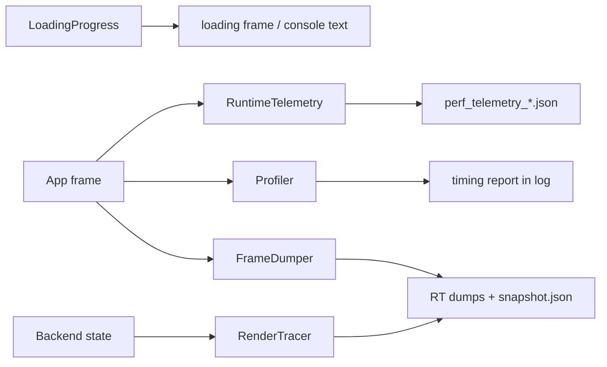
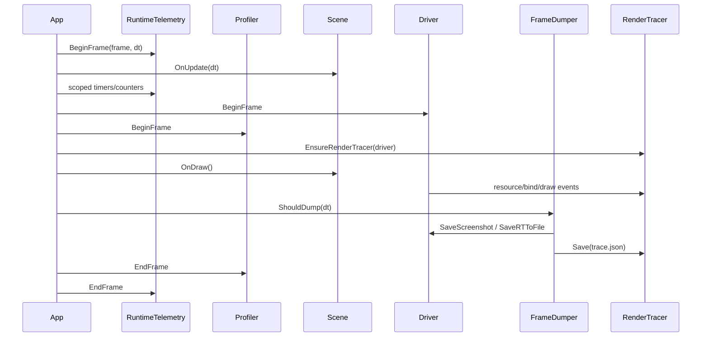

# Debug and Diagnostics

Status: Stage 13 draft.

This document explains T850's diagnostic stack: loading progress, runtime telemetry, frame dumps and replay snapshots, render tracing, profiler scopes, and how these systems are used by runtime scenes, editor, render graph, shaders, physics, and navigation.

Related documents:

- [Main architecture](../architecture/main-architecture.md)
- [Platform event loop](../architecture/platform-event-loop.md)
- [Resource locator and cache paths](../architecture/resource-locator.md)
- [FrameworkImGui runtime UI](../editor/imgui-system.md)
- [Dependency map](../dependency-map.md)
- [Render graph](../rendering/render-graph.md)
- [Geometry rendering flow](../rendering/geometry-rendering-flow.md)
- [Scene format and runtime](../scenes/scene-format-and-runtime.md)

## Purpose and responsibilities

Diagnostics help answer three questions:

1. What is loading or stalling?
2. What happened in a frame?
3. Why do two backends or two runs differ?



## Key files and classes

| File/class | Role |
|---|---|
| `Framework/include/debug/LoadingProgress.h` | Header-only loading progress state, scoped steps, snapshots, and frame callback. |
| `Framework/include/debug/RuntimeTelemetry.h` / `Framework/src/debug/RuntimeTelemetry.cpp` | Runtime frame sampling, scope timers, counters, and telemetry JSON output. |
| `Framework/include/debug/FrameDumper.h` / `Framework/src/debug/FrameDumper.cpp` | Render-target dump, snapshot capture, snapshot replay, frame-dump triggers. |
| `Framework/src/debug/FrameDumperIO.cpp` | Glaze JSON snapshot load/save plus legacy text snapshot parser. |
| `Framework/include/debug/RenderTrace.h` / `Framework/src/debug/RenderTrace.cpp` | Optional compile-time render event/resource tracer, guarded by `T850_RENDER_TRACE`. |
| `Framework/include/debug/Profiler.h` / `Framework/src/debug/Profiler.cpp` | CPU/GPU scope profiler and draw-call counting. |
| `DayScene/Application.cpp` | Runtime frame lifecycle, render tracer init, telemetry frame boundaries, profiler frame boundaries. |
| `T8ditor/EditorApp.cpp` | Loading progress console/render frame, editor frame dumps, hosted window diagnostics. |
| `FrameworkImGui/src/ImGuiSystem.cpp` | Installs `LoadingProgress` frame callback and renders loading frames. |

## LoadingProgress

`LoadingProgress` is a small global progress state used by load/build paths that can take visible time.

It stores:

- phase,
- item,
- detail,
- completed weight,
- total weight,
- percent,
- active flag.

Important APIs:

| API | Meaning |
|---|---|
| `Reset(totalWeight, phase, item, detail)` | Starts a progress session. |
| `ScopedStep` | RAII step that updates current phase/item and advances by weight on destruction. |
| `SetCurrent()` | Updates phase/item/detail. |
| `SetDetail()` | Updates detail string. |
| `Advance(weight)` | Advances completed work. |
| `Complete()` | Marks total complete and forces a frame request. |
| `GetSnapshot()` | Returns a thread-safe progress snapshot. |
| `SetFrameCallback()` | Installs a callback for rendering/loading-frame pumping. |

`LoadingProgress` throttles frame callback requests to roughly 33 ms unless forced. `FrameworkImGui::ImGuiSystem` installs a callback that renders a loading frame while long tasks run, and T8ditor can format snapshots for the console/loading UI.

Common call sites include:

- model loading,
- glTF conversion,
- texture creation,
- shader compilation,
- render graph loading,
- scene loading,
- editor startup.

## RuntimeTelemetry

`RuntimeTelemetry` is a lightweight frame sampler for CPU scopes and numeric counters.

Enablement comes from `Config`:

- `runtimeTelemetry`
- `runtimeTelemetryFrequencyFrames`
- `runtimeTelemetryOutputPath`

Important APIs:

| API | Meaning |
|---|---|
| `InitializeFromConfig(config)` | Enables/disables telemetry and chooses sample frequency/output path. |
| `BeginFrame(frameIndex, deltaSeconds)` | Clears frame state and activates sampling for selected frames. |
| `EndFrame()` | Stores the current frame sample when active. |
| `ScopedTimer` / `T8_TELEMETRY_SCOPE(name)` | Records elapsed milliseconds for a named scope. |
| `AddCounter(name, value)` | Accumulates a numeric counter for the active frame. |
| `SetCounter(name, value)` | Sets/replaces a numeric counter for the active frame. |
| `Shutdown()` | Flushes collected samples to a timestamped JSON file. |

Output:

- default path: `logs/perf_telemetry.json`,
- actual file is timestamped,
- JSON contains sampled frames, scopes, and counters.

Telemetry is used throughout render, physics, navigation, animation, benchmark, projection/path queries, mesh drawing, and loading-sensitive paths.

## FrameDumper and replay snapshots

`FrameDumper` captures render output and enough scene state to replay a frame.

Inputs:

- `FrameDumperConfig`,
- active cameras,
- `SceneProps`,
- list of render target dump entries,
- optional omni cameras/light position,
- optional skinned mesh snapshot.

Triggers:

- explicit request, such as editor/runtime spacebar debug flow,
- frame number,
- elapsed seconds,
- replay warmup completion.

Output directory format:

```text
dumps_<api>_f<frame>_<timestamp>/
```

Files written:

- backbuffer screenshot,
- named render target attachments,
- `snapshot.json`,
- optional `trace.json` when `T850_RENDER_TRACE` is enabled.

Snapshot contents include:

- camera and light camera state,
- scene props,
- matrices,
- lights,
- optional omni state,
- optional skinned mesh state including bone matrices and bone texture data.

Replay flow:

1. Load a `snapshot.json` or legacy text snapshot.
2. Apply camera, light, scene props, matrices, optional omni and skinned data.
3. Warm up for a few frames.
4. Trigger a dump.

This is useful for cross-API image comparisons and reproducing a frame without manually recreating UI/runtime state.

## RenderTrace

`RenderTrace` is compiled only when `T850_RENDER_TRACE` is defined. When disabled, trace macros become no-ops.

Its goal is mechanical cross-backend diffing, especially D3D12 vs Vulkan.

It records:

- textures and views,
- render targets,
- shaders and vertex input layouts,
- PSOs/pipelines,
- samplers,
- buffers and buffer update versions,
- render state,
- render target push/pop/clear,
- shader/PSO/resource binds,
- draw-indexed events,
- denormalized per-draw state snapshots.

The tracer distinguishes:

- request events, when engine code calls `Texture::Set`, CB/VB/IB bind, etc.;
- commit events, when a backend actually makes GPU-visible bindings.

This matters because Vulkan delays descriptor binding until draw time.

Runtime initialization happens through `EnsureRenderTracer()` in the app draw path. `FrameDumper::DumpFrame()` saves trace data beside render target dumps when tracing is enabled.

## Profiler

`Profiler` measures named CPU/GPU scopes and draw-call counts.

Enablement:

- runtime `--profile`,
- Android profile launch extra,
- direct initialization after driver creation.

Key APIs:

| API | Meaning |
|---|---|
| `Init(driver, maxScopes)` | Creates API-specific GPU timestamp backend. |
| `BeginFrame()` / `EndFrame()` | Frame profiler boundary. |
| `BeginScope()` / `EndScope()` | CPU + GPU scoped timing. |
| `BeginCPUScope()` / `EndCPUScope()` | CPU-only scoped timing. |
| `AddDrawCall(vertexCount)` | Counts draw work from backend draw calls. |
| `Report()` | Logs timing breakdown. |
| `Reset()` | Clears accumulated results. |

Backends:

- D3D12 timestamp query heap + readback buffer.
- D3D11 timestamp/disjoint queries.
- OpenGL timestamp queries.
- Vulkan query pool/readback allocation with deferred reset support.

Macros:

- `T8_PROFILE_SCOPE(g_profiler, "name")`
- `T8_PROFILE_CPU_SCOPE(g_profiler, "name")`

## Runtime frame integration

Typical runtime frame:



## Editor integration

T8ditor uses diagnostics for:

- startup loading progress,
- render target/frame dumps,
- console progress text,
- editor render graph RT dump entries,
- hosted window state logging,
- NavMesh wire dump logs,
- physics/navigation debug overlays.

Because editor hosted windows can freeze the main editor viewport, frame dumps may capture either the active editor frame or the frozen frame target depending on open hosted windows.

## Common workflows

### Investigating a black frame

1. Trigger a frame dump.
2. Inspect backbuffer and render target outputs.
3. If trace is enabled, compare `trace.json` against a known-good backend.
4. Check shader key, PSO, RT, texture, and CB bindings in the draw snapshot.
5. Cross-check [Render graph](../rendering/render-graph.md), [Shader management](../rendering/shader-management.md), and [Geometry rendering flow](../rendering/geometry-rendering-flow.md).

### Investigating a load stall

1. Check `LoadingProgress::GetSnapshot()` output in UI/console.
2. Find the phase/item/detail.
3. Search call sites for the phase string.
4. Check resource lookup, cache loading, shader compilation, or mesh conversion depending on phase.

### Investigating performance

1. Enable profiler for GPU/CPU timings.
2. Enable runtime telemetry for sampled counters/scopes.
3. Use benchmark output where available for aggregate frame timings.
4. Correlate telemetry scope names with render graph pass names and physics/navigation counters.

## Extension points

When adding a new diagnostic:

1. Prefer `T8_TELEMETRY_SCOPE` for low-overhead scoped timing.
2. Add counters with stable names; use dot-separated prefixes such as `render.mesh.*`.
3. Use `LoadingProgress::ScopedStep` for long load/build operations.
4. Add `FrameDumper` RT entries when a new render target is important for debugging.
5. Add `RenderTrace` resource/event hooks only inside `T850_RENDER_TRACE` guards.
6. Add profiler scopes around GPU-relevant passes if timing granularity matters.

## Known limitations and gotchas

- `LoadingProgress` is global and assumes one active progress flow.
- Runtime telemetry samples only selected frames based on `frequencyFrames`; missing frames may be intentional.
- Telemetry writes on shutdown, so hard process termination can lose output.
- Frame dumps write API-specific image/trace output and can be expensive.
- Replay snapshots are not full scene serialization; they restore render/camera/light/props state for reproducibility, not arbitrary gameplay state.
- RenderTrace only exists in trace-enabled builds.
- RenderTrace schema intentionally writes many sentinel/default fields for mechanical diffability.
- GPU profiler results are asynchronous and may represent earlier frames depending on backend.
- Some diagnostics are runtime-only or editor-only depending on call sites.

## Debugging checklist

1. Confirm the feature is compiled/enabled: `T850_RENDER_TRACE`, `--profile`, runtime telemetry config, dump flags.
2. For loading UI, verify `LoadingProgress::SetFrameCallback()` is installed and the progress flow called `Reset()`.
3. For telemetry, verify `RuntimeTelemetry::IsEnabled()` and sample frequency.
4. For missing telemetry output, ensure normal shutdown calls `RuntimeTelemetry::Shutdown()`.
5. For frame dumps, check `FrameDumperConfig`, dump trigger, `keepRunning`, and RT dump entry list.
6. For replay, verify `snapshot.json` parsed and warmup completed.
7. For render trace, ensure `g_renderTracer` is initialized and `FrameDumper` saved trace output.
8. For profiler, check driver API support and that `BeginFrame()` / `EndFrame()` bracket the frame.
9. For cross-API mismatches, compare render target outputs first, then shader/PSO/resource/draw snapshots.
