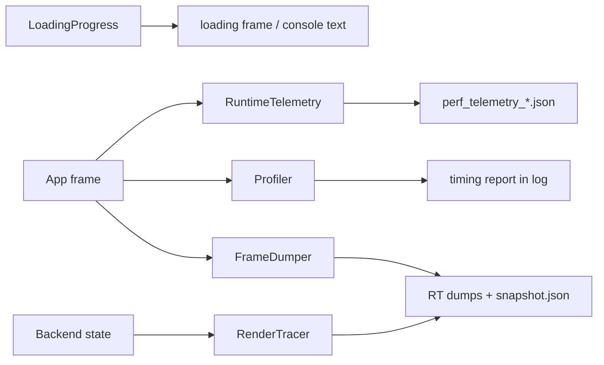
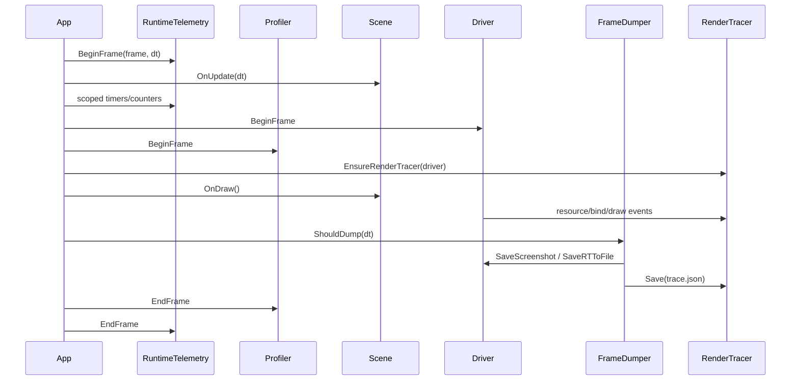

# Debug and Diagnostics

Status: verified against source and four profiler-backend runtime tests on 2026-08-30.

For native Windows assertions, exception stacks, and dump analysis, use the
[CDB crash-debugging skill](../../.github/skills/t850-crash-debugging/SKILL.md).
Windows Debug entry points install `InstallUnattendedCrtReportHook()` before
engine initialization, which suppresses Abort/Retry/Ignore and sends the
assertion breakpoint directly to an attached debugger.

The 2026-08-19 VoxelScene bring-up demonstrated this workflow: CDB identified
`RenderQuad::Draw()` indexing an empty `SceneProps::pGaussKernels` vector from a
blur pass. `VoxelScene` now registers all three graph-selected kernels, and
`RenderQuad` rejects missing/empty kernels instead of indexing them. The same
unattended CDB command subsequently completed timed captures on D3D11, D3D12,
OpenGL, and Vulkan without application exception markers.

This document explains T850's diagnostic stack: loading progress, runtime telemetry, frame dumps and replay snapshots, render tracing, profiler scopes, and how these systems are used by runtime scenes, editor, render graph, shaders, physics, and navigation.

Related documents:

- [Main architecture](../architecture/main-architecture.md)
- [Platform event loop](../architecture/platform-event-loop.md)
- [Resource locator and cache paths](../architecture/resource-locator.md)
- [FrameworkImGui runtime UI](../editor/imgui-system.md)
- [Dependency map](../dependency-map.md)
- [Render graph](../rendering/render-graph.md)
- [Geometry rendering flow](../rendering/geometry-rendering-flow.md)
- [Scene format and runtime](../scenes/scene-format-and-runtime.md)
- [Visual regression baselines](visual-regression.md)

## Purpose and responsibilities

Diagnostics help answer three questions:

1. What is loading or stalling?
2. What happened in a frame?
3. Why do two backends or two runs differ?



## Key files and classes

| File/class | Role |
|---|---|
| `Framework/include/debug/LoadingProgress.h` | Header-only loading progress state, scoped steps, snapshots, and frame callback. |
| `Framework/include/debug/RuntimeTelemetry.h` / `Framework/src/debug/RuntimeTelemetry.cpp` | Runtime frame sampling, scope timers, counters, and telemetry JSON output. |
| `Framework/include/debug/FrameDumper.h` / `Framework/src/debug/FrameDumper.cpp` | Render-target dump, snapshot capture, snapshot replay, frame-dump triggers. |
| `Framework/src/debug/FrameDumperIO.cpp` | Glaze JSON snapshot load/save plus legacy text snapshot parser. |
| `Framework/include/debug/RenderTrace.h` / `Framework/src/debug/RenderTrace.cpp` | Optional compile-time render event/resource tracer, guarded by `T850_RENDER_TRACE`. |
| `Framework/include/debug/Profiler.h` / `Framework/src/debug/Profiler.cpp` | API-neutral CPU timing, scope accounting, draw-call counting, and reporting. |
| `Framework/src/debug/ProfilerGpuBackend.cpp` | D3D11, D3D12, OpenGL, and Vulkan timestamp-query strategies selected by one factory. |
| `Framework/include/debug/GpuTimestampProfiler.h` / `Framework/src/debug/GpuTimestampProfiler.cpp` | Opt-in completion-driven D3D12/Vulkan/WebGPU whole-frame and logical render-graph pass timestamps. |
| `DayScene/Application.cpp` | Runtime frame lifecycle, render tracer init, telemetry frame boundaries, profiler frame boundaries. |
| `T8ditor/EditorApp.cpp` | Loading progress console/render frame, editor frame dumps, hosted window diagnostics. |
| `FrameworkImGui/src/ImGuiSystem.cpp` | Installs `LoadingProgress` frame callback and renders loading frames. |

## LoadingProgress

`LoadingProgress` is a small global progress state used by load/build paths that can take visible time.

It stores:

- phase,
- item,
- detail,
- completed weight,
- total weight,
- percent,
- active flag.

Important APIs:

| API | Meaning |
|---|---|
| `Reset(totalWeight, phase, item, detail)` | Starts a progress session. |
| `ScopedStep` | RAII step that updates current phase/item and advances by weight on destruction. |
| `SetCurrent()` | Updates phase/item/detail. |
| `SetDetail()` | Updates detail string. |
| `Advance(weight)` | Advances completed work. |
| `Complete()` | Marks total complete and forces a frame request. |
| `GetSnapshot()` | Returns a thread-safe progress snapshot. |
| `SetFrameCallback()` | Installs a callback for rendering/loading-frame pumping. |

`LoadingProgress` throttles frame callback requests to roughly 33 ms unless forced. `FrameworkImGui::ImGuiSystem` installs a callback that renders a loading frame while long tasks run, and T8ditor can format snapshots for the console/loading UI.

Common call sites include:

- model loading,
- glTF conversion,
- texture creation,
- shader compilation,
- render graph loading,
- scene loading,
- editor startup.

## RuntimeTelemetry

`RuntimeTelemetry` is a lightweight frame sampler for CPU scopes and numeric counters.

Enablement comes from `Config`:

- `runtimeTelemetry`
- `runtimeTelemetryFrequencyFrames`
- `runtimeTelemetryOutputPath`

Important APIs:

| API | Meaning |
|---|---|
| `InitializeFromConfig(config)` | Enables/disables telemetry and chooses sample frequency/output path. |
| `BeginFrame(frameIndex, deltaSeconds)` | Clears frame state and activates sampling for selected frames. |
| `EndFrame()` | Stores the current frame sample when active. |
| `ScopedTimer` / `T8_TELEMETRY_SCOPE(name)` | Records elapsed milliseconds for a named scope. |
| `AddCounter(name, value)` | Accumulates a numeric counter for the active frame. |
| `SetCounter(name, value)` | Sets/replaces a numeric counter for the active frame. |
| `Shutdown()` | Flushes collected samples to a timestamped JSON file. |

Output:

- default path: `logs/perf_telemetry.json`,
- actual file is timestamped,
- JSON contains sampled frames, scopes, and counters.

Telemetry is used throughout render, physics, navigation, animation, benchmark, projection/path queries, mesh drawing, and loading-sensitive paths.

Gameplay publishes stable counters on sampled frames:

- `game.entities.total`, `game.entities.active`
- `game.components.total`, `game.components.updated`
- `game.events.queued`, `game.events.dispatched`
- `game.state_machines.transitions`
- `game.physics.queries`, `game.nav.requests`, `game.nav.completed`
- `game.validation.errors`, `game.validation.warnings`

Gameplay scopes include `game.update`, component phases, event dispatch, state machines, groups, and `game.spatial_queries`. Telemetry flushes only on normal framework shutdown; direct `exit()` paths such as timed frame dumps do not write the JSON unless capture uses `--keepRunning` and the window closes normally.

Exception: bounded DayScene `--profile --profileFrames N` now finalizes after
the completed frame, flushes telemetry and the profile log, then exits natively
or pauses in the browser. Pair it with `--telemetry --telemetryFrequencyFrames 1`
to measure all frames, including periodic waits. The browser URL/test can enable
this mode explicitly; see [browser profiling](../platform/browser.md#capturing-profiles).
Ordinary browser launches keep profiling disabled.

WebGPU CPU scopes separate `webgpu.buffer_upload`, `webgpu.create_buffer`,
`webgpu.write_buffer`, `webgpu.uniform_snapshot`, `webgpu.uniform_upload`,
`webgpu.draw`, `webgpu.create_bind_group`, `webgpu.queue_submit`,
`webgpu.surface_acquire`, `webgpu.collect_completed`, and `webgpu.inflight_wait`.
`webgpu.binding_prepare` covers descriptor/snapshot preparation;
`webgpu.encoder_commands` covers the actual WebGPU command-encoder calls.
Counters record allocations/reuses, uploaded bytes, bind groups, queued batches,
evictions, and free-pool bytes. Buffer shadow-update bytes are not GPU traffic:
uniform snapshots are batched later, with separate byte and queue-upload counts.
These are inclusive CPU wall-time scopes, not GPU queries;
do not sum parent and child scopes or interpret a wait as active CPU execution.
Opt-in GPU timestamp builds provide separate whole-frame and render-graph-pass
queries for D3D12, Vulkan, and WebGPU; see the
[GPU performance profiling workflow](../rendering/gpu-performance-profiling-workflow.md).
Cumulative draw/triangle totals are 64-bit; normalize them by the sample count
before comparing workloads.

Browser `window.t850.workerTiming` reports ten-frame average callback intervals
and work time without enabling per-draw profiling. The interval includes host
scheduling gaps; work includes input and the application update/draw call.
Use this to distinguish a frame cap or timer delay from rendering work, not to
infer displayed refresh rate or GPU execution time.

`window.t850.input` accompanies the ten-frame diagnostics: `keys`, `mouse`, and
`focus` count SDL keyboard, mouse-motion, and window-focus events; `relative`
reports SDL relative-mouse mode and `forward` reports the held W key. Combine
these with DOM focus/pointer lock, frame progression, player movement and
`window.t850.errors` when investigating apparent input loss. The browser harness
supports repeated held input and focus cycles; see
[input/resize regression](../platform/browser.md#input-and-resize-regression).

`window.t850.touch` records active state, both stick axes, jump/sprint and block
actions sampled by the engine worker. Verify actual player movement and accepted
block/remesh logs as well as these input values. The touch harness requires
`logLevel=info`; the production welcome intentionally launches with error-only
logging. Test welcome navigation and log-based block verification separately.

`window.t850.camera` reports Minecraft's active mode (0 player, 1 spectator,
2 light), `invertY`, pitch, camera position and player position. The View/InvertY
buttons reflect this scene-owned state. The harness's `--camera-controls` test
measures pitch changes in both modes and spectator motion independent of the
player; combine it with `--touch` for virtual controls or use desktop mouse input.
These are functional checks, not input-latency or physical-device certification.

WebGPU startup logs `Device optional features: BC=... float32-filterable=...`.
The browser harness's `--disable-bc --disable-float-filtering` options modify
device requests inside workers and assert both features are absent there.
Adapter feature lists alone do not establish which features the device enabled.
See [mobile GPU compatibility](../platform/browser.md#touch-and-optional-gpu-features-v012)
for the release validation and precision/filtering tradeoffs.

The browser shell displays its first recorded failure in an expandable runtime
error panel, including the available JavaScript stack and last frame/input/size
snapshot. It retains that bounded report in `window.t850.lastError` and this tab's
`sessionStorage` under `t850:last-runtime-error:v1`. A reload labels retained data
as a previous-run error instead of marking the new run failed. Follow-up errors
cannot overwrite the first report; blocked storage does not prevent its display.
This cannot recover a failure from an older build or record a hard page-thread
hang that never reaches the error handler. Reports stay in the tab and are not
automatically sent to a server.

Browser C/C++ stacks are explicitly 2 MiB for the main application and pthreads,
with stack-pointer checks enabled. The separate Asyncify stack remains 256 KiB.
See [Wasm stack and block edits](../platform/browser.md#wasm-stack-and-block-edits)
for the confirmed 64 KiB overflow reproduction and its regression tests.

## FrameDumper and replay snapshots

`FrameDumper` captures render output and enough scene state to replay a frame.

Inputs:

- `FrameDumperConfig`,
- active cameras,
- `SceneProps`,
- list of render target dump entries,
- optional omni cameras/light position,
- optional skinned mesh snapshot.

Triggers:

- explicit request, such as editor/runtime spacebar debug flow,
- frame number,
- elapsed seconds,
- replay warmup completion.

Output directory format:

```text
dumps_<api>_f<frame>_<timestamp>/
```

Files written:

- backbuffer screenshot,
- named render target attachments,
- `snapshot.json`,
- optional `trace.json` when `T850_RENDER_TRACE` is enabled.

Snapshot contents include:

- camera and light camera state,
- scene props,
- matrices,
- lights,
- optional omni state,
- optional skinned mesh state including bone matrices and bone texture data.

Replay flow:

1. Load a `snapshot.json` or legacy text snapshot.
2. Apply camera, light, scene props, matrices, optional omni and skinned data.
3. Warm up for a few frames.
4. Trigger a dump.

This is useful for cross-API image comparisons and reproducing a frame without manually recreating UI/runtime state.

## RenderTrace

`RenderTrace` is compiled only when `T850_RENDER_TRACE` is defined. When disabled, trace macros become no-ops.

Its goal is mechanical cross-backend diffing, especially D3D12 vs Vulkan.

It records:

- textures and views,
- render targets,
- shaders and vertex input layouts,
- PSOs/pipelines,
- samplers,
- buffers and buffer update versions,
- render state,
- render target push/pop/clear,
- shader/PSO/resource binds,
- draw-indexed events,
- denormalized per-draw state snapshots.

The tracer distinguishes:

- request events, when engine code calls `Texture::Set`, CB/VB/IB bind, etc.;
- commit events, when a backend actually makes GPU-visible bindings.

This matters because Vulkan delays descriptor binding until draw time.

Runtime initialization happens through `EnsureRenderTracer()` in the app draw path. `FrameDumper::DumpFrame()` saves trace data beside render target dumps when tracing is enabled.

## Profiler

`Profiler` measures named CPU/GPU scopes and draw-call counts. It contains no graphics-API dispatch: `CreateProfilerGpuBackend()` selects one `ProfilerGpuBackend`, which owns API-specific query resources and operations.

Enablement:

- runtime `--profile`,
- Android profile launch extra,
- direct initialization after driver creation.

Key APIs:

| API | Meaning |
|---|---|
| `Init(driver, maxScopes)` | Creates the matching GPU strategy; CPU-only profiling remains available if no strategy is supported. |
| `BeginFrame()` / `EndFrame()` | Frame profiler boundary. |
| `BeginScope()` / `EndScope()` | CPU + GPU inclusive timing; begin returns a token accepted by end. |
| `BeginCPUScope()` / `EndCPUScope()` | CPU-only inclusive timing with the same nesting/token contract. |
| `AddDrawCall(vertexCount)` | Counts work on the innermost recorded active scope, not a previously closed scope. |
| `FlushDeferredQueryReset(commandBuffer)` | Delegates deferred query reset to the GPU strategy before rendering. |
| `Report()` | Logs an inclusive scope tree with independent CPU/GPU sample counts. |
| `Reset()` | Discards open samples, clears results and advances the result generation without reusing current-frame query slots. |

Backend strategies:

- D3D12 timestamp query heap + readback buffer.
- D3D11 timestamp/disjoint queries.
- OpenGL timestamp queries.
- Vulkan query pool with deferred command-buffer reset support.

Each strategy owns initialization, query begin/end, frame mapping, result resolution, and destruction. Typed D3D/Vulkan casts are confined to the matching strategy implementation. Adding an API requires a new strategy and one factory entry, not branches throughout `Profiler`.

Macros:

- `T8_PROFILE_SCOPE(g_profiler, "name")`
- `T8_PROFILE_CPU_SCOPE(g_profiler, "name")`

### Scope accounting contract

Scopes belong to the frame thread and must be strictly nested inside
`BeginFrame()` / `EndFrame()`. CPU and GPU scopes share an active stack, while
query slots advance monotonically for the frame. `maxScopes` limits recorded
scope invocations per frame, not the number of distinct names. An overflow
begin retains an unrecorded stack entry so its matching end cannot close its
parent; the profiler emits a named warning. RAII guards retain their begin
token, cannot be copied, and cannot close scopes in a later frame or reset
generation. Legacy tokenless ends close the matching top-of-stack kind.

Unmatched or out-of-order ends warn without closing a different scope. An open
scope at frame end warns with its name, closes any GPU timestamp pair and
discards that incomplete sample. Draw/triangle counts are exclusive to the
innermost recorded scope; timing is inclusive. Identical names under different
parents remain distinct report nodes. Do not sum nested averages into a frame
total; child and parent times overlap.

`cpuSampleCount` increments when a CPU sample closes; `gpuSampleCount` increments
only when a valid asynchronous result arrives. GPU samples can lag or be
dropped without changing the CPU denominator. GPU fields with no valid samples
are reported as `unavailable`. Each backend stores the scope generation with
pending results and rejects results from before `Reset()`, even if a new scope
reuses the same report index. D3D12 resolves only initialized GPU timestamp
pairs, skipping CPU-only slots.

The shared self-tests include `T-PROFILER-ACCOUNTING-01`,
`T-PROFILER-SAMPLES-01`, `T-PROFILER-GUARDS-01` and `T-PROFILER-RESET-01`.
They use an injected clock and GPU strategy to check exact durations, nesting,
overflow, unmatched ends, draw attribution, reset, and delayed/dropped results.

Use `--profile --profileFrames 120` for a bounded profiling run. `--frames` is
not a supported runtime frame-limit option. Retain explicit process timeouts
for diagnostic runs; telemetry alone does not make a run finite. R1 runtime
validation and the resolved offscreen attachment-compatibility follow-up are
tracked in the [remediation plan](../rendering/webgpu-compute-remediation-plan.md#r1-fix-profiler-scope-accounting-and-remove-the-vulkan-leak).

R1 fixes accounting, not instrumentation overhead. String-based registration,
telemetry locking and Vulkan's blocking GPU-query resolve remain separate work;
do not use these results as an instrumentation-overhead benchmark.

## Runtime frame integration

Typical runtime frame:



## Editor integration

T8ditor uses diagnostics for:

- startup loading progress,
- render target/frame dumps,
- console progress text,
- editor render graph RT dump entries,
- hosted window state logging,
- NavMesh wire dump logs,
- physics/navigation debug overlays.

Because editor hosted windows can freeze the main editor viewport, frame dumps may capture either the active editor frame or the frozen frame target depending on open hosted windows.

## CPU Profiling Workstream

Implementation checkpoint: 2026-09-18. Literal scopes/counters now use registered
IDs; graph-pass handles are registered at graph load. Profiler lookup is indexed.
Telemetry entry/exit writes thread-owned fixed slots without name allocation,
locking or hashing after first registration and worker initialization. Explicit
string overloads remain slow paths, not repeated-draw APIs.

Workers publish buffers with release/acquire ownership transfer. Frame merging
never reads a writing buffer. Completed scopes retain their issue-frame token;
reset changes the session/token range and rejects stale work. Reports expose
late publications, drops and unfinished writers. Storage is bounded to 512
metrics, 128 thread registrations, eight buffers per worker and 8192 captured
frames per session. Overflow is reported, not blocked. Counter-only worker jobs
should call `PublishThread()` before returning; the shared thread pool, outer
worker timers/upload guards and thread exit publish automatically. Thread-pool
jobs inherit upload-source provenance from their submitter.

Use `--profileCpuOnly --profileFrames N` for bounded CPU timing without a GPU
profiler strategy or query waits. `--profile` retains the existing GPU behavior.
Compile instrumentation out with MSBuild `/p:T850EnableProfiling=0` or CMake
`-DT850_ENABLE_PROFILING=OFF`; the default is enabled. This removes instrumentation
macros and makes direct telemetry recording inert. Runtime-disabled and
compiled-out builds are different measurement states.

### Report semantics

JSON version 2 retains named scopes/counters and adds actual `cpuFrameMs`
(not simulation `deltaMs`), startup epochs, uploads, availability and backend
metadata. Unsupported ring/pool/driver fields are `null`, never fabricated zero.
Existing event-counter names are preserved. Driver phase names are `gpu.encode`,
`gpu.submit`, `gpu.present` and `gpu.gpu_wait` where the phase exists. No wait or
flush was added to produce a metric; implicit D3D11/GL submission is not reported
as a separate queue-submit duration.

Scopes mark phases, counters count calls. Per-draw/binding/mesh/query timers are
removed from the default path. Camera, gameplay, physics, navigation build/rebuild,
streaming, terrain commits and asset loading have coarse markers. The current
world navigation operation is a full `navigation.rebuild`, not an incremental
tile update.

Fragmented animation, culling, camera, physics-query, agent, upload-batch and
worker-decode work uses `T8_CPU_WORK`:
two clocks and fixed-slot accumulation, labelled `accumulatedWork: true`.
`totalMs` is summed CPU work, `maxMs` the largest contribution, and count counts
published aggregates, not calls. `.calls` counters retain volume. Cross-thread
work sums can exceed wall time. Inclusive phase scopes overlap and must not be
summed into a frame partition. `asset.gltf.image_decode_batch` is elapsed batch
time; `asset.gltf.image_decode` is worker CPU work.

`camera.update` measures the camera calculation on every scene path;
`camera.controller.update` is the inclusive controller phase. `physics.queries`
measures actual casts/overlaps, not all pre-physics components. Raw `gpu.draws`
and `gpu.indices` remain intact. Per-pass and named effect/text counters identify
where work differs; unclassified work uses `gpu.auxiliary_*`.

### Startup attribution

The startup epoch remains active through asset loading and fade/loading pump
frames. These do not count toward `--profileFrames`. With `--regressionFixedDt`,
fades advance with the same fixed simulation step on each backend, so runtime
frame zero starts at the same scene state.

`startupTiming.firstRuntimeFrameStartMs` and `firstRuntimeFrameCompleteMs` are
measured from telemetry initialization, not OS process creation. Completion is
the CPU frame/submission/present return, not GPU completion or display latency.
An unreached milestone is `null`. The startup frame retains uploads and scopes:

- `shader.compile`: native compiler work, with operation counts.
- `shader.translate.hlsl_spirv_wgsl` and `shader.prepare.wgsl`: WebGPU compiler
  preparation reports, excluding cache hits; `shader.load` includes lookup/I/O.
- `shader.module.create`, `pipeline.create.graphics`, `pipeline.create.compute`:
  engine-owned creation operations. D3D11 has shader objects, not explicit PSOs;
  OpenGL reports program linking as pipeline creation.
- `shader.cache.hits`, `.misses`, `.uncached`, and `shader.packaged.stages`:
  provenance. Browser package-load timing does not replay offline compiler times.

These are infrequent resource-creation events, not per-draw API tracing or a
measurement of time inside Dawn. Shader caches are not cleared by the harness;
an observed warm launch is never labelled a cold-compile measurement.

### Upload accounting

An upload belongs to one resource (`Vertex`, `Index`, `Uniform`, `Texture`) and
one source (`PerFrame`, `Streaming`, `AssetLoad`). The report includes 12 cells
plus row/column totals: logical bytes, observed staging bytes, calls, CPU
nanoseconds, known allocations and largest logical upload. Nested wrappers are
suppressed. `RecordStaging` adds physical copies without another logical call.
Counts describe observed engine operations, not opaque driver-internal copies
or renaming. Source guards follow the owning load/batch rather than byte size.

Native buffer create/update and dynamic texture methods, WebGPU snapshots,
raw/compressed/float/cubemap creation, shared asset textures and mutable streaming
meshes feed the same schema. Mip-chain and layer sizes are included. Physical
D3D12/Vulkan staging/ring copies and WebGPU packing writes are recorded where
they occur, without counting another logical upload. Late staging keeps its
original logical upload's frame and source. Shared asset wrappers preserve an
explicit `Streaming` source. Logical counts describe requested upload work;
opaque driver copies/renames are not inferred.
D3D12/Vulkan expose ring peak/capacity/overflow; WebGPU exposes pool hits/misses/
evictions. Missing equivalents remain unavailable. These are not GPU transfer
duration estimates.

`--telemetryUploadBudgetMB N` (root JSON `telemetryUploadBudgetMB`, default 64;
zero disables the byte threshold) warns once per enabled frame on excessive
dynamic bytes or ring overflow, naming the dominant resource/source. Upload
monitoring is independent of detailed scope sampling. Flagged unsampled frames
are retained with `detailed: false` and excluded from timing percentiles. The
last 64 unsampled frames accept late uploads; publications after eviction count
as dropped. At the 8192 stored-sample limit, budget monitoring and warnings
continue, while records that cannot be retained increment `droppedRecords`.

| Observation | Follow-up hypothesis, not a diagnosis |
|---|---|
| Bytes and wait rise, encode flat | Bandwidth/backpressure; inspect buffering |
| Bytes and encode rise, wait flat | CPU packing/conversion |
| Bytes flat, allocations rise | Pool/ring sizing or resource churn |
| Largest upload spikes | Oversized operation; inspect streaming granularity |

### Measurement procedure

[MeasureProfiling.ps1](../../T850/scripts/MeasureProfiling.ps1) runs finite
CPU-only captures, alternates API order, excludes warmup, checks drops, records
executable hash and adapter ID, and reports phase p50/p95, counts and spread.
The default is three repetitions of one scene on D3D12/WebGPU, not a full matrix.
`--benchmarkPaired` also filters the in-process matrix to these APIs, the
configured resolution and submit-only mode; the Windows x64 full matrix now
includes WebGPU.

```powershell
.\scripts\MeasureProfiling.ps1 -Config Release -Scene 6 -Frames 600 -Warmup 120 -Repetitions 3
```

Match adapter, scene/camera, delta, resolution, presentation and useful-work
counters before interpreting deltas. Each run retains startup milestones,
shader/pipeline operations, cache provenance and startup uploads separately from
steady-state percentiles. Process duration is separate from first-frame and
shader-translation latency. Compare compiled-out, runtime-disabled, unsampled
and fully sampled builds separately to establish instrumentation overhead.

| Question | Instrument and limitation |
|---|---|
| CPU phases and upload volume | Built-in aggregates; bounded bookkeeping still has cost |
| Presented pacing, GPU busy/wait | PresentMon/ETW; requires presented runs and supported fields |
| GPU pass/draw detail | PIX/RenderDoc/Nsight; capture can perturb execution |
| CPU cost inside Dawn/drivers | WPR/ETW sampling with matching symbols; not exact frame attribution |

Do not wrap individual Dawn entry points to measure Dawn overhead. Start with
matched submit-only phase deltas, then attribute external CPU samples by module
and symbol. PresentMon cannot identify passes, timestamps cannot measure CPU
encoding, and built-in scopes cannot attribute work inside Dawn.

Functional evidence is under
`%LOCALAPPDATA%/T850Profiles/profiling-workstream-20260918`: focused build/tests,
compile-out build, short paired API capture and streaming/skinning smoke reports.
There were no dropped or unfinished records. The paired smoke had matching
adapters but different useful-work counts, so it is inconclusive. The requested
sub-percent upload overhead and overall instrumentation target are not measured.
No PresentMon/ETW capture or full rendering matrix was run in this pass.

## Common workflows

### Investigating a black frame

1. Trigger a frame dump.
2. Inspect backbuffer and render target outputs.
3. If trace is enabled, compare `trace.json` against a known-good backend.
4. Check shader key, PSO, RT, texture, and CB bindings in the draw snapshot.
5. Cross-check [Render graph](../rendering/render-graph.md), [Shader management](../rendering/shader-management.md), and [Geometry rendering flow](../rendering/geometry-rendering-flow.md).

### Investigating a load stall

1. Check `LoadingProgress::GetSnapshot()` output in UI/console.
2. Find the phase/item/detail.
3. Search call sites for the phase string.
4. Check resource lookup, cache loading, shader compilation, or mesh conversion depending on phase.

### Investigating performance

1. Enable profiler for GPU/CPU timings.
2. Enable runtime telemetry for sampled counters/scopes.
3. Use benchmark output where available for aggregate frame timings.
4. Correlate telemetry scope names with render graph pass names and physics/navigation counters.

### Guarding a large implementation against visual regressions

Use [Visual regression baselines](visual-regression.md) to capture deterministic five-second, 1280x720 backbuffers for every supported scene/API pair before the implementation and compare same-API candidates afterward.

## Extension points

When adding a new diagnostic:

1. Use registered phase markers and fixed-slot counters; measure their overhead rather than assuming it is low.
2. Add counters with stable names; use dot-separated prefixes such as `render.mesh.*`.
3. Use `LoadingProgress::ScopedStep` for long load/build operations.
4. Add `FrameDumper` RT entries when a new render target is important for debugging.
5. Add `RenderTrace` resource/event hooks only inside `T850_RENDER_TRACE` guards.
6. Add profiler scopes around GPU-relevant passes if timing granularity matters.

## Known limitations and gotchas

- `LoadingProgress` is global and assumes one active progress flow.
- Runtime telemetry samples only selected frames based on `frequencyFrames`; missing frames may be intentional.
- Telemetry writes on shutdown, so hard process termination can lose output.
- Frame dumps write API-specific image/trace output and can be expensive.
- Replay snapshots are not full scene serialization; they restore render/camera/light/props state for reproducibility, not arbitrary gameplay state.
- RenderTrace only exists in trace-enabled builds.
- RenderTrace schema intentionally writes many sentinel/default fields for mechanical diffability.
- GPU profiler results are asynchronous and may represent earlier frames depending on backend (three-frame rings for D3D12/Vulkan; alternating query sets for D3D11/OpenGL).
- Some diagnostics are runtime-only or editor-only depending on call sites.

## Debugging checklist

1. Confirm the feature is compiled/enabled: `T850_RENDER_TRACE`, `--profile`, runtime telemetry config, dump flags.
2. For loading UI, verify `LoadingProgress::SetFrameCallback()` is installed and the progress flow called `Reset()`.
3. For telemetry, verify `RuntimeTelemetry::IsEnabled()` and sample frequency.
4. For missing telemetry output, ensure normal shutdown calls `RuntimeTelemetry::Shutdown()`.
5. For frame dumps, check `FrameDumperConfig`, dump trigger, `keepRunning`, and RT dump entry list.
6. For replay, verify `snapshot.json` parsed and warmup completed.
7. For render trace, ensure `g_renderTracer` is initialized and `FrameDumper` saved trace output.
8. For profiler, check the `Profiler initialized (API=..., GPU=...)` log and that `BeginFrame()` / `EndFrame()` bracket the frame.
9. For cross-API mismatches, compare render target outputs first, then shader/PSO/resource/draw snapshots.
