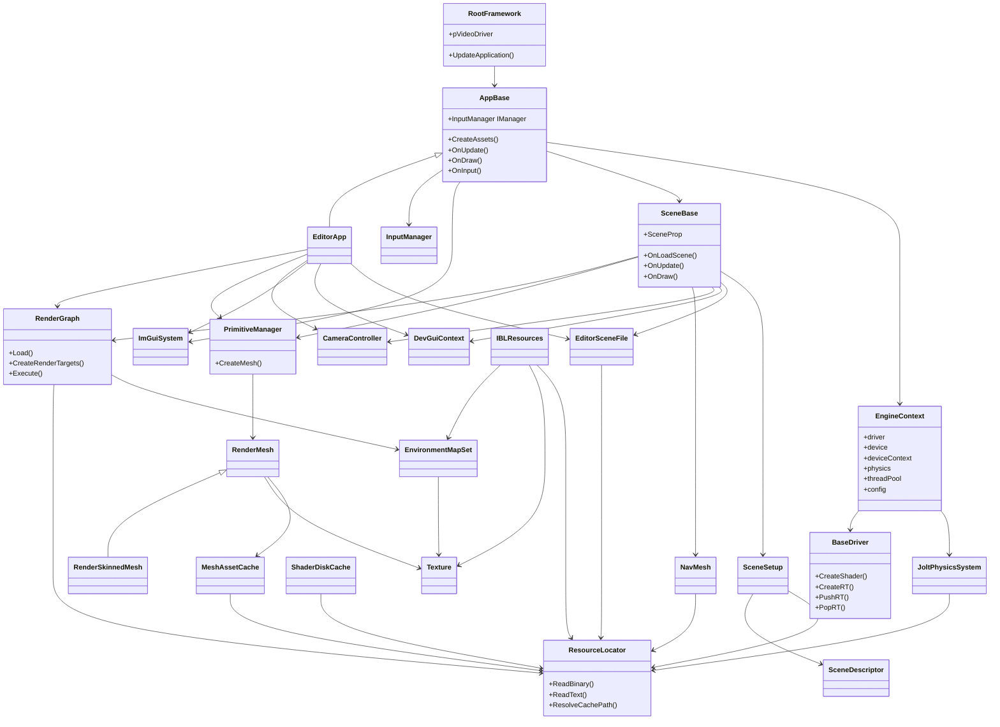
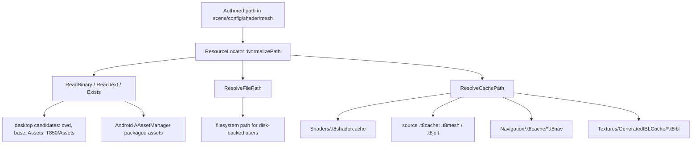
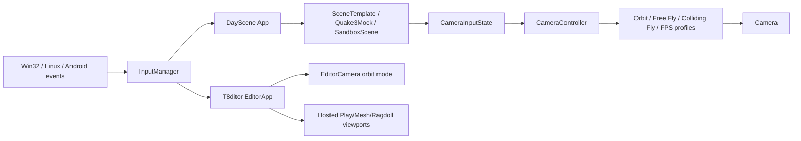
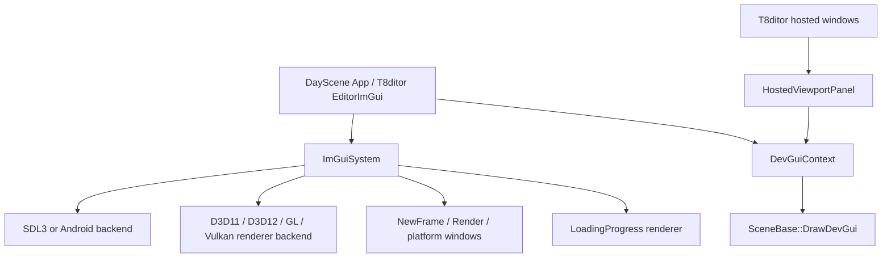
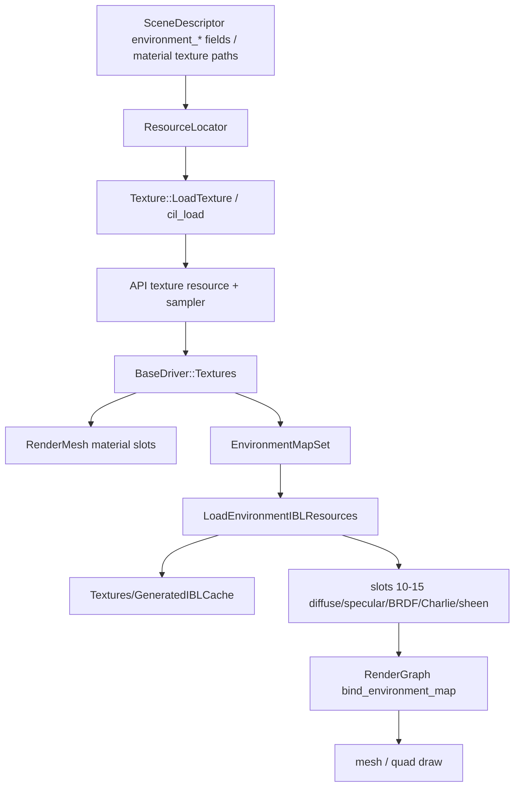
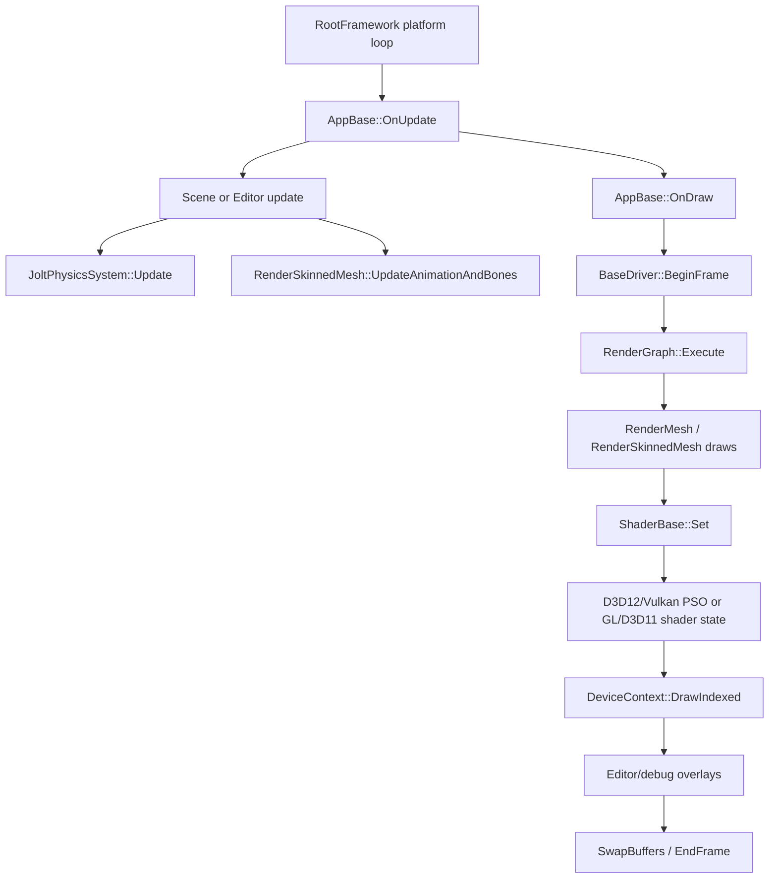
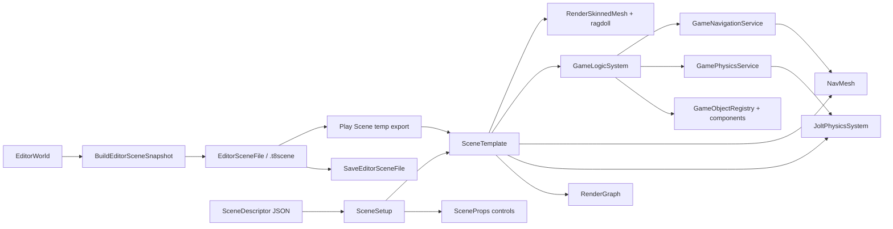
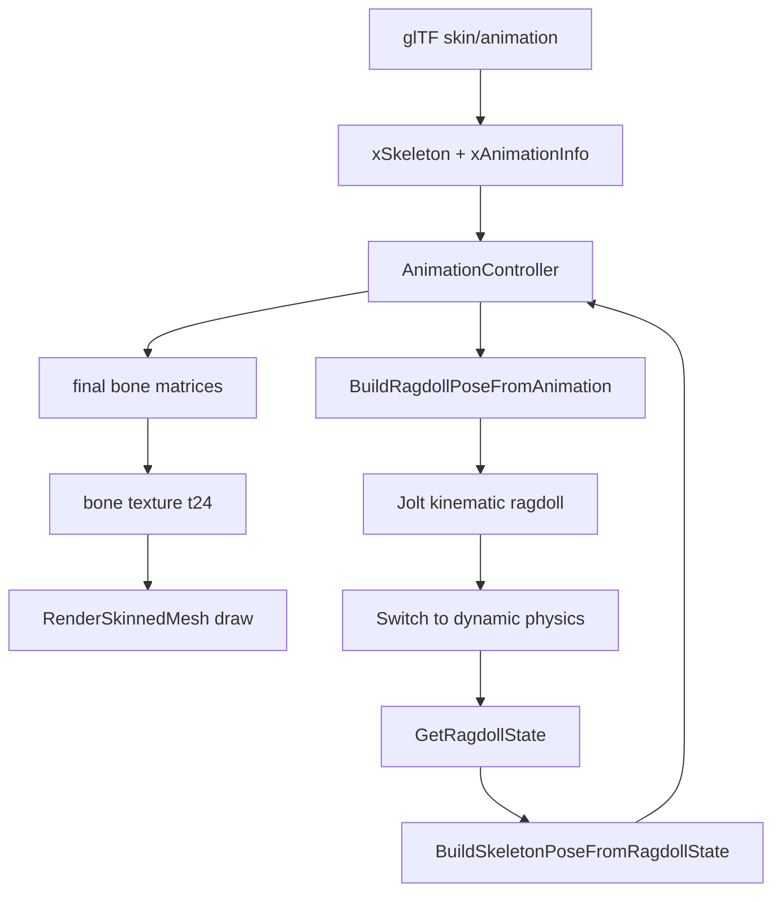
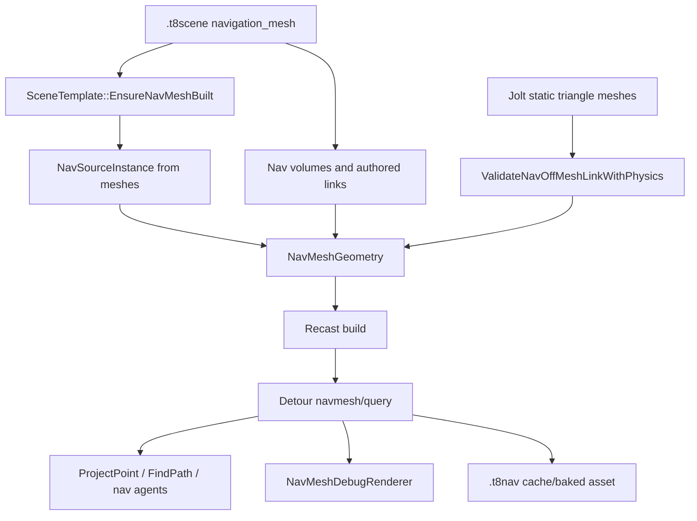

# Dependency Map

Status: verified against source on 2026-08-19.

This document cross-links the subsystem documentation and shows the major class/data dependencies between architecture, assets, rendering, animation, physics, navigation, editor authoring, and scene runtime.

## Related documents

- [Main architecture](architecture/main-architecture.md)
- [Platform event loop](architecture/platform-event-loop.md)
- [Resource locator and cache paths](architecture/resource-locator.md)
- [Input, camera, and controls](input/camera-and-controls.md)
- [FrameworkImGui runtime UI](editor/imgui-system.md)
- [Debug and diagnostics](debug/diagnostics.md)
- [Loading geometry](geometry/loading-geometry.md)
- [Shader management](rendering/shader-management.md)
- [Render graph](rendering/render-graph.md)
- [Geometry rendering flow](rendering/geometry-rendering-flow.md)
- [Textures, samplers, and IBL](rendering/textures-and-ibl.md)
- [Animation system](animation/animation-system.md)
- [Jolt physics](physics/jolt-physics.md)
- [NavMesh and Detour](navigation/navmesh-detour.md)
- [Mutable voxel terrain](terrain/voxel-terrain.md)
- [Editor overview](editor/editor-overview.md)
- [Scene format and runtime](scenes/scene-format-and-runtime.md)
- [SceneSetup descriptors](scenes/scene-setup-descriptors.md)
- [Review and gaps](review-and-gaps.md)

## Documentation dependency table

| If you change... | Read first | Then read |
|---|---|---|
| Platform/window/API lifecycle | [Platform event loop](architecture/platform-event-loop.md) | [Main architecture](architecture/main-architecture.md), [Debug and diagnostics](debug/diagnostics.md), [Shader management](rendering/shader-management.md) |
| Resource paths, Android packaged assets, or generated caches | [Resource locator and cache paths](architecture/resource-locator.md) | [Loading geometry](geometry/loading-geometry.md), [Shader management](rendering/shader-management.md), [Jolt physics](physics/jolt-physics.md), [NavMesh and Detour](navigation/navmesh-detour.md), [Scene format and runtime](scenes/scene-format-and-runtime.md) |
| Input, controllers, camera profiles, or hosted viewport input | [Input, camera, and controls](input/camera-and-controls.md) | [Platform event loop](architecture/platform-event-loop.md), [Editor overview](editor/editor-overview.md), [Scene format and runtime](scenes/scene-format-and-runtime.md), [Jolt physics](physics/jolt-physics.md) |
| Runtime/editor ImGui, docking, platform windows, or hosted scene panels | [FrameworkImGui runtime UI](editor/imgui-system.md) | [Input, camera, and controls](input/camera-and-controls.md), [Editor overview](editor/editor-overview.md), [Platform event loop](architecture/platform-event-loop.md), [Debug and diagnostics](debug/diagnostics.md) |
| Mesh import or asset format conversion | [Loading geometry](geometry/loading-geometry.md) | [Resource locator and cache paths](architecture/resource-locator.md), [Geometry rendering flow](rendering/geometry-rendering-flow.md), [Animation system](animation/animation-system.md), [Jolt physics](physics/jolt-physics.md), [NavMesh and Detour](navigation/navmesh-detour.md) |
| Shader feature bits or passes | [Shader management](rendering/shader-management.md) | [Resource locator and cache paths](architecture/resource-locator.md), [Render graph](rendering/render-graph.md), [Geometry rendering flow](rendering/geometry-rendering-flow.md) |
| Texture loading, sampler state, IBL, or cubemap profiles | [Textures, samplers, and IBL](rendering/textures-and-ibl.md) | [Resource locator and cache paths](architecture/resource-locator.md), [Shader management](rendering/shader-management.md), [Render graph](rendering/render-graph.md), [Scene format and runtime](scenes/scene-format-and-runtime.md) |
| Render pass order or render targets | [Render graph](rendering/render-graph.md) | [Textures, samplers, and IBL](rendering/textures-and-ibl.md), [Shader management](rendering/shader-management.md), [Geometry rendering flow](rendering/geometry-rendering-flow.md), [Editor overview](editor/editor-overview.md) |
| Draw-call behavior | [Geometry rendering flow](rendering/geometry-rendering-flow.md) | [Textures, samplers, and IBL](rendering/textures-and-ibl.md), [Loading geometry](geometry/loading-geometry.md), [Shader management](rendering/shader-management.md), [Render graph](rendering/render-graph.md) |
| Skeletal animation | [Animation system](animation/animation-system.md) | [Geometry rendering flow](rendering/geometry-rendering-flow.md), [Jolt physics](physics/jolt-physics.md) |
| Ragdoll or character physics | [Jolt physics](physics/jolt-physics.md) | [Animation system](animation/animation-system.md), [Scene format and runtime](scenes/scene-format-and-runtime.md), [Editor overview](editor/editor-overview.md) |
| NavMesh authoring/runtime pathing | [NavMesh and Detour](navigation/navmesh-detour.md) | [Jolt physics](physics/jolt-physics.md), [Scene format and runtime](scenes/scene-format-and-runtime.md), [Editor overview](editor/editor-overview.md) |
| Mutable meshes, voxels, chunks, streaming, or terrain persistence | [Mutable voxel terrain](terrain/voxel-terrain.md) | [Geometry rendering flow](rendering/geometry-rendering-flow.md), [Resource locator](architecture/resource-locator.md), [Input and camera](input/camera-and-controls.md) |
| Editor panels or authoring workflow | [Editor overview](editor/editor-overview.md) | [Scene format and runtime](scenes/scene-format-and-runtime.md), subsystem doc for the authored feature |
| `.t8scene` schema or runtime loading | [Scene format and runtime](scenes/scene-format-and-runtime.md) | [SceneSetup descriptors](scenes/scene-setup-descriptors.md), [Editor overview](editor/editor-overview.md), [Render graph](rendering/render-graph.md), [Jolt physics](physics/jolt-physics.md), [NavMesh and Detour](navigation/navmesh-detour.md) |
| Runtime control descriptors, `SceneProps` mappings, or profiles | [SceneSetup descriptors](scenes/scene-setup-descriptors.md) | [Scene format and runtime](scenes/scene-format-and-runtime.md), [FrameworkImGui runtime UI](editor/imgui-system.md), [Textures, samplers, and IBL](rendering/textures-and-ibl.md) |
| Runtime diagnostics, frame dumps, telemetry, or profiling | [Debug and diagnostics](debug/diagnostics.md) | [Platform event loop](architecture/platform-event-loop.md), affected subsystem doc |

## High-level class dependencies

## Asset-to-draw flow

This is the core path for static and skinned mesh rendering.

```mermaid
flowchart LR
  File[".glb/.gltf/.x"] --> ResourceManager["ResourceManager::Load"]
  ResourceManager --> XDB["XDataBase"]
  XDB --> RenderMeshLoad["RenderMesh::Load"]
  RenderMeshLoad --> PrimitiveManager["PrimitiveManager::CreateMesh"]
  PrimitiveManager --> StaticOrSkin{"skin/animation data?"}
  StaticOrSkin -->|no| RenderMesh["RenderMesh"]
  StaticOrSkin -->|yes| RenderSkinnedMesh["RenderSkinnedMesh"]
  RenderMesh --> MeshAsset["MeshAssetCache + MeshPool"]
  RenderSkinnedMesh --> MeshAsset
  RenderMesh --> MaterialAsset["MaterialAssetCache"]
  RenderSkinnedMesh --> MaterialAsset
  MaterialAsset --> ShaderKey["ShaderKey"]
  ShaderKey --> Shader["BaseDriver::CreateShader/GetShader"]
  MeshAsset --> Draw["DeviceContext::DrawIndexed"]
  Shader --> Draw
```

Key documents:

- [Loading geometry](geometry/loading-geometry.md)
- [Resource locator and cache paths](architecture/resource-locator.md)
- [Shader management](rendering/shader-management.md)
- [Geometry rendering flow](rendering/geometry-rendering-flow.md)

## Resource and cache lookup flow

Key documents:

- [Resource locator and cache paths](architecture/resource-locator.md)
- [Loading geometry](geometry/loading-geometry.md)
- [Shader management](rendering/shader-management.md)
- [Jolt physics](physics/jolt-physics.md)
- [NavMesh and Detour](navigation/navmesh-detour.md)

## Input and camera control flow

Key documents:

- [Input, camera, and controls](input/camera-and-controls.md)
- [Platform event loop](architecture/platform-event-loop.md)
- [Editor overview](editor/editor-overview.md)
- [Scene format and runtime](scenes/scene-format-and-runtime.md)

## Runtime UI and hosted panel flow

Key documents:

- [FrameworkImGui runtime UI](editor/imgui-system.md)
- [Input, camera, and controls](input/camera-and-controls.md)
- [Editor overview](editor/editor-overview.md)
- [Debug and diagnostics](debug/diagnostics.md)

## Texture and IBL resource flow

Key documents:

- [Textures, samplers, and IBL](rendering/textures-and-ibl.md)
- [Resource locator and cache paths](architecture/resource-locator.md)
- [Render graph](rendering/render-graph.md)
- [Geometry rendering flow](rendering/geometry-rendering-flow.md)

## Frame/render flow

Key documents:

- [Platform event loop](architecture/platform-event-loop.md)
- [Render graph](rendering/render-graph.md)
- [Geometry rendering flow](rendering/geometry-rendering-flow.md)

## Editor-to-runtime scene flow

Key documents:

- [Editor overview](editor/editor-overview.md)
- [Scene format and runtime](scenes/scene-format-and-runtime.md)
- [SceneSetup descriptors](scenes/scene-setup-descriptors.md)
- [Jolt physics](physics/jolt-physics.md)
- [NavMesh and Detour](navigation/navmesh-detour.md)

## Animation-physics-ragdoll flow

Key documents:

- [Animation system](animation/animation-system.md)
- [Jolt physics](physics/jolt-physics.md)
- [Geometry rendering flow](rendering/geometry-rendering-flow.md)

## Scene-driven navigation flow

Key documents:

- [NavMesh and Detour](navigation/navmesh-detour.md)
- [Jolt physics](physics/jolt-physics.md)
- [Scene format and runtime](scenes/scene-format-and-runtime.md)
- [Editor overview](editor/editor-overview.md)

## Cross-subsystem change checklist

Use this checklist before touching code that crosses subsystems:

1. If a data field is saved, update `.t8scene` schema, editor snapshot save/load, runtime load, and docs.
2. If a material or vertex attribute changes, update glTF conversion, `ShaderKey`, shaders, reflection/input layout, and draw binding.
3. If a render pass changes, update render graph JSON, shader pass defines, PSO expectations, editor rendering controls, and runtime scenes.
4. If animation pose data changes, update `AnimationController`, skinned draw, ragdoll binding, snapshots, and debug visualization.
5. If physics or NavMesh relies on render geometry, verify hidden/skinned/object filtering and cache keys.
6. If editor tools mutate state, add undo/redo coverage and Play Scene export coverage.
7. If cache content changes, bump or extend the relevant cache key/version and document the invalidation behavior.
8. If a path must work on Android, use `ResourceLocator::ReadBinary`/`ReadText` instead of assuming a resolved filesystem path exists.
9. If input routing changes, verify keyboard/mouse/gamepad state, ImGui capture gates, hosted viewport coordinate conversion, and Android virtual controls.
10. If ImGui UI changes, verify backend init/shutdown, docking IDs, platform-window behavior, Android native-window rebinding, and hosted scene panel IDs.
11. If texture or IBL behavior changes, verify material slot mapping, sampler params, render-graph environment slots, Android generated-cache fallback, and scene/profile cubemap overrides.
12. If runtime descriptor controls change, update `SceneDescriptor`, `SceneSetup`, scene/tool mapping tables, profile override handling, save-state behavior, and docs together.
