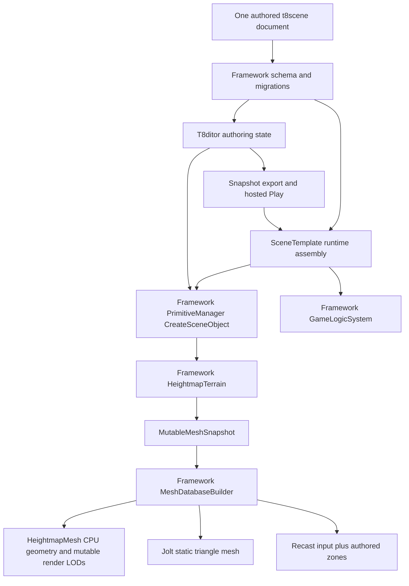

# Editor and Authored Runtime Architecture Review

Status: source review and focused Windows verification on 2026-09-07.

Terrain-tool follow-up, 2026-09-07: native 16-bit import, persistent sculpting,
textured palette painting, mutable buffers, distance LOD, and tagged regions are
now implemented in Framework with T8ditor controls. Shared `CommitTerrainRevision`
replaces collision and invalidates/drains navigation. See
[terrain editing](../terrain/heightmap-terrain.md) and
[regions](../scenes/scene-regions.md). The integration gate now exercises brush
input, commits, undo/redo, clone, reload, and hosted Play on all desktop APIs.
The broader SceneWorld extraction described below remains outstanding.

## Assessment

T850 has a useful genre-neutral foundation, but T8ditor is not yet a thin wrapper
around a single Framework-owned world. The renderer, resource loading, scene schema,
Jolt, Recast/Detour, gameplay registry, component factories, events, and fixed-tick
simulation already belong to Framework. The remaining architectural problem is
duplicated orchestration and authoring/runtime state, not the absence of an ECS.

Keep the existing gameplay model. Do not build a separate RTS world or move the
entire SceneTemplate class into Framework unchanged: that would also move developer
tools, example gameplay, and host policy into the reusable library.

This change implements a first extraction and a working image-based terrain path.
It does **not** claim that all legacy scene classes are data-driven or that the
remaining world/host separation is complete.

## Scope and Evidence

The review followed these controlling paths, rather than only project entry points:

| Surface | Owner and evidence |
|---|---|
| Editor state, import, snapshot, restore, nav authoring | [EditorApp.cpp](../../T850/T8ditor/EditorApp.cpp), [EditorWorld.h](../../T850/T8ditor/EditorWorld.h), [SceneObject.h](../../T850/T8ditor/SceneObject.h) |
| Undo and hosted Play | [UndoRedo.h](../../T850/T8ditor/UndoRedo.h), [PlayScenePanel.cpp](../../T850/T8ditor/PlayScenePanel.cpp) |
| Authored runtime assembly, camera, nav cache, game links | [SceneTemplate.cpp](../../T850/DayScene/SceneTemplate.cpp), [SceneTemplate.h](../../T850/DayScene/SceneTemplate.h) |
| Shared file schema and loading | [EditorSceneFile.h](../../T850/Framework/include/scene/EditorSceneFile.h), [EditorSceneFile.cpp](../../T850/Framework/src/scene/EditorSceneFile.cpp) |
| CPU/render geometry and collision | [PrimitiveManager.cpp](../../T850/Framework/src/scene/PrimitiveManager.cpp), [RenderMesh.cpp](../../T850/Framework/src/scene/RenderMesh.cpp), [PhysicsAuthoring.cpp](../../T850/Framework/src/physics/PhysicsAuthoring.cpp) |
| Simulation and asynchronous queries | [GameLogicSystem.cpp](../../T850/Framework/src/game/GameLogicSystem.cpp), [GameNavigationService.cpp](../../T850/Framework/src/game/GameNavigationService.cpp) |
| Navigation generation and queries | [NavigationSystem.cpp](../../T850/Framework/src/navigation/NavigationSystem.cpp) |
| Build and platform contract | [build.yml](../../.github/workflows/build.yml), [ValidateBuildRegistration.ps1](../../T850/scripts/ValidateBuildRegistration.ps1) |

## Defects Addressed

1. **Duplicated navigation and physics conversion semantics.** Editor and runtime
   each decoded settings, traversal names, modifiers, and cook settings. Both
   interpreted serialized `walk` links as jumps. These conversions now live in
   Framework [SceneConversions.cpp](../../T850/Framework/src/scene/SceneConversions.cpp).
   The editor header is a compatibility facade, not a second implementation.
   Non-finite link radii are rejected.
2. **Scene loads could retain another document's omitted fields.** Parsing now uses
   a fresh document and commits only after success. Failed parsing leaves the
   caller's document unchanged; an empty scene does not inherit old objects or paths.
3. **Runtime silently selected a specific Q3 map.** SceneTemplate now requires an
   explicit scene path, either from the runtime configuration or its hosted launch
   descriptor. An empty hosted path no longer falls through to global scene state.
4. **Startup ignored `control_descriptor` and re-read scene data.** Runtime
   initialization, profiles, graph choice, and assembly now use the same parsed
   document. Editor scene loading also applies authored control descriptors.
5. **Authored orthographic cameras were forced to perspective.** Framework's
   `ApplySceneCamera` handles both projection types. The map-specific fallback
   camera coordinates were removed; a scene without a camera retains the fitted view.
6. **Hidden collision/navigation sources were discarded.** Runtime retains hidden
   objects explicitly used for navigation, object physics, or a static physics
   entity. Render visibility remains separate from those uses.
7. **Scenes were silently truncated at 64 meshes.** Runtime mesh storage is sized
   from the document before creating gameplay links. It is not resized during
   simulation. A 65-object capture, including a hidden navigation source, verifies
   that every object loads. This is a capacity correctness fix, not a large-army
   performance claim.
8. **Generated geometry had no shared authored-scene path.** Heightmaps now use
   Framework image decoding, CPU generation, material/database conversion, and
   scene-object creation. Rendering, collision, and navigation read the same geometry.
9. **Cache identity did not cover generated or hidden sources.** Generated meshes
   have content-derived identities; runtime navmesh cache version 4 includes hidden
   static sources and generated identity when no mesh filename exists.
10. **Cloning could use an invalidated editor object reference.** The clone path
    reacquires its source after appending to the object vector. Heightmap metadata
    survives clone, save/load, and whole-scene undo restoration.

## Current Ownership

The scene owns object instances and the PrimitiveManager owns their render
primitives. File-backed CPU databases remain ResourceManager-owned. Generated
databases are owned by their RenderMesh, so the editor's wireframe extraction,
physics cooking, and navigation construction cannot outlive temporary terrain data.
GPU pool and constant-buffer retirement stays in the existing driver/cache path.
No D3D11, D3D12, Vulkan, or GL calls were added to terrain generation.

The editor still owns selection, gizmos, dialogs, window hosting, and undo history.
Heightmap import queues resource creation for the next frame, not during ImGui
render submission. Whole-scene undo captures descriptors, not serialized GPU buffers.

Gameplay remains fixed-tick: deferred creates, queued events, controller intents,
pre-physics components, physics flush, post-physics components, navigation results,
logic components, state machines, groups, late components, deferred destroys.
Camera and rendering presentation remain separate. Keep that ordering when moving
world assembly; do not make editor paint events execute simulation directly.

`GameNavigationService` batches work on the thread pool and drains pending work
before navmesh mutation. Terrain regeneration must respect that barrier before
changing the navmesh or destroying geometry used by an active world.

## Nexus Findings

[Nexus.t8scene](../../T850/Assets/Scenes/Nexus.t8scene) was preserved unchanged.
It already expresses a terrain model, a marine model/game entity, static terrain
collision, navigation build settings, an include-bounds box, an exclusion box,
and rendering profiles as data.

Important authoring constraints:

- Mesh references are absolute paths under `D:/Code/Game/SC2Extract/...`. They are
  not portable project assets. The loader's filename fallback can help locally but
  is not a reliable packaging or asset-identity contract. Import assets you can
  distribute into project-relative resource paths before shipping.
- It has no authored runtime camera or lights. Editor orbit state is not a runtime
  camera. Add an explicit camera/light rig to make the intended play view reproducible.
- Automatic drop, jump, and hybrid links are enabled. That is authored policy, not
  an RTS requirement. Disable them for units that should only traverse continuous
  ground; do not globally disable them in Framework, since shooters may need them.
- The existing include/exclude boxes are navmesh modifiers, not a general region
  or territory system. They do not automatically become buildable areas, ownership,
  resources, fog of war, or trigger zones.
- Recast still applies slope, clearance, radius, and climb constraints. Marking a
  source walkable does not guarantee that every triangle becomes traversable.

## Remaining Architectural Work

2026-09-09 update: [the first static editor SDK](editor-sdk.md) extracts a reusable
T8ditorCore target and adds host registrations and gameplay-only transactions.
The shared-world extraction and all-world stable references described below are
still outstanding; default Play still wraps the existing SceneTemplate internally.

### Shared World Assembly

SceneTemplate remains a large class under DayScene and is compiled into T8ditor
for Play. EditorApp independently assembles cameras, lights, physics, navigation,
profiles, and rendering state. Shared conversions reduce drift but do not remove
these two assembly implementations.

The next extraction should be a Framework `SceneWorld` with explicit load/unload,
object handles, descriptor application, navigation lifecycle, physics links, and
simulation ownership. It must accept EngineContext services and optional component
registrations from the host. Move developer panels to FrameworkImGui or T8ditor.
Keep Q3 compatibility and RTS example registration in host/module composition.

Do not rename/move the existing 15k-line class wholesale and call that separation.
Extract one subsystem with editor/standalone parity tests, then make both hosts use it.

### Document Identity and References

Gameplay entities/components/groups have stable IDs. Mesh, physics-source, and
camera links still frequently use names or vector slots. Renaming or reordering
can therefore break cross-references. A future schema migration should assign IDs
to every world object and convert links, while retaining names only for display.

One `.t8scene` should mean **one authoritative scene document**, not one C++ class.
The document may reference reusable assets, a render graph, and a controls preset.
Those resources must not inject map-specific objects or gameplay. No filename
checks such as `Nexus` should select mechanics. This change adds no such checks.

Legacy empty graph/control fields still use host defaults for compatibility, and
legacy demo hosts retain their own setup. Existing fallback lights, player policy,
render-pass-name assumptions, and example registrations still require migration.
This is not yet a strict no-default, one-document runtime across every host.

### Editor Document Model

EditorWorld is a singleton containing authoring data, selection, undo, render
instances, and physics state. Authoritative transforms currently live in an editor
wireframe wrapper. Split the document/world from editor presentation and store
transforms in Framework before adding live terrain editing or multi-document editing.

Whole-scene undo is correct for the current descriptor-based terrain import but
rebuilds resources. It should evolve toward stable-ID commands and bounded undo
memory before interactive terrain painting. Do not store full terrain GPU buffers
in undo entries. Save currently writes directly to the destination; atomic scene
replacement and a recoverable document transaction remain desirable follow-ups.

### Regions, Navigation, and RTS Scale

Keep navigation modifiers distinct from gameplay regions. Framework now supplies
stable-ID tagged box regions and point queries through `GameLogicSystem::RegionsAt`.
RTS systems can interpret tags as buildability or territory, while shooters use
the same queries for objectives. Membership events and spatial indexing remain
possible extensions, not implicit behavior of a tag.

Detour areas/costs currently share a navmesh filter. Different unit capabilities
need explicit agent profiles/query filters or separate baked navmeshes, not a
global change when selecting a unit. Dynamic building placement needs revisioned
navigation invalidation and rebakes/tiled updates. Current centroid-based modifier
classification is not exact geometric clipping.

The fixed-tick component/service model supports a small RTS prototype, but there
is no evidence here of thousand-unit performance or deterministic multiplayer.
Measure query budgets, path cancellation, shared geometry/instancing, spatial
queries, and fixed-tick cost before choosing an ECS rewrite. Deterministic lockstep
cannot be inferred from fixed delta time, particularly with physics and async paths.

## Recommended Sequence

1. Use the new heightmap example to establish authoring, Play, and standalone parity.
2. Extract Framework world assembly and remove duplicate editor/runtime decisions.
3. Migrate all world references to stable IDs with rename/reorder/round-trip tests.
4. Add generic regions and agent navigation profiles, then layer RTS rules on them.
5. Extend the implemented 16-bit/sculpt/palette/LOD tools with blended splat maps,
  chunk streaming, and measured large-terrain budgets as needed. Preserve shared
  render/collision/navigation invalidation.
6. Build RTS selection, orders, economy, combat, and UI as game modules, preserving
   the same Framework services for possessed shooter characters.

## Verification and Limits

- Full Windows CI-equivalent matrix passes all six cells: Win32/x64/ARM64,
  Debug/Release, both executables. Command: `RunWindowsBuildMatrix.ps1 -Action Build`.
- Win32 and x64 Debug/Release self-tests: 51 passing tests in each run after the
  terrain-tools follow-up. The malformed-scene test
  intentionally logs a parse error while asserting transactional failure behavior.
- Terrain tests exercise native 16-bit image decode, brush editing, palette
  persistence, LOD, tagged regions, elevation interpolation, bounds/normals,
  invalid input, descriptor round trip, stable geometry identity, collision input,
  and Recast routing around an excluded region.
- Runtime and editor heightmap captures complete on D3D11, D3D12, Vulkan, and GL:
  exit 0, no engine errors, nonuniform 1280x720 output. Captures show an editor GL
  brightness difference and runtime D3D/GLSL shading differences. These are smoke
  results, **not** pixel-parity or accepted-baseline regression passes.
- The 65-object runtime smoke includes a hidden navigation source and loads all 65.
- The unchanged Nexus scene loads both meshes and completes runtime/editor captures
  on D3D11 and D3D12 without engine errors. Its authored navmesh produces 79
  polygons and 133 automatic jump links. External Nexus models exist on this test
  machine, but remain outside the repository's portable asset set.
- The follow-up terrain integration gate now exercises synthetic viewport brush
  input, real undo/redo commands, reload, and hosted Play including shutdown.
  It passes on all four APIs in Debug and Release. It also found and verified a
  Vulkan viewport/scissor recording-state fix in the hosted-close path.
  Exhaustive OS-level clicking of every widget remains outside that gate.
- Android, Steam Deck, the complete legacy visual matrix, and baseline-relative
  visual acceptance are not validated by these focused gates. Source registration
  includes Android and desktop/Steam CMake. ARM64 was cross-compiled, not executed.
- CI currently disables gameplay self-test execution; a successful workflow alone
  does not prove these runtime behaviors. No CI workflow changes were made.

## Related Documents

- [Heightmap terrain](../terrain/heightmap-terrain.md)
- [Editor overview](editor-overview.md)
- [Scene format and runtime](../scenes/scene-format-and-runtime.md)
- [Navigation](../navigation/navmesh-detour.md)
- [Gameplay specification](../game/game-entity-system-spec.md)
- [Verification](../testing/verification.md)