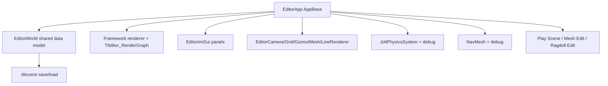
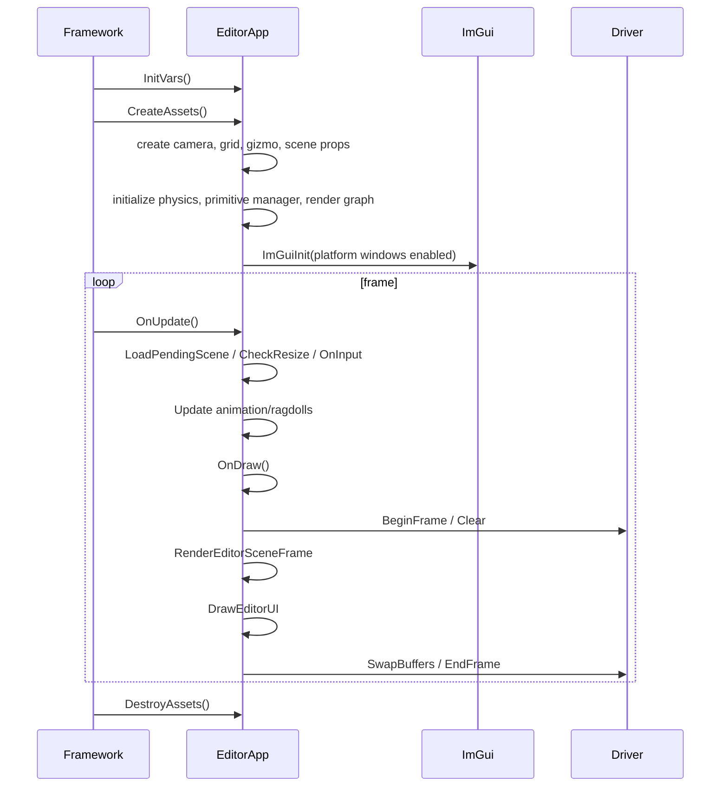

# Editor Overview

Status: Stage 9 draft.

This document explains T850's editor, T8ditor: app lifecycle, editor-world data model, scene save/load, panels, hierarchy/inspector/rendering/timeline controls, viewport and gizmo behavior, Play Scene, Mesh Editor, Ragdoll Editor, NavMesh authoring, undo/redo, hosted windows, render-graph integration, limitations, and debugging workflows.

Related documents:

- [Main architecture](../architecture/main-architecture.md)
- [Input, camera, and controls](../input/camera-and-controls.md)
- [FrameworkImGui runtime UI](imgui-system.md)
- [Dependency map](../dependency-map.md)
- [Render graph](../rendering/render-graph.md)
- [Textures, samplers, and IBL](../rendering/textures-and-ibl.md)
- [Geometry rendering flow](../rendering/geometry-rendering-flow.md)
- [Jolt physics](../physics/jolt-physics.md)
- [NavMesh and Detour](../navigation/navmesh-detour.md)
- [Scene format and runtime](../scenes/scene-format-and-runtime.md)
- [SceneSetup descriptors](../scenes/scene-setup-descriptors.md)

## Purpose and responsibilities

T8ditor is the authoring shell for `.t8scene` files. It is an `AppBase` application that shares the Framework renderer, physics, navigation, mesh loading, render graph, and scene serialization systems with runtime scenes.

The editor is responsible for:

1. Importing and previewing meshes.
2. Editing object transforms, visibility, grouping, cameras, lights, splines, physics, ragdolls, navigation, God Rays, render settings, and profiles.
3. Saving/loading `.t8scene`.
4. Running Play Scene through an embedded `SceneTemplate`.
5. Hosting embedded Mesh Edit and Ragdoll Edit windows.
6. Maintaining undo/redo and selection state.
7. Drawing editor-only overlays: grid, gizmos, wireframes, camera/light gizmos, physics, NavMesh, splines.

## Key files and classes

| File/class | Role |
|---|---|
| `T8ditor/EditorApp.h` | Main editor app class, state fields, and method declarations. |
| `T8ditor/EditorApp.cpp` | Main editor lifecycle, scene import/save/load, selection, render/UI loop, panels, NavMesh, profiles, undo state. |
| `T8ditor/EditorWorld.h`, `T8ditor/EditorWorld.cpp` | Shared editor data model replacing scattered file-scope globals. |
| `T8ditor/EditorScene.h`, `T8ditor/EditorScene.cpp` | Thin save/load wrapper around Framework `.t8scene` serialization and Windows file dialogs. |
| `Framework/src/scene/EditorSceneFile.cpp` | Actual Glaze JSON `.t8scene` load/save implementation and mesh fallback resolution. |
| `T8ditor/EditorImGui.h`, `T8ditor/EditorImGui.cpp` | ImGui lifecycle, menu/toolbar/context menu, panel visibility, base hierarchy/inspector/console/RT-debug helpers. |
| `T8ditor/EditorCamera.*` | Orbit/pan/zoom editor camera and framing helpers. |
| `T8ditor/EditorGrid.*` | XZ grid and axis lines. |
| `T8ditor/EditorGizmo.*` | Editor line-gizmo meshes for translate/rotate/scale. |
| `T8ditor/EditorMesh.*` | Editor wireframe/picking mesh loader for `.x`, `.gltf`, `.glb`, and generated triangle meshes. |
| `T8ditor/EditorSceneGizmos.*` | Camera/light/gizmo overlay geometry. |
| `T8ditor/EditorSceneSerialization.*` | Editor-to-scene conversion helpers for NavMesh, physics cook settings, links, volumes, etc. |
| `T8ditor/UndoRedo.h` | Command-pattern undo stack plus transform/group-transform commands. |
| `T8ditor/HostedViewportPanel.*` | Shared native ImGui viewport/window and render-target wrapper for hosted windows. |
| `T8ditor/PlayScenePanel.cpp` | Hosted Play Scene runtime window. |
| `T8ditor/MeshEditorPanel.cpp` | Hosted Mesh Edit window. |
| `T8ditor/RagdollEditorPanel.cpp` | Hosted Ragdoll Edit window. |

## EditorApp lifecycle

`EditorApp` derives from `AppBase` and overrides:

- `InitVars()`
- `CreateAssets()`
- `LoadAssets()`
- `DestroyAssets()`
- `OnUpdate()`
- `OnDraw()`
- `OnInput()`
- pause/resume/reset.

### `CreateAssets()`

The editor initialization path creates:

- editor camera and camera controller,
- line renderers, grid, gizmo,
- `SceneProps`, default camera, light camera, directional light,
- scene setup from `Scenes/Quake3Mock.json`,
- Gaussian kernels and SSAO resources,
- Jolt physics runtime and debug renderer,
- primitive manager and quad instances,
- editor NavMesh debug renderer and initial state,
- skybox and environment cubemap,
- `Scenes/T8ditor_RenderGraph.json` render graph and render targets,
- dummy white texture for deferred shadow slot,
- frame dumper,
- optional startup mesh/scene,
- ImGui with platform windows enabled.

### `OnUpdate()`

`OnUpdate()`:

1. Applies frame throttling.
2. Updates editor delta time.
3. Closes requested hosted windows.
4. Applies pending cubemap changes.
5. Loads pending scene after safe frame boundary.
6. Checks main-window resize and recreates swapchain/render targets when needed.
7. Updates spline preview.
8. Processes input.
9. Updates skinned animation and object ragdolls when not in Mesh Edit or Play Scene.
10. Calls `OnDraw()`.

### `OnDraw()`

`OnDraw()`:

- begins the driver frame,
- clears the backbuffer,
- optionally captures/draws a frozen editor frame when hosted windows are open,
- renders the editor scene frame if assets are ready,
- renders ImGui/editor UI,
- handles frame dumps,
- swaps buffers and ends the frame.

The frozen-frame path prevents the main editor viewport from mutating while hosted windows own user focus/rendering.

## EditorWorld data model

`EditorWorld` is the shared authoring data model. It is accessed via `GetEditorWorld()`, and many editor files use reference aliases to the same state.

It owns:

- scene objects,
- cameras,
- lights,
- light cameras,
- camera animations,
- splines,
- God Rays volume,
- physics entities,
- game entities,
- groups,
- mixed selection state,
- undo stack,
- loaded scene file data,
- unloaded scene object fallbacks,
- scene collision path,
- profiles,
- Quake3 collision world.

Selection type values:

| Type | Meaning |
|---|---|
| `0` | mesh/object |
| `1` | camera |
| `2` | light |
| `3` | physics entity |
| `4` | NavMesh |
| `5` | spline |
| `6` | light camera |
| `7` | spline point |
| `8` | God Rays volume |

`multiSelect` is legacy mesh-only selection. `multiEntitySelect` stores typed `SelectionRef` values for mixed mesh/physics/etc. selection.

## Scene save/load

T8ditor saves and loads `.t8scene` through:

- `EditorApp::BuildEditorSceneSnapshot()`
- `EditorApp::SaveEditorSceneSnapshot()`
- `EditorApp::RefreshVirtualEditorScene()`
- `EditorScene.cpp` wrappers
- `Framework/src/scene/EditorSceneFile.cpp`.

`BuildEditorSceneSnapshot()` gathers:

- editor camera and view toggles,
- optional ImGui layout when "Allow Custom Layout" is enabled,
- scene objects, transforms, visibility, mobile visibility, wire/orientation flags,
- physics/navigation/ragdoll metadata,
- unloaded scene objects that failed to load,
- game entities,
- splines,
- light cameras,
- camera animations,
- God Rays volume,
- physics entities,
- NavMesh descriptor,
- cameras and lights,
- collision resource path,
- profiles.

Transient editor objects are excluded.

`EditorSceneFile.cpp` uses Glaze JSON. Unknown keys are ignored on load. Mesh paths are normalized, and missing glTF mesh paths can be resolved by recursive fallback search using the scene directory, mesh directory, first resource directory, and `Models`.

## ImGui, menu, toolbar, and panels

`EditorImGui` owns:

- ImGui initialization/shutdown,
- frame begin/render,
- menu bar,
- toolbar,
- context menu,
- panel visibility flags,
- log capture,
- layout capture/apply/save,
- ImGuizmo setup and manipulation,
- base hierarchy/inspector/console/RT-debug helper functions.

Panel visibility includes:

- Hierarchy,
- Inspector/Properties,
- Console,
- Look & Lighting,
- Timeline,
- NavMesh Authoring,
- Wireframe,
- Skybox,
- RT Debug.

The main `DrawEditorUI()` function:

1. Starts a new ImGui frame.
2. Captures a before-state for automatic ImGui undo.
3. Routes to Mesh Edit or Play Scene if those hosted windows are open.
4. Draws menu bar and toolbar.
5. Handles menu actions such as import, save, load, exit, reset layout.
6. Draws hierarchy/properties/nav/timeline/rendering/console/RT debug panels.
7. Draws hosted Ragdoll, Mesh, and Play windows.
8. Commits an undo state if ImGui edits changed the scene.
9. Calls `ImGuiRender()`.

## Hierarchy and Inspector

The hierarchy panel is the main scene tree. It includes:

- scene root,
- game entities,
- mesh objects,
- cameras,
- lights,
- physics entities,
- ragdoll child bodies,
- NavMesh authoring children,
- splines and spline points,
- light cameras,
- God Rays volume.

Selecting from the hierarchy updates `g_selectionType`, `g_selectedIdx`, `g_multiSelect`, and `g_multiEntitySelect`.

The Properties/Inspector path edits the selected entity's fields. Depending on selection type, this can edit:

- mesh transform/visibility/freeze/wire/orientation/navigation/physics/ragdoll,
- camera settings,
- light settings,
- physics body/player/character settings,
- NavMesh volume or link settings,
- spline settings and points,
- light camera settings,
- God Rays volume.

## Viewport, selection, and gizmos

The main editor viewport uses:

- `EditorCamera` for orbit/pan/zoom/free-fly state,
- `EditorGrid` for XZ reference grid,
- `EditorGizmo` and ImGuizmo for selected transforms,
- `EditorSceneGizmos` for camera/light gizmos,
- `EditorLineRenderer` for wire/debug overlays,
- `HandleMousePick()` and ray tests for selection.

Keyboard shortcuts include:

- `Q/W/E/R`: select/translate/rotate/scale gizmo mode.
- `Ctrl+Z`: undo.
- `Ctrl+Shift+Z` or `Ctrl+Y`: redo.
- `Z` without Ctrl: frame selected entity.
- `Delete`: delete selected entity.
- `Space`: dump frame when frame dumper is active.

Object transforms edited through ImGuizmo are captured as undo commands. Group transforms use `GroupTransformCommand`.

## Rendering integration

The editor uses the same Framework render path as scenes:

- `T8ditor_RenderGraph.json`,
- `RenderGraph::Execute()` for deferred rendering on D3D11/D3D12/Vulkan,
- forward fallback for OpenGL,
- `SceneProps` for lighting/render controls,
- `RenderMesh` / `RenderSkinnedMesh` primitives through `PrimitiveManager`,
- overlay drawing after deferred output.

`RenderEditorSceneFrame()`:

1. Selects active camera: scene camera, light camera, or editor orbit camera.
2. Syncs editor lights to `SceneProps`.
3. Applies God Rays volume to scene properties.
4. Syncs object transforms.
5. Uploads skinned bone textures.
6. Copies visible mesh instances into a contiguous array for `RenderGraph::Execute()`.
7. Binds environment and dummy shadow resources.
8. Draws RT debug override if selected.
9. Draws wireframe, skeleton, physics, NavMesh, spline, camera, and light overlays.

The Look & Lighting panel maps controls from `Scenes/Quake3Mock.json` into editor `SceneProps`, including exposure, bloom, light scales, lightmaps, tone mapping, shadow/SSAO/DOF/parallax/God Rays, debug RTs, cubemap, Gaussian kernels, material multipliers, and render graph pass toggles.

## Timeline

`DrawEditorTimelinePanel()` drives authored time-based editor playback.

It:

- selects a spline track,
- estimates spline duration,
- can play/loop/scrub time,
- updates a `SplineAgent`,
- writes the spline's `agent_offset`,
- applies camera animations at the current time,
- applies spline agent position to attached cameras.

It intentionally moves authored cameras but never switches the active view camera.

## Play Scene hosted runtime

Play Scene hosts a real `SceneTemplate` in an ImGui platform window/viewport.

Flow:

1. If authored NavMesh is dirty, regenerate it.
2. Export a temporary `.t8scene` under the OS temp directory.
3. Snapshot current editor state.
4. Create/open a hosted window.
5. Initialize a `SceneTemplate` with its own `EngineContext` and `m_playScenePhysics`.
6. Render SceneTemplate to a hosted render target.
7. Route input into SceneTemplate when the viewport is active.
8. Restore editor state and delete temp file on close.

`WantsRelativeMouseMode()` returns true only when Play Scene is open, loaded, GUI hidden, and not closing.

## Mesh Editor hosted window

Mesh Edit is a hosted window that embeds a `RagdollEditor` scene for a selected mesh.

It uses:

- `HostedSceneWindowController m_meshEditorWindow`,
- `HostedRenderViewport m_meshEditorViewport`,
- a separate GBuffer target,
- an embedded `RagdollEditor` scene,
- profile/cubemap controls,
- its own orbit camera state and GUI visibility toggle.

The embedded scene uses `UseExternalMesh(obj.litInst, meshPath)`, sharing the selected mesh primitive while rendering into isolated hosted viewport targets. This is a sensitive render-state boundary: embedded editor windows should share API resources only as intended and avoid leaking render state back into the main editor.

## Ragdoll Editor hosted window

Ragdoll Edit is a hosted window for skinned meshes.

It provides:

- a hosted viewport and GBuffer/output render targets,
- orbit camera for ragdoll editing,
- body/joint/bone selection,
- move/rotate/edit tools,
- physics/skeleton debug toggles,
- simulation speed and fixed-delta controls,
- load/save/reset ragdoll edits,
- undo snapshots for ragdoll authoring,
- integration with `RagdollEditorTool` and `RagdollEditorGui`.

Opening the Ragdoll Editor requires a skinned mesh. It loads or generates ragdoll authoring, recreates runtime kinematic ragdoll bodies, and marks the object for ragdoll debug drawing.

## NavMesh authoring

The editor owns a complete NavMesh authoring state:

- `m_editorNavMesh`,
- build settings,
- source stats,
- status,
- runtime mode,
- baked asset path,
- volumes,
- authored links,
- source-triangle classification,
- selected triangles/volumes/links/nodes,
- brush selection.

Workflow:

1. Create or regenerate NavMesh from scene objects.
2. Preview source classification.
3. Select or brush source triangles.
4. Create include/exclude/area/link include/link exclude volumes from selections.
5. Add/edit authored links and pick endpoints from nodes.
6. Bake `.t8nav` asset when desired.
7. Save scene.

Play Scene refuses stale NavMesh export unless regeneration succeeds.

## Undo/redo

The undo system uses the Command Pattern.

Core types:

- `UndoCommand`
- `TransformCommand`
- `GroupTransformCommand`
- `UndoStack`
- `EditorSceneStateCommand`

`UndoStack` supports:

- `Execute()` for commands that should apply immediately,
- `Push()` for commands already applied by UI/gizmo,
- `Undo()`,
- `Redo()`,
- `Clear()`.

T8ditor uses two granularities:

1. Small transform commands for direct object/group gizmo drags.
2. Whole-scene snapshot commands for ImGui/editor actions.

`EditorApp::CaptureEditorUndoState()` stores the scene snapshot, groups, selection, active group, active camera, selected NavMesh volume/link, and selected spline point. `ApplyEditorUndoState()` reconstructs render primitives, physics entities, nav state, groups, selection, and profiles.

Every editor action should be undoable. If a new UI edit mutates editor state, it should either push a command directly or be included in the automatic before/after scene-state capture around `DrawEditorUI()`.

## Hosted windows and render targets

Hosted windows use:

- `HostedSceneWindowController` for ImGui platform viewport/native handle/docking/window open state.
- `HostedRenderViewport` for render target creation, image rect, input-local coordinate conversion, resize checks, and ImGui texture drawing.

Hosted windows track:

- open/loaded/openRequested/closeRequested,
- GUI visible state,
- viewport input active state,
- native handle and ImGui viewport id,
- dockspace/dock class,
- viewport and image rectangles.

Input routing temporarily maps global editor mouse coordinates into hosted viewport local coordinates before calling the embedded scene's input handler.

## Extension points

When adding editor features:

1. Add durable data to `EditorWorld` or scene schema, not scattered file-scope state.
2. Add save/load conversion in `BuildEditorSceneSnapshot()` and `.t8scene` schema helpers.
3. Add UI in the relevant panel or a new panel file.
4. Add undo support via `UndoStack` or scene-state capture.
5. If it draws in the viewport, add overlay/debug rendering in `RenderEditorSceneFrame()`.
6. If it has a hosted runtime, use `HostedSceneWindowController` and `HostedRenderViewport`.
7. Keep render-state isolation explicit for hosted Mesh/Ragdoll/Play windows.

## Known limitations and gotchas

- `EditorApp.cpp` remains very large; many panels and helpers are still in one file.
- `RenderQueue`-style extraction is not used by editor scene rendering; it still copies visible `PrimitiveInst` values for render graph execution.
- Mesh Edit shares the selected mesh primitive with the hosted scene; this is an intentional but sensitive isolation boundary.
- Timeline moves authored cameras but does not switch the active viewport camera.
- NavMesh volumes and links are authoring helpers, not normal gameplay objects.
- Scene snapshots skip transient objects but preserve unloaded scene objects.
- Hosted windows can freeze the main editor viewport and route input differently.
- Some editor state is still global/static or referenced through aliases into `EditorWorld`.

## Debugging checklist

1. If editor startup fails, check `CreateAssets()` sections: camera, helpers, scene props, physics, render graph, ImGui.
2. If save/load fails, inspect `EditorSceneFile.cpp` parse/write logs and mesh fallback resolution.
3. If undo fails, verify the action pushes a command or changes are captured by `DrawEditorUI()` before/after state.
4. If selection breaks, check `g_selectionType`, `g_selectedIdx`, `multiSelect`, and `multiEntitySelect`.
5. If gizmos do not draw, check `EditorGizmo::Create()`, ImGuizmo frame setup, and selection/frozen flags.
6. If viewport rendering is wrong, check `RenderEditorSceneFrame()`, active camera selection, deferred readiness, and render graph pass toggles.
7. If hosted windows misroute input, inspect `HostedRenderViewport::Contains/LocalX/LocalY` and GUI visibility state.
8. If Mesh Edit or Ragdoll Edit corrupts main rendering, audit shared `PrimitiveInst`/render-state/resource use and make sure hosted windows restore driver state.
9. If Play Scene differs from editor, inspect the temporary exported `.t8scene` and restoration path.
10. If NavMesh authoring is stale, check `m_editorNavMeshDirty`, classification readiness, and Play Scene regeneration logs.
