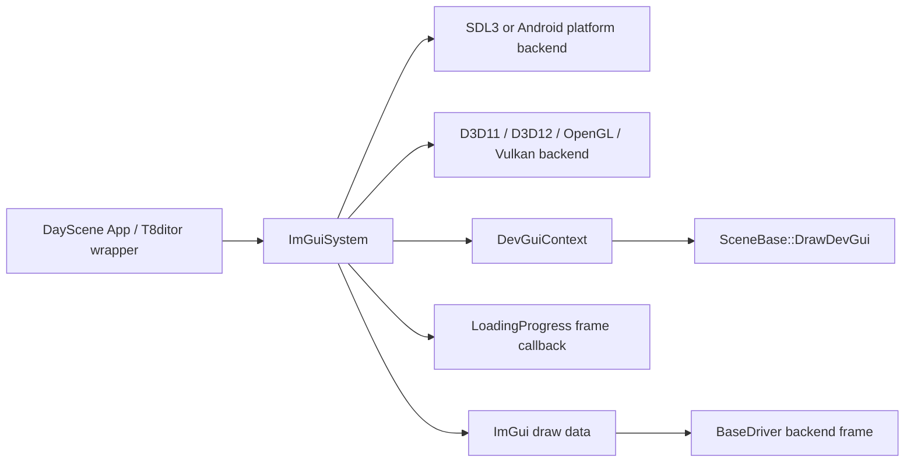
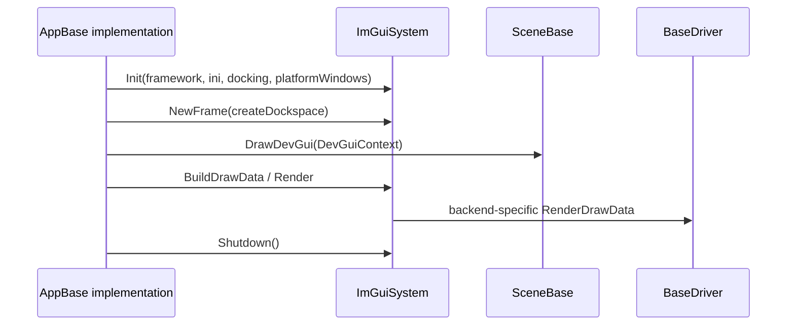
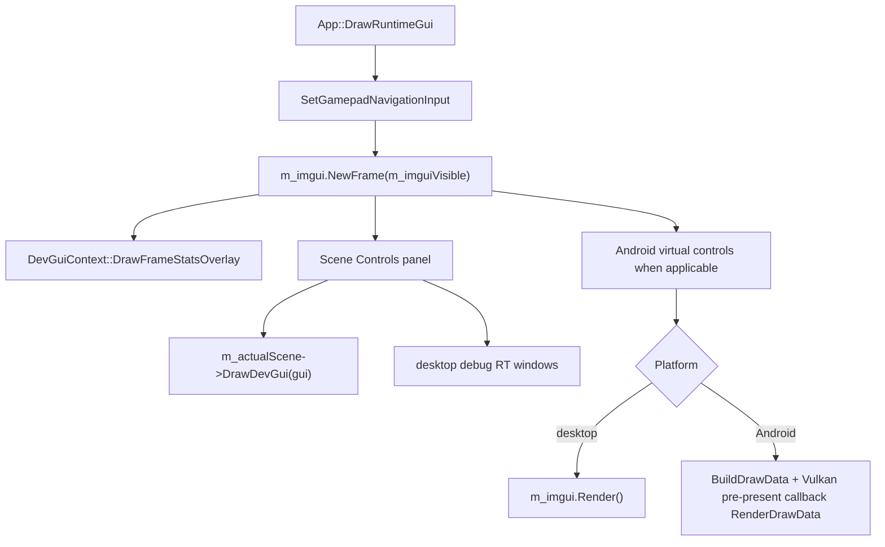

# FrameworkImGui Runtime UI Layer

Status: Stage 16 draft.

This document explains the reusable FrameworkImGui layer used by runtime scenes and wrapped by T8ditor: platform/backend initialization, frame lifecycle, docking and platform windows, Android native-window rebinding, loading-screen rendering, `DevGuiContext`, and hosted viewport integration.

Related documents:

- [Main architecture](../architecture/main-architecture.md)
- [Platform event loop](../architecture/platform-event-loop.md)
- [Input, camera, and controls](../input/camera-and-controls.md)
- [Debug and diagnostics](../debug/diagnostics.md)
- [Editor overview](editor-overview.md)
- [Scene format and runtime](../scenes/scene-format-and-runtime.md)
- [SceneSetup descriptors](../scenes/scene-setup-descriptors.md)

## Purpose and responsibilities

FrameworkImGui is the shared UI bridge between T850 platform/render backends and Dear ImGui.

It is responsible for:

1. Creating and destroying the Dear ImGui context.
2. Initializing the correct platform backend: SDL3 on desktop/Linux, Android backend on Android.
3. Initializing the correct renderer backend: D3D11, D3D12, OpenGL, or Vulkan.
4. Driving `NewFrame()`, draw-data build, draw-data render, and optional platform windows.
5. Routing manual gamepad navigation into ImGui.
6. Rendering loading-progress frames while long asset loads run.
7. Providing `DevGuiContext` wrappers for scene controls, embedded panels, hosted editor viewports, and descriptor-driven widgets.



## Key files and classes

| File/class | Role |
|---|---|
| `FrameworkImGui/include/imgui/ImGuiSystem.h` | Public UI-system wrapper: init/shutdown, frame lifecycle, draw data, loading frame renderer, capture queries, wheel/gamepad input, Android event/native-window APIs. |
| `FrameworkImGui/src/ImGuiSystem.cpp` | Platform/backend initialization, renderer dispatch, dockspace/platform windows, SDL event watcher, Android native-window rebind, loading screen, gamepad navigation. |
| `FrameworkImGui/include/imgui/DevGuiContext.h` | Shared scene/dev GUI facade around ImGui panels, sections, descriptor widgets, hosted viewport docking IDs, embedded panels, and navigation focus. |
| `FrameworkImGui/src/DevGuiContext.cpp` | `DevGuiContext` implementation: scoped labels, panel begin/end, slider/checkbox/combo/button helpers, frame stats overlay, navigation focus. |
| `DayScene/Application.cpp` | Runtime ImGui owner: layout seeding, init, loading-frame install, runtime GUI drawing, Android pre-present overlay rendering, input dispatch. |
| `T8ditor/EditorImGui.cpp` | T8ditor-specific wrapper around `ImGuiSystem`: editor layout path, style, appearance dialog, log capture, texture IDs, editor platform-window usage. |
| `T8ditor/HostedViewportPanel.*` | Hosted viewport/window helpers used by Play Scene, Mesh Edit, and Ragdoll Edit. |
| `T8ditor/PlayScenePanel.cpp` and `T8ditor/MeshEditorPanel.cpp` | Hosted runtime scene panels that use `DevGuiContext` with viewport/dock/window-class IDs. |

## Runtime ownership

`ImGuiSystem` is owned by the executable/application layer:

- runtime `DayScene::App` owns `m_imgui`;
- T8ditor owns a static `s_imguiSystem` through `EditorImGui.cpp`;
- scenes do not own ImGui directly, they receive a `DevGuiContext&` in `DrawDevGui()`.

The normal runtime order is:



## ImGuiSystem initialization

`ImGuiSystem::Init()` requires a valid `RootFramework` and `RootFramework::pVideoDriver`. It extracts the platform window from the framework and the API from the active driver.

Root extraction:

| Platform | Window source |
|---|---|
| Windows | `Win32Framework::m_pWindow` (`SDL_Window*`) |
| Linux | `LinuxFramework::m_pWindow` (`SDL_Window*`) |
| Android | `AndroidFramework::GetNativeWindow()` (`ANativeWindow*`) |

Initial setup:

1. `IMGUI_CHECKVERSION()`.
2. `ImGui::CreateContext()`.
3. Enable keyboard and gamepad navigation.
4. Enable docking when requested.
5. Enable platform viewports when requested and not Android.
6. Assign `io.IniFilename`.
7. Apply dark style and rounded defaults.
8. When platform windows are enabled, set window rounding to 0 and force opaque window backgrounds.

## Platform backend setup

Platform backend selection:

| Platform/API | Backend init |
|---|---|
| Android | `ImGui_ImplAndroid_Init(m_androidWindow)` |
| Windows + OpenGL | `ImGui_ImplSDL3_InitForOpenGL(m_sdlWindow, nullptr)` |
| Windows + Vulkan | `ImGui_ImplSDL3_InitForVulkan(m_sdlWindow)` |
| Windows + D3D11/D3D12 | `ImGui_ImplSDL3_InitForD3D(m_sdlWindow)` |
| Linux | `ImGui_ImplSDL3_InitForVulkan(m_sdlWindow)` |
| Other desktop fallback | `ImGui_ImplSDL3_InitForOpenGL(m_sdlWindow, nullptr)` |

Desktop builds set SDL gamepad mode to manual:

```cpp
ImGui_ImplSDL3_SetGamepadMode(ImGui_ImplSDL3_GamepadMode_Manual);
```

This is intentional because T850 feeds gamepad navigation from `InputManager`/`GamepadInputState`, not from ImGui's automatic SDL polling.

Desktop initialization also registers an SDL event watcher after renderer init. The watcher:

- forwards events to `ImGui_ImplSDL3_ProcessEvent()`;
- accumulates mouse wheel into `m_wheelAccum`;
- records window events for short trace logging.

## Renderer backend setup

Renderer backend selection:

| API | Backend init and special notes |
|---|---|
| D3D11 | Uses `ID3D11Device` and `ID3D11DeviceContext` from global `T8Device`/`T8DeviceContext`, then calls `ImGui_ImplDX11_Init`. |
| D3D12 | Enabled only when `imgui_impl_dx12.h` is available. Uses `D3D12Driver`, native device, command queue, backbuffer count, RTV/DSV formats, and the driver's visible CBV/SRV/UAV heap. |
| OpenGL | Desktop only. Calls `ImGui_ImplOpenGL3_Init("#version 300 es")`. |
| Vulkan | Uses `VulkanDriver` instance/device/queue family/queue, descriptor pool size 64, backbuffer count, and the backbuffer render pass. |

D3D12 uses custom descriptor allocation callbacks that allocate CPU/GPU descriptors from `D3D12Heap::CBV_SRV_UAV_VISIBLE`. The free callback is intentionally empty because descriptors come from the driver's heap allocator path.

Vulkan rendering calls `VulkanDriver::EnsureBackbufferRenderPass()` before rendering draw data and uses the current `VulkanDeviceContext` command buffer.

## NewFrame and rendering lifecycle

`NewFrame(createDockspace)` performs:

1. Android native-window validation/rebind when needed.
2. Renderer backend `NewFrame()`.
3. Platform backend `NewFrame()`.
4. Desktop mouse synchronization from SDL global/window mouse state.
5. Manual gamepad navigation submission.
6. `ImGui::NewFrame()`.
7. Optional main dockspace creation through `DockSpaceOverViewport`.

Desktop gamepad behavior:

- Windows submits full gamepad navigation through `SubmitGamepadGuiNavigation()`.
- Linux submits directional gamepad navigation through `SubmitGamepadGuiDirectionalNavigation()`.
- Windows also uses `MouseDrawCursor` when gamepad GUI is visible and touch cursor is active.

`Render()` performs:

1. `BuildDrawData()` -> `ImGui::Render()`.
2. `RenderDrawData()` -> API backend draw-data submission.
3. Desktop platform-window updates when viewports are enabled.

OpenGL preserves/restores the current SDL GL window/context around platform-window rendering. Vulkan defers platform-window resize handling during a left-mouse drag if any platform viewport has `PlatformRequestResize`; this avoids resize churn during drag operations.

## BuildDrawData and RenderDrawData

`BuildDrawData()` is intentionally small: it calls `ImGui::Render()`.

`RenderDrawData()` dispatches by active API:

- D3D11 -> `ImGui_ImplDX11_RenderDrawData`.
- D3D12 -> binds the D3D12 SRV heap and calls `ImGui_ImplDX12_RenderDrawData` with the current command list.
- OpenGL -> `ImGui_ImplOpenGL3_RenderDrawData`.
- Vulkan -> clears pending texture slots, ensures the backbuffer render pass, gets the current command buffer, then calls `ImGui_ImplVulkan_RenderDrawData`.

On Android, runtime code normally calls `BuildDrawData()` in `DrawRuntimeGui()`, then installs a Vulkan pre-present overlay callback that calls `RenderDrawData()` at the correct point in the frame.

## Capture queries and wheel input

`ImGuiSystem` exposes:

| API | Meaning |
|---|---|
| `WantsKeyboard()` | Returns `ImGui::GetIO().WantCaptureKeyboard`. |
| `WantsTextInput()` | Returns `ImGui::GetIO().WantTextInput`. |
| `WantsMouse()` | Returns `ImGui::GetIO().WantCaptureMouse`. |
| `ConsumeWheelDelta()` | Returns accumulated SDL wheel delta and resets it. |
| `AddWheelDelta(delta)` | Adds wheel amount from the SDL event watcher. |

Editor and runtime input code use these capture flags to avoid applying shortcuts, mouse look, camera movement, or text-sensitive actions while ImGui is interacting with controls.

## Android native-window binding and input

Android is special because the `ANativeWindow` can be destroyed and recreated while the app object and ImGui wrapper survive.

`SetAndroidNativeWindow(window)`:

1. If not initialized yet, stores the incoming window and returns whether it is non-null.
2. If already initialized with the same live window, returns true.
3. If a platform backend is active for an old window, shuts it down.
4. Initializes `ImGui_ImplAndroid` for the new window.
5. Logs `Android native window rebound`.

`NewFrame()` calls `SetAndroidNativeWindow(currentWindow)` every frame before backend new-frame calls. `DayScene::App::OnAndroidNativeWindowChanged()` also calls `m_imgui.SetAndroidNativeWindow(window)` when the Android framework reports a surface change.

`HandleAndroidInputEvent(event)` forwards to `ImGui_ImplAndroid_HandleInputEvent()`. It also patches stylus/eraser motion by manually adding touch-screen source, mouse position, and left-button events for down/up/move cases.

## Loading-progress frame renderer

`InstallLoadingProgressRenderer()` registers a `LoadingProgress` frame callback that calls `RenderLoadingFrame()`. `ClearLoadingProgressRenderer()` removes the callback.

`RenderLoadingFrame()`:

1. Guards against reentrancy with `m_loadingFrameActive`.
2. Processes desktop input while loading.
3. Clears the backbuffer.
4. Starts an ImGui frame without a dockspace.
5. Reads `LoadingProgress::GetSnapshot()`.
6. Draws a full-screen loading UI with title, phase, progress bar, percentage, item, and detail.
7. Renders ImGui.
8. Presents through `BaseDriver::CompleteFrame(Present)`.

Runtime `App::CreateAssets()` installs this renderer before scene/font/primitive loading and clears it when loading is complete.

## Runtime DayScene UI flow

`DayScene/Application.cpp` uses `ImGuiSystem` directly.

Initialization:

- skips runtime ImGui for regular benchmark mode, except benchmark matrix;
- seeds `imgui_runtime_layout.ini` from `Layouts/imgui_runtime_layout.ini` when missing;
- calls `m_imgui.Init(pFramework, kRuntimeImGuiLayoutFile, true)`;
- installs the loading-progress renderer on success.

Frame drawing:



On desktop, the runtime GUI also uses `DevGuiContext::SetNavigationFocusPanel()` to restrict gamepad nav focus to the currently selected panel. After rendering, it resets navigation focus to `nullptr`.

On Android, runtime GUI has extra controls:

- pause/resume scene,
- close GUI,
- undock panel,
- GUI scale slider,
- left triple-tap/right-side panel mode behavior handled by app code,
- special physics panel routing.

## DevGuiContext

`DevGuiContext` is the shared facade for scene/runtime debug panels. It lets runtime scenes draw the same controls in:

- standalone runtime windows,
- T8ditor hosted Play Scene panels,
- Mesh Edit panels,
- embedded/collapsible contexts,
- Android-specific panels.

Important APIs:

| API | Meaning |
|---|---|
| `BeginPanel(title, open, flags)` / `EndPanel()` | Opens a normal ImGui window, or a collapsible embedded section when embedded mode is enabled. |
| `SetIdSuffix(suffix)` | Adds a stable hidden label suffix so hosted scene panels do not collide with main runtime panels. |
| `SetViewportId(viewportId)` | Pins the next panel to a specific ImGui platform viewport. |
| `SetDockId(dockId)` | Applies a first-use dock target for hosted panels. |
| `SetWindowClassId(classId)` | Applies a window class and disables unclassed docking. |
| `SetEmbedPanels(embed)` | Uses collapsible headers instead of separate ImGui windows. |
| `Slider`, `Checkbox`, `Combo`, `Button` | Descriptor-aware wrappers used by scene controls. |
| `DrawFrameStatsOverlay(text)` | Draws a small transparent frame-stats overlay. |
| `SetNavigationFocusPanel(title)` / `PanelAllowsNavigationFocus(title)` | Limits gamepad/keyboard navigation to one visible panel title. |

Label handling:

- `MakeImGuiLabel(name, label)` creates `visible##name` labels for descriptor controls.
- `MakePanelLabel(title, suffix)` creates `visible##suffix/original` panel labels for hosted windows.
- `VisiblePanelTitle()` strips hidden `##` IDs before navigation-focus comparison.

On Android, `Combo()` supports touch scrolling inside combo popups and avoids auto-closing while a touch drag is in progress.

## Runtime scene DevGui call sites

Scene classes expose debug/runtime controls through `SceneBase::DrawDevGui(DevGuiContext&)`.

Major current call sites:

- `SceneTemplate::DrawDevGui()`,
- `Quake3Mock::DrawDevGui()`,
- `SandboxScene::DrawDevGui()`,
- `RagdollEditor::DrawDevGui()`,
- Android physics panel wrappers in `Application.cpp`.

Scene code should prefer `DevGuiContext` wrappers for descriptor-style controls. Direct ImGui calls are still used for custom/debug views, but `DevGuiContext` gives hosted windows, embedded panels, and gamepad navigation focus consistent behavior.

## T8ditor relationship

T8ditor does not use `DayScene::App::m_imgui`; it wraps the same `ImGuiSystem` through `T8ditor/EditorImGui.cpp`.

T8ditor-specific additions:

- `BuildGlobalLayoutPath()` stores the global editor layout under SDL pref path `T850/T8ditor/imgui_layout.ini` when available.
- Legacy relative `imgui_layout.ini` is migrated into that global path.
- `ImGuiInit(fw, true)` enables docking and platform windows.
- `ApplyArtistEditorStyle()` applies editor-specific theme/font scaling.
- `ImGuiRender()` calls `s_imguiSystem.Render()` and saves the global layout when dirty.
- `ImGuiTextureID()` converts backend texture objects to ImGui texture IDs for D3D11, D3D12, Vulkan, and OpenGL.
- Vulkan texture descriptors are cached through `ImGui_ImplVulkan_AddTexture()`.
- Log capture feeds the editor console ring buffer.

This means FrameworkImGui owns the backend lifecycle, while T8ditor owns editor layout policy, editor appearance, editor panels, texture-ID conversion, and scene-specific layout behavior.

## Hosted viewport integration

T8ditor hosted windows use ImGui docking/platform-window features plus `DevGuiContext`.

`HostedSceneWindowController` stores:

- open/loaded/close state,
- GUI visibility,
- native/window handle logging state,
- ImGui viewport ID,
- dockspace ID,
- dock class ID,
- viewport/image rects.

`HostedRenderViewport` stores the render target and its ImGui image rect. It can draw a backend texture into an ImGui image, track input-active state, and convert global mouse coordinates to local viewport coordinates.

Hosted scene controls:

| Hosted window | Integration |
|---|---|
| Play Scene | Creates `PlaySceneDockSpace`, `PlaySceneDockClass`, pins scene controls to the play-scene viewport/dock/class, calls `m_playScene->DrawDevGui(gui)`. |
| Mesh Edit | Creates `MeshEditDockSpace`, `MeshEditDockClass`, pins scene controls to the mesh-edit viewport/dock/class, calls `m_meshEditorScene->DrawDevGui(gui)`. |
| Ragdoll Edit | Uses hosted viewport/image input for custom ragdoll tool UI; it is mostly editor-specific panel code rather than a hosted runtime `DrawDevGui()` scene panel. |

When adding hosted windows, use unique `SetIdSuffix()` values and window class IDs to avoid ImGui ID collisions and accidental docking into unrelated editor panels.

## Shutdown and reload hazards

`ImGuiSystem::Shutdown()`:

1. Clears the loading-progress frame callback.
2. Saves ini settings when an ini path exists.
3. Shuts down the active renderer backend.
4. Shuts down the platform backend.
5. Removes the SDL event watcher on desktop.
6. Destroys the ImGui context.
7. Clears framework/window/gamepad/transient state.

Important hazards:

- Do not call `NewFrame()` or `Render()` after driver destruction; `ImGuiSystem` expects the current `BaseDriver` and backend objects to exist.
- On API switch/reload, shut down ImGui before destroying backend resources and reinitialize after the new driver exists.
- D3D12 ImGui rendering needs the visible SRV heap bound before draw-data submission.
- Vulkan ImGui rendering needs a valid current command buffer and backbuffer render pass.
- Android surface loss requires native-window rebinding; stale `ANativeWindow*` values must not be used.
- Desktop platform windows require the SDL event watcher and backend platform-window update/render calls.
- The loading-progress callback must be cleared before shutdown to avoid callbacks into a destroyed UI system.

## Extension rules

When adding a runtime UI panel:

1. Prefer `SceneBase::DrawDevGui(DevGuiContext&)` for scene-owned controls.
2. Use `DevGuiContext` descriptor wrappers for sliders, checkboxes, selectors, and buttons when metadata already exists.
3. Use stable `name` values in descriptors so ImGui IDs do not depend on localized/visible labels.
4. Respect `PanelAllowsNavigationFocus()` when drawing extra standalone panels that should cooperate with gamepad navigation.

When adding backend/platform support:

1. Add platform init and shutdown branches together.
2. Add renderer init, new-frame, shutdown, and render-draw-data branches together.
3. Verify docking and platform windows are either supported or explicitly disabled.
4. Verify texture-ID conversion for T8ditor if editor image previews must work.
5. Verify loading-frame rendering during long startup.

When adding hosted editor panels:

1. Use a unique dockspace ID, dock class ID, and `DevGuiContext::SetIdSuffix()`.
2. Pin panels to the hosted ImGui viewport with `SetViewportId()`.
3. Use `SetDockId()` and `SetWindowClassId()` to keep panel docking local to the hosted window.
4. Keep render-target image rect/input state in `HostedRenderViewport`.

## Known limitations and gotchas

- Runtime `ImGuiSystem` and T8ditor's `EditorImGui` wrapper share backend code but have different layout/style policies.
- Android does not enable platform viewports; hosted native editor windows are desktop-only.
- D3D12 backend support depends on `imgui_impl_dx12.h` being available at compile time.
- `DevGuiContext` does not prevent direct ImGui calls; mixed direct/wrapper code must still avoid ID collisions.
- T8ditor Vulkan texture descriptor caching must be cleared on ImGui shutdown/API reload.
- Platform-window behavior is sensitive to mouse/resize events; the system has trace logging for short windows after SDL window events.

## Debugging checklist

1. If ImGui fails to initialize, check that `RootFramework::pVideoDriver` and the platform window/native window are valid.
2. If controls do not receive keyboard/gamepad navigation, check `SetGamepadNavigationInput()`, `SetNavigationFocusPanel()`, and `PanelAllowsNavigationFocus()`.
3. If mouse coordinates are wrong in editor platform windows, check whether platform windows are enabled and whether mouse sync is using global or window coordinates.
4. If Android UI disappears after rotation/surface loss, check `SetAndroidNativeWindow()` rebinding logs.
5. If Vulkan UI does not render, confirm the command buffer exists and `EnsureBackbufferRenderPass()` is called.
6. If D3D12 UI draws incorrectly, verify the ImGui SRV heap is bound before `ImGui_ImplDX12_RenderDrawData()`.
7. If hosted Play/Mesh scene panels dock into the wrong window, check `SetViewportId()`, `SetDockId()`, `SetWindowClassId()`, and `SetIdSuffix()`.
8. If loading progress keeps rendering after shutdown, verify `ClearLoadingProgressRenderer()` ran.
