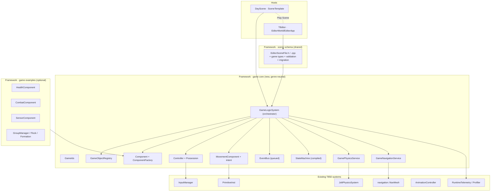
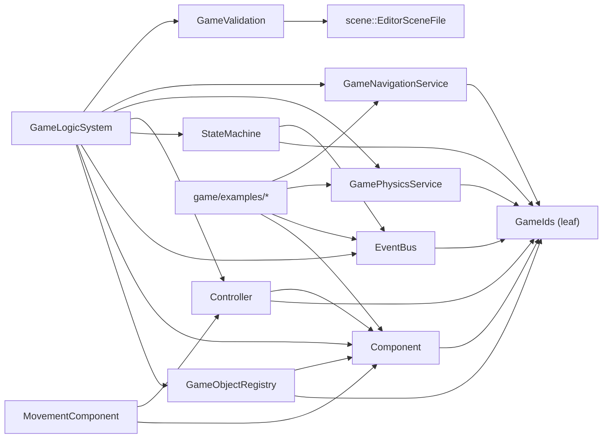
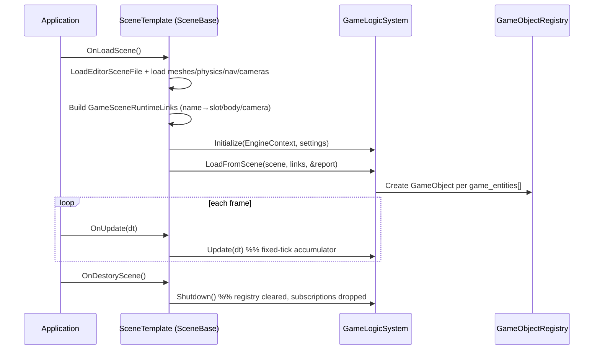
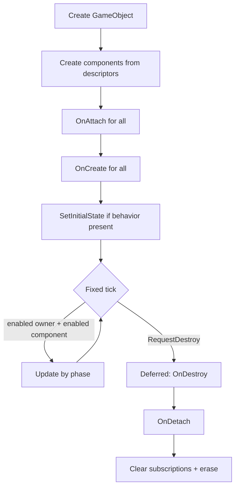
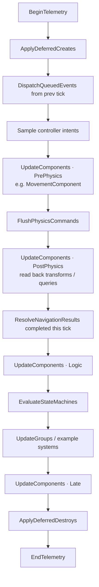
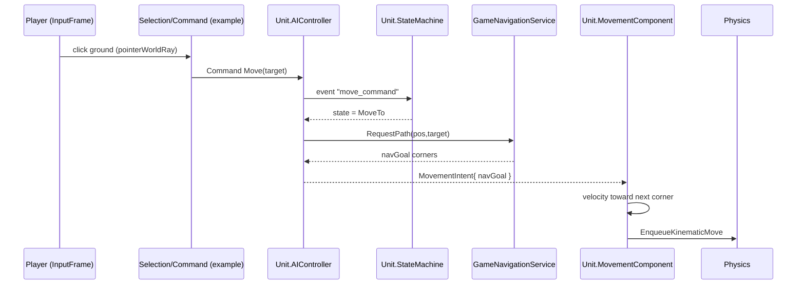
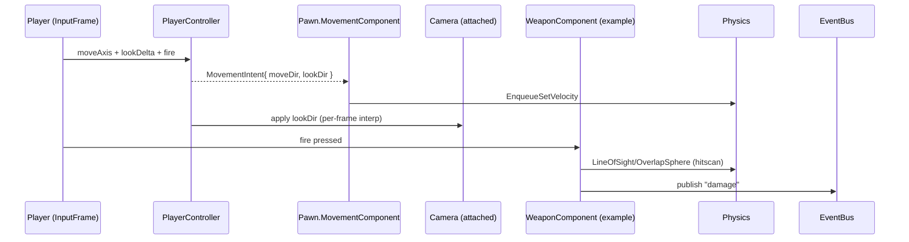

# T850 Game Entity & Logic System — Technical Specification

> **Status:** Implementation-ready specification (v1)
> **Date:** 2026-07-01
> **Build system:** MSBuild (`.vcxproj`) primary, CMake secondary
> **Language:** C++23 (`stdcpp23`)
> **Supersedes:** `legacy/proposals/game-logic-and-ai-integration.md`, `legacy/proposals/editor-game-logic-integration.md`, `legacy/proposals/assessment.md`, `legacy/proposals/assessment-gpt.md`, `legacy/proposals/gap-remediation-gpt.md`

This document consolidates the two original proposals, both assessments, and the gap-remediation notes into a single spec. It is source-grounded against the current T850 tree, resolves the gaps those documents identified, and adds the one missing abstraction none of them covered: a **control/possession layer** that lets one engine drive both RTS units (commanded, AI-controlled) and FPS pawns (possessed, input-controlled).

---

## Table of Contents

1. [Purpose and scope](#1-purpose-and-scope)
2. [Design principles](#2-design-principles)
3. [Current engine state (verified)](#3-current-engine-state-verified)
4. [Architecture overview](#4-architecture-overview)
5. [Core model](#5-core-model)
6. [Schema specification](#6-schema-specification)
7. [Runtime specification](#7-runtime-specification)
8. [Input, control, and possession](#8-input-control-and-possession)
9. [Physics gameplay layers and queries](#9-physics-gameplay-layers-and-queries)
10. [Navigation integration](#10-navigation-integration)
11. [Editor integration](#11-editor-integration)
12. [Telemetry and performance](#12-telemetry-and-performance)
13. [Testing specification](#13-testing-specification)
14. [Build integration](#14-build-integration)
15. [Implementation roadmap](#15-implementation-roadmap)
16. [Risk register](#16-risk-register)
17. [Appendix A: full `.t8scene` example](#appendix-a-full-t8scene-example)
18. [Appendix B: file manifest](#appendix-b-file-manifest)
19. [Appendix C: API quick reference](#appendix-c-api-quick-reference)
20. [Appendix D: naming decisions](#appendix-d-naming-decisions)

---

## 1. Purpose and scope

### 1.1 Goal

Add a runtime gameplay simulation layer to T850 so that authored scenes can produce interactive entities. The layer must be **genre-neutral**: the same core must support a commanded RTS unit and a possessed FPS pawn without forking the engine.

### 1.2 In scope (v1)

- Stable entity/component identity in the shared scene schema.
- A runtime `GameLogicSystem` owned by the scene, with a fixed-tick simulation loop.
- A generic `GameObject` + `Component` model linked to existing render/physics resources.
- A **control/possession** layer (player-input vs AI) and a **movement-intent** abstraction.
- A queued `EventBus`, a compiled `StateMachine`, and shared validation/migration.
- Physics/navigation **service facades** with explicit write boundaries.
- Editor authoring (selection, inspector, validation, Play Scene feedback).
- Telemetry counters, performance budgets, and an automated test harness.

### 1.3 Out of scope (v1)

- Full ECS / data-oriented storage (revisit only when profiling requires it).
- Visual node-graph state-machine editor (list/table editor first).
- Networking / replication / lockstep determinism (see [§16](#16-risk-register)).
- RTS-specific systems (flocking, formations, combat, resources) ship as an **examples** module, not core.

### 1.4 Genre mandate

| Genre | Player entity | NPC entity | Camera | Primary intent source |
|---|---|---|---|---|
| RTS | none (player controls a strategic camera + selection) | AI-controlled units | free / strategic | commands → AI controllers |
| FPS | one possessed pawn (input-driven) | AI-controlled enemies | first-person, attached to pawn | input → player controller |

The architecture below treats "who produces movement/aim intent" as pluggable. That single decision is what makes both genres expressible.

---

## 2. Design principles

1. **Runtime semantics first, editor polish second.** A polished editor over unstable runtime rules will churn.
2. **Shared schema, no duplication.** All authored types live in `t850::scene::EditorSceneFile`; editor and runtime consume the same headers.
3. **Stable IDs before references.** Gameplay references use serialized IDs, never display names or vector indices.
4. **Fixed-tick simulation, variable-rate presentation.** Simulation ticks at a fixed rate; input sampling and camera/aim interpolate per frame.
5. **Explicit phase ordering.** Components, events, physics commands, nav results, and entity destruction run in documented phases; no mutation during iteration.
6. **Bounded engine access.** Components never call Jolt/Detour directly. They go through service facades that queue writes and centralize queries.
7. **Genre-neutral core, genre-specific examples.** Health/combat/sensor/flocking are examples layered on the core, not part of it.
8. **Reuse existing infrastructure.** `EngineContext`, `ThreadPool`, `ResourceLocator`, `RuntimeTelemetry`, `Profiler`, `DevGuiContext`, `LineRenderer`, `PrimitiveInst`.

---

## 3. Current engine state (verified)

All rows verified against the current source tree on 2026-07-01.

| Concern | State | Evidence |
|---|---|---|
| `SceneGameEntityDesc` | Metadata only (no `id`, `components`, `behavior`, `group_id`) | [EditorSceneFile.h#L315](../../T850/Framework/include/scene/EditorSceneFile.h) |
| Top-level game data | `game_entities` vector; `version = 1`, never checked | [EditorSceneFile.h#L341](../../T850/Framework/include/scene/EditorSceneFile.h) |
| Runtime consumption | `SceneTemplate` does **not** read `game_entities` | [SceneTemplate.cpp](../../T850/DayScene/SceneTemplate.cpp) |
| Runtime game module | Does not exist | no `Framework/*/game/` path |
| Serialization | Glaze pure reflection; unknown keys ignored on load | [EditorSceneFile.cpp#L134](../../T850/Framework/src/scene/EditorSceneFile.cpp) |
| Selection types | `0..8`, no game entity/group type | [EditorWorld.h#L129](../../T850/T8ditor/EditorWorld.h) |
| Physics collision layers | Only `NonMoving` / `Moving` | [JoltPhysicsSystem.cpp#L67](../../T850/Framework/src/physics/JoltPhysicsSystem.cpp) |
| Physics queries | `CastCapsule` / `CastBox` only; **no overlap/sphere, no layer filter, no hit→entity** | [JoltPhysicsSystem.h#L38](../../T850/Framework/include/physics/JoltPhysicsSystem.h) |
| Navigation API | `NavMesh::FindPath(NavPathRequest)` + batch `FindPaths` | [NavigationSystem.h#L203](../../T850/Framework/include/navigation/NavigationSystem.h) |
| DetourCrowd | Linked but not the active runtime path | docs + navmesh runtime |

### 3.1 Footholds to reuse (not rebuild)

These already exist and shorten the work substantially:

- **`PrimitiveInst` already links to physics and carries an id.** It exposes `uint32_t GetEntityId()`, `AttachPhysicsBody(PhysicsBodyHandle)`, `GetPhysicsBody()`, `HasPhysicsBody()`, plus ragdoll links and `XMATRIX44` transforms (`Position`, `RotationX/Y/Z`, `Scale`, `Final`). A `GameObject` links through the mesh slot + `EntityId` + `PhysicsBodyHandle`. See [PrimitiveInstance.h](../../T850/Framework/include/scene/PrimitiveInstance.h).
- **`SceneBase` already owns an `EngineContext*`** (`SetEngineContext`/`GetEngineContext`) and defines the lifecycle hooks `OnUpdate(float)`, `OnLoadScene()`, `OnDestoryScene()` (sic), `OnInput(InputManager*)`, `DrawDevGui(DevGuiContext&)`. See [Core.h#L67](../../T850/Framework/include/core/Core.h). The game system needs no new lifecycle plumbing.
- **`EngineContext`** is a global service locator holding `physics` (`JoltPhysicsSystem*`), `threadPool`, `config`. A scene-owned `GameLogicSystem` reaches shared services without becoming a global.
- **Legacy `ai` field already encodes roles.** Inference sets `entity.ai = "player"` / `"nav_agent"` ([EditorApp.cpp#L1667](../../T850/T8ditor/EditorApp.cpp)); it is display-only today. This is the seed of the control model in [§8](#8-input-control-and-possession).
- **`SceneObjectDesc` already has `nav_agent_*` fields** (follow distance, side offset, formation depth step, slot, target mode, yaw offset) — a proto follow/formation system that the movement layer should consume rather than duplicate.
- **`SceneObjectPhysicsDesc.collision_layer`** is already a string (`"world"`), giving an authoring hook to map onto the new gameplay layer enum in [§9](#9-physics-gameplay-layers-and-queries).

---

## 4. Architecture overview

### 4.1 Layered view



### 4.2 Module dependency chart

Compile-time dependency direction (arrow = "depends on"). Cycles are prohibited.



**Rule:** `game/core` must not include anything from `game/examples`, `T8ditor`, or ImGui. Debug panels live in `FrameworkImGui`/host code, not in core.

### 4.3 Ownership and lifetime



- `GameLogicSystem` is a **member of `SceneTemplate`** (not a global, not in `EngineContext`). It reaches `physics`/`threadPool` via `SceneBase::GetEngineContext()`.
- Runtime objects never hold references into `EditorWorld`. Play Scene passes a **copy** of `EditorSceneFile`.

---

## 5. Core model

### 5.1 Stable identity

```cpp
// Framework/include/game/GameIds.h
namespace t850::game {

using RuntimeGameObjectId = uint32_t;
constexpr RuntimeGameObjectId kInvalidRuntimeGameObjectId = 0;

// Serialized, stable, human-scannable. Prefix examples: "ge_", "comp_", "grp_".
std::string MakeStableId(std::string_view prefix);

} // namespace t850::game
```

**Rules**

- IDs are generated in T8ditor when an entity/component/group is created.
- IDs are preserved on rename, save/load, undo/redo.
- Duplicate/copy generates **new** IDs.
- Missing IDs (old scenes) are generated during migration and mark the scene dirty.
- Runtime IDs (`RuntimeGameObjectId`) are allocated on load and **never serialized**.

### 5.2 GameObject and registry

```cpp
// Framework/include/game/GameObject.h
namespace t850::game {

struct GameObjectLinks {
  int meshSlot = -1;                      // index into SceneTemplate mesh pool
  t850::PrimitiveInst* primitive = nullptr;
  uint32_t primitiveEntityId = 0;         // PrimitiveInst::GetEntityId()
  t850::PhysicsBodyHandle primaryBody;    // resolved from primary_physics_entity
  std::vector<t850::PhysicsBodyHandle> bodies;
  int cameraIndex = -1;
  int ragdollIndex = -1;
};

struct GameObject {
  RuntimeGameObjectId runtimeId = kInvalidRuntimeGameObjectId;
  std::string sceneId;                    // stable SceneGameEntityDesc::id
  std::string name;                       // display only
  std::string kind = "generic";
  int team = -1;                          // gameplay team/faction; -1 = neutral
  bool enabled = true;
  GameObjectLinks links;
  std::vector<std::unique_ptr<Component>> components;
  std::unique_ptr<StateMachine> behavior; // optional
  IController* controller = nullptr;      // non-owning; owned by GameLogicSystem
};

} // namespace t850::game
```

```cpp
// Framework/include/game/GameObjectRegistry.h
class GameObjectRegistry {
public:
  GameObject* Create(const t850::scene::SceneGameEntityDesc& desc, GameObjectLinks links);
  void RequestDestroy(RuntimeGameObjectId id);      // deferred
  void ApplyDeferredDestroys();                     // called in tick phase 11

  GameObject* Get(RuntimeGameObjectId id);
  GameObject* FindBySceneId(std::string_view sceneId);
  std::span<GameObject> Objects();
  std::span<const GameObject> Objects() const;
  std::size_t Count() const;

private:
  RuntimeGameObjectId nextRuntimeId_ = 1;
  std::vector<GameObject> objects_;
  std::unordered_map<RuntimeGameObjectId, std::size_t> runtimeIndex_;
  std::unordered_map<std::string, RuntimeGameObjectId> sceneIdToRuntime_;
  std::vector<RuntimeGameObjectId> pendingDestroy_;
};
```

### 5.3 Component model and lifecycle

```cpp
// Framework/include/game/Component.h
enum class ComponentUpdatePhase { PrePhysics, PostPhysics, Logic, Late };

class Component {
public:
  virtual ~Component() = default;
  virtual std::string_view Type() const = 0;
  virtual ComponentUpdatePhase Phase() const { return ComponentUpdatePhase::Logic; }
  virtual void OnAttach(GameObject& owner, GameLogicSystem& system) {}
  virtual void OnCreate() {}
  virtual void Update(float fixedDt) {}
  virtual void OnDestroy() {}
  virtual void OnDetach() {}
protected:
  GameObject* owner_ = nullptr;
  GameLogicSystem* system_ = nullptr;
};

struct ComponentTypeInfo {
  std::string type;
  std::vector<std::string> requiredComponentTypes;
  bool allowMultiple = false;
};

struct ComponentLoadContext {
  GameObject* owner = nullptr;
  GameLogicSystem* system = nullptr;
  t850::scene::SceneValidationReport* report = nullptr;
};

using ComponentFactoryFn =
    std::unique_ptr<Component> (*)(const t850::scene::SceneComponentDesc&, ComponentLoadContext&);

class ComponentFactoryRegistry {
public:
  void Register(std::string type, ComponentFactoryFn fn, ComponentTypeInfo info);
  std::unique_ptr<Component> Create(const t850::scene::SceneComponentDesc&, ComponentLoadContext&) const;
  const ComponentTypeInfo* Info(std::string_view type) const;
};
```

**Lifecycle contract**



- **Unknown component type:** never crash. Emit a validation warning and instantiate an inert `UnknownComponent` that preserves `type`, `params`, and `config_json` so the editor can round-trip it.
- **Parsing:** `params`/`config_json` are parsed **once** at `OnCreate`/edit-apply, never per frame.
- **Mutation:** components request add/remove via `system_->RequestAddComponent(...)` / `RequestRemoveComponent(...)`; applied in the deferred phase.

### 5.4 Control and possession

The abstraction that makes RTS and FPS share a core. A `GameObject` is a **pawn**; an `IController` supplies its intent.

```cpp
// Framework/include/game/Controller.h
enum class ControllerKind { None, Player, AI };

struct MovementIntent {
  XVECTOR3 moveDir = XVECTOR3(0,0,0,0);   // desired planar move direction, world space, unit-ish
  float    speedScale = 1.0f;             // 0..1
  XVECTOR3 lookDir = XVECTOR3(0,0,1,0);   // desired facing / aim direction
  uint32_t actionBits = 0;                // bit flags: fire, altFire, jump, use, ability0..
  std::optional<XVECTOR3> navGoal;        // AI path goal (world), if pathing
  bool     hasNavGoal = false;
};

class IController {
public:
  virtual ~IController() = default;
  virtual ControllerKind Kind() const = 0;
  virtual void OnPossess(GameObject& pawn) { pawn_ = &pawn; }
  virtual void OnUnpossess() { pawn_ = nullptr; }
  // Called once per fixed tick in the Logic phase for the possessed pawn.
  virtual MovementIntent SampleIntent(const InputFrame& input, float fixedDt) = 0;
protected:
  GameObject* pawn_ = nullptr;
};
```

- `PlayerController` reads `InputFrame` (see [§8](#8-input-control-and-possession)) and emits intent directly. FPS look/aim uses per-frame interpolation on top of the fixed-tick intent.
- `AIController` ignores raw input and derives intent from its `StateMachine` + `GameNavigationService` (path goal → `navGoal`).
- Possession is **1 controller ↔ ≤1 pawn**. RTS: the player possesses no pawn; units carry their own `AIController`. FPS: one `PlayerController` possesses the player pawn.

### 5.5 Movement / intent abstraction

`MovementComponent` is the single consumer of `MovementIntent`. It converts intent into transform/velocity and writes through the physics service — never directly to Jolt.

```cpp
// Framework/include/game/MovementComponent.h  (core, genre-neutral)
class MovementComponent final : public Component {
public:
  std::string_view Type() const override { return "movement"; }
  ComponentUpdatePhase Phase() const override { return ComponentUpdatePhase::PrePhysics; }
  void OnCreate() override;                 // parse maxSpeed, accel, turnRate, mode
  void Update(float fixedDt) override;      // consume intent, produce velocity/kinematic move
private:
  enum class Mode { Kinematic, Dynamic, TransformOnly } mode_ = Mode::Kinematic;
  float maxSpeed_ = 6.0f, accel_ = 40.0f, turnRateRadPerSec_ = 8.0f;
  XVECTOR3 velocity_ = XVECTOR3(0,0,0,0);
};
```

Application path: `MovementComponent::Update` reads `owner_->controller->SampleIntent(...)` results cached by the system, computes velocity, and calls `system_->Physics().EnqueueKinematicMove(owner_->runtimeId, xform)` or `EnqueueSetVelocity(...)`. The result is applied when the physics command buffer flushes.

### 5.6 Event bus (queued)

```cpp
// Framework/include/game/EventBus.h
struct GameEvent {
  uint64_t sequence = 0;
  uint64_t tick = 0;
  std::string type;                 // "damage", "state_changed", "died", ...
  std::string sourceEntityId;       // stable scene id
  std::string targetEntityId;
  std::map<std::string, std::string> params;
};

class Subscription { /* opaque handle */ };

class EventBus {
public:
  using Handler = std::function<void(const GameEvent&)>;
  Subscription Subscribe(std::string_view eventType, Handler handler);
  void Unsubscribe(const Subscription& sub);
  void Publish(GameEvent event);           // appends to NEXT queue (safe in handlers)
  void DispatchQueued(uint64_t tickIndex);  // called only by GameLogicSystem
  std::span<const GameEvent> RecentEvents() const; // ring buffer for DevGui
};
```

**Dispatch rules** (deterministic, no reentrancy surprises):

1. `Publish` appends to the *next* queue.
2. At the event phase, current/next queues swap; handlers run in FIFO by `sequence`.
3. Events published by a handler dispatch on the **next** cycle, not recursively.
4. Entity/component create/destroy requested by a handler is **deferred** to the mutation phase.
5. A fixed-size ring buffer (default 512) retains recent events for DevGui.

### 5.7 State machine (compiled)

Authoring uses strings; runtime compiles them once at load.

```cpp
// Framework/include/game/StateMachine.h
enum class TransitionConditionKind { Always, OnEvent, TimerElapsed, HealthBelow, ParamEquals };

struct CompiledTransition {
  uint32_t fromStateIndex;    // 0xFFFFFFFF = wildcard "*"
  uint32_t toStateIndex;
  TransitionConditionKind kind;
  uint32_t eventTypeId = 0;   // interned
  float threshold = 0.0f;
  std::string paramKey, paramValue;
  float priority = 0.0f;
  float cooldown = 0.0f;
  float cooldownRemaining = 0.0f;
};

class StateMachine {
public:
  bool Compile(const t850::scene::SceneStateMachineDesc&, t850::scene::SceneValidationReport*);
  void SetInitialState();
  void Evaluate(GameObject& owner, GameLogicSystem& sys, float fixedDt); // 1 transition max/tick
  uint32_t CurrentStateIndex() const;
  std::string_view CurrentStateName() const;
  bool ForceTransition(std::string_view stateName);  // DevGui
};
```

**Condition grammar (v1):** `always`, `on_event:<name>`, `timer_elapsed`, `health_below:<float>`, `param_equals:<key>:<value>`. Invalid strings are validation errors. Evaluation: filter by current/wildcard `from_state`, sort by descending `priority` then descriptor order, honor `cooldown`, apply at most one transition per tick, emit a `state_changed` event on transition.

### 5.8 Fixed tick model and phases

```cpp
struct GameLogicSettings {
  float fixedDeltaSeconds = 1.0f / 60.0f;
  float maxFrameDeltaSeconds = 0.25f;
  int   maxStepsPerFrame = 4;
};

void GameLogicSystem::Update(float deltaSeconds) {
  accumulator_ += std::min(deltaSeconds, settings_.maxFrameDeltaSeconds);
  int steps = 0;
  while (accumulator_ >= settings_.fixedDeltaSeconds && steps < settings_.maxStepsPerFrame) {
    Tick(settings_.fixedDeltaSeconds);
    accumulator_ -= settings_.fixedDeltaSeconds;
    ++steps;
  }
  presentationAlpha_ = accumulator_ / settings_.fixedDeltaSeconds; // for interpolation
}
```

Align gameplay fixed delta with `JoltPhysicsSystem::SetUseFixedSimulationDelta(true)` so simulation and physics agree.

**Tick phase order** (empty phases are allowed in v1 but must exist):



---

## 6. Schema specification

All types are added to `Framework/include/scene/EditorSceneFile.h` in namespace `t850::scene`. Glaze serializes by reflection — no macros — so adding fields is source-compatible. Because load uses `error_on_unknown_keys = false`, older and newer readers interoperate, which makes **explicit validation and migration mandatory** (typos are silent otherwise).

### 6.1 New descriptors

```cpp
// ── Component authoring ──
struct SceneComponentDesc {
  std::string id;                              // "comp_..."
  std::string type;                            // "movement", "health", ...
  bool enabled = true;
  std::map<std::string, std::string> params;   // simple editor-friendly values
  std::string config_json;                     // optional nested config
};

// ── Control / possession authoring ──
struct SceneControlDesc {
  std::string mode = "none";                   // "none" | "player" | "ai"
  std::string controller;                      // controller profile id/name
  int player_slot = 0;                         // for local multiplayer / seat
};

// ── State machine authoring ──
struct SceneStateDesc {
  std::string name;
  std::map<std::string, std::string> params;
  float default_duration = -1.0f;              // -1 = infinite
};
struct SceneTransitionDesc {
  std::string from_state;                      // "*" = wildcard
  std::string to_state;
  std::string condition;                       // see §5.7 grammar
  float priority = 0.0f;
  float cooldown = 0.0f;
};
struct SceneStateMachineDesc {
  std::string initial_state = "idle";
  std::vector<SceneStateDesc> states;
  std::vector<SceneTransitionDesc> transitions;
};

// ── Groups (examples/RTS; stable member IDs) ──
struct SceneFlockConfigDesc {
  float separation_weight = 1.0f, alignment_weight = 0.8f, cohesion_weight = 0.6f;
  float separation_radius = 2.0f, neighbor_radius = 5.0f, max_speed = 10.0f;
};
struct SceneFormationConfigDesc {
  std::string type = "wedge";                  // wedge|line|column|box|circle
  float spacing = 3.0f, depth_step = 3.0f;
  std::string leader_entity_id;
};
struct SceneGroupDesc {
  std::string id;                              // "grp_..."
  std::string name;
  std::string strategy = "formation";          // formation|flock|custom
  std::vector<std::string> member_entity_ids;  // stable ids, NOT names
  SceneFlockConfigDesc flock;
  SceneFormationConfigDesc formation;
};

// ── Global settings ──
struct SceneSpatialGridSettingsDesc {
  bool enabled = false;
  float cell_size = 4.0f;
  int grid_width = 256, grid_depth = 256;
};
struct SceneGameLogicSettingsDesc {
  int schema_version = 2;
  float fixed_delta_seconds = 1.0f / 60.0f;
  int max_steps_per_frame = 4;
  SceneSpatialGridSettingsDesc spatial_grid;
};
```

### 6.2 Extended `SceneGameEntityDesc`

```cpp
struct SceneGameEntityDesc {
  // ── existing fields (unchanged) ──
  std::string name = "Game Entity";
  std::string kind = "generic";
  std::string mesh_object;
  std::string primary_physics_entity;
  std::vector<std::string> physics_entities;
  std::string camera;
  std::string ragdoll_object;
  std::string ai;                              // DEPRECATED: migrated into `control`
  bool visible = true;
  bool frozen = false;
  bool show_wire = true;

  // ── v2 game-logic additions ──
  std::string id;                              // "ge_..."  (stable)
  int team = -1;                               // faction / team
  SceneControlDesc control;                    // possession/control
  std::string group_id;                        // optional group membership
  std::vector<SceneComponentDesc> components;
  std::optional<SceneStateMachineDesc> behavior;
};
```

### 6.3 Extended `EditorSceneFile`

```cpp
struct EditorSceneFile {
  int version = 1;                             // bumped to 2 on first game-logic save
  // ... existing members ...
  std::vector<SceneGameEntityDesc> game_entities;
  std::vector<SceneGroupDesc> game_groups;                       // NEW
  std::optional<SceneGameLogicSettingsDesc> game_logic_settings; // NEW
};
```

### 6.4 Versioning and migration

```cpp
namespace t850::scene {
constexpr int kSceneSchemaV1 = 1;
constexpr int kSceneSchemaV2_GameLogic = 2;

// Returns true if the scene was modified (dirty).
bool MigrateEditorSceneGameLogic(EditorSceneFile& scene, std::string* log = nullptr);
}
```

Migration steps when `scene.version < 2`:

1. For each `game_entities[]` without `id`, assign `MakeStableId("ge_")`.
2. For each component without `id`, assign `MakeStableId("comp_")`.
3. Map legacy `ai` → `control` (leveraging the real values found in the editor):
   - `"player"` → `control.mode = "player"`.
   - `"nav_agent"` → `control.mode = "ai"` and add a default `{type:"movement"}` + `{type:"path_follow"}` component if none exist.
   - `""` → `control.mode = "none"`.
4. Set `version = 2`; keep `ai` populated for one release for backward reads, then remove.

### 6.5 Validation contract (shared)

Validation lives in Framework (`game/GameValidation`) so **both** the editor panel and `SceneTemplate` runtime load call the same code.

```cpp
namespace t850::scene {
enum class SceneValidationSeverity { Info, Warning, Error };
struct SceneValidationIssue {
  SceneValidationSeverity severity = SceneValidationSeverity::Info;
  std::string code;          // "game.dup_id", "game.behavior.initial_missing", ...
  std::string message;
  std::string entityId;
  std::string componentId;
  int entityIndex = -1;      // fallback locator
};
struct SceneValidationReport {
  std::vector<SceneValidationIssue> issues;
  bool HasErrors() const;
};
SceneValidationReport ValidateEditorSceneGameLogic(const EditorSceneFile& scene);
}
```

Minimum checks: missing/duplicate entity id; duplicate component id within an entity; empty component type; unknown component type (warning + preserve); missing mesh/physics/camera/ragdoll link (warning); invalid `control.mode`; behavior initial state missing; transition from/to missing; invalid condition string; group member id missing; leader not a member.

---

## 7. Runtime specification

### 7.1 `GameLogicSystem`

```cpp
// Framework/include/game/GameLogicSystem.h
struct GameSceneRuntimeLinks {
  // Populated by SceneTemplate after it loads render/physics/nav resources.
  std::function<int(std::string_view meshObject)> resolveMeshSlot;
  std::function<t850::PrimitiveInst*(int slot)> primitiveForSlot;
  std::function<t850::PhysicsBodyHandle(std::string_view physicsEntity)> resolveBody;
  std::function<int(std::string_view camera)> resolveCamera;
  GameObjectLinks Resolve(const t850::scene::SceneGameEntityDesc&) const;
};

class GameLogicSystem {
public:
  void Initialize(t850::EngineContext& ctx, const GameLogicSettings& settings);
  bool LoadFromScene(const t850::scene::EditorSceneFile& scene,
                     const GameSceneRuntimeLinks& links,
                     t850::scene::SceneValidationReport* report = nullptr);
  void Update(float deltaSeconds);
  void Shutdown();

  GameObjectRegistry& Registry();
  EventBus& Events();
  GamePhysicsService& Physics();
  GameNavigationService& Navigation();
  ComponentFactoryRegistry& Factories();

  void RequestAddComponent(RuntimeGameObjectId, t850::scene::SceneComponentDesc);
  void RequestRemoveComponent(RuntimeGameObjectId, std::string componentId);
  const GameLogicStats& Stats() const;

private:
  void Tick(float fixedDt);
  void UpdateComponents(ComponentUpdatePhase, float fixedDt);
  void ApplyDeferredCreates();
  void ApplyDeferredDestroys();

  t850::EngineContext* ctx_ = nullptr;
  GameLogicSettings settings_;
  float accumulator_ = 0.0f, presentationAlpha_ = 0.0f;
  uint64_t tickIndex_ = 0;
  GameObjectRegistry registry_;
  EventBus events_;
  ComponentFactoryRegistry factories_;
  std::vector<std::unique_ptr<IController>> controllers_;
  GamePhysicsService physics_;
  GameNavigationService navigation_;
  GameLogicStats stats_;
};
```

### 7.2 SceneTemplate integration

```cpp
// DayScene/SceneTemplate.h  (additions)
class SceneTemplate : public t850::SceneBase, public t850::CameraCollisionWorld {
  // ...
  t850::game::GameLogicSystem m_gameLogic;
};

// DayScene/SceneTemplate.cpp  (sketch, inside existing hooks)
void SceneTemplate::OnLoadScene() {
  // ... existing object/physics/nav/camera loading ...
  t850::game::GameSceneRuntimeLinks links = BuildGameSceneRuntimeLinks();
  m_gameLogic.Initialize(*GetEngineContext(), GameLogicSettingsFromScene(scene));
  t850::scene::SceneValidationReport report;
  m_gameLogic.LoadFromScene(scene, links, &report);
  LogValidation(report);
}
void SceneTemplate::OnUpdate(float dt) {
  // ... existing camera/nav/anim updates ...
  m_gameLogic.Update(dt);          // fixed-tick internally
}
void SceneTemplate::OnDestoryScene() {
  m_gameLogic.Shutdown();
  // ... existing teardown ...
}
void SceneTemplate::DrawDevGui(t850::DevGuiContext& gui) {
  RenderGameLogicDevGui(gui, m_gameLogic);   // object list, events, states, stats
}
```

### 7.3 Thread-safety model

- **Default:** `Tick()` and all component/controller callbacks run on the scene (main) thread.
- **Allowed on workers** (via `EngineContext::threadPool`): read-only path batches and spatial batches over an immutable snapshot; asset/config loads through `ResourceLocator`. Results return through a completion queue drained in `ResolveNavigationResults`.
- **Forbidden on workers:** mutating the registry/`PrimitiveInst`/animation/editor state; publishing into active dispatch; destroying entities; calling Jolt/Detour APIs not documented thread-safe.
- Physics writes are **command-buffered** and flushed only in the physics phase.

> Rationale: the repo has a documented ParallelFor crash history; a conservative main-thread tick avoids reintroducing races before semantics are stable.

---

## 8. Input, control, and possession

This section is the genre-flexibility core. It is deliberately part of the **early** slices, not deferred, because input is what distinguishes RTS from FPS.

### 8.1 Input frame

A per-frame, backend-neutral snapshot produced from `InputManager`, decoupled from device specifics.

```cpp
// Framework/include/game/InputFrame.h
struct InputFrame {
  XVECTOR3 moveAxis = XVECTOR3(0,0,0,0);   // WASD/stick, camera-relative
  XVECTOR3 lookDelta = XVECTOR3(0,0,0,0);  // mouse/stick look delta this frame
  uint32_t buttonsDown = 0;                // edge+level bitfield
  uint32_t buttonsPressed = 0;
  XVECTOR3 pointerWorldRay = XVECTOR3(0,0,0,0); // for RTS click-to-command / FPS aim
  float dtSeconds = 0.0f;
};
```

### 8.2 Controllers

- **`PlayerController`** maps `InputFrame` → `MovementIntent`. For FPS, `lookDir` is integrated per frame (variable rate) and the pawn owns the camera; for top-down it may drive a strategic cursor instead.
- **`AIController`** produces intent from its `StateMachine` and `GameNavigationService` path goals; it ignores raw input.
- **`RtsCommandController`** (example): the player issues commands (move/attack/hold) to selected units; each unit still carries an `AIController` that consumes the command.

### 8.3 RTS control flow



### 8.4 FPS control flow



The only difference between the two genres at the core level is **which controller is attached** and **whether the camera is pawn-attached**. Movement, physics, events, and state machines are identical machinery.

---

## 9. Physics gameplay layers and queries

### 9.1 Current vs required

Today `JoltPhysicsSystem` defines exactly two object layers (`NonMoving`, `Moving`) and exposes only `CastCapsule`/`CastBox` (single hit, no filtering, no entity resolution). Gameplay needs categorized layers, an overlap query, and hit→entity mapping. **These are new engine additions, not just gameplay glue.**

### 9.2 Proposed gameplay layers

```cpp
// Framework/include/physics/GameplayLayers.h  (new)
namespace t850 {
enum class GameplayLayer : uint16_t {
  WorldStatic, WorldDynamic, Player, NPC, Projectile, Trigger, Ragdoll, Debris, CameraBlocker, Count
};
}
```

Authoring maps the existing `SceneObjectPhysicsDesc.collision_layer` string (currently `"world"`) onto this enum: `"world"`→`WorldStatic`, `"dynamic"`→`WorldDynamic`, `"player"`→`Player`, `"npc"`→`NPC`, etc.

### 9.3 Collision matrix (X = collide)

| From \ To | WorldStatic | WorldDynamic | Player | NPC | Projectile | Trigger | Ragdoll | Debris |
|---|:--:|:--:|:--:|:--:|:--:|:--:|:--:|:--:|
| Player | X | X | – | X | X | X | – | – |
| NPC | X | X | X | X | X | X | – | – |
| Projectile | X | X | X | X | – | – | X | – |
| Trigger | – | – | X | X | – | – | – | – |
| Ragdoll | X | X | – | – | X | – | X | X |
| Debris | X | X | – | – | – | – | X | X |

Implemented by extending `ObjectLayerPairFilterImpl` and `BroadPhaseLayerInterfaceImpl`. Because this filter is centralized, changes are contained but must be reviewed for existing static/dynamic behavior.

### 9.4 Physics service facade

```cpp
// Framework/include/game/GamePhysicsService.h
struct GameQueryFilter {
  uint32_t includeLayers = 0xFFFFFFFF;   // bitmask over GameplayLayer
  uint32_t excludeLayers = 0;
  int team = -1;                         // -1 = any
  RuntimeGameObjectId ignore = kInvalidRuntimeGameObjectId;
};
struct GameHit {
  RuntimeGameObjectId entity = kInvalidRuntimeGameObjectId;
  XVECTOR3 point, normal;
  float distance = 0.0f;
};

class GamePhysicsService {
public:
  void Bind(t850::JoltPhysicsSystem* physics, GameObjectRegistry* registry);
  // Query (read-only, callable in PostPhysics/Logic phases):
  bool LineOfSight(const XVECTOR3& from, const XVECTOR3& to, const GameQueryFilter&, GameHit& out) const; // uses CastCapsule
  int  OverlapSphere(const XVECTOR3& center, float radius, const GameQueryFilter&, std::vector<GameHit>& out) const; // NEW engine API
  // Commands (buffered; applied in FlushPhysicsCommands):
  void EnqueueSetVelocity(RuntimeGameObjectId, const XVECTOR3& linear, const XVECTOR3& angular);
  void EnqueueKinematicMove(RuntimeGameObjectId, const XMATRIX44& worldXform);
  void Flush(float fixedDt);
  bool Available() const;                // false if Jolt uninitialized
};
```

**Engine work required in `JoltPhysicsSystem`:** add `OverlapSphere` (broad+narrow phase), add gameplay-layer filtering parameters to casts, and add a stable body→`entityId` mapping (Jolt body user data already can carry `entityId`; `CreateBoxBodyFromBounds` takes one). If Jolt is unavailable, all queries return empty/false and commands no-op.

---

## 10. Navigation integration

Use the existing `NavMesh` API directly; do **not** assume DetourCrowd.

```cpp
// Framework/include/game/GameNavigationService.h
class GameNavigationService {
public:
  void Bind(t850::navigation::NavMesh* navMesh, t850::ThreadPool* pool);
  // Async: returns a request id; result resolved in ResolveNavigationResults phase.
  uint64_t RequestPath(RuntimeGameObjectId requester, const XVECTOR3& start, const XVECTOR3& goal);
  bool TryGetResult(uint64_t requestId, t850::navigation::NavPathResult& out);
  bool ProjectToNavmesh(const XVECTOR3& p, XVECTOR3& out) const;
  bool Available() const;               // false if no baked/authored navmesh
};
```

- Backed by `NavMesh::FindPath(NavPathRequest)` and batch `FindPaths` for grouped requests.
- A `PathFollowComponent` (example) consumes results and emits `MovementIntent.navGoal`.
- Reuse `SceneObjectDesc.nav_agent_*` authoring fields for follow distance / formation slot rather than duplicating them.
- If no navmesh exists, `RequestPath` fails gracefully and the requester falls back to direct steering.

---

## 11. Editor integration

### 11.1 Selection types

Extend the selection enum documented at [EditorWorld.h#L129](../../T850/T8ditor/EditorWorld.h):

```
0 mesh  1 camera  2 light  3 physics  4 nav  5 spline
6 lightCamera  7 splinePoint  8 godRays
9 gameEntity   (NEW)
10 gameGroup    (NEW, later phase)
```

`EditorWorld` gains `std::vector<t850::scene::SceneGroupDesc> gameGroups;` and `std::optional<SceneGameLogicSettingsDesc> gameLogicSettings;`. The existing mesh-index `SceneGroup groups` is **unrelated** and stays as-is (see [Appendix D](#appendix-d-naming-decisions)).

### 11.2 Save/load/undo

- `BuildEditorSceneSnapshot()` writes `game_entities`, `game_groups`, `game_logic_settings`, and calls `EnsureGameEntityIds()` + `MigrateEditorSceneGameLogic()`.
- Load calls `ValidateEditorSceneGameLogic()` and surfaces the report.
- **Undo (v1):** rely on existing whole-scene `EditorUndoState` snapshots around ImGui edits. Granular commands (`AddComponentCommand`, `RemoveComponentCommand`, `EditComponentCommand`, `AddStateCommand`, `AddTransitionCommand`, `AddToGroupCommand`) are a later phase.

### 11.3 Inspector (game entity)

Sections: Identity (`id` read-only, name, kind, team, visible/frozen/wire); **Control** (`mode` = none/player/ai, controller profile, player slot); Links (mesh/physics/camera/ragdoll dropdowns); Components (list with add/remove/enable, params table, `config_json` editor); Behavior (initial-state combo, states table, transitions table). Component overlays parse params only through validated helpers, never `std::stof` in a draw loop.

### 11.4 Validation panel

Renders `SceneValidationReport` with severity, code, message, and Jump-to-entity/component/group. Runs on demand and automatically before Play Scene.

### 11.5 Play Scene modes

| Mode | Path | Purpose |
|---|---|---|
| **Fidelity** | export temp `.t8scene` → `SceneTemplate` file load | verifies the real serializer/loader |
| **Fast** | clone `EditorSceneFile` in memory → `SceneTemplate::LoadSceneFromEditorSceneFile(copy)` | fast iteration |

Fast Play must pass a **copy**; runtime never references `EditorWorld`. A debug command cross-checks both paths (entity/component counts, validation report) so they cannot diverge silently.

### 11.6 Overlays

Use existing `LineRenderer`/wireframe/`TextRenderer` in the `RenderEditorSceneFrame()` overlay stage: sensor radius, combat range, health bars, state labels, group/formation lines. Toggles are editor settings, not component data; no render-graph passes for v1.

---

## 12. Telemetry and performance

Use existing `RuntimeTelemetry` + `Profiler` from slice 0.

**Counters:** `game.entities.total`, `game.entities.active`, `game.components.total`, `game.components.updated`, `game.events.queued`, `game.events.dispatched`, `game.state_machines.transitions`, `game.physics.queries`, `game.nav.requests`, `game.nav.completed`, `game.validation.errors`, `game.validation.warnings`.

**Scopes:** `game.update`, `game.events.dispatch`, `game.components.pre_physics`, `game.components.logic`, `game.state_machines`, `game.groups`, `game.spatial_queries`.

**Budgets (desktop Release x64):**

| Target | Entities | Components | `game.update` |
|---|---:|---:|---:|
| v1 | 100 active | 300 | < 0.5 ms |
| v2 | 1,000 lightweight | 3,000 | < 1.5 ms |

Storage path: `vector<GameObject>` + `unique_ptr<Component>` (v1) → per-type contiguous arrays for hot built-ins (v2) → sparse-set only if profiling proves it. ECS is not a v1 requirement.

---

## 13. Testing specification

**v1 test harness (agent-friendly):** to avoid new-project/`.sln` plumbing, tests ship as a `DayScene` CLI subcommand `--game-selftest`. It runs all registered checks, prints `PASS`/`FAIL` per id, and returns a non-zero exit code on any failure. Test bodies live in `Framework/src/game/GameSelfTest.cpp` (registered via a static list) and are dispatched from `DayScene/App.cpp` before window creation. A standalone `Tests/GameLogicTests` executable may replace this later. Test scenes live under `Assets/Scenes/Test/`.

Run: `DayScene.exe --game-selftest` (exit code `0` = all pass).

| ID | Group | Assertion |
|---|---|---|
| T-SCHEMA-01 | Schema | `SceneComponentDesc` + extended entity round-trip byte-stable |
| T-SCHEMA-02 | Migration | v1 scene without ids gains stable ids; re-save/reload preserves them |
| T-SCHEMA-03 | Migration | legacy `ai` maps to `control.mode` per §6.4 |
| T-VALID-01 | Validation | duplicate entity id → Error |
| T-VALID-02 | Validation | duplicate component id within entity → Error |
| T-VALID-03 | Validation | unknown component type → Warning + preserved |
| T-VALID-04 | Validation | behavior initial state missing → Error |
| T-REG-01 | Registry | create/find by scene id and runtime id; destroy clears both |
| T-REG-02 | Registry | broken mesh link keeps object + emits warning (no crash) |
| T-COMP-01 | Lifecycle | OnAttach→OnCreate→Update→OnDestroy→OnDetach order |
| T-COMP-02 | Lifecycle | remove during Update applied after tick, not mid-iteration |
| T-EVENT-01 | Events | FIFO by sequence |
| T-EVENT-02 | Events | handler-published event dispatches next cycle, not recursively |
| T-EVENT-03 | Events | destroy requested in handler deferred safely |
| T-SM-01 | StateMachine | initial state honored |
| T-SM-02 | StateMachine | higher priority wins; ties by descriptor order |
| T-SM-03 | StateMachine | cooldown blocks immediate repeat |
| T-SM-04 | StateMachine | `on_event` fires only after dispatch per §5.6 |
| T-CTRL-01 | Control | player vs ai controller produce distinct intents from same state |
| T-PHYS-01 | Physics | queries return empty and commands no-op when Jolt unavailable |
| T-NAV-01 | Nav | RequestPath with no navmesh fails gracefully |
| T-LIFE-01 | Integration | load 1-entity scene → registry=1; unload → registry=0 |
| T-TICK-01 | Tick | large dt runs ≤ `maxStepsPerFrame` ticks |

---

## 14. Build integration

New files must be added to **both** build systems. Verify all configs: Win32/x64/ARM64 × Debug/Release.

- `Framework.vcxproj`: `<ClInclude Include="include\game\*.h" />`, `<ClCompile Include="src\game\*.cpp" />` (mirrors the existing `include\scene\*` / `src\scene\*` entries).
- `Framework/CMakeLists.txt`: add the same sources while CMake remains maintained.
- New physics files (`GameplayLayers.h`, overlap query impl) go under existing `physics/` filters.
- No source may exist in only one build system.

---

## 15. Implementation roadmap

Dependency-ordered. Each milestone lists its gate (acceptance) and the tests that must pass.


### M0 — Decisions (doc only)
Record: id format; schema v2; `behavior` is `std::optional`; fixed tick 1/60 with max 4 catch-up; queued events; unknown components = warning+preserve; validation in `game/GameValidation`; MSBuild+CMake update policy. **Gate:** this spec accepted.

### M1 — Schema + validation
Add all §6 descriptors; migration; validation; keep `game_groups`/settings optional. **Gate:** T-SCHEMA-01..03, T-VALID-01..04. No runtime behavior yet.

### M2 — Runtime registry + DevGui
`GameIds`, `GameObject`, `GameObjectRegistry`, `GameLogicSystem` (fixed tick, empty phases), `ComponentFactoryRegistry`, `GameSceneRuntimeLinks`; `SceneTemplate` loads `game_entities`, links to `PrimitiveInst`/physics; DevGui object list. **Gate:** T-REG-01/02, T-LIFE-01, T-TICK-01.

### M3 — Control + movement (genre seam)
`InputFrame`, `IController`, `PlayerController`, `AIController` stub, `MovementComponent`; possession; camera attach for FPS pawn. **Gate:** T-CTRL-01; a possessed pawn moves from input and an AI pawn moves from a scripted goal in the same scene.

### M4 — Components + events
`Component` lifecycle, `UnknownComponent`, first example `HealthComponent`; queued `EventBus` + ring buffer + DevGui event log. **Gate:** T-COMP-01/02, T-EVENT-01..03.

### M5 — State machines
Compiled `StateMachine`; list/table editor; DevGui force-transition. **Gate:** T-SM-01..04.

### M6 — Physics layers + queries
Extend Jolt layers + matrix; add `OverlapSphere`, layer filtering, body→entity; `GamePhysicsService` command buffer. **Gate:** T-PHYS-01; a `SensorComponent` example detects entities in radius.

### M7 — Navigation + path follow
`GameNavigationService`; `PathFollowComponent`; consume `nav_agent_*`. **Gate:** T-NAV-01; an AI pawn paths on an authored navmesh and falls back gracefully without one.

### M8 — Groups + examples
`SceneGroupDesc` + `GroupManager`; RTS example (command controller, formation/flock) and FPS example (weapon/hitscan) under `game/examples`. **Gate:** group membership survives rename/save/load; core still builds/runs without examples.

### M9 — Editor authoring + overlays
Selection type 9; full inspector (identity/control/links/components/behavior); validation panel; overlays. **Gate:** author → save → Play → inspect round-trip.

### M10 — Polish
Visual state graph (editor-only layout data), fast in-memory Play, hot reload/pause, benchmark scene (100 & 1,000 entities). **Gate:** v2 performance budget met.

---

## 16. Risk register

| Risk | Severity | Mitigation |
|---|---|---|
| Editor UI built before runtime semantics stabilize | High | Roadmap gates runtime (M2–M7) before authoring polish (M9–M10) |
| Name-based references break on rename/duplicate | High | Stable IDs in M1; names are display-only |
| Physics query API assumed to exist | High | §9 makes `OverlapSphere`/filtering explicit engine work in M6 |
| Genre lock-in to RTS unit-AI model | High | Control/possession seam is M3, not deferred |
| Per-frame string condition evaluation | Medium | Compile transitions at load (§5.7) |
| Fast Play diverges from file load | Medium | Keep fidelity path; cross-check command (§11.5) |
| Worker-thread races (known ParallelFor history) | Medium | Main-thread tick; buffered physics; read-only jobs only |
| Silent schema typos (`error_on_unknown_keys=false`) | Medium | Mandatory validation (§6.5) |
| Two "group" concepts confuse authors | Low | Gameplay groups named Squad/Team (Appendix D) |
| Build drift between `.vcxproj` and CMake | Low | §14 requires both, all configs |
| Networking not addressed | Deferred | Out of scope v1; fixed tick is a compatible foundation |

---

## Appendix A: full `.t8scene` example

```jsonc
{
  "version": 2,
  "game_logic_settings": {
    "schema_version": 2,
    "fixed_delta_seconds": 0.01667,
    "max_steps_per_frame": 4,
    "spatial_grid": { "enabled": true, "cell_size": 4.0, "grid_width": 256, "grid_depth": 256 }
  },
  "game_entities": [
    {
      "id": "ge_player01", "name": "player", "kind": "pawn", "team": 0,
      "mesh_object": "marine_model", "primary_physics_entity": "marine_body",
      "camera": "fps_camera",
      "control": { "mode": "player", "controller": "fps_default", "player_slot": 0 },
      "components": [
        { "id": "comp_move01", "type": "movement",
          "params": { "mode": "kinematic", "maxSpeed": "8.0", "accel": "50", "turnRate": "12" } },
        { "id": "comp_hp01", "type": "health",
          "params": { "maxHp": "100", "currentHp": "100", "armor": "0" } },
        { "id": "comp_wpn01", "type": "weapon",
          "params": { "kind": "hitscan", "damage": "18", "range": "120", "rpm": "600" } }
      ]
    },
    {
      "id": "ge_enemy01", "name": "grunt_01", "kind": "unit", "team": 1,
      "mesh_object": "grunt_model", "primary_physics_entity": "grunt_body",
      "control": { "mode": "ai", "controller": "grunt_ai" },
      "group_id": "grp_squad_alpha",
      "components": [
        { "id": "comp_move02", "type": "movement", "params": { "maxSpeed": "5.0" } },
        { "id": "comp_hp02", "type": "health", "params": { "maxHp": "60", "currentHp": "60" } },
        { "id": "comp_sensor02", "type": "sensor",
          "params": { "detectionRadius": "20.0", "fovAngle": "180.0" } },
        { "id": "comp_path02", "type": "path_follow", "params": { "arrive": "0.5" } }
      ],
      "behavior": {
        "initial_state": "idle",
        "states": [
          { "name": "idle" }, { "name": "chase" }, { "name": "attack" }, { "name": "flee" }
        ],
        "transitions": [
          { "from_state": "idle",  "to_state": "chase",  "condition": "on_event:enemy_spotted", "priority": 10 },
          { "from_state": "chase", "to_state": "attack", "condition": "on_event:in_range",      "priority": 10 },
          { "from_state": "*",     "to_state": "flee",   "condition": "health_below:15",         "priority": 20 }
        ]
      }
    }
  ],
  "game_groups": [
    {
      "id": "grp_squad_alpha", "name": "Squad Alpha", "strategy": "formation",
      "member_entity_ids": ["ge_enemy01"],
      "formation": { "type": "wedge", "spacing": 3.0, "depth_step": 3.0, "leader_entity_id": "ge_enemy01" },
      "flock": { "separation_weight": 1.0, "alignment_weight": 0.8, "cohesion_weight": 0.6,
                 "separation_radius": 2.0, "neighbor_radius": 5.0, "max_speed": 6.0 }
    }
  ]
}
```

## Appendix B: file manifest

```text
Framework/include/game/
  GameIds.h  GameObject.h  GameObjectRegistry.h  Component.h  ComponentFactory.h
  Controller.h  InputFrame.h  MovementComponent.h  EventBus.h  StateMachine.h
  GamePhysicsService.h  GameNavigationService.h  GameLogicSystem.h  GameValidation.h
Framework/include/game/examples/
  HealthComponent.h  SensorComponent.h  CombatComponent.h  WeaponComponent.h
  PathFollowComponent.h  GroupManager.h  Formations.h  Flocking.h  RtsCommandController.h
Framework/include/physics/
  GameplayLayers.h                      (new)
Framework/src/game/  (+ examples/)      (matching .cpp)
Framework/src/scene/EditorSceneFile.cpp (extend: validation/migration)
Framework/src/game/GameSelfTest.cpp     (v1 CLI test bodies + registry)
DayScene/App.cpp                        (dispatch --game-selftest)
DayScene/SceneTemplate.{h,cpp}          (own GameLogicSystem; build links; DevGui)
T8ditor/EditorWorld.h                   (gameGroups, gameLogicSettings, selection 9/10)
T8ditor/EditorApp.cpp                   (inspector, validation, overlays, play modes)
```

## Appendix C: API quick reference

| Concern | Entry point |
|---|---|
| Create runtime objects | `GameLogicSystem::LoadFromScene(scene, links, &report)` |
| Per-frame update | `GameLogicSystem::Update(dt)` → fixed `Tick(fixedDt)` |
| Lookup | `Registry().FindBySceneId("ge_...")` / `Get(runtimeId)` |
| Intent | `IController::SampleIntent(InputFrame, dt) → MovementIntent` |
| Physics query | `Physics().LineOfSight(...)`, `Physics().OverlapSphere(...)` |
| Physics write | `Physics().EnqueueSetVelocity/EnqueueKinematicMove` → `Flush` |
| Path | `Navigation().RequestPath(...)` → `TryGetResult(...)` |
| Events | `Events().Publish(GameEvent)`; dispatch next tick |
| Validate | `t850::scene::ValidateEditorSceneGameLogic(scene)` |
| Migrate | `t850::scene::MigrateEditorSceneGameLogic(scene)` |

## Appendix D: naming decisions

- **Gameplay groups are "Squad"/"Team" in UI**, serialized as `game_groups` / `SceneGroupDesc`, to avoid confusion with the existing editor mesh-index `SceneGroup groups`.
- **`control` replaces the legacy `ai` string.** `ai` is kept read-only for one release for migration, then removed.
- **Runtime class is `NavMesh`/`NavigationSystem`**, not `NavigationWorld` (the older proposals used the wrong name).
- **`OnDestoryScene`** is the existing (misspelled) `SceneBase` hook name; code must match it exactly.

## Appendix E: build and verification commands

All paths are relative to the **inner** source root `T850/T850/` (the folder containing `T850.sln`, `scripts/`, `Framework/`, `DayScene/`) unless noted. The repo root is `T850/` (the folder containing `documentation/` and this file's grandparent). Solution platform names are `Win32` (x86), `x64`, `ARM64`.

### Windows (MSBuild, primary — run per code prompt)

From `T850/T850/`:

```powershell
# x64 (BuildTools MSBuild is auto-selected by the script)
pwsh -File scripts\build.ps1 -Config Debug   -Platform x64
pwsh -File scripts\build.ps1 -Config Release -Platform x64

# ARM64 (Community MSBuild + Hostx64\arm64 cl.exe auto-selected by the script)
pwsh -File scripts\build.ps1 -Config Debug   -Platform ARM64
pwsh -File scripts\build.ps1 -Config Release -Platform ARM64
```

`scripts\build.ps1` resolves the correct MSBuild for the target platform, builds `T850.sln`, and exits non-zero on failure. **Every code prompt must pass both x64 and ARM64 (Debug is sufficient during iteration; run Release before finishing a milestone).** Direct MSBuild fallback if the script is unavailable:

```powershell
& 'C:\Program Files (x86)\Microsoft Visual Studio\2022\BuildTools\MSBuild\Current\Bin\MSBuild.exe' `
  T850.sln /m /p:Configuration=Debug /p:Platform=x64 /verbosity:minimal
# ARM64 uses the Community MSBuild:
& 'C:\Program Files\Microsoft Visual Studio\2022\Community\MSBuild\Current\Bin\MSBuild.exe' `
  T850.sln /m /p:Configuration=Debug /p:Platform=ARM64 /verbosity:minimal
```

### Run the self-test (after any prompt that adds/changes tests)

```powershell
# From the build output dir for the config (e.g. T850/bin or the vcxproj OutDir):
DayScene.exe --game-selftest    # exit code 0 = all pass
```

### Steam Deck (Linux/Vulkan, sanity check — final prompt)

Runs in the Valve SteamRT `sniper` SDK container (Docker/Podman image `registry.gitlab.steamos.cloud/steamrt/sniper/sdk:latest`). From `T850/T850/`:

```bash
./steamdeck/BuildSteamRuntime.sh --configuration Release
# configure-only (faster compile-sanity, skips full build):
./steamdeck/BuildSteamRuntime.sh --configuration Release --configure-only
```

Output binary: `T850/bin/SteamDeck/Release/DayScene`. This path is CMake-driven (`T850/T850/CMakeLists.txt`, `-DT850_PLATFORM_STEAM_DECK=ON`, triplet `x64-linux`), so **new `.cpp` files must already be in `Framework/CMakeLists.txt` or this build fails to link.**

### Android (arm64-v8a native, sanity check — final prompt)

From the repo root `T850/`:

```powershell
pwsh -File BuildAndroidFastApk.ps1 Release            # builds native arm64-v8a .so via CMake externalNativeBuild
```

Or drive Gradle directly from `T850/T850/android/`:

```powershell
.\gradlew.bat :app:externalNativeBuildRelease         # native compile only
```

Android is also CMake-driven, so the same `Framework/CMakeLists.txt` update is required.

## Appendix F: adding a source file to both build systems

Every new `.h`/`.cpp` under `Framework/` **must** be registered in **both** build systems or one of the four build paths (x64, ARM64, Steam Deck, Android) will break. Do this in the same prompt that creates the file.

1. **`T850/T850/Framework/Framework.vcxproj`** — add the header to the `<ItemGroup>` of `<ClInclude>` entries and the source to the `<ItemGroup>` of `<ClCompile>` entries. Use backslashes and the `include\` / `src\` prefixes, matching existing lines:

   ```xml
   <ClInclude Include="include\game\GameLogicSystem.h" />
   <ClCompile Include="src\game\GameLogicSystem.cpp" />
   ```

2. **`T850/T850/Framework/Framework.vcxproj.filters`** (optional but preferred) — add matching entries so files group under a `game` filter in the VS Solution Explorer.

3. **`T850/T850/Framework/CMakeLists.txt`** — add the `.cpp` to the `set(FRAMEWORK_SOURCES ...)` list (headers are not required by CMake but may be added for IDE integration):

   ```cmake
   src/game/GameLogicSystem.cpp
   ```

4. For files under `DayScene/` or `T8ditor/`, update `DayScene.vcxproj` / `T8ditor.vcxproj` and the corresponding `CMakeLists.txt` the same way.

**Verification:** after editing build files, a clean incremental build must still succeed on **x64 and ARM64** (Appendix E). If a symbol links on x64 but not ARM64/Steam Deck/Android, the file is missing from `CMakeLists.txt`.
```
