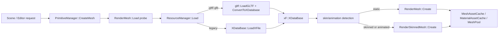
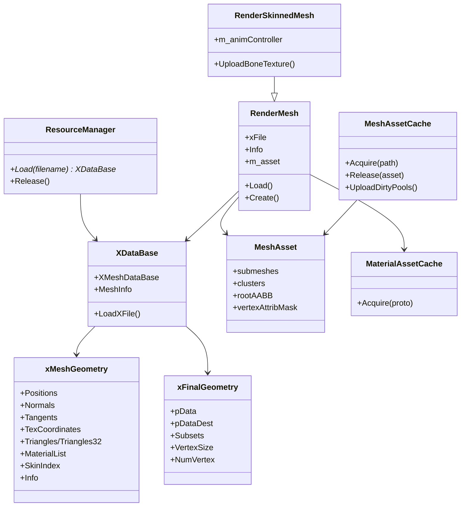
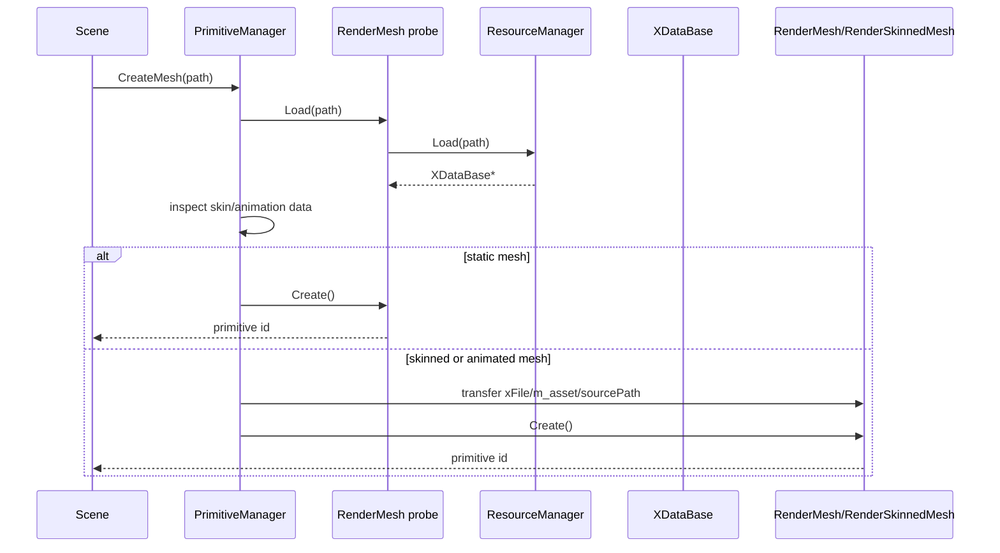
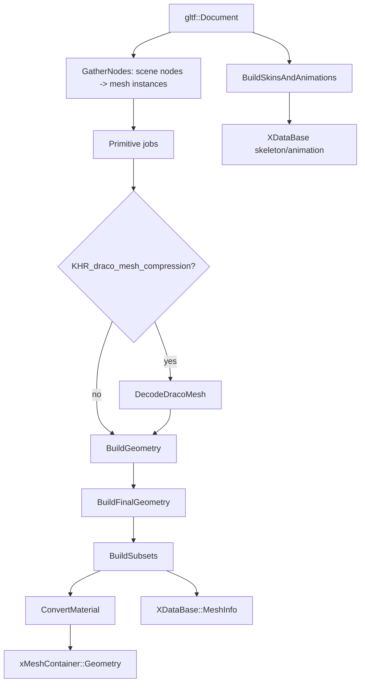
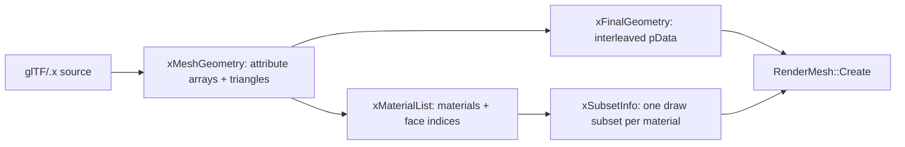
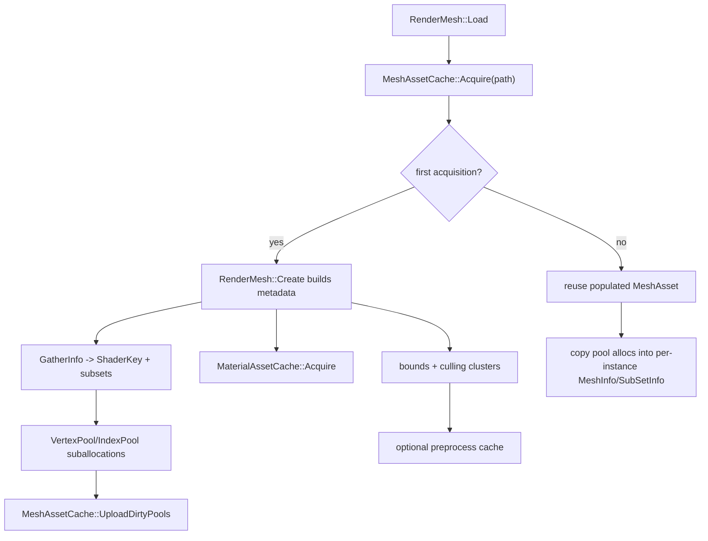
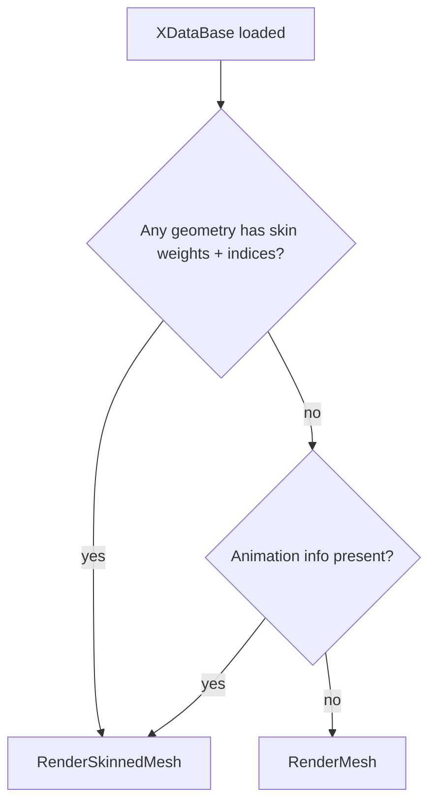

# Loading Geometry

Status: Stage 2 draft.

This document explains how T850 loads mesh assets, converts them into the engine's internal geometry format, creates material/shader metadata, uploads vertex/index data, and decides whether a mesh is rendered by `RenderMesh` or `RenderSkinnedMesh`.

Related documents:

- [Main architecture](../architecture/main-architecture.md)
- [Resource locator and cache paths](../architecture/resource-locator.md)
- [Dependency map](../dependency-map.md)
- [Shader management](../rendering/shader-management.md)
- [Textures, samplers, and IBL](../rendering/textures-and-ibl.md)
- [Geometry rendering flow](../rendering/geometry-rendering-flow.md)
- [Animation system](../animation/animation-system.md)
- [Scene format and runtime](../scenes/scene-format-and-runtime.md)

## Purpose and responsibilities

Geometry loading has three major responsibilities:

1. Convert source asset formats into a shared engine data model.
2. Build render-ready CPU metadata: interleaved vertices, subsets, shader keys, material records, bounds, culling clusters, and skin/animation data.
3. Upload or reference GPU resources through shared mesh/material caches so runtime draw code can bind VB/IB/material/shader state efficiently.

The current path is intentionally format-normalized: both modern glTF/GLB and legacy `.x` files feed into `xF::XDataBase`. Runtime renderers then consume `XDataBase` instead of knowing which file format was loaded.

## Key files and classes

| File/class | Role |
|---|---|
| `Framework/src/utils/ResourceManager.cpp` | File extension dispatch and resource reuse. `.gltf`/`.glb` use the glTF loader; all other mesh paths use `XDataBase::LoadXFile`. |
| `Framework/src/utils/gltf/GLTFLoader.cpp` | Parses `.gltf` JSON or `.glb`, resolves buffers, validates glTF 2.x documents and supported extensions. |
| `Framework/src/utils/gltf/GLTFMesh.cpp` | Converts glTF scene nodes/primitives into `xMeshGeometry` and `xFinalGeometry`; handles transforms, attributes, indices, tangents, Draco, skins, and animations. |
| `Framework/src/utils/gltf/GLTFMaterial.cpp` | Maps glTF PBR material data into `xMaterial::EffectInstance` defaults consumed later by `RenderMesh`. |
| `Framework/src/utils/XDataBase.cpp` and `Framework/include/utils/XDataBase.h` | Legacy `.x` parser plus internal intermediate mesh database. |
| `Framework/include/utils/xDefs.h` | Defines `xMeshGeometry`, `xFinalGeometry`, `xMaterial`, skeleton, animation, and subset structs. |
| `Framework/src/scene/PrimitiveManager.cpp` | Creates mesh primitives and selects `RenderMesh` versus `RenderSkinnedMesh`. |
| `Framework/src/scene/RenderMesh.cpp` | Static mesh runtime creation: shader-key gathering, texture loads, material cache acquisition, VB/IB pool allocation, culling metadata, wireframe buffers. |
| `Framework/src/scene/RenderSkinnedMesh.cpp` | Skinned mesh creation: animation controller, bone texture upload, skinned shader/wireframe/skeleton setup. |
| `Framework/include/scene/MeshAsset.h` | Shared mesh metadata: submeshes, vertex/index counts, bounds, culling clusters, pool allocations. |
| `Framework/src/scene/MeshAssetCache.cpp` | Path-keyed mesh cache and mesh preprocess cache for culling metadata. |
| `Framework/src/scene/MeshPool.cpp` | Shared vertex/index GPU buffer pools. |
| `Framework/include/scene/MaterialAsset.h` and `Framework/src/scene/MaterialAssetCache.cpp` | Deduplicated material parameter/texture records. |
| `T8ditor/EditorMesh.cpp` | Editor wireframe/picking import path. Uses the same glTF or `.x` conversion into `XDataBase`, then builds editor line geometry. |

## Runtime ownership and lifetime

Important lifetime rules:

- `ResourceManager` owns loaded `XDataBase` instances and reuses them by exact filename string.
- `RenderMesh::Load()` stores a borrowed `xFile` pointer returned by `ResourceManager::Load()`.
- `RenderMesh::Load()` also acquires a path-keyed `MeshAsset` from `MeshAssetCache`; `RenderMesh::Destroy()` releases it.
- `MeshAsset` owns shared metadata only. GPU pool buffers live on `MeshAssetCache`, not on one `RenderMesh` instance.
- `MaterialAssetCache::Acquire()` deduplicates immutable material parameter/texture records. `SubSetInfo` stores a borrowed `MaterialAsset*`.
- `RenderMesh::Info` and `SubSetInfo` remain per-instance because they contain per-instance constant buffers and draw-time state.

## Entry points

### Runtime scene path

Typical runtime scenes create meshes through the primitive manager:

`PrimitiveManager::CreateMesh()` first creates a temporary `RenderMesh` probe and calls `Load()`. It inspects the loaded `XDataBase` for:

- `HAS_SKINWEIGHTS0` and `HAS_SKININDEXES0` on any `xMeshGeometry`.
- animation info in `xMeshContainer::Animation`.

If either condition is true, the primitive becomes `RenderSkinnedMesh`; otherwise the probe itself becomes the final static `RenderMesh`.

### Editor mesh preview path

`T8ditor/EditorMesh.cpp` loads files independently for editor wireframe display and picking:

- `.gltf`/`.glb`: `gltf::LoadGLTF()` then `gltf::ConvertToXDatabase()`.
- Other extensions: `XDataBase::LoadXFile()`.
- It then walks `XMeshDataBase[*]->Geometry`, copies positions to a single position-only vertex buffer, and converts every triangle into three line segments for wireframe display.

This path does not create runtime materials, mesh pools, or shader permutations. It is an editor inspection path that shares only the import/conversion stage.

## Format loading

### glTF / GLB

`ResourceManager::Load()` chooses the glTF path when the filename extension is `gltf` or `glb`.

`gltf::LoadGLTF()` performs:

1. Read file bytes.
2. Sniff JSON glTF versus binary GLB.
3. Parse JSON into `gltf::Document`.
4. Check required extensions against the supported extension list.
5. Rebase GLB buffer views when binary buffer data is embedded.
6. Resolve external, data URI, or GLB buffers.
7. Validate glTF 2.x buffers, accessors, meshes, materials, textures, images, and animations.

`gltf::ConvertToXDatabase()` then performs the engine-specific conversion:

1. Pick the active glTF scene if provided; otherwise use scene 0; otherwise use every node with a mesh.
2. Traverse nodes recursively and compute world matrices using the engine convention `world = local * parent`.
3. Create a build job per mesh primitive instance.
4. Decode Draco-compressed primitives up front when `KHR_draco_mesh_compression` is present.
5. Build primitive geometry, optionally in parallel through `g_threadPool`.
6. Build interleaved `xFinalGeometry` and material subsets.
7. Convert glTF material data into one `xMaterial` per primitive.
8. Build skins and animations when the document contains skins or animation clips.

#### glTF attributes

`BuildGeometry()` reads these glTF attributes when present:

| glTF attribute | Engine storage | Notes |
|---|---|---|
| `POSITION` | `xMeshGeometry::Positions` | Required. Transformed by node world matrix for static meshes. |
| `NORMAL` | `Normals` | Generated as flat normals if missing. |
| `TANGENT` | `Tangents` and generated `Binormals` | If missing and normals/UV0 exist, MikkTSpace tangents are generated; naive tangents are fallback. |
| `TEXCOORD_0..3` | `TexCoordinates[0..3]` | Up to four UV channels. |
| `COLOR_0` | `VertexColors` | Read into geometry, but later render layout support should be verified before relying on it. |
| `JOINTS_0` | `SkinIndices` | Stored as four floats in a vec4 slot. |
| `WEIGHTS_0` | `SkinWeights` | Stored as four floats in a vec4 slot. |

The converter sets `xMeshGeometry::VertexAttributes` bits such as `HAS_POSITION`, `HAS_NORMAL`, `HAS_TANGENT`, `HAS_BINORMAL`, `HAS_TEXCOORD0`, `HAS_SKININDEXES0`, and `HAS_SKINWEIGHTS0`. These bits later become `ShaderKey` vertex attribute bits in `RenderMesh::GatherInfo()`.

Skinned vertex positions remain in local/bind space. Static mesh vertices are transformed by the glTF node world matrix during conversion. This distinction matters: runtime skinning applies inverse-bind and bone transforms, so pre-baking skinned vertex positions by node world transform would double-transform the mesh.

### Legacy `.x`

Every non-glTF extension currently uses `XDataBase::LoadXFile()`.

The `.x` path:

1. Reads the asset through `ResourceLocator::ReadBinary()`.
2. Parses the `.x` template stream into `XMeshDataBase`.
3. Calls `XDataBase::CreateSubSets()`.
4. Produces `xMeshGeometry` plus interleaved `xFinalGeometry` entries in `MeshInfo`.

`CreateSubSets()` computes the interleaved vertex stride from `VertexAttributes`, copies attribute arrays into `xFinalGeometry::pData`, mirrors the same data into `pDataDest`, and creates one `xSubsetInfo` per material by counting `MaterialList.FaceIndices`.

The legacy path is still important because it defines the renderer-facing data layout that glTF conversion mirrors.

## `XDataBase` as the intermediate format

`XDataBase` is the compatibility boundary between importers and renderers. Importers fill it; `RenderMesh` and `RenderSkinnedMesh` consume it.

The important structures are:

| Structure | Meaning |
|---|---|
| `xF::XDataBase` | Loaded mesh database. Main fields are `XMeshDataBase` and `MeshInfo`. |
| `xF::xMeshContainer` | Container holding `Geometry`, `Skeleton`, `SkeletonAnimated`, and `Animation`. |
| `xF::xMeshGeometry` | Source-style geometry arrays: positions, normals, tangents, UVs, skin weights/indices, triangles, materials, and per-geometry skin metadata. |
| `xF::xFinalGeometry` | Renderer-friendly interleaved vertex data (`pData`/`pDataDest`), vertex stride, vertex count, and material subsets. |
| `xF::xMaterialList` | Material array plus one face-material index per triangle. |
| `xF::xSubsetInfo` | One subset per material; stores triangle count, vertex count, vertex start, triangle start, and vertex size. |

### Vertex layout

The interleaved runtime vertex order is deterministic and driven by `VertexAttributes`:

1. Position as `float4`.
2. Normal as `float4`.
3. Tangent as `float4`.
4. Binormal as `float4`.
5. UV0 as `float2`.
6. UV1 as `float2`.
7. UV2 as `float2`.
8. UV3 as `float2`.
9. Skin indices as `float4` for glTF/skinned geometry.
10. Skin weights as `float4` for glTF/skinned geometry.

`xFinalGeometry::VertexSize` is byte stride, not float count. Most of the renderer computes `floatsPerVertex = VertexSize / sizeof(float)`.

## Index buffers

glTF conversion preserves the narrowest index width that can represent the primitive:

- If every triangle index fits in 16 bits, `xMeshGeometry::Triangles` is used and `Indices32Bit = false`.
- If any index is above `65535`, `xMeshGeometry::Triangles32` is used and `Indices32Bit = true`.

`RenderMesh::Create()` checks `pActual->Indices32Bit` per geometry and suballocates each material subset into either a 16-bit or 32-bit `IndexPool`.

Winding can be changed by `CHANGE_TO_RH` / left-right-handed conversion code. When conversion flips Z to the engine coordinate convention, triangle winding is reversed so face orientation remains correct.

## Materials and textures

The glTF material converter intentionally maps glTF PBR material fields into the older `xMaterial::EffectInstance.pDefaults` mechanism, because `RenderMesh::Create()` already understands those string/float/dword defaults.

Common mappings include:

| glTF source | Engine effect default |
|---|---|
| `pbrMetallicRoughness.baseColorFactor` | `diffuseColor` |
| `baseColorTexture` | `diffuseMap` |
| `metallicFactor` | `pbrMetallic` |
| `roughnessFactor` | `pbrRoughness` |
| `metallicRoughnessTexture` | `metallicMap` |
| `normalTexture` | `normalMap` plus `normalScale` |
| `occlusionTexture` | `occlusionMap` plus `occlusionStrength` |
| `emissiveTexture` / `emissiveFactor` | `emissiveMap` / `emissiveColor` |
| `alphaMode` / `alphaCutoff` | `alphaMode` / `alphaCutoff` |
| `doubleSided` | `doubleSided` |
| `KHR_texture_transform` | per-slot UV transform defaults |
| material extensions such as sheen, clearcoat, transmission, specular, ior | corresponding material defaults and texture slots where supported |

`RenderMesh::GatherInfo()` converts material/attribute defaults into `ShaderKey` bits. For example, diffuse/specular/gloss/normal/height/metallic/emissive/occlusion/specular/transmission/lightmap maps set feature bits. It then pre-creates shader variants for forward, GBuffer, shadow map, and radial-depth passes, plus parallax variants when a height map is present.

`RenderMesh::Create()` loads textures from material string defaults via `LoadTex()` and copies the fully-populated `SubSetInfo` material state into a `MaterialAsset` prototype. `MaterialAssetCache::Acquire()` deduplicates that prototype and stores a borrowed pointer on the subset.

Texture path handling uses `RemovePath()` before loading, so material texture names are expected to resolve through the engine's normal asset/resource lookup paths rather than arbitrary external file paths.

## Mesh cache, preprocess cache, and GPU upload

`MeshAssetCache` is keyed by normalized source path. On the first acquisition of a path, `RenderMesh::Create()` populates the shared `MeshAsset`; later acquisitions reuse its submesh metadata and pool allocations.

### Mesh pools

`VertexPool` and `IndexPool` are shared buffer owners:

- `VertexPool` is grouped by vertex format hash and vertex stride.
- `IndexPool` is grouped by index width: 16-bit or 32-bit.
- `Suballocate()` appends CPU staging data and returns an element offset.
- `EnsureUploaded()` recreates the GPU buffer from staging data only when dirty.
- `GetGPUBuffer()` logs an error and returns null if a dirty pool is accessed before `UploadDirtyPools()`.

`RenderMesh::Create()` writes the pool ids, element offsets, and element counts into `Submesh::vbAlloc` / `Submesh::ibAlloc`, then mirrors those allocations into per-instance `MeshInfo::vbPoolAlloc` and `SubSetInfo::ibPoolAlloc`.

### Culling metadata

`MeshAsset` stores:

- root AABB,
- per-submesh AABB,
- submesh index ranges,
- optional `SubmeshCluster` ranges for finer culling.

When `Config::cullingLoadMode == FullOnLoad`, `RenderMesh::Create()` can load a mesh preprocess cache from disk. If the cache is stale, invalid, or topology-mismatched, culling metadata is rebuilt and can be saved back through `MeshAssetCache::SavePreprocessCache()`.

The preprocess cache is validated against:

- source file size and write time,
- cache version/header,
- culling clustering settings,
- vertex/index/submesh/cluster counts,
- topology hash and range validity.

## Static versus skinned meshes

`PrimitiveManager::CreateMesh()` uses loaded data inspection to choose renderer type:

Skinned rendering adds:

- `AnimationController` initialization from `xMeshContainer::Animation`, `Skeleton`, and `SkeletonAnimated`.
- skin-weight handoff from the first geometry with `xSkinInfo::SkinWeights`.
- per-frame animation update when playing.
- bone matrix upload through a float texture.
- skinned shader key bits and skinned wireframe/skeleton debug buffers.

The bone texture upload path clamps to the texture's bone capacity and logs errors when context, storage, or matrices are invalid.

## Editor/runtime differences

| Area | Runtime `RenderMesh` / `RenderSkinnedMesh` | T8ditor `EditorMesh` |
|---|---|---|
| Import | `ResourceManager` -> `XDataBase` | Direct glTF/`.x` -> temporary `XDataBase` |
| Materials | Fully loaded, shader-keyed, deduplicated in `MaterialAssetCache` | Ignored for wireframe preview |
| GPU data | Shared mesh pools, constant buffers, material textures, wireframe buffers | Single position buffer plus line-list index buffer |
| Picking | Runtime render picking uses engine/editor scene data | Editor mesh preview keeps CPU pick vertices/indices |
| Skins/animations | Can select `RenderSkinnedMesh` | Mesh preview treats imported geometry as static line geometry |

## Extension points

Use these entry points when extending geometry loading:

- Add a new source format by dispatching in `ResourceManager::Load()` and converting into `XDataBase`.
- Add a new glTF attribute in `GLTFMesh.cpp`, then update `xMeshGeometry`, `BuildFinalGeometry()`, `RenderMesh::GatherInfo()`, shader input layouts, and shader code.
- Add a new material feature by mapping glTF data in `GLTFMaterial.cpp`, adding `SubSetInfo`/`MaterialParams` fields if needed, setting a `ShaderKey` bit in `GatherInfo()`, and updating shader permutations.
- Add a new texture slot by extending `MatTexSlot`, `MaterialAsset`, `RenderMesh::Create()` material copy, shader binding, and material converter.
- Improve culling by extending `SubmeshCluster` creation and the preprocess cache version/validation.

## Known limitations and gotchas

- `ResourceManager` reuses resources by exact filename string, so inconsistent relative paths can bypass reuse.
- `XDataBase` remains the central intermediate even for glTF; new loaders should target it or deliberately replace the whole downstream path.
- glTF vertex colors are imported into `xMeshGeometry`, but the runtime interleaved glTF layout path does not currently add a vertex-color slot in `BuildFinalGeometry()`. Treat vertex-color rendering as a gap unless verified in the shader/render path.
- Legacy `.x` indices are 16-bit. glTF supports 32-bit indices through `Triangles32`.
- `RenderMesh::GatherInfo()` pre-creates many shader variants during mesh creation; adding feature bits increases permutation pressure.
- Texture names are normalized to basename-style lookup via `RemovePath()`. Embedded/external glTF image handling must produce names the engine can resolve.
- Skinned geometry stays in local/bind space, while static glTF geometry is world-baked during conversion.
- Mesh pool GPU buffers must be uploaded before draw-time access. A dirty pool logs an error and returns null.

## Debugging checklist

When a mesh does not appear or renders incorrectly:

1. Check the log for `Failed to load`, `[glTF]`, `[RenderMesh]`, `[MeshAssetCache]`, `[MeshPool]`, and texture-not-found messages.
2. Confirm the path resolves through `ResourceLocator` and uses the same normalized path everywhere.
3. For glTF, verify `asset.version` is 2.x and required extensions are supported.
4. Confirm the importer produced at least one `xMeshContainer::Geometry` entry and one `XDataBase::MeshInfo` entry.
5. Check `xMeshGeometry::VertexAttributes` and `xFinalGeometry::VertexSize` match the expected shader input layout.
6. For large meshes, verify `Indices32Bit` is set and draw code is using 32-bit index pools.
7. For missing normal maps or wrong lighting, inspect material defaults and `ShaderKey` feature bits.
8. For missing textures, check whether the engine is stripping paths and resolving the basename from the expected asset directory.
9. For static/skinned mismatch, inspect `HAS_SKINWEIGHTS0`, `HAS_SKININDEXES0`, and `xMeshContainer::Animation`.
10. For culling/pop-in, temporarily disable fine culling or rebuild the mesh preprocess cache.
