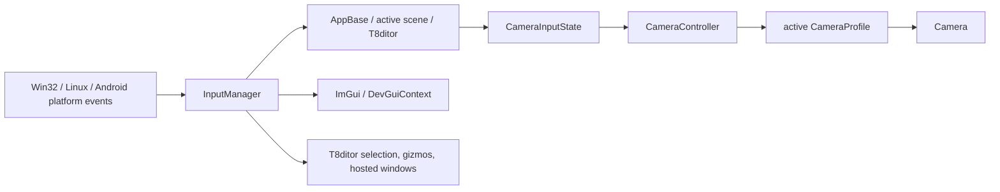
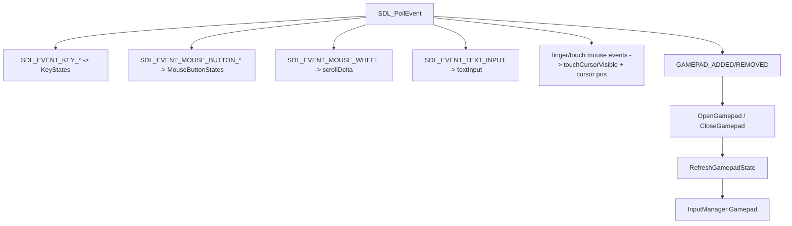
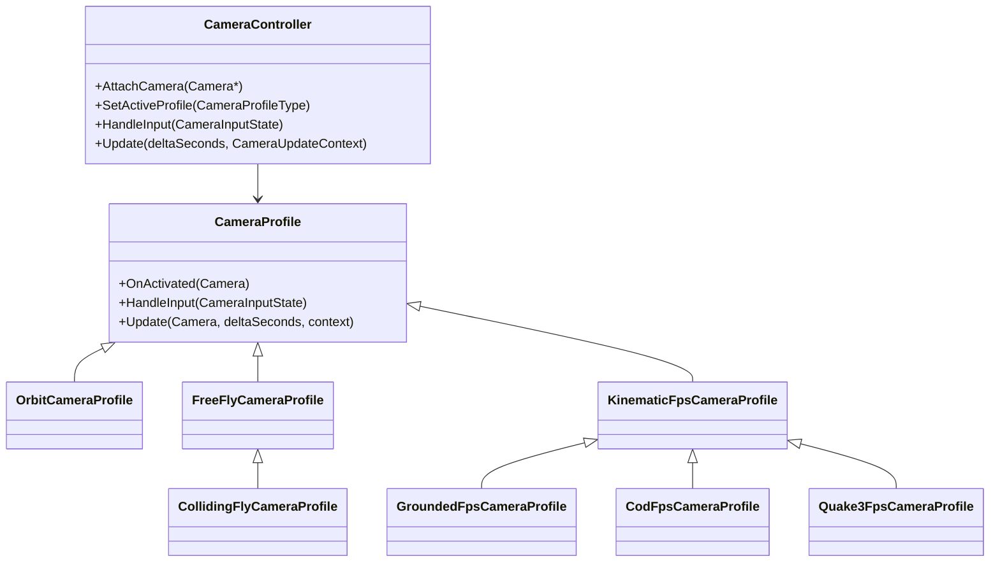
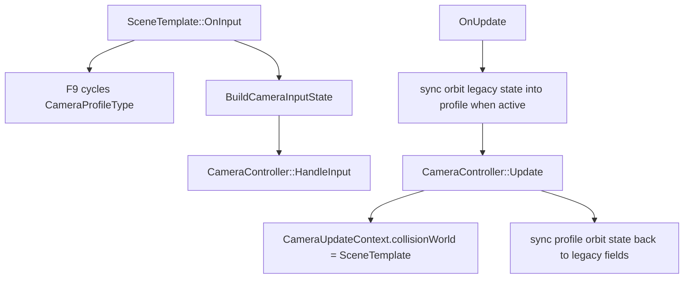

# Camera and Controls

Status: Stage 15 draft.

This document explains T850's input state, platform input translation, gamepad and handheld paths, runtime camera profiles, editor camera routing, hosted window input behavior, and Android virtual controls.

Related documents:

- [Main architecture](../architecture/main-architecture.md)
- [Platform event loop](../architecture/platform-event-loop.md)
- [FrameworkImGui runtime UI](../editor/imgui-system.md)
- [Dependency map](../dependency-map.md)
- [Scene format and runtime](../scenes/scene-format-and-runtime.md)
- [Editor overview](../editor/editor-overview.md)
- [Jolt physics](../physics/jolt-physics.md)

## Purpose and responsibilities

Input and camera control are split into three layers:

1. Platform code translates SDL or Android events into `AppBase::IManager`.
2. Scene/editor code converts `InputManager` into intent such as `CameraInputState`, editor selection, UI navigation, or hosted scene input.
3. `CameraController` applies the active camera profile to a `Camera`.

## Key files and classes

| File/class | Role |
|---|---|
| `Framework/include/utils/InputManager.h` | Shared keyboard, mouse, text, touch-cursor, and gamepad state. |
| `Framework/src/utils/InputManager.cpp` | One-shot key/button helpers, gamepad activity detection, and press consumption. |
| `Framework/src/core/windows/Win32Framework.cpp` | SDL3 keyboard/mouse/text/wheel/gamepad/touch events, Windows handheld detection, relative mouse mode. |
| `Framework/src/core/LinuxFramework.cpp` | SDL3 keyboard/mouse/text/wheel/gamepad events, Steam Deck detection, Vulkan-only Linux loop. |
| `Framework/src/core/android/AndroidFramework.cpp` | NativeActivity motion/key input, app-first Android event routing, touch-to-mouse fallback, pinch-to-scroll, back-key behavior. |
| `Framework/include/utils/CameraProfiles.h` | `CameraProfileType`, `CameraInputState`, profile classes, and `CameraController`. |
| `Framework/src/utils/CameraProfiles.cpp` | Runtime profile behavior, gamepad-to-camera mapping, collision fly, FPS controller updates. |
| `Framework/include/physics/CharacterController.h` / `Framework/src/physics/CharacterController.cpp` | Kinematic FPS and Quake 3-style movement implementation used by camera profiles. |
| `Framework/include/utils/HandheldControllerOverlay.h` | ImGui gamepad navigation submission and handheld footer/help overlay drawing. |
| `DayScene/Application.cpp` | Runtime GUI visibility, relative mouse requests, handheld overlay drawing, Android input dispatch to scenes. |
| `DayScene/SceneTemplate.cpp` | `CameraController` use, camera profile UI/F9 cycling, Android virtual controls, scene-state profile persistence. |
| `DayScene/Quake3Mock.cpp` and `DayScene/SandboxScene.cpp` | Older scene variants with the same camera controller/input shape as SceneTemplate. |
| `T8ditor/EditorCamera.*` | Editor orbit/pan/zoom camera for the main viewport. |
| `T8ditor/EditorApp.cpp` | Editor input routing, orbit/free camera mode, hosted Play/Mesh scene input forwarding. |
| `T8ditor/HostedViewportPanel.*` | Hosted viewport image rect and input-active tracking for Play Scene, Mesh Edit, and Ragdoll Edit windows. |

## InputManager state model

`InputManager` is owned by `AppBase` as `IManager`. Platform frameworks write into it once per frame; apps, scenes, editor tools, and ImGui integration read from it.

Important fields:

| Field | Meaning |
|---|---|
| `KeyStates[2][MAXKEYS]` | Current keyboard state plus one-shot latch state. |
| `MouseButtonStates[2][MAXMOUSEBUTTONS]` | Current mouse button state plus one-shot latch state. SDL button 1 maps to index 0. |
| `Gamepad` | Current normalized gamepad state and edge-triggered button presses. |
| `xDelta`, `yDelta` | Mouse/look delta accumulated for the current frame. |
| `mouseX`, `mouseY` | Window/client or viewport-local mouse coordinates, depending on caller routing. |
| `scrollDelta` | Mouse wheel or pinch scroll amount for the current frame. |
| `touchCursorVisible` | Set when touch events should make the cursor visible. |
| `textInput` | UTF-8 text collected from SDL text input during the last frame. |

Helper behavior:

- `PressedKey(key)` and `PressedMouseButton(button)` read current state.
- `PressedOnceKey(key)` and `PressedOnceMouseButton(button)` return true only once while held by setting the latch array.
- Key/button release clears both current and one-shot latch state.
- `HasGamepadInput()` returns true only when a connected/enabled gamepad has active sticks, triggers, buttons, shoulders, or d-pad input.
- `ConsumeGamepadStartPress()` and `ConsumeGamepadEastPress()` clear the corresponding edge-trigger flag after use.

The key enum is named `STDKEYS`. SDL3 ASCII keycodes map directly for values below 128; extended keys use `SDL3KeyToSTDKEY()`.

## GamepadInputState

`GamepadInputState` stores normalized state, not raw SDL values.

| Group | Fields |
|---|---|
| Device | `connected`, `enabled`, `handheldDevice`, `name`, `handheldReason` |
| Axes | `leftX`, `leftY`, `rightX`, `rightY` in `[-1, 1]` after deadzone |
| Triggers | `leftTrigger`, `rightTrigger` in `[0, 1]` after deadzone |
| Held buttons | south/east/west/north, back, guide, start, stick clicks, shoulders, d-pad |
| Pressed edges | `*Pressed` variants computed from current vs previous frame |

Button naming follows Xbox-style SDL gamepad layout:

- south = A,
- east = B,
- west = X,
- north = Y,
- back = View,
- start = Menu/Start.

## Platform translation

### Windows

`Win32Framework` uses SDL3 for keyboard, mouse, text, wheel, window, and gamepad events. It also uses Win32 APIs for HWND lookup, cursor confinement, global cursor position, and registry-based handheld detection.

Important Windows behavior:

- `SDL_Init(SDL_INIT_VIDEO | SDL_INIT_GAMEPAD)` enables gamepads.
- `DetectWindowsHandheldReason()` checks BIOS/board registry strings for ROG Ally, Legion Go, Steam Deck, MSI Claw, AYANEO, ONEXPLAYER, GPD, and AOKZOE-style devices.
- `RefreshGamepadState()` normalizes axes with deadzones, triggers with trigger deadzones, and updates held/pressed flags.
- Pressing gamepad View/Back requests app close in the framework.
- Window focus/resize events reset mouse deltas and button state to avoid stale drags.
- `UpdateMouseMode()` enables SDL relative mouse mode and hides the cursor when `AppBase::WantsRelativeMouseMode()` is true.
- In relative mode, `xDelta`/`yDelta` come from `SDL_GetRelativeMouseState()`.
- Outside relative mode, deltas are computed from absolute cursor movement.

### Linux and Steam Deck

`LinuxFramework` is Vulkan-only and uses SDL3 for the same key/mouse/text/wheel/gamepad event categories.

Linux-specific behavior:

- Steam Deck detection reads DMI product/board/vendor strings from `/sys/devices/virtual/dmi/id/*`.
- `SDL_EVENT_MOUSE_MOTION` contributes `xrel`/`yrel` to `xDelta`/`yDelta`.
- `SDL_GetMouseState()` refreshes `mouseX`/`mouseY` after the event loop.
- Window resize/pixel-size events update the app dimensions, reset input, and resize the Vulkan swapchain.
- Gamepad add/remove/open/refresh mirrors the Windows path.
- Pressing gamepad View/Back is logged; app close behavior is not currently forced here.

### Android

`AndroidFramework` is Vulkan-only and receives native activity input events.

Input routing is app-first:

1. `AndroidFramework::OnInputEvent()` calls `AppBase::HandleAndroidInputEvent(event)`.
2. If the app/scene handles a motion event, the framework clears generic touch state and stops.
3. Otherwise the framework maps touch input to mouse-like state.
4. Back key maps to Escape/close behavior unless the app consumed it.

Generic Android touch fallback:

- one finger down sets left mouse button and position;
- one finger move updates `xDelta`/`yDelta`;
- two fingers activate pinch mode;
- pinch distance changes become `scrollDelta`;
- pointer up/cancel clears touch state and left mouse button.

`ResetTransientInput()` clears mouse delta and scroll after each rendered frame. `ClearTouchState()` also clears left mouse button state.

## Runtime app and ImGui routing

`DayScene/Application.cpp` owns runtime ImGui visibility and high-level input policy.

Desktop runtime behavior:

- `WantsRelativeMouseMode()` returns true when ImGui is ready, the runtime GUI is hidden, and no modal text/keyboard input is active.
- Runtime GUI calls `SubmitRuntimeGamepadGuiInput()` before drawing panels.
- When GUI is visible, `DrawHandheldGuiFooter()` draws controller hints.
- `DrawHandheldControllerHelpOverlay()` draws the hold-RT mapping overlay whenever a gamepad is connected and enabled.

Android runtime behavior:

- Back closes the ImGui overlay first when the overlay is visible.
- When ImGui is hidden, Android motion events are offered to the active scene's virtual controls.
- If a scene did not handle the touch as virtual controls, the app can register a tap to reopen the Android GUI.
- Android virtual controls are drawn by the active scene before ImGui draw data is rendered as a pre-present overlay.

## Handheld controller overlay and ImGui navigation

`HandheldControllerOverlay.h` is header-only and provides three groups of helpers:

| Helper | Role |
|---|---|
| `SubmitGamepadGuiNavigation(gamepad, guiVisible)` | Submits full ImGui gamepad key/analog events: start/back/face buttons/triggers/sticks/d-pad. |
| `SubmitGamepadGuiDirectionalNavigation(gamepad, guiVisible)` | Submits a smaller navigation set: A, d-pad, and left-stick direction. |
| `DrawHandheldControllerHelpOverlay(gamepad)` | Draws a centered controller mapping overlay while RT is held. |
| `DrawHandheldGuiFooter(gamepad)` | Draws footer hints while runtime GUI is visible. |

Both submit helpers set `ImGuiConfigFlags_NavEnableGamepad`. They set or clear `ImGuiBackendFlags_HasGamepad` based on whether the gamepad is connected and enabled. They only submit active input when `guiVisible` is true.

## Camera input state

Scenes and editor free-fly mode convert `InputManager` into `CameraInputState`.

| Field group | Meaning |
|---|---|
| Movement booleans | `moveForward`, `moveBackward`, `moveLeft`, `moveRight`, `moveUp`, `moveDown` |
| Movement analogs | `moveForwardAmount`, `moveRightAmount` |
| Character actions | `jump`, `crouch`, `sprint` |
| Look/orbit modes | `mouseLook`, `orbitRotate`, `orbitPan`, `orbitZoom` |
| Deltas | `mouseDeltaX`, `mouseDeltaY`, `scrollDelta` |

`ApplyGamepadToCameraInput()` maps gamepad state into this structure:

- left stick controls forward/right movement;
- A/south sets `jump`;
- B/east sets `crouch`;
- left stick click sets `sprint`;
- right stick becomes look deltas when look is allowed.

The right-stick look mapping is expressed as mouse-like deltas scaled by frame time, so existing mouse look paths are reused.

## CameraController and profiles

`CameraController` owns one instance of each profile and applies the active profile to an attached `Camera`.

Available profile names:

| Type | Name | Behavior |
|---|---|---|
| `Orbit` | `Orbit` | Spherical camera around a target with pan, zoom, yaw, pitch, distance, and model radius. |
| `FreeFly` | `Free Fly` | Mouse-look camera with free XYZ movement. |
| `CollidingFly` | `Colliding Fly` | Free-fly movement clipped by capsule sweeps against `CameraCollisionWorld`. |
| `GroundedFps` | `Grounded FPS` | Kinematic character FPS movement with default T850 settings. |
| `CodFps` | `COD FPS` | Kinematic FPS tuned for faster grounded movement, higher acceleration, stronger friction, and lower jump speed. |
| `Quake3Fps` | `Quake 3 FPS` | Quake 3-style kinematic movement using box collision and Quake-scaled speed/gravity/jump values. |

## Profile behavior details

### Orbit

`OrbitCameraProfile` stores `OrbitCameraState`:

- `target`,
- `panOffset`,
- `yaw`,
- `pitch`,
- `distance`,
- `modelRadius`.

Runtime input conventions from `SceneTemplate::BuildCameraInputState()`:

- left mouse drag rotates;
- middle mouse drag pans;
- right mouse drag zooms by vertical mouse delta;
- scroll wheel zooms;
- F9 can cycle out of Orbit to another profile.

T8ditor's main `EditorCamera` has a separate orbit implementation and different editor-oriented conventions:

- middle drag pans;
- right drag or Alt+left drag orbits;
- wheel and `+`/`-` zoom;
- arrow keys orbit;
- `F` frames the target.

### Free Fly and Colliding Fly

`FreeFlyCameraProfile` applies mouse look, then moves along camera look/right/up:

- W/S and analog forward control forward/back;
- A/D and analog right control strafe;
- Q/E control up/down;
- Shift/left stick click selects sprint speed;
- default walk/sprint speeds are 10/20.

`CollidingFlyCameraProfile` reuses free fly but enables capsule sliding through `CameraUpdateContext::collisionWorld`; its walk/sprint speeds are 8/16 and capsule radius/half-height are 0.35/0.55.

### Grounded FPS, COD FPS, and Quake 3 FPS

`KinematicFpsCameraProfile` wraps `KinematicCharacterController`.

Shared behavior:

- mouse look updates camera yaw/pitch;
- input is flattened onto camera forward/right vectors;
- collision uses `CharacterCollisionWorld` sweeps when supplied;
- no collision world means movement is allowed and the controller treats itself as grounded.

`GroundedFpsCameraProfile` uses default `KinematicCharacterSettings`:

- capsule collision,
- walk speed 8,
- sprint speed 10,
- gravity 18,
- jump speed 5,
- eye height 1.6.

`CodFpsCameraProfile` customizes the defaults:

- walk speed 7,
- sprint speed 11,
- ground acceleration 45,
- air acceleration 1.5,
- friction 12,
- stop speed 2.5,
- jump speed 4.3,
- gravity 20.

`Quake3FpsCameraProfile` uses `MakeQuake3CharacterSettings()`:

- box collision,
- Quake units scaled by `1 / 32`,
- walk speed 320 Quake units,
- gravity 800 Quake units,
- jump speed 270 Quake units,
- no sprint,
- Quake-style update path through `UpdateQuake3()`.

## SceneTemplate runtime flow

`SceneTemplate` is the long-term runtime target for editor-authored `.t8scene` files and is the cleanest current camera-profile integration point.

Initialization:

1. `m_cameraController.AttachCamera(&Cam)`.
2. Default profile selection is Orbit.
3. Android virtual controls are reset.
4. Orbit state is synced from legacy sandbox orbit variables.
5. `SetCameraProfile(Orbit)` activates the profile.

Scene-load behavior:

- If the loaded scene has authored cameras, SceneTemplate applies the selected camera pose.
- If no scene camera is available in the Quake/SceneTemplate fallback path, it switches to `Quake3Fps`.
- Runtime profile settings can be overridden from scene profile/player settings before `SetCameraProfile(profileType)`.

Update/input behavior:

`BuildCameraInputState()` maps:

- W/S/A/D to move,
- Q/E to vertical move for fly profiles,
- Space to jump,
- Ctrl to crouch,
- Shift to sprint,
- mouse deltas and scroll,
- ImGui mouse capture gates,
- gamepad through `ApplyGamepadToCameraInput()`,
- Android virtual sticks/buttons when visible.

Profile selection is exposed in the runtime dev GUI through a `SelectorDesc` named `camera_profile`, and the UI text explicitly says F9 cycles profiles.

SceneTemplate saves the active camera profile index into sandbox save state as `SandboxCameraDesc::profile`, along with camera pose and orbit state. `.t8scene` camera entries (`SceneCameraDesc`) currently store camera pose/projection data, not a camera profile field.

## Quake3Mock and SandboxScene

`Quake3Mock` and `SandboxScene` still carry older copies of the same camera-profile pattern:

- default Orbit setup;
- Quake/default model paths can switch to `Quake3Fps` or `FreeFly`;
- F9 profile cycling;
- dev-GUI camera profile selector;
- `BuildCameraInputState()` mapping similar to SceneTemplate;
- save-state persistence of active profile/pose/orbit state.

When changing camera profile behavior, update SceneTemplate first and audit these older scene variants for duplicated logic.

## Android virtual controls

Runtime scene virtual controls are implemented in SceneTemplate, SandboxScene, Quake3Mock, DayScene, and RagdollEditor variants.

SceneTemplate behavior:

- controls are visible only when an active camera exists and the active profile is not Orbit;
- motion events are handled only when runtime ImGui is hidden;
- a left virtual stick drives `m_androidMoveAxis`;
- a right virtual stick drives `m_androidLookAxis`;
- `JMP` drives jump, or upward movement for fly profiles;
- `RUN` drives sprint;
- controls draw as foreground ImGui circles over the rendered scene.

The Android app dispatch path calls the active scene's `HandleAndroidVirtualControls()` before generic framework touch handling. This prevents scene-control touches from also becoming mouse drags.

## T8ditor main viewport input

T8ditor has two main camera modes selected from the toolbar:

| Mode | Implementation | Behavior |
|---|---|---|
| Orbit | `EditorCamera` and active camera orbit helpers | Main authoring camera, framing, object selection, gizmos, active scene-camera orbit. |
| Free | `m_editorCameraController` forced to `FreeFly` | WASD/QE/Shift movement plus right-mouse look; can control the editor camera or selected authored camera/light camera. |

`EditorApp::OnInput()` reads ImGui capture flags first:

- `io.WantCaptureMouse` gates mouse orbit/pick/look;
- `io.WantCaptureKeyboard` gates toolbar camera hotkeys and selection input;
- `io.WantTextInput` gates text-sensitive shortcuts and free-fly movement.

Undo/redo shortcuts are still allowed after hierarchy selection as long as text input is not active. Delete works while panels have focus, but not while text input is active.

In free mode, the editor forces `m_editorCameraController` to `FreeFly`, attaches either the editor camera or the active authored camera/light camera, applies input, then syncs the authored camera/light camera back from the runtime camera.

## Hosted window routing

T8ditor hosted windows are modal from the application perspective:

- `IsModalActive()` returns true while Mesh Edit, Play Scene, or Ragdoll Edit is open/closing.
- Escape closes the active hosted window and clears mouse deltas.
- `WantsRelativeMouseMode()` returns true only for loaded Play Scene when its GUI is hidden.

`HostedRenderViewport` records the ImGui image rect and whether the viewport image is active. This is used to distinguish scene viewport input from panel input.

| Hosted window | Input behavior |
|---|---|
| Play Scene | Press `G` to show/hide runtime controls. When loaded, editor remaps mouse coordinates into the Play Scene viewport and calls `m_playScene->OnInput(&IManager)`. It sets `SetIgnoreImGuiMouseCaptureForInput()` when the mouse is over or actively interacting with the viewport. |
| Mesh Edit | Press `G` to show/hide controls. The editor remaps mouse coordinates into the Mesh Edit viewport and calls `m_meshEditorScene->OnInput(&IManager)`. |
| Ragdoll Edit | Modal hosted tool window. The viewport tracks active/hovered state through `HostedRenderViewport::InputActive()`, then the panel uses ImGui/tool interactions for ragdoll body/joint/bone editing rather than forwarding a whole runtime scene `OnInput()` path. |

This split matters because Play Scene and Mesh Edit host runtime scene controllers, while Ragdoll Edit is an editor tool surface with its own manipulation code.

## Extension rules

When adding a new platform input path:

1. Write only normalized state into `InputManager`.
2. Clear one-shot latch state on release.
3. Reset deltas/buttons on focus loss, resize, pause, or surface loss.
4. Keep text input separate from key state.
5. Preserve ImGui capture gates in app/editor code instead of hiding raw state from `InputManager`.

When adding a new camera profile:

1. Add the enum value before `Count`.
2. Update `CameraProfileName()`, `CameraProfileNames()`, and `CameraController` construction.
3. Define activation/reset behavior in `OnActivated()`.
4. Decide whether it needs `CameraUpdateContext::collisionWorld`.
5. Update SceneTemplate, duplicated scene variants, dev-GUI selectors, save-state profile handling, and this document.

When adding a hosted editor viewport:

1. Store the image rect through `HostedRenderViewport`.
2. Convert global/main viewport mouse coordinates to local scene coordinates before forwarding.
3. Set an explicit ImGui-capture override only when the mouse is over or actively dragging the scene viewport.
4. Clear input deltas when toggling GUI visibility or closing.

## Known limitations and gotchas

- SceneTemplate, SandboxScene, and Quake3Mock still duplicate substantial camera input/profile code.
- `.t8scene` camera descriptors do not directly store camera profile type; profile persistence currently lives in sandbox/runtime save state.
- Android virtual controls are per-scene duplicated and only appear for non-Orbit profiles.
- Windows uses relative mouse mode for runtime/play-scene style capture; Linux currently uses SDL motion deltas without the same app-level relative-mode branch.
- T8ditor has both `EditorCamera` orbit controls and Framework `CameraController` free-fly controls; changes to one do not automatically affect the other.
- Gamepad GUI navigation is submitted only by call sites that explicitly invoke the handheld helpers.

## Debugging checklist

1. If a key shortcut fires repeatedly, check whether the release path clears both `KeyStates[0]` and `KeyStates[1]`.
2. If mouse look jumps after resize/focus change, check `ResetInputAfterWindowStateChange()` or `ResetMouseDeltaBaseline()`.
3. If desktop runtime mouse look does not work, check `WantsRelativeMouseMode()` and whether the runtime GUI is visible.
4. If gamepad input is ignored, check `Gamepad.connected`, `Gamepad.enabled`, deadzone thresholds, and whether a gamepad was opened by SDL.
5. If handheld hints do not appear, check `DrawHandheldControllerHelpOverlay()` and `Gamepad.rightTrigger`.
6. If Android touch controls also move the mouse/camera, verify the app consumed the scene virtual-control event before framework fallback handling.
7. If a camera profile does not collide, confirm `CameraUpdateContext.collisionWorld` is supplied and the scene implements the sweep functions.
8. If hosted Play Scene/Mesh Edit input uses wrong coordinates, inspect `HostedRenderViewport` image rect and local coordinate conversion.
