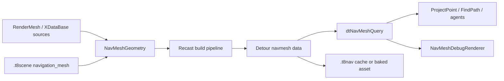
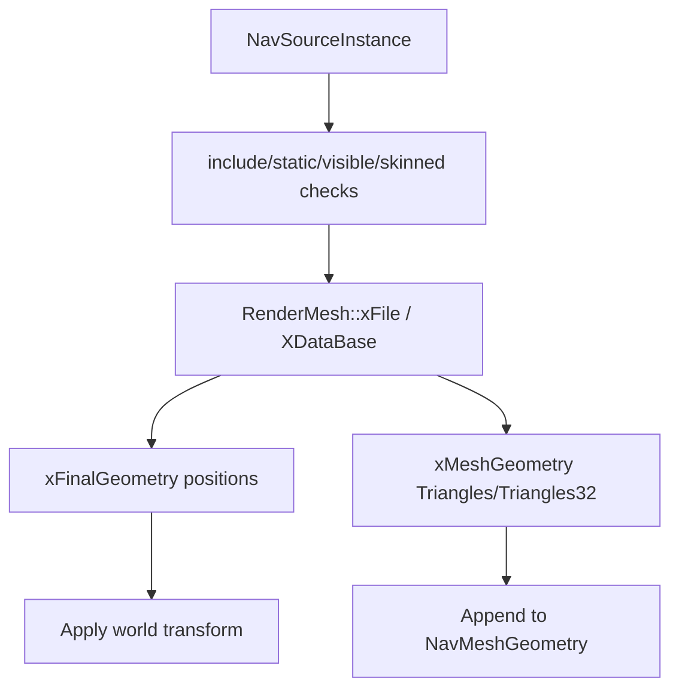
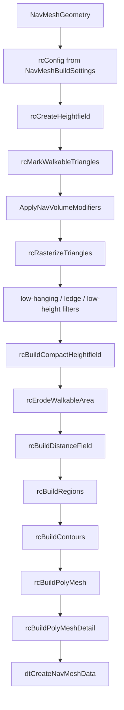

# NavMesh and Detour

Status: verified against source on 2026-08-19.

This document explains T850's navigation system: Recast build, Detour queries, navigation source geometry, authored volumes and links, area costs, automatic drop/jump links, `.t8nav` cache and baked assets, runtime SceneTemplate integration, editor authoring workflows, debug rendering, physics validation, limitations, and debugging.

Related documents:

- [Loading geometry](../geometry/loading-geometry.md)
- [Resource locator and cache paths](../architecture/resource-locator.md)
- [Dependency map](../dependency-map.md)
- [Render graph](../rendering/render-graph.md)
- [Jolt physics](../physics/jolt-physics.md)
- [Scene format and runtime](../scenes/scene-format-and-runtime.md)

## Purpose and responsibilities

Navigation builds a Detour queryable mesh from scene geometry and authoring metadata. Runtime and editor systems use it to project points, find paths, inspect source triangle classification, draw debug overlays, generate or author traversal links, and save baked assets.



## Key files and classes

| File/class | Role |
|---|---|
| `Framework/include/navigation/NavigationSystem.h` | Public navigation API: build settings, source geometry, volume modifiers, links, `NavMesh`, `NavigationWorld`, classification helpers. |
| `Framework/src/navigation/NavigationSystem.cpp` | Recast build, Detour initialization/query, cache/bake load/save, geometry extraction, volumes, off-mesh link generation. |
| `Framework/include/navigation/NavigationDebugRenderer.h` | Debug renderer API and shape modes. |
| `Framework/src/navigation/NavigationDebugRenderer.cpp` | Builds line buffers for navmesh geometry, nodes, graph edges, and off-mesh links. |
| `Framework/include/scene/EditorSceneFile.h` | `.t8scene` navigation schema: build settings, volumes, authored links, runtime mode, baked asset. |
| `DayScene/SceneTemplate.cpp` | Runtime scene load/build/cache/baked NavMesh flow, physics validation, test agents, debug overlay. |
| `T8ditor/EditorApp.cpp` | Editor NavMesh authoring state, build/regenerate, triangle classification, volumes/links, bake asset UI. |
| `T8ditor/PlayScenePanel.cpp` | Regenerates stale authored NavMesh before exporting Play Scene. |
| `Framework/src/physics/PhysicsAuthoring.cpp` | `ValidateNavOffMeshLinkWithPhysics()` for Jolt-backed link validation. |

## Build availability

Navigation has compile-time Recast support behind `T850_ENABLE_RECAST`.

When Recast is unavailable:

- `ValidateNavigationBackend()` reports unavailable backend state.
- `NavMesh::Build()`, `LoadBaked()`, `FindPath()`, and classification return errors.

`NavigationBackendInfo` exposes whether Recast, Detour, DetourCrowd, and DetourTileCache are available. The current runtime path uses Detour navmesh/query directly; crowd and tile cache are detected but not the active scene path.

## Data model

`NavMeshGeometry` is the build input:

| Field | Meaning |
|---|---|
| `vertices` | World-space source vertices. |
| `indices` | Triangle-list indices. |
| `offMeshLinks` | Explicit authored links. |
| `volumeModifiers` | Include/exclude/area/link modifiers. |
| `areaCosts` | Per-area traversal costs. |
| `offMeshLinkValidator` | Optional validator for explicit/automatic links. |
| `offMeshHybridLinkValidator` | Optional validator for hybrid jump-intent links. |

`NavMeshBuildSettings` contains Recast settings and T850 traversal-link generation settings:

- cell size/height,
- agent height/radius/climb/slope,
- region and contour simplification settings,
- detail mesh settings,
- query extents,
- auto drop/jump/hybrid link settings,
- off-mesh validation key used in cache hashing.

`NavMeshBuildStats` records source and build output counts:

- vertex/triangle count,
- Recast grid width/height,
- polygon/detail triangle count,
- off-mesh/drop/jump/jump-pad link counts.

## Source geometry extraction

Navigation geometry is extracted from render meshes through `XDataBase`.



`AppendGeometryFromXDataBase()`:

- reads interleaved position data from `xFinalGeometry::pData`,
- applies the supplied world transform,
- handles both 16-bit and 32-bit triangle arrays,
- appends vertices and triangle indices to `NavMeshGeometry`.

`BuildGeometryFromNavSources()` supports either direct `XDataBase` pointers or `PrimitiveInst` instances. It skips:

- sources with `includeInNavigation == false`,
- non-static sources,
- missing primitives,
- skinned meshes,
- invalid meshes/databases.

It reports `NavSourceBuildStats` with considered/included/skipped counts.

SceneTemplate builds `NavSourceInstance` entries from scene meshes and per-object navigation metadata:

- `include`,
- `static_object`,
- `walkable`,
- area mapping.

Explicitly included but hidden objects are treated as visible for navigation source purposes.

## `.t8scene` navigation schema

Navigation metadata lives in `SceneNavigationMeshDesc` under top-level `navigation_mesh`.

Important fields:

| Field | Meaning |
|---|---|
| `enabled` | Whether the scene has authored navigation. |
| `visible`, `frozen`, `show_wire` | Editor/runtime UI state. |
| `debug_offset` | Vertical offset for debug wireframe. |
| `debug_shape_mode` | Geometry or node debug view. |
| `runtime_mode` | `build_cached`, `build`, or `baked_asset`. |
| `baked_asset` | Path to a baked `.t8nav` asset. |
| `build_settings` | Recast/Detour build settings. |
| `volumes` | Include/exclude/area/link modifier volumes. |
| `authored_links` | Explicit off-mesh links. |

Per-object `SceneObjectNavigationDesc` controls whether each mesh contributes to navigation:

- `include`,
- `walkable`,
- `static_object`,
- `area`,
- `cost`.

## Volume modifiers

`SceneNavMeshVolumeDesc` maps to `NavMeshVolumeModifier`.

Supported volume types:

| Scene type | Runtime mode | Effect |
|---|---|---|
| `include_bounds` | `Include` | If any include volume exists, triangles must be inside an include volume to be considered. |
| `exclude` | `Exclude` | Triangles whose centroid is inside are removed. |
| `area_cost` | `Area` | Triangles inside receive an area id and cost. |
| `link_include` | `LinkInclude` | Automatic/off-mesh links must touch a link include volume unless they are explicit links. |
| `link_exclude` | `LinkExclude` | Links touching the volume are removed. |

Volume tests use oriented boxes. The triangle test uses triangle centroid after Recast slope classification.

Important behavior:

- Slope-excluded triangles remain excluded, even if inside an area volume.
- Classification overlay can show volume effects on slope-excluded triangles for debugging.
- Area costs update Detour query filter area costs.
- Link include/exclude volumes apply to generated and explicit normalized link lists, with explicit links exempt from link-include gating.

## Triangle classification and editor paint workflow

`ClassifyNavMeshTriangles()` is an editor/source preview helper.

It:

1. Validates geometry/settings.
2. Runs `rcMarkWalkableTriangles()`.
3. Applies volume modifiers with reason tracking.
4. Emits one `NavTriangleClassification` per source triangle.

Classification reasons:

- included,
- excluded by slope,
- outside include volume,
- excluded by volume,
- invalid geometry.

T8ditor uses this for:

- source preview overlay colors,
- picking source triangles from the mouse ray,
- multi-select/brush triangle selection,
- creating merged exclude/area/link include/link exclude volumes from selected triangles.

## Recast build pipeline

`NavMesh::BuildCached()` runs the Recast pipeline when no cache/baked asset is loaded.



The build maps settings to `rcConfig`:

- `cs`, `ch`,
- walkable slope/height/climb/radius,
- edge length/error,
- region min/merge areas,
- vertices per poly,
- detail sample settings.

After `rcBuildPolyMesh`, polygons get walk flags by default. Area ids are derived from volume modifiers, and Detour area costs are stored in the `NavMesh` implementation.

## Off-mesh links

T850 supports explicit and generated off-mesh links.

Traversal types:

- `Walk`,
- `Drop`,
- `Jump`,
- `JumpPad`,
- `JumpIntent`.

Explicit links come from `.t8scene` `authored_links` and are normalized:

- endpoints are projected onto the current Detour mesh,
- invalid or zero-length links are skipped,
- duplicate links are removed,
- user ids encode traversal type.

Automatic links:

- drop links are generated from open polygon edges to lower reachable polygons,
- jump links are generated between separated reachable polygons,
- hybrid jump links can fall back to `JumpIntent` when validation rejects a full jump,
- counts are capped to avoid runaway link generation.

Generated and explicit links are passed to Detour through:

- `offMeshConVerts`,
- `offMeshConRad`,
- `offMeshConFlags`,
- `offMeshConAreas`,
- `offMeshConDir`,
- `offMeshConUserID`.

Detour user ids encode the T850 traversal type. Path results decode off-mesh refs into `NavPathResult::Segment` traversal metadata.

## Physics validation for links

When Jolt physics is initialized, SceneTemplate and T8ditor install an off-mesh link validator:

```text
ValidateNavOffMeshLinkWithPhysics(physics, settings, link)
```

This validation is used for drop, jump, and jump-intent links. It checks against live physics debug bodies and uses capsule casts to reject links that collide with static triangle mesh bodies. The validation key is XOR'd into the build cache key so cached navmeshes differ depending on whether physics-backed validation was active.

## Detour query path

`NavMesh` owns:

- `dtNavMesh`,
- `dtNavMeshQuery`,
- serialized nav data bytes,
- area costs,
- build settings and stats.

`ProjectPoint()`:

- validates readiness and finite point,
- uses `findNearestPoly()`,
- uses a walk-only filter,
- returns nearest point.

`FindPath(start, end)`:

- projects start/end to nearest polys,
- calls `findPath()`,
- calls `findStraightPath()`,
- returns straight path points.

`FindPath(NavPathRequest)`:

- uses traversal filter with all walk/drop/jump/jump-pad/jump-intent flags,
- applies area costs,
- returns points plus segment traversal types.

`FindPaths()` batches multiple requests and records runtime telemetry counters.
When available, the implementation can fan batch requests out through the global thread pool and create a per-request Detour query object so path requests do not share mutable query state.

## Cache and baked assets

There are two `.t8nav` workflows:

| Workflow | Path | Meaning |
|---|---|---|
| Build cache | `Navigation/.t8cache/navmesh_<key>.t8nav` | Generated cache for `build_cached` runtime mode. |
| Baked asset | User path, usually `Navigation/<scene>.t8nav` | Explicit saved asset referenced by `.t8scene`. |

Cache key includes:

- cache version,
- build settings,
- geometry vertices/indices,
- off-mesh links,
- volume modifiers,
- area costs,
- scene/object file signatures in SceneTemplate,
- link validation key.

`runtime_mode`:

- `build_cached`: load generated cache if available; otherwise build and save cache.
- `build`: always build, no cache key.
- `baked_asset`: try `LoadBaked()` first; fall back to cached build if loading fails.

The cache file header uses magic `T8NAVCHE` and cache version `5`, then stores build stats and raw Detour navmesh data. `LoadNavMeshCache()` reconstructs `dtNavMesh` and `dtNavMeshQuery` from that payload.

T8ditor UI supports:

- selecting runtime mode,
- suggesting a baked asset path,
- showing baked asset status,
- `Bake NavMesh Asset`,
- `Bake + Save Scene`.

## Runtime SceneTemplate flow

`SceneTemplate::EnsureNavMeshBuilt()`:

1. Returns if navmesh is already ready.
2. Skips if the scene has no authored navigation.
3. Creates a cache key from scene path, source meshes, transforms, settings, links, volumes, and physics validation.
4. Handles baked asset mode.
5. Handles generated cache mode.
6. Extracts navigation sources from loaded meshes.
7. Attaches Jolt-backed link validators when available.
8. Adds authored volumes and authored links to geometry.
9. Builds navmesh.
10. Invalidates debug renderer and logs stats.

Runtime debug drawing uses `NavMeshDebugRenderer` when `showNavMesh` is enabled and `EnsureNavMeshBuilt()` succeeds.

## Gameplay navigation facade

The scene-owned `GameLogicSystem` binds `GameNavigationService` to SceneTemplate's `NavMesh` and engine thread pool. Components do not call Detour directly.

- `RequestPath()` queues a stable request id and batches `NavPathRequest` values.
- Worker-backed batches call `NavMesh::FindPaths()` over the ready, immutable query mesh.
- `ResolveCompleted()` runs after post-physics components in the fixed-tick phase order.
- `TryGetResult()` transfers a completed result to `PathFollowComponent`.
- `ProjectToNavmesh()` and `Available()` fail cleanly when no authored/baked mesh is ready.
- `PathFollowComponent` steers AI controllers through returned corners and keeps direct steering as the unavailable/failed-path fallback.
- `PrepareForNavMeshMutation()` waits for worker batches and invalidates queued, running, and unconsumed results before editor/runtime NavMesh rebuilds or asset destruction.

The service drains pending futures before unbinding, and SceneTemplate shuts game logic down before destroying navigation assets. DetourCrowd remains linked but is not used by this path.

## Editor authoring workflow

T8ditor stores editor NavMesh state on `EditorApp`:

- `m_editorNavMesh`,
- `m_editorNavMeshBuildSettings`,
- `m_editorNavMeshVolumes`,
- `m_editorNavMeshLinks`,
- classification result and selected triangles,
- selected volume/link/node,
- runtime mode and baked asset path.

Main editor operations:

- create/regenerate navmesh from current scene objects,
- destroy navmesh,
- mark dirty when authoring changes,
- restore from `.t8scene`,
- build `.t8scene` descriptor,
- classify source triangles,
- pick triangles/nodes from mouse,
- create volumes from selected triangles,
- draw classification overlay,
- draw selected link overlay,
- bake `.t8nav` assets.

The editor can also dump human-readable NavMesh wire/debug geometry to `Logs/navmesh_wire_*.txt`, and authored link tools can pick/snap start and end points from viewport Detour node positions.

NavMesh authoring is also integrated with Play Scene: if the authored navmesh is dirty, Play Scene attempts to regenerate it before exporting the temporary scene.

## Debug rendering

`NavMeshDebugRenderer` draws:

- mesh geometry wireframe,
- node markers,
- graph edges,
- drop links,
- jump links,
- jump-pad links.

It supports:

- geometry or node shape mode,
- vertical offsets for mesh and graph overlays,
- auxiliary geometry toggle,
- depth textures for overlay depth testing.

It caches uploaded line buffers until navmesh stats, offsets, shape mode, or auxiliary geometry settings change.

## Extension points

To extend navigation:

1. Add new scene metadata to `EditorSceneFile.h`.
2. Map it in SceneTemplate and T8ditor conversion helpers.
3. Add new modifier/link behavior in `NavigationSystem.cpp`.
4. Include new settings in cache hashing.
5. Update editor classification/overlay colors if authoring should be visible.
6. Update baked asset version/cache version when serialized `.t8nav` compatibility changes.
7. If using physics validation, include validation-affecting data in `offMeshLinkValidationKey`.

## Known limitations and gotchas

- Recast/Detour must be enabled at build time.
- Build execution is whole-mesh, not tiled streaming.
- DetourCrowd and DetourTileCache are detected but not the active runtime agent system.
- Skinned meshes are skipped as navigation sources.
- If any include volume exists, triangles outside include volumes are removed.
- Triangle volume modifiers use centroid tests, not triangle-volume intersection.
- Auto links depend on generated polygon boundaries and projection queries; small setting changes can change link counts.
- Physics validation only affects drop/jump/jump-intent links when Jolt is initialized and static triangle bodies exist.
- `build_cached` can return stale-looking results if cache key inputs are missing a new authoring field; update hashing when extending schema.
- `baked_asset` falls back to cached build if load fails.

## Debugging checklist

1. Confirm `ValidateNavigationBackend()` reports Recast and Detour available.
2. Check source stats: considered, included, skipped invisible, skipped skinned, skipped invalid.
3. Use classification overlay to see included/excluded/slope/volume buckets before building.
4. Check `NavMeshBuildStats` for zero polygons or unexpected off-mesh link counts.
5. Verify object navigation metadata: include/static/walkable flags.
6. Verify include volumes are not unintentionally excluding everything.
7. Check authored link endpoints project onto different polygons.
8. Check Jolt physics is initialized if link validation is expected.
9. For baked mode, verify the `.t8nav` path exists and loads; otherwise SceneTemplate will fall back.
10. Use `GetDebugWireframe`, graph edges, off-mesh link overlays, and `Logs/navmesh_wire_*.txt` dumps to inspect runtime output.
11. If path projection succeeds but traversal ignores links, remember `ProjectPoint()` uses a walk-only filter while `FindPath()` uses the full traversal filter.
12. If Play Scene export fails, resolve stale NavMesh regeneration first.
