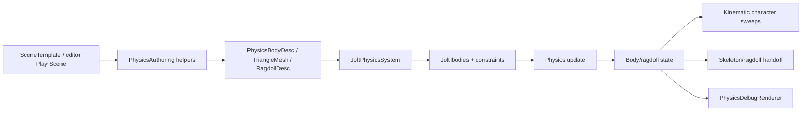
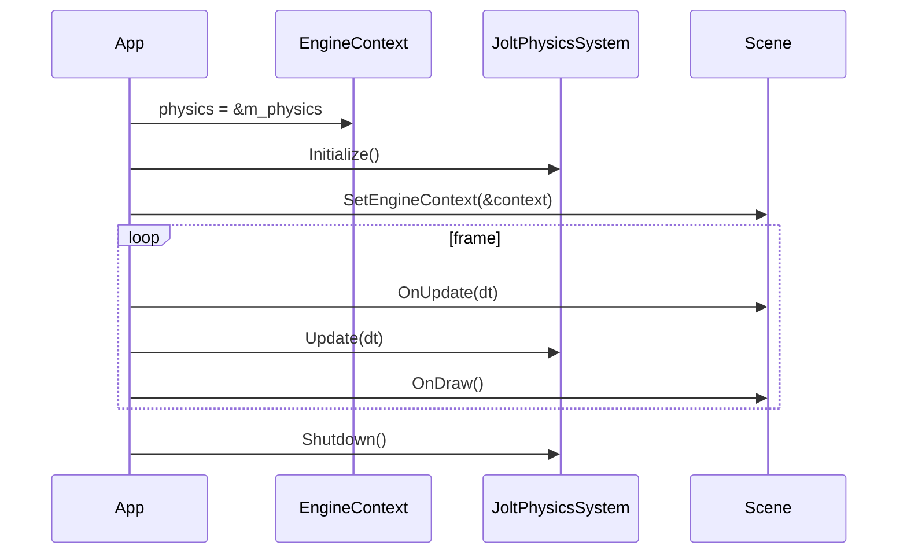
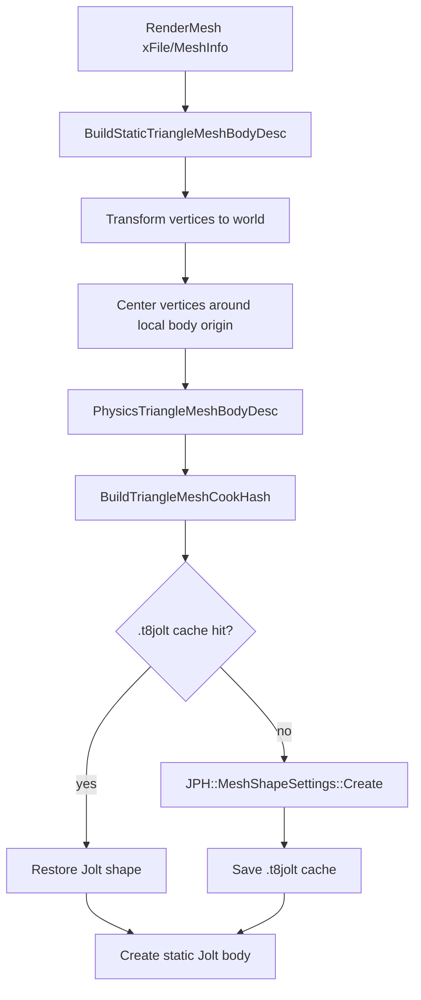
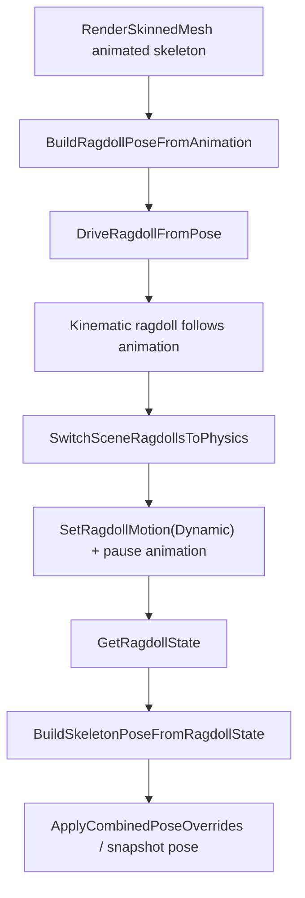

# Jolt Physics

Status: Stage 7 draft.

This document explains T850's physics system: Jolt lifecycle, body and shape creation, collision layers, triangle mesh cooking, scene/editor authoring metadata, kinematic character movement, ragdoll generation and authoring, animation-to-ragdoll handoff, Play Scene integration, debug rendering, limitations, and debugging workflows.

Related documents:

- [Main architecture](../architecture/main-architecture.md)
- [Resource locator and cache paths](../architecture/resource-locator.md)
- [Input, camera, and controls](../input/camera-and-controls.md)
- [Dependency map](../dependency-map.md)
- [Loading geometry](../geometry/loading-geometry.md)
- [Animation system](../animation/animation-system.md)
- [Scene format and runtime](../scenes/scene-format-and-runtime.md)
- [NavMesh and Detour](../navigation/navmesh-detour.md)

## Purpose and responsibilities

Physics is exposed to engine scenes through `JoltPhysicsSystem` in `EngineContext`. Scene/editor systems create high-level `PhysicsBodyDesc`, `PhysicsTriangleMeshBodyDesc`, or `PhysicsRagdollDesc` data; `JoltPhysicsSystem` converts those into Jolt shapes, bodies, constraints, casts, and debug records.



## Key files and classes

| File/class | Role |
|---|---|
| `Framework/include/physics/JoltPhysicsSystem.h` | Public physics system API: lifecycle, bodies, casts, ragdolls, debug body queries. |
| `Framework/src/physics/JoltPhysicsSystem.cpp` | Jolt integration, shape/body creation, triangle mesh cache/cooking, simulation update, casts, ragdoll constraints. |
| `Framework/include/physics/PhysicsTypes.h` | Physics handle, shape, body, triangle mesh, cast, ragdoll, and authoring structs. |
| `Framework/include/physics/PhysicsAuthoring.h` | Helpers that build physics descriptors from render meshes and skeletons. |
| `Framework/src/physics/PhysicsAuthoring.cpp` | Static mesh extraction, ragdoll generation/binding/load/save, animation-physics pose conversion. |
| `Framework/include/physics/CharacterController.h` | Kinematic character settings, input, collision world interface, and controller API. |
| `Framework/src/physics/CharacterController.cpp` | FPS and Quake3-style kinematic movement using capsule/box sweeps. |
| `Framework/include/physics/PhysicsDebugRenderer.h` | Physics debug draw API. |
| `Framework/src/physics/PhysicsDebugRenderer.cpp` | Builds line geometry for boxes, capsules, spheres, cylinders, and triangle meshes. |
| `Framework/include/physics/RagdollEditorTool.h` | Ragdoll editor state helpers, selection modes, frozen state, undo snapshots. |
| `Framework/src/physics/RagdollEditorTool.cpp` | Ragdoll authoring state normalization and comparison helpers. |
| `Framework/include/scene/EditorSceneFile.h` | `.t8scene` physics object/entity/ragdoll/character schema. |
| `DayScene/SceneTemplate.cpp` | Runtime `.t8scene` physics load, static collision creation, characters, ragdolls, physics debug overlays. |
| `T8ditor/RagdollEditorPanel.cpp` and `FrameworkImGui/src/RagdollEditorGui.cpp` | Ragdoll authoring UI and hosted viewport tools. |
| `T8ditor/PlayScenePanel.cpp` | Exports temporary `.t8scene` snapshots for Play Scene. |

## Build/runtime availability

`JoltPhysicsSystem.cpp` is compiled in two modes:

- With `T850_ENABLE_JOLT`, it uses Jolt and provides full body/ragdoll/cast behavior.
- Without `T850_ENABLE_JOLT`, the same public methods compile as stubs and `IsAvailable()` is false.

Scenes should always check `IsInitialized()` before creating or updating runtime physics.

## Lifecycle and EngineContext

`DayScene/Application.cpp` owns the main `JoltPhysicsSystem` instance, stores it in `EngineContext::physics`, initializes it during app setup, and updates it once per app frame after scene update.

`EngineContext` contains:

```text
JoltPhysicsSystem* physics
```

The editor also owns a separate `m_playScenePhysics` for hosted Play Scene execution.



`Initialize()`:

- initializes global Jolt allocator/factory/type registration through a refcounted global path,
- creates the system implementation,
- initializes `JPH::PhysicsSystem` with 65536 max bodies/body pairs and 10240 contact constraints,
- creates broadphase/layer filters,
- calls `OptimizeBroadPhase()`.

`Shutdown()` destroys all ragdolls and bodies, deletes the implementation, and releases global Jolt state when the last instance shuts down.

## Collision layers

The current layer model is intentionally simple:

| Engine/Jolt layer | Meaning |
|---|---|
| `Layers::NonMoving` | Static bodies. |
| `Layers::Moving` | Kinematic/dynamic bodies. |

Layer filtering:

- static/non-moving collides only with moving,
- moving collides with everything.

There is no per-gameplay-category collision matrix yet. Scene metadata has string fields such as `collision_layer`, but the runtime Jolt filter currently uses only static vs moving object layers.

## Bodies and shapes

Public body creation uses `PhysicsBodyDesc`.

Supported `PhysicsShapeType` values:

- `Box`
- `Capsule`
- `Sphere`
- `Cylinder`
- `TriangleMesh`

Supported motion modes:

- `Static`
- `Kinematic`
- `Dynamic`

`CreateBodyInternal()` validates coordinates and extents before creating a Jolt shape. Oversized or non-finite transforms/shapes are rejected and logged. Body creation sets:

- Jolt shape,
- position/rotation from row-vector engine transform,
- Jolt motion type,
- object layer from motion,
- user data with entity id and bone index,
- friction/restitution,
- sensor flag,
- optional collision group,
- mass override for non-static bodies.

`PhysicsBodyHandle` is an index into the system's body slot array. `PrimitiveInst` stores the handle through `AttachPhysicsBody()`.

## Static triangle mesh cooking

Static collision for render meshes is built by `PhysicsAuthoring` and cooked by `JoltPhysicsSystem`.



`BuildStaticTriangleMeshBodyDesc()`:

- walks `RenderMesh::xFile->MeshInfo` and `xMeshContainer::Geometry`,
- reads interleaved position data from `xFinalGeometry::pData`,
- transforms vertices by the mesh instance world matrix,
- supports both 16-bit and 32-bit source index arrays,
- computes world bounds,
- recenters vertices around the body origin,
- stores local bounds, source path, vertices, indices, and cook settings.

`CreateTriangleMeshBody()`:

- calls `CreateOrLoadTriangleMeshShape()`,
- creates a static Jolt body on `Layers::NonMoving`,
- stores debug vertices and generated line indices for physics debug drawing,
- returns a `PhysicsBodyHandle`.

Cook cache:

- file extension: `.t8jolt`,
- location: source parent `.t8cache` directory,
- key includes geometry, source path, Jolt version/features, platform tag, and cook settings,
- stores/restores serialized Jolt shape data with a `T8JPHYSM` magic header.

`AttachStaticTriangleMeshBody()` attaches the created body handle to the `PrimitiveInst`.

## Scene and `.t8scene` authoring metadata

Physics metadata is stored in `.t8scene` through `EditorSceneFile.h`.

Per render object:

| Field | Meaning |
|---|---|
| `physics` | Optional `SceneObjectPhysicsDesc`. |
| `ragdoll_authoring` | Optional `SceneObjectRagdollDesc`. |
| `ragdoll` | Legacy ragdoll authoring asset path. |

`SceneObjectPhysicsDesc` includes:

- `enabled`,
- `body_type`,
- `motion`,
- `collision_layer`,
- `generate_collision`,
- `collision_asset`.

Top-level `physics_entities[]` uses `ScenePhysicsEntityDesc` and can define:

- static triangle mesh entities tied to a `source_object`,
- player/character entities,
- shape settings such as box/capsule/sphere/cylinder dimensions,
- friction/restitution/sensor,
- triangle mesh cook settings,
- character parameters.

SceneTemplate load behavior:

1. Load scene objects as render meshes.
2. If object physics metadata requests `static_triangle_mesh` and no top-level physics entity already owns that object, attach static collision.
3. Iterate `scene.physics_entities`.
4. For `static_triangle_mesh` entities, find the source object and attach static collision with the entity's cook settings.
5. For `player` entities, store authored player settings and configure the camera controller.
6. Character entities are used for runtime navigation/agent character settings; static entity creation skips `type == "character"` in the static physics loop.

## Play Scene export

T8ditor's Play Scene path exports a temporary `.t8scene`:

- stale NavMesh is regenerated before export,
- `RefreshVirtualEditorScene()` builds a scene snapshot,
- physics entities, objects, ragdoll metadata, cameras, and lights are written,
- `SaveSceneToFile()` writes the temp file under `%TEMP%\T850\T8ditorPlay`.

The hosted `SceneTemplate` then loads the same physics metadata as a normal runtime scene, using `m_playScenePhysics` through its local `EngineContext`.

## Kinematic character controller

T850 has an engine-side kinematic controller in `CharacterController.cpp`. It is not currently a direct Jolt `CharacterVirtual` wrapper, even though scene metadata has fields named for virtual/character settings.

The controller depends on a `CharacterCollisionWorld` interface:

- `SweepCapsule()`
- `SweepBox()`
- `QueryTriggerTouch()`

`SceneTemplate` implements collision queries by calling the Jolt physics casts.

Character modes:

- `UpdateFps()` implements a grounded FPS controller with friction, acceleration, gravity, jump, step-slide, and capsule sweeps.
- `UpdateQuake3()` implements Quake3-style movement, command scaling, ground tracing, air/ground movement, clipping planes, and step-slide.

`MakeQuake3CharacterSettings()` converts Quake units to engine units with `1/32` scale and uses a box-shaped collision profile by default.

Scene authoring fields are converted by `CharacterSettingsFromPhysicsEntity()`, including shape, radius/half-height/half-extents, slope angle, probe distance, and step height.

## Ragdoll descriptors

Core ragdoll data lives in `PhysicsTypes.h`.

| Structure | Meaning |
|---|---|
| `PhysicsRagdollBoneDesc` | Body shape, parent bone, joint type, joint anchor/frame axes, swing/twist limits. |
| `PhysicsRagdollDesc` | Full ragdoll body list plus animation/physics blend metadata. |
| `PhysicsRagdollAnimationBinding` | Mapping between animation skeleton bones and ragdoll bodies/joints. |
| `PhysicsRagdollAuthoringDesc` | Saved/editable authoring state, parent/joint overrides, frozen flags, contact-joint flags. |

Joint types:

- `SwingTwist`
- `Fixed`

Ragdoll authoring schema version is currently `kPhysicsRagdollEditSchemaVersion = 11`.

## Ragdoll generation and loading

`BuildRagdollDescFromSkeleton()` generates a ragdoll from a `RenderSkinnedMesh`:

- finds a reference skeleton,
- selects ragdoll bones,
- optionally fits capsules to weighted skinned vertex samples,
- infers body shape, length, radius, mass, and transform,
- infers parent links and joint limits,
- initializes joint frames,
- logs generation statistics.

`BuildRagdollAnimationBinding()` computes:

- `bodyFromBone` transforms,
- joint anchor offsets relative to bones,
- parent/child joint frame axes,
- controlled bone lists,
- controlled body-from-bone transforms.

`BuildRagdollAuthoringFromSkeleton()` wraps generated pose and binding into editable authoring state.

Saved authoring files:

- path builder: `Models/RagdollEdits/<model-key>.json`,
- loader: `LoadRagdollAuthoringAsset()`,
- saver: `SaveRagdollAuthoringAsset()`,
- write path resolution uses resource lookup on desktop and cache path on Android.

The loader is schema-aware and can remap saved bodies by index or bone index, repair/normalize joint anchors and axes, recover contact anchors, preserve frozen flags, and fill missing controlled-bone data.

## Runtime ragdolls and animation handoff

`JoltPhysicsSystem::CreateRagdoll()`:

1. Creates a Jolt collision group/filter table for the ragdoll.
2. Creates one body per ragdoll bone, usually kinematic at first.
3. Creates `FixedConstraint` or `SwingTwistConstraint` between parent and child bodies.
4. Stores body handles and constraints in a ragdoll slot.

SceneTemplate loads authored ragdolls with `AttachSceneObjectRagdoll()`:

1. Get the skinned mesh.
2. Generate a ragdoll authoring binding.
3. Load saved authoring asset.
4. Create a kinematic Jolt ragdoll.
5. Store a `SceneRagdollRuntime` with mesh index, binding, pose, resource path, and state.
6. Attach the ragdoll handle to the `PrimitiveInst`.

Animation-to-physics flow:



Important functions:

- `BuildRagdollPoseFromAnimation()` maps current animated skeleton to ragdoll body transforms.
- `DriveRagdollFromPose()` drives ragdoll bodies kinematically.
- `SwitchSceneRagdollsToPhysics()` drives current pose once, switches bodies to dynamic, clears velocities, marks runtime as physics-driven, pauses animation, and clears snapshot matrices.
- `BuildSkeletonPoseFromRagdollState()` maps dynamic body state back into skeleton combined matrices for mesh pose updates.

## Ragdoll editor tools

The hosted ragdoll editor is split between:

- `T8ditor/RagdollEditorPanel.cpp`: hosted viewport, object selection, load/save/reset/simulation callbacks.
- `FrameworkImGui/src/RagdollEditorGui.cpp`: ImGui controls.
- `RagdollEditorTool`: authoring state utilities.

Editor functionality includes:

- selection modes for bodies, joints, and bones,
- select/edit/move/rotate tools,
- physics and skeleton debug toggles,
- start simulation,
- simulation speed slider,
- fixed 1/60 physics delta toggle,
- reset physics/animation,
- undo via authoring snapshots,
- load/save ragdoll edits,
- delete/clear/reset bodies,
- frozen body/joint state.

## Debug rendering

`PhysicsDebugRenderer` obtains live body debug data through `JoltPhysicsSystem::GetDebugBodies()`.

It renders:

- boxes,
- capsules,
- spheres,
- cylinders,
- triangle mesh edge lists when debug vertices/indices are available.

The renderer builds dynamic line buffers and draws through `LineRenderer`, with optional depth-texture occlusion using render graph depth targets.

SceneTemplate draws physics debug overlays when the `show_physics` editor/runtime toggle is enabled.

## Extension points

To extend physics:

1. Add new shape metadata to `PhysicsTypes.h`, conversion to Jolt in `CreateJoltShape()`, debug rendering, and `.t8scene` schema fields.
2. Add richer collision layers by extending object layers, broadphase layers, and scene metadata mapping.
3. Add true Jolt `CharacterVirtual` support by creating a runtime wrapper instead of only using the current kinematic controller/casts.
4. Extend triangle mesh cook settings carefully; update cache hash/version when serialized Jolt output compatibility changes.
5. Add ragdoll joint profiles by extending `PhysicsRagdollBoneDesc`, authoring JSON, loader/saver, and Jolt constraint creation.
6. Keep animation/physics handoff code in sync with `RenderSkinnedMesh` and `AnimationController` pose conventions.

## Known limitations and gotchas

- The physics step is either frame-delta driven or one fixed 1/60 step per frame; there is no accumulator/substep scheduler yet.
- Collision layers are currently only static/non-moving vs moving.
- Scene `collision_layer` strings are metadata; Jolt filtering currently does not consume a full named layer matrix.
- The "virtual" character metadata does not mean the runtime uses Jolt `CharacterVirtual`; current movement uses T850's kinematic sweep controller.
- Jolt rejects non-finite or extremely large coordinates; T850 validates against a broadphase coordinate limit.
- Triangle mesh cache files are sensitive to geometry, source path, platform, Jolt version/features, and cook settings.
- Ragdoll authoring files are schema-driven; old files may be repaired/remapped during load.
- Static triangle meshes are intended for static world collision, not moving dynamic mesh bodies.
- Debug triangle mesh rendering depends on retained debug vertices/line indices.

## Debugging checklist

1. Confirm `JoltPhysicsSystem::IsAvailable()` and `IsInitialized()`.
2. Look for `Jolt Physics initialized` and Jolt update telemetry counters.
3. Check body creation return handles with `IsValid()`.
4. Check logs for invalid/oversized transform or shape rejection.
5. For static collision, inspect cook stats: cache hit/miss, vertex count, triangle count, and total cook time.
6. Confirm `.t8scene` `physics_entities` source object names match loaded object names.
7. For characters, verify the scene object implements `CharacterCollisionWorld` casts and that sweep hit normals/grounding are sane.
8. For ragdolls, verify generated binding sizes match body counts.
9. Use physics debug rendering to confirm body positions and triangle mesh wireframes.
10. Use skeleton debug rendering to compare ragdoll state against skinned mesh pose.
11. For animation-to-ragdoll handoff, check that `BuildRagdollPoseFromAnimation()` succeeds before switching to dynamic motion.
12. If Play Scene physics differs from editor state, inspect the temporary `.t8scene` exported by Play Scene and verify physics/ragdoll metadata was saved.
