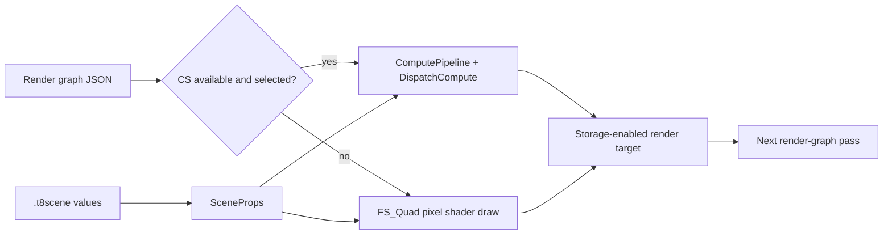

# Cross-Backend Compute Shader Implementation

Status: reviewed against source and validated on Windows x64 on 2026-09-17.

## Purpose

This change adds an API-neutral compute contract and render-graph-selected compute
implementations without making scene code depend on D3D11, D3D12, Vulkan, WebGPU/Dawn, or
OpenGL. D3D11, D3D12, Vulkan, WebGPU/Dawn, and desktop OpenGL 4.3+ execute the same kernel
intent. Older OpenGL and OpenGL ES contexts report no compute capability and run the
retained raster path.

The design has four ownership layers:

1. `.t8scene` owns authored scene and effect values.
2. Render-graph JSON owns pass order, targets, edges, shader paths, and CS/PS selection.
3. Framework code owns kernel-specific constant packing and API-neutral bindings.
4. Each video backend owns compilation, descriptors/views, synchronization, and readback.



## API-neutral Framework contract

`Framework/include/video/BaseDriver.h` adds:

- `ComputePipelineDesc`: source, entry point, debug name, permutation name, defines, and
  the explicit cross-backend binding layout;
- `ComputeBufferDesc`: byte size, structure stride, access, and debug name;
- `ComputeBindingDesc`: constants, structured buffers, textures, and samplers by shader
  register;
- `ComputePipeline` and `ComputeBuffer`: backend-owned polymorphic resources;
- `CreateComputePipeline`, `CreateComputeBuffer`, `DispatchCompute`, and
  `ReadComputeBuffer` virtual methods;
- `SupportsComputeShaders`, `SupportsComputeTextures`, and `ApiTag` capabilities.

The base implementations fail explicitly. This keeps unsupported backends safe and makes
capability selection a render-graph concern instead of a scene-side API switch.

### Portable guarantees

- Buffer creation access is a maximum capability. ReadWrite allocations can bind
  as ReadOnlyBuffer or ReadWriteBuffer; ReadOnly allocations cannot bind writable.
- Pipelines validate the complete reflected interface, constant word counts,
  unique binding indices/logical register namespaces and storage formats. D3D
  reflects HLSL registers; SPIR-V/GL/WebGPU reflect portable binding indices, with
  the descriptor explicitly mapping them to caller-facing logical registers.
- Texture compute supports non-array, non-multisampled 2D views. The retained
  `ReadWriteTexture` name means write-only storage, RGBA8 UNORM or RGBA16F.
  A resource cannot be both sampled/read and written in one dispatch. Samplers
  must use the texture bound at the same logical register.
- `ReadComputeBuffer` is a synchronous diagnostic boundary: a nonzero count
  divisible by four, no larger than the allocation. It works before a frame,
  immediately after dispatch and after submission. An open frame and its target
  remain open; pending commands may be submitted and waited without presentation.
  Rebind graphics resources and topology before the next draw; raw backend
  command state is not preserved across recording resets.
- Compute buffers/pipelines are CPU-owned, and their driver must outlive them.
  Vulkan retires native compute handles after frame completion; D3D12 retains
  referenced native objects per frame. Texture/view owners must synchronize
  before destruction. RenderGraph flushes before target/pipeline teardown or
  rebuild. `FlushGPUResources` submits pending work and waits before reclamation.
- Invalid declared bindings are rejected before recording dispatch work. Device
  loss or allocation failure is not a transactional rollback guarantee.

The regression oracle covers producer/consumer chains, malformed layouts,
write-capability violations, aliases, storage formats, aligned readback at each
submission boundary, destruction before submission, and active-target clear
continuation. SPIRV-Reflect is vendored unchanged at the revision documented in
`T850/Librerias/spirv-reflect/README.t850.md` for native GL/Vulkan reflection.

`Device::CreateRT` and both `BaseDriver::CreateRT` overloads now accept storage usage.
`BaseRT::AllowUnorderedAccess` carries that request to the selected backend. Existing
callers retain graphics-only behavior because storage defaults to false.

## D3D11 implementation

`D3D11ComputePipeline` compiles HLSL as `cs_5_0`, reflects the compiled shader, and records
constant-buffer, structured-buffer, texture, UAV, and sampler registers. A dispatch is
rejected unless every reflected binding appears exactly once with the expected type and
constant count.

`D3D11ComputeBuffer` creates an SRV and, for ReadWrite capability, a UAV. Diagnostic
readback copies to a `D3D11_USAGE_STAGING` buffer and maps it for CPU access.

Texture compute uses SRV/UAV views added to D3D11 render-target wrappers. Before dispatch,
the driver unbinds graphics SRVs and output-merger targets to avoid read/write hazards. It
then binds CS constants/resources, dispatches on the immediate context, clears every CS
binding, and restores normal frame output with `PopRT`. No CPU `Flush` is required between
commands recorded on the same immediate context.

Capability reporting checks feature level 11 and verifies that the RGBA8 and RGBA16F
formats required by the current graph expose typed unordered-access views. When this
capability is unavailable, render-graph targets are created without UAV usage so startup
can continue through the authored raster fallback.

## D3D12 implementation

`D3D12ComputePipeline` compiles HLSL as `cs_5_0`, or loads `cs.dxbc` from the existing
shader disk-cache hierarchy. Reflection creates:

- root constants for `cbuffer` declarations up to 64 DWORDs;
- root SRV/UAV descriptors for structured or byte-address buffers;
- one-entry descriptor tables for sampled textures, storage textures, and samplers;
- a compute root signature and compute PSO.

The driver validates a complete binding set before recording commands. Buffers and textures
transition to `NON_PIXEL_SHADER_RESOURCE` or `UNORDERED_ACCESS`; written resources receive a
UAV barrier; texture wrappers then return to their graphics-readable state. Graphics PSO,
root-signature, shader, and constant-buffer caches are invalidated after dispatch so the next
draw cannot reuse stale compute state.

Storage-enabled render targets own SRV and UAV descriptors and share their tracked state with
the owning `D3D12RT`. Diagnostic buffer readback transitions to copy source, copies into a
readback heap, submits without presenting, waits for completion, and maps the result.
An active frame resumes recording on the same frame slot and restores its target,
viewport and scissor while invalidating cached graphics bindings.

The review also fixed swapchain state tracking. Each backbuffer now records its actual state,
and `Clear`, `ClearWithColor`, `ClearBackbufferWithColor`, `PopRT`, and `CompleteFrame` use one
transition helper. This is required when T8ditor calls `BeginFrame` before `Clear`; the old
code skipped the PRESENT-to-RENDER_TARGET barrier in that sequence.

## Vulkan implementation

`VulkanComputePipeline` compiles the shared HLSL with glslang to SPIR-V 1.0. The shaders use
`T850_VULKAN`-guarded `vk::binding` attributes, while D3D continues to use native HLSL
registers. The pipeline owns a descriptor-set layout, pipeline layout, and compute pipeline.
Binding indices and logical register/type pairs are validated for uniqueness;
SPIRV-Reflect checks the declared interface and storage formats. `T850_SPIRV`
enables the explicit RGBA8/RGBA16F shader annotations.

At dispatch, the driver:

1. ensures a frame command buffer exists and ends any active render pass;
2. allocates a descriptor set from the active per-frame pool;
3. uploads constants through the existing constant-buffer ring;
4. writes storage-buffer, sampled-image, storage-image, and sampler descriptors;
5. transitions sampled images to shader-read layout and outputs to `GENERAL`;
6. dispatches and records write/read synchronization;
7. returns written textures to shader-read layout;
8. invalidates cached graphics pipeline state.

Compute buffers use VMA GPU-only storage allocations. Readback copies into a mapped
GPU-to-CPU staging allocation, submits, waits, invalidates non-coherent memory, and copies to
the caller.

Vulkan selects a present-capable graphics queue and prefers one that also supports compute.
Texture compute additionally requires storage-image support for RGBA8 and RGBA16F. All
storage images carry explicit format decorations, so formatless storage-image writes are not
required. Unsupported hardware uses the render graph's raster fallback instead of failing
pipeline creation later.

## WebGPU/Dawn implementation

`WebGPUDriver` implements the same `CreateComputePipeline`, `CreateComputeBuffer`,
`DispatchCompute`, and `ReadComputeBuffer` contract as the native backends. This backend is
built for Windows x64 and uses the pinned Dawn provider with its D3D12 native backend only.
No Dawn or WebGPU object crosses into render-graph, scene, or authored-data interfaces.

`WebGPUComputePipeline` sends the shared compute request through
`WebGPUShaderCompiler`. The selected `auto`, `wgsl`, or `spirv` flow either preprocesses a
maintained WGSL source or translates the canonical HLSL through SPIR-V and Tint. Pipeline
creation requires nonempty WGSL, reflected workgroup dimensions, and an exact match between
the reflected resources and `ComputeKernelRegistry`'s declared binding layout. The current
compute layout supports one bind group containing:

- uniform buffers with reflected minimum sizes;
- read-only and read-write storage buffers;
- sampled float 2D textures;
- non-comparison filtering samplers;
- write-only `rgba8unorm` or `rgba16float` storage textures.

All eight maintained compute families have direct `.wgsl` siblings: Arithmetic,
ImagePatternWrite, ImagePatternRead, Blur, Bright, GodRays, HDRComposite and
TorchParticles. Arithmetic also supports the `read-input` define in both languages.
The existing SeparableBlur probe retains its own WGSL source. Before the 2026-09-17
follow-up, only that older probe shader had been ported; `auto` hid the missing
ComputeV1 ports by falling back to HLSL.

`DawnComputeV1` requires identical reflected bindings (including uniform offsets,
storage formats and minimum sizes) and workgroup sizes across strict `wgsl` and
`spirv` for all nine variants. Run the native GPU oracle with each explicit
`--shaderFlow wgsl` and `--shaderFlow spirv`; an `auto` pass alone is not dual-flow
evidence. The browser uses version-3 packages keyed by the requested flow and
checks source provenance, selected with `?shaderFlow=wgsl` or `?shaderFlow=spirv`.
Both browser paths ultimately submit WGSL to WebGPU; SPIR-V translation happens
during native package export.

The reflected workgroup dimensions populate the shared `ComputePipeline::threadGroupSize`,
so render-graph dispatch uses the same ceiling-division path as D3D11, D3D12, Vulkan, and
OpenGL. Dawn shader modules, bind-group layouts, pipeline layouts, and compute pipelines are
created from that validated artifact. Compute buffers carry `Storage | CopySrc | CopyDst`
usage so the same allocation can participate in dispatch and explicit test readback.

Before dispatch, the driver ends any active render pass and validates that every runtime
binding belongs to the same WebGPU driver and appears exactly once with the expected type,
register, size, texture dimension, and storage format. Constants use transient aligned
uniform buffers, and the remaining resources form one bind group. Normal frame compute is
recorded into the active command encoder; standalone diagnostics create and submit a bounded
encoder. WebGPU owns native resource transitions and usage-scope validation, so the engine
does not emit backend barrier objects.

Diagnostic buffer readback copies into a `CopyDst | MapRead` staging buffer, submits the
copy, and waits for `MapAsync` only inside the explicit self-test/readback call. Ordinary
render-graph execution never maps or waits. Device health is checked after pipeline creation,
dispatch, and readback so validation or device-loss failures surface through the normal
WebGPU diagnostics.

## OpenGL behavior

On Windows, the GL host first requests a desktop OpenGL 4.3 compatibility context. If the
driver cannot create it, it retries a 3.3 compatibility context for graphics-only fallback.
Desktop OpenGL enables compute only when the active context exposes OpenGL 4.3 or newer.
Each authored HLSL compute shader has a sibling `.glsl` source with the same stem.
`GLComputePipeline` loads that sibling, injects permutation defines after `#version`, compiles
and links a compute program, and validates the API-neutral binding declaration before dispatch.

Constants use transient `std140` uniform buffers, structured buffers use shader-storage
buffers, sampled textures use the texture object sampling state, and RGBA8/RGBA16F outputs
use write-only images. Each API-neutral sampler `sN` must reference the same texture as
sampled binding `tN`; dispatch selects that texture unit's object-owned sampling state and
restores the prior sampler-object binding afterward. Bindings use the render graph's explicit
`bindingIndex`, preserving the same layout identity as Vulkan. Dispatch issues shader-storage,
image-access, texture-fetch, and buffer-update barriers before restoring graphics state.
Diagnostic buffer readback uses `glGetBufferSubData` after the storage barrier.

Desktop OpenGL contexts below 4.3 and OpenGL ES report no compute support. Optional
post-process passes use their existing fullscreen raster fallback, and compute-only passes
retain their existing clear behavior. The Windows 3.3 context fallback is explicitly
raster-only and never compiles or dispatches a compute shader.

Odd-width validation exposed an independent GL dump bug: `glReadPixels` used the default
four-byte pack alignment with tightly allocated one-channel rows. Width 1023 overran the
readback vector and triggered the Debug CRT heap check. `ReadFBOToPPM` now sets
`GL_PACK_ALIGNMENT` to one for the read and restores the previous value.

## Render graph integration

`RenderGraphDescriptor.h` adds these pass fields:

| Field | Purpose |
|---|---|
| `execution` | `graphics` or `compute_if_supported` |
| `compute_shader` | Resource-relative HLSL source |
| `compute_entry` | Entry point, normally `CS` |
| `compute_permutation` | Stable source-permutation identity |
| `compute_extent_from` | Storage output that supplies dispatch dimensions |
| `compute_resources` | Complete typed constants/sample/sampler/storage binding list |

`RTDesc::storage` requests backend storage/UAV usage. `RenderGraph` creates optional pipelines
after render targets and graph edges are resolved. Selection uses the global
`postProcessMode`:

- `raster`: use the authored graphics draw or clear fallback;
- `compute`: enable every declared post-process CS alternative;
- unsupported capability: log and use raster fallback.

Compute and graphics implementations may share authored resources, but compute bindings are
declared independently and typed. Graph loading rejects unknown fields/accesses, incomplete
or duplicate layouts, non-storage outputs, invalid permutations, and read/write feedback.
Every backend reflects workgroup dimensions from the compiled pipeline; dispatch uses ceiling
division, so odd dimensions exercise shader bounds checks. A successful compute pass returns
before the fullscreen draw but still applies `post_state`; failed dispatch falls through to
the authored draw.

Kernel-specific constant packing stays in Framework `ComputeKernelRegistry`, not in
`RenderGraph` or scene classes. The generic graph executor resolves typed resources, asks the
registry for constant words, and calls the shared driver API. Scene code does not create API
pipelines, bind descriptors, issue dispatches, or branch on graphics API.

`Framework/ComputeKernelRegistry` owns each registered kernel's canonical source
name, entry point, post-process policy, and API-neutral binding layout. RenderGraph
looks up that definition before it creates a runtime pipeline, and ShaderPrecompiler
uses the same lookup when it prewarms a `compute_permutations` record. This keeps
binding ABI validation shared by offline and runtime creation. RenderGraph retains only
generic typed resource resolution and dispatch.

## Compute shaders

### Arithmetic

`CS_Arithmetic.hlsl` is the standalone structured-buffer diagnostic. It evaluates
`((index + addend) * multiplier) ^ xorMask` for 96 elements using two 64-thread groups. It
proves constants, structured UAV writes, submission, synchronization, and CPU readback.

### God Rays

`CS_GodRays.hlsl` mirrors the existing `LIGHT_RAY_MARCHING` fullscreen pixel shader. It
reconstructs world position from scene depth, optionally clips the view ray to the authored
God Rays box, samples shadow depth, accumulates phase-function scattering, and writes
`GodRaysCalc`.

### Separable blur

`CS_Blur.hlsl` implements horizontal and vertical permutations using one kernel and a runtime
direction constant. It consumes the active authored Gaussian kernel, samples one axis, and
writes every output pixel. The checked-in inventory keeps `horizontal` and `vertical` as
separate graph/source identities even though they share code.

### Bright pass

`CS_Bright.hlsl` mirrors `BRIGHT_PASS`: sample HDR color and adapted luminance, calculate
exposure, apply the white-level tone map, and emit the thresholded bright target used by the
existing raster bloom blur.

### HDR composition

`CS_HDRComposite.hlsl` mirrors `HDR_COMP_PASS`: tone-map HDR using adapted luminance, sample
the raster-blurred bloom target, add the authored bloom factor, and write the final helper
target.

### Torch particles

`CS_TorchParticles.hlsl` projects deterministic world-space particles from the authored torch
emitter into a screen-sized RGBA16F texture. Lifetime, rise, spread, size, emitter position,
particle count, and time are supplied through `SceneProps`. Every thread owns one output
pixel, so no atomics or retained particle buffer are needed. Palette colors, radial motion,
wobble, size evolution, edge softness, fade windows, intensity, and tip lighting are authored
under `voxel_world.torch` rather than embedded in C++ or shader code.

The pass binds the same frame's `GBuffer:DEPTH` at sampled register `t0`
(portable binding 2), alongside constants at binding 0 and the output at binding 1.
Each output pixel loads its depth without filtering. A particle's projected
`clip.z / clip.w` must be in [0, 1] and greater than or equal to the scene depth
because the engine uses reversed-Z. The camera-facing particle square uses its
center depth across its pixels, so geometry can partially occlude a particle.
Both HLSL and GLSL implement this test; no separate particle depth buffer is used.

The shared `--compute-selftest` includes the production torch kernel with a 7x5
depth mask and exact readback assertions for visible, hidden, partially occluded,
and out-of-range particles. It passed D3D11, D3D12, Vulkan, GL, native WebGPU,
Chrome and Firefox on 2026-09-17. The original merged kernel omitted depth entirely.

## Shader permutation inventory and cache

Version 2 of `Assets/Shaders/shader_permutations.json` preserves the established graphics
shape: `permutations` contains only 16-digit hexadecimal `ShaderKey` identities. Compute
entries live under `compute_permutations` and use:

```text
<shader filename>:<entry point>:<permutation name>
```

Each object repeats the exact identity in `key` and records `kind`, `computeShader`,
`entryPoint`, `permutation`, and sorted unique `defines`. Backend profiles are intentionally
excluded: D3D `cs_5_0` and Vulkan SPIR-V are artifacts of one source permutation. One
manifest identity may have only one normalized define set; recording conflicting defines is
rejected, and a define-distinct variant must use another registered permutation name.

The inventory contains nine entries: Arithmetic, horizontal and vertical Blur, Bright,
God Rays, HDR Composite, Torch Particles, and the paired image-pattern write/read diagnostics.
`ShaderPermutationDump` merges graphics and compute sections independently and rewrites
entries in deterministic map order.

D3D12 compute cache keys include API, driver signature, source name, entry point, compiler
profile/flags, and fully prefixed source. This prevents graphics/compute collisions and stale
reuse after source or driver changes.

## Scene and authored-data changes

Every maintained graph declares Bright and HDR Composite alternatives. DayScene additionally
declares God Rays and its two blur directions. Minecraft declares Bright/HDR plus the
compute-only torch target. Existing PS draws remain next to each optional CS declaration.

Minecraft authored values are stored under `voxel_world` in `Minecraft.t8scene`:

- torch placement, dimensions, block material, tip color/roughness/lighting, particle values,
  palette, motion/shape/fade/intensity, time wrap, and UI ranges;
- mob skin path, dimensions, pixelation factor, and six face rectangles per box part;
- the existing world, camera, light, terrain, movement, rendering, and interaction settings.

`MinecraftScene.cpp` translates this data into geometry and `SceneProps`. It contains no
D3D11, D3D12, Vulkan, OpenGL, compute-pipeline, or descriptor implementation. Fixed array
capacities, six cube faces, vertex layout/stride, homogeneous-coordinate constants, and
validation safety ceilings remain C++ invariants; visual/tuning values are authored data.

The original `herobrine_green.png` skin is tracked explicitly despite the cloud-texture
ignore rule. Missing skin data falls back to authored block-atlas tiles.

## Configuration and tools

`postProcessMode` is accepted from runtime JSON and `--postProcessMode compute|raster`.
DayScene and T8ditor share the parser; `auto` is rejected.

`--compute-selftest` starts a minimal application and defaults to D3D12 on Windows or Vulkan
on Linux unless an API is explicit. Linux runs the same minimal application through its
Vulkan framework. The self-test validates arithmetic buffer compute, then writes and reads
deterministic RGBA8 images at `1x1`, `7x5`, and `257x129`, checking every pixel after GPU
readback.
`--compute-selftest-wait N` adds capture windows before and after dispatch.

Visual Studio projects, filters, desktop CMake, and Android CMake register all new Framework
sources. Android's shader task validates that graphics permutation keys remain hexadecimal.
Android Vulkan compute SPIR-V precompilation is not implemented in this change; Android keeps
the HLSL source and uses runtime compilation.

On Windows, `--compileShaders` validates/prewarms graphics and compute manifest sections.
The compute section resolves layouts from `ComputeKernelRegistry`; it is not silently ignored.
The original seven production entries passed this path on D3D11, D3D12, Vulkan, WebGPU, and
desktop GL on 2026-09-16. On 2026-09-17, the expanded 290-entry manifest, including all nine
compute identities, passed D3D12 precompile. Android's independent Gradle task remains
graphics-only.

The branch also contains earlier reviewed work that:

- drains GPU work before destroying a scene during transitions;
- restores legacy one-view shadow-sampling payloads and tests cascade-to-legacy reset;
- lets scenes opt out of relative mouse capture;
- improves launcher sizing, source-root discovery, PowerShell host selection, and output
  deployment checks;
- records the planned Dawn/WebGPU architecture separately from implemented backends.

`config.json`, the vcpkg submodule state, and the compiled launcher are workspace/release
state rather than compute architecture. Review those files separately before committing if
the branch should contain only source and authored assets.

## Validation performed

Local proof is retained under:

```text
T850/bin/x64/Debug/logs/compute-review-20260915
T850/bin/x64/Release/logs/compute-review-20260915
```

Generated frame dumps named in the result JSON files remain beside the matching executable.

| Gate | Result |
|---|---|
| x64 Debug full solution build | PASS |
| x64 Release full solution build | PASS |
| Dawn `DawnComputeV1` Debug/Release | PASS, 6 shader families; Torch constants reflect as 56 DWORDs |
| Framework build registration | PASS |
| Release game self-tests | PASS, 61 tests |
| Release compute self-tests | PASS on D3D11, D3D12, Vulkan, WebGPU/Dawn, and OpenGL; arithmetic plus `1x1`, `7x5`, and `257x129` image kernels |
| JSON/permutation audit | PASS, 281 graphics entries, 9 compute entries, 6 compute graph identities, 8 graph files |
| Arithmetic D3D11/D3D12/Vulkan | PASS, 96/96 values per API |
| Arithmetic OpenGL | PASS, 96/96 values on desktop OpenGL 4.6 |
| Prior DayScene D3D11/D3D12/Vulkan raster/auto/compute | PASS, 9/9 runs |
| Prior DayScene D3D11/D3D12/Vulkan forced compute | PASS, five dispatches per API |
| DayScene OpenGL forced compute | PASS, five dispatches at 1023x577 |
| DayScene OpenGL sampler regression | PASS, 18/18 compute-vs-raster targets within tolerance 4; maximum channel delta 4 |
| DayScene OpenGL compute vs raster | 17/18 targets within tolerance 2; final backbuffer max delta 4 on 0.27% of pixels; repeated compute captures exact |
| Prior DayScene D3D11/D3D12/Vulkan raster-vs-auto/compute comparisons | PASS, 18 targets per pair at tolerance 2; worst max delta 2 |
| Prior Minecraft D3D11/D3D12/Vulkan raster/compute | PASS, 6/6 runs |
| Minecraft native raster mode | PASS, compute-only Torch dispatch; Bright/HDR remain PS |
| Minecraft native compute mode | PASS, Torch + Bright + HDR dispatch |
| Minecraft OpenGL | PASS, Torch + Bright + HDR dispatch |
| Prior Minecraft D3D11/D3D12/Vulkan raster-vs-compute comparison | PASS, 12 targets exact per API |
| Prior Sandbox/Quake/Ragdoll/Voxel D3D11/D3D12/Vulkan graphs | PASS, 12/12 forced-compute runs |
| Prior T8ditor D3D11/D3D12/Vulkan graphs | PASS, 3/3 forced-compute runs |
| D3D12 debug layer after backbuffer fix | PASS, no errors in DayScene, Minecraft, or T8ditor compute runs |
| GL odd-width CDB rerun | PASS, exit 0 and zero application-exception markers |
| ARM64 Debug/Release | BLOCKED, matching v143 ARM64 MSBuild tools are not installed |
| Vulkan validation layer | BLOCKED, runtime reports the Vulkan SDK validation layer unavailable |

D3D12 still emits the documented debug-layer warning ID 1328 for older buffer upload paths
that request `COPY_DEST` as an initial buffer state. No compute binding, resource-state,
descriptor, device-removal, or execution errors remained after the review fixes.

On 2026-09-17, the Windows host created an OpenGL 4.3 compatibility context on the Intel
adapter and reported `shaders=1 textures=1`. The arithmetic readback passed 96/96 values.
DayScene forced-compute at 1023x577 created/dispatched God Rays, Blur V/H, Bright, and HDR
with no engine errors. Minecraft similarly dispatched TorchParticles, Bright, and HDR.
The prior 288-entry GL manifest prewarm passed, including the seven production compute identities.
The DayScene GL raster/compute capture compared 18 targets at tolerance 2; 17 matched and
the final backbuffer had 0.530434% changed pixels with maximum channel delta 4. The 3.3
fallback path is implemented but was not executable on the reviewed 4.3-capable adapter.

Important proof summaries:

```text
Debug/logs/compute-review-20260915/dayscene-mode-results-final.json
Debug/logs/compute-review-20260915/dayscene-comparison-results.json
Debug/logs/compute-review-20260915/minecraft-mode-results.json
Debug/logs/compute-review-20260915/minecraft-comparison-results.json
Debug/logs/compute-review-20260915/d3d12-state-fix-results.json
Release/logs/compute-review-20260915/arithmetic-results.json
Release/logs/compute-review-20260915/final-api-smoke-results.json
Release/logs/compute-review-20260915/shared-graph-results.json
Release/logs/compute-review-20260915/t8ditor-graph-results-reviewed.json
Release/logs/compute-review-20260915/permutation-dump.json
```

## RenderDoc validation workflow

### 1. Configure the capture

1. Build x64 Debug or Release and open RenderDoc.
2. In **Launch Application**, select `T850/bin/x64/Debug/DayScene.exe`.
3. Set the working directory to `T850/bin/x64/Debug`.
4. Use D3D12 arguments first:

```text
--api d3d12 --scene 1 --width 1280 --height 720 --regressionFixedDt 0.0166666667 --postProcessMode compute --keepRunning --d3d12debug --logLevel info --logFile logs/renderdoc-d3d12-compute.log
```

5. Launch, wait until the scene is stable, and press **F12** or **Capture Frame(s)
   Immediately**.
6. Repeat with `--api d3d11` and `--api vulkan`. Remove `--d3d12debug` for those APIs.
7. Capture a matched PS frame by changing only `--postProcessMode compute` to
   `--postProcessMode raster`.

### 2. Find each dispatch

In the Event Browser, filter for `Dispatch`. At 1280x720, the forced-compute DayScene frame
should show:

| Kernel | Expected dispatch |
|---|---|
| God Rays | `Dispatch(160, 90, 1)` |
| God Rays Blur V | `Dispatch(160, 90, 1)` |
| God Rays Blur H | `Dispatch(160, 90, 1)` |
| Bright | `Dispatch(64, 64, 1)` for the 512x512 target |
| HDR Composition | `Dispatch(160, 90, 1)` |

Select a dispatch and check **Pipeline State > Compute Shader**. The debug name should identify
`CS_GodRays.hlsl`, `CS_Blur.hlsl`, `CS_Bright.hlsl`, or `CS_HDRComposite.hlsl`. For D3D12,
the PSO name ends in `Compute PSO`.

### 3. Verify bindings

For God Rays, require:

- constants at `b0`;
- scene and shadow depth at `t0` and `t1`;
- matching samplers at `s0` and `s1`;
- `GodRaysCalc` as storage output `u0`.

For Bright, require HDR `t0`, adapted luminance `t1`, two samplers, and `BrightPass` at `u0`.
For HDR Composite, require HDR `t0`, Bloom `t1`, adapted luminance `t2`, three samplers, and
`ExtraHelper` at `u0`.

Use **Resource Inspector** or **Texture Viewer** on the UAV. Step to the event immediately
before and after the dispatch: before should contain the previous frame/clear state; after
should contain the complete new image. Then follow **Resource History** and confirm the next
pass samples the same resource.

Backend-specific synchronization evidence:

- D3D11: graphics SRVs/output-merger targets are unbound before CS binding; CS UAV/SRVs are
  cleared after dispatch; the later draw binds the output as a PS SRV.
- D3D12: the output transitions to UAV, receives a UAV barrier, returns to pixel-shader
  resource state, and is consumed by the next pass.
- Vulkan: the output transitions from shader-read to `GENERAL`, dispatch writes it, and an
  image barrier returns it to shader-read layout.

### 4. Validate Minecraft Torch

Launch with:

```text
--api d3d12 --scene 6 --sceneFile Scenes/Minecraft.t8scene --width 1280 --height 720 --regressionFixedDt 0.0166666667 --postProcessMode compute --keepRunning --d3d12debug --logLevel info --logFile logs/renderdoc-minecraft-compute.log
```

Find `CS_TorchParticles.hlsl` and require `Dispatch(160, 90, 1)`, constants at `b0`, and the
RGBA16F `TorchParticles` UAV at `u0`. Inspect the constants to confirm the emitter position,
time, output size, particle count, enabled flag, lifetime, rise, spread, and size match
`Minecraft.t8scene`. Resource History should show the following Light Add draw sampling
`TorchParticles` and `Deferred`.

### 5. Debug one compute invocation

When the backend/shader supports RenderDoc shader debugging:

1. Select the dispatch.
2. Open the output UAV in Texture Viewer and choose a nonempty pixel.
3. Invoke **Debug Pixel/Thread** and enter the corresponding dispatch group and local thread.
4. Confirm the bounds check passes for an interior thread and exits for a thread outside an
   odd-sized output.
5. Check reconstructed UV, sampled inputs, and final UAV value.

Use a 1023x577 capture to exercise partial edge groups. The expected group count is
`Dispatch(128, 73, 1)` for 8x8 kernels.

### 6. Validate the arithmetic workload

For an isolated buffer capture, launch:

```text
--compute-selftest --api d3d12 --compute-selftest-wait 10 --d3d12debug --logLevel debug --logFile logs/renderdoc-arithmetic.log
```

Capture during the wait window. Require one `Dispatch(2, 1, 1)`, four constants at `b0`, and
the structured output UAV at `u0`. Inspect the buffer after dispatch and verify element `i`
equals `((i + 7) * 3) ^ 0x55AA55AA`.

### 7. OpenGL expectation

Launch the DayScene command with `--api gl --postProcessMode compute`. On an OpenGL 4.3+
context, a correct capture contains compute dispatches for God Rays, both blur directions,
Bright, and HDR Composition. The log reports `shaders=1 textures=1` and each enabled compute
kernel. On older desktop GL or OpenGL ES, the correct result remains the raster fallback.

## Known limitations

- Vulkan validation-layer proof still requires installing the Vulkan SDK and rerunning the
  Debug Vulkan cases.
- Android Vulkan compute shaders compile at runtime; build-time compute SPIR-V generation is
  deferred.
- Torch particles intentionally have no PS implementation. Desktop OpenGL 4.3+ dispatches
  the compute kernel; unsupported GL contexts preserve the base torch and clear the particle
  contribution.
- The current implementation records graphics and compute on the same queue/context. It does
  not claim asynchronous compute overlap.
- D3D12 root constants are limited to 64 DWORDs by the current abstraction.

## Related documents

- [Shader management](shader-management.md)
- [Render graph](render-graph.md)
- [Diagnostics](../debug/diagnostics.md)
- [Scene format and runtime](../scenes/scene-format-and-runtime.md)
- [Verification and release gates](../testing/verification.md)
- [WebGPU proposal](proposal-webgpu.md)
