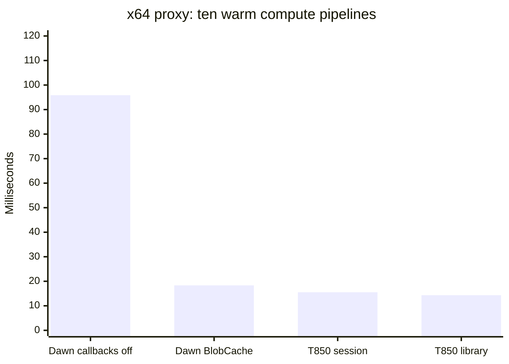
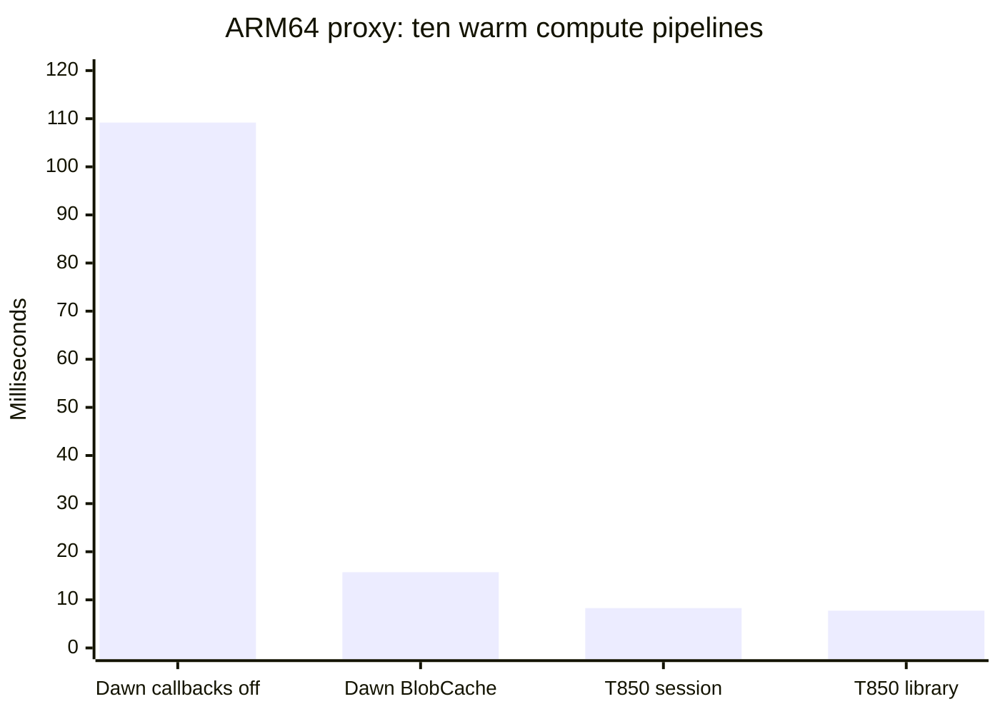
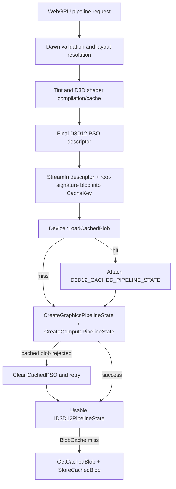
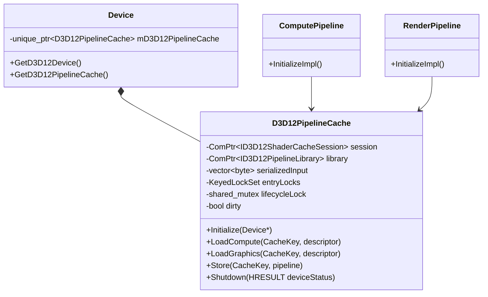
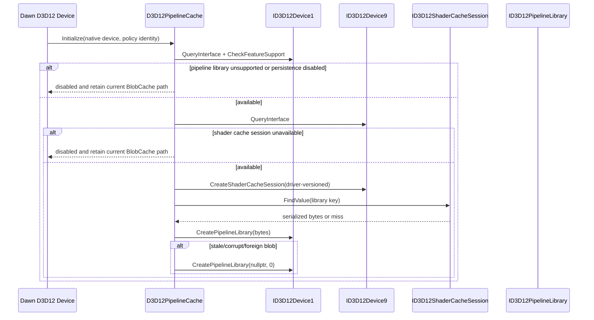
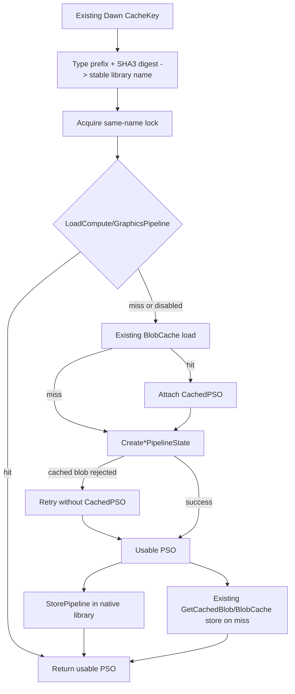
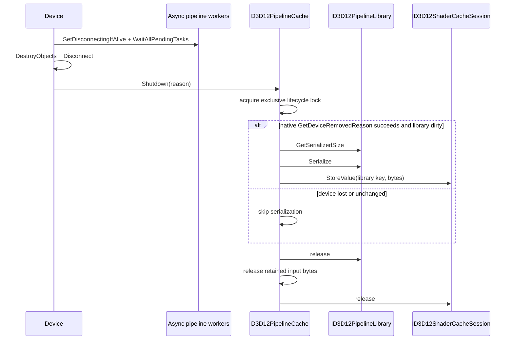

# Proposed Dawn D3D12 Native Pipeline Persistence

Status: proposal verified against Dawn source revision `78bed2e2dafe7dc2a1ffea8d197cb303eecb37ac` and T850 source on 2026-09-28. This design is not implemented in Dawn.

## Purpose

This document proposes adding `ID3D12PipelineLibrary` persistence to Dawn's own D3D12 backend, with `ID3D12ShaderCacheSession` as the driver-versioned backing store for the serialized library. The change is an internal D3D12 optimization: it does not alter WebGPU behavior, pipeline identity, shader translation, validation, or public API contracts.

Dawn already stores compiled artifacts and individual cached PSO blobs through its generic `BlobCache`. The proposal keeps that path intact and adds a library-first native restoration layer around the final D3D12 PSO creation step. On a native-library miss or unsupported runtime, Dawn follows its existing BlobCache and `Create*PipelineState` path unchanged.

The T850 measurements motivate a direct Dawn experiment, but do not predict its result. T850 and Dawn perform different validation, shader translation, layout construction, and cache operations. Only a same-revision Dawn A/B implementation can establish causality.

## Summary

The first implementation should:

1. add one device-owned `D3D12PipelineCache` coordinator;
2. open a driver-versioned `ID3D12ShaderCacheSession` when `ID3D12Device9` is available;
3. restore one serialized `ID3D12PipelineLibrary` from that session;
4. name entries with a stable digest of Dawn's existing D3D12 pipeline `CacheKey`;
5. try the library before Dawn's current per-key BlobCache path;
6. store every successfully created PSO into the library;
7. serialize only after async pipeline creation is quiescent;
8. preserve all current fallbacks and honor `disable_blob_cache` as the persistence kill switch.

Direct per-PSO `ID3D12ShaderCacheSession` storage is deliberately deferred. In the first patch the session persists the grouped library only, avoiding duplicate per-PSO writes alongside Dawn's existing BlobCache.

## Evidence and claim boundary

The equal-boundary benchmark measures ten usable compute pipelines in five independent processes per mode. The charts below are proxy evidence from T850, not measurements of a modified Dawn.

The measured workload is compute-only. Graphics PSOs, immediate-mask layout variants and mixed application workloads require separate Dawn measurements before generalizing any benefit.





| Observation | Meaning | Does not prove |
|---|---|---|
| Persisted Dawn WGSL was 18.341 ms on x64 versus 95.864 ms with callbacks off. | Dawn's current BlobCache is highly effective when the application provides persistence. | That BlobCache is incorrectly implemented. |
| T850 PipelineLibrary was 14.307 ms on x64 versus 15.533 ms for its per-PSO session. | Grouped driver-native restoration has measurable potential on the same adapter and workload. | That Dawn will recover the full 4.034 ms proxy gap. |
| T850 restored one 24,952-byte library; Dawn loaded 250 per-key blobs, about 425 KB. | The persistence granularity and call count differ materially. | That serialized byte count alone explains timing. |
| x64 and ARM64 retained the same ordering. | The opportunity is not isolated to one tested driver family. | Universal benefit across D3D12 devices. |

See [Shader management: equal-boundary pipeline-ready measurements](shader-management.md#equal-boundary-pipeline-ready-measurements) for provenance, ranges, driver-cache caveats, executable identity, and the full claim boundary.

## Current Dawn D3D12 flow

Source review revision: `78bed2e2dafe7dc2a1ffea8d197cb303eecb37ac`.

| Dawn file | Current responsibility |
|---|---|
| [`ComputePipelineD3D12.cpp`](https://github.com/google/dawn/blob/78bed2e2dafe7dc2a1ffea8d197cb303eecb37ac/src/dawn/native/d3d12/ComputePipelineD3D12.cpp) | Compiles the compute stage, creates the immediate-mask-specific root signature, builds `mCacheKey`, loads a cached PSO blob, and creates the compute PSO. |
| [`RenderPipelineD3D12.cpp`](https://github.com/google/dawn/blob/78bed2e2dafe7dc2a1ffea8d197cb303eecb37ac/src/dawn/native/d3d12/RenderPipelineD3D12.cpp) | Builds the complete graphics descriptor, root-signature variant and `mCacheKey`, then follows the same cached-PSO flow. |
| [`DeviceD3D12.cpp`](https://github.com/google/dawn/blob/78bed2e2dafe7dc2a1ffea8d197cb303eecb37ac/src/dawn/native/d3d12/DeviceD3D12.cpp) | Owns the native device and backend services; `Initialize` and `DestroyImpl` are the native cache lifetime boundaries. |
| [`BlobCache.cpp`](https://github.com/google/dawn/blob/78bed2e2dafe7dc2a1ffea8d197cb303eecb37ac/src/dawn/native/BlobCache.cpp) | Invokes application load/store callbacks, optionally validates a hash-prefixed payload, and returns an empty blob when callbacks or entries are absent. |
| [`PipelineLayoutD3D12.cpp`](https://github.com/google/dawn/blob/78bed2e2dafe7dc2a1ffea8d197cb303eecb37ac/src/dawn/native/d3d12/PipelineLayoutD3D12.cpp) | Caches root-signature variants selected by each pipeline's immediate mask. |

`ComputePipelineBase` and `RenderPipelineBase` initialize `mCacheKey` with the pipeline type and `device->GetCacheKey()`. The device key contains the Dawn version plus a hash of adapter information, enabled features, toggles and cache descriptor. The D3D12 implementations then append the final descriptor and serialized root-signature blob. Shader bytecode, fixed state, attachment formats, immediate-mask-specific root signature, backend/device policy and Dawn version therefore participate in the existing identity. The new layer should consume this key, not define a parallel descriptor schema.



### Current strengths to preserve

- One canonical pipeline key already includes pipeline type and Dawn version/backend/device policy through the device cache key.
- The final root-signature blob distinguishes immediate-mask layout variants.
- Cached-PSO driver mismatch already retries without failing pipeline creation.
- BlobCache callbacks remain embedding-controlled and work on backends other than D3D12.
- Compute and render pipeline creation already emit cache hit/miss histograms.

## Proposed ownership

Add an internal `D3D12PipelineCache` under `src/dawn/native/d3d12`. `Device` owns exactly one instance for its lifetime.



The coordinator owns:

- the `ID3D12ShaderCacheSession`;
- the `ID3D12PipelineLibrary`;
- the restored serialized byte vector for the entire library lifetime;
- synchronization for same-name loads and final serialization;
- hit, miss, store, rejection, byte-size and timing counters.

The serialized input cannot be a temporary `Blob`. `ID3D12Device1::CreatePipelineLibrary` retains the input pointer instead of copying it, so the backing vector must outlive the returned library object. T850 enforces this with `D3D12PipelineLibrary::m_serializedInput`.

## Proposed initialization flow



### Session descriptor

Use `D3D12_SHADER_CACHE_MODE_DISK` with `D3D12_SHADER_CACHE_FLAG_DRIVER_VERSIONED`.

| Field | Proposed value |
|---|---|
| `Identifier` | A deterministic GUID formed from the first 128 bits of `SHA3-224(fixed Dawn D3D12 namespace || adapter LUID bytes)`. This prevents two adapters from sharing one fixed library value. |
| `Version` | A 64-bit digest of Dawn version, native cache schema, and pipeline-library naming schema. Any incompatible Dawn change creates a fresh session. |
| `MaximumInMemoryCacheSizeBytes` | Start at 64 MB; expose only through internal constants and telemetry until evidence supports tuning. |
| `MaximumInMemoryCacheEntries` | Start at 4096, matching the successful T850 prototype. |
| `MaximumValueFileSizeBytes` | Start at 64 MB and reject/skip persistence when the serialized library exceeds the bound. |

`ID3D12ShaderCacheSession` requires Windows 10 build 20348 or later and `ID3D12Device9`. Failure to query or create it is an optimization miss, never device creation failure.

### Library feature detection

Require:

1. `ID3D12Device1`;
2. successful `CheckFeatureSupport(D3D12_FEATURE_SHADER_CACHE)`;
3. `D3D12_SHADER_CACHE_SUPPORT_LIBRARY`.

`CreatePipelineLibrary` failures caused by corrupt data, driver mismatch, adapter mismatch, or unsupported drivers must create a fresh empty library. If even the empty library fails, disable the native layer and keep Dawn's current path.

## Proposed pipeline creation flow

Insert the library lookup immediately after the existing `StreamIn(&mCacheKey, descriptor, rootSignatureBlob)` call in both pipeline files.



### Required ordering

1. Complete Dawn validation, shader compilation, immediate-mask calculation and root-signature selection.
2. Build the existing `mCacheKey` from the final descriptor and root-signature blob.
3. Try the native pipeline library.
4. On miss, execute Dawn's current BlobCache/CachedPSO path without semantic changes.
5. Store the resulting PSO in the library whether it came from a BlobCache hit or a cold native creation.
6. Preserve the current BlobCache store on a BlobCache miss.

This order lets a first process seed both the established fallback and the grouped library. A later library hit bypasses per-key callback traffic and cached-PSO creation while leaving all fallback evidence available.

### Stable entry names

`StorePipeline` requires unique string names and does not support overwrite. Use a name such as:

```text
DawnD3D12-C-<SHA3-224 of CacheKey bytes>
DawnD3D12-G-<SHA3-224 of CacheKey bytes>
```

The compute/graphics prefix prevents cross-type collisions. Dawn already has SHA3 utilities for BlobCache validation. Hash the full existing `CacheKey`; do not hash labels or pointer values.

The descriptor passed to `LoadComputePipeline` or `LoadGraphicsPipeline` must be the same final descriptor used to construct the key. D3D12 validates the name/descriptor pairing, providing a second defense against accidental identity drift.

## Concurrency

Dawn pipeline creation can run asynchronously, unlike T850's render-thread-affine implementation.

Microsoft documents the library as thread-safe for distinct PSOs, with one exception: threads loading the same named PSO must synchronize externally. The coordinator therefore needs:

- a per-name or striped lock around load/create/store for one digest;
- a lifecycle shared lock while pipelines use the library;
- an exclusive lifecycle lock during serialization and shutdown;
- an atomic dirty flag set after the first successful `StorePipeline`.

A single global mutex is acceptable for a correctness prototype but should not be the production default because it serializes unrelated async pipeline compilation. The first benchmark must report lock wait time and maximum concurrent pipeline creators.

Duplicate `StorePipeline` results should be classified carefully. With correct same-name locking they indicate either an existing entry or a hash/name logic defect. Do not treat arbitrary `E_INVALIDARG` as success without a confirming load.

## Shutdown and persistence

Serialize after Dawn has stopped admitting new async pipeline work and before the native device/cache objects are released.



`DeviceBase::Destroy` already calls `SetDisconnectingIfAlive()`, waits `mAsyncTaskManager->WaitAllPendingTasks()`, destroys device-owned objects, disconnects the GPU timeline, and only then invokes the backend `DestroyImpl`. The coordinator should therefore serialize near the beginning of `d3d12::Device::DestroyImpl`, before releasing native cache/device state. Add an assertion or test hook proving no pipeline operation holds a lifecycle shared lock at that point, and retain a teardown test that races async pipeline creation with explicit and implicit device destruction.

`DestroyReason` distinguishes early destruction from C++ destruction; it does not identify device loss. Before serialization, query `mD3d12Device->GetDeviceRemovedReason()`. Serialize only when it returns `S_OK`. The previous persisted library remains the recovery source; a loss-time partial library should not replace it. If normal process termination is not guaranteed, add periodic checkpoints only after the shutdown implementation is correct. The existing per-PSO BlobCache remains crash-tolerant fallback during the first phase.

Release ordering is strict: drain async work, acquire the exclusive lifecycle lock, serialize, release `ID3D12PipelineLibrary`, then release the retained input byte vector, and finally release `ID3D12ShaderCacheSession`. The input bytes must remain valid until the library has been released.

## Persistence and invalidation model

Three independent identities protect the cache:

1. the session namespace includes adapter LUID;
2. `D3D12_SHADER_CACHE_FLAG_DRIVER_VERSIONED` invalidates storage across driver changes;
3. the session version and each library name include Dawn/cache schema identity.

The runtime also validates a restored library and returns explicit corruption, driver-version, adapter, or unsupported errors. Every rejection must be counted, logged at debug level, and replaced with a fresh empty library.

The first implementation uses one library value per session. This is suitable for Dawn's common single GPU-process model, but concurrent processes or multiple devices can overwrite different supersets at shutdown. Before enabling by default for general native applications, choose and test one of:

- a cross-process writer policy;
- deterministic library shards;
- a bounded per-process library namespace;
- an embedding-provided merge/storage service.

`ID3D12PipelineLibrary` has no entry enumeration or merge API, so this is a real production constraint rather than a bookkeeping detail.

## Persistence policy and privacy

The native session creates disk persistence without application callbacks. It must not silently bypass an embedding application's no-persistence policy.

Initial rollout requirements:

- add device-stage toggles such as `use_d3d12_shader_cache_session` and `use_d3d12_pipeline_library`;
- keep both default-off during the experiment;
- make `disable_blob_cache` override and disable all new persistent native caches;
- check `disable_blob_cache` at coordinator initialization and return before querying `ID3D12Device1/9`, creating a session/library, or performing disk I/O;
- document browser private/incognito policy before any default-on change;
- leave non-D3D12 backends and browser-managed WebGPU caching unchanged.

No public WebGPU feature or limit is required. These are backend implementation toggles until policy and portability questions are resolved.

### Persistence alternatives to measure

The grouped library can be persisted in two ways:

| Backing | Advantage | Cost/risk |
|---|---|---|
| `ID3D12ShaderCacheSession` | Driver-versioned OS-managed storage; directly exercises the Microsoft-native stack demonstrated by T850. | Bypasses application load/store callbacks and therefore requires explicit embedding/privacy policy. |
| Existing Dawn BlobCache | Preserves callback ownership, isolation keys and existing embedding policy. | Does not test ShaderCacheSession; the application still owns storage and invalidation outside D3D12 runtime validation. |

The proposed first prototype uses ShaderCacheSession because that is the untested native opportunity. Before default enablement, benchmark a BlobCache-backed serialized PipelineLibrary as a policy-preserving control. Both variants must use the same library bytes, names and pipeline descriptors.

## Failure and fallback matrix

| Failure | Required behavior |
|---|---|
| `ID3D12Device9` unavailable | Disable native persistence; use current BlobCache path. |
| Shader cache session creation fails | Record capability/failure metric; use current path. |
| Pipeline library unsupported | Do not create/retain an otherwise unused session in phase 1; use current path. |
| Session library value absent | Create an empty library. |
| Serialized library corrupt or stale | Count rejection, discard retained bytes, create an empty library. |
| Named pipeline load misses | Continue through current BlobCache/CachedPSO path. |
| BlobCache cached PSO reports driver mismatch | Preserve current retry without `CachedPSO`. |
| `StorePipeline` returns `E_INVALIDARG` for an existing name | Count a duplicate-name result, optionally confirm with a same-name load in debug/testing, and return the already-created PSO. Do not turn it into a WebGPU error. |
| `StorePipeline` fails | Return the successfully created PSO; retain BlobCache fallback. |
| Library exceeds configured value limit | Skip persistence and report bytes/limit; never fail device shutdown. |
| Device lost | Skip library serialization and release cache objects safely. |
| `disable_blob_cache` enabled | Do not create a disk session or restored library. |

No cache error may change rendering output or turn a valid pipeline request into a WebGPU error.

## Why this layering makes sense

### It reuses Dawn's authoritative identity

The current key is built after shader compilation, final descriptor construction, immediate-mask root-signature selection, and attachment-state resolution. Reusing it avoids two competing definitions of pipeline equality.

### It preserves the established cache

BlobCache is portable, embedding-controlled and already handles more than final D3D12 PSOs. The native layer only optimizes the D3D12 PSO restoration point. A miss returns to proven code.

### It groups related driver data

Microsoft designed PipelineLibrary to reduce metadata and duplicate subcomponent storage across PSOs. T850's ten-pipeline proxy restored one 24,952-byte library instead of Dawn's 250 callback blobs for the measured process.

### It delegates driver compatibility to D3D12

ShaderCacheSession driver versioning and PipelineLibrary's adapter/driver validation are stronger than application guesses about driver blob compatibility.

### It limits first-patch complexity

Using ShaderCacheSession only for the serialized library avoids a second per-PSO cache competing with BlobCache. Direct session values can be evaluated later with independent evidence.

## Proposed Dawn file changes

| File | Change |
|---|---|
| `src/dawn/native/d3d12/D3D12PipelineCache.h/.cpp` | New coordinator wrapping ShaderCacheSession, PipelineLibrary, retained bytes, synchronization and metrics. |
| `src/dawn/native/d3d12/DeviceD3D12.h` | Own coordinator and expose a backend-only accessor. |
| `src/dawn/native/d3d12/DeviceD3D12.cpp` | Initialize after native-device acquisition; serialize/release during safe shutdown. |
| `src/dawn/native/d3d12/ComputePipelineD3D12.cpp` | Library lookup after `StreamIn`; store successful PSO; retain existing fallback. |
| `src/dawn/native/d3d12/RenderPipelineD3D12.cpp` | Same integration for graphics PSOs. |
| `src/dawn/native/Toggles.h/.cpp` | Add experimental device-stage toggles and policy descriptions. |
| `src/dawn/native/BUILD.gn` | Register new D3D12 files. |
| `src/dawn/native/CMakeLists.txt` | Register new D3D12 files. |
| D3D12 backend tests | Add unsupported, hit/miss, stale blob, concurrency, teardown and device-loss coverage. |

## T850 implementation references

T850 is a compact proof of API mechanics, not code to copy unchanged into Dawn.

| T850 reference | Lesson for Dawn |
|---|---|
| [`D3D12ShaderCacheSession.cpp`](../../T850/Framework/src/video/d3d12/D3D12ShaderCacheSession.cpp) | Query `ID3D12Device9`, create a disk/driver-versioned session, use two-stage `FindValue`, classify not-found/hash-collision as misses, and store cached PSO or arbitrary bytes. |
| [`D3D12PipelineLibrary.cpp`](../../T850/Framework/src/video/d3d12/D3D12PipelineLibrary.cpp) | Check library support, retain serialized input, reject stale input, load/store named compute and graphics PSOs, serialize into the session at shutdown. |
| [`D3D12Pipeline.cpp`](../../T850/Framework/src/video/d3d12/D3D12Pipeline.cpp) | Library-first graphics flow and safe fallback to per-PSO cached state. |
| [`D3D12Compute.cpp`](../../T850/Framework/src/video/d3d12/D3D12Compute.cpp) | Equivalent compute flow and deterministic persistent key. |
| [`D3D12Driver.cpp`](../../T850/Framework/src/video/d3d12/D3D12Driver.cpp) | Device-level initialization and shutdown order. |
| [`CapturePipelineReadyMatrix.ps1`](../../T850/scripts/CapturePipelineReadyMatrix.ps1) | Reproducible prime/on/off process matrix and structured hit/miss evidence. |

Differences Dawn must account for:

- Dawn creates pipelines asynchronously and needs same-name synchronization.
- Dawn already has a generic BlobCache and must preserve callback policy.
- Dawn supports multiple embedders and privacy modes.
- Dawn's existing key is richer than T850's compact persistent key and should remain authoritative.
- Dawn needs multi-device/process policy before default enablement.

## Telemetry

Add metrics separately for compute and graphics:

- session supported, created, disabled and failed;
- library restored, fresh, rejected and unsupported;
- library hit, miss, store and duplicate-name result;
- BlobCache hit after library miss;
- cold PSO creation after both misses;
- load, create, store, serialization and lock-wait microseconds;
- serialized bytes, named entries added and configured size limit;
- shutdown store skipped because unchanged, oversized or device-lost.

Keep the existing `D3D12.CreateComputePipelineState.CacheHit/CacheMiss` and graphics histograms so old/new paths remain comparable. Add a path classification such as `PipelineLibraryHit`, `BlobCacheHit`, or `ColdCreate`; do not collapse them into one generic hit.

## Rollout plan

### Phase 0: instrumentation and toggles

- Add toggles and path-specific metrics with no behavior change.
- Confirm current BlobCache hit/miss timing on x64 and ARM64.
- Add a two-process collision harness that opens the same session/library namespace and detects last-writer loss through expected-entry probes.
- Land benchmark plumbing before native cache behavior.

### Phase 1: compute-only prototype

- Add session/library coordinator.
- Integrate `ComputePipelineD3D12.cpp` only.
- Use a single library, shutdown serialization and default-off toggles.
- Run the exact ten-pipeline matrix used by the proxy.

### Phase 2: graphics integration

- Integrate `RenderPipelineD3D12.cpp` with the same key/name contract.
- Add mixed compute/graphics and immediate-mask/root-signature tests.
- Verify visual output and pipeline labels are unchanged.

### Phase 3: lifecycle hardening

- Race async same-key and distinct-key pipeline creation.
- Test explicit destroy, implicit final-reference destroy and device loss.
- Add bounded library size and multi-device/process policy.

### Phase 4: default policy decision

- Compare opt-in results across vendors and OS versions.
- Review Chromium/private-mode persistence requirements.
- Enable by default only where supported, beneficial and policy-compatible.

## Direct Dawn benchmark matrix

Use one Dawn revision and executable hash for all cells. Prime outside measured repetitions and run at least five new processes per cell.

| Mode | T850 source artifacts | Dawn BlobCache callbacks | ShaderCacheSession | PipelineLibrary |
|---|---|---|---|---|
| Current persistent baseline | warm | on | off | off |
| Current callback-off control | warm | off | off | off |
| Native library, callbacks retained | warm | on | on | on |
| Native library without callbacks | warm | off | on | on |
| PipelineLibrary persisted by BlobCache control | warm | on | off | on |
| Session only, optional later phase | warm | controlled | on | off |
| All application layers off | warm | off | off | off |

Record separately:

- shader preparation;
- shader module creation;
- pipeline-library lookup;
- BlobCache lookup;
- native PSO creation;
- library store/serialization;
- ten-pipeline total;
- process wall time;
- serialized bytes and hit/miss counts.

Windows D3DSCache is a separate layer. Either preserve it consistently in every cell or run a second driver-cold matrix that clears only the application-specific driver cache before every process. Never label a driver-warm control as fully uncached.

## Acceptance criteria

### Correctness

- All existing Dawn D3D12 tests pass with both toggles off and on.
- Compute and graphics output is byte-identical to the current path.
- Immediate-mask/root-signature variants never cross-hit.
- Unsupported runtimes and stale/corrupt libraries fall back without WebGPU errors.
- Device loss does not overwrite the last known-good library.
- `disable_blob_cache` causes zero native persistent-cache creation or I/O.

### Performance

- A primed new process reports named library hits for every controlled pipeline.
- Same-revision Dawn library mode is lower than Dawn BlobCache mode beyond observed run spread on at least one target before claiming benefit.
- No statistically material regression in cold creation, device initialization or process wall time.
- Async distinct-key creation is not serialized by a global lock in the production implementation.

### Evidence quality

- Capture executable/Dawn revision, adapter LUID, vendor/device, driver version, OS build, toggles and callback state.
- Preserve prime records and per-process hit/miss/store counters.
- Report median, range and raw runs; do not infer causality from the T850 proxy.
- Run x64 and native ARM64 where available.

## Known risks

| Risk | Mitigation |
|---|---|
| Serialized input lifetime violation | Keep bytes as a coordinator member until after library release. |
| Same-name async race | Per-name/striped synchronization around load/create/store. |
| Shutdown race | Stop admission, drain async work, then take exclusive lifecycle lock. |
| Driver/adapter/runtime mismatch | Driver-versioned session, Dawn versioned names, runtime validation, fresh-library fallback. |
| Unbounded monolithic library | Size telemetry, hard persistence limit, reset or deterministic sharding. |
| Cross-process last-writer loss | Keep experimental/default-off until a writer or sharding policy is proven. |
| Privacy-policy bypass | Make `disable_blob_cache` authoritative; review private-mode policy. |
| Duplicate disk writes | Session stores only the grouped library in phase 1; existing BlobCache remains the per-key fallback. |
| Proxy overclaim | Require direct Dawn A/B data before performance claims or default enablement. |

## Microsoft API references

- [`ID3D12Device9::CreateShaderCacheSession`](https://learn.microsoft.com/windows/win32/api/d3d12/nf-d3d12-id3d12device9-createshadercachesession)
- [`D3D12_SHADER_CACHE_SESSION_DESC`](https://learn.microsoft.com/windows/win32/api/d3d12/ns-d3d12-d3d12_shader_cache_session_desc)
- [`ID3D12ShaderCacheSession`](https://learn.microsoft.com/windows/win32/api/d3d12/nn-d3d12-id3d12shadercachesession)
- [`ID3D12Device1::CreatePipelineLibrary`](https://learn.microsoft.com/windows/win32/api/d3d12/nf-d3d12-id3d12device1-createpipelinelibrary)
- [`ID3D12PipelineLibrary`](https://learn.microsoft.com/windows/win32/api/d3d12/nn-d3d12-id3d12pipelinelibrary)
- [`ID3D12PipelineLibrary::Serialize`](https://learn.microsoft.com/windows/win32/api/d3d12/nf-d3d12-id3d12pipelinelibrary-serialize)
- [`ID3D12PipelineLibrary::StorePipeline`](https://learn.microsoft.com/windows/win32/api/d3d12/nf-d3d12-id3d12pipelinelibrary-storepipeline)

## Related documents

- [Shader management](shader-management.md)
- [WebGPU runtime summary](webgpu-runtime-summary.md)
- [GPU performance profiling workflow](gpu-performance-profiling-workflow.md)
- [GPU timestamp profiling](gpu-timestamp-profiling.md)
- [WebGPU compute remediation plan](webgpu-compute-remediation-plan.md)
- [Verification](../testing/verification.md)
