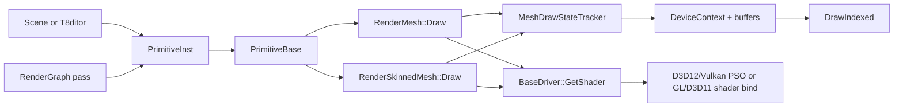
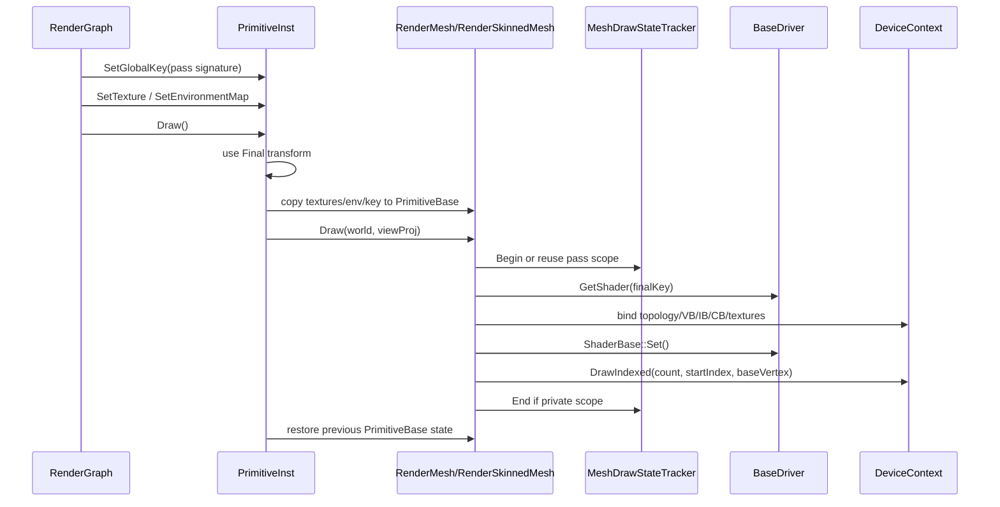
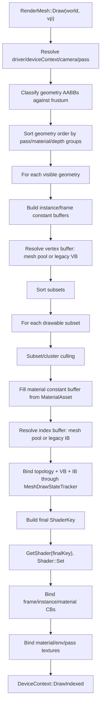
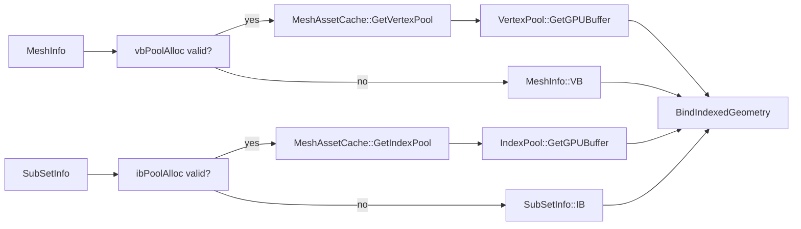
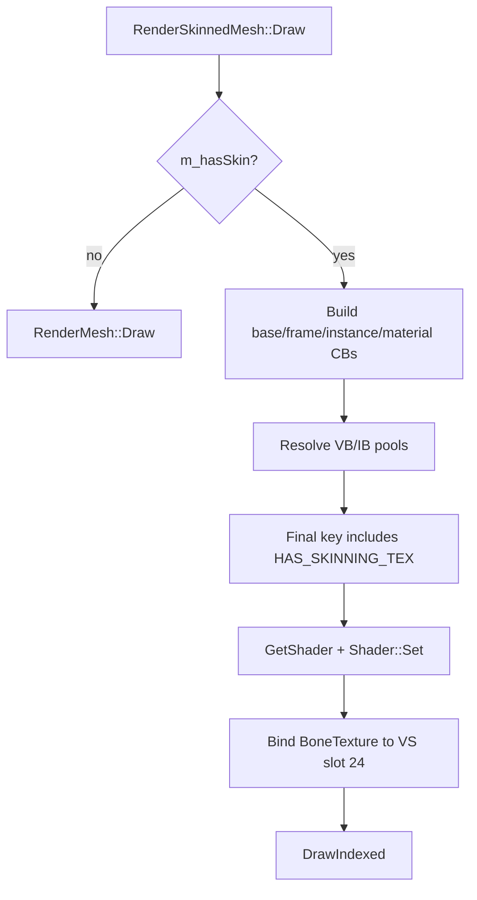

# Geometry Rendering Flow

Status: Stage 5 draft.

This document follows a mesh from scene/editor ownership through `PrimitiveInst`, `RenderGraph`, `RenderMesh` / `RenderSkinnedMesh`, state tracking, shader and PSO selection, vertex/index buffer binding, and the final API `DrawIndexed` call.

Related documents:

- [Loading geometry](../geometry/loading-geometry.md)
- [Dependency map](../dependency-map.md)
- [Shader management](shader-management.md)
- [Textures, samplers, and IBL](textures-and-ibl.md)
- [Render graph](render-graph.md)
- [Animation system](../animation/animation-system.md)

## Purpose and responsibilities

Geometry rendering is where per-instance scene state, shared mesh assets, material data, pass signatures, and backend API state meet.

The runtime path is still centered on `PrimitiveInst::Draw()` and `RenderMesh::Draw()` / `RenderSkinnedMesh::Draw()`. `RenderQueue` and `DrawItem` types exist as scaffolding for a future flat, sortable queue, but the current draw path still walks each `RenderMesh` instance directly.



## Key files and classes

| File/class | Role |
|---|---|
| `Framework/include/scene/PrimitiveInstance.h` | Per-scene instance wrapper: transform, visibility, global key, override textures, environment map, physics links. |
| `Framework/src/scene/PrimitiveInstance.cpp` | Composes transforms and bridges instance state into `PrimitiveBase::Draw()`. |
| `Framework/include/scene/PrimitiveBase.h` | Abstract render primitive interface and shared per-draw state fields. |
| `Framework/src/scene/RenderGraph.cpp` | Sets per-pass `ShaderKey` signatures and brackets multi-mesh pass scopes. |
| `Framework/src/scene/RenderMesh.cpp` | Static mesh draw path: culling, sorting, material CBs, shader selection, VB/IB binding, texture binding, draw calls. |
| `Framework/src/scene/RenderSkinnedMesh.cpp` | Skinned mesh draw path: bone texture, skinned shader variants, skinned wireframe/skeleton debug. |
| `Framework/include/scene/RenderQueue.h` | Future flat draw-list structures plus current `MeshDrawStateTracker` declaration. |
| `Framework/src/scene/RenderQueue.cpp` | State tracker implementation for deduping binds across a pass. |
| `Framework/include/scene/MeshPool.h` and `Framework/src/scene/MeshPool.cpp` | Shared vertex/index pool buffers used by mesh assets. |
| `Framework/include/video/BaseDriver.h` | `DeviceContext`, `VertexBuffer`, `IndexBuffer`, `ConstantBuffer`, `ShaderBase`, and driver interfaces. |
| API buffer/context files under `Framework/src/video/*` | Backend mappings for VB/IB bind, topology, constant buffers, and `DrawIndexed`. |

## High-level runtime flow



## `PrimitiveInst`: scene instance to primitive draw

`PrimitiveInst` is the per-scene wrapper around a shared `PrimitiveBase` implementation.

It stores:

- `pBase`: the concrete primitive (`RenderMesh`, `RenderSkinnedMesh`, `RenderQuad`, etc.).
- `pViewProj`: pointer to the view-projection matrix used for the draw.
- transform matrices: `Scale`, `RotationX`, `RotationY`, `RotationZ`, `Position`, and final `Final`.
- `gKey`: global pass/effect key supplied by the scene or render graph.
- per-instance override textures and environment map.
- visibility and physics/ragdoll handles.

`PrimitiveInst::Update()` composes the world matrix as:

```text
Final = Scale * RotationX * RotationY * RotationZ * Position
```

`PrimitiveInst::Draw()`:

1. Early-outs when not visible or no primitive is bound.
2. Saves the current mutable state on `pBase`.
3. Copies instance textures, environment map, global key, brightness, and parallax state into `pBase`.
4. Calls `pBase->Draw(&Final.m[0][0], &pViewProj->m[0][0])`.
5. Restores the previous `pBase` state.

The save/restore behavior allows several `PrimitiveInst` objects to reference the same primitive resource while still supplying per-instance draw state.

## RenderGraph bridge

`RenderGraph::ExecutePass()` sets the pass signature before each mesh draw:

1. `ResolveSignature(draw.signature)` creates a pass `ShaderKey`.
2. `extra_signatures` are OR'd into that key.
3. Each target `PrimitiveInst` receives `SetGlobalKey(sig)`.
4. `PrimitiveInst::Draw()` is called.
5. The instance is reset to a forward pass key afterward.

`RenderGraph` also opens a pass-scoped `MeshDrawStateTracker::Begin()` around multi-mesh draw sections and closes it with `End()`. This lets state dedupe survive across multiple `RenderMesh::Draw()` calls inside the same graph pass.

Without an outer pass scope, `RenderMesh::Draw()` and `RenderSkinnedMesh::Draw()` create a private tracker scope, preserving legacy per-draw behavior.

## Static mesh draw path

`RenderMesh::Draw()` is the main static geometry path.



### Pass and camera setup

`RenderMesh::Draw()` reads the current pass from `gKey.getPass()`. It uses `SceneProps::GetPrimaryCamera()` as the render camera, but can use `SceneProps::pCullingCamera` for GBuffer/Forward culling when available.

The draw path extracts frustum planes once per draw. It can classify geometry AABBs serially or in parallel through the engine thread pool when the mesh count is large.

### Culling and subset filtering

Static meshes use multiple levels of culling/filtering:

- geometry AABB frustum test,
- subset AABB frustum test when the parent geometry is intersecting,
- optional cluster culling for GBuffer when culling metadata is ready.

Subset pass rules:

- `GBUFFER`, `SHADOW_MAP`, and `RADIAL_DEPTH` draw only non-forward-only subsets.
- `FORWARD` draws only forward-only subsets.
- A subset is forward-only when `alphaMode == BLEND` or `transmissionFactor > 0`.

This is why transparent/transmission materials are drawn in a forward pass after deferred opaque work.

### Sorting

Geometry and subsets are sorted before drawing:

- Forward pass groups transmission before other transparent subsets and sorts by depth.
- GBuffer/shadow/radial-depth group opaque and masked subsets.
- Remaining ordering falls back to final shader key bits to reduce shader/PSO switches.

This is not yet a global scene-wide sort. It is per `RenderMesh::Draw()` call, with cross-instance state dedupe supplied by `MeshDrawStateTracker` when the render graph opens a pass scope.

## Material and constant buffers

Per geometry, `RenderMesh::Draw()` builds:

- `MeshInstanceCBuffer`: `WVP`, `World`, `WorldView`.
- `MeshFrameCBuffer`: light data, camera data, parallax settings, packed lights.
- `MeshMaterialCBuffer`: material parameters and UV transforms for the current subset.

Material data source:

1. Prefer `sub_info->matAsset` and `MaterialAsset::params/textures`.
2. Fall back to legacy `SubSetInfo` material fields if `matAsset` is missing.

On OpenGL, the path binds the legacy combined `RenderMesh::CBuffer` at slot 0. On D3D/Vulkan, the path binds split buffers:

- slot 0: frame data,
- slot 1: instance data,
- slot 2: material data.

`MeshDrawStateTracker::UpdateAndBindConstantBuffer()` compares the new data against the buffer's last system-memory copy. It updates and binds only when the contents or bound slot changed.

## Vertex and index buffer binding

The preferred runtime path uses shared mesh pools populated by `MeshAssetCache`:

- `MeshInfo::vbPoolAlloc` selects a `VertexPool`.
- `SubSetInfo::ibPoolAlloc` selects an `IndexPool`.
- `VertexPool::GetGPUBuffer()` / `IndexPool::GetGPUBuffer()` return the shared GPU buffers after explicit upload.
- Draw calls pass `offsetElems` values as `startIndex` and `baseVertex`.

Fallbacks still exist:

- `MeshInfo::VB` for legacy per-geometry vertex buffers.
- `SubSetInfo::IB` for legacy per-subset index buffers.

If no uploaded VB/IB can be resolved, the subset/geometry is skipped and an error is logged.



`MeshDrawStateTracker::BindIndexedGeometry()` dedupes:

- primitive topology,
- vertex buffer pointer/stride/offset,
- index buffer pointer/index format.

It calls:

- `DeviceContext::SetPrimitiveTopology()`,
- `VertexBuffer::Set()`,
- `IndexBuffer::Set()`.

## Shader selection and PSO resolution

For each drawable subset, `RenderMesh::Draw()` builds the final shader key:

1. Start from `SubSetInfo::key` (material features plus vertex-layout bits).
2. Set the global pass from `gKey.getPass()`.
3. OR low feature/toggle bits from `gKey`.
4. Add `PARALLAX` for `FORWARD` or `GBUFFER` when the subset has a height map and parallax is enabled.
5. Resolve the shader through `BaseDriver::GetShader(finalKey)`.

After `s->Set(*deviceContext)`:

- D3D11 binds VS/PS/input layout.
- OpenGL binds a linked program and enables shader-reflected attributes.
- D3D12 resolves and binds a PSO from shader, current RT formats, blend/depth/cull, and topology.
- Vulkan resolves and binds a graphics pipeline from shader, render pass/format, topology, vertex stride, blend/depth/cull.

`MeshDrawStateTracker::OnShaderChanged(s)` is called after shader bind. This invalidates cached texture and CB bindings when the shader changes, which is required because D3D12 texture/root-parameter mappings are per shader.

## Texture binding

Static mesh texture binding is feature-driven:

- If the shader key has `DIFFUSE_MAP`, bind base color to slot 0.
- If it has `NORMAL_MAP`, bind normal to slot 3.
- If it has `HEIGHT_MAP`, bind height/parallax to slot 5.
- Advanced PBR maps bind to the material texture slots described in the render graph and shader docs.

The graph/scene can also inject per-pass textures into `PrimitiveInst::Textures`, such as:

- scene depth (`Textures[7]`),
- scene color (`Textures[9]`),
- IBL/environment textures (slots 10-15).

For static meshes, `RenderMesh::Draw()` uses `MeshDrawStateTracker::ShouldBindTexture()` and `ShouldBindEnvMap()` to skip redundant texture binds across subsets and across mesh instances in a render-graph pass scope. Samplers are still set each time because the backend may need per-shader sampler-slot lookup.

## `DrawIndexed`

The final draw call uses one of three paths:

| Path | Call |
|---|---|
| Cluster culling path | `DrawIndexed(cluster.indexCount, subsetIndexOffset + cluster.indexOffset, vertexPoolOffset)` |
| Shared pool subset | `DrawIndexed(subsetIndexCount, subsetIndexOffset, vertexPoolOffset)` |
| Legacy fallback | `DrawIndexed(subset.NumVertex, 0, 0)` |

Backend mappings:

| Backend | Mapping |
|---|---|
| D3D11 | `ID3D11DeviceContext::DrawIndexed(indexCount, startIndex, baseVertex)` |
| D3D12 | `ID3D12GraphicsCommandList::DrawIndexedInstanced(indexCount, 1, startIndex, baseVertex, 0)` |
| OpenGL | `glDrawElements()` or `glDrawElementsBaseVertex()`; `startIndex` becomes a byte offset using the bound index format. |
| Vulkan | `vkCmdDrawIndexed(commandBuffer, indexCount, 1, startIndex, baseVertex, 0)` |

## Skinned mesh draw path

`RenderSkinnedMesh::Draw()` mirrors much of `RenderMesh::Draw()` but adds skinning requirements:

- If `m_hasSkin` is false, it falls back to `RenderMesh::Draw()`.
- It expects animation/bone update and bone texture upload to have happened before rendering.
- It uses the same mesh pool lookup and final key composition.
- The subset key includes `HAS_SKINNING_TEX`, which generates `USE_SKINNING_TEXTURE`.
- It binds the bone texture to vertex-shader slot 24 through `Texture::SetVS()`.

Differences from static meshes:

- The current path does not use static bind-pose AABB culling for skinned subsets because GPU-skinned vertices can move outside bind-pose bounds.
- Some texture binding still reads legacy `SubSetInfo` texture fields directly, although material constants are filled from `MaterialAsset` when available.
- The bone matrix data is sampled in `VS_Mesh.hlsl` from `BoneTexture`.



## State tracker and RenderQueue status

`RenderQueue` and `DrawItem` are present as Phase C scaffolding:

- `DrawItem` describes one dispatchable submesh draw with sort key, final shader key, pool references, material pointer, constant buffer pointer, and draw ranges.
- `RenderQueue` stores and sorts `DrawItem` entries.
- Its execution path is not wired yet; current rendering still happens through per-instance `RenderMesh::Draw()`.

`MeshDrawStateTracker` is the active optimization layer today. It tracks the last:

- shader,
- textures,
- environment map,
- constant buffers,
- vertex buffer and stride/offset,
- index buffer and format,
- topology.

It is process-wide and pass-scoped by `Begin()` / `End()`. D3D12 invariants are explicitly considered: `Shader::Set()` is still called each draw because PSO depends on current render state and RT formats, while the tracker only invalidates dependent caches when the shader changes.

## Wireframe and debug geometry

### Static mesh wireframe

`RenderMesh::DrawWireframe()`:

- requires `LineRenderer` and wire geometry buffers,
- uses the active scene camera,
- resolves the same shared vertex pool when available,
- uses per-geometry wireframe index buffers,
- draws through `LineRenderer::DrawLines()`,
- can bind primary/secondary depth textures for overlay depth testing.

### Skinned mesh wireframe

`RenderSkinnedMesh::DrawWireframe()`:

- uses a dedicated wire shader with skinning bits,
- binds the shared vertex pool or fallback VB,
- binds per-geometry wireframe IBs as `LINE_LIST`,
- binds constant buffers and bone texture,
- optionally binds GBuffer depth textures for manual depth comparison,
- calls `DrawIndexed()` with the wire index count and base vertex.

### Skeleton debug

`RenderSkinnedMesh::DrawSkeleton()`:

- updates CPU skeleton line positions from the current animated pose,
- uploads the skeleton VB,
- draws grey base skeleton lines plus optional highlighted bone sets through `LineRenderer`,
- disables depth testing for the skeleton overlay.

## Extension points

When extending geometry rendering:

1. Add or reuse a `ShaderKey` bit for new compiled shader behavior.
2. Ensure `RenderMesh::GatherInfo()` / `RenderSkinnedMesh` compiles that key for every needed pass.
3. Feed per-instance state through `PrimitiveInst` or through a future `RenderEntity`/`DrawItem`.
4. Add material parameters to `MaterialAsset` and update constant-buffer fill code.
5. Add texture slots consistently across `MaterialAsset`, render graph resource binding, shader registers, and draw binding code.
6. If the feature changes vertex layout, update import, `SubSetInfo`/`MeshInfo`, shader input, and API reflection assumptions.
7. If batching is the goal, continue wiring `RenderQueue::Execute()` instead of adding more per-instance loops.

## Known limitations and gotchas

- `RenderQueue` is not the active executor yet; state dedupe is handled by `MeshDrawStateTracker`.
- `PrimitiveInst::Draw()` mutates and restores shared `PrimitiveBase` state, so missing restore logic can leak state between instances.
- `PrimitiveInst::SetTexture()` does not bounds-check the texture slot.
- `RenderMesh` still carries legacy VB/IB and material fields as fallbacks.
- Skinned meshes do not currently perform conservative animation-aware frustum culling.
- `Shader::Set()` must still be called for every subset/draw on D3D12/Vulkan because PSO/pipeline state depends on render state and RT formats.
- Unknown or uncompiled final shader keys cause `GetShader` misses and skipped subsets.
- Mesh pool accessors return null and log when pools are dirty or not uploaded.
- GL shared-pool drawing with nonzero base vertex relies on `glDrawElementsBaseVertex()` on the desktop GL path.

## Debugging checklist

1. Confirm `PrimitiveInst::Visible`, `pBase`, and `pViewProj` are valid.
2. Confirm `PrimitiveInst::Update()` was called after transform edits.
3. Log `gKey.bits` and `gKey.getPass()` before draw.
4. Check `ShouldDrawSubsetInPass()` expectations for alpha/transmission materials.
5. Check `MeshInfo::vbPoolAlloc` and `SubSetInfo::ibPoolAlloc`; if invalid, confirm legacy `VB`/`IB` exist.
6. Look for `[RenderMesh] Skipped geometry/subset: no uploaded vertex/index buffer`.
7. Check `MaterialAsset*` and fallback `SubSetInfo` material fields.
8. Check `BaseDriver::GetShader(finalKey)` misses.
9. For D3D12/Vulkan, inspect PSO/pipeline creation logs if `Shader::Set()` succeeds but drawing fails.
10. For texture issues, verify feature bits in `s->key` match the texture slots actually bound.
11. For culling issues, temporarily disable frustum culling or check geometry/subset/cluster bounds.
12. For skinned meshes disappearing, remember bind-pose bounds are not conservative for GPU skinning and the current skinned path avoids subset AABB culling.
