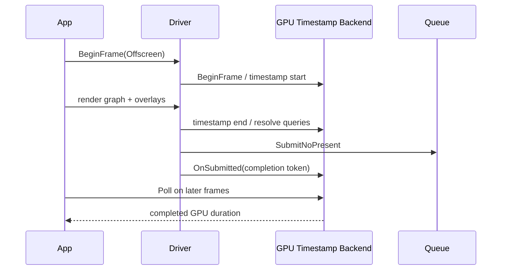

# GPU Timestamp Profiling

Status: whole-frame profiling is implemented for D3D12, Vulkan, and native
Dawn/WebGPU as an opt-in build. Local x64 Release validation passed on all three
backends. Flat logical render-graph pass timing is also implemented on all three.
The final 1920x1080 held-frame pass matrix used five 600-frame repetitions for
all six cells on each x64 and ARM64 host. Each host retained 18,000 frame
batches and 450,000 frame/pass samples with zero accepted-run drops or failures.
External correlation, perturbation measurement, and device-loss stress remain
completion gates.

## Purpose

Provide comparable GPU execution timings for D3D12, Vulkan, and WebGPU without
DWM, PresentMon, CPU command-recording time, or queue-drain wall time in the
reported duration. The first required metric is whole-frame GPU time for the
same deterministic offscreen workload. Logical render-graph pass timings are the
second stage.

This is deliberately opt-in profiling instrumentation. Its CPU and GPU overhead
is acceptable during profiling, must be measured and disclosed, and must compile
out of normal builds.

## Goals

1. Measure GPU timestamps around a complete submitted frame on D3D12, Vulkan,
   and WebGPU.
2. Measure logical render-graph passes with one API-neutral region identity.
3. Resolve results asynchronously and recycle query storage only after actual
   GPU completion.
4. Run with `SubmitNoPresent` so compositor and swapchain pacing cannot enter the
   measurement.
5. Emit machine-readable per-frame samples, validity, completion latency, and
   dropped-sample counts.
6. Keep CPU profiling and upload telemetry independent from GPU timestamp
   profiling.

## Non-goals

- OpenGL support.
- D3D11 acceptance or modernization; its existing profiler remains legacy.
- Per-draw timestamps.
- Treating summed pass durations as whole-frame GPU time.
- Measuring CPU overhead with GPU profiling enabled.
- Making WebGPU rendering depend on timestamp-query support.
- Browser pass timestamps when the browser does not implement
   `GPUCommandEncoder.writeTimestamp`; browser throughput is measured separately.

## Implemented State

| Backend | Whole-frame implementation | Remaining work |
|---|---|---|
| D3D12 | Per-batch timestamp ranges resolve to readback and map only after the exact submission fence completes. Each logical pass has an `EndQuery` pair. | External correlation and perturbation measurement. |
| Vulkan | Per-batch queries use submission serial/fence completion, nonblocking reads, timestamp-period conversion, valid-bit masking, and pass timestamp pairs. | Broader device coverage and external correlation. |
| WebGPU | `TimestampQuery`, resolve/copy buffers, `OnSubmittedWorkDone`, asynchronous `MapAsync`, `ProcessEvents` polling, and logical pass pairs. Native Dawn enables `allow_unsafe_apis` only for an active profiling run because encoder `WriteTimestamp` requires it in the pinned package. | Feature-negative hardware coverage, device-loss stress, and browser decision. |
| Shared profiler | Bounded completion-driven batch ring, explicit drops/failures, dedicated JSON, deterministic transition/reset/stale-callback tests, and stable named pass regions. | Pending-callback teardown stress. |

Timestamp capture arms at the deterministic benchmark hold rather than asset
load. The log records `[GpuTimestamp] armed workloadFrame=<N>` so evidence must
prove that the first sample belongs to the requested held scene state.

The pinned Dawn headers expose the required native APIs:

- `wgpu::FeatureName::TimestampQuery`;
- `wgpu::Device::CreateQuerySet`;
- `wgpu::CommandEncoder::WriteTimestamp`;
- `wgpu::CommandEncoder::ResolveQuerySet`;
- `wgpu::PassTimestampWrites` on render/compute pass descriptors.

## Build and Runtime Gates

### Compile-time define

Add a separate define; do not reuse `T850_ENABLE_PROFILING`:

```text
T850_ENABLE_GPU_PROFILING=0|1
```

Defaults:

| Build system | Property/option | Default |
|---|---|---:|
| MSBuild | `T850EnableGpuProfiling` in `Directory.Build.props` | `0` |
| CMake | `T850_ENABLE_GPU_PROFILING` | `OFF` |
| Emscripten | inherited CMake option | `OFF` |

When disabled:

- query allocation, query writes, resolve copies, callbacks, and GPU sample
  storage compile out;
- normal device feature requests are unchanged;
- GPU-profile CLI requests fail before asset loading with a named diagnostic;
- existing CPU profiling and upload telemetry retain their current behavior.

### Runtime selection

Add an explicit mode rather than overloading `--profile`:

```text
--profileGpu
--profileGpuFrames <N>
--profileGpuOutput <path>
--profileGpuPasses whole-frame|render-graph
```

`--profileGpu` requires `T850_ENABLE_GPU_PROFILING=1`. A GPU-only run must not
implicitly enable CPU scope reporting or runtime telemetry. `--profileCpuOnly`
and `--profileGpu` are mutually exclusive in the first implementation.

For WebGPU, request `timestamp-query` only when all are true:

1. `T850_ENABLE_GPU_PROFILING=1`;
2. `--profileGpu` is active before device creation;
3. `adapter.HasFeature(wgpu::FeatureName::TimestampQuery)` is true.

If unavailable, the profiling command exits as unsupported. Ordinary WebGPU
rendering still creates a device without the feature and remains unaffected.

## API-neutral Architecture

Do not extend arbitrary nested `Profiler` scopes directly. Introduce a dedicated
GPU recorder whose data model matches asynchronous GPU submissions:

```cpp
using GpuProfileRegionId = uint16_t;
using GpuProfileFrameId = uint64_t;

enum class GpuProfileGranularity {
  WholeFrame,
  RenderGraphPasses,
};

class GpuTimestampBackend {
public:
  virtual GpuTimestampCapabilities Capabilities() const = 0;
  virtual bool BeginFrame(GpuProfileFrameId frame) = 0;
  virtual void BeginRegion(GpuProfileRegionId region) = 0;
  virtual void EndRegion(GpuProfileRegionId region) = 0;
  virtual void EndFrame() = 0;
  virtual void OnSubmitted(const GpuSubmissionToken& token) = 0;
  virtual void Poll(std::vector<GpuTimestampSample>& completed) = 0;
  virtual bool Drain(std::chrono::milliseconds timeout,
                     std::vector<GpuTimestampSample>& completed) = 0;
};
```

Exact signatures may follow repository style, but the semantics are required.
`GpuSubmissionToken` is backend-owned: a D3D12 fence value, Vulkan fence/serial,
or WebGPU completion/map state. The shared layer must never infer completion from
"three frames elapsed."

### Query batch state

Each backend owns a bounded ring of query batches:

```text
Free -> Recording -> Submitted -> ResultsPending -> Ready -> Free
                                  \-> Failed
```

Each batch records:

- frame ID and generation;
- adapter/backend identity;
- region IDs and query indices;
- number of issued/resolved queries;
- submission token;
- completion latency in frames and milliseconds;
- failure/unavailable reason.

If every batch is pending, drop the new sample and increment an explicit counter.
Never block the frame path to obtain a free query batch.

## Measurement Boundaries

### Stage 1: whole-frame GPU time

This is the minimum feature needed to answer the ARM64 comparison correctly.



The start timestamp is the first GPU command in the measured frame. The end
 timestamp is after the last render/compute/copy command that belongs to the
frame and before query resolution. Resource creation, shader compilation,
readback mapping, `WaitForGPU`, and report serialization are outside the interval.

### Stage 2: logical render-graph pass time

Implemented and validated on D3D12, Vulkan, and native Dawn/WebGPU. The central
`RenderGraph::Execute` loop brackets every executed `ExecutePass` call, including
compute-selected passes, graphics fallbacks, empty nodes, and generated shadow
nodes. Region names are graph-node names and remain in execution order.

Register immutable IDs when `RenderGraph::BuildGraph()` creates nodes. Bracket
`RenderGraph::ExecutePass()` through driver-neutral hooks. Regions are flat and
non-overlapping in execution order. CPU-only scopes remain separate.

WebGPU may close an active physical render pass before an end timestamp can be
written. This is allowed only in the profiling build. Record whether one logical
pass generated multiple native render passes. Do not pretend that physical-pass
splits are free or identical across APIs.

Use encoder-level timestamps outside active passes for the logical region where
supported by the pinned Dawn API. `wgpu::PassTimestampWrites` may be used for
physical render/compute-pass diagnostics, but it is not the canonical cross-API
logical-pass metric.

The accepted scope is the primary scene frame command list/command buffer.
Separate initialization, upload, one-shot copy, and standalone compute
submissions are not individual render-graph rows. Work recorded on the measured
frame command list outside a graph node appears in `gpu.frame` but not a named
pass. Dawn closes an active physical pass at each logical timestamp boundary;
this instrumentation cost is explicit and is why pass-level Dawn results must
be compared within pass-profile mode.

## Backend Design

### D3D12

Key files:

- `Framework/src/debug/ProfilerGpuBackend.cpp`;
- `Framework/src/video/d3d12/D3D12Driver.cpp`;
- `Framework/include/video/d3d12/D3D12Driver.h`.

Required implementation:

1. Allocate timestamp query ranges per query batch, not by fixed frame modulo.
2. Write start/end timestamps with `EndQuery` on the direct command list.
3. Resolve the used range into a readback buffer before submission.
4. Associate the batch with the exact fence value signaled after the command
   list containing `ResolveQueryData` executes.
5. Poll `ID3D12Fence::GetCompletedValue`; map only completed ranges.
6. Obtain frequency from the same command queue with
   `GetTimestampFrequency`.
7. Never use swapchain/backbuffer index as the profiling batch index in
   no-present mode.

The existing implementation can be refactored rather than duplicated, but its
fixed `kFrameDelay` readback contract must be removed for accepted measurements.

### Vulkan

Key files:

- `Framework/src/debug/ProfilerGpuBackend.cpp`;
- `Framework/src/video/vulkan/VulkanDriver.cpp`;
- `Framework/include/video/vulkan/VulkanDriver.h`.

Required implementation:

1. Reject devices/queues whose relevant queue family reports
   `timestampValidBits == 0`.
2. Allocate/reset query ranges per completion-tracked batch.
3. Prefer `vkCmdWriteTimestamp2` with explicit stage masks when synchronization2
   is available; retain a reviewed legacy fallback.
4. Associate each batch with the submission fence that owns its command buffer.
5. Poll fence status, then call `vkGetQueryPoolResults` without
   `VK_QUERY_RESULT_WAIT_BIT`.
6. Convert ticks using `VkPhysicalDeviceLimits::timestampPeriod` and handle
   valid-bit masking/wrap correctly.
7. Keep calibrated timestamps diagnostic-only; they are not needed for elapsed
   GPU duration.

The accepted implementation removes the current frame-thread blocking read.

### WebGPU / Dawn

Key files:

- `Framework/src/video/webgpu/WebGPUContext.cpp/.h`;
- `Framework/src/video/webgpu/WebGPUDriver.cpp/.h`;
- `Framework/src/debug/ProfilerGpuBackend.cpp` or a new focused source file.

Required implementation:

1. Conditionally request `wgpu::FeatureName::TimestampQuery` before device
   creation and log requested/actual support.
2. Create a `wgpu::QuerySet` with `wgpu::QueryType::Timestamp`.
3. Allocate one query-resolve buffer (`QueryResolve | CopySrc`) and one staging
   buffer (`CopyDst | MapRead`) per pending batch, or completion-safe pooled
   equivalents.
4. Write encoder timestamps for whole-frame/logical-region boundaries.
5. Resolve the used query range and copy it to the map-read buffer before
   `commands.Finish()`.
6. Submit normally with `SubmitNoPresent` for the benchmark.
7. Use `Queue::OnSubmittedWorkDone` and `Buffer::MapAsync`; callbacks update
   lifetime-safe batch state only.
8. Progress callbacks through the existing `instance.ProcessEvents()` path.
   Never call `WaitAny` or `WaitForGPU` from the per-frame polling path.
9. Read results only after map success, unmap, then recycle the batch.
10. Treat WebGPU timestamp values according to the pinned Dawn/WebGPU contract;
    add a focused numerical sanity test rather than assuming another backend's
    frequency model.

Device loss, shutdown, resize, and API recreation must invalidate callbacks by
shared lifetime/generation state. Late callbacks must not access a destroyed
profiler, query set, or buffer.

## Output Schema

Write a separate JSON artifact; do not overload CPU telemetry version 2.

```json
{
  "schema": 1,
  "mode": "gpu-timestamps",
  "api": "webgpu",
  "provider": "Dawn",
  "backend": "D3D12",
  "adapterId": "...",
  "granularity": "whole-frame",
  "timestampUnit": "nanoseconds",
  "framesRequested": 600,
  "framesValid": 598,
  "framesDropped": 0,
  "framesFailed": 0,
  "samples": [
    {
      "frame": 3001,
      "region": "gpu.frame",
      "gpuMs": 15.42,
      "completionLatencyFrames": 3,
      "valid": true
    }
  ]
}
```

Also record:

- compile-time define value;
- requested and actual feature/capability;
- query capacity and maximum pending batches;
- timestamp period/unit and valid bits where applicable;
- work counters (`gpu.draws`, `gpu.indices`, `render.pass.count`, dispatch count);
- exact executable and shader-flow identity;
- no-present status.

Unavailable, dropped, disjoint, wrapped, and device-lost samples are distinct
states, never zero-duration samples.

## Implementation Phases and Effort

Estimates assume one engineer familiar with the renderer and include focused
implementation tests, but not broad release certification.

| Phase | Deliverable | Estimate |
|---|---|---:|
| 0 | Define/property/CLI/config validation and JSON schema | 0.5-1 day |
| 1 | Shared completion-driven recorder, batch ring, fake-backend tests | 2-3 days |
| 2 | D3D12 fence-qualified whole-frame timestamps | 1-2 days |
| 3 | Vulkan nonblocking whole-frame timestamps and valid-bit handling | 1.5-2.5 days |
| 4 | WebGPU feature request, query resolve/copy/map callback pipeline | 3-5 days |
| 5 | Deterministic no-present comparison harness and ARM64 validation | 1.5-2.5 days |
| 6 | Logical render-graph pass IDs and pass-level timings on all three | 2-4 days |
| 7 | Documentation, report integration, device-loss/resize stress | 1-2 days |

Expected totals:

- whole-frame MVP on D3D12 + Vulkan + native WebGPU: **9.5-16 days**;
- pass-level completion and hardening: **12.5-22 days** total.

The WebGPU asynchronous lifetime work and Vulkan completion refactor are the
largest uncertainty. A D3D12-only prototype is not an accepted architectural
milestone because it would not validate the shared contract.

## Verification

### Shared deterministic coverage

The shared self-test covers:

- batch state transitions;
- no reuse before completion;
- out-of-order completion;
- generation reset and stale callback rejection;
- dropped sample when the ring is full;
- ready/failed terminal accounting;
- valid-bit timestamp wraparound;
- JSON escaping for authored region names.

Still required are backend-level feature-negative initialization, shutdown with
pending Dawn callbacks, and device-loss/API-recreation stress.

### Build gates

Build both define states:

```powershell
msbuild T850.sln /t:Framework`;DayScene /p:Configuration=Release /p:Platform=x64 /p:T850EnableGpuProfiling=0
msbuild T850.sln /t:Framework`;DayScene /p:Configuration=Release /p:Platform=x64 /p:T850EnableGpuProfiling=1
```

Equivalent CMake configurations are supported but still require an explicit
ON/OFF closeout run:

```powershell
cmake -S . -B build/gpu-profile-off -DT850_ENABLE_GPU_PROFILING=OFF
cmake -S . -B build/gpu-profile-on  -DT850_ENABLE_GPU_PROFILING=ON
```

The default-OFF MSBuild configuration and ordinary WebGPU feature isolation have
passed. A retained binary/string/symbol check for both CMake states remains open.

### Runtime gates

For each of D3D12, Vulkan, and WebGPU:

1. run the same Release executable configuration, scene, resolution, fixed
   frame, shader flow, raster/compute selection, and work counters;
2. use `--benchmarkNoPresent` and verify zero presents;
3. collect at least 600 requested whole-frame timestamp samples;
4. require at least 95% valid samples after warmup and zero unexplained drops;
5. drain pending batches at bounded shutdown and require all accepted samples;
6. retain raw JSON and logs.

Feature-negative tests:

- GPU profiling compiled out;
- WebGPU timestamp feature forced unavailable;
- Vulkan queue family with no valid timestamp bits, if available, otherwise a
  mocked capability rejection;
- device loss/API recreation with pending callbacks;
- resize/surface recreation while profiling.

### Measurement validation

Use three complementary checks:

1. **Ordering:** GPU timestamps are positive, finite, and begin/end ordering is
   valid.
2. **Bounds:** whole-frame GPU duration is no greater than GPU-drained completed
   wall time for the same frame batch, within timer/aggregation tolerance.
3. **External correlation:** PIX/RenderDoc or ETW on one D3D12 and one Vulkan
   run confirms approximate frame/pass duration and queue identity. PresentMon
   is not the oracle for no-present runs.

Measure profiling perturbation with the same binary/source in alternating runs:

- define OFF baseline;
- define ON, runtime GPU profiling disabled;
- define ON, whole-frame timing enabled;
- define ON, pass timing enabled.

Report CPU and completed-throughput deltas, but do not subtract overhead from GPU
samples. Target less than 1% median completed-throughput perturbation for
whole-frame mode; if exceeded, record the measured overhead and do not hide it.

## Acceptance Criteria

Whole-frame GPU profiling is complete only when:

- the opt-in define defaults OFF and compiles query code out;
- D3D12, Vulkan, and native WebGPU produce timestamp-derived `gpu.frame` samples;
- all three use actual completion, not fixed frame delay;
- no frame-path wait is used to resolve query data;
- WebGPU ordinary rendering does not request `timestamp-query`;
- deterministic no-present workload counters match within raster/compute peers;
- at least 95% of post-warmup samples are valid with explicit drop/failure counts;
- bounded final drain succeeds;
- external correlation and perturbation results are retained;
- the ARM64 report clearly distinguishes GPU timestamp duration from CPU and
  completed-throughput time.

Pass-level functional acceptance passed with matching logical pass names across
all three backends. Final x64 and ARM64 evidence contains 24 named pass rows plus
`gpu.frame` for all six D3D12/WGSL/SPIR-V raster/compute cells. Cross-machine
analysis SHA-256:
`ED876FEC95D4BE99CCCEF6677A03BFA1C1500BCACB944EC2FA31B2286DF59DD9`.
Because Dawn pass profiling closes physical passes at logical boundaries,
whole-frame-only comparison and perturbation measurement remain required before
closing the overall validation item.

## Risks and Decisions

| Risk | Decision |
|---|---|
| WebGPU feature unavailable | Profiling command reports unsupported; rendering remains available. |
| Async callbacks outlive device/profiler | Shared generation/lifetime state; callbacks never capture raw owner pointers. |
| Query backlog | Bounded batches, explicit drop counter, no blocking allocation. |
| Vulkan query read stalls | Fence/status poll and no `WAIT_BIT`. |
| D3D12 stale readback | Map only after owning fence completes. |
| Timestamp quantization/security behavior | Record actual capability/unit and validate numerically on pinned Dawn. |
| Instrumentation changes pass boundaries | Whole-frame stage first; disclose forced WebGPU pass closure in pass mode. |
| Backend throughput mistaken for GPU execution | Timestamp JSON is canonical; CPU/completed throughput remain separate fields. |

## Implementation Files

Core contract and configuration:

- `T850/Directory.Build.props`;
- `T850/Framework/CMakeLists.txt` and applicable platform CMake helpers;
- `T850/Framework/include/core/Config.h`;
- `T850/Framework/src/utils/ConfigRuntime.cpp`;
- `T850/Framework/include/debug/GpuTimestampProfiler.h`;
- `T850/Framework/src/debug/GpuTimestampProfiler.cpp`.

Backend integration:

- D3D12 driver header/source for submission fence tokens;
- Vulkan driver header/source for submission fence tokens and timestamp limits;
- WebGPU context/driver header/source for feature request, query resources,
  resolve/copy/map, callback lifetime, and submission completion;
- `RenderGraph.cpp` for logical pass regions.

Tests and workflow:

- `GameSelfTest.cpp` fake-backend tests;
- `GameSelfTest.cpp` for batch, wraparound, and JSON regression coverage;
- the Windows GPU benchmark skill scripts;
- diagnostics, runtime configuration, and profiling workflow documentation.

## Stop Conditions

Stop and classify rather than weakening the gate when:

- the target adapter does not expose timestamp queries;
- query timestamps are unavailable on the queue used for rendering;
- work counters do not match;
- sample validity falls below 95%;
- query backlog causes unexplained drops;
- any backend requires a per-frame CPU wait to obtain results;
- external correlation differs materially without an identified queue/boundary
  explanation.

## Related Documents

- [Reproducible GPU performance profiling workflow](gpu-performance-profiling-workflow.md)
- [Diagnostics and profiling](../debug/diagnostics.md)
- [WebGPU/compute remediation plan](webgpu-compute-remediation-plan.md#r21-implement-opt-in-cross-backend-gpu-timestamp-queries)
- [Render graph](render-graph.md)
- [Runtime configuration](../development/runtime-configuration.md)
- [Verification](../testing/verification.md)
