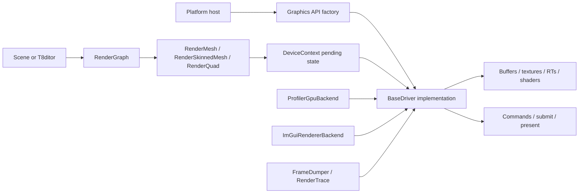
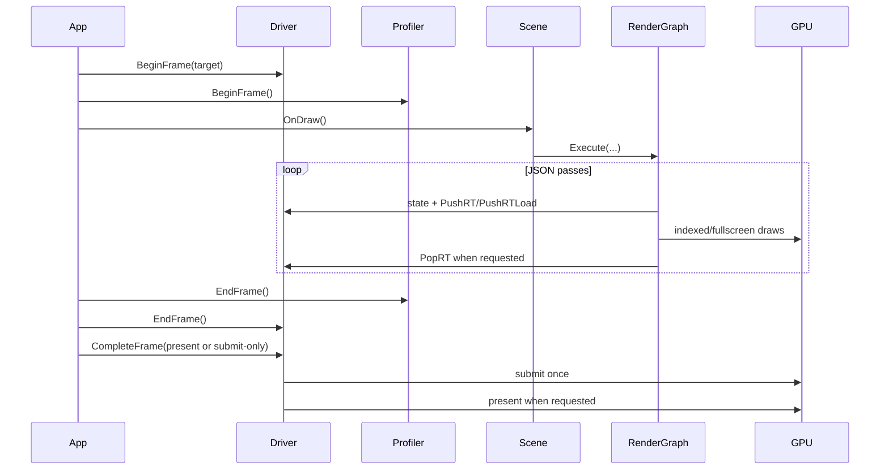
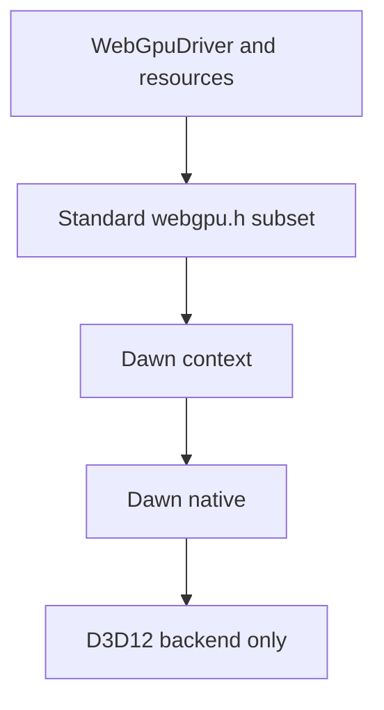
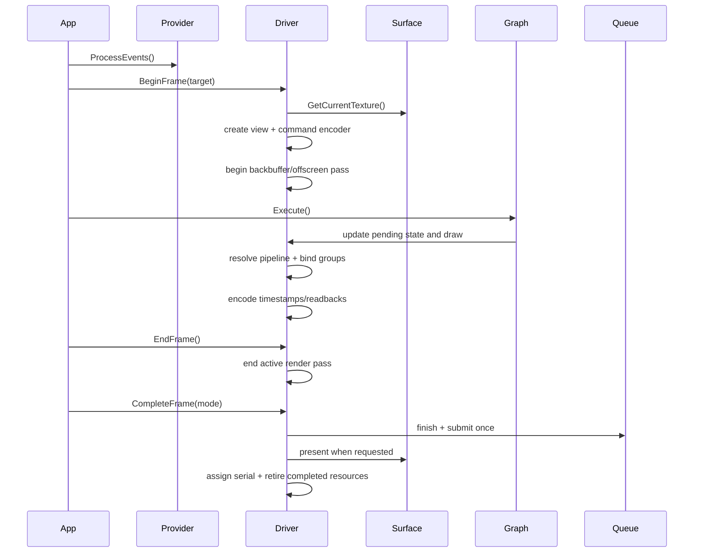
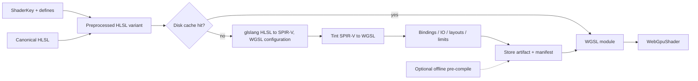

# WebGPU Graphics Backend Proposal

## Current Runtime Status

2026-09-15 close-out: Windows x64 Dawn/D3D12 supports normal forward and deferred
DayScene runtime rendering. Both default WGSL-first and strict HLSL/SPIR-V/Tint
flows captured all ten available cases. Compiler matrix, mutable float texture,
no-environment binding and SSAO kernel defects are fixed. The final strict
capture matrix has 28 captures, five documented skips and no capture failures;
image differences remain and are reported separately from capture success.
The reviewed Ragdoll SSAO and Quake3 isolated-pixel cases are accepted visual
exceptions, without changing the automated tolerance. Editor, shared compute,
profiling and new platform ports remain outside this runtime close-out.

See the [full runtime handoff](webgpu-runtime-summary.md) for implementation,
verification, exact scene metrics, native regression caveats and remaining work.

## Historical Milestones

The dated entries below describe their checkpoints, not current blockers.

2026-09-15 initial strict-SPIR-V visual validation: nine normal scene cases completed
capture but all nine failed native-D3D12 image comparison; 95/127 target pairs
exceeded tolerance. VoxelScene failed at texture binding 6. Direct-WGSL controls
and repeat runs isolate reproducible additional translated-rendering problems;
successful compiler tests do not close scene parity. See
[WGPU-RENDER-03 and paired-image evidence](shader-management.md#open-follow-up-translated-shader-rendering).

2026-09-15 derivative-uniformity follow-up: corrected demonstrated single-mip
sampling and gradient/control-flow issues in HLSL and WGSL without suppressing
validation. Both paths pass the 514-stage recorded corpus; normal forward and
Sandbox startup now complete in strict SPIR-V mode. Native D3D12/Vulkan references
were captured before edits, including individual render targets: 228/232 matched
target images are byte-identical; the remaining changes are tiny Minecraft
differences, documented for review. See
[shader fixes and image evidence](shader-management.md#corrections-and-native-image-checks).
Full WebGPU visual parity and arbitrary future material coverage are not implied.

2026-09-14 MRT follow-up: mixed-format color attachments, HDR/single-channel
targets, depth-only passes and format-aware captures are implemented in the
WebGPU driver. Native/WebGPU driver contract tests pass in Debug/Release. The
unchanged Sandbox graph now runs without validation errors, but its final image
still differs from native D3D12 beyond tolerance (5.09% of pixels at 640x480).
Full scene/deferred acceptance is not complete. See
[MRT implementation and tests](../development/windows-build-and-run.md#mixed-format-mrt-follow-up)
and [open rendering comparison](shader-management.md#open-follow-up-sandbox-deferred-parity).
This supersedes earlier single-target-only implementation notes, not release gates.

Historical status at first forward integration: dependency foundation, in-process shader compilation, the driver fixture and a first normal forward SceneTemplate were implemented locally. The original source assessment used `c9bb6a75b0b75314673d95ef0e2702c575ac4d0d`; subsequent validation is recorded below. No WebGPU frame-performance or full-scene pixel-parity result is claimed.

2026-09-14 step four: `ForwardScene.t8scene` now loads the existing DamagedHelmet
model through normal SceneTemplate/RenderMesh/RenderGraph startup with WebGPU,
without fixture substitution or scene-level backend branches. Native D3D12 and
WebGPU captures are byte-identical at the tested sizes/configurations. Added
material/IBL texture uploads and mip filtering, main-window ImGui, normal frame
startup, and in-frame backbuffer capture. x64/ARM64 Debug/Release builds, 55
Release self-tests and existing four-API scene capture gates passed. See
[commands, evidence and limits](../development/windows-build-and-run.md#first-normal-webgpu-scene).
This supersedes earlier statements below that no normal scene can run; full
deferred scenes, editor/multi-window support, shared compute, performance work
and `WGPU-SHADER-01` remain open. Launcher RUN keeps normal behavior and never
substitutes a fixture or changes the selected scene.

2026-09-14 Launcher correction: fixture substitution was removed at the user's
request. Both Windows launchers retain the x64 WebGPU API selection and pass
`--api webgpu` through normal RUN/EDITOR argument construction, without remapping
to native D3D12. Normal scene controls and prerequisite checks are restored;
the UI warns that WebGPU scene/editor rendering is still unimplemented.
EDITOR remains explicitly guarded because its CLI does not yet recognize WebGPU.
Developer x64 Build/Rebuild retains the Dawn package audit and setup workflow.
Normal-routing, WPF/config and prerequisite tests passed under PowerShell 7 and
Windows PowerShell 5.1. See
[Launcher behavior and tests](../development/windows-build-and-run.md#webgpu-launcher-selection).
The command-line graphics fixture remains a developer test, not Launcher behavior
or full scene/editor release acceptance.

2026-09-14 stage-three graphics foundation: `WebGPUDriver` now implements the
fixture subset of the engine's resource/draw APIs, backed by a Dawn/D3D12 device
and HWND surface owner. DayScene `--graphics-fixture` uses the shared Windows
driver factory, indexed textured/depth-tested offscreen draws, presentation,
resize and PPM readback. Native D3D12 -> WebGPU -> native D3D12 fixture recreation
passed in Debug/Release on the same adapter LUID, with zero capture channels
outside 2/255 tolerance at 320x240 and 257x193. WGSL-first and forced-SPIR-V rendering
both work for the fixture. See [commands, evidence and limits](../development/windows-build-and-run.md#integrated-webgpu-fixture).
Ordinary scenes/editor, full resource formats, graph/shared compute,
benchmark-matrix transitions and performance measurement are not implemented by
this milestone. The complete three-day integration gate below is still unmet.

2026-09-14 stage-two detour: the user requested maintained WGSL sources with an
embedded C-style preprocessor. All 17 HLSL stage counterparts now have handwritten
WGSL templates using pinned 0BSD simplecpp 1.9.1. The direct compiler path
preprocesses WGSL without HLSL or SPIR-V conversion; the previous translator remains
available as a reference. This supersedes the HLSL-only generation strategy below
for the detour, not the Windows x64 platform scope or full-parity acceptance gate.
Automated native-HLSL contract tests, vertex feature combinations, the recorded
permutation corpus, blur readbacks and production-function differential tests pass
locally in Debug/Release. See [direct WGSL and test coverage](shader-management.md#webgpu-compiler-gate).
Source and contract coverage is not full rendering parity; divergent derivatives,
sampling, material composition and scene/editor integration remain explicit risks.

2026-09-14 flow-selection follow-up: both shader flows remain supported. The new
file-loading default is `auto` (handwritten WGSL first, HLSL/SPIR-V fallback on
source/preparation failure); strict `wgsl` and `spirv` modes allow unmixed
comparisons. Per-attempt timings, cache hits and fallback reasons are reported,
and both sources retain separate artifact identities. This is the compiler/probe
policy, not a new scene renderer or a pipeline/device-error fallback. See
[selection contract](shader-management.md#shader-flow-selection) and
[probe commands](../development/windows-build-and-run.md#shader-compiler-probe).

2026-09-14 step 1: pinned Dawn/D3D12 and ImGui overlays now build in Debug/Release, normal Windows x64 setup/builds require the audited package, and both direct-CMake and generated-MSBuild link probes create a hardware D3D12 device successfully. CMake's resolved File API link model replaces the failed handwritten generator-expression parser. Runtime DLL/license staging, x64 and ARM64 Debug/Release builds, Release self-tests and the four existing graphics API smoke captures passed locally. See [Dawn dependency foundation](../development/windows-build-and-run.md#dawn-dependency-foundation) for commands and validation limits. This does not implement `--api webgpu`, surfaces, shaders, the renderer or the runtime Tint translator.

2026-09-14 step 2 bounded compiler gate validated: a Framework runtime module now translates canonical HLSL through glslang/SPIR-V/Tint to WGSL and uses the shared disk cache. Installed-package Debug/Release probes pass triangle/text VS/FS and a separable-blur compute shader, including reflected constant offsets, cache fault recovery, separate-process warm hits, native SM5 blur compilation and hardware D3D12 pipeline creation. Revision 4 fixes the Tint header package; normal x64 Debug/Release builds and all 54 Release self-tests passed, as did ARM64 Debug/Release Framework/DayScene builds. See [shader compiler gate](shader-management.md#webgpu-compiler-gate) and [test commands and qualified size measurements](../development/windows-build-and-run.md#shader-compiler-probe). This does not establish full shader-inventory support, rendering or compute execution correctness.

2026-09-14 requirement update: WebGPU is a required built-in graphics API for supported Windows x64 builds, using Dawn's D3D12 backend only. The dependency, shader, launcher and release requirements below supersede the earlier optional external-install plan. Step 1 supplies package/device evidence and step 2 adds the bounded compiler evidence above; full shader conversion remains a release gate.

2026-09-14 source review: the numeric claims in this document were checked against the engine sources and hold (GBuffer formats and byte count, per-scene pass counts, shader register counts, absence of compute, the three profiler defects). The review also found four blocking gaps that earlier revisions did not address: data-driven shader permutations versus offline-only WGSL, a vcpkg feature conflict between `imgui[webgpu-binding]` and `dawn[core,d3d12]`, combined image samplers in the existing SPIR-V path, and an already-implemented benchmark matrix that this plan duplicated. Those are resolved in [shader translation and caching](#shader-translation-and-caching-model), [required vcpkg package](#required-vcpkg-package), [canonical flow](#canonical-flow) and [controls and run protocol](#controls-and-run-protocol). Reading the sources is still not a build, a conversion or a measurement.

2026-09-14 follow-up review: sampler declarations are not active binding counts; a glslang compilation of the existing `FS_Mesh` shadow permutation reflected zero active samplers. The benchmark matrix needs fixture and measurement extensions, and its required API transitions cannot be stretch work. Runtime cache-miss conversion, CPU-shadow/ring-buffer semantics and completion-driven query validation are clarified below. This check did not build Dawn, run Tint or measure translator binary cost.

This proposal covers the required Dawn/D3D12 engine port, cross-backend compute and a three-day internal performance experiment. Full scene and editor compatibility is the release acceptance requirement; the smaller experiment is an implementation milestone, not permission to ship partial WebGPU support.

Start with [findings](#reassessment-findings), [compute design](#cross-backend-compute-design), [per-scene opportunities](#per-scene-compute-opportunities), [benchmark methodology](#native-d3d12-versus-dawn-experiment), and the [three-day work split and gates](#milestones-and-stopgo-gates).

The primary target is **Windows x64 using Dawn over D3D12**, both to port T850 and to measure the cost of the WebGPU implementation relative to the engine's native D3D12 path. HLSL remains canonical; WGSL is generated from it, on demand at runtime like the existing Vulkan path, with offline pre-compilation available as an option. Dawn is a required, pinned vcpkg dependency; downloaded sources, build products and installed packages are not committed to Git.

## Objectives and Timebox

1. **Ship WebGPU alongside every existing graphics API.** Supported Windows x64 builds always include Dawn/D3D12. Users select the API at runtime without installing a separate backend or rebuilding. Full scene and editor parity is required for release; the three-day deliverable is only an internal integrated graphics milestone.
2. **Port the shader inventory to WGSL through generation, not hand authoring.** HLSL stays canonical. Translation happens in process on a cache miss, mirroring the existing Vulkan path, and offline pre-compilation is an optional pre-warm of the same cache.
3. **Measure native D3D12 versus Dawn/D3D12.** Compare equivalent work on the same adapter, with matched shaders, resources, rendering settings and presentation policy. Separate CPU command-construction cost, GPU elapsed time, cold compilation, and frame pacing; do not label every difference WebGPU API overhead.
4. **Add a shared compute path** for D3D11, D3D12, Vulkan, Dawn/WebGPU, and desktop OpenGL 4.3+. Keep existing graphics paths working and select a graphics fallback when desktop GL 4.3 is unavailable or on OpenGL ES.
5. **Assess compute candidates in every scene**, including the newly added heightmap/placement content and embeddable editor. Start with a bounded image-processing kernel; treat volumetric lighting, culling, skinning, and terrain generation as later experiments until correctness and performance are measured.
6. **Deliver an internal prototype with two people in three days.** The owner takes Dawn graphics integration and native-versus-Dawn comparison; the teammate owns the common compute contract, kernel, and native compute backends. Freeze the shared contract early and integrate daily. Six person-days is a prototype budget, not a full-engine parity budget or a committed release date.

The required release gate and the internal prototype gate below are distinct acceptance contracts. Emscripten and wgpu-native remain future considerations requiring separate approval, not competing workstreams during these three days.

## Purpose

Add `--api webgpu` while preserving these contracts:

- existing scenes and render graphs remain API-neutral;
- existing D3D11, D3D12, OpenGL, and Vulkan graphics paths remain working; new compute targets D3D11/D3D12/Vulkan/WebGPU only;
- `ShaderKey` retains its existing bit layout and pass values;
- CPU asset loading remains shared;
- mutable GPU resources remain safe across in-flight frames;
- frame dumps and visual comparison remain available;
- the profiler provides useful CPU and GPU timing when the adapter supports it;
- provider-specific details do not leak into scenes, materials, or render-graph execution.

This proposal does not treat a triangle sample as scene parity. Full support means the existing runtime scenes and T8ditor can select WebGPU through the normal factory path and retain their expected rendering behavior, diagnostics, and lifecycle.

## Agreed Scope

| Area | Decision |
|---|---|
| First target | Windows x64 native |
| First provider | Dawn |
| Dawn backend | D3D12 only; no Dawn/Vulkan, Dawn/D3D11, Dawn/GL or automatic backend fallback |
| Windows x64 availability | Required in normal Debug/Release builds and runtime packages, not a build opt-in |
| User API selection | D3D11, D3D12, Vulkan, GL and WebGPU remain distinct selectable graphics paths |
| Shader source of truth | Existing HLSL |
| WGSL creation | In-process HLSL to SPIR-V to WGSL on cache miss, mirroring the existing Vulkan runtime path; results stored in the shared shader disk cache |
| Offline pre-compilation | Optional build step that pre-warms the same cache. A startup optimization, not a correctness requirement |
| Unlisted permutations | Translated on demand. A key is never a hard failure merely because it was not pre-generated |
| Shader port scope | All nine HLSL families must convert and validate; see [WGSL port scope](#wgsl-shader-port-scope) |
| SPIR-V generation | Dedicated glslang configuration with separate samplers and explicit bindings; the Vulkan backend's combined-sampler configuration is not reused |
| Dawn distribution | Required pinned vcpkg package, D3D12 feature only; tracked overlay if needed for build/tooling fixes |
| ImGui WebGPU binding | vcpkg `imgui[webgpu-binding]`, pinned through a tracked overlay so it requests `dawn[core,d3d12]` instead of Dawn's default features |
| Benchmark harness | Extend the existing DayScene benchmark matrix; no parallel harness |
| Browser target | Out of current scope; Emscripten notes are future research requiring separate approval |
| Linux/Steam Deck | Existing native Vulkan path remains; no Dawn backend is scheduled for these targets |
| Android | Existing Vulkan backend remains the production path in the initial scope |
| Win32/ARM64 | Existing builds remain supported; mandatory Dawn coverage is not inferred from the x64 plan |
| Alternate provider | Out of scope; isolate Dawn-specific code without implementing another provider |
| Compute targets | D3D11, D3D12, Vulkan, Dawn/WebGPU, desktop OpenGL 4.3+ |
| Benchmark target | Native D3D12 versus Dawn using the same D3D12 adapter |
| Immediate budget | Two people, three days; prototype and evidence, not full scene parity |
| Release gate | Existing runtime scenes and T8ditor work across all five graphics APIs on the declared supported Windows x64 hardware; prototype evidence is insufficient |
| Scene-specific branches | Rejected |
| Runtime HLSL-to-WGSL translation | Required, matching the existing Vulkan runtime-compilation contract |

The mandatory-build requirement applies to the established Windows x64 scope, not to platforms without D3D12. Expanding that platform matrix needs an explicit new requirement and independent validation. Hardware/driver prerequisites still apply; missing engine support or missing packaged dependencies must not be presented as a hardware limitation.

Future Android and Linux/Steam Deck dependency-foundation work is scoped in
[WebGPU platform dependency gaps](webgpu-platform-gaps.md). It would require a
separately approved Dawn/Vulkan target and does not change the current Windows
Dawn/D3D12-only implementation scope.

## Reassessment Findings

The overall direction makes sense: the shared driver and explicit-backend frame lifecycle are useful foundations. The previous proposal was a full-parity roadmap, however, and omitted the compute contract and controlled experiment needed for this timebox. The principal gaps are:

| Priority | Finding | Required response |
|---|---|---|
| Blocking for delivery | Full engine parity plus four compute implementations does not fit six person-days reliably | Commit to a bounded vertical slice; make incomplete gates explicit, with no silent reduction of the four-API goal |
| Blocking for release | An optional or fixture-only backend does not meet the required all-API experience | Include Dawn in normal Windows x64 setup/build/package and complete the advertised scene/editor matrix before release |
| Blocking for deferred parity | Raw GBuffer storage is 36 bytes, but WebGPU attachment cost is 56 bytes/sample | Query/request the real limit; use a small forward graph for the experiment and defer GBuffer repacking |
| Blocking for release | Shader permutations are data-driven: [RenderMesh](../../T850/Framework/src/scene/RenderMesh.cpp) derives `matKey` from loaded glTF material definitions and compiles on demand. A cooked inventory can cover bounded content, but the committed dump does not guarantee coverage of arbitrary future imports | Translate on demand in process, as the Vulkan backend already does, and cache the result. Offline generation is an optional pre-warm. See [shader translation and caching model](#shader-translation-and-caching-model) |
| Blocking for setup | vcpkg `imgui[webgpu-binding]` declares an unqualified `dawn` dependency, so feature unification installs Dawn's Windows defaults (D3D11 + D3D12 + Vulkan) and defeats the D3D12-only requirement | Tracked overlay for the ImGui port requesting `dawn[core,d3d12]`, plus an installed-feature audit in setup and CI |
| Blocking for shader integration | The Vulkan path compiles HLSL with `setAutoMapBindings(true)` and `EShTexSampTransUpgradeTextureRemoveSampler`, emitting combined image samplers that WGSL cannot express | Add a separate SPIR-V generation configuration; do not reuse the Vulkan compile settings |
| Blocking for shader integration | The permutation dump assumes key-only identity; compute has no single-stage artifact path | Separate compute identity and artifact loading; qualify resource counts using compiled entry-point reflection. The disk cache already carries a stronger identity, see [stable `ShaderKey`](#stable-shaderkey) |
| Blocking for compute | No shared dispatch/storage-resource contract; graph edges are not synchronization | Add typed compute passes, declared accesses, resource usages and backend hazard handling |
| Blocking for conclusions | Current timings are not sufficient to isolate WebGPU overhead | Separate CPU/GPU sample accounting; compare matched native and Dawn workloads and disclose shader/compiler differences |
| High | DayScene already has a benchmark scheduler and FPS report, but they are tied to its full scene/graph and lack the experiment's phase and GPU sample records | Reuse and extend them with a bounded shared fixture, explicit run selection and valid timing collection; an API/resolution filter alone is insufficient. See [controls and run protocol](#controls-and-run-protocol) |
| High | Runtime API switching tears down and rebuilds driver, window and caches, and the benchmark matrix drives it; no gate covered it | Make Dawn teardown/recreate an explicit acceptance item with no pending asynchronous callbacks |
| High | HLSL-to-WGSL conversion has not been executed for the selected permutations | Make graphics and compute conversion a day-one stop/go gate |
| High | CPU terrain and placement data now own more gameplay/editor behavior | Preserve authoritative CPU geometry and transactions; GPU-only terrain generation is deferred |

The bounded three-day slice does not waive the mandatory-build or full-release requirements. If full parity needs more time, report the remaining work instead of disabling WebGPU or calling the prototype release-ready.

### Corrected Assumptions

The review also corrected assumptions that made the plan larger than it needs to be:

| Earlier assumption | Source finding | Effect on the plan |
|---|---|---|
| Generated WGSL needs offline generation and a new manifest subsystem | The Vulkan backend already compiles HLSL at runtime and stores the result through [ShaderDiskCache](../../T850/Framework/src/utils/ShaderDiskCache.cpp), keyed by API, driver signature, key bits, names and source hashes | Mirror that path for WGSL; offline generation becomes an optional pre-warm of the same cache |
| Render targets carry one color format | `BaseDriver::CreateRT` has a per-attachment overload used by [RenderGraph](../../T850/Framework/src/scene/RenderGraph.cpp) when `color_formats` is set | Mixed-format MRT already works on every backend; the seven-target GBuffer maps to WebGPU attachments directly |
| Render-target mip generation must be implemented | `SupportsRenderTargetMipGeneration()` is false on D3D12 and Vulkan; `generate_mips` is already inert there | Return false and match D3D12; no mip render/compute chain is needed for parity |
| Sample-count handling is an open design question | Every render target is created with one sample on all backends | Keep sample count in the pipeline key, drop it from the gates |
| The uniform ring is new work | D3D12 already runs a per-frame constant-buffer ring with an overflow diagnostic | Mirror the existing sizing and reporting; see [uniform buffers](#uniform-buffers) |

### Incoming Upstream Changes

The rebase advanced `master` by 16 commits. The changed paths do not introduce a compute API or WebGPU driver. They do change the eventual port's parity matrix:

- [Heightmap terrain](../terrain/heightmap-terrain.md) adds 16-bit decoding, sculpt/material edits, whole-terrain render LOD and transactional mutable geometry. `HeightmapMesh` retains full-resolution CPU geometry for physics, navigation, fitting and picking.
- [Placement grids and model visuals](../terrain/placement-grid.md) add static/skinned per-placement renderers. Bone uploads occur before passes; resource replacement must preserve their safe-boundary lifetime rules.
- [Shared scene conversions](../../T850/Framework/src/scene/SceneConversions.cpp) move authoring/runtime conversion into Framework. Reuse these paths; do not add Dawn-specific loaders.
- [The editor SDK](../editor/editor-sdk.md) introduces `T8ditorCore` and external static hosts. Eventual Dawn linkage/staging must reach these consumers, not only the stock executable. Framework remains independent of editor/ImGui headers.
- Vulkan now retains/releases sampler variants for shared textures; new Dawn bind-group caches must likewise respect immutable sampler/view identity and retirement.
- Selection wireframes and terrain-grid overlays gained depth/coplanar-coverage fixes. Carry their rasterized-depth semantics into later shader validation.

The new static SDK does not expose raw GPU access to extensions, and this proposal must not introduce it. Existing platform/test results in the status document are historical evidence, not reruns performed for this reassessment.

## Current T850 Graphics Architecture

T850 has a shared rendering layer with four backend implementations:

- D3D11 and OpenGL are mostly immediate-state backends;
- D3D12 and Vulkan collect state, resolve explicit pipelines, record commands, submit once per frame, and defer resource destruction;
- scenes issue rendering through `BaseDriver`, `Device`, `DeviceContext`, resources, `PrimitiveInst`, and the JSON render graph;
- shader permutations are represented by a stable 64-bit `ShaderKey`;
- API-specific ImGui and profiler behavior is selected through strategy factories.



### Existing Ownership

| Owner | Current responsibility |
|---|---|
| Platform host | Window/event loop, driver creation, resize, API switching |
| `BaseDriver` | Texture/shader/RT registries, frame lifecycle, state, offscreen output |
| `Device` | Backend buffer, shader, texture, cubemap, float texture, and RT creation |
| `DeviceContext` | Topology, active VB/IB/CB/shader, indexed draw submission |
| `RenderGraph` | Pass order, target selection, texture edges, state overrides, draw commands |
| `RenderMesh` | Static geometry, material binding, frame/instance/material constants |
| `RenderSkinnedMesh` | Skinned permutations and per-frame bone texture uploads |
| `RenderQuad` | Fullscreen and post-processing permutations |
| `MutableMesh` | Atomic replacement of mutable VB/IB snapshots |
| `Profiler` | API-neutral CPU timing, scope accounting, draw and triangle counts |
| `ProfilerGpuBackend` | Per-API timestamp query lifecycle |
| `FrameDumper` | Backbuffer/RT readback and deterministic snapshots |
| `ImGuiRendererBackend` | API-specific ImGui initialization, resources, previews, and draws |

### Existing Frame Lifecycle

The explicit backends follow this conceptual sequence:



WebGPU should follow this explicit lifecycle. It should not force scene code into a new command-list API.

## Standards Facts That Affect the Port

Implementation must not inherit assumptions from one native backend:

- WebGPU clip-space depth is `0..1`.
- WebGPU supports mixed color attachment formats in one render pass.
- WebGPU supports compute pipelines.
- A cubemap is represented as a six-layer 2D texture. A cube view can be used for sampling and a single-layer 2D view can be used as a render attachment.
- Buffer and texture usage flags are immutable after resource creation.
- Render-pass load and store operations are explicit.
- Adapter and device acquisition, mapped readback, and work-completion reporting use asynchronous callback/event models.
- Native surface presentation itself is not a JavaScript Promise.
- Timestamp queries are optional and must be feature-gated.
- Portable pipeline-statistics, occupancy, cache-miss, and VRAM-budget counters are not available through core WebGPU.

## Provider Boundary

The T850 WebGPU renderer should depend on the standard `webgpu.h` object model. Dawn types/extensions stay inside `video/webgpu/dawn`. Implement a concrete Dawn context helper first, not an abstract multi-provider framework. Standard WebGPU rendering code must not inherit from T850's `D3D12Driver` or call through it.



### Dawn Context Responsibilities

The provider boundary owns:

- instance creation and destruction;
- adapter and device requests;
- native surface chained descriptors;
- event processing and timed waits;
- enforce the Dawn provider and D3D12 backend; allow only documented diagnostic toggles;
- uncaptured-error and device-lost callbacks;
- provider, version, adapter, driver, and underlying-backend identity;
- optional native extensions;
- pinned Dawn header and callback conventions, isolated from shared engine interfaces.

It does not own:

- mesh/material binding policy;
- render-graph execution;
- pipeline key construction;
- texture-slot semantics;
- scene compatibility decisions;
- shader permutation identity.

Provider types must not appear in scene or render-graph headers.

## Dawn Integration

Dawn is the recommended implementation because it provides:

- the WebGPU C API and C++ wrapper;
- native D3D12, Vulkan, Metal, and best-effort GL implementations;
- Tint for WGSL parsing and backend translation;
- Chromium production lineage;
- a maintained Dear ImGui Dawn path;
- an Emscripten Dawn WebGPU port;
- BSD-3-Clause licensing.

Upstream Dawn supports more native backends than T850 will enable. Only D3D12 is part of this integration; upstream Vulkan, Metal, D3D11 and GL support is not a T850 implementation commitment.

### Required vcpkg Package

[LaunchSolution.bat](../../LaunchSolution.bat) currently uses vcpkg classic mode, pins the compiler selection to VS2022/v143, and installs most native libraries with static Windows triplets. Add Dawn to the normal Windows x64 dependency setup, not behind a setup flag or to the common list also used for x86/ARM64.

The inspected vcpkg checkout is `77df67cfff9c12ccfdb52284e07c87c75092f723`. Its unmodified [Dawn port manifest](../../T850/Librerias/vcpkg/ports/dawn/vcpkg.json) declares version `20260219.200501`, D3D12/Vulkan backend features, and a `tint` command-tool feature. This is a candidate package revision, not a proven build pin. The initial package request, from the source/solution directory, is:

```powershell
.\Librerias\vcpkg\vcpkg.exe install "dawn[core,d3d12]:x64-windows-static" --no-print-usage
```

`core` suppresses default features: the Windows defaults otherwise include Dawn D3D11 and Vulkan as well as D3D12. Verify the installed package's features; a previously installed broader feature set must not be assumed to shrink merely by issuing this command. Confirm the effective Dawn build options and reject unintended native backends. The D3D12 feature brings `directx-dxc`; other dependencies are resolved by the pinned port. Validate the final compiler-runtime and deployment requirements rather than assuming all dependencies become static.

#### ImGui Pulls Dawn's Default Features

This command alone does not deliver a D3D12-only Dawn. The Dawn port declares Windows `default-features` of `d3d11`, `d3d12` and `vulkan`, and the ImGui port's [WebGPU feature](../../T850/Librerias/vcpkg/ports/imgui/vcpkg.json) declares an unqualified dependency:

```json
"webgpu-binding": { "description": "Make available WebGPU binding", "dependencies": [ "dawn" ] }
```

vcpkg unifies features across the dependency graph, so requesting the ImGui WebGPU binding resolves `dawn` with its default feature set and re-enables the D3D11 and Vulkan backends this proposal rejects. Install order does not save it: in classic mode an already-installed broader feature set is reported as satisfied rather than rebuilt.

Recommended resolution:

1. Add a tracked overlay port for `imgui` whose `webgpu-binding` feature depends on `dawn[core,d3d12]`. The proposal already permits an overlay for Dawn; extend the same mechanism rather than hand-editing the submodule.
2. Keep the overlay minimal, versioned with the Dawn pin, and record why it diverges from upstream so it can be dropped if upstream qualifies the dependency.
3. Make an installed-feature audit part of setup and CI: read the installed Dawn control/manifest data and fail when any native backend other than D3D12 is enabled. Startup separately logs and rejects an unexpected underlying backend, so a packaging mistake cannot pass silently.
4. Add `webgpu-binding` to the x64 ImGui feature string in [LaunchSolution.bat](../../LaunchSolution.bat), which currently requests `docking-experimental,dx11-binding,dx12-binding,vulkan-binding,opengl3-binding,sdl3-binding,win32-binding`. Leave the x86 and ARM64 feature strings unchanged; those platforms share the script and must not acquire a Dawn dependency.

The ImGui side of the integration is otherwise already packaged. The port's [build file](../../T850/Librerias/vcpkg/ports/imgui/CMakeLists.txt) calls `find_package(Dawn CONFIG REQUIRED)`, links `dawn::webgpu_dawn` and defines `IMGUI_IMPL_WEBGPU_BACKEND_DAWN` when the feature is enabled, so no manual backend-mode configuration is required.

The package procedure must:

1. Pin the vcpkg revision/port baseline, Dawn source revision, features, triplet and any overlay patches. Do not update vcpkg to a moving latest revision during setup or force an unrelated dependency upgrade.
2. Build matching x64 Debug and Release libraries with VS2022/v143 and the engine's `/MTd` and `/MT` CRT settings. Keep existing non-x64 setup paths unchanged.
3. Use a tracked overlay port or registry entry for required changes; never hand-edit the vcpkg submodule or installed package. Downloaded Dawn sources, build trees, installed libraries and binary-cache contents remain untracked.
4. Record headers, exported libraries, transitive dependencies, required runtime files, license notices, compiler/SDK versions, build options and distributed-artifact hashes in reproducible package metadata.
5. Build and validate the target's in-process translator and package its canonical shader sources and runtime dependencies. Host pre-compile tooling is separate: when enabled, validate it and stage a pre-warmed cache; a package without pre-generated WGSL must still pass the cold-cache rendering gate.
6. Cache packages by the pinned dependency/overlay content and build ABI. Run installs serially for a given vcpkg root. Missing or mismatched dependencies fail setup/build clearly; they never disable WebGPU silently.

Use conditional platform/configuration properties in MSBuild to consume the required x64 package and propagate its link/staging requirements to runtime/editor consumers. CMake uses the same package contract:

```cmake
find_package(Dawn CONFIG REQUIRED)
target_link_libraries(Framework PRIVATE dawn::webgpu_dawn)
```

The port's [usage file](../../T850/Librerias/vcpkg/ports/dawn/usage) documents that target; actual static-link transitive dependencies still need a link test. No user-managed external Dawn install or enable flag is required for normal supported Windows x64 builds. If the candidate port cannot build correctly, fix or replace the pinned package recipe; report a blocked build rather than reverting to an optional backend. A manually built Dawn tree may help diagnose packaging failures but is not the delivered setup contract.

### Tint Host Tooling Gate

The inspected [portfile](../../T850/Librerias/vcpkg/ports/dawn/portfile.cmake) explicitly passes `TINT_BUILD_SPV_READER=OFF` and enables WGSL reader/writer support. The `tint` feature is described as a minimal compiler mainly for WGSL validation. Therefore installing `dawn[tint]` is not proof that the proposed HLSL -> SPIR-V -> WGSL conversion is available.

Provide a pinned host-tool recipe or overlay enabling the necessary SPIR-V reader and WGSL writer, with versions compatible with the Dawn runtime. Verify effective build flags, tool execution, one real graphics permutation and the compute kernel. The proposed command above installs the renderer dependency; it does not pass this shader-tool gate.

The package recipe distinguishes two outputs; only the runtime library is required for rendering:

| Output | Consumer | Requirement |
|---|---|---|
| Linkable Tint library | Every supported Windows x64 runtime, for on-demand translation | Required exported CMake target with the SPIR-V reader enabled, matching the engine's CRT and configuration |
| Tint command-line tool | The optional pre-compile step and its CI conversion check | Optional host build, runnable from the build scripts when that step is enabled; runtime conversion tests remain required without it |

The step-two overlay now provides the translator through `dawn::webgpu_dawn`, verified by installed-package Debug/Release builds and shader tests without the optional Tint CLI. [Local executable/archive size measurements](../development/windows-build-and-run.md#shader-compiler-probe) are available, but marginal final-engine cost is not isolated: the shader probe includes test/cache code, and the renderer does not yet reference the compiler. Existing glslang linkage and Dawn's internal use of Tint do not prove negligible overhead. Internal Dawn shader translation and the required DXC runtime remain deployment concerns.

Only the WGSL half of the conversion needs a new tool. `glslang` is already a linked engine dependency used by the Vulkan backend to compile HLSL at runtime, so the SPIR-V half should reuse the in-tree library at the version the engine already builds against. That removes one host-tool pin, and it prevents the offline generator and the Vulkan backend from drifting onto different glslang versions. What it does not remove is the need for a distinct compile configuration, described under [canonical flow](#canonical-flow).

### Native Vulkan Remains Independent

T850 keeps `vulkan-headers`, `vulkan-loader`, `vulkan-memory-allocator` and `glslang` in its existing vcpkg dependency list. The launcher also checks for `glslangValidator` through PATH or the Vulkan SDK. Preserve that developer tooling and validation-layer setup; vcpkg libraries do not install the vendor GPU driver.

```text
--api vulkan : T850 VulkanDriver -> Vulkan loader -> GPU driver
--api d3d12  : T850 D3D12Driver  -> D3D12
--api webgpu : T850 WebGpuDriver -> Dawn -> D3D12
```

Dawn's Vulkan feature must remain disabled and no Dawn/Vulkan runtime option is to be added. Native Vulkan owns its existing Vulkan objects and VMA allocations; Dawn will own independent D3D12 objects and submission state. Keep native Vulkan shaders, synchronization, runtime deployment and validation working. The shared compute work still includes T850's native Vulkan backend, not Vulkan through Dawn. Linux/Steam Deck and Android continue using their existing native Vulkan paths.

### Toolchain Risks

Dawn is a large dependency and its primary development environment follows Chromium. Current upstream requirements include C++20, Python, CMake or GN/Ninja, and additional dependency-fetch tooling. Windows x64 is supported; Windows ARM64 remains a later proof target. Linux CMake builds have compiler and system-package requirements that may not fit the current SteamRT image without a separate dependency build.

Pinning is mandatory because WebGPU headers, chained structures, callback modes, and native extensions evolve. Source inspection above does not establish that this candidate vcpkg version builds with T850, exports the needed tooling, or produces compatible shaders; those remain explicit day-one gates.

## Dawn Versus wgpu-native

| Area | Dawn | wgpu-native |
|---|---|---|
| Implementation language | C++ | Rust |
| Shader frontend | Tint | Naga |
| Native basis | Chromium WebGPU implementation | `wgpu-core` native implementation |
| Public API | `webgpu.h`, C++ wrapper, Dawn extensions | `webgpu.h` plus `wgpu.h` extensions |
| Relevant native backend | D3D12 for this experiment; other backends depend on the selected pin | DX12 for a later comparison; other backends depend on the selected pin |
| Browser relationship | Direct path to emdawnwebgpu | Native library; browser target still uses browser/Emscripten WebGPU |
| Build prerequisites | Compiler/CMake/Python/dependency-fetch versions from the selected pin | Rust/Cargo/LLVM/libclang requirements from the selected release |
| Binary distribution | Usually project-built/pinned | Release snapshots for Windows, Linux, macOS, Android, and iOS targets |
| License | BSD-3-Clause | MIT OR Apache-2.0 |
| ImGui | Upstream `imgui_impl_wgpu` Dawn mode | Upstream `imgui_impl_wgpu` WGPU mode |
| Main advantage for T850 | Tint, Chromium alignment, Emscripten continuity | Easier prebuilt native experiments and broad native release matrix |
| Main risk for T850 | Build size, pin maintenance, API churn | Rust toolchain, extension/header churn, Naga differences, snapshot releases |

### Recommendation

Use Dawn/D3D12 only for this project scope. The comparison above is background research, not a second package or selectable provider to implement. Preserve the standard C API boundary without promising wgpu-native support.

Do not implement an alternate-provider framework during the timebox. Isolate Dawn initialization, callbacks and native extensions inside its backend; extract a common provider interface when a second provider is actually scheduled. Headers and native libraries must match: they are not interchangeable binary drop-ins. Re-estimate wgpu-native later from the delivered Dawn implementation, not from the previous unmeasured week ranges.

## Capability Profiles

WebGPU cannot be treated as one fixed capability set. T850 should select an explicit profile after adapter discovery and before scene GPU allocation.

Initial profiles:

| Profile | Purpose |
|---|---|
| `experiment` | One color attachment, fixed shader inventory and one compute kernel; both native D3D12 and Dawn run this same workload |
| `native-full` | Windows Dawn full-fidelity T850 rendering with requested non-baseline limits |
| `portable-web` | Later Emscripten/browser-compatible rendering constrained to portable limits |

The selected profile must record requested and actual features/limits. For the experiment, log and retain them in the result manifest; telemetry, all shader signatures and full frame-dump integration follow later.

A narrower capability query already exists: `BaseDriver::SupportsDeferredRendering()` returns false for GL and is consulted only by T8ditor, while the GL path still executes the same seven-target graphs. Before adding `render_profile`, decide whether that query is retired into the profile mechanism or kept for its editor-facing meaning. Two overlapping capability systems with different answers for the same backend would be worse than either alone.

### Required Capability Inventory

At minimum, capture:

- maximum color attachments;
- maximum color attachment bytes per sample;
- sampled textures and samplers per shader stage;
- bind groups and bindings per bind group;
- uniform buffers per stage;
- maximum uniform/storage binding size;
- dynamic uniform/storage offset alignment;
- vertex buffers, attributes, and array stride;
- texture dimensions and array layers;
- supported surface formats, alpha modes, and present modes;
- BC texture compression;
- float32 filtering;
- timestamp query support;
- query-set capacity and relevant validation rules (not an assumed adapter limit field);
- supported depth formats.

For compute, also capture per-axis workgroup sizes, invocations per workgroup, workgroup storage size, dispatch count limits, storage buffers/textures per stage, storage-image formats/access modes, and buffer binding alignments. The first kernel uses core features only. D3D11 requires feature level 11_0 or higher for the proposed texture-UAV path.

Unsupported profiles fail before scene creation with a diagnostic naming the exact requested feature/limit and current adapter value.

## Quantified Compatibility Blockers

### GBuffer Attachment Budget

The common GBuffer uses:

```text
RGBA8 + RGBA16F + RGBA8 + RGBA8 + RGBA16F + RGBA8 + RGBA8
  4   +    8    +   4   +   4   +    8    +   4   +   4
= 36 bytes/sample
```

This is the verified attachment list: every scene graph that defines a GBuffer declares exactly those seven `color_formats`, and mixed per-attachment formats are already supported through the `CreateRT` overload that takes a format vector. No repacking is required to express the target in WebGPU; only the byte budget below is at issue.

That is **raw color storage**, not WebGPU attachment accounting. The specification's plain-color-format table assigns an 8-byte render-target pixel cost to both `rgba8unorm` and `rgba16float`. Its algorithm applies component alignment and adds those costs in attachment order; these formats need no extra padding here:

```text
5 * 8 (rgba8unorm) + 2 * 8 (rgba16float) = 56 attachment bytes/sample
```

Seven attachments fit the core count limit of eight, but **56** exceeds the core default `maxColorAttachmentBytesPerSample` of 32. This value is a validation budget, not a measured memory-bandwidth cost. Depth storage is separate. Compatibility-mode adapters may have lower limits; explicitly select and log the requested feature level.

Required policy:

- `native-full` requires at least seven color attachments and 56 attachment bytes/sample, after checking the actual Dawn adapter. Underlying D3D12 support alone is insufficient.
- Startup records whether the chosen Windows adapter satisfies that request.
- `portable-web` must use a measured packing change or pass split at 32 bytes/sample or below.
- The driver must not silently replace formats.
- Render-graph validation computes the budget and names the incompatible target/profile.

Possible deferred portable prototypes, measured using WebGPU costs as well as image quality:

1. reduce the number of outputs through channel packing; splitting one target into more targets is not inherently cheaper;
2. move low-frequency material data to compact formats;
3. split the GBuffer into two geometry passes;
4. recompute selected values in deferred composition.

No choice is approved until visual and GPU-cost measurements exist.

### Texture and Sampler Pressure

Current mesh shader declarations include:

- nine unconditional fragment textures;
- up to sixteen conditional fragment material textures, each guarded by an independent glTF material feature;
- 25 fragment texture declarations across the source family, not a proven simultaneously active compiled permutation;
- sixteen fragment samplers, all **unconditional**;
- a vertex-stage bone texture at logical slot `t24` for texture skinning, declared in `VS_Mesh.hlsl`;
- a lightmap at logical slot `t25`.

Splitting resources across bind groups does **not** avoid per-stage sampled-texture or sampler limits.

Both texture and sampler declaration counts are warnings, not measured active-resource maxima. Preprocessing, entry-point reachability, compiler elimination and the selected pipeline layout determine which bindings count against per-stage limits. Unconditional declarations do not make all sixteen samplers active. As a discriminating check, glslang compiled `FS_Mesh.hlsl` with entry point `FS` and `SHADOW_MAP_PASS` without material-map defines and reflected zero active sampler bindings. That is source-compiler evidence, not Tint/Dawn validation or a full permutation inventory.

Even a permutation with sixteen active samplers meets the core default of sixteen, though it leaves no headroom. Reflect actual generated artifacts and validate their layouts on Dawn. Consolidation is required only where measured binding requirements demand it; otherwise it is a possible optimization, not a prerequisite justified by declaration counts alone.

Bindings also arrive through two distinct paths, and a bind-group builder driven by only one of them will silently drop resources:

| Path | Range | Source |
|---|---|---|
| Render-graph and primitive slot array | 0 to `MaxPrimitiveTextures - 1`, currently 0-23 | `pass.inputs[].slot` resolved by `RenderGraph`, stored in the primitive `Textures` array |
| Direct per-draw binds above the array bound | `t24` bone texture, slot 25 lightmap | `RenderMesh` and `RenderSkinnedMesh` bind these directly, outside the slot array |

Required policy:

- reflect active resources per `ShaderKey` permutation, covering both binding paths above;
- never reserve all logical slots for every pipeline;
- consolidate equivalent samplers where reflected counts or measured binding costs justify it, preserving texture parameter behavior; make it a release prerequisite only for permutations that need it to satisfy supported limits;
- request elevated limits only for `native-full`;
- reject or decompose over-limit permutations under `portable-web`;
- report the exact shader key and resource count when validation fails.

A likely semantic sampler set is:

- material linear wrap;
- material nearest wrap;
- environment linear clamp;
- post-process linear clamp;
- post-process nearest clamp;
- shadow comparison;
- lightmap sampler when it cannot share another definition.

This must be proven against existing texture parameter behavior before sampler declarations are changed.

## API-Neutral Changes

### BaseDriver and Scene Impact

Reuse the existing `BeginFrame`, `EndFrame`, `CompleteFrame`, upload-batch, `RetireBuffer`, `WaitForGPU` and `FlushGPUResources` entry points. Most implementation belongs in the new backend. Add shared capability/resource/pass descriptors only where the existing contract cannot express the required behavior; preserve existing backend defaults and `ShaderKey` identity.

`BaseDriver`, `Device` and `DeviceContext` expose no Dawn types. Keep submission serials, bind-group caches and native event handling inside the backend unless a shared consumer demonstrably needs an API-neutral hook. The recent scene-loop fix establishes the teardown invariant: `App::LoadScene` flushes after the final fade-out frame and before destroying scene resources. Dawn must honor that invariant too.

Scenes retain shared asset loading, gameplay and rendering calls. Audit API-switch hotkeys, benchmark lists and other enumerations, but do not add scene-level Dawn rendering branches. Shared shader/material/skinning/graph coverage is the porting work; every scene still needs independent validation. Returning unsupported for an unported scene is an internal development diagnostic, not full release support.

### Shader Language and Artifact Selection

`BaseDriver::UsesGLSL()` alone cannot choose generated artifacts. Add an artifact resolver alongside the existing HLSL/GLSL path before considering a broad dialect refactor. A future descriptor could look like this:

```cpp
enum class ShaderLanguage {
  Hlsl,
  Glsl,
  Wgsl
};

struct ShaderArtifactRequest {
  ShaderLanguage language;
  ShaderKey key;
  std::string vertexSource;
  std::string fragmentSource;
  std::string vertexName;
  std::string fragmentName;
};
```

Extract `ShaderKey` define generation from `ShaderBase::CreateShader()` into one reusable function. Existing APIs continue to receive the same defines. The WebGPU artifact resolver uses them to locate generated WGSL.

WGSL has no HLSL preprocessor. Apply defines to HLSL before conversion; never prepend `#define` or `#version` to generated WGSL. Do not route WGSL back through the existing source-prefixing method. The VS/FS example is graphics-only; compute uses a distinct module and entry-point descriptor below.

### Stable `ShaderKey`

Do not renumber bits or pass values. The WebGPU pipeline uses the same key identity as existing backends.

Key bits alone are not a complete artifact identity. [The current permutation recorder](../../T850/Framework/src/utils/ShaderPermutationDump.cpp) stores `g_entries[entry.keyHex]`, so different shader families can overwrite each other. That defect is confined to the dump. [ShaderDiskCache](../../T850/Framework/src/utils/ShaderDiskCache.cpp) already keys entries on a hash of API tag, driver signature, key bits, shader names and both source strings, stored under per-API directories with the driver signature recorded in each manifest, which is the identity this proposal asks for.

Recommended approach:

- reuse `ShaderDiskCache` for WGSL by adding a `webgpu` API directory and a driver signature that names the Dawn pin, the Tint version and the binding-layout version, so a pin change invalidates artifacts automatically;
- extend the cache from its current vertex/fragment pair layout to a per-stage entry so a single compute module has a place to live;
- fix the dump's key-only map while touching it, using `(family, stage, entry point, key/defines, source hash, compiler options/version, binding-layout version)`;
- keep compute out of the existing key-only graphics map.

Capture dynamic feature combinations deliberately; a startup dump is not an exhaustive permutation inventory.

Per-artifact manifest fields:

- key bits and pass;
- canonical HLSL paths and source hashes;
- exact define list;
- generated WGSL paths and hashes;
- vertex and fragment entry points;
- reflected vertex inputs and fragment outputs;
- bind groups and binding types;
- C++/WGSL buffer sizes and member offsets;
- required features and limits;
- glslang, Tint, Dawn, and generator versions.

Artifacts are invalidated by hash, never trusted blindly: a driver-signature or source change simply misses and retranslates. Development tooling may clear or regenerate the cache explicitly.

### Resource Usage Descriptors

Current `BufferUsage` mixes CPU update policy with GPU purpose. WebGPU needs explicit immutable use flags.

Proposed separation:

```cpp
enum class CpuUpdateMode {
  Immutable,
  Occasional,
  Dynamic
};

enum class BufferBindingUsage : uint32_t {
  None = 0,
  Vertex = 1u << 0,
  Index = 1u << 1,
  Uniform = 1u << 2,
  Storage = 1u << 3,
  CopySource = 1u << 4,
  CopyDestination = 1u << 5,
  MapRead = 1u << 6,
  MapWrite = 1u << 7,
  Indirect = 1u << 8
};
```

Texture descriptors need:

- dimension and view dimension;
- format;
- width, height, depth/array layers;
- mip count and sample count;
- sampled, storage, render attachment, copy source, and copy destination usage;
- intended filterability/sample type;
- optional debug label.

These are bit flags, separate from access state and CPU update policy. Existing constructors keep their defaults; new descriptors translate to native creation flags on every participating backend. Required storage/copy usages must not be ignored. In core WebGPU, `MAP_READ` pairs only with `COPY_DST`, and `MAP_WRITE` only with `COPY_SRC`; use staging buffers, not mappable storage/uniform buffers. Indirect use is designed for later workloads, not required in the initial kernel.

### Render-Pass Metadata

The render graph currently expresses pass continuation through `push`, `pop`, `clear`, and `PushRTLoad`. WebGPU needs explicit attachment load/store behavior.

Add API-neutral resolved metadata for:

- color attachment views;
- depth attachment view;
- load operation;
- store operation;
- clear values;
- read-only depth/stencil state;
- sample count;
- continuation intent;
- timestamp writes when available.

The existing JSON schema can remain stable initially. `RenderGraph` resolves current fields into the explicit descriptor before calling the driver.

Validation must reject sampling a target attachment while the same subresource is active for rendering.

### Pipeline Key

WebGPU pipelines are immutable. The key must include:

- shader artifact identity and `ShaderKey`;
- vertex layout and stride;
- topology and strip index format;
- color attachment count and formats;
- color write masks and blend states;
- depth format, compare, and write state;
- front face and cull mode;
- sample count;
- alpha-to-coverage state.

Sample count is in the key for correctness, not because it varies: every render target on every existing backend is created with one sample, and no depth-bias rasterizer state is used either, since the line and overlay renderers apply their bias in the shader. Neither needs a gate during the timebox.

Cache pipelines in memory. Do not promise portable pipeline-binary persistence. Track creation time, hits, misses, and live count.

### Bind Groups

Bindings should be expressed as reflected semantic resources rather than D3D register numbers alone.

Recommended logical groups:

| Group | Contents |
|---|---|
| Frame/pass | Frame lights, camera, post-process/cascade constants |
| Instance/material | Instance and material constants, usually dynamic offsets |
| Textures | Material, environment, render-graph inputs, bone texture |
| Samplers | Small semantic sampler set |

The final grouping must satisfy actual adapter limits and WGSL layout rules. Build layouts per active permutation and cache bind groups by layout plus resource identity/version.

Dynamic uniform offsets are aligned to the adapter's reported requirement, commonly 256 bytes. C++ and WGSL offsets must be generated and tested rather than assumed.

### Graphics Conventions

Replace accumulating backend booleans with explicit conventions:

```cpp
struct GraphicsConventions {
  ClipDepthRange clipDepth;
  SurfaceOrigin framebufferOrigin;
  SurfaceOrigin textureCopyOrigin;
  SurfaceOrigin sampledRenderTargetOrigin;
  FrontFace frontFace;
  SurfaceColorSpace surfaceColorSpace;
};
```

Dedicated tests must validate:

- triangle winding and culling;
- depth clear/compare behavior;
- sampled depth reconstruction;
- render-target sampling orientation;
- texture upload row orientation;
- fullscreen UVs;
- shadow projection and comparison.

### Work Completion and Retirement

WebGPU work completion is asynchronous. Add API-neutral hooks for:

- provider event processing;
- submission serial allocation;
- completed submission serial;
- deferred release queues;
- asynchronous drain/shutdown;
- readback callback progress.

`RetireBuffer()` and equivalent texture retirement use submission serials. The renderer must not call a blocking map or work-completion wait in the frame loop.

A native `WaitForGPU()` implementation may perform a bounded provider wait during resize, shutdown, or explicit diagnostics. Browser builds cannot rely on blocking waits.

## WebGPU Backend Classes

Proposed files follow existing backend organization:

```text
Framework/include/video/webgpu/
  WebGpuDriver.h
  WebGpuDevice.h
  WebGpuDeviceContext.h
  WebGpuShader.h
  WebGpuTexture.h
  WebGpuBuffer.h
  WebGpuRT.h
  dawn/
    DawnContext.h

Framework/src/video/webgpu/
  WebGpuDriver.cpp
  WebGpuDevice.cpp
  WebGpuDeviceContext.cpp
  WebGpuShader.cpp
  WebGpuTexture.cpp
  WebGpuBuffer.cpp
  WebGpuRT.cpp
  dawn/
    DawnContext.cpp
```

The exact file split may be consolidated during the day-one spike; ownership must remain explicit. These are proposed paths, not a requirement to create one file per type immediately. The `dawn` subdirectory contains T850's integration helper, not vendored Dawn source. Standard WebGPU resource and draw code stays in the parent directory. Extract an abstract provider only if a separately approved second provider actually needs it.

### Driver Initialization

```mermaid
sequenceDiagram
  participant Host
  participant Provider
  participant Driver
  participant Adapter
  participant Device
  participant Surface

  Host->>Provider: create instance + native surface
  Provider->>Adapter: request D3D12 adapter
  Provider->>Provider: process/wait for callback
  Adapter->>Driver: report features and limits
  Driver->>Driver: validate selected profile
  Provider->>Device: request required features/limits
  Device->>Driver: queue + callbacks
  Driver->>Surface: choose format/mode and configure
  Driver->>Driver: resources and rings; minimal diagnostics
```

Initialization requirements:

1. Create provider instance.
2. Create an HWND-backed surface from `WindowHandle`.
3. Request the explicitly selected D3D12 adapter; verify identity against native D3D12. A high-performance preference alone does not guarantee the same GPU.
4. Query and log adapter identity, features, and limits.
5. Validate the selected capability profile.
6. Request only required device features and limits.
7. Install uncaptured-error and device-lost callbacks.
8. Obtain the queue.
9. Select surface format, alpha mode, and present mode.
10. Configure the surface.
11. Create fallback textures/samplers and upload/uniform/readback rings.
12. Initialize the available timing collector. Full profiler and ImGui integrations are deferred beyond the experimental fixture.

### Per-Frame Flow



Handle the exact acquisition statuses exposed by the pinned Dawn headers; spelling and enum membership are version-sensitive. Required behaviors include:

- success: render normally;
- suboptimal: render and schedule reconfiguration;
- timeout: skip without corrupting frame state;
- outdated/lost: reconfigure surface and swapchain-sized targets;
- out of memory: stop rendering and report a fatal device condition;
- device lost: enter controlled recovery/failure flow.

### Device and Surface Recovery

Surface recreation does not invalidate immutable scene assets. It does invalidate:

- current surface texture/view;
- surface-depth attachment;
- swapchain-sized render targets;
- pipelines tied to changed surface formats or sample counts.

Initial device-loss behavior should be controlled failure plus scene reload, not transparent recovery. Log:

- provider and version;
- underlying backend;
- adapter and driver;
- reason/message;
- last submitted/completed serial;
- active scene/pass;
- live resource/cache counts.

## Buffers and Uploads

### Vertex and Index Buffers

Map existing buffer creation to explicit usages:

- static mesh pools: `COPY_DST | VERTEX` or `COPY_DST | INDEX`;
- mutable mesh replacement: same usages, new handle published atomically;
- index format: `uint16` or `uint32` from current descriptor;
- buffer binding offsets and sizes must always be explicit.

### Uniform Buffers

Use a per-frame ring buffer with aligned slices for frame, instance, material, quad, and cascade constants. Bind slices through dynamic offsets where practical.

The D3D12 backend already runs this design: a per-frame-index mapped ring with a running offset, a peak-usage counter and an explicit error when a frame's allocations exceed the fixed ring size. Mirror the sizing, the peak reporting and the overflow diagnostic rather than inventing a second policy, and size the WebGPU ring from the same worst-case scene.

Preserve the distinction between updating the CPU shadow and allocating/binding a GPU slice. [MeshDrawStateTracker::UpdateAndBindConstantBuffer](../../T850/Framework/src/scene/RenderQueue.cpp) skips `UpdateFromBuffer` when the CPU bytes match, but calls `Set` when the binding changes; `Begin`/`End` reset tracked bindings at pass boundaries. [D3D12ConstantBuffer::Set](../../T850/Framework/src/video/d3d12/D3D12ConstantBuffer.cpp) already copies the retained CPU data into a fresh ring allocation when binding. This optimization is therefore compatible with a per-frame ring, not limited to persistent GPU allocations.

WebGPU should preserve that contract: unchanged CPU data may skip a shadow update, but binding after a frame/ring-generation change must acquire an initialized current slice. Repeated draws may reuse a valid immutable slice within its lifetime. Invalidate binding state at frame/pass/encoder changes and incompatible pipeline-layout changes; never reuse a recycled slice merely because its CPU bytes match. Test unchanged constants across frames, repeated draws in one pass, shader/pass changes and ring reuse rather than forcing unconditional shared-buffer updates.

Required checks:

- maximum uniform binding size, against the largest existing block: the skinned bone constant buffer holds 256 transforms;
- dynamic-offset alignment;
- per-stage uniform buffer count;
- member offsets and total sizes;
- matrix major order;
- arrays of lights and cascades.

### Upload Policy

Small dynamic updates may use queue write operations. Large/streamed updates use staging buffers and copy commands. Track upload bytes and count by resource class.

The engine has a global thread pool, and glTF image decoding, Draco decompression and primitive building run on it, but GPU resource creation and upload batches stay on the main thread. The WebGPU backend keeps that contract: one thread owns the device, queue and encoders. Any future move of resource creation onto worker threads is a separate design change and must not be introduced incidentally by this port.

Mutable replacement preserves this rule:

1. validate the complete snapshot;
2. create replacement VB and IB;
3. upload both;
4. publish both atomically;
5. retire the previous pair against the current submission serial.

## Textures and Render Targets

### File and Memory Textures

CPU decoding remains in CIL and existing loaders. Some import paths also request GPU textures/materials during loading, so shared decoding does not make the entire importer CPU-only. Route those creation calls through `Device`/`BaseDriver`, with explicit upload boundaries. WebGPU texture creation maps the decoded result to an explicit texture descriptor.

Special cases:

- `RGB8` expands to `RGBA8` because core WebGPU has no RGB8 texture format;
- BC-compressed DDS requires `texture-compression-bc`;
- provide a CPU-decode fallback where the existing loader can produce uncompressed pixels;
- format, sRGB intent, filterability, and mip count must be explicit;
- encoder buffer-to-texture copies and readbacks use the required row-pitch alignment (typically 256 bytes); do not impose that constraint blindly on `queue.writeTexture`, whose data-layout rules differ;
- generated atlas textures retain nearest filtering and half-texel UV behavior.

### Bone Texture

The bone matrix texture is `RGBA32F`, updated every frame, and read with integer coordinates. It should use an unfilterable float sample type and `textureLoad`; it must not require optional float32 filtering.

### Cubemaps and IBL

Create cubemaps as six-layer 2D textures with:

- cube view for sampling;
- per-face 2D views for render attachments;
- all required mip views;
- explicit copy/render/sample usage.

Generated diffuse/specular/sheen IBL paths must be ported and validated independently.

Render-target mip generation is not part of that work. `SupportsRenderTargetMipGeneration()` already returns false for D3D12 and Vulkan and true only for D3D11 and GL, and the render graph skips mip allocation when the driver reports false, so the `generate_mips` flag is inert on the explicit backends today. WebGPU reports false and matches D3D12. A render or compute mip chain is only needed if a future target requires mips on an explicit backend, which would be a change for all of them, not a WebGPU obligation.

### Render Targets

`WebGpuRT` owns textures and reusable views, not a permanently active pass. Beginning a pass uses resolved attachment descriptors.

`PushRT`, `PushRTLoad`, and `PopRT` retain their shared-facing behavior but map to begin/end render-pass encoders. Pass continuation is legal only when attachment formats, views, and compatible state remain unchanged.

## Shader Pipeline

### Canonical Flow



This is the Vulkan path with a second conversion stage appended. The Vulkan backend already builds a driver signature, forms a cache key from the API tag, that signature, the key bits, the shader names and both preprocessed sources, loads `vs.spv`/`fs.spv` on a hit, and on a miss compiles with glslang and stores the result. WebGPU does the same with `vs.wgsl`/`fs.wgsl` and one extra stage.

Day one must prove that the selected Tint build enables its SPIR-V reader and WGSL writer and can translate the chosen graphics permutation and compute kernel. The inspected vcpkg recipe disables the reader, so the [host-tooling gate](#tint-host-tooling-gate) is required. Tint's current command source exposes both paths behind build flags, but that is not proof of T850 conversion correctness. SPIRV-Cross does not provide a WGSL backend. glslang or DXC produces SPIR-V; the validated Tint build produces WGSL.

#### The Vulkan Compile Configuration Cannot Be Reused

This is stronger than a caution about binding numbers. The Vulkan backend compiles HLSL through glslang with `setAutoMapBindings(true)`, `setAutoMapLocations(true)` and `setTextureSamplerTransformMode(EShTexSampTransUpgradeTextureRemoveSampler)`, then rewrites the resulting SPIR-V to shift uniform-buffer bindings past the texture range. The transform mode folds textures and samplers into combined sampled-image objects. WGSL has no combined sampler type, so Tint's SPIR-V reader rejects such module-scope variables outright; the conversion fails rather than producing different bindings.

The WGSL pipeline therefore needs its own glslang configuration, not a reuse of the Vulkan one:

- keep textures and samplers separate; do not enable the combining transform;
- assign explicit, non-colliding binding numbers per group up front instead of automatic mapping followed by a post-hoc shift;
- skip the SPIR-V binding-shift rewrite entirely, since the shift exists to undo automatic mapping;
- reflect the emitted SPIR-V and compare it against the declared binding table before handing the module to Tint.

Because both configurations come from the same in-tree glslang, they can be exercised from one generator and kept on one version. Treat the resulting binding numbers as unrelated to the Vulkan backend's; they are not expected to match and must not be assumed to.

A small handwritten WGSL bootstrap can diagnose backend bring-up, but must be labelled an exception, not successful HLSL portability or a matched-shader overhead result.

### Generated Artifacts

Generated WGSL lives in `ShaderDiskCache` under a `webgpu` API directory, using the same key construction and manifest writing the other backends already use. Artifact names are already per stage, so `vs.wgsl` and `fs.wgsl` need no structural change. What does need a change is the key itself: `MakeKey` takes a vertex and fragment name plus both sources, which has no meaning for a single compute module. Add a single-stage key form rather than passing empty strings for the unused stage.

Generated output must be reproducible from canonical source and tool versions. When offline pre-compilation is implemented, verify that it produces byte-identical artifacts to the runtime path. Prewarming is optional because the runtime handles cache misses correctly; equality is the acceptance check for enabling the pre-warm tool, not a prerequisite to run without it.

### Shader Translation and Caching Model

Shader permutations are data-driven. A cook can enumerate the reachable variants for a bounded content set, but the committed inventory is not proof of coverage for arbitrary future editor imports or runtime material combinations. The loader builds a `ShaderKey` from each glTF material's declared features and immediately requests compilation of that key plus its pass variants, and forty-two key bits are meaningful. WebGPU follows Vulkan's runtime-translation and caching model to preserve that open-ended import workflow; this is a chosen runtime contract, not a claim that all offline inventories are inherently impossible.

| Stage | Vulkan today | WebGPU |
|---|---|---|
| Cache key | `MakeKey("vulkan", driverSignature, key.bits, vsName, fsName, vsSource, fsSource)` | Same call with the `webgpu` API tag |
| Driver signature | `vulkan;shaderCompiler=glslang-hlsl-spv1.0;pipelineCache=1` plus adapter identity | `webgpu;provider=dawn-<pin>;shaderCompiler=glslang-hlsl-spv+tint-<ver>;bindingLayout=<version>`, deliberately without adapter identity |
| Artifacts | `vs.spv`, `fs.spv` | `vs.wgsl`, `fs.wgsl`, and `cs.wgsl` for compute |
| Miss path | Compile HLSL with glslang, store, write manifest | Compile HLSL with the WGSL glslang configuration, convert with Tint, reflect, store, write manifest |
| Invalidation | Driver signature plus source hashes | Same, driven by the Dawn pin, the Tint version and the binding-layout version |

Excluding adapter identity from the WebGPU signature is deliberate. Vulkan includes the device name because the same signature also guards a device-specific pipeline cache blob; generated WGSL that does not specialize on adapter features can share a pre-warmed cache across adapters. Including adapter identity would require separate pre-warmed entries, not make prewarming impossible. Keep any future device-specific Dawn blob separate, and include any actual feature specialization in the WGSL artifact identity.

The incremental binary and memory cost of runtime translation is unmeasured. Reuse existing glslang linkage, but verify which Tint frontend libraries and dependencies are actually exported and retained by the linker. An offline executable and an in-process library are different package outputs. The required overlay must provide the runtime's linkable translator even when the optional command-line tool is not built; a CLI-only package does not pass this gate.

Cost and reporting rules:

- A missing, stale or invalid cache entry triggers in-process translation and validation; it is not itself a build or runtime failure. Missing canonical source or a failed translation/validation produces a diagnostic naming the family, entry point, key and defines; it must not silently render black.
- Translation happens on a cache miss during loading or a later content import. Preload the measured fixture and assert no translation occurs inside steady-state benchmark intervals; reject or restart a contaminated sample instead of hiding the work.
- Report translation count, elapsed time and cache hit rate as cold-start or content-load metrics. Report optional offline pre-compilation as build time, separately from runtime translation and steady-state frame cost.

### Optional Offline Pre-Compilation

Offline pre-compilation is an option, not a prerequisite. It writes the same artifacts into the same cache layout so that a shipped build starts warm.

A committed seed already exists: `shader_permutations.json` records 254 permutations with their shader family, pass, key bits and exact define list, produced by the runtime permutation dump. That is enough to pre-warm the common content without any new inventory format.

Scope of the optional tool:

1. Read a permutation list. Default to the committed dump; accept a per-title list produced by playing or cooking the target content.
2. For each entry, reconstruct the preprocessed HLSL through the same shared define generation the runtime uses, so an offline artifact is bit-identical to what the runtime would have produced.
3. Run the same glslang configuration and Tint build, then write artifacts and manifests into the cache directory.
4. Fail the build on a conversion error, so a broken shader is caught in CI rather than at a customer's load screen. This is the main value of the option beyond startup time.
5. Emit a coverage report: permutations requested, converted, failed, and cache size.

Because the dump is keyed by key bits alone, two shader families that produce the same key overwrite each other in it. Fix that identity before relying on the dump as a pre-compile input, or the pre-warm will silently miss entries.

Packaging rules:

- Pre-warmed cache contents are optional package payload. A package without them is correct and merely slower on first use.
- Stale artifacts are ignored by hash, not trusted. The cache invalidates through the driver signature and source hashes, exactly as the Vulkan cache does.
- The pre-warm step never becomes the correctness contract. If the tool is skipped, WebGPU still renders everything.

### WGSL Shader Port Scope

Converting shaders is not only a toolchain question. Every HLSL family has to survive the new glslang configuration and Tint, and some constructs will need source changes that must remain valid for D3D11, D3D12, Vulkan and GL. This is the inventory.

| Family | HLSL lines | Permutations | Consumers | Port risk |
|---|---:|---|---|---|
| `VS_Quad` + `FS_Quad` | 1,618 | Fixed list compiled by `RenderQuad::Create` | Every post-process and deferred pass | High. The largest source file, heavy branching on pass defines, many render-target inputs |
| `VS_Mesh` + `FS_Mesh` | 1,110 | Data-driven from material keys | All mesh and skinned rendering | High. The texture and sampler limits, the bone texture and the lightmap all live here |
| `VS_Mesh` + `FS_WireMesh` | 49 | Skinned and static wireframe | Mesh wireframe overlays | Low, but shares the `VS_Mesh` vertex stage and its skinning paths |
| `VS_W` + `FS_W` | 63 | One | Dev layer, spline, arrow and sphere wireframes | Low |
| `VS_EditorLine` + `FS_EditorLine`, `FS_LineFlat` | 55 | One each | Line renderers, editor and navigation overlays | Low, but these carry the shader-side depth-bias behavior |
| `VS_Text` + `FS_Text` | 30 | One | Text renderer | Low |
| `VS_tri` + `FS_tri`, `VS` + `FS` | 67 | One each | Minimal and bootstrap paths | Lowest. Good first conversions |

Roughly 2,900 lines of HLSL, with 85 percent of it concentrated in the two uber-shaders. The GLSL files alongside them are the GL backend's separate sources and are not part of this work.

Order the port by risk, not by file order:

1. `VS_tri`/`FS_tri` or `VS`/`FS`, to prove the toolchain end to end on something trivial.
2. `VS_W`/`FS_W` and the text and line families, to cover constant buffers, vertex layouts and the shader-side depth bias.
3. `VS_Mesh`/`FS_Mesh` for one selected material permutation, which is where binding limits and layout equality actually get tested.
4. `VS_Quad`/`FS_Quad` for the passes the fixture uses, then the remainder.
5. The compute kernel, which is new source rather than a port.

Constructs to check before assuming a family converts. Each needs a decision recorded as "converts unchanged", "needs a source change valid on all five APIs", or "needs a WebGPU-specific artifact":

- entry-point names, since the engine compiles `VS` and `FS` entry points rather than `main`;
- `register(tN)`, `register(sN)` and `register(bN)` assignments against the explicit binding table;
- matrix majorness and the `float3` padding in the existing constant-buffer blocks;
- `SV_Position`, `SV_Target[N]` and any depth output semantics;
- texture methods that differ in WGSL: `SampleCmp`, `SampleLevel`, `SampleGrad`, `Load`, `GatherRed`;
- derivative use inside non-uniform control flow, which the parallax and normal paths rely on;
- loops over light and cascade arrays, which must remain bounded;
- `discard` and alpha-test behavior;
- integer and boolean packing in constant buffers.

Acceptance for a family is not that it compiles. It is that reflection matches the declared binding table, that generated layout tests compare C++ `sizeof` and `offsetof` against WGSL reflection, and that its output matches an accepted backend on the same snapshot within the visual-regression tolerance. Until a family reaches that bar it is reported as unconverted, not as working.

### Shader-Specific Risks

Validate explicitly:

- HLSL row/column-major matrix behavior versus WGSL matrices;
- bool and integer packing;
- `SV_POSITION` and fragment depth semantics;
- fullscreen UV/origin conventions;
- derivatives used by normal/parallax paths;
- cubemap and comparison sampling;
- `textureLoad` for bone matrices;
- MRT output locations and formats;
- nonuniform resource indexing if introduced;
- alpha/discard behavior;
- light arrays and loop bounds.

Generated layout tests compare C++ `sizeof`/`offsetof` with WGSL reflection for:

- `MeshFrameCBuffer`;
- `MeshInstanceCBuffer`;
- `MeshMaterialCBuffer`;
- legacy skinned `CBuffer` variants;
- quad/pass buffers;
- cascade shadow buffers.

## Render Graph Integration

The current graph remains JSON ordered and API-neutral. Add a compatibility validation phase before GPU allocation.

Validation includes:

- target format support;
- render/sample/copy usage support;
- attachment count and bytes/sample;
- sample count consistency;
- shader fragment output compatibility;
- texture/sampler/uniform binding limits;
- read/write feedback on the same subresource;
- mip generation support;
- cube face/layer requirements;
- surface-format compatibility.

Compatibility differences use named profiles, not scene/API conditionals.

Two existing behaviors have to be reconciled before this validation can be added:

- **Format leniency.** The D3D12 and Vulkan render-target format mappings fall through to `RGBA8` for any value they do not recognize, including `RGB8`, the BGR variants and `BGRA32`. A WebGPU backend that refuses to substitute formats will therefore reject graphs that the other four silently accept. Choose one contract for all backends: either make the fallback explicit and logged everywhere, or make unmapped formats an error everywhere. Do not leave WebGPU as the only strict backend, because that reads to users as WebGPU being broken.
- **Silent unknown keys.** The graph is parsed with unknown-key errors disabled, so a misspelled field is ignored. That is tolerable for a cosmetic field and dangerous for a compute declaration. Require known values for the execution-type and access fields specifically, so a malformed compute pass fails instead of running as a graphics pass.

Example selection concept:

```json
{
  "render_profile": "native-full"
}
```

The exact schema is deferred until the portable GBuffer prototype is selected.

## Cross-Backend Compute Design

This is an additive Framework capability, not a Dawn-only escape hatch. No scene or editor extension receives D3D, Vulkan or WebGPU handles. Keep the existing graphics entry points stable; do not force compute into `DrawIndexed`, a fake fullscreen draw, or the VS/FS `ShaderBase` contract.

Implementation checkpoint: D3D11, D3D12, Vulkan, Dawn/WebGPU, and desktop OpenGL 4.3+ execute the same API-neutral structured-buffer arithmetic workload, pass deterministic GPU readback, and support the sampled/storage textures and samplers used by God Rays, separable blur, Bright, and HDR-composition compute passes. `--postProcessMode` provides the matched A/B path. The GL driver requests a 4.3 compatibility context and gates compute capability on `GLEW_VERSION_4_3`; older desktop GL and OpenGL ES retain graphics fallbacks.

### Shared Contract and Ownership

The names below are proposed, not existing APIs. Agree on them in the first two hours before either person implements a backend.

| Owner | Minimum addition | Contract |
|---|---|---|
| `Descriptors.h` | GPU creation-usage flags, `ComputePipelineDesc`, `ComputeBindingDesc`, `ResourceAccess` | Explicit artifact/entry point, layout, resource kind, stage, access, buffer offset/size or texture view/subresource; no native enums |
| `Device` | `CreateComputePipeline`, descriptor-based texture creation | Reuse ordinary `Texture` wrappers for sampled/storage views of the same allocation; do not copy to a second backend-private image just to dispatch |
| `DeviceContext` | `BeginComputePass`, `SetComputePipeline`, `SetComputeBindings`, `Dispatch`, `EndComputePass` | Dispatch arguments are workgroup counts, not pixel counts. Bindings/layout validated before recording; no active graphics encoder |
| `BaseDriver` | `GetComputeCapabilities`, managed resource ownership/retirement | Unsupported by default. Desktop GL overrides the contract only when its context reports OpenGL 4.3+; an empty no-op implementation must not count as compute support |
| `RenderGraph` | Typed compute nodes and resolved resource-use lists | Own dependencies, dimensions, resource usage union and unsupported-path policy; request work through the shared context |
| Backend | Pipeline/layout/binding cache and access translation | Own actual transitions, descriptor lifetime, pass encoder state, command recording and submission |

Initially implement constants, sampled 2D textures and write-only 2D storage textures. Describe storage-buffer read/write bindings in the same contract, but implement and test them when a selected kernel needs them. Do not claim buffer atomics, indirect drawing, append/consume counters, or general compute coverage from a texture-blur test.

Add descriptor overloads with preserved defaults instead of changing every texture constructor at once. For graph targets, derive the union of render/sample/storage/copy usages before allocation. Storage-only scratch images have no depth and need not be fake framebuffer targets. References should carry allocation generation plus view/range; caches must invalidate on resize or resource replacement. Keep objects alive through GPU completion, including pipeline and binding references.

All work uses the existing frame submission on one queue capable of graphics and compute. For D3D12 this is the direct queue; for Vulkan verify the selected queue family supports both. Async compute, multi-queue overlap, ownership transfers and transient aliasing are deferred. WebGPU core has no user-facing independent compute queue to map such a design onto.

### Shader Identity and Binding Layout

Use a separate `ComputePipeline`/artifact cache keyed by kernel family, compute entry point, defines, source/toolchain hashes, layout version and workgroup specialization. Graphics `ShaderKey` bits/pass values remain unchanged. Do not allocate one graphics pass bit for each future compute algorithm.

Start with this fixed, documented kernel interface:

| Meaning | HLSL | WGSL | Data contract |
|---|---|---|---|
| Constants | `b0` | group 0, binding 0 | 16-byte block: `uint width`, `uint height`, `int directionX`, `int directionY`; verify generated offsets |
| Input | `Texture2D<float4>` at `t0` | group 0, binding 1, `texture_2d<f32>` | Integer load at mip 0; no sampler needed |
| Output | `RWTexture2D<float4>` at `u0` | group 0, binding 2, `texture_storage_2d<rgba16float, write>` | One store per in-bounds output texel |

For Vulkan, map the same logical entries to set 0 bindings 0/1/2 explicitly. HLSL register namespaces overlap numerically, but WebGPU/Vulkan bindings do not. Reflect/validate the mapping; never infer it by blindly adding the current graphics UBO shift. Add storage-image/buffer and compute-stage support to reflection where needed; the existing Vulkan graphics reflector is not a complete compute reflector. A small declared layout checked against compiler output is sufficient for this kernel.

Compile HLSL `CS` as `cs_5_0` for D3D11 and the existing D3D12 SM5/DXBC baseline. Vulkan must use an HLSL-to-SPIR-V compute path proven by the kernel tests; Dawn uses validated WGSL loaded from the compute artifact cache or translated in process on a miss. Offline prewarming is optional for compute too. Neither compute conversion has been executed in this assessment. The common kernel avoids wave/subgroup instructions, doubles, float atomics, 16-bit arithmetic requirements, device-wide synchronization and read/write storage textures. `rgba16float` storage is a format choice, not a requirement to enable WGSL `f16` arithmetic.

For future reductions, every lane must reach workgroup barriers uniformly, including lanes outside image bounds. Multiple dispatches provide global phase boundaries; a workgroup barrier does not synchronize the whole dispatch.

### Backend Implementation Map

| Backend | Pipeline and resources | Ordering and hazards |
|---|---|---|
| D3D11 | `CreateComputeShader`; `CSSetShader`, constant buffers, SRVs and UAVs; `Dispatch`; feature level 11_0+ | Unbind conflicting SRVs across all shader stages and RTV/DSV outputs before UAV writes. Clear CS UAVs/SRVs when returning to graphics and invalidate tracked graphics bindings. The immediate-context runtime manages dependencies; there is no D3D12-style explicit resource barrier call |
| D3D12 | Compute PSO, root signature, CBV/SRV/UAV descriptors, compute root bindings, `Dispatch` on the current direct command list | Transition input to non-pixel shader read and output to UAV; output to pixel shader read before raster sampling. Use UAV barriers for dependent accesses that remain in UAV state. Do not substitute CPU fence waits. Invalidate/rebind graphics PSO/root state after compute |
| Vulkan | Compute pipeline/layout, uniform/sampled-image/storage-image descriptors, compute descriptor bind point, `vkCmdDispatch` outside a render pass | Stage/access/layout barriers for color-write -> compute-read, compute-write -> compute-read, and compute-write -> fragment-read. Use storage image `GENERAL` and appropriate sampled layouts. Use supported legacy pipeline barriers or synchronization2 only when enabled; queue-submit order alone is not a memory dependency |
| Dawn/WebGPU | Shader module, compute pipeline, bind-group layout/groups, `BeginComputePass`, `SetPipeline`, `SetBindGroup`, `DispatchWorkgroups`, `End` | Creation usages include `TextureBinding`/`StorageBinding`/copies as required. WebGPU validates usage scopes and manages native transitions; there is no public Vulkan-style barrier API. End the graphics pass first and use separate input/output subresources |

Validate the actual format's sampled/storage-write support on all four devices. The first kernel does not require typed UAV loads on D3D11: it reads through an SRV and writes through a UAV. It does not write the swapchain directly or require optional BGRA storage support. Reject incompatible usage/format combinations at resource creation, with a graphics fallback chosen before graph execution.

### Render-Graph Changes

Add a pass execution type such as `graphics` or `compute`, separate from the existing `kind` field used for shadow metadata. Existing JSON remains graphics by default. A compute node contains kernel identity, typed resource reads/writes and an extent reference. No scene-specific callback may dispatch native commands.

Illustrative proposed schema, not accepted by the current parser:

```json
{
  "name": "Blur H",
  "execution": "compute",
  "kernel": "SeparableBlur",
  "reads": [{"resource": "Bright:COLOR0", "binding": "input", "access": "sampled"}],
  "writes": [{"resource": "BlurScratch", "binding": "output", "access": "storage_write"}],
  "extent_from": "BlurScratch",
  "parameters": {"direction": [1, 0]}
}
```

Implement descriptor parsing, validation and execution together. Unknown JSON keys currently being ignored is especially dangerous here: a misspelled compute declaration must fail, not silently run as a graphics pass. Require known execution/access types and explicit unsupported-compute policy.

Keep JSON order for now. Extend last-writer tracking to all declared resources and read/write hazards; validate reads before initialization, incompatible simultaneous uses and attachment/storage feedback. There is no need to add a topological scheduler in three days. Start with whole 2D mip-0 resources and conservatively reject overlapping writable views; track subresources before supporting array/mip workloads.

For `Bright -> Blur H -> Blur V -> HDR composition`, the required edges are:

1. Finish/store the graphics producer; make its color output visible to compute reads.
2. Dispatch H into a separate scratch image; make that write visible to V's read.
3. Dispatch V into a separate output; make its write visible to the final fragment shader.
4. Resume graphics with preserved attachments and explicit state, then submit through the normal frame lifecycle.

`PopRT()` is not by itself a sufficient compute boundary: a backend can resume the backbuffer/offscreen render pass during pop. `BeginComputePass` must end any actual graphics encoder without reopening another; invalidate `CurrentRT`/pending state consistently. Resuming a continued graphics target uses load/store preservation, not an accidental clear. Exercise the existing `push=false`/`pop=false` continuation case.

Scratch allocations use the driver registry/lifetime path, resize with the graph, and are reused between frames only with queue-ordered dependencies. Do not map or read them back per dispatch. For GL, select the equivalent graphics node/graph at capability resolution; an explicitly compute-only request reports unsupported. Existing GL shaders and runtime behavior remain unchanged.

### First Workload and Correctness

Use a fixed five-tap separable blur with weights `[1, 4, 6, 4, 1] / 16`, clamped integer pixel coordinates, linear `RGBA16F` input/scratch/output and `8 x 8 x 1` workgroups. Dispatch `ceil(width / 8)` by `ceil(height / 8)` groups; out-of-bounds lanes return before any load/store. This first kernel uses no workgroup barriers. Reject zero extents and validate counts against device limits.

Create a matching fullscreen pixel-shader reference using exactly the same weights, edge policy and intermediate format. The existing configurable blur shaders are candidate integration sites, not automatically an equivalent reference. Only replace existing Bloom Blur H/V when their intended parameters and output match, otherwise keep the experiment explicitly selected. A common HLSL function for the new raster/compute references reduces drift without changing all production blur paths.

Test a constant image, impulse, edge/checker pattern and deterministic rendered image. Include `1x1`, `7x5`, `257x129`, and the benchmark resolution to catch dispatch rounding. Compare against a CPU reference that accounts for half-float rounding after each pass. Before seeing results, set a tolerance such as `max(0.002, 0.002 * abs(reference))` per channel for finite test inputs in `[0,4]`; reject NaNs, unwritten pixels and orientation errors. Record max/RMS error and a visual difference image. A checksum alone is not a cross-compiler floating-point test.

On each participating API, require graphics-write -> compute-read, compute-write -> compute-read and compute-write -> graphics-read correctness, two consecutive frames with changing input/constants, a scratch resize/recreate, and zero validation errors. Read back only in the test/capture workflow after completion. Validate the graphics fallback separately on desktop GL below 4.3 and OpenGL ES.

### Per-Scene Compute Opportunities

The inventory below uses the actual graph JSON at the rebased revision. Most scenes share bloom/blur/luminance and a seven-target GBuffer; scene names alone do not indicate a low-cost Dawn port. Computation being parallel does not prove a GPU implementation is faster.

| Scene/host | Existing workload and graph | Useful compute candidate | Priority, benefit and constraint |
|---|---|---|---|
| SandboxScene (0) | 17-pass deferred/PBR graph with shadow blur, bloom and adapted luminance | Shared blur first; later luminance reduction or IBL prefilter | First shared-post consumer after full graph portability; material/IBL bindings make the complete scene unsuitable as a guaranteed day-one fixture |
| DayScene (1) | 24 passes including God Rays, God Rays Blur, CoC and two DoF passes | Blur; later froxel volumetrics, tiled DoF, SSAO or depth hierarchy | Best effects laboratory; measure bandwidth, resolution and quality. Do not port every effect in the timebox |
| Quake3Mock (2) | 17-pass deferred graph, large legacy geometry/lightmaps and light volumes | Shared blur; later tiled/clustered light lists and Hi-Z culling | Many draws can expose CPU overhead. Light culling helps only with enough lights; visibility compaction also needs indirect draw/buffer support |
| RagdollEditor (3) | 17-pass graph, skinned meshes and debug views | Shared blur; later compute skinning reused by shadow/GBuffer passes | Potentially avoids repeated vertex skinning, but adds output VBs, storage-to-vertex hazards, bounds and pose lifecycle; physics remains CPU/Jolt |
| SceneTemplate (4) | 17-pass default, configurable authored graph, static/skinned models | Minimal forward fixture for the experiment; later shared post, skinning and light culling | Scene profiles can select the same small workload on native and Dawn. Full material/terrain/gameplay parity is deferred |
| VoxelScene (5) | Uses SceneTemplate graph; CPU generation and mutable streaming | Shared blur; later chunk visibility/indirect draws, meshing or lighting | Start with GPU-only visibility data after profiling. GPU meshing needs capacity/overflow handling and cannot silently replace collision/navigation source geometry |
| MinecraftScene (6) | 23-pass graph with bloom/DoF, cascade callbacks, atlas terrain and animated enemies | Shared blur; later Hi-Z chunk culling or light propagation | Freeze radius, seed, population and streaming for overhead tests. GPU voxel updates add inter-chunk halos, convergence and authoritative CPU-state concerns |
| HeightmapExample / RtsBlockout through SceneTemplate | CPU terrain/sculpt/LOD, placement occupancy, static/skinned model visuals | Later normal generation, visual brush preview, terrain culling or placement skinning | Keep `CommitTerrainRevision`, CPU elevations, collision/nav/picking and undo authoritative. Small current examples may lose to upload/readback costs |
| T8ditor / external T8ditorCore hosts | 16-pass viewport graph plus previews, depth-tested overlays and hosted Play | Reuse shared post; later GPU-only brush preview or viewport visibility | Multiple viewport sizes and resource lifetimes multiply validation. No raw GPU API in the static extension SDK; out of the three-day acceptance |

Shared luminance reduction is a good second kernel: explicit multi-dispatch reductions and temporal exposure history reveal different hazards from blur. It must avoid a synchronous readback for exposure and validate adaptation behavior. IBL prefilter/LUT generation is another later candidate, but cache-miss startup work is a different benchmark from steady-state frame rendering.

### Volumetrics Follow-Up

DayScene already has screen-space God Rays and the shader/pass vocabulary includes ray-marching paths. A froxel lighting system is a new technique, not a direct rename of those passes. Scope it separately:

1. Build a low-resolution view-aligned density/light-scattering grid using camera, light and shadow data.
2. Inject extinction and in-scattering, with explicit shadow/depth inputs.
3. Integrate front-to-back per view ray, carrying transmittance and accumulated radiance.
4. Optionally reproject/filter history, rejecting invalid history on camera cuts, resize and disocclusion.
5. Depth-aware upsample and composite with the scene in a later graphics/compute node.

A first version can flatten the froxel grid into buffers or a 2D atlas to avoid adding 3D resources immediately; that is still more work than blur and needs bounds/layout tests. A real 3D design requires 3D textures/views, storage capability checks and explicit memory budgeting. Record density resolution, depth slices, light count, temporal policy, integration precision and total bandwidth. Quality against the existing effect matters as much as GPU time; test halos, leakage and temporal trails. Async queues and world-scale voxel GI are not prerequisites for this experiment.

Compute may save repeated texture fetches through workgroup reuse or fuse passes. It may also add dispatch/transition cost, lose graphics hardware optimizations, or increase external-memory traffic on tile-based GPUs. Keep raster references and decide from measured CPU cost, GPU elapsed time and image quality.

## ImGui and T8ditor

Add `ImGuiWebGpuBackend` behind the existing `ImGuiRendererBackend` factory.

Use upstream `imgui_impl_wgpu`, obtained through the vcpkg `imgui[webgpu-binding]` feature. That feature already compiles the backend in Dawn mode and links `dawn::webgpu_dawn`, so no manual mode selection is needed; what it does need is the overlay described under [required vcpkg package](#imgui-pulls-dawns-default-features), or it will drag in Dawn's other native backends. Remaining integration work:

- use the matching Dawn Emscripten mode for browser builds;
- pass device, frames in flight, render-target format, depth format, and active render-pass encoder;
- map preview texture IDs to `WGPUTextureView`;
- preserve dynamic font texture updates;
- preserve linear/nearest sampler callbacks;
- clear cached preview bind groups when texture views are retired or recreated.

T8ditor adds additional requirements:

- stock and external `T8ditorCore` hosts, including transitive Dawn dependencies and runtime staging;
- heightmap revisions, placement model bone uploads, depth-tested wireframes and grid overlays;
- hosted HWND surface creation;
- editor viewport resize/reconfigure;
- render-target previews;
- selection, line, text, gizmo, and debug overlays;
- Play Scene and frozen-frame behavior;
- API switching without stale ImGui texture IDs;
- multiple windows/surfaces if multi-viewport support is enabled.

T8ditor is a late milestone because it combines all lifecycle, ImGui, preview, and hosted-window requirements.

## Scene Compatibility and Rollout

Every scene must use the normal API factory path. No scene should detect Dawn or WebGPU directly.

| Order | Host/scene | WebGPU coverage | Main risk | Acceptance |
|---:|---|---|---|---|
| 0 | Backend smoke harness | Clear, triangle, indexed mesh, texture, depth, offscreen, readback | Core lifecycle | Deterministic nonblank captures and zero validation errors |
| 1 | Small SceneTemplate fixture | One selected static material and a minimal shared forward graph | Actual mesh/shader integration | Matched native/Dawn capture; full SceneTemplate is not implied |
| 2 | SandboxScene | Static glTF, seven-target deferred graph, materials, IBL | Not a trivial triangle-like scene | Expected forward/deferred targets render |
| 3 | VoxelScene | Mutable geometry and streaming replacement | Upload/retirement | Repeated replacement without stalls or lifetime errors |
| 4 | MinecraftScene | Atlas, nearest sampling, high upload volume, transparency, controls | Streaming and bind pressure | Live radius/population transitions and stable captures |
| 5 | SceneTemplate | `.t8scene`, glTF, skinning, physics-independent rendering | Bone texture and authored profiles | Static and animated authored scenes render |
| 6 | RagdollEditor | Skinned meshes, debug lines/text, ragdoll visuals | Dynamic pose/debug paths | Stable simulation and overlays |
| 7 | Quake3Mock | Large legacy geometry, cameras, shadows, debug views | Geometry scale and complex graph | Deterministic Q3 captures |
| 8 | DayScene | Full PBR/IBL/CSM/SSAO/bloom/DoF/god rays | GBuffer budget and full post stack | All registered targets and major effects render |
| 9 | T8ditor | ImGui, hosted surfaces, previews, Play Scene, switching | Multi-surface/editor lifecycle | Editor workflow parity |

Only the smoke path and small fixture are candidates for the three-day internal milestone. The remaining rows are required release-parity work, not a three-day sequence or optional scene coverage. Within full SceneTemplate/T8ditor coverage, add both authored heightmap examples and static/skinned placement visuals. Do not publish a release that advertises WebGPU for ordinary scenes while only the fixture works.

Physics, navigation, gameplay, and CPU asset parsing should remain behaviorally unchanged. Their rendered outputs and debug views still require validation.

## Native D3D12 Versus Dawn Experiment

The question is: **what additional or different cost does this T850 Dawn implementation incur compared with this T850 native D3D12 implementation, for equivalent useful work?** It is not a universal percentage cost of the WebGPU specification. Dawn's validation, binding model, robustness/initialization rules, pipeline translation and the quality of both engine backends contribute.

### Comparison Matrix

| Run | Backend | Workload | What the comparison can answer |
|---|---|---|---|
| R-native | Native D3D12 | Small indexed graphics fixture plus matched raster blur | Graphics baseline |
| R-dawn | Dawn on D3D12 | Same graphics fixture and raster blur | R-dawn minus R-native: implementation-level graphics-path difference |
| C-native | Native D3D12 | Same fixture plus two compute blur dispatches | Compute baseline |
| C-dawn | Dawn on D3D12 | Same fixture and compute dispatches | C-dawn minus C-native: implementation-level compute-path difference |
| C-d3d11 / C-vulkan | Native D3D11 / Vulkan | Same compute correctness fixture | Cross-backend correctness first; additional performance data only if time permits |

R-native versus C-native and R-dawn versus C-dawn answer whether compute is better than the chosen raster algorithm in that backend. They do **not** isolate WebGPU overhead. Keep draw-heavy encoding sweeps separate from pixel-heavy compute sweeps. Do not compare a full native deferred scene with a reduced Dawn forward scene and call the difference overhead.

### Controls and Run Protocol

The scheduling and reporting infrastructure already exists, but the experiment collector is not complete. `DayScene` builds a matrix over graphics APIs, three resolutions and onscreen/offscreen modes, collects frame-time/FPS summaries and writes a report, and both launchers expose it. Reuse this infrastructure and extend its run contract and measurements rather than creating a parallel harness. Required work before it can produce the proposed evidence:

- Decouple run scheduling/results from hardcoded DayScene content. [ApplyBenchmarkMatrixRun and ResetBenchmarkSameApiRun](../../T850/DayScene/DayScene.cpp) currently force scene 1 and reload `Scenes/DayScene_RenderGraph.json`. A run must identify the shared fixture/profile, graph, material inventory and raster/compute variant, and preserve those selections on initial load, same-API reset and API recreation. An API/resolution filter alone does not avoid full DayScene shader/graph requirements.
- Make bounded fixture loading part of the implementation, including the normal engine resource/draw path and explicit control over eager mesh/quad shader compilation. The native and Dawn runs must load the same useful workload; a backend-private draw or external triangle is not a replacement.
- Extend the current FPS-only result records with disjoint CPU phase samples, frame/submission IDs, useful-work counters and independent valid/dropped GPU sample counts. Use completion-driven timestamps or report GPU values unavailable. Existing frame-time percentiles cannot stand in for encode/submit timing or GPU duration.
- Adding WebGPU to the API list makes it five APIs by three resolutions by two modes, thirty runs. At the current ninety-second default that is roughly forty-five minutes per full sweep. Provide a filtered subset for the day-three evidence run and keep the full sweep for regression.
- The selected matrix drives in-process API changes, which tear down and rebuild the driver, window, asset caches and resource manager. Fixture transitions from native D3D12 to WebGPU and back, repeated without live resources or pending callbacks, are prerequisites for the internal measurement gate. The full five-API/resolution sweep and broader lifecycle stress can follow, but those required paired transitions are not stretch work.
- The current entry point forces the starting API and resolution when matrix mode is requested, and the matrix uses 1080p, 1440p and 2160p while the experiment below specifies 1280x720. Reconcile these explicitly: either add the experiment's resolution to the matrix or run the experiment as a filtered matrix configuration. Do not report numbers from one set of controls under the other's label.

1. Fix engine SHA, assets, camera, seed, elapsed simulation time, material/graph hashes, shader manifests, resolution (initially 1280x720 for paired fixture runs), sample count, formats, color space, load/store behavior, filter policy and quality settings. Use the same minimal graph on both APIs. Disable GUI overlays, asynchronous streaming and gameplay variation for the baseline.
2. Select the same physical adapter explicitly, ideally matching the Windows adapter LUID. Force Dawn's D3D12 backend; reject software/WARP fallback. Record adapter/driver/OS, Dawn commit, compiler/toolchain, build optimization, power mode, validation layers, feature requests, robustness settings and presentation configuration.
3. Benchmark Release with cached pipelines/bind groups/resources. Keep validation enabled for correctness runs, and use the normal Release validation policy for the primary measurement. A Dawn validation-disabled/native-extension run is optional, separate, clearly labelled and never the sole headline number. Do not mix diagnostic GPU-validation runs with release measurements.
4. Match frames in flight, queue submissions, useful draws/dispatches, binding changes, uniform bytes and upload bytes. Do not rebuild pipelines or bind groups every frame accidentally. Count unavoidable extra work explicitly instead of hiding it. Track surface acquire, CPU encode, queue submit and presentation waits separately.
5. Start with offscreen submit-only steady state to remove presentation policy as a confounder, keeping a bounded frames-in-flight limit on both paths. Do not let an unlimited queue make CPU throughput look like application frame rate. No per-frame `WaitForGPU`, readback, dump or query wait in measured intervals.
6. Warm at least 120 frames and until selected shaders/pipelines and asset work settle. Capture 600 frames per run, three paired repeats with alternating native/Dawn order. Report p50/p95 CPU phase and frame times, valid GPU pass samples, sample counts, run-to-run spread and failed/invalid samples. These are initial experiment settings, not proof that three runs characterize every GPU.
7. Add a small fixed-resolution draw/binding-count sweep and, if time remains, 720p/1080p pixel sweeps with a fixed draw list. Ensure rasterized work remains useful/visible, not all culled or trivially depth-rejected. Record the changed independent variable. Tiny kernels may require batching identical workloads on both APIs to exceed timestamp quantization; report the batching factor.
8. Capture correctness before timing, then do matched presented runs separately with recorded vsync/frame-cap/present-mode settings. If modes cannot be matched, report that limitation; use offscreen results for encoding comparisons and PresentMon for presentation evidence.

CPU phase intervals must be disjoint where summed; retain frame IDs rather than summing averages of nested scopes. GPU timestamps are delayed results from earlier submissions. Use nonblocking resolution with independent valid counts, timestamp units/quantization and reset/disjoint validity. If unavailable, report null and draw only CPU conclusions. A pass duration is not exact GPU utilization or GPU busy time.

For each paired metric report absolute delta and relative change, with the baseline and spread visible. A delta near timer resolution or run variance is inconclusive. Slow Dawn CPU encoding with similar GPU durations suggests a frontend/backend implementation cost worth investigating; it does not prove one API function is responsible without a CPU profile.

### Shader and Pipeline Confounders

T850 native D3D12 currently compiles HLSL to SM5 DXBC with `D3DCompile`. Dawn may use a different compiler/target and generated shaders depending on its pin and toggles. Shared HLSL intent alone does not guarantee identical GPU code. Verify layouts, precision, bounds checks, resource initialization, output and emitted code where accessible; record the actual compiler route.

Keep two result labels: **as-integrated T850 comparison** for the primary user-visible result, and **compiler-controlled microbenchmark** only if comparable artifacts/compiler settings are actually achieved. Do not rewrite the native shader toolchain solely to manufacture equality inside the three-day window. WebGPU robustness/zero initialization and native backend upload/binding choices are relevant implementation costs, but do not conflate GPU shader changes with CPU API overhead.

Measure cold shader translation/module creation, pipeline creation, asset upload, first-frame latency and cache sizes in a separate startup run. In-process source-to-WGSL conversion is a runtime cold-start/content-load cost; only the optional offline pre-compile step is a build cost. Keep both outside steady-state intervals, and count any unexpected translation during measurement as a contaminated sample. A Dawn shader module accepting WGSL does not imply there is no runtime backend compilation.

### Evidence Package

Retain a small JSON/CSV result bundle with run IDs, full configuration, commands, revision hashes, adapter identity, useful-work counters, CPU phases, GPU pass samples/validity, pipeline/binding creation counts and paired summaries. Include reference/candidate/difference captures and validation logs. Missing measurements stay explicitly unavailable; no invented percent-overhead or speedup target is an acceptance criterion.

## Profiling and Diagnostics

### Goals

The built-in profiler must answer:

- Is CPU update/command construction dominant?
- Is GPU execution dominant?
- Is the application waiting on presentation/vsync/backpressure?
- Which render passes dominate GPU time?
- Are pipeline, bind-group, shader, or upload operations causing CPU spikes?

### WebGPU Profiler Backend

Add `WebGpuProfilerBackend` to the existing `ProfilerGpuBackend` factory.

Timestamp queries are optional:

- request `timestamp-query` when available;
- rendering remains functional without it;
- CPU-only fallback is logged and emitted to telemetry;
- GPU timing fields remain unavailable/null rather than zero.

Portable first implementation:

1. allocate a ring of timestamp query sets;
2. allocate query-result and `MAP_READ` readback buffers;
3. attach beginning/end timestamp writes to render and compute pass descriptors;
4. resolve query data into query-result buffers;
5. copy results into readback buffers;
6. map asynchronously after submission;
7. process callbacks in later frames;
8. never wait for mapping in the render loop.

Pass-level timing is the portable baseline. Arbitrary nested in-pass writes remain CPU-only unless a Dawn experimental inside-pass timestamp feature is explicitly enabled in diagnostic builds.

### Required Metrics

| Category | Metrics |
|---|---|
| Frame CPU | Update, scene draw construction, render-graph encode, submit, present/backpressure wait |
| Frame GPU | Elapsed interval between explicitly identified GPU timestamps; not exact GPU busy time |
| GPU passes | Per-render/compute-pass elapsed duration; include copies separately if timed |
| Draw work | Draw/dispatch calls, workgroups, indexed primitives/triangles, pass count |
| Pipelines | Creations, cache hits/misses, creation milliseconds, live count |
| Bind groups | Creations, cache hits/misses, live count |
| Uploads | Buffer/texture upload count and bytes, staging bytes, queue-write bytes |
| Readbacks | Count, bytes, map latency, pending count |
| Shaders | Generated artifact loads, module creation time, validation failures |
| Lifecycle | Queue submissions, surface reconfigures, timeouts, device losses |
| Environment | Provider, version, underlying backend, adapter, driver, features, limits |
| Timing quality | Timestamp feature, source, period/quantization, sample latency |

### Bound Classification

Do not infer GPU execution from present delay or classify a run conclusively from a CPU/GPU average ratio. Timestamp spans can include scheduling gaps; pass sums can omit copies and double-count nested intervals. CPU and GPU work overlap across frames.

Report measured phases first. Use resolution sweeps to test a GPU-cost hypothesis, fixed-resolution draw/binding sweeps to test a CPU-encoding hypothesis, and capped/uncapped presentation comparisons to test pacing. PresentMon or PIX can corroborate, not replace, the controlled workload. Labels such as CPU-bound, GPU-bound, mixed, presentation-limited or unknown are hypotheses with evidence and confidence.

### Existing Profiler Gaps

[ProfileScope](../../T850/Framework/include/debug/Profiler.h) divides CPU and GPU totals by the same `sampleCount`. [Profiler.cpp](../../T850/Framework/src/debug/Profiler.cpp) accumulates CPU work immediately while GPU counts arrive later, and `EndScope` selects the latest allocated slot rather than maintaining a nested-scope stack. [Vulkan Resolve](../../T850/Framework/src/debug/ProfilerGpuBackend.cpp) uses `VK_QUERY_RESULT_WAIT_BIT`, which can block the render thread.

Before relying on these averages, use independent valid CPU/GPU sample counts, frame/submission IDs, and explicit scope tokens or a stack. A fixed number of elapsed frames is not proof of GPU completion on any backend. [D3D12ProfilerBackend::Resolve](../../T850/Framework/src/debug/ProfilerGpuBackend.cpp) maps the three-frame-old result without checking its submission fence, and [App::OnDraw](../../T850/DayScene/Application.cpp) calls profiler resolution before the driver's frame-start wait. Do not assume the native baseline is safe merely because it uses a fixed ring; D3D12 mapping alone does not synchronize GPU writes.

Associate query/readback slots with their actual submissions, verify completion before reading or recycling, and defer unavailable results without waits using bounded rings and valid/dropped sample counts. Apply this rule to native baseline measurements as well as Dawn callbacks. Extend the existing matrix's collector with validated flat CPU phases and, when available, completion-driven GPU samples; otherwise publish CPU-only results with GPU fields unavailable. That focused extension can avoid a profiler-wide refactor, but adding Dawn or reusing FPS summaries does not fix the existing timing defects.

### Existing Tool Integration

Reuse:

- `Profiler` scope names and reports;
- `RuntimeTelemetry` JSON and counters;
- the DayScene benchmark matrix, its per-run result records and its report writer, extended with the WebGPU API entry and provider/backend/profile metadata;
- `FrameDumper` and snapshot replay;
- `RenderTrace` event signatures;
- external PresentMon on Windows.

Add WebGPU debug groups and markers. Dawn's D3D12 backend can expose them to PIX when the required PIX event runtime is present. Preserve native Vulkan's existing diagnostics independently; Dawn/Vulkan is not part of the integration or profiling matrix.

Do not promise portable:

- pipeline statistics;
- shader occupancy;
- cache miss rates;
- vendor hardware counters;
- exact VRAM budget/usage.

### Profiling Acceptance

- CPU-only fallback works and is clearly reported.
- GPU frame/pass samples become available after expected asynchronous latency.
- No map or work-done wait blocks the frame loop.
- Query rings survive resize/reconfiguration.
- Device loss cancels pending maps safely.
- Scope totals are plausible against native D3D12 and PresentMon.
- Measure instrumentation-on versus instrumentation-off cost. Three percent is a tentative target, not an established result; report actual cost and noise.

## Frame Dumping and Render Trace

WebGPU readback requires:

1. end the active pass;
2. copy the texture/subresource to a `COPY_DST | MAP_READ` staging path through an intermediate buffer as required;
3. use row pitch aligned to WebGPU copy constraints;
4. submit the copy;
5. map asynchronously;
6. process events until completion only in an explicit dump workflow, never silently in ordinary rendering;
7. strip row padding when writing PPM/float output.

Frame-dump metadata adds:

- API tag `webgpu`;
- provider and version;
- underlying native backend;
- adapter/driver identity;
- selected capability profile;
- requested/actual features and limits;
- generated shader manifest hash;
- timestamp availability.

RenderTrace adds WebGPU pipeline, bind-group-layout, bind-group, resource-usage, pass load/store, surface, and submission events while preserving shared logical resource IDs.

## Build Integration

### API Selection

Planned composition-boundary changes:

- add `GraphicsApi::WEBGPU`;
- accept `webgpu` and optionally `wgpu` in config/CLI parsing, which stores the API as a string and needs no numeric migration;
- report API tag `webgpu`;
- add Windows driver factory selection;
- add API picker entries;
- add profiler and ImGui factory entries;
- add the API to the DayScene benchmark matrix list;
- handle the new value in `Win32Framework::ChangeAPI`, including its window-title and driver-recreation paths.

`ChangeAPI` is the strictest lifecycle path in the engine and is exercised by both the hotkey and the benchmark matrix. It flushes GPU resources, destroys scene assets, mesh and material caches, the resource manager, the driver and the SDL window, then rebuilds everything. For Dawn this means tearing down surface, device, adapter and instance while no map or work-done callback is still pending, and doing so repeatedly within one process. Budget for it explicitly; it is not covered by ordinary shutdown.

Two existing behaviors conflict with the "no silent substitution" acceptance criterion and should be fixed or scoped in the same change. The Android and Linux hosts construct a Vulkan driver unconditionally, so `--api` is already ignored on those platforms for every value, not only `webgpu`. Either restrict that criterion to Windows in writing, or make the non-Windows hosts log and reject an API they cannot provide.

### Launcher and Runtime Selection

The normal supported Windows x64 launcher presents D3D11, D3D12, Vulkan, GL and WebGPU (Dawn/D3D12). Selection persists in config and is passed to the matching factory as `--api`; selecting native D3D12 is not equivalent to selecting WebGPU. Provider/backend metadata is fixed to Dawn/D3D12 for WebGPU, not another user-facing backend menu.

[Launcher.ps1](../../T850/scripts/Launcher.ps1) and the portable launcher pass WebGPU through normal runtime/editor argument construction, preserve the API selection and retain normal scene controls. Neither launcher substitutes the bounded fixture or remaps WebGPU to native D3D12. Their status warns that scene/editor rendering is not yet implemented. EDITOR remains guarded until its CLI recognizes WebGPU, preventing its current unknown-API fallback to D3D12. Existing native editor mappings are unchanged. Full release acceptance still requires actual runtime/editor rendering, not merely correct arguments.

There is more than one launcher. The same API list, dependency checks and benchmark wiring exist in [Launcher_Release.ps1](../../T850/scripts/Launcher_Release.ps1), and the Steam Deck and Android launchers construct benchmark arguments and read the shared report format. The Deck and Android launchers gain no WebGPU entry, but any change to the benchmark argument set or report layout has to stay compatible with them. Updating one launcher and not the other produces two different advertised API lists on the same build.

The developer launcher's x64 build preflight now runs the authoritative `SetupDawn.ps1 -Mode Check` package/metadata audit alongside the existing vcpkg readiness checks. Missing CMake is reported before setup; missing/stale Dawn state offers a logged install and recheck. The portable launcher retains its normal executable/asset checks without requiring developer tools.

Normal setup obtains Dawn automatically. A packaged runtime includes the backend, all required runtime libraries and the shader converter, which is how Vulkan already ships; end users do not need vcpkg or the Vulkan SDK to select WebGPU. An optional pre-warmed shader cache may be staged alongside it, per the [caching model](#shader-translation-and-caching-model). Developer setup/build reports missing prerequisites and fails instead of hiding the API. Package staging must verify required DXC or other runtime files from the selected pin, even when the primary Dawn library is static.

During development, unfinished scene/API combinations may fail explicitly in internal builds. They do not satisfy release acceptance. Before release, every advertised combination must pass on the declared hardware/driver baseline. Adapter limits and unsupported hardware still require precise errors rather than a silent provider, renderer or quality downgrade. GL retains equivalent graphics paths where compute is unavailable; this does not make GL compute a requirement.

### Build Files

Register WebGPU sources in:

- `Framework/Framework.vcxproj` and filters;
- `Framework/CMakeLists.txt`;
- `FrameworkImGui/FrameworkImGui.vcxproj` and filters;
- `FrameworkImGui/CMakeLists.txt`;
- source registration validation;
- Windows runtime packaging.

Registration is a hard gate, not bookkeeping: the validator requires every source file to appear in the MSBuild project, the filters file and the CMake source list, and it runs in CI. Each new backend file costs three registrations, and the CMake side must place them under the existing Windows condition so the Steam Deck and Android source lists stay Vulkan-only.

The dependency additions must be x64-only for the same reason. `LaunchSolution.bat` provisions x86 and ARM64 from the same script, and the CI matrix builds Win32, x64 and ARM64. Adding Dawn or the ImGui WebGPU feature to a shared list breaks two matrix cells that have no D3D12 requirement.

The supported Windows x64 build contract is:

```text
Dawn dependency: required pinned vcpkg package
Dawn native backend: D3D12 only
Runtime shaders: canonical sources plus required in-process translator
WGSL cache and manifests: generated on demand; optional pre-warmed payload
Normal release profile: native-full
Internal experiment profile: explicit test/benchmark fixture only
```

There is no user-facing WebGPU enable/disable build option. Platform guards preserve existing targets outside Windows x64; they are not an opt-out for supported x64 builds. Centralize package discovery, transitive linking and runtime staging in shared MSBuild properties/targets, maintaining CMake source and dependency parity. Missing headers, mismatched ABI, missing runtime dependencies or missing canonical shader sources fail the appropriate build/package gate. Missing or stale WGSL is a cache miss handled by runtime conversion, not a package failure; invalid source or failed conversion/validation must still fail with a clear diagnostic. The previous `T850_DAWN_ROOT` external-install requirement is superseded by package-manager discovery.

Match architecture, CRT and configuration between T850 and Dawn; record the package/exported-target contract of the chosen pin. Editor support must propagate required dependencies through `T8ditorCore` and its host props/targets and CMake target, not just through the stock executable. Link-test static consumers; do not assume adding one library to Framework stages everything needed by executables.

### CI Rollout

1. Make Dawn setup, build and package validation required gates in normal Windows x64 Debug/Release CI.
2. Audit the installed Dawn feature set in CI and fail when a native backend other than D3D12 is enabled.
3. Cache vcpkg packages and host shader tools by source/port/overlay revision, features, compiler, SDK, triplet and configuration.
4. Run backend smoke tests and non-rendering self-tests.
5. Add WebGPU deterministic captures only after FrameDumper support exists.
6. Require zero WebGPU validation errors.
7. Add full scene/editor cases incrementally during development; require the complete advertised API matrix for release. Also smoke-test packaged executables outside the developer dependency PATH.
8. Keep Win32 and ARM64 cells building without the Dawn dependency, and do not add Linux, Android or browser as passing cells until independently proven.

## Emscripten and Browser Milestone

Browser support is not scheduled by this revision: the requested integration is Dawn/D3D12 on Windows x64. The following notes preserve future research only. A browser target would require separate approval, packaging and lifecycle design; it must not change the current mandatory Windows dependency contract or introduce another Dawn native backend.

Requirements:

- pin Emscripten 4.0.10 or newer;
- use `--use-port=emdawnwebgpu`;
- add a browser platform host and canvas surface;
- request adapter/device asynchronously;
- use `emscripten_set_main_loop_arg` or equivalent browser-owned loop;
- process resize and device loss without blocking waits;
- package assets through the Emscripten filesystem or a fetch/cache layer;
- export frame dumps and telemetry as downloadable artifacts;
- define a clear browser capability profile;
- validate Chrome/Edge first, then Firefox/Safari when required features and limits are available.

### Browser Non-Graphics Work

A rendered triangle does not prove scene parity. Full browser support must resolve:

- thread-pool behavior;
- pthread and cross-origin-isolation policy;
- Draco worker use;
- physics and navigation threading;
- voxel generation/streaming workers;
- filesystem persistence;
- asset download/cache behavior;
- editor/window limitations;
- synchronous waits in current startup, readback, and shutdown paths.

An initial single-threaded smoke build is acceptable only if disabled systems are stated explicitly. It is not a full-scene acceptance result.

## Milestones and Stop/Go Gates

### Required Release Acceptance

- Normal Windows x64 Debug/Release setup, builds and packages include Dawn/D3D12 without an enable flag or manual external install. No build silently drops WebGPU when a prerequisite is missing.
- The installed Dawn package has D3D12 as its only enabled native backend, verified by an audit rather than by the install command that was issued.
- The launcher, CLI and config select the requested API consistently, in every launcher that presents an API list. Logs prove `api=webgpu`, provider Dawn and underlying backend D3D12; native Vulkan and native D3D12 remain separate paths. No automatic renderer/provider substitution counts as success on Windows.
- Runtime scenes 0 through 6 and T8ditor pass across D3D11, D3D12, Vulkan, GL and WebGPU on supported Windows x64 hardware. The full compatibility matrix includes generated shader coverage, expected effects, authored terrain/placements, overlays, readback, resize, API switching, scene reload and teardown. Retain the existing four-API regression gates; removing an API or scene from the UI does not satisfy this requirement.
- Repeated in-process API switches to and from WebGPU complete without leaked resources, pending asynchronous callbacks or validation errors, including the full benchmark-matrix sweep.
- Every HLSL shader family listed in the [port scope](#wgsl-shader-port-scope) converts, reflects against its declared binding table and matches an accepted backend within the visual-regression tolerance.
- A previously unseen supported material combination imported at runtime renders without a pre-generated artifact. When the optional pre-compile step is implemented/enabled, it reproduces byte-identical artifacts for the same inputs; skipping it does not fail release acceptance.
- Distributed executables run with staged dependencies, canonical shader sources and the in-process converter on the declared supported GPU/driver baseline, without the developer's vcpkg tree, host shader tools or SDK paths. Test both a cold cache and, when supplied, a pre-warmed cache.
- Graphics-equivalent fallback remains available where production effects use compute on desktop GL below 4.3 and OpenGL ES; optional GPU timestamps do not determine graphics availability.

The internal three-day experiment below is not this release gate. Its result may establish feasibility and timing evidence while release readiness remains unmet. Re-estimate the remaining parity work from those results rather than describing partial support as complete.

### Three-Day Target

There are approximately **48 engineer-hours**, including setup, integration, validation and reporting. The previous 14-20 engineer-week native roadmap and browser/provider estimates were unvalidated full-scope guesses; they are superseded, not compressed into three days. A full Dawn port and substantial compute techniques across all scenes cannot be responsibly promised in this budget.

Aim for one integrated experimental vertical slice: selected Dawn graphics resources/draw path, one two-pass compute kernel on four APIs, and controlled native-Dawn evidence. Even that is a stretch from a checkout without a proven Dawn install or HLSL-to-WGSL pipeline. Dependency integration, the shared fixture, matrix measurement extensions and the in-process transitions used by paired runs are all on the critical path. If they do not fit the budget, report an incomplete prototype or re-estimate; do not relabel its prerequisites as optional.

**Required to call the three-day slice complete:**

- The dependency gate passes: the pinned Dawn package and the ImGui overlay install together, the installed-feature audit reports D3D12 as the only native backend, and normal x64 Debug/Release builds link. Without this nothing downstream is meaningful, so it precedes shader work.
- The separate SPIR-V configuration produces separate samplers with explicit bindings, and Tint converts at least the compute kernel and one graphics permutation, with reflection compared against the declared binding table.
- On-demand translation works end to end through the shader disk cache: a cold run converts and stores, a warm run loads without invoking the converter, and changing the driver signature invalidates. At least the two lowest-risk shader families from the [port scope](#wgsl-shader-port-scope) convert.
- A small shared fixture/profile drives the normal engine rendering path with a bounded material/shader inventory. The matrix selects and preserves that workload instead of forcing DayScene's full graph. Control eager mesh/quad compilation explicitly; a triangle-only external sample is bootstrap evidence, not an engine port.
- Windows x64 runtime selects Dawn/D3D12 through the ordinary factory, logs the exact adapter and pin, and renders an indexed textured/depth-tested fixture to an offscreen target and presents it.
- The blur contract passes numerical and graphics/compute hazard tests on D3D11, D3D12, Vulkan, Dawn, and desktop GL 4.3+; the fallback path for older desktop GL and OpenGL ES is explicit.
- The graph selects raster versus compute without scene/backend conditionals. Old graph JSON remains valid, scratch resize works, and resource teardown has no validation/lifetime errors.
- The filtered matrix repeats native D3D12 -> WebGPU -> native D3D12 fixture runs in one process without stale resources, pending callbacks or validation errors. All selected run settings survive reset and recreation.
- Matched native-D3D12/Dawn CPU phase measurements and correctness captures exist, produced through the extended benchmark matrix with a recorded filtered configuration. Result records include frame/submission identity and valid sample counts; FPS summaries alone are insufficient. GPU measurements use verified completion when supported; otherwise GPU overhead remains unresolved. Startup/content-load and steady state are separate, with no translation in measured intervals.
- Source registration and focused existing-backend regressions pass, and existing targets outside this scope remain unaffected. No full release or broad platform pass is inferred from the fixture.

The full thirty-run matrix and broader switching/resize stress may follow the internal slice, but remain required release regression work. They are distinct from the paired fixture transitions required above.

Full deferred rendering, the remaining shader families, the optional pre-compile tool, ImGui/editor parity, device-loss recovery, complete frame-dump/RenderTrace support, Emscripten, wgpu-native and advanced compute techniques are **not** in this internal prototype gate. Minimal diagnostics, controlled failure and one readback path are. Required scene/editor behavior and diagnostics still block release until the full gate above passes; browser/alternate-provider work remains outside the current scope.

### Two-Person Work Split

| Ownership | User: Dawn Port | Teammate: Compute |
|---|---|---|
| Main responsibility | Required vcpkg Dawn/D3D12 recipe, ImGui overlay and Tint tools, factory, device/surface/lifecycle, resources, graphics pipeline/artifacts, Dawn compute adapter, native-Dawn measurements | Shared compute descriptors and context contract, D3D11/D3D12/Vulkan compute adapters, kernel/raster reference, graph accesses and correctness tests |
| Shared files | Consume the agreed contract; own Dawn factory/build integration, fixture-selectable matrix runs and validated phase/sample record extensions | Own initial edits to `Descriptors.h`, `BaseDriver.h`, `RenderGraphDescriptor.h`/executor, with user review |
| Shader/tooling handoff | Own the new SPIR-V configuration and the on-demand translation path through the shader cache; produce/validate selected graphics WGSL and the teammate's compute WGSL against Dawn | Supply SM5-compatible HLSL, binding table, CPU/raster references, extents and expected outputs |
| Integration responsibility | Implement Dawn's compute pipeline/pass/binding methods using the same textures already used by graphics | Verify those methods through the same kernel/test fixture as native backends; no second Dawn texture wrapper |
| Merge policy | One integrator for project files, API factories and merged headers | Keep backend-specific changes local; avoid simultaneous independent shared-header redesigns |

Both people own the day-one contract review and end-of-day integration. The teammate can make progress on native APIs while Dawn builds; the user can bring up graphics against the agreed headers. Do not leave the first shared-resource handoff until day three.

### Daily Gates

Each day is eight hours per person. The first day's two-hour agreement, later daily integration hours and day-three reporting are included, not extra time.

| Day | User | Teammate | Joint gate |
|---|---|---|---|
| Day 1: contract and feasibility | First 2h together; next 5h install the pinned Dawn package with the ImGui overlay, audit the installed features, then validate adapter/limits/error handling, a minimal surface/offscreen indexed draw and the first graphics WGSL conversion from the new SPIR-V configuration; final 1h integration | First 2h together; next 5h freeze compute descriptors/layout, implement D3D11 kernel/raster/CPU reference and prove compute HLSL compilation; final 1h integration | Installed-feature audit shows D3D12 only; matching package headers/libraries and normal x64 builds; explicit shader conversion results including separate-sampler reflection; Dawn can create and write the proposed storage texture using the shared contract or a clearly labelled bootstrap test |
| Day 2: integration | First 5h shared engine fixture/resource/pipeline path, fixture-selectable matrix reset/recreation and Dawn compute adapter; next 2h graphics-compute-graphics integration/readback and paired API transitions; final 1h gate | First 5h D3D12 then Vulkan compute adapters and graph resource accesses; next 2h same integration/tests; final 1h gate | One integrated shared-resource blur on Dawn and native D3D12, selected fixture preserved across paired transitions; D3D11/Vulkan status known; output/hazard failures take priority |
| Day 3: evidence and fixes | First 3h fix fixture/lifecycle gaps, warm caches and extend matrix records with validated CPU phases and completion-driven GPU samples where available; next 2h paired measurements; last 3h joint validation/report | First 3h remaining native-backend correctness, odd extents/resize/GL 4.3 compute and fallback coverage; next 2h assist controls and image diffs; last 3h joint validation/report | Required fixture, transition and measurement gates pass or are explicitly incomplete; per-API configuration/results/captures, known gaps and next work estimate |

The first two hours must settle kernel/layout, resource ownership, API signatures, graph execution field, adapter, artifact list, quality tolerance, build pin, the overlay strategy and acceptance labels. Use a storage-texture probe while graphics is unfinished, but replace bootstrap shortcuts before claiming the integrated gate.

### Stop/Go and Contingencies

- **Day 1 dependency/translation gate fails:** stop expanding the scene port. Preserve the exact package/build/compiler diagnostic and independent native compute progress. Fix the pinned recipe or propose a feasibility-only outcome/time extension; do not bypass the mandatory dependency with an enable flag or present a handwritten WGSL triangle as the agreed port.
- **The feature audit shows Dawn backends other than D3D12:** treat it as a blocked dependency gate, not a cosmetic warning. Fix the overlay, remove the installed package and reinstall; do not proceed on a Dawn that can fall back to another backend, because every later measurement and log becomes ambiguous.
- **Day 2 Dawn graphics/compute integration fails:** prioritize the small shared fixture. Do not start GBuffer repacking, editor integration or volumetrics. A compute-only native-Dawn result remains useful, but does not satisfy the graphics-port objective.
- **Fixture selection, paired API transitions or measurement extensions are incomplete:** the existing DayScene FPS sweep cannot substitute for the matched experiment. Preserve partial correctness evidence and report the prototype measurement gate unmet; do not mark these prerequisites as stretch or measure different workloads under one label.
- **A native compute backend is incomplete:** retain its explicit unsupported result and report which correctness gate is missing. Four-backend coverage is unmet; any reduced delivery must be agreed, not hidden by a raster fallback labelled compute.
- **Timings are unavailable or noisy:** ship the reproducible configuration and valid CPU/correctness evidence, label GPU or overhead conclusions unresolved, and identify the next discriminating run. Do not spend the final hours producing a misleading headline number.

### Deferred Backlog

After the slice, prioritize required release work by measured blocker: the remaining shader families in the [port scope](#wgsl-shader-port-scope) order; seven-target deferred support; sampler consolidation only where reflected requirements demand it; shared bloom/luminance integration; mutable/skinned/heightmap scene parity; full-matrix API-switch stress; full profiling/readback/ImGui; editor/static-host lifecycle and packaging. The optional pre-compile tool and its conditional CI check are startup optimizations, not release prerequisites. Advanced workloads such as volumetrics remain later experiments. Browser portability and wgpu-native are not scheduled; either needs separate approval. No Dawn/Vulkan milestone is planned. Re-estimate from actual setup, shader and resource-integration time, not the old ranges.

## Risks and Mitigations

| Risk | Impact | Mitigation |
|---|---|---|
| A shader family fails to convert | Those materials or passes cannot render on WebGPU at all | Risk-ordered port with per-family acceptance, source changes kept valid on all five APIs, unconverted families reported rather than hidden |
| First-use translation stalls | Visible hitching on a cold cache or later import, mistaken for a steady-state WebGPU frame cost | Optional pre-warm, explicit startup/content-load metrics, reject benchmark samples containing translation |
| Pre-warmed cache diverges from runtime output | Shipped artifacts ignored or, worse, wrong | Byte-identical reproduction test between offline and runtime conversion; hash-based invalidation; adapter identity excluded from the WebGPU driver signature |
| Pre-compile seeded from a colliding key map | Silent gaps in the pre-warm | Fix the permutation dump's key-only identity before using it as a tool input |
| Dependency feature unification re-enables Dawn backends | D3D12-only requirement silently violated; measurements and logs become ambiguous | Tracked ImGui overlay requesting `dawn[core,d3d12]`, installed-feature audit in setup and CI, startup rejection of an unexpected backend |
| Combined image samplers reach Tint | Conversion fails outright and the day-one gate stalls | Dedicated glslang configuration with separate samplers and explicit bindings; reflect the SPIR-V before conversion |
| Parallel benchmark harness | Two sets of numbers under different controls; the existing matrix rots | Extend the existing matrix and record the filtered configuration used for any headline result |
| In-process API switching leaks Dawn objects | Benchmark sweeps and the hotkey path crash or leak after several switches | Treat teardown/recreate as an acceptance item; assert no pending callbacks and no live resources after destruction |
| HLSL-to-WGSL conversion mismatch | Wrong rendering across many permutations | Day-one real-shader proof, generated reflection/layout tests, labelled bootstrap exceptions |
| GBuffer exceeds portable attachment-byte limit | Browser/full-deferred path unavailable | Explicit profiles and measured repack/pass-split prototype |
| Texture/sampler limits exceeded | Complex materials fail pipeline creation | Per-permutation reflection covering both binding paths; consolidate only where needed, request supported native limits or reject/decompose incompatible workloads |
| Stricter format validation than the other backends | WebGPU appears broken on graphs the other four accept | Decide one format-fallback contract for all backends before adding the validation phase |
| Recycled uniform slice or stale binding reused | Stale constants under frame/pass/encoder reuse | Preserve CPU-shadow updates separately from GPU-slice allocation; initialize valid slices when binding and test repeated draws, frame reuse and layout changes |
| Frame delay mistaken for GPU completion | Invalid or stale native/Dawn timing samples | Track submission completion before readback/slot reuse; use valid/dropped counts or report GPU timing unavailable |
| Dawn build weight and churn | Slow setup/CI and pin maintenance | Required pinned vcpkg recipe, cached artifacts, reproducible metadata, isolated Dawn context |
| Minimal Tint package lacks SPIR-V reader | WGSL conversion gate cannot run | Verified host-tool recipe or tracked overlay; do not equate package installation with shader-conversion support |
| Launcher or packaging silently selects another API | User cannot run the chosen backend | End-to-end API identity assertions in every launcher, required dependency staging and full advertised release matrix |
| Windows-only dependency added to shared lists | Win32 and ARM64 CI cells break | Keep Dawn and the ImGui WebGPU feature in the x64 branch of the setup script and the CMake Windows condition |
| Blocking async callbacks | Frame stalls or browser deadlock | Event pump and nonblocking readback/query rings |
| Resource lifetime bugs | Device loss or corruption under streaming | Submission serials and deferred retirement tests |
| Surface/device loss | Black frames or crashes | Explicit status state machine and controlled recovery |
| WGSL constant layout drift | Broken lighting/skinning/materials | Generated `sizeof`/`offsetof` and reflection checks |
| ImGui preview lifetime | Stale texture-view handles | View-generation tracking and cache invalidation |
| False CPU/GPU classification | Misleading performance decisions | Timestamp source/confidence, present wait, PresentMon corroboration |
| Native-only success hides browser gaps | Browser milestone stalls late | Portable profile and Emscripten lifecycle constraints designed now |
| Existing backends regress | WebGPU refactor damages production APIs | Keep default methods, focused changes, four-backend build/visual gates |
| Storage hazards or missing creation usages | Corruption, stale input, rejected pipelines | Shared access declarations, format checks, render/compute boundary tests and backend validation |
| Timebox lost to setup/full parity | No integrated evidence after three days | Daily gates, bounded shader/scene inventory and explicit incomplete outcomes |

## Rejected Approaches

- Scene-level `if WebGPU` branches.
- A separate WebGPU-only scene or render graph as the permanent architecture.
- A hand-authored parallel WGSL shader set maintained alongside the HLSL, which would double the maintenance of every shader change.
- Making offline pre-compilation mandatory for runtime imports; a bounded content cook is valid, but an unlisted supported permutation must still translate on demand.
- Reusing the Vulkan backend's combined-sampler glslang configuration for the WGSL path.
- Accepting Dawn's default vcpkg features because the ImGui port asks for them.
- A second benchmark harness alongside the existing matrix.
- Assuming adapter limits from the underlying D3D12 GPU.
- Reserving every logical texture/sampler slot in every pipeline.
- Claiming bind-group splitting solves per-stage binding limits.
- Blocking `mapAsync` or submitted-work callbacks in the ordinary frame loop.
- Treating present delay as GPU execution time.
- Promising pipeline statistics or vendor counters through portable WebGPU.
- Leaking Dawn C++ types into shared renderer, scene, or editor interfaces.
- Calling a browser triangle demo full Emscripten support.
- Requiring pixel-exact output across providers without measured evidence.
- Optional Dawn installation or a WebGPU-off switch in supported Windows x64 builds.
- Enabling Dawn's Vulkan/D3D11/GL backends through default package features or runtime fallback.
- Shipping a fixture-only backend as working support for every scene or silently mapping WebGPU to native D3D12.

## Day-One Decisions

1. Do the pinned Dawn port and the ImGui overlay install together with the x64 MSBuild/v143 CRT settings, and does the installed-feature audit report D3D12 as the only native backend? What overlay or host-tool recipe is needed for Tint's SPIR-V reader? Record actual source revisions, installed features, link dependencies and deployment files; can setup finish on day one?
2. Does the new glslang configuration emit separate samplers with explicit bindings, and does Tint accept the result? Which selected graphics permutation and compute kernel convert correctly, with matching layouts and output? What is the smallest artifact set that avoids eager unrelated shader compilation?
3. Which physical adapter is used, what are its actual limits/storage formats, and are timestamps available? The 56-byte GBuffer limit is a later parity question, not a requirement for the one-target fixture.
4. What matrix changes remove the hardcoded DayScene/graph selection, preserve the fixture through paired API transitions and add validated phase/GPU sample records? Can the native D3D12 and Dawn runs match offscreen submissions, frames in flight and presentation controls? What shader/compiler differences remain?
5. Does the overlay expose a linkable Tint target, or only the command-line tool? The runtime library is required; a CLI-only package blocks the runtime gate. The optional pre-compile tool can follow. Measure the added binary/dependency cost instead of assuming it is small.
6. Which gates are passed by each day? Any reduced delivery or time extension needs explicit agreement; the full four-API compute objective remains visible.

Sampler consolidation, GBuffer packing, browser threads/filesystems, alternate providers and full editor switching are deferred design decisions, not reasons to delay the small experiment.

## Planned File Inventory

Core API-neutral work:

- `T850/Framework/Descriptors.h`
- `T850/Framework/include/video/BaseDriver.h`
- `T850/Framework/src/video/BaseDriver.cpp`
- `T850/Framework/include/scene/RenderGraphDescriptor.h`
- `T850/Framework/src/scene/RenderGraph.cpp`
- `T850/Framework/include/scene/RenderMesh.h`
- `T850/Framework/src/scene/RenderMesh.cpp`
- `T850/Framework/src/scene/RenderSkinnedMesh.cpp`
- `T850/Framework/src/scene/RenderQuad.cpp`

Compute-specific work (proposed additions reuse the above owners):

- Compute descriptors/pipeline abstraction, shared resource-access validation and graph execution type.
- Compute implementations alongside existing `video/d3d11`, `video/d3d12`, `video/vulkan` and proposed `video/webgpu` resources.
- HLSL compute/raster reference kernel, CPU numerical fixture and generated WGSL manifest.
- Minimal benchmark fixture/collector and test hooks in the existing runtime/test infrastructure; no separate test framework required.

WebGPU backend:

- `T850/Framework/include/video/webgpu/*`
- `T850/Framework/src/video/webgpu/*`
- `dawn/DawnContext.h` and `dawn/DawnContext.cpp` under those backend trees; no vendored Dawn source.

Shaders/tooling:

- every HLSL family in the [port scope](#wgsl-shader-port-scope), including `T850/Assets/Shaders/VS_Mesh.hlsl`, `FS_Mesh.hlsl`, `VS_Quad.hlsl`, `FS_Quad.hlsl`, the wireframe, line, text and bootstrap pairs
- `T850/Assets/Shaders/shader_permutations.json` as the seed list for the optional pre-compile step, and the dump that produces it
- `T850/Framework/src/utils/ShaderPermutationDump.cpp`
- `T850/Framework/src/utils/ShaderDiskCache.cpp` for the `webgpu` API tag and a single-stage key form
- `T850/Framework/src/utils/SPIRVReflection.cpp` for compute-stage and separate-sampler reflection
- `T850/Framework/src/video/vulkan/VulkanShader.cpp` as the reference for the existing runtime-compile-and-cache flow and the existing glslang configuration, not as a path to modify
- planned WGSL translation path in the WebGPU shader class, plus the optional offline pre-compile tool and its CI conversion gate

Diagnostics:

- `T850/Framework/include/debug/Profiler.h`
- `T850/Framework/src/debug/Profiler.cpp`
- `T850/Framework/src/debug/ProfilerGpuBackend.cpp`
- `T850/Framework/src/debug/FrameDumper.cpp`
- `T850/Framework/src/debug/RenderTrace.cpp`
- `T850/DayScene/DayScene.cpp` benchmark matrix API list, run records and report writer
- `T850/DayScene/App.cpp` forced API/resolution when matrix mode is requested

Platform/UI/build:

- `LaunchSolution.bat` required Windows x64 Dawn package setup and x64-only ImGui feature string
- `T850/scripts/Launcher.ps1` and `T850/scripts/Launcher_Release.ps1` runtime/editor API selection and dependency checks
- `T850/Framework/src/core/windows/Win32Framework.cpp`, including `ChangeAPI`
- `T850/Framework/src/utils/ConfigRuntime.cpp`
- `T850/FrameworkImGui/include/imgui/ImGuiRendererBackend.h`
- planned `T850/FrameworkImGui/src/ImGuiWebGpuBackend.cpp`
- tracked vcpkg overlay ports for `dawn` and `imgui`
- MSBuild projects and filters
- Framework and FrameworkImGui CMake files
- source registration validator
- `.github/workflows/build.yml`
- tracked dependency/host-tool pins and overlay recipe if required; shared Dawn MSBuild linkage/staging properties and targets

Reviewed and deliberately unchanged: the Steam Deck and Android launchers gain no WebGPU entry, and `T850/Framework/src/core/android/AndroidFramework.cpp` and `T850/Framework/src/core/LinuxFramework.cpp` are touched only if the silent `--api` fallback described under [API selection](#api-selection) is fixed.

Required editor/static-host propagation, after the internal fixture milestone but before release, includes [EditorHost.props](../../T850/T8ditor/EditorHost.props), [EditorHost.targets](../../T850/T8ditor/EditorHost.targets) and [T8ditorCore.vcxproj](../../T850/T8ditor/T8ditorCore.vcxproj).

## Verification Strategy

Documentation acceptance before implementation:

- every local Markdown link resolves;
- WebGPU is marked proposed, never implemented;
- required Windows x64 Dawn packaging, D3D12-only provider behavior and full release acceptance are consistent throughout; the three-day fixture is labelled internal evidence;
- candidate vcpkg/Tint source inspection is not reported as a successful package build or shader conversion;
- the GBuffer distinguishes 36 raw storage bytes from 56 WebGPU attachment bytes/sample;
- texture and sampler declaration counts are not reported as measured active resource counts; the zero-sampler glslang shadow check is not presented as a full Tint/Dawn inventory, and compiled reflection remains an implementation gate;
- the permutation policy is stated in one place and is consistent with both the release gate and the rejected-approaches list;
- offline pre-compilation is described as optional everywhere; runtime/release gates do not require it, and its own reproduction check applies only when the tool is implemented/enabled;
- the internal benchmark requires its shared fixture, selected paired API transitions and phase/sample collection; only broader stress coverage follows later;
- CPU-shadow update elision is distinguished from ring allocation/binding, fixed frame delay is not called proof of query completion, and runtime translator cost remains unmeasured;
- the shader port scope lists every HLSL family with its acceptance bar;
- all runtime scenes and T8ditor appear in the matrix;
- Dawn, emdawnwebgpu, and wgpu-native are treated as distinct providers/targets;
- profiling includes CPU-only fallback and asynchronous GPU timing;
- no unsupported vendor metrics are promised.

Implementation gates:

- for the three-day slice, run Windows x64 build/registration and the selected graphics/compute fixtures on D3D11, D3D12, Vulkan, Dawn, and desktop GL 4.3+; exercise older desktop GL/OpenGL ES fallbacks and touched shader/layout/lifetime paths with focused existing tests;
- full release scene/editor parity requires the advertised Windows x64 API matrix and wider existing regression gates; do not claim it from the experiment or silently narrow it;
- normal x64 setup/build/package requires Dawn; absent or incompatible packages fail explicitly, and a cold shader cache is never treated as a failure;
- the installed Dawn feature/options audit confirms D3D12 is the only enabled native rendering backend, and startup rejects unintended provider/backend selection;
- Win32 and ARM64 build without the Dawn dependency, and the Steam Deck and Android source lists remain Vulkan-only;
- packaged runtime/editor and static-host link/staging checks pass without developer dependency paths; launcher/CLI/config route each advertised API correctly in every launcher that presents the list;
- repeated in-process API switches to and from WebGPU leave no live resources or pending callbacks;
- missing/stale WGSL triggers conversion for graphics and compute, a cold-cache run converts and stores, and a warm-cache run loads without invoking the converter; when enabled, the optional pre-compile step reproduces byte-identical artifacts;
- the filtered matrix preserves fixture/graph/material/variant selection through reset and paired native-D3D12/WebGPU recreation, with validated CPU phase records and GPU completion evidence or explicit unavailable values;
- unchanged constants remain correct across draws, frames, pass/encoder changes and ring reuse without blanket CPU-shadow uploads;
- every shader family in the port scope reaches its acceptance bar before it is reported as converted;
- source registration validation passes for every added file in MSBuild, filters and CMake;
- WebGPU startup logs adapter/provider/backend/features/limits;
- zero WebGPU validation errors;
- deterministic dump exists for each accepted scene;
- output is nonblank and semantically comparable to an accepted backend;
- mutable streaming and retirement stress runs without lifetime errors;
- timestamp query fallback and enabled paths both pass;
- no render-thread asynchronous-map waits;
- benchmark/report artifacts contain provider and timing-confidence metadata.

## Documentation Integration

Once this proposal is reviewed, add proposed-only links from:

- `documentation/README.md`;
- `documentation/dependency-map.md`;
- `documentation/current-status-and-roadmap.md`;
- shader management;
- render graph;
- geometry rendering flow;
- textures and IBL;
- diagnostics and visual regression;
- ImGui system;
- platform event loop.

Do not change current implementation status to include WebGPU until executable acceptance evidence exists.

## Upstream References

The WebGPU attachment-cost algorithm/format table, Tint CLI build-flag paths, Emdawnwebgpu package instructions and Microsoft D3D11 compute overview were rechecked for this reassessment. The remaining links are implementation references, not evidence that their latest versions have been built or tested here. Pin and verify all version-sensitive/native-extension behavior on day one.

- [WebGPU specification](https://www.w3.org/TR/webgpu/)
- [WebGPU editor draft](https://gpuweb.github.io/gpuweb/)
- [Attachment bytes-per-sample algorithm](https://gpuweb.github.io/gpuweb/#abstract-opdef-calculating-color-attachment-bytes-per-sample)
- [Plain color format table](https://gpuweb.github.io/gpuweb/#plain-color-formats)
- [Specification source used for accounting verification](https://github.com/gpuweb/gpuweb/blob/main/spec/index.bs)
- [WGSL specification](https://www.w3.org/TR/WGSL/)
- [Dawn repository](https://dawn.googlesource.com/dawn)
- [Dawn README](https://github.com/google/dawn)
- [Dawn CMake quickstart](https://github.com/google/dawn/blob/main/docs/quickstart-cmake.md)
- [Building Dawn](https://github.com/google/dawn/blob/main/docs/building.md)
- [Dawn platform/backend support](https://github.com/google/dawn/blob/main/docs/support.md)
- [Dawn debug markers](https://github.com/google/dawn/blob/main/docs/dawn/debug_markers.md)
- [Dawn timestamp queries inside passes](https://github.com/google/dawn/blob/main/docs/dawn/features/timestamp_query_inside_passes.md) (experimental)
- [Tint CLI and enabled reader/writer paths](https://github.com/google/dawn/blob/main/src/tint/cmd/tint/main.cc)
- [Emdawnwebgpu package and port instructions](https://github.com/google/dawn/blob/main/src/emdawnwebgpu/pkg/README.md)
- [D3D11 compute shader overview and limits](https://learn.microsoft.com/en-us/windows/win32/direct3d11/direct3d-11-advanced-stages-compute-shader)
- [D3D12 resource barriers](https://learn.microsoft.com/en-us/windows/win32/direct3d12/using-resource-barriers-to-synchronize-resource-states-in-direct3d-12)
- [Vulkan synchronization examples](https://docs.vulkan.org/guide/latest/synchronization_examples.html)
- [Dear ImGui WebGPU backend](https://github.com/ocornut/imgui/tree/master/backends)
- [wgpu-native repository](https://github.com/gfx-rs/wgpu-native)
- [wgpu-native releases](https://github.com/gfx-rs/wgpu-native/releases)
- [wgpu-native getting started](https://github.com/gfx-rs/wgpu-native/wiki/Getting-Started)
- [wgpu-native binary releases](https://github.com/gfx-rs/wgpu-native/wiki/Binary-Releases)

## Related Documents

- [Main architecture](../architecture/main-architecture.md)
- [Platform event loop](../architecture/platform-event-loop.md)
- [Dependency map](../dependency-map.md)
- [Shader management](shader-management.md)
- [Render graph](render-graph.md)
- [Geometry rendering flow](geometry-rendering-flow.md)
- [Textures, samplers, and IBL](textures-and-ibl.md)
- [FrameworkImGui](../editor/imgui-system.md)
- [Diagnostics and profiling](../debug/diagnostics.md)
- [Visual regression](../debug/visual-regression.md)
- [Windows build and run](../development/windows-build-and-run.md)
- [Runtime hosts](../runtime/runtime-hosts.md)
- [Heightmap terrain](../terrain/heightmap-terrain.md)
- [Placement grid and model visuals](../terrain/placement-grid.md)
- [Embeddable editor/static extensions](../editor/editor-sdk.md)
