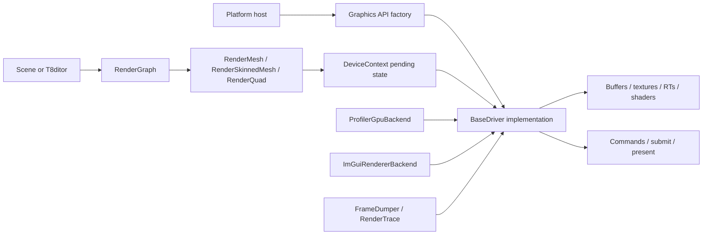
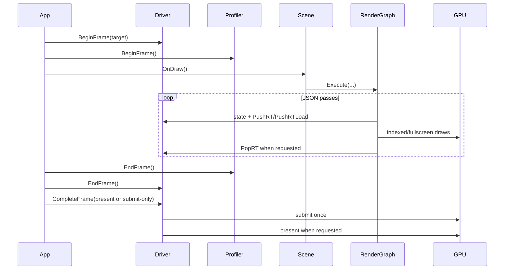
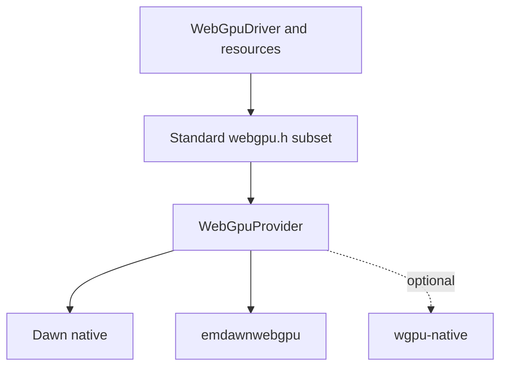
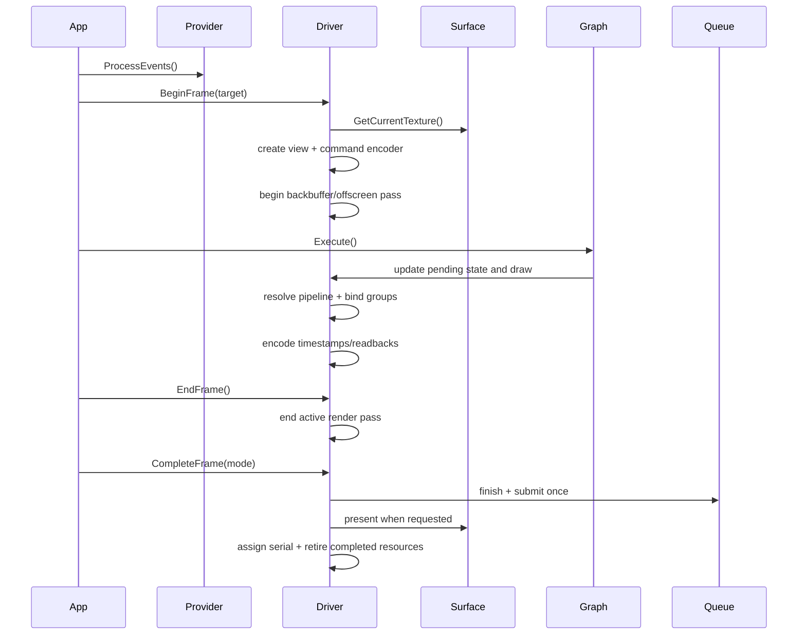
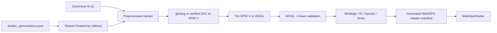

# WebGPU Graphics Backend Proposal

Status: proposed; reassessed against `c9bb6a75b0b75314673d95ef0e2702c575ac4d0d` after rebasing `master` onto `origin/master`. This is a source/documentation assessment, not a Dawn build, shader-conversion result, or measured performance report. No WebGPU or shared compute backend is implemented by this proposal.

This proposal covers a Dawn-first engine port, cross-backend compute and a three-day performance experiment. The detailed backend architecture also describes deferred full-parity work; it is not all required for the experiment.

Start with [findings](#reassessment-findings), [compute design](#cross-backend-compute-design), [per-scene opportunities](#per-scene-compute-opportunities), [benchmark methodology](#native-d3d12-versus-dawn-experiment), and the [three-day work split and gates](#milestones-and-stopgo-gates).

The primary target is **Windows x64 using Dawn over D3D12**, both to port T850 and to measure the cost of the WebGPU implementation relative to the engine's native D3D12 path. HLSL remains canonical; WGSL generation is an offline feasibility gate. Dawn is pinned and installed outside this repository.

## Objectives and Timebox

1. **Port the engine to Dawn/WebGPU.** Full scene and editor parity is the long-term objective. The three-day deliverable is a small integrated graphics path, not a claim that every shader and scene has been ported.
2. **Measure native D3D12 versus Dawn/D3D12.** Compare equivalent work on the same adapter, with matched shaders, resources, rendering settings and presentation policy. Separate CPU command-construction cost, GPU elapsed time, cold compilation, and frame pacing; do not label every difference WebGPU API overhead.
3. **Add a shared compute path** for D3D11, D3D12, Vulkan, and Dawn/WebGPU. GL receives no compute implementation. Keep existing graphics paths working and select a graphics fallback or report unsupported when compute is requested on GL.
4. **Assess compute candidates in every scene**, including the newly added heightmap/placement content and embeddable editor. Start with a bounded image-processing kernel; treat volumetric lighting, culling, skinning, and terrain generation as later experiments until correctness and performance are measured.
5. **Deliver with two people in three days.** The owner takes Dawn graphics integration and native-versus-Dawn comparison; the teammate owns the common compute contract, kernel, and native compute backends. Freeze the shared contract early and integrate daily. Six person-days is a prototype budget, not a full-engine parity budget.

The detailed work split, measurements, and per-scene assessment below are the acceptance contract. Emscripten and wgpu-native remain future considerations, not competing workstreams during these three days.

## Purpose

Add `--api webgpu` while preserving these contracts:

- existing scenes and render graphs remain API-neutral;
- existing D3D11, D3D12, OpenGL, and Vulkan graphics paths remain working; new compute targets D3D11/D3D12/Vulkan/WebGPU only;
- `ShaderKey` retains its existing bit layout and pass values;
- CPU asset loading remains shared;
- mutable GPU resources remain safe across in-flight frames;
- frame dumps and visual comparison remain available;
- the profiler provides useful CPU and GPU timing when the adapter supports it;
- provider-specific details do not leak into scenes, materials, or render-graph execution.

This proposal does not treat a triangle sample as scene parity. Full support means the existing runtime scenes and T8ditor can select WebGPU through the normal factory path and retain their expected rendering behavior, diagnostics, and lifecycle.

## Agreed Scope

| Area | Decision |
|---|---|
| First target | Windows x64 native |
| First provider | Dawn |
| Dawn backend | D3D12 preferred and required for the first acceptance matrix |
| Shader source of truth | Existing HLSL |
| WGSL creation | Deterministic offline generation and validation |
| Dawn distribution | Pinned external install outside Git |
| Browser target | Later milestone through Emscripten 4.0.10+ and `--use-port=emdawnwebgpu` |
| Linux/Steam Deck | Later native Dawn/Vulkan milestone after Windows parity |
| Android | Existing Vulkan backend remains the production path in the initial scope |
| Alternate provider | wgpu-native remains feasible behind a provider boundary |
| Compute targets | D3D11, D3D12, Vulkan, Dawn/WebGPU; no GL compute |
| Benchmark target | Native D3D12 versus Dawn using the same D3D12 adapter |
| Immediate budget | Two people, three days; prototype and evidence, not full scene parity |
| Scene-specific branches | Rejected |
| Shipping runtime HLSL-to-WGSL translation | Rejected |

Later targets are part of the architecture, but not part of the Windows stage-one acceptance gate.

## Reassessment Findings

The overall direction makes sense: the shared driver and explicit-backend frame lifecycle are useful foundations. The previous proposal was a full-parity roadmap, however, and omitted the compute contract and controlled experiment needed for this timebox. The principal gaps are:

| Priority | Finding | Required response |
|---|---|---|
| Blocking for delivery | Full engine parity plus four compute implementations does not fit six person-days reliably | Commit to a bounded vertical slice; make incomplete gates explicit, with no silent reduction of the four-API goal |
| Blocking for deferred parity | Raw GBuffer storage is 36 bytes, but WebGPU attachment cost is 56 bytes/sample | Query/request the real limit; use a small forward graph for the experiment and defer GBuffer repacking |
| Blocking for shader integration | Existing APIs, in-memory cache and permutation dump assume graphics pairs/key-only identities | Separate compute identity and artifact loading; qualify resource counts using compiled entry-point reflection |
| Blocking for compute | No shared dispatch/storage-resource contract; graph edges are not synchronization | Add typed compute passes, declared accesses, resource usages and backend hazard handling |
| Blocking for conclusions | Current timings are not sufficient to isolate WebGPU overhead | Separate CPU/GPU sample accounting; compare matched native and Dawn workloads and disclose shader/compiler differences |
| High | HLSL-to-WGSL conversion has not been executed for the selected permutations | Make graphics and compute conversion a day-one stop/go gate |
| High | CPU terrain and placement data now own more gameplay/editor behavior | Preserve authoritative CPU geometry and transactions; GPU-only terrain generation is deferred |

### Incoming Upstream Changes

The rebase advanced `master` by 16 commits. The changed paths do not introduce a compute API or WebGPU driver. They do change the eventual port's parity matrix:

- [Heightmap terrain](../terrain/heightmap-terrain.md) adds 16-bit decoding, sculpt/material edits, whole-terrain render LOD and transactional mutable geometry. `HeightmapMesh` retains full-resolution CPU geometry for physics, navigation, fitting and picking.
- [Placement grids and model visuals](../terrain/placement-grid.md) add static/skinned per-placement renderers. Bone uploads occur before passes; resource replacement must preserve their safe-boundary lifetime rules.
- [Shared scene conversions](../../T850/Framework/src/scene/SceneConversions.cpp) move authoring/runtime conversion into Framework. Reuse these paths; do not add Dawn-specific loaders.
- [The editor SDK](../editor/editor-sdk.md) introduces `T8ditorCore` and external static hosts. Eventual Dawn linkage/staging must reach these consumers, not only the stock executable. Framework remains independent of editor/ImGui headers.
- Vulkan now retains/releases sampler variants for shared textures; new Dawn bind-group caches must likewise respect immutable sampler/view identity and retirement.
- Selection wireframes and terrain-grid overlays gained depth/coplanar-coverage fixes. Carry their rasterized-depth semantics into later shader validation.

The new static SDK does not expose raw GPU access to extensions, and this proposal must not introduce it. Existing platform/test results in the status document are historical evidence, not reruns performed for this reassessment.

## Current T850 Graphics Architecture

T850 has a shared rendering layer with four backend implementations:

- D3D11 and OpenGL are mostly immediate-state backends;
- D3D12 and Vulkan collect state, resolve explicit pipelines, record commands, submit once per frame, and defer resource destruction;
- scenes issue rendering through `BaseDriver`, `Device`, `DeviceContext`, resources, `PrimitiveInst`, and the JSON render graph;
- shader permutations are represented by a stable 64-bit `ShaderKey`;
- API-specific ImGui and profiler behavior is selected through strategy factories.



### Existing Ownership

| Owner | Current responsibility |
|---|---|
| Platform host | Window/event loop, driver creation, resize, API switching |
| `BaseDriver` | Texture/shader/RT registries, frame lifecycle, state, offscreen output |
| `Device` | Backend buffer, shader, texture, cubemap, float texture, and RT creation |
| `DeviceContext` | Topology, active VB/IB/CB/shader, indexed draw submission |
| `RenderGraph` | Pass order, target selection, texture edges, state overrides, draw commands |
| `RenderMesh` | Static geometry, material binding, frame/instance/material constants |
| `RenderSkinnedMesh` | Skinned permutations and per-frame bone texture uploads |
| `RenderQuad` | Fullscreen and post-processing permutations |
| `MutableMesh` | Atomic replacement of mutable VB/IB snapshots |
| `Profiler` | API-neutral CPU timing, scope accounting, draw and triangle counts |
| `ProfilerGpuBackend` | Per-API timestamp query lifecycle |
| `FrameDumper` | Backbuffer/RT readback and deterministic snapshots |
| `ImGuiRendererBackend` | API-specific ImGui initialization, resources, previews, and draws |

### Existing Frame Lifecycle

The explicit backends follow this conceptual sequence:



WebGPU should follow this explicit lifecycle. It should not force scene code into a new command-list API.

## Standards Facts That Affect the Port

Implementation must not inherit assumptions from one native backend:

- WebGPU clip-space depth is `0..1`.
- WebGPU supports mixed color attachment formats in one render pass.
- WebGPU supports compute pipelines.
- A cubemap is represented as a six-layer 2D texture. A cube view can be used for sampling and a single-layer 2D view can be used as a render attachment.
- Buffer and texture usage flags are immutable after resource creation.
- Render-pass load and store operations are explicit.
- Adapter and device acquisition, mapped readback, and work-completion reporting use asynchronous callback/event models.
- Native surface presentation itself is not a JavaScript Promise.
- Timestamp queries are optional and must be feature-gated.
- Portable pipeline-statistics, occupancy, cache-miss, and VRAM-budget counters are not available through core WebGPU.

## Provider Boundary

The T850 WebGPU renderer should depend on the standard `webgpu.h` object model. Dawn types/extensions stay inside the backend. The following `WebGpuProvider` boundary describes eventual ownership, not a requirement to implement three providers or an abstract provider framework during the timebox.



### `WebGpuProvider` Responsibilities

The provider boundary owns:

- instance creation and destruction;
- adapter and device requests;
- native surface chained descriptors;
- event processing and timed waits;
- provider/backend/toggle selection;
- uncaptured-error and device-lost callbacks;
- provider, version, adapter, driver, and underlying-backend identity;
- optional native extensions;
- any header or callback convention that differs between Dawn, Emscripten, and wgpu-native.

It does not own:

- mesh/material binding policy;
- render-graph execution;
- pipeline key construction;
- texture-slot semantics;
- scene compatibility decisions;
- shader permutation identity.

Provider types must not appear in scene or render-graph headers.

## Dawn Integration

Dawn is the recommended implementation because it provides:

- the WebGPU C API and C++ wrapper;
- native D3D12, Vulkan, Metal, and best-effort GL implementations;
- Tint for WGSL parsing and backend translation;
- Chromium production lineage;
- a maintained Dear ImGui Dawn path;
- an Emscripten Dawn WebGPU port;
- BSD-3-Clause licensing.

### External Installation

Dawn should be pinned and installed outside Git. A proposed layout is:

```text
%LOCALAPPDATA%/T850Tools/Dawn/<commit>/windows-x64/<configuration>/
```

A tracked lock manifest should contain:

- Dawn commit;
- build configuration and CMake options;
- compiler/SDK requirements;
- expected headers/libraries/runtime files;
- hashes for distributed artifacts;
- Dawn and Tint license paths.

A future setup script should:

1. clone the pinned commit outside the repository;
2. fetch Dawn dependencies;
3. configure CMake/Ninja with `DAWN_ENABLE_INSTALL=ON`;
4. build/install the required targets;
5. write a machine-readable manifest;
6. leave source and build trees outside the T850 checkout.

T850 should discover the install through `T850_DAWN_ROOT` or `CMAKE_PREFIX_PATH` and link `dawn::webgpu_dawn`. A missing or mismatched install must produce a prerequisite error, not a link-time mystery.

### Toolchain Risks

Dawn is a large dependency and its primary development environment follows Chromium. Current upstream requirements include C++20, Python, CMake or GN/Ninja, and additional dependency-fetch tooling. Windows x64 is supported; Windows ARM64 remains a later proof target. Linux CMake builds have compiler and system-package requirements that may not fit the current SteamRT image without a separate dependency build.

Pinning is mandatory because WebGPU headers, chained structures, callback modes, and native extensions evolve.

## Dawn Versus wgpu-native

| Area | Dawn | wgpu-native |
|---|---|---|
| Implementation language | C++ | Rust |
| Shader frontend | Tint | Naga |
| Native basis | Chromium WebGPU implementation | `wgpu-core` native implementation |
| Public API | `webgpu.h`, C++ wrapper, Dawn extensions | `webgpu.h` plus `wgpu.h` extensions |
| Relevant native backend | D3D12 for this experiment; other backends depend on the selected pin | DX12 for a later comparison; other backends depend on the selected pin |
| Browser relationship | Direct path to emdawnwebgpu | Native library; browser target still uses browser/Emscripten WebGPU |
| Build prerequisites | Compiler/CMake/Python/dependency-fetch versions from the selected pin | Rust/Cargo/LLVM/libclang requirements from the selected release |
| Binary distribution | Usually project-built/pinned | Release snapshots for Windows, Linux, macOS, Android, and iOS targets |
| License | BSD-3-Clause | MIT OR Apache-2.0 |
| ImGui | Upstream `imgui_impl_wgpu` Dawn mode | Upstream `imgui_impl_wgpu` WGPU mode |
| Main advantage for T850 | Tint, Chromium alignment, Emscripten continuity | Easier prebuilt native experiments and broad native release matrix |
| Main risk for T850 | Build size, pin maintenance, API churn | Rust toolchain, extension/header churn, Naga differences, snapshot releases |

### Recommendation

Use Dawn first. Keep wgpu-native feasible by enforcing the provider boundary and standard C API subset.

Do not implement an alternate-provider framework during the timebox. Isolate Dawn initialization, callbacks and native extensions inside its backend; extract a common provider interface when a second provider is actually scheduled. Headers and native libraries must match: they are not interchangeable binary drop-ins. Re-estimate wgpu-native later from the delivered Dawn implementation, not from the previous unmeasured week ranges.

## Capability Profiles

WebGPU cannot be treated as one fixed capability set. T850 should select an explicit profile after adapter discovery and before scene GPU allocation.

Initial profiles:

| Profile | Purpose |
|---|---|
| `experiment` | One color attachment, fixed shader inventory and one compute kernel; both native D3D12 and Dawn run this same workload |
| `native-full` | Windows Dawn full-fidelity T850 rendering with requested non-baseline limits |
| `portable-web` | Later Emscripten/browser-compatible rendering constrained to portable limits |

The selected profile must record requested and actual features/limits. For the experiment, log and retain them in the result manifest; telemetry, all shader signatures and full frame-dump integration follow later.

### Required Capability Inventory

At minimum, capture:

- maximum color attachments;
- maximum color attachment bytes per sample;
- sampled textures and samplers per shader stage;
- bind groups and bindings per bind group;
- uniform buffers per stage;
- maximum uniform/storage binding size;
- dynamic uniform/storage offset alignment;
- vertex buffers, attributes, and array stride;
- texture dimensions and array layers;
- supported surface formats, alpha modes, and present modes;
- BC texture compression;
- float32 filtering;
- timestamp query support;
- query-set capacity and relevant validation rules (not an assumed adapter limit field);
- supported depth formats.

For compute, also capture per-axis workgroup sizes, invocations per workgroup, workgroup storage size, dispatch count limits, storage buffers/textures per stage, storage-image formats/access modes, and buffer binding alignments. The first kernel uses core features only. D3D11 requires feature level 11_0 or higher for the proposed texture-UAV path.

Unsupported profiles fail before scene creation with a diagnostic naming the exact requested feature/limit and current adapter value.

## Quantified Compatibility Blockers

### GBuffer Attachment Budget

The common GBuffer uses:

```text
RGBA8 + RGBA16F + RGBA8 + RGBA8 + RGBA16F + RGBA8 + RGBA8
  4   +    8    +   4   +   4   +    8    +   4   +   4
= 36 bytes/sample
```

That is **raw color storage**, not WebGPU attachment accounting. The specification's plain-color-format table assigns an 8-byte render-target pixel cost to both `rgba8unorm` and `rgba16float`. Its algorithm applies component alignment and adds those costs in attachment order; these formats need no extra padding here:

```text
5 * 8 (rgba8unorm) + 2 * 8 (rgba16float) = 56 attachment bytes/sample
```

Seven attachments fit the core count limit of eight, but **56** exceeds the core default `maxColorAttachmentBytesPerSample` of 32. This value is a validation budget, not a measured memory-bandwidth cost. Depth storage is separate. Compatibility-mode adapters may have lower limits; explicitly select and log the requested feature level.

Required policy:

- `native-full` requires at least seven color attachments and 56 attachment bytes/sample, after checking the actual Dawn adapter. Underlying D3D12 support alone is insufficient.
- Startup records whether the chosen Windows adapter satisfies that request.
- `portable-web` must use a measured packing change or pass split at 32 bytes/sample or below.
- The driver must not silently replace formats.
- Render-graph validation computes the budget and names the incompatible target/profile.

Possible deferred portable prototypes, measured using WebGPU costs as well as image quality:

1. reduce the number of outputs through channel packing; splitting one target into more targets is not inherently cheaper;
2. move low-frequency material data to compact formats;
3. split the GBuffer into two geometry passes;
4. recompute selected values in deferred composition.

No choice is approved until visual and GPU-cost measurements exist.

### Texture and Sampler Pressure

Current mesh shader declarations include:

- nine unconditional fragment textures;
- up to sixteen conditional fragment material textures;
- 25 fragment texture declarations across the source family, not a proven simultaneously active compiled permutation;
- sixteen declared fragment samplers;
- a vertex-stage bone texture at logical slot `t24` for texture skinning;
- a lightmap at logical slot `t25`.

Splitting resources across bind groups does **not** avoid per-stage sampled-texture or sampler limits.

These declaration counts are a warning, not a measured executable resource maximum. Preprocessing, pass selection, entry-point reachability and compiler elimination determine actual bindings. The reassessment did not compile the complete inventory. Core defaults include 16 sampled textures and 16 samplers per stage; verify requested/actual limits and reflect each artifact before declaring a blocker or claiming compatibility.

Required policy:

- reflect active resources per `ShaderKey` permutation;
- never reserve all logical slots for every pipeline;
- collapse samplers into semantic reusable samplers where behavior is equivalent;
- request elevated limits only for `native-full`;
- reject or decompose over-limit permutations under `portable-web`;
- report the exact shader key and resource count when validation fails.

A likely semantic sampler set is:

- material linear wrap;
- material nearest wrap;
- environment linear clamp;
- post-process linear clamp;
- post-process nearest clamp;
- shadow comparison;
- lightmap sampler when it cannot share another definition.

This must be proven against existing texture parameter behavior before sampler declarations are changed.

## API-Neutral Changes

### Shader Language and Artifact Selection

`BaseDriver::UsesGLSL()` alone cannot choose generated artifacts. Add an artifact resolver alongside the existing HLSL/GLSL path before considering a broad dialect refactor. A future descriptor could look like this:

```cpp
enum class ShaderLanguage {
  Hlsl,
  Glsl,
  Wgsl
};

struct ShaderArtifactRequest {
  ShaderLanguage language;
  ShaderKey key;
  std::string vertexSource;
  std::string fragmentSource;
  std::string vertexName;
  std::string fragmentName;
};
```

Extract `ShaderKey` define generation from `ShaderBase::CreateShader()` into one reusable function. Existing APIs continue to receive the same defines. The WebGPU artifact resolver uses them to locate generated WGSL.

WGSL has no HLSL preprocessor. Apply defines to HLSL before conversion; never prepend `#define` or `#version` to generated WGSL. Do not route WGSL back through the existing source-prefixing method. The VS/FS example is graphics-only; compute uses a distinct module and entry-point descriptor below.

### Stable `ShaderKey`

Do not renumber bits or pass values. The WebGPU pipeline uses the same key identity as existing backends.

Key bits alone are not a complete artifact identity. [The current permutation recorder](../../T850/Framework/src/utils/ShaderPermutationDump.cpp) stores `g_entries[entry.keyHex]`, so different shader families can overwrite each other. Use `(family, stage, entry point, key/defines, source hash, compiler options/version, binding-layout version)` for new artifacts. Keep compute out of the existing key-only graphics map. Capture dynamic feature combinations deliberately; a startup dump is not an exhaustive permutation inventory.

Generated shader manifest fields:

- key bits and pass;
- canonical HLSL paths and source hashes;
- exact define list;
- generated WGSL paths and hashes;
- vertex and fragment entry points;
- reflected vertex inputs and fragment outputs;
- bind groups and binding types;
- C++/WGSL buffer sizes and member offsets;
- required features and limits;
- glslang, Tint, Dawn, and generator versions.

Release builds fail on missing or stale artifacts. Development tooling may regenerate them explicitly.

### Resource Usage Descriptors

Current `BufferUsage` mixes CPU update policy with GPU purpose. WebGPU needs explicit immutable use flags.

Proposed separation:

```cpp
enum class CpuUpdateMode {
  Immutable,
  Occasional,
  Dynamic
};

enum class BufferBindingUsage : uint32_t {
  None = 0,
  Vertex = 1u << 0,
  Index = 1u << 1,
  Uniform = 1u << 2,
  Storage = 1u << 3,
  CopySource = 1u << 4,
  CopyDestination = 1u << 5,
  MapRead = 1u << 6,
  MapWrite = 1u << 7,
  Indirect = 1u << 8
};
```

Texture descriptors need:

- dimension and view dimension;
- format;
- width, height, depth/array layers;
- mip count and sample count;
- sampled, storage, render attachment, copy source, and copy destination usage;
- intended filterability/sample type;
- optional debug label.

These are bit flags, separate from access state and CPU update policy. Existing constructors keep their defaults; new descriptors translate to native creation flags on every participating backend. Required storage/copy usages must not be ignored. In core WebGPU, `MAP_READ` pairs only with `COPY_DST`, and `MAP_WRITE` only with `COPY_SRC`; use staging buffers, not mappable storage/uniform buffers. Indirect use is designed for later workloads, not required in the initial kernel.

### Render-Pass Metadata

The render graph currently expresses pass continuation through `push`, `pop`, `clear`, and `PushRTLoad`. WebGPU needs explicit attachment load/store behavior.

Add API-neutral resolved metadata for:

- color attachment views;
- depth attachment view;
- load operation;
- store operation;
- clear values;
- read-only depth/stencil state;
- sample count;
- continuation intent;
- timestamp writes when available.

The existing JSON schema can remain stable initially. `RenderGraph` resolves current fields into the explicit descriptor before calling the driver.

Validation must reject sampling a target attachment while the same subresource is active for rendering.

### Pipeline Key

WebGPU pipelines are immutable. The key must include:

- shader artifact identity and `ShaderKey`;
- vertex layout and stride;
- topology and strip index format;
- color attachment count and formats;
- color write masks and blend states;
- depth format, compare, and write state;
- front face and cull mode;
- sample count;
- alpha-to-coverage state.

Cache pipelines in memory. Do not promise portable pipeline-binary persistence. Track creation time, hits, misses, and live count.

### Bind Groups

Bindings should be expressed as reflected semantic resources rather than D3D register numbers alone.

Recommended logical groups:

| Group | Contents |
|---|---|
| Frame/pass | Frame lights, camera, post-process/cascade constants |
| Instance/material | Instance and material constants, usually dynamic offsets |
| Textures | Material, environment, render-graph inputs, bone texture |
| Samplers | Small semantic sampler set |

The final grouping must satisfy actual adapter limits and WGSL layout rules. Build layouts per active permutation and cache bind groups by layout plus resource identity/version.

Dynamic uniform offsets are aligned to the adapter's reported requirement, commonly 256 bytes. C++ and WGSL offsets must be generated and tested rather than assumed.

### Graphics Conventions

Replace accumulating backend booleans with explicit conventions:

```cpp
struct GraphicsConventions {
  ClipDepthRange clipDepth;
  SurfaceOrigin framebufferOrigin;
  SurfaceOrigin textureCopyOrigin;
  SurfaceOrigin sampledRenderTargetOrigin;
  FrontFace frontFace;
  SurfaceColorSpace surfaceColorSpace;
};
```

Dedicated tests must validate:

- triangle winding and culling;
- depth clear/compare behavior;
- sampled depth reconstruction;
- render-target sampling orientation;
- texture upload row orientation;
- fullscreen UVs;
- shadow projection and comparison.

### Work Completion and Retirement

WebGPU work completion is asynchronous. Add API-neutral hooks for:

- provider event processing;
- submission serial allocation;
- completed submission serial;
- deferred release queues;
- asynchronous drain/shutdown;
- readback callback progress.

`RetireBuffer()` and equivalent texture retirement use submission serials. The renderer must not call a blocking map or work-completion wait in the frame loop.

A native `WaitForGPU()` implementation may perform a bounded provider wait during resize, shutdown, or explicit diagnostics. Browser builds cannot rely on blocking waits.

## WebGPU Backend Classes

Proposed files follow existing backend organization:

```text
Framework/include/video/webgpu/
  WebGpuProvider.h
  DawnWebGpuProvider.h
  WebGpuDriver.h
  WebGpuDevice.h
  WebGpuDeviceContext.h
  WebGpuShader.h
  WebGpuTexture.h
  WebGpuBuffer.h
  WebGpuRT.h

Framework/src/video/webgpu/
  DawnWebGpuProvider.cpp
  WebGpuDriver.cpp
  WebGpuDevice.cpp
  WebGpuDeviceContext.cpp
  WebGpuShader.cpp
  WebGpuTexture.cpp
  WebGpuBuffer.cpp
  WebGpuRT.cpp
```

The exact file split may be consolidated during the day-one spike; ownership must remain explicit. These are proposed paths, not a requirement to create one file per type immediately.

### Driver Initialization

```mermaid
sequenceDiagram
  participant Host
  participant Provider
  participant Driver
  participant Adapter
  participant Device
  participant Surface

  Host->>Provider: create instance + native surface
  Provider->>Adapter: request D3D12 adapter
  Provider->>Provider: process/wait for callback
  Adapter->>Driver: report features and limits
  Driver->>Driver: validate selected profile
  Provider->>Device: request required features/limits
  Device->>Driver: queue + callbacks
  Driver->>Surface: choose format/mode and configure
  Driver->>Driver: resources and rings; optional diagnostics/UI
```

Initialization requirements:

1. Create provider instance.
2. Create an HWND-backed surface from `WindowHandle`.
3. Request the explicitly selected D3D12 adapter; verify identity against native D3D12. A high-performance preference alone does not guarantee the same GPU.
4. Query and log adapter identity, features, and limits.
5. Validate the selected capability profile.
6. Request only required device features and limits.
7. Install uncaptured-error and device-lost callbacks.
8. Obtain the queue.
9. Select surface format, alpha mode, and present mode.
10. Configure the surface.
11. Create fallback textures/samplers and upload/uniform/readback rings.
12. Initialize the available timing collector. Full profiler and ImGui integrations are deferred beyond the experimental fixture.

### Per-Frame Flow



Handle the exact acquisition statuses exposed by the pinned Dawn headers; spelling and enum membership are version-sensitive. Required behaviors include:

- success: render normally;
- suboptimal: render and schedule reconfiguration;
- timeout: skip without corrupting frame state;
- outdated/lost: reconfigure surface and swapchain-sized targets;
- out of memory: stop rendering and report a fatal device condition;
- device lost: enter controlled recovery/failure flow.

### Device and Surface Recovery

Surface recreation does not invalidate immutable scene assets. It does invalidate:

- current surface texture/view;
- surface-depth attachment;
- swapchain-sized render targets;
- pipelines tied to changed surface formats or sample counts.

Initial device-loss behavior should be controlled failure plus scene reload, not transparent recovery. Log:

- provider and version;
- underlying backend;
- adapter and driver;
- reason/message;
- last submitted/completed serial;
- active scene/pass;
- live resource/cache counts.

## Buffers and Uploads

### Vertex and Index Buffers

Map existing buffer creation to explicit usages:

- static mesh pools: `COPY_DST | VERTEX` or `COPY_DST | INDEX`;
- mutable mesh replacement: same usages, new handle published atomically;
- index format: `uint16` or `uint32` from current descriptor;
- buffer binding offsets and sizes must always be explicit.

### Uniform Buffers

Use a per-frame ring buffer with aligned slices for frame, instance, material, quad, and cascade constants. Bind slices through dynamic offsets where practical.

Required checks:

- maximum uniform binding size;
- dynamic-offset alignment;
- per-stage uniform buffer count;
- member offsets and total sizes;
- matrix major order;
- arrays of lights and cascades.

### Upload Policy

Small dynamic updates may use queue write operations. Large/streamed updates use staging buffers and copy commands. Track upload bytes and count by resource class.

Mutable replacement preserves this rule:

1. validate the complete snapshot;
2. create replacement VB and IB;
3. upload both;
4. publish both atomically;
5. retire the previous pair against the current submission serial.

## Textures and Render Targets

### File and Memory Textures

CPU decoding remains in CIL and existing loaders. Some import paths also request GPU textures/materials during loading, so shared decoding does not make the entire importer CPU-only. Route those creation calls through `Device`/`BaseDriver`, with explicit upload boundaries. WebGPU texture creation maps the decoded result to an explicit texture descriptor.

Special cases:

- `RGB8` expands to `RGBA8` because core WebGPU has no RGB8 texture format;
- BC-compressed DDS requires `texture-compression-bc`;
- provide a CPU-decode fallback where the existing loader can produce uncompressed pixels;
- format, sRGB intent, filterability, and mip count must be explicit;
- encoder buffer-to-texture copies and readbacks use the required row-pitch alignment (typically 256 bytes); do not impose that constraint blindly on `queue.writeTexture`, whose data-layout rules differ;
- generated atlas textures retain nearest filtering and half-texel UV behavior.

### Bone Texture

The bone matrix texture is `RGBA32F`, updated every frame, and read with integer coordinates. It should use an unfilterable float sample type and `textureLoad`; it must not require optional float32 filtering.

### Cubemaps and IBL

Create cubemaps as six-layer 2D textures with:

- cube view for sampling;
- per-face 2D views for render attachments;
- all required mip views;
- explicit copy/render/sample usage.

Generated diffuse/specular/sheen IBL paths must be ported and validated independently. If runtime mip generation is used, implement it as a render or compute pipeline rather than relying on a driver call.

### Render Targets

`WebGpuRT` owns textures and reusable views, not a permanently active pass. Beginning a pass uses resolved attachment descriptors.

`PushRT`, `PushRTLoad`, and `PopRT` retain their shared-facing behavior but map to begin/end render-pass encoders. Pass continuation is legal only when attachment formats, views, and compatible state remain unchanged.

## Shader Pipeline

### Canonical Flow



Day one must prove that the selected Tint build enables its SPIR-V reader and WGSL writer and can translate the chosen graphics permutation and compute kernel. Tint's current command source exposes both paths behind build flags, but that is not proof of T850 conversion correctness. SPIRV-Cross does not provide a WGSL backend. glslang or DXC produces SPIR-V; Tint (or a separately validated Naga route) produces WGSL.

Do not feed Vulkan's already shifted/combined-sampler SPIR-V into Tint blindly. Generate explicit, noncolliding bindings for the chosen entry point and compare reflection, uniform layout and numerical output. A small handwritten WGSL bootstrap can diagnose backend bring-up, but must be labelled an exception, not successful HLSL portability or a matched-shader overhead result.

### Generated Artifacts

Suggested layout:

```text
Assets/Shaders/webgpu/
  manifest.json
  <shader-pair>/<shader-key>/vs.wgsl
  <shader-pair>/<shader-key>/fs.wgsl
```

Generated output should be reproducible from canonical source and tool versions. For the experiment, package the small generated inventory with its manifest; decide long-term source-control/CI policy later. Release packages must not require shader conversion tools.

### Shader-Specific Risks

Validate explicitly:

- HLSL row/column-major matrix behavior versus WGSL matrices;
- bool and integer packing;
- `SV_POSITION` and fragment depth semantics;
- fullscreen UV/origin conventions;
- derivatives used by normal/parallax paths;
- cubemap and comparison sampling;
- `textureLoad` for bone matrices;
- MRT output locations and formats;
- nonuniform resource indexing if introduced;
- alpha/discard behavior;
- light arrays and loop bounds.

Generated layout tests compare C++ `sizeof`/`offsetof` with WGSL reflection for:

- `MeshFrameCBuffer`;
- `MeshInstanceCBuffer`;
- `MeshMaterialCBuffer`;
- legacy skinned `CBuffer` variants;
- quad/pass buffers;
- cascade shadow buffers.

## Render Graph Integration

The current graph remains JSON ordered and API-neutral. Add a compatibility validation phase before GPU allocation.

Validation includes:

- target format support;
- render/sample/copy usage support;
- attachment count and bytes/sample;
- sample count consistency;
- shader fragment output compatibility;
- texture/sampler/uniform binding limits;
- read/write feedback on the same subresource;
- mip generation support;
- cube face/layer requirements;
- surface-format compatibility.

Compatibility differences use named profiles, not scene/API conditionals.

Example selection concept:

```json
{
  "render_profile": "native-full"
}
```

The exact schema is deferred until the portable GBuffer prototype is selected.

## Cross-Backend Compute Design

This is an additive Framework capability, not a Dawn-only escape hatch. No scene or editor extension receives D3D, Vulkan or WebGPU handles. Keep the existing graphics entry points stable; do not force compute into `DrawIndexed`, a fake fullscreen draw, or the VS/FS `ShaderBase` contract.

### Shared Contract and Ownership

The names below are proposed, not existing APIs. Agree on them in the first two hours before either person implements a backend.

| Owner | Minimum addition | Contract |
|---|---|---|
| `Descriptors.h` | GPU creation-usage flags, `ComputePipelineDesc`, `ComputeBindingDesc`, `ResourceAccess` | Explicit artifact/entry point, layout, resource kind, stage, access, buffer offset/size or texture view/subresource; no native enums |
| `Device` | `CreateComputePipeline`, descriptor-based texture creation | Reuse ordinary `Texture` wrappers for sampled/storage views of the same allocation; do not copy to a second backend-private image just to dispatch |
| `DeviceContext` | `BeginComputePass`, `SetComputePipeline`, `SetComputeBindings`, `Dispatch`, `EndComputePass` | Dispatch arguments are workgroup counts, not pixel counts. Bindings/layout validated before recording; no active graphics encoder |
| `BaseDriver` | `GetComputeCapabilities`, managed resource ownership/retirement | Unsupported by default, including GL. Required calls fail explicitly; an empty no-op implementation must not count as compute support |
| `RenderGraph` | Typed compute nodes and resolved resource-use lists | Own dependencies, dimensions, resource usage union and unsupported-path policy; request work through the shared context |
| Backend | Pipeline/layout/binding cache and access translation | Own actual transitions, descriptor lifetime, pass encoder state, command recording and submission |

Initially implement constants, sampled 2D textures and write-only 2D storage textures. Describe storage-buffer read/write bindings in the same contract, but implement and test them when a selected kernel needs them. Do not claim buffer atomics, indirect drawing, append/consume counters, or general compute coverage from a texture-blur test.

Add descriptor overloads with preserved defaults instead of changing every texture constructor at once. For graph targets, derive the union of render/sample/storage/copy usages before allocation. Storage-only scratch images have no depth and need not be fake framebuffer targets. References should carry allocation generation plus view/range; caches must invalidate on resize or resource replacement. Keep objects alive through GPU completion, including pipeline and binding references.

All work uses the existing frame submission on one queue capable of graphics and compute. For D3D12 this is the direct queue; for Vulkan verify the selected queue family supports both. Async compute, multi-queue overlap, ownership transfers and transient aliasing are deferred. WebGPU core has no user-facing independent compute queue to map such a design onto.

### Shader Identity and Binding Layout

Use a separate `ComputePipeline`/artifact cache keyed by kernel family, compute entry point, defines, source/toolchain hashes, layout version and workgroup specialization. Graphics `ShaderKey` bits/pass values remain unchanged. Do not allocate one graphics pass bit for each future compute algorithm.

Start with this fixed, documented kernel interface:

| Meaning | HLSL | WGSL | Data contract |
|---|---|---|---|
| Constants | `b0` | group 0, binding 0 | 16-byte block: `uint width`, `uint height`, `int directionX`, `int directionY`; verify generated offsets |
| Input | `Texture2D<float4>` at `t0` | group 0, binding 1, `texture_2d<f32>` | Integer load at mip 0; no sampler needed |
| Output | `RWTexture2D<float4>` at `u0` | group 0, binding 2, `texture_storage_2d<rgba16float, write>` | One store per in-bounds output texel |

For Vulkan, map the same logical entries to set 0 bindings 0/1/2 explicitly. HLSL register namespaces overlap numerically, but WebGPU/Vulkan bindings do not. Reflect/validate the mapping; never infer it by blindly adding the current graphics UBO shift. Add storage-image/buffer and compute-stage support to reflection where needed; the existing Vulkan graphics reflector is not a complete compute reflector. A small declared layout checked against compiler output is sufficient for this kernel.

Compile HLSL `CS` as `cs_5_0` for D3D11 and the existing D3D12 SM5/DXBC baseline. Vulkan must use an HLSL-to-SPIR-V compute path proven by the kernel tests; Dawn must use validated offline WGSL. Neither conversion has been executed in this assessment. The common kernel avoids wave/subgroup instructions, doubles, float atomics, 16-bit arithmetic requirements, device-wide synchronization and read/write storage textures. `rgba16float` storage is a format choice, not a requirement to enable WGSL `f16` arithmetic.

For future reductions, every lane must reach workgroup barriers uniformly, including lanes outside image bounds. Multiple dispatches provide global phase boundaries; a workgroup barrier does not synchronize the whole dispatch.

### Backend Implementation Map

| Backend | Pipeline and resources | Ordering and hazards |
|---|---|---|
| D3D11 | `CreateComputeShader`; `CSSetShader`, constant buffers, SRVs and UAVs; `Dispatch`; feature level 11_0+ | Unbind conflicting SRVs across all shader stages and RTV/DSV outputs before UAV writes. Clear CS UAVs/SRVs when returning to graphics and invalidate tracked graphics bindings. The immediate-context runtime manages dependencies; there is no D3D12-style explicit resource barrier call |
| D3D12 | Compute PSO, root signature, CBV/SRV/UAV descriptors, compute root bindings, `Dispatch` on the current direct command list | Transition input to non-pixel shader read and output to UAV; output to pixel shader read before raster sampling. Use UAV barriers for dependent accesses that remain in UAV state. Do not substitute CPU fence waits. Invalidate/rebind graphics PSO/root state after compute |
| Vulkan | Compute pipeline/layout, uniform/sampled-image/storage-image descriptors, compute descriptor bind point, `vkCmdDispatch` outside a render pass | Stage/access/layout barriers for color-write -> compute-read, compute-write -> compute-read, and compute-write -> fragment-read. Use storage image `GENERAL` and appropriate sampled layouts. Use supported legacy pipeline barriers or synchronization2 only when enabled; queue-submit order alone is not a memory dependency |
| Dawn/WebGPU | Shader module, compute pipeline, bind-group layout/groups, `BeginComputePass`, `SetPipeline`, `SetBindGroup`, `DispatchWorkgroups`, `End` | Creation usages include `TextureBinding`/`StorageBinding`/copies as required. WebGPU validates usage scopes and manages native transitions; there is no public Vulkan-style barrier API. End the graphics pass first and use separate input/output subresources |

Validate the actual format's sampled/storage-write support on all four devices. The first kernel does not require typed UAV loads on D3D11: it reads through an SRV and writes through a UAV. It does not write the swapchain directly or require optional BGRA storage support. Reject incompatible usage/format combinations at resource creation, with a graphics fallback chosen before graph execution.

### Render-Graph Changes

Add a pass execution type such as `graphics` or `compute`, separate from the existing `kind` field used for shadow metadata. Existing JSON remains graphics by default. A compute node contains kernel identity, typed resource reads/writes and an extent reference. No scene-specific callback may dispatch native commands.

Illustrative proposed schema, not accepted by the current parser:

```json
{
  "name": "Blur H",
  "execution": "compute",
  "kernel": "SeparableBlur",
  "reads": [{"resource": "Bright:COLOR0", "binding": "input", "access": "sampled"}],
  "writes": [{"resource": "BlurScratch", "binding": "output", "access": "storage_write"}],
  "extent_from": "BlurScratch",
  "parameters": {"direction": [1, 0]}
}
```

Implement descriptor parsing, validation and execution together. Unknown JSON keys currently being ignored is especially dangerous here: a misspelled compute declaration must fail, not silently run as a graphics pass. Require known execution/access types and explicit unsupported-compute policy.

Keep JSON order for now. Extend last-writer tracking to all declared resources and read/write hazards; validate reads before initialization, incompatible simultaneous uses and attachment/storage feedback. There is no need to add a topological scheduler in three days. Start with whole 2D mip-0 resources and conservatively reject overlapping writable views; track subresources before supporting array/mip workloads.

For `Bright -> Blur H -> Blur V -> HDR composition`, the required edges are:

1. Finish/store the graphics producer; make its color output visible to compute reads.
2. Dispatch H into a separate scratch image; make that write visible to V's read.
3. Dispatch V into a separate output; make its write visible to the final fragment shader.
4. Resume graphics with preserved attachments and explicit state, then submit through the normal frame lifecycle.

`PopRT()` is not by itself a sufficient compute boundary: a backend can resume the backbuffer/offscreen render pass during pop. `BeginComputePass` must end any actual graphics encoder without reopening another; invalidate `CurrentRT`/pending state consistently. Resuming a continued graphics target uses load/store preservation, not an accidental clear. Exercise the existing `push=false`/`pop=false` continuation case.

Scratch allocations use the driver registry/lifetime path, resize with the graph, and are reused between frames only with queue-ordered dependencies. Do not map or read them back per dispatch. For GL, select the equivalent graphics node/graph at capability resolution; an explicitly compute-only request reports unsupported. Existing GL shaders and runtime behavior remain unchanged.

### First Workload and Correctness

Use a fixed five-tap separable blur with weights `[1, 4, 6, 4, 1] / 16`, clamped integer pixel coordinates, linear `RGBA16F` input/scratch/output and `8 x 8 x 1` workgroups. Dispatch `ceil(width / 8)` by `ceil(height / 8)` groups; out-of-bounds lanes return before any load/store. This first kernel uses no workgroup barriers. Reject zero extents and validate counts against device limits.

Create a matching fullscreen pixel-shader reference using exactly the same weights, edge policy and intermediate format. The existing configurable blur shaders are candidate integration sites, not automatically an equivalent reference. Only replace existing Bloom Blur H/V when their intended parameters and output match, otherwise keep the experiment explicitly selected. A common HLSL function for the new raster/compute references reduces drift without changing all production blur paths.

Test a constant image, impulse, edge/checker pattern and deterministic rendered image. Include `1x1`, `7x5`, `257x129`, and the benchmark resolution to catch dispatch rounding. Compare against a CPU reference that accounts for half-float rounding after each pass. Before seeing results, set a tolerance such as `max(0.002, 0.002 * abs(reference))` per channel for finite test inputs in `[0,4]`; reject NaNs, unwritten pixels and orientation errors. Record max/RMS error and a visual difference image. A checksum alone is not a cross-compiler floating-point test.

On each participating API, require graphics-write -> compute-read, compute-write -> compute-read and compute-write -> graphics-read correctness, two consecutive frames with changing input/constants, a scratch resize/recreate, and zero validation errors. Read back only in the test/capture workflow after completion. Validate GL's graphics fallback separately; it is not a fifth compute implementation.

### Per-Scene Compute Opportunities

The inventory below uses the actual graph JSON at the rebased revision. Most scenes share bloom/blur/luminance and a seven-target GBuffer; scene names alone do not indicate a low-cost Dawn port. Computation being parallel does not prove a GPU implementation is faster.

| Scene/host | Existing workload and graph | Useful compute candidate | Priority, benefit and constraint |
|---|---|---|---|
| SandboxScene (0) | 17-pass deferred/PBR graph with shadow blur, bloom and adapted luminance | Shared blur first; later luminance reduction or IBL prefilter | First shared-post consumer after full graph portability; material/IBL bindings make the complete scene unsuitable as a guaranteed day-one fixture |
| DayScene (1) | 24 passes including God Rays, God Rays Blur, CoC and two DoF passes | Blur; later froxel volumetrics, tiled DoF, SSAO or depth hierarchy | Best effects laboratory; measure bandwidth, resolution and quality. Do not port every effect in the timebox |
| Quake3Mock (2) | 17-pass deferred graph, large legacy geometry/lightmaps and light volumes | Shared blur; later tiled/clustered light lists and Hi-Z culling | Many draws can expose CPU overhead. Light culling helps only with enough lights; visibility compaction also needs indirect draw/buffer support |
| RagdollEditor (3) | 17-pass graph, skinned meshes and debug views | Shared blur; later compute skinning reused by shadow/GBuffer passes | Potentially avoids repeated vertex skinning, but adds output VBs, storage-to-vertex hazards, bounds and pose lifecycle; physics remains CPU/Jolt |
| SceneTemplate (4) | 17-pass default, configurable authored graph, static/skinned models | Minimal forward fixture for the experiment; later shared post, skinning and light culling | Scene profiles can select the same small workload on native and Dawn. Full material/terrain/gameplay parity is deferred |
| VoxelScene (5) | Uses SceneTemplate graph; CPU generation and mutable streaming | Shared blur; later chunk visibility/indirect draws, meshing or lighting | Start with GPU-only visibility data after profiling. GPU meshing needs capacity/overflow handling and cannot silently replace collision/navigation source geometry |
| MinecraftScene (6) | 23-pass graph with bloom/DoF, cascade callbacks, atlas terrain and animated enemies | Shared blur; later Hi-Z chunk culling or light propagation | Freeze radius, seed, population and streaming for overhead tests. GPU voxel updates add inter-chunk halos, convergence and authoritative CPU-state concerns |
| HeightmapExample / RtsBlockout through SceneTemplate | CPU terrain/sculpt/LOD, placement occupancy, static/skinned model visuals | Later normal generation, visual brush preview, terrain culling or placement skinning | Keep `CommitTerrainRevision`, CPU elevations, collision/nav/picking and undo authoritative. Small current examples may lose to upload/readback costs |
| T8ditor / external T8ditorCore hosts | 16-pass viewport graph plus previews, depth-tested overlays and hosted Play | Reuse shared post; later GPU-only brush preview or viewport visibility | Multiple viewport sizes and resource lifetimes multiply validation. No raw GPU API in the static extension SDK; out of the three-day acceptance |

Shared luminance reduction is a good second kernel: explicit multi-dispatch reductions and temporal exposure history reveal different hazards from blur. It must avoid a synchronous readback for exposure and validate adaptation behavior. IBL prefilter/LUT generation is another later candidate, but cache-miss startup work is a different benchmark from steady-state frame rendering.

### Volumetrics Follow-Up

DayScene already has screen-space God Rays and the shader/pass vocabulary includes ray-marching paths. A froxel lighting system is a new technique, not a direct rename of those passes. Scope it separately:

1. Build a low-resolution view-aligned density/light-scattering grid using camera, light and shadow data.
2. Inject extinction and in-scattering, with explicit shadow/depth inputs.
3. Integrate front-to-back per view ray, carrying transmittance and accumulated radiance.
4. Optionally reproject/filter history, rejecting invalid history on camera cuts, resize and disocclusion.
5. Depth-aware upsample and composite with the scene in a later graphics/compute node.

A first version can flatten the froxel grid into buffers or a 2D atlas to avoid adding 3D resources immediately; that is still more work than blur and needs bounds/layout tests. A real 3D design requires 3D textures/views, storage capability checks and explicit memory budgeting. Record density resolution, depth slices, light count, temporal policy, integration precision and total bandwidth. Quality against the existing effect matters as much as GPU time; test halos, leakage and temporal trails. Async queues and world-scale voxel GI are not prerequisites for this experiment.

Compute may save repeated texture fetches through workgroup reuse or fuse passes. It may also add dispatch/transition cost, lose graphics hardware optimizations, or increase external-memory traffic on tile-based GPUs. Keep raster references and decide from measured CPU cost, GPU elapsed time and image quality.

## ImGui and T8ditor

Add `ImGuiWebGpuBackend` behind the existing `ImGuiRendererBackend` factory.

Use upstream `imgui_impl_wgpu`:

- compile with `IMGUI_IMPL_WEBGPU_BACKEND_DAWN` for native Dawn;
- use the matching Dawn Emscripten mode for browser builds;
- pass device, frames in flight, render-target format, depth format, and active render-pass encoder;
- map preview texture IDs to `WGPUTextureView`;
- preserve dynamic font texture updates;
- preserve linear/nearest sampler callbacks;
- clear cached preview bind groups when texture views are retired or recreated.

T8ditor adds additional requirements:

- stock and external `T8ditorCore` hosts, including transitive Dawn dependencies and runtime staging;
- heightmap revisions, placement model bone uploads, depth-tested wireframes and grid overlays;
- hosted HWND surface creation;
- editor viewport resize/reconfigure;
- render-target previews;
- selection, line, text, gizmo, and debug overlays;
- Play Scene and frozen-frame behavior;
- API switching without stale ImGui texture IDs;
- multiple windows/surfaces if multi-viewport support is enabled.

T8ditor is a late milestone because it combines all lifecycle, ImGui, preview, and hosted-window requirements.

## Scene Compatibility and Rollout

Every scene must use the normal API factory path. No scene should detect Dawn or WebGPU directly.

| Order | Host/scene | WebGPU coverage | Main risk | Acceptance |
|---:|---|---|---|---|
| 0 | Backend smoke harness | Clear, triangle, indexed mesh, texture, depth, offscreen, readback | Core lifecycle | Deterministic nonblank captures and zero validation errors |
| 1 | Small SceneTemplate fixture | One selected static material and a minimal shared forward graph | Actual mesh/shader integration | Matched native/Dawn capture; full SceneTemplate is not implied |
| 2 | SandboxScene | Static glTF, seven-target deferred graph, materials, IBL | Not a trivial triangle-like scene | Expected forward/deferred targets render |
| 3 | VoxelScene | Mutable geometry and streaming replacement | Upload/retirement | Repeated replacement without stalls or lifetime errors |
| 4 | MinecraftScene | Atlas, nearest sampling, high upload volume, transparency, controls | Streaming and bind pressure | Live radius/population transitions and stable captures |
| 5 | SceneTemplate | `.t8scene`, glTF, skinning, physics-independent rendering | Bone texture and authored profiles | Static and animated authored scenes render |
| 6 | RagdollEditor | Skinned meshes, debug lines/text, ragdoll visuals | Dynamic pose/debug paths | Stable simulation and overlays |
| 7 | Quake3Mock | Large legacy geometry, cameras, shadows, debug views | Geometry scale and complex graph | Deterministic Q3 captures |
| 8 | DayScene | Full PBR/IBL/CSM/SSAO/bloom/DoF/god rays | GBuffer budget and full post stack | All registered targets and major effects render |
| 9 | T8ditor | ImGui, hosted surfaces, previews, Play Scene, switching | Multi-surface/editor lifecycle | Editor workflow parity |

Only the smoke path and small fixture are candidates for the three-day milestone. The remaining rows are a parity backlog, not a three-day sequence. Within full SceneTemplate/T8ditor coverage, add both authored heightmap examples and static/skinned placement visuals.

Physics, navigation, gameplay, and CPU asset parsing should remain behaviorally unchanged. Their rendered outputs and debug views still require validation.

## Native D3D12 Versus Dawn Experiment

The question is: **what additional or different cost does this T850 Dawn implementation incur compared with this T850 native D3D12 implementation, for equivalent useful work?** It is not a universal percentage cost of the WebGPU specification. Dawn's validation, binding model, robustness/initialization rules, pipeline translation and the quality of both engine backends contribute.

### Comparison Matrix

| Run | Backend | Workload | What the comparison can answer |
|---|---|---|---|
| R-native | Native D3D12 | Small indexed graphics fixture plus matched raster blur | Graphics baseline |
| R-dawn | Dawn on D3D12 | Same graphics fixture and raster blur | R-dawn minus R-native: implementation-level graphics-path difference |
| C-native | Native D3D12 | Same fixture plus two compute blur dispatches | Compute baseline |
| C-dawn | Dawn on D3D12 | Same fixture and compute dispatches | C-dawn minus C-native: implementation-level compute-path difference |
| C-d3d11 / C-vulkan | Native D3D11 / Vulkan | Same compute correctness fixture | Cross-backend correctness first; additional performance data only if time permits |

R-native versus C-native and R-dawn versus C-dawn answer whether compute is better than the chosen raster algorithm in that backend. They do **not** isolate WebGPU overhead. Keep draw-heavy encoding sweeps separate from pixel-heavy compute sweeps. Do not compare a full native deferred scene with a reduced Dawn forward scene and call the difference overhead.

### Controls and Run Protocol

1. Fix engine SHA, assets, camera, seed, elapsed simulation time, material/graph hashes, shader manifests, resolution (initially 1280x720), sample count, formats, color space, load/store behavior, filter policy and quality settings. Use the same minimal graph on both APIs. Disable GUI overlays, asynchronous streaming and gameplay variation for the baseline.
2. Select the same physical adapter explicitly, ideally matching the Windows adapter LUID. Force Dawn's D3D12 backend; reject software/WARP fallback. Record adapter/driver/OS, Dawn commit, compiler/toolchain, build optimization, power mode, validation layers, feature requests, robustness settings and presentation configuration.
3. Benchmark Release with cached pipelines/bind groups/resources. Keep validation enabled for correctness runs, and use the normal Release validation policy for the primary measurement. A Dawn validation-disabled/native-extension run is optional, separate, clearly labelled and never the sole headline number. Do not mix diagnostic GPU-validation runs with release measurements.
4. Match frames in flight, queue submissions, useful draws/dispatches, binding changes, uniform bytes and upload bytes. Do not rebuild pipelines or bind groups every frame accidentally. Count unavoidable extra work explicitly instead of hiding it. Track surface acquire, CPU encode, queue submit and presentation waits separately.
5. Start with offscreen submit-only steady state to remove presentation policy as a confounder, keeping a bounded frames-in-flight limit on both paths. Do not let an unlimited queue make CPU throughput look like application frame rate. No per-frame `WaitForGPU`, readback, dump or query wait in measured intervals.
6. Warm at least 120 frames and until selected shaders/pipelines and asset work settle. Capture 600 frames per run, three paired repeats with alternating native/Dawn order. Report p50/p95 CPU phase and frame times, valid GPU pass samples, sample counts, run-to-run spread and failed/invalid samples. These are initial experiment settings, not proof that three runs characterize every GPU.
7. Add a small fixed-resolution draw/binding-count sweep and, if time remains, 720p/1080p pixel sweeps with a fixed draw list. Ensure rasterized work remains useful/visible, not all culled or trivially depth-rejected. Record the changed independent variable. Tiny kernels may require batching identical workloads on both APIs to exceed timestamp quantization; report the batching factor.
8. Capture correctness before timing, then do matched presented runs separately with recorded vsync/frame-cap/present-mode settings. If modes cannot be matched, report that limitation; use offscreen results for encoding comparisons and PresentMon for presentation evidence.

CPU phase intervals must be disjoint where summed; retain frame IDs rather than summing averages of nested scopes. GPU timestamps are delayed results from earlier submissions. Use nonblocking resolution with independent valid counts, timestamp units/quantization and reset/disjoint validity. If unavailable, report null and draw only CPU conclusions. A pass duration is not exact GPU utilization or GPU busy time.

For each paired metric report absolute delta and relative change, with the baseline and spread visible. A delta near timer resolution or run variance is inconclusive. Slow Dawn CPU encoding with similar GPU durations suggests a frontend/backend implementation cost worth investigating; it does not prove one API function is responsible without a CPU profile.

### Shader and Pipeline Confounders

T850 native D3D12 currently compiles HLSL to SM5 DXBC with `D3DCompile`. Dawn may use a different compiler/target and generated shaders depending on its pin and toggles. Shared HLSL intent alone does not guarantee identical GPU code. Verify layouts, precision, bounds checks, resource initialization, output and emitted code where accessible; record the actual compiler route.

Keep two result labels: **as-integrated T850 comparison** for the primary user-visible result, and **compiler-controlled microbenchmark** only if comparable artifacts/compiler settings are actually achieved. Do not rewrite the native shader toolchain solely to manufacture equality inside the three-day window. WebGPU robustness/zero initialization and native backend upload/binding choices are relevant implementation costs, but do not conflate GPU shader changes with CPU API overhead.

Measure cold shader translation/module creation, pipeline creation, asset upload, first-frame latency and cache sizes in a separate startup run. Log source-to-WGSL conversion as an offline build cost, not a steady-state frame cost. A Dawn shader module accepting WGSL does not imply there is no runtime backend compilation.

### Evidence Package

Retain a small JSON/CSV result bundle with run IDs, full configuration, commands, revision hashes, adapter identity, useful-work counters, CPU phases, GPU pass samples/validity, pipeline/binding creation counts and paired summaries. Include reference/candidate/difference captures and validation logs. Missing measurements stay explicitly unavailable; no invented percent-overhead or speedup target is an acceptance criterion.

## Profiling and Diagnostics

### Goals

The built-in profiler must answer:

- Is CPU update/command construction dominant?
- Is GPU execution dominant?
- Is the application waiting on presentation/vsync/backpressure?
- Which render passes dominate GPU time?
- Are pipeline, bind-group, shader, or upload operations causing CPU spikes?

### WebGPU Profiler Backend

Add `WebGpuProfilerBackend` to the existing `ProfilerGpuBackend` factory.

Timestamp queries are optional:

- request `timestamp-query` when available;
- rendering remains functional without it;
- CPU-only fallback is logged and emitted to telemetry;
- GPU timing fields remain unavailable/null rather than zero.

Portable first implementation:

1. allocate a ring of timestamp query sets;
2. allocate query-result and `MAP_READ` readback buffers;
3. attach beginning/end timestamp writes to render and compute pass descriptors;
4. resolve query data into query-result buffers;
5. copy results into readback buffers;
6. map asynchronously after submission;
7. process callbacks in later frames;
8. never wait for mapping in the render loop.

Pass-level timing is the portable baseline. Arbitrary nested in-pass writes remain CPU-only unless a Dawn experimental inside-pass timestamp feature is explicitly enabled in diagnostic builds.

### Required Metrics

| Category | Metrics |
|---|---|
| Frame CPU | Update, scene draw construction, render-graph encode, submit, present/backpressure wait |
| Frame GPU | Elapsed interval between explicitly identified GPU timestamps; not exact GPU busy time |
| GPU passes | Per-render/compute-pass elapsed duration; include copies separately if timed |
| Draw work | Draw/dispatch calls, workgroups, indexed primitives/triangles, pass count |
| Pipelines | Creations, cache hits/misses, creation milliseconds, live count |
| Bind groups | Creations, cache hits/misses, live count |
| Uploads | Buffer/texture upload count and bytes, staging bytes, queue-write bytes |
| Readbacks | Count, bytes, map latency, pending count |
| Shaders | Generated artifact loads, module creation time, validation failures |
| Lifecycle | Queue submissions, surface reconfigures, timeouts, device losses |
| Environment | Provider, version, underlying backend, adapter, driver, features, limits |
| Timing quality | Timestamp feature, source, period/quantization, sample latency |

### Bound Classification

Do not infer GPU execution from present delay or classify a run conclusively from a CPU/GPU average ratio. Timestamp spans can include scheduling gaps; pass sums can omit copies and double-count nested intervals. CPU and GPU work overlap across frames.

Report measured phases first. Use resolution sweeps to test a GPU-cost hypothesis, fixed-resolution draw/binding sweeps to test a CPU-encoding hypothesis, and capped/uncapped presentation comparisons to test pacing. PresentMon or PIX can corroborate, not replace, the controlled workload. Labels such as CPU-bound, GPU-bound, mixed, presentation-limited or unknown are hypotheses with evidence and confidence.

### Existing Profiler Gaps

[ProfileScope](../../T850/Framework/include/debug/Profiler.h) divides CPU and GPU totals by the same `sampleCount`. [Profiler.cpp](../../T850/Framework/src/debug/Profiler.cpp) accumulates CPU work immediately while GPU counts arrive later, and `EndScope` selects the latest allocated slot rather than maintaining a nested-scope stack. [Vulkan Resolve](../../T850/Framework/src/debug/ProfilerGpuBackend.cpp) uses `VK_QUERY_RESULT_WAIT_BIT`, which can block the render thread.

Before relying on these averages, use independent valid CPU/GPU sample counts, frame/submission IDs, and explicit scope tokens or a stack. Respect actual completion before recycling query slots; do not assume a fixed three-frame delay proves readiness. Defer unavailable results without waits, with bounded rings and dropped/invalid sample counts. In the timebox, a small flat per-frame benchmark collector is an acceptable alternative to a profiler-wide refactor. Do not claim these existing issues are fixed by adding a Dawn strategy.

### Existing Tool Integration

Reuse:

- `Profiler` scope names and reports;
- `RuntimeTelemetry` JSON and counters;
- benchmark output;
- `FrameDumper` and snapshot replay;
- `RenderTrace` event signatures;
- external PresentMon on Windows.

Add WebGPU debug groups and markers. Dawn's D3D12 backend can expose them to PIX when the required PIX event runtime is present. Dawn's Vulkan backend can expose markers to RenderDoc in supported launch configurations.

Do not promise portable:

- pipeline statistics;
- shader occupancy;
- cache miss rates;
- vendor hardware counters;
- exact VRAM budget/usage.

### Profiling Acceptance

- CPU-only fallback works and is clearly reported.
- GPU frame/pass samples become available after expected asynchronous latency.
- No map or work-done wait blocks the frame loop.
- Query rings survive resize/reconfiguration.
- Device loss cancels pending maps safely.
- Scope totals are plausible against native D3D12 and PresentMon.
- Measure instrumentation-on versus instrumentation-off cost. Three percent is a tentative target, not an established result; report actual cost and noise.

## Frame Dumping and Render Trace

WebGPU readback requires:

1. end the active pass;
2. copy the texture/subresource to a `COPY_DST | MAP_READ` staging path through an intermediate buffer as required;
3. use row pitch aligned to WebGPU copy constraints;
4. submit the copy;
5. map asynchronously;
6. process events until completion only in an explicit dump workflow, never silently in ordinary rendering;
7. strip row padding when writing PPM/float output.

Frame-dump metadata adds:

- API tag `webgpu`;
- provider and version;
- underlying native backend;
- adapter/driver identity;
- selected capability profile;
- requested/actual features and limits;
- generated shader manifest hash;
- timestamp availability.

RenderTrace adds WebGPU pipeline, bind-group-layout, bind-group, resource-usage, pass load/store, surface, and submission events while preserving shared logical resource IDs.

## Build Integration

### API Selection

Planned composition-boundary changes:

- add `GraphicsApi::WEBGPU`;
- accept `webgpu` and optionally `wgpu` in config/CLI parsing;
- report API tag `webgpu`;
- add Windows driver factory selection;
- add API picker entries;
- add profiler and ImGui factory entries;
- include provider/backend/profile in benchmark scheduling and reports.

### Build Files

Register WebGPU sources in:

- `Framework/Framework.vcxproj` and filters;
- `Framework/CMakeLists.txt`;
- `FrameworkImGui/FrameworkImGui.vcxproj` and filters;
- `FrameworkImGui/CMakeLists.txt`;
- source registration validation;
- Windows runtime packaging.

Add build options conceptually equivalent to:

```text
T850_ENABLE_WEBGPU=ON|OFF
T850_DAWN_ROOT=<external install>
T850_WEBGPU_PROFILE=experiment|native-full
```

Exact option spelling is an implementation decision. Keep WebGPU opt-in; future provider/browser switches are deferred. Match architecture, CRT and configuration between T850 and Dawn; record the package/exported-target contract of the chosen pin. Later editor support must propagate dependencies through `T8ditorCore` and its host props/targets and CMake target, not just through the stock executable.

### CI Rollout

1. Add opt-in Windows x64 Dawn dependency/setup and build job.
2. Cache the external Dawn install by commit, compiler, SDK, architecture, and configuration.
3. Run backend smoke tests and non-rendering self-tests.
4. Add WebGPU deterministic captures only after FrameDumper support exists.
5. Require zero WebGPU validation errors.
6. Add full scene cases incrementally by milestone.
7. Do not add Win32, ARM64, Linux, Android, or browser as passing cells until independently proven.

## Emscripten and Browser Milestone

The browser target is designed now but delivered after native Windows parity.

Requirements:

- pin Emscripten 4.0.10 or newer;
- use `--use-port=emdawnwebgpu`;
- add a browser platform host and canvas surface;
- request adapter/device asynchronously;
- use `emscripten_set_main_loop_arg` or equivalent browser-owned loop;
- process resize and device loss without blocking waits;
- package assets through the Emscripten filesystem or a fetch/cache layer;
- export frame dumps and telemetry as downloadable artifacts;
- define a clear browser capability profile;
- validate Chrome/Edge first, then Firefox/Safari when required features and limits are available.

### Browser Non-Graphics Work

A rendered triangle does not prove scene parity. Full browser support must resolve:

- thread-pool behavior;
- pthread and cross-origin-isolation policy;
- Draco worker use;
- physics and navigation threading;
- voxel generation/streaming workers;
- filesystem persistence;
- asset download/cache behavior;
- editor/window limitations;
- synchronous waits in current startup, readback, and shutdown paths.

An initial single-threaded smoke build is acceptable only if disabled systems are stated explicitly. It is not a full-scene acceptance result.

## Milestones and Stop/Go Gates

### Three-Day Target

There are approximately **48 engineer-hours**, including setup, integration, validation and reporting. The previous 14-20 engineer-week native roadmap and browser/provider estimates were unvalidated full-scope guesses; they are superseded, not compressed into three days. A full Dawn port and substantial compute techniques across all scenes cannot be responsibly promised in this budget.

Aim for one integrated experimental vertical slice: selected Dawn graphics resources/draw path, one two-pass compute kernel on four APIs, and controlled native-Dawn evidence. Even that is a stretch from a checkout without a proven Dawn install or HLSL-to-WGSL pipeline. The feasibility gates below decide what has actually been achieved; a partial result is not full acceptance.

**Required to call the three-day slice complete:**

- Windows x64 runtime selects Dawn/D3D12 through the ordinary factory; logs the exact adapter/pin; renders an indexed textured/depth-tested fixture to an offscreen target and presents it.
- A small shared fixture/profile uses the normal engine rendering path with a bounded artifact list. `RenderQuad::Create` and mesh gathering can eagerly compile more permutations than the graph uses: add explicit fixture artifact selection or scope the harness honestly. A triangle-only external sample is bootstrap evidence, not an engine port.
- The blur contract passes numerical and graphics/compute hazard tests on D3D11, D3D12, Vulkan and Dawn; GL's graphics fallback/unsupported path is explicit.
- The graph selects raster versus compute without scene/backend conditionals. Old graph JSON remains valid, scratch resize works, and resource teardown has no validation/lifetime errors.
- Matched native-D3D12/Dawn CPU measurements and correctness captures exist. GPU measurements exist when supported; otherwise the report states that GPU overhead is unresolved. Startup and steady state are separate.
- Default non-WebGPU builds still work without Dawn installed; source registration and focused existing-backend regressions pass. No broad platform pass is inferred from x64 testing.

Full deferred rendering, all shader permutations, ImGui/editor parity, device-loss recovery, shader-cache tooling overhaul, complete frame-dump/RenderTrace support, Emscripten, wgpu-native and advanced compute techniques are **not** in this acceptance gate. Minimal diagnostics, controlled failure and one readback path are.

### Two-Person Work Split

| Ownership | User: Dawn Port | Teammate: Compute |
|---|---|---|
| Main responsibility | Dawn dependency/pin, factory, device/surface/lifecycle, resources, graphics pipeline/artifacts, Dawn compute adapter, native-Dawn measurements | Shared compute descriptors and context contract, D3D11/D3D12/Vulkan compute adapters, kernel/raster reference, graph accesses and correctness tests |
| Shared files | Consume the agreed contract; own Dawn factory/build integration and flat timing collector | Own initial edits to `Descriptors.h`, `BaseDriver.h`, `RenderGraphDescriptor.h`/executor, with user review |
| Shader/tooling handoff | Produce/validate selected graphics WGSL and the teammate's compute WGSL against Dawn | Supply SM5-compatible HLSL, binding table, CPU/raster references, extents and expected outputs |
| Integration responsibility | Implement Dawn's compute pipeline/pass/binding methods using the same textures already used by graphics | Verify those methods through the same kernel/test fixture as native backends; no second Dawn texture wrapper |
| Merge policy | One integrator for project files, API factories and merged headers | Keep backend-specific changes local; avoid simultaneous independent shared-header redesigns |

Both people own the day-one contract review and end-of-day integration. The teammate can make progress on native APIs while Dawn builds; the user can bring up graphics against the agreed headers. Do not leave the first shared-resource handoff until day three.

### Daily Gates

Each day is eight hours per person. The first day's two-hour agreement, later daily integration hours and day-three reporting are included, not extra time.

| Day | User | Teammate | Joint gate |
|---|---|---|---|
| Day 1: contract and feasibility | First 2h together; next 5h pin/build Dawn, adapter/limits/error handling, minimal surface/offscreen indexed draw and first graphics WGSL conversion; final 1h integration | First 2h together; next 5h freeze compute descriptors/layout, implement D3D11 kernel/raster/CPU reference and prove compute HLSL compilation; final 1h integration | Matching headers/builds; explicit shader conversion results; Dawn can create and write the proposed storage texture using the shared contract or a clearly labelled bootstrap test |
| Day 2: integration | First 5h engine fixture/resource/pipeline path and Dawn compute adapter using teammate kernel; next 2h graphics-compute-graphics integration/readback; final 1h gate | First 5h D3D12 then Vulkan compute adapters and graph resource accesses; next 2h same integration/tests; final 1h gate | One integrated shared-resource blur on Dawn and native D3D12; D3D11/Vulkan status known; output/hazard failures take priority over more features |
| Day 3: evidence and fixes | First 3h fix fixture, warm caches, CPU/timestamp collector and controls; next 2h paired measurements; last 3h joint validation/report | First 3h remaining native-backend correctness, odd extents/resize/GL fallback; next 2h assist controls and image diffs; last 3h joint validation/report | Per-API pass/fail/blocked table, configuration/results/captures, known gaps and next work estimate |

The first two hours must settle kernel/layout, resource ownership, API signatures, graph execution field, adapter, artifact list, quality tolerance, build pin and acceptance labels. Use a storage-texture probe while graphics is unfinished, but replace bootstrap shortcuts before claiming the integrated gate.

### Stop/Go and Contingencies

- **Day 1 dependency/translation gate fails:** stop expanding the scene port. Preserve the exact build/compiler diagnostic and independent native compute progress. Propose a feasibility-only outcome or a time extension; do not present a handwritten WGSL triangle as the agreed port.
- **Day 2 Dawn graphics/compute integration fails:** prioritize the small shared fixture. Do not start GBuffer repacking, editor integration or volumetrics. A compute-only native-Dawn result remains useful, but does not satisfy the graphics-port objective.
- **A native compute backend is incomplete:** retain its explicit unsupported result and report which correctness gate is missing. Four-backend coverage is unmet; any reduced delivery must be agreed, not hidden by a raster fallback labelled compute.
- **Timings are unavailable or noisy:** ship the reproducible configuration and valid CPU/correctness evidence, label GPU or overhead conclusions unresolved, and identify the next discriminating run. Do not spend the final hours producing a misleading headline number.

### Deferred Backlog

After the slice, prioritize by measured blocker: real material/permutation coverage and seven-target deferred support; shared bloom/luminance integration; mutable/skinned/heightmap scene parity; full profiling/readback/ImGui; editor/static-host lifecycle; then advanced workloads such as volumetrics. Browser portability and wgpu-native get separate milestones only after a stable native Dawn path. Re-estimate from actual setup, shader and resource-integration time, not the old ranges.

## Risks and Mitigations

| Risk | Impact | Mitigation |
|---|---|---|
| HLSL-to-WGSL conversion mismatch | Wrong rendering across many permutations | Day-one real-shader proof, generated reflection/layout tests, labelled bootstrap exceptions |
| GBuffer exceeds portable attachment-byte limit | Browser/full-deferred path unavailable | Explicit profiles and measured repack/pass-split prototype |
| Texture/sampler limits exceeded | Complex materials fail pipeline creation | Per-permutation reflection, sampler consolidation, native limit request, portable rejection/decomposition |
| Dawn build weight and churn | Slow setup/CI and pin maintenance | External pinned install, cached artifacts, lock manifest, isolated provider |
| Blocking async callbacks | Frame stalls or browser deadlock | Event pump and nonblocking readback/query rings |
| Resource lifetime bugs | Device loss or corruption under streaming | Submission serials and deferred retirement tests |
| Surface/device loss | Black frames or crashes | Explicit status state machine and controlled recovery |
| WGSL constant layout drift | Broken lighting/skinning/materials | Generated `sizeof`/`offsetof` and reflection checks |
| ImGui preview lifetime | Stale texture-view handles | View-generation tracking and cache invalidation |
| False CPU/GPU classification | Misleading performance decisions | Timestamp source/confidence, present wait, PresentMon corroboration |
| Native-only success hides browser gaps | Browser milestone stalls late | Portable profile and Emscripten lifecycle constraints designed now |
| Existing backends regress | WebGPU refactor damages production APIs | Keep default methods, focused changes, four-backend build/visual gates |
| Storage hazards or missing creation usages | Corruption, stale input, rejected pipelines | Shared access declarations, format checks, render/compute boundary tests and backend validation |
| Timebox lost to setup/full parity | No integrated evidence after three days | Daily gates, bounded shader/scene inventory and explicit incomplete outcomes |

## Rejected Approaches

- Scene-level `if WebGPU` branches.
- A separate WebGPU-only scene or render graph as the permanent architecture.
- Runtime HLSL conversion in shipping builds.
- Assuming adapter limits from the underlying D3D12 GPU.
- Reserving every logical texture/sampler slot in every pipeline.
- Claiming bind-group splitting solves per-stage binding limits.
- Blocking `mapAsync` or submitted-work callbacks in the ordinary frame loop.
- Treating present delay as GPU execution time.
- Promising pipeline statistics or vendor counters through portable WebGPU.
- Leaking Dawn C++ types into shared renderer, scene, or editor interfaces.
- Calling a browser triangle demo full Emscripten support.
- Requiring pixel-exact output across providers without measured evidence.

## Day-One Decisions

1. Which exact Dawn/Tint commit, compiler options, CRT and package files work with this x64 MSBuild environment, and can setup finish on day one?
2. Which selected graphics permutation and compute kernel convert correctly, with matching layouts and output? What is the smallest artifact set that avoids eager unrelated shader compilation?
3. Which physical adapter is used, what are its actual limits/storage formats, and are timestamps available? The 56-byte GBuffer limit is a later parity question, not a requirement for the one-target fixture.
4. Can the existing native D3D12 path and Dawn match offscreen submissions, frames in flight and presentation controls? What shader/compiler differences remain?
5. Which gates are passed by each day? Any reduced delivery or time extension needs explicit agreement; the full four-API compute objective remains visible.

Sampler consolidation, GBuffer packing, browser threads/filesystems, alternate providers and full editor switching are deferred design decisions, not reasons to delay the small experiment.

## Planned File Inventory

Core API-neutral work:

- `T850/Framework/Descriptors.h`
- `T850/Framework/include/video/BaseDriver.h`
- `T850/Framework/src/video/BaseDriver.cpp`
- `T850/Framework/include/scene/RenderGraphDescriptor.h`
- `T850/Framework/src/scene/RenderGraph.cpp`
- `T850/Framework/include/scene/RenderMesh.h`
- `T850/Framework/src/scene/RenderMesh.cpp`
- `T850/Framework/src/scene/RenderSkinnedMesh.cpp`
- `T850/Framework/src/scene/RenderQuad.cpp`

Compute-specific work (proposed additions reuse the above owners):

- Compute descriptors/pipeline abstraction, shared resource-access validation and graph execution type.
- Compute implementations alongside existing `video/d3d11`, `video/d3d12`, `video/vulkan` and proposed `video/webgpu` resources.
- HLSL compute/raster reference kernel, CPU numerical fixture and generated WGSL manifest.
- Minimal benchmark fixture/collector and test hooks in the existing runtime/test infrastructure; no separate test framework required.

WebGPU backend:

- `T850/Framework/include/video/webgpu/*`
- `T850/Framework/src/video/webgpu/*`

Shaders/tooling:

- `T850/Assets/Shaders/VS_Mesh.hlsl`
- `T850/Assets/Shaders/FS_Mesh.hlsl`
- `T850/Assets/Shaders/shader_permutations.json`
- `T850/Framework/src/utils/ShaderPermutationDump.cpp`
- `T850/Framework/src/utils/ShaderDiskCache.cpp`
- planned WebGPU shader generation/validation scripts

Diagnostics:

- `T850/Framework/include/debug/Profiler.h`
- `T850/Framework/src/debug/Profiler.cpp`
- `T850/Framework/src/debug/ProfilerGpuBackend.cpp`
- `T850/Framework/src/debug/FrameDumper.cpp`
- `T850/Framework/src/debug/RenderTrace.cpp`

Platform/UI/build:

- `T850/Framework/src/core/windows/Win32Framework.cpp`
- `T850/Framework/src/utils/ConfigRuntime.cpp`
- `T850/FrameworkImGui/include/imgui/ImGuiRendererBackend.h`
- planned `T850/FrameworkImGui/src/ImGuiWebGpuBackend.cpp`
- MSBuild projects and filters
- Framework and FrameworkImGui CMake files
- source registration validator
- `.github/workflows/build.yml`

Deferred editor/static-host propagation includes [EditorHost.props](../../T850/T8ditor/EditorHost.props), [EditorHost.targets](../../T850/T8ditor/EditorHost.targets) and [T8ditorCore.vcxproj](../../T850/T8ditor/T8ditorCore.vcxproj).

## Verification Strategy

Documentation acceptance before implementation:

- every local Markdown link resolves;
- WebGPU is marked proposed, never implemented;
- the GBuffer distinguishes 36 raw storage bytes from 56 WebGPU attachment bytes/sample;
- declaration counts are not reported as measured active resource counts; compiled reflection remains an implementation gate;
- all runtime scenes and T8ditor appear in the matrix;
- Dawn, emdawnwebgpu, and wgpu-native are treated as distinct providers/targets;
- profiling includes CPU-only fallback and asynchronous GPU timing;
- no unsupported vendor metrics are promised.

Implementation gates:

- for the three-day slice, run Windows x64 build/registration, the selected graphics/compute fixtures on all four participating APIs and GL fallback; exercise touched shader/layout/lifetime paths with focused existing tests;
- full scene/platform/editor parity requires the wider existing build and visual matrices when those stages are implemented; do not claim them from this experiment;
- source registration validation passes;
- WebGPU startup logs adapter/provider/backend/features/limits;
- zero WebGPU validation errors;
- deterministic dump exists for each accepted scene;
- output is nonblank and semantically comparable to an accepted backend;
- mutable streaming and retirement stress runs without lifetime errors;
- timestamp query fallback and enabled paths both pass;
- no render-thread asynchronous-map waits;
- benchmark/report artifacts contain provider and timing-confidence metadata.

## Documentation Integration

Once this proposal is reviewed, add proposed-only links from:

- `documentation/README.md`;
- `documentation/dependency-map.md`;
- `documentation/current-status-and-roadmap.md`;
- shader management;
- render graph;
- geometry rendering flow;
- textures and IBL;
- diagnostics and visual regression;
- ImGui system;
- platform event loop.

Do not change current implementation status to include WebGPU until executable acceptance evidence exists.

## Upstream References

The WebGPU attachment-cost algorithm/format table, Tint CLI build-flag paths, Emdawnwebgpu package instructions and Microsoft D3D11 compute overview were rechecked for this reassessment. The remaining links are implementation references, not evidence that their latest versions have been built or tested here. Pin and verify all version-sensitive/native-extension behavior on day one.

- [WebGPU specification](https://www.w3.org/TR/webgpu/)
- [WebGPU editor draft](https://gpuweb.github.io/gpuweb/)
- [Attachment bytes-per-sample algorithm](https://gpuweb.github.io/gpuweb/#abstract-opdef-calculating-color-attachment-bytes-per-sample)
- [Plain color format table](https://gpuweb.github.io/gpuweb/#plain-color-formats)
- [Specification source used for accounting verification](https://github.com/gpuweb/gpuweb/blob/main/spec/index.bs)
- [WGSL specification](https://www.w3.org/TR/WGSL/)
- [Dawn repository](https://dawn.googlesource.com/dawn)
- [Dawn README](https://github.com/google/dawn)
- [Dawn CMake quickstart](https://github.com/google/dawn/blob/main/docs/quickstart-cmake.md)
- [Building Dawn](https://github.com/google/dawn/blob/main/docs/building.md)
- [Dawn platform/backend support](https://github.com/google/dawn/blob/main/docs/support.md)
- [Dawn debug markers](https://github.com/google/dawn/blob/main/docs/dawn/debug_markers.md)
- [Dawn timestamp queries inside passes](https://github.com/google/dawn/blob/main/docs/dawn/features/timestamp_query_inside_passes.md) (experimental)
- [Tint CLI and enabled reader/writer paths](https://github.com/google/dawn/blob/main/src/tint/cmd/tint/main.cc)
- [Emdawnwebgpu package and port instructions](https://github.com/google/dawn/blob/main/src/emdawnwebgpu/pkg/README.md)
- [D3D11 compute shader overview and limits](https://learn.microsoft.com/en-us/windows/win32/direct3d11/direct3d-11-advanced-stages-compute-shader)
- [D3D12 resource barriers](https://learn.microsoft.com/en-us/windows/win32/direct3d12/using-resource-barriers-to-synchronize-resource-states-in-direct3d-12)
- [Vulkan synchronization examples](https://docs.vulkan.org/guide/latest/synchronization_examples.html)
- [Dear ImGui WebGPU backend](https://github.com/ocornut/imgui/tree/master/backends)
- [wgpu-native repository](https://github.com/gfx-rs/wgpu-native)
- [wgpu-native releases](https://github.com/gfx-rs/wgpu-native/releases)
- [wgpu-native getting started](https://github.com/gfx-rs/wgpu-native/wiki/Getting-Started)
- [wgpu-native binary releases](https://github.com/gfx-rs/wgpu-native/wiki/Binary-Releases)

## Related Documents

- [Main architecture](../architecture/main-architecture.md)
- [Platform event loop](../architecture/platform-event-loop.md)
- [Dependency map](../dependency-map.md)
- [Shader management](shader-management.md)
- [Render graph](render-graph.md)
- [Geometry rendering flow](geometry-rendering-flow.md)
- [Textures, samplers, and IBL](textures-and-ibl.md)
- [FrameworkImGui](../editor/imgui-system.md)
- [Diagnostics and profiling](../debug/diagnostics.md)
- [Visual regression](../debug/visual-regression.md)
- [Windows build and run](../development/windows-build-and-run.md)
- [Runtime hosts](../runtime/runtime-hosts.md)
- [Heightmap terrain](../terrain/heightmap-terrain.md)
- [Placement grid and model visuals](../terrain/placement-grid.md)
- [Embeddable editor/static extensions](../editor/editor-sdk.md)
