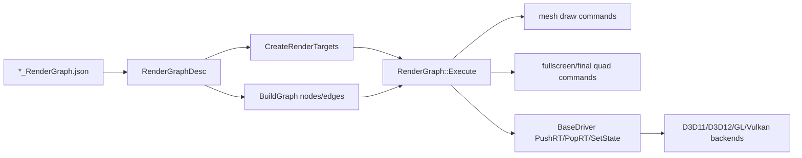
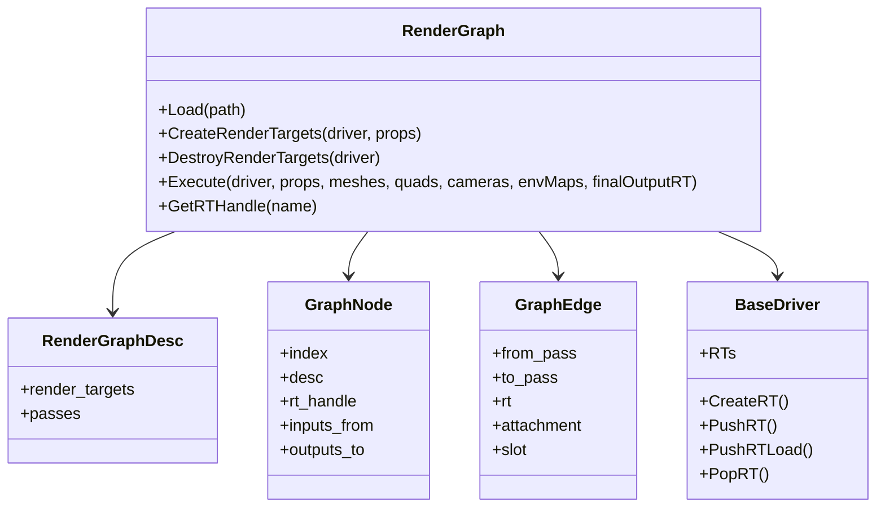
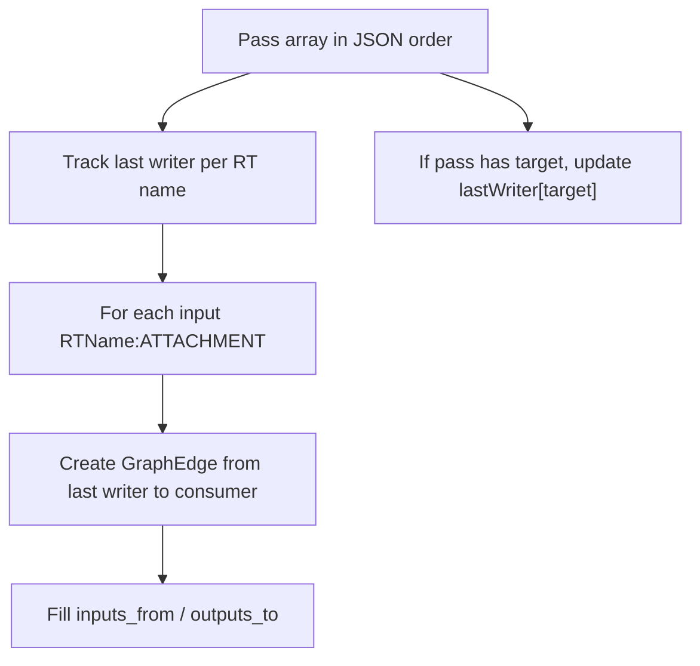
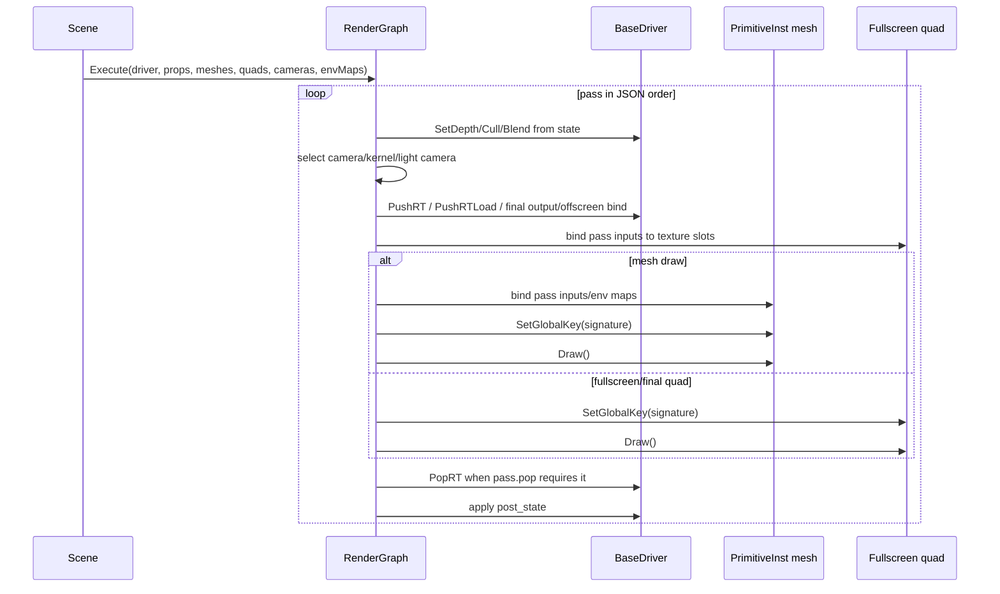
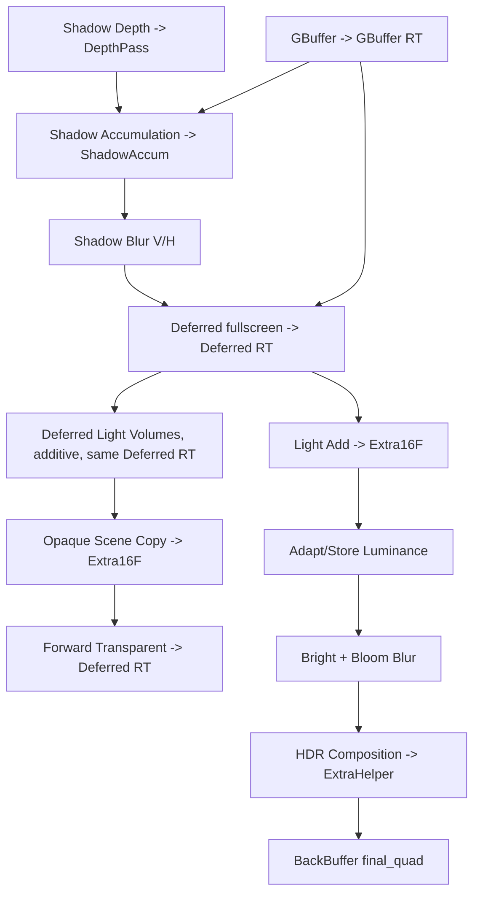

# Render Graph

Status: Stage 4 draft.

This document explains T850's data-driven render graph: JSON descriptors, render target creation, pass execution, input/output edges, render-target push/pop behavior, state overrides, mesh and fullscreen-quad draws, post-processing, and final output routing.

Related documents:

- [Main architecture](../architecture/main-architecture.md)
- [Loading geometry](../geometry/loading-geometry.md)
- [Shader management](shader-management.md)
- [Geometry rendering flow](geometry-rendering-flow.md)

## Purpose and responsibilities

The render graph is a runtime description of the frame pipeline. It does not replace the low-level API drivers; instead, it tells the Framework which render targets to allocate, which passes to run, which textures to bind between passes, which shader pass signature to use, and which render state overrides to apply.



## Key files and classes

| File/class | Role |
|---|---|
| `Framework/include/scene/RenderGraphDescriptor.h` | JSON-facing descriptor structs: `RTDesc`, `TextureInput`, `StateDesc`, `DrawCmd`, `RenderPassDesc`, `RenderGraphDesc`. |
| `Framework/include/scene/RenderGraph.h` | Runtime graph class, graph nodes/edges, environment texture slots, load/create/execute APIs. |
| `Framework/src/scene/RenderGraph.cpp` | Descriptor loading, string-to-enum maps, RT creation/destruction, graph-edge construction, pass execution. |
| `Framework/include/scene/RenderQuad.h` and `Framework/src/scene/RenderQuad.cpp` | Fullscreen quad primitive and post-process shader permutation creation. |
| `Framework/src/scene/RenderContainer.cpp` | Reusable wrapper that owns a `RenderGraph`, quads, scene props, and mesh instances. |
| `Framework/src/video/BaseDriver.cpp` | Generic `PushRT`, `PushRTLoad`, offscreen target binding, and shared RT state tracking. |
| API driver `PopRT()` implementations | Transition RT outputs back to shader-readable/backbuffer states and generate mips where supported. |
| `Assets/Scenes/*_RenderGraph.json` | Data-driven graph files for DayScene, SceneTemplate, SandboxScene, T8ditor, RagdollEditor, and Quake3Mock. |
| Scene/editor integration files | `DayScene.cpp`, `SceneTemplate.cpp`, `Quake3Mock.cpp`, `RagdollEditor.cpp`, `SandboxScene.cpp`, `EditorApp.cpp`. |

## Runtime ownership and lifetime

`RenderGraph` owns descriptor and graph metadata, but not GPU resources directly. GPU render targets are owned by `BaseDriver::RTs`; `RenderGraph` stores the driver RT handles by name in `m_rtHandles`.



Typical lifetime:

1. Scene/editor calls `m_renderGraph.Load("Scenes/..._RenderGraph.json")`.
2. Scene/editor calls `CreateRenderTargets()` after the driver and `SceneProps` are initialized.
3. `CreateRenderTargets()` allocates every `RTDesc` through `BaseDriver::CreateRT()` and then calls `BuildGraph()`.
4. Each frame calls `Execute()`.
5. Resize or graph reload calls `DestroyRenderTargets()` and `CreateRenderTargets()` again.
6. Scene shutdown calls `DestroyRenderTargets()`.

`RenderContainer` packages the same pattern for systems that want a reusable render target/graph container. It creates its own fullscreen quads, stores a `RenderGraph`, can own or borrow `SceneProps`, recreates RTs on resize, and executes the graph with either internally stored meshes or supplied mesh arrays.

## Descriptor JSON schema

The graph is loaded with glaze from JSON into `RenderGraphDesc`. Unknown keys are ignored, which lets JSON files carry future/editor-only fields without breaking current runtime parsing.

Top-level shape:

```json
{
  "render_targets": [],
  "passes": []
}
```

### Render targets

`render_targets[]` entries map to `RTDesc`.

| Field | Type | Meaning |
|---|---|---|
| `name` | string | Logical name used by pass targets and texture inputs. |
| `color_count` | int | Number of color attachments. Use `0` for depth-only targets. |
| `color_format` | string | Shared color format when `color_formats` is empty. |
| `color_formats` | string array | Per-color-attachment formats. Overrides `color_format`. |
| `depth_format` | string | Depth format, commonly `F32`, `CUBE_F32`, or `NONE`. |
| `size` | `[int,int]` | Explicit dimensions; `[0,0]` means screen/override size. |
| `linear_filter` | bool | Sets RT texture filtering to linear or nearest. |
| `generate_mips` | bool | Requests mip generation where supported. |
| `size_ref` | string | Named dynamic size such as `$shadow_resolution` or `$god_rays_resolution`. |

Supported color format strings:

- `NONE`
- `RGBA8`
- `RGBA16F`
- `RGBA32F`
- `R8`
- `F16`
- `RGB8`

Supported depth format strings:

- `NONE`
- `F32`
- `CUBE_F32`

`size_ref` is resolved from `SceneProps`:

- `$shadow_resolution` -> `SceneProps::ShadowMapResolution`
- `$god_rays_resolution` -> `SceneProps::GoodRaysResolution`

On Android, screen-sized render targets can be scaled by the hard-coded Android render scale in `RenderGraph::CreateRenderTargets()`. Width/height overrides are used for `[0,0]` targets when supplied by scenes/editor viewport hosts.

### Passes

`passes[]` entries map to `RenderPassDesc`.

| Field | Type | Meaning |
|---|---|---|
| `name` | string | Human-readable pass name and graph node id. Some runtime skips are name-based. |
| `target` | string | Render target name to bind. Empty string means draw to backbuffer/offscreen/final output. |
| `clear` | bool | Whether to clear after target binding. |
| `clear_color` | `[float,float,float,float]` | Clear color used when `clear` is true. |
| `clear_depth` | float | Descriptor field exists, but current clear path uses driver clear defaults rather than this value directly. |
| `state` | object | Pre-pass depth/cull/blend overrides. |
| `post_state` | object | Explicit state restoration after pass. |
| `camera` | string | `main`, `light`, or empty. |
| `gauss_kernel` | int | Sets `SceneProps::ActiveGaussKernel` for blur passes. |
| `active_light_camera` | int | Sets `SceneProps::ActiveLightCamera`. |
| `inputs` | array | Texture inputs consumed by this pass. |
| `bind_environment_map` | bool | Binds sky/IBL environment resources to quad/mesh slots. |
| `draws` | array | Mesh or quad draw commands. |
| `pop` | bool | Whether to pop/end the RT after drawing. Default true. |
| `push` | bool | Whether to push/bind the target before drawing. Default true. |
| `cube_faces` | int | Cubemap loop count, usually `6`. |
| `per_face_camera` | string | `omni` selects `omniCams[face]` during cubemap loops. |

### Texture inputs

`TextureInput` entries bind a source texture to a primitive texture slot.

```json
{ "source": "GBuffer:DEPTH", "slot": 4 }
```

Source format:

- `RTName:COLOR0` through `RTName:COLOR7`
- `RTName:DEPTH`
- `RTName` as shorthand for `RTName:COLOR0`
- built-ins beginning with `@`

Currently implemented built-in input:

- `@ssao_noise` -> `SceneProps::SSAOKernel.NoiseTex`

`RenderGraphDescriptor.h` mentions `@environment_map`, but the current execution path binds environment maps through `bind_environment_map`, not through this input string.

### State overrides

`state` and `post_state` use `StateDesc`.

Supported values:

| Field | Values |
|---|---|
| `depth_stencil` | `READ_WRITE`, `READ`, `NONE` |
| `cull_face` | `FRONT_FACES`, `BACK_FACES`, `FRONT_AND_BACK` |
| `blend` | `BLEND_DEFAULT`, `BLEND_OPAQUE`, `ADDITIVE`, `ALPHA_BLEND`, `NON_PREMULTIPLIED` |

State is only changed when a field is non-empty and recognized. Restoration is not automatic; use `post_state` when a pass changes state that later passes should not inherit.

### Draw commands

`DrawCmd` entries describe the work inside a pass.

| Field | Meaning |
|---|---|
| `type` | `mesh`, `fullscreen_quad`, or `final_quad`. Default is `fullscreen_quad`. |
| `mesh_indices` | Mesh indices to draw for `mesh`; empty array means draw all meshes. |
| `signature` | Render graph signature string resolved to a `ShaderKey` pass. |
| `extra_signatures` | Feature signatures OR'd into the main key. Currently used for `USE_OMNIDIRECTIONAL_SHADOWS`. |

Supported pass signatures include:

- `FORWARD_PASS`
- `GBUFF_PASS`
- `SHADOW_MAP_PASS`
- `FSQUAD_1_TEX`, `FSQUAD_2_TEX`, `FSQUAD_3_TEX`
- `DEFERRED_PASS`
- `SHADOW_COMP_PASS`
- `VERTICAL_BLUR_PASS`, `HORIZONTAL_BLUR_PASS`
- `BRIGHT_PASS`, `HDR_COMP_PASS`
- `ADAPT_LUMINANCE_PASS`
- `COC_PASS`, `COMBINE_COC_PASS`
- `DOF_PASS`, `DOF_PASS_2`
- `BACKBUFFER_PASS`
- `RAY_MARCH`
- `RADIAL_DEPTH_PASS`
- `LIGHT_RAY_MARCHING`
- `LIGHT_ADD`
- `FADE_PASS`
- `GOD_RAY_CALCULATION_PASS`, `GOD_RAY_BLEND_PASS`
- `SSAO_PASS`
- `DEFERRED_LDR_PASS`
- `DEFERRED_LIGHT_VOLUME_PASS`

Unknown signatures log an error and resolve to an empty valid key.

## Graph construction

`BuildGraph()` creates one `GraphNode` per pass and one `GraphEdge` per RT input dependency.



Important behavior:

- The graph stores dependency edges for inspection/debugging.
- Execution still happens in JSON pass order; there is no topological sort.
- Dependencies are resolved against the last writer seen so far, so pass ordering in JSON is meaningful.
- Built-in inputs beginning with `@` do not create graph edges.

## Execution flow

`RenderGraph::Execute()` receives:

- driver,
- `SceneProps`,
- contiguous `PrimitiveInst` mesh array,
- quad primitive array,
- main/light/omni cameras,
- environment texture indices,
- optional `finalOutputRT`.

It first scans enabled passes to detect whether `DEFERRED_LIGHT_VOLUME_PASS` is present and sets `SceneProps::DeferredLightVolumesEnabled`. Then it executes nodes in JSON order.

Some pass skipping is hard-coded:

- `Shadow Depth` is skipped when shadows are disabled.
- `Shadow Accumulation`, `Shadow Blur V`, and `Shadow Blur H` are skipped when both shadows and SSAO are disabled.
- Certain inputs are skipped/cleared when shadows or SSAO are disabled, such as `DepthPass:DEPTH`, `GBuffer:COLOR3`, `@ssao_noise`, and `ShadowAccum:*`.



## Render-target push/pop behavior

The graph drives the backend RT stack through `BaseDriver`.

| Graph/driver operation | Meaning |
|---|---|
| `PushRT(handle)` | Bind an RT for rendering using the backend's normal set/clear path. If another RT is current, it is popped first. |
| `PushRTLoad(handle)` | Bind an RT while preserving/loading existing contents. Used when `push=false` and the target was not already current. |
| `PopRT()` | End RT rendering and resume backbuffer/offscreen handling. Backends also transition resources or generate mips. |
| `BindOffscreenTarget(false)` | Used for offscreen mode when a pass targets the default output instead of a named RT. |

Graph flags:

- `push=true`, `pop=true`: normal isolated pass.
- `push=true`, `pop=false`: opens a target and leaves it current for a later continuation pass.
- `push=false`, `pop=false`: continue rendering into an already-open target.
- `push=false`, `pop=true`: continue/load a target and close it after drawing.

The SceneTemplate graph uses this for deferred composition, deferred light volumes, and forward transparent rendering into the same `Deferred` target.

Backend-specific `PopRT()` responsibilities:

- D3D11 and OpenGL generate mips for RTs marked `GenMips`.
- D3D12 transitions color/depth resources to shader-readable states.
- Vulkan ends the active render pass and transitions color/depth images to shader-read layouts.
- All backends reset `CurrentRT` or bind the active offscreen target as appropriate.

## Standard deferred pipeline

The common SceneTemplate graph follows this frame shape:



DayScene adds more post-processing, such as god rays and depth-of-field/CoC passes. T8ditor and SceneTemplate use smaller graph variants oriented around editor/runtime viewport needs.

## Fullscreen and final quads

`RenderQuad::Create()` creates the fullscreen quad primitive and precompiles many `FS_Quad` pass variants:

- deferred composition,
- fullscreen copy variants,
- blur passes,
- bright/HDR/luminance/DoF passes,
- backbuffer/final pass,
- god rays,
- SSAO,
- ray marching,
- light add,
- fade and lens flare passes.

During graph execution:

- `fullscreen_quad` draws use `quads[0]`.
- `final_quad` also currently uses `quads[0]`; its distinct type mainly changes the intent and makes sure input textures are rebound before final output.
- Mesh draw commands use the provided mesh `PrimitiveInst` array.

The `quads` comment in `RenderGraph.h` says `quads[7] = final`, but `RenderGraph::ExecutePass()` currently draws `quads[0]` for both fullscreen and final quad types. Editor debug overrides may draw selected RTs with other quad instances outside the graph.

## Environment and material texture slots

`RenderGraph.h` reserves slots for environment and advanced material resources:

| Slot | Meaning |
|---|---|
| 10 | diffuse IBL |
| 11 | specular IBL |
| 12 | BRDF LUT |
| 13 | Charlie IBL |
| 14 | Charlie LUT |
| 15 | Sheen E LUT |
| 16-23 | advanced material maps such as sheen, clearcoat, occlusion, specular, transmission |
| 25 | lightmap |

When `bind_environment_map` is true, the graph binds sky/environment resources to both fullscreen quads and mesh instances as appropriate. When false, it clears those slots to avoid leaking a previous pass's resources.

## Scene and editor integration

Examples:

- `DayScene` loads `Scenes/DayScene_RenderGraph.json`, creates RTs, caches RT handles, and calls `m_renderGraph.Execute()` each frame.
- `SceneTemplate` can choose a graph from a `.t8scene` render profile, falls back to `Scenes/SceneTemplate_RenderGraph.json`, and supports viewport/final-output RT overrides.
- `Quake3Mock`, `SandboxScene`, and `RagdollEditor` each load their own graph JSON.
- T8ditor loads `Scenes/T8ditor_RenderGraph.json`, copies visible editor objects into a contiguous mesh array, executes the graph, and can override the backbuffer with a selected RT debug texture afterward.
- `MeshEditorPanel` uses `Scenes/RagdollEditor_RenderGraph.json` for the embedded mesh editor view.

`GetRTHandle(name)` is used by scenes/editor overlays to access graph-created RTs for:

- debug RT viewing,
- adapting older pass handle fields,
- depth textures for wireframe overlays,
- benchmark/offscreen capture routing.

## Extension points

To add a new render graph feature:

1. Add fields to `RenderGraphDescriptor.h` if the JSON schema needs new data.
2. Add string mappings in `RenderGraph.cpp` for new formats, signatures, state names, or built-ins.
3. Precompile the matching shader pass in `RenderQuad::Create()`, `RenderMesh::GatherInfo()`, or the relevant primitive.
4. Extend `ExecutePass()` for new draw types, built-in texture sources, camera selectors, or pass-level behavior.
5. Update graph JSON files in `Assets/Scenes`.
6. Verify D3D12/Vulkan PSO behavior if the change alters RT formats, topology, input layout, or resource binding.

## Known limitations and gotchas

- Execution is JSON order, not topologically sorted graph order.
- Dependency edges only reflect RT inputs from the most recent prior writer.
- Unknown JSON keys are ignored; typos in unused fields may not fail parsing.
- Unknown signatures log an error but resolve to an empty valid `ShaderKey`, which may cause a later shader miss rather than a parse failure.
- `clear_depth` exists in the descriptor but is not directly used by the current clear call.
- State restoration is explicit. If a pass sets blend/depth/cull without `post_state`, later passes inherit that state.
- `@environment_map` is documented in comments as a possible built-in source, but current execution uses `bind_environment_map`.
- Pass skip logic for shadows/SSAO depends on specific pass names.
- `push=false`/`pop=false` continuation passes require careful ordering and can leave a target current longer than expected.
- D3D11/GL mip generation on pop is implemented, but D3D12/Vulkan mip generation is not equivalent in this path.
- `RenderGraph::Execute()` needs a contiguous `PrimitiveInst` array; editor code copies visible objects into one before executing.

## Debugging checklist

1. Check `[RenderGraph] Loaded` and `[RenderGraph] Created RT` logs for descriptor load and RT allocation.
2. Check `[RenderGraph] Built graph` node/edge count after `CreateRenderTargets()`.
3. Use `PrintGraph()` at debug log level to inspect pass dependencies and RT handles.
4. Verify JSON pass order when an input samples an RT written by another pass.
5. Confirm `GetRTHandle(name)` returns a non-negative handle for each expected RT.
6. For black fullscreen passes, verify `inputs[].source` and `slot` match the shader's expected texture registers.
7. For missing mesh output, verify draw `signature`, mesh index selection, pass camera, and depth/cull state.
8. For wrong blending or culling, check both `state` and `post_state`.
9. For D3D12/Vulkan issues, inspect RT format/depth format changes because they create distinct PSO/pipeline entries.
10. For editor output issues, confirm the editor passed a contiguous mesh array and the intended final-output RT.

