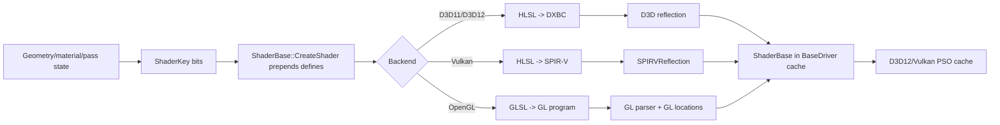
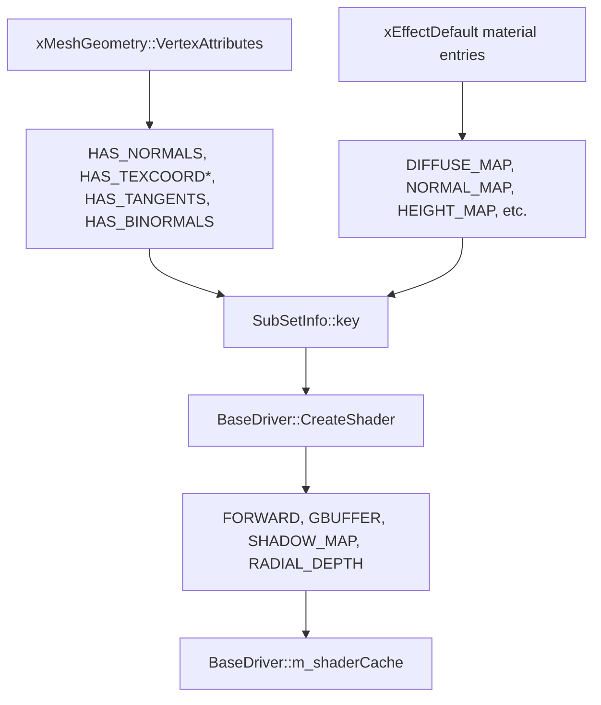
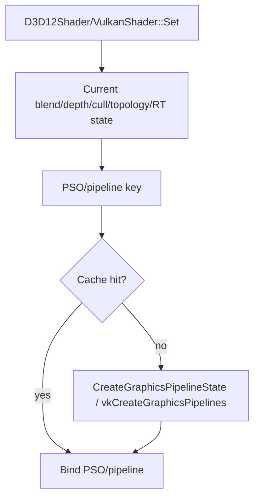

# Shader Management

Status: Stage 3 draft.

This document explains how T850 selects shader source files, builds `ShaderKey` permutations, prepends compile-time defines, compiles/caches shaders for D3D11, D3D12, OpenGL, and Vulkan, reflects resource/input layouts, and resolves explicit PSO objects on D3D12 and Vulkan.

Related documents:

- [Main architecture](../architecture/main-architecture.md)
- [Loading geometry](../geometry/loading-geometry.md)
- [Render graph](render-graph.md)
- [Geometry rendering flow](geometry-rendering-flow.md)

## Purpose and responsibilities

The shader system is responsible for:

1. Turning engine state into a stable `ShaderKey`.
2. Generating compile-time `#define` blocks from that key.
3. Selecting HLSL or GLSL source based on backend.
4. Creating backend shader objects and reflected input/resource layouts.
5. Caching compiled artifacts on disk and compiled shader objects in memory.
6. Feeding explicit pipeline-state caches on D3D12 and Vulkan.



## Key files and classes

| File/class | Role |
|---|---|
| `T850/Framework/Descriptors.h` | Defines `PassType`, `ShaderKey`, render formats, topology, buffer types, and related descriptors. |
| `Framework/include/video/BaseDriver.h` | Declares `ShaderBase`, `BaseDriver::CreateShader()`, `GetShader()`, and the in-memory shader cache. |
| `Framework/src/video/BaseDriver.cpp` | Builds `#define` strings from `ShaderKey`, creates backend shaders, records permutation dumps, and manages `m_shaderCache`. |
| `Framework/src/scene/RenderMesh.cpp` | Builds material/attribute keys for static meshes and requests common pass permutations. |
| `Framework/src/scene/RenderSkinnedMesh.cpp` | Adds skinning key bits and compiles skinned variants. |
| `Framework/src/video/d3d11/D3D11Shader.cpp` | D3D11 HLSL compile/cache/reflection/input-layout path. |
| `Framework/src/video/d3d12/D3D12Shader.cpp` | D3D12 HLSL compile/cache/reflection/root-signature path. |
| `Framework/src/video/gl/GLShader.cpp` | OpenGL GLSL compile/link or GL program-binary cache path. |
| `Framework/src/video/vulkan/VulkanShader.cpp` | Vulkan HLSL-to-SPIR-V compile/cache/reflection/descriptor-layout path. |
| `Framework/src/utils/ShaderDiskCache.cpp` | Cross-API on-disk shader artifact cache under `Shaders/.t8shadercache`. |
| `Framework/src/utils/SPIRVReflection.cpp` | Lightweight SPIR-V reflection for Vulkan descriptor bindings and vertex inputs. |
| `Framework/src/utils/ShaderPermutationDump.cpp` | Records requested `ShaderKey` permutations to JSON for offline/prewarm workflows. |
| `T850/Assets/Shaders/*` | HLSL and GLSL shader sources plus `shader_permutations.json`. |

## `ShaderKey`

`ShaderKey` is a 64-bit bitfield in `T850/Framework/Descriptors.h`. It combines vertex layout, material features, global toggles, and pass type into one lookup key.

Important details:

- `ShaderKey(0)` means an empty valid key.
- `ShaderKey()` means `0xFFFFFFFFFFFFFFFF` and is an invalid sentinel.
- `BaseDriver::m_shaderCache` stores compiled `ShaderBase*` by `ShaderKey::bits`.
- `BaseDriver::GetShader()` logs a cache miss with key bits and pass number.
- Pass type uses bits 20-25: `PASS_SHIFT = 20`, `PASS_MASK = 0x3F << 20`.

| Bit group | Meaning |
|---|---|
| Bits 0-4 plus 39-40 | Vertex layout bits: normals, tangents, binormals, UV0-UV3. |
| Bits 5-11 plus 31-38 and 41 | Texture/material maps: diffuse, specular, gloss, normal, height, metallic, clearcoat, sheen, occlusion, specular, transmission, lightmap. |
| Bits 12-14 | Special modes such as no-light, fresnel, omni shadows. |
| Bits 15-19 | Effect toggles: parallax, shadows, SSAO, autofocus, god rays. |
| Bits 20-25 | Mutually exclusive `PassType`. |
| Bits 26-30 | Extended toggles: parallax shadow, glTF tangent convention, skinning modes. |

`ShaderKey::VERTEX_ATTRIB_MASK` includes the bits that affect vertex input layout. `MaterialAsset.featureKey` deliberately strips `VERTEX_ATTRIB_MASK` and `PASS_MASK`, so material cache entries do not multiply by vertex layout or render pass.

## Pass types

`PassType` is a 6-bit enum. Common values include:

| Pass | Purpose |
|---|---|
| `FORWARD` | Default lit mesh rendering. |
| `GBUFFER` | Deferred geometry output. |
| `SHADOW_MAP` | Depth/shadow pass. |
| `RADIAL_DEPTH` | Radial/depth shadow or light-depth variant. |
| `FSQUAD_1_TEX`, `FSQUAD_2_TEX`, `FSQUAD_3_TEX` | Fullscreen quad variants by texture input count. |
| `DEFERRED`, `DEFERRED_LDR`, `DEFERRED_LIGHT_VOLUME` | Deferred composition/light volume passes. |
| `BRIGHT`, `HDR_COMP`, `COC`, `DOF`, `GOD_RAY_*`, `SSAO`, `FADE`, `LENS_FLARE_*` | Post-processing and effects passes. |

`ShaderBase::CreateShader()` maps pass values to defines such as `G_BUFFER_PASS`, `SHADOW_MAP_PASS`, `FSQUAD_1_TEX`, `DEFERRED_PASS`, `RADIAL_DEPTH_PASS`, `GOD_RAY_BLEND_PASS`, and others.

## Key creation flow for mesh shaders

`RenderMesh::GatherInfo()` builds the base key for each material subset:

1. Start with `ShaderKey(0)`.
2. Add vertex layout bits from `xMeshGeometry::VertexAttributes`.
3. Add material/texture bits from `xMaterial::EffectInstance.pDefaults`.
4. Add material conventions such as `GLTF_TANGENT_SPACE`.
5. Precompile a base material key and common pass variants.



During draw, the final key is recomposed:

1. Copy `SubSetInfo::key`.
2. Set the current global pass from `gKey.getPass()`.
3. OR in low feature bits from `gKey` using `(1 << PASS_SHIFT) - 1`.
4. If the subset has `HEIGHT_MAP` and runtime parallax is enabled, add `PARALLAX` for `FORWARD` or `GBUFFER`.
5. Call `BaseDriver::GetShader(finalKey)`.

`RenderSkinnedMesh` adds `HAS_SKINNING_TEX` to each subset key, creates a bone texture, and recompiles the same mesh shader sources with skinning defines enabled. It also creates pass variants for `FORWARD`, `GBUFFER`, `SHADOW_MAP`, and `RADIAL_DEPTH`.

## Defines generated from `ShaderKey`

All backends pass through `ShaderBase::CreateShader()`, which prepends defines to the source before backend compilation.

Common define mappings:

| Key bit / pass | Define |
|---|---|
| `HAS_NORMALS` | `USE_NORMALS` |
| `HAS_TEXCOORD0..3` | `USE_TEXCOORD0..3` |
| `HAS_TANGENTS` / `HAS_BINORMALS` | `USE_TANGENTS` / `USE_BINORMALS` |
| `DIFFUSE_MAP`, `NORMAL_MAP`, `HEIGHT_MAP`, etc. | Same-name map define, e.g. `DIFFUSE_MAP`, `NORMAL_MAP`, `HEIGHT_MAP`. |
| `GLTF_TANGENT_SPACE` | `GLTF_TANGENT_SPACE` |
| `HAS_SKINNING`, `HAS_SKINNING_QT`, `HAS_SKINNING_TEX` | `USE_SKINNING`, `USE_SKINNING_QT`, `USE_SKINNING_TEXTURE` |
| `PARALLAX`, `SHADOWS`, `SSAO`, `AUTO_FOCUS`, `GOD_RAYS` | `ENABLE_PARALLAX`, `ENABLE_SHADOWS`, `ENABLE_SSAO`, `AUTO_FOCUS`, `ENABLE_GOD_RAYS` |
| `PassType::GBUFFER` | `G_BUFFER_PASS` |
| `PassType::SHADOW_MAP` | `SHADOW_MAP_PASS` |
| `PassType::RADIAL_DEPTH` | `RADIAL_DEPTH_PASS` |

For OpenGL, `ShaderBase::CreateShader()` also prepends `#version 330` or `#version 300 es` plus `ES_30`, depending on build/platform macros. D3D and Vulkan HLSL do not get GLSL version headers.

## Source selection

`BaseDriver::UsesGLSL()` returns true only for OpenGL. Vulkan is intentionally on the HLSL path.

| Backend | Source files | Compile path |
|---|---|---|
| D3D11 | HLSL, e.g. `Shaders/VS_Mesh.hlsl`, `Shaders/FS_Mesh.hlsl` | `D3DCompile()` to `vs_5_0` / `ps_5_0`. |
| D3D12 | HLSL | `D3DCompile()` to `vs_5_0` / `ps_5_0`, then root signature and PSO from reflection. |
| Vulkan | HLSL | glslang with `EShSourceHlsl` to SPIR-V, entry points `VS` and `FS`. |
| OpenGL | GLSL, e.g. `Shaders/VS_Mesh.glsl`, `Shaders/FS_Mesh.glsl` | GL shader compile/link or program-binary cache. |

Important shader assets:

- `VS_Mesh.hlsl` / `FS_Mesh.hlsl`
- `VS_Mesh.glsl` / `FS_Mesh.glsl`
- `VS_Quad.*` / `FS_Quad.*`
- `VS_Text.*` / `FS_Text.*`
- `VS_EditorLine.*` / `FS_EditorLine.*`
- `VS_W.*` / `FS_W.*`
- `FS_WireMesh.*`
- `FS_LineFlat.*`
- `shader_permutations.json`

## Backend compilation and reflection

### D3D11

`D3D11Shader.cpp` compiles HLSL through `D3DCompile()`:

- vertex shader entry point: `VS`, target `vs_5_0`;
- pixel shader entry point: `FS`, target `ps_5_0`;
- compiled artifacts are cached as `vs.dxbc` and `fs.dxbc`;
- D3D reflection collects cbuffer bind slots;
- VS reflection builds `D3D11_INPUT_ELEMENT_DESC` entries and creates the input layout;
- `Set()` binds VS, PS, and input layout.

### D3D12

`D3D12Shader.cpp` also compiles HLSL to SM5 DXBC, but reflection is used more heavily:

- VS reflection builds the input layout and vertex stride.
- VS/FS reflection collects CBV/SRV/sampler resources.
- `BuildRootSignature()` creates inline root CBV parameters and descriptor tables for SRV/samplers.
- `Set()` binds descriptor heaps, root signature, and a cached PSO.

The D3D12 PSO key includes:

- shader pointer,
- blend/depth/cull state,
- topology,
- color attachment count and formats,
- depth format.

### Vulkan

`VulkanShader.cpp` compiles HLSL to SPIR-V through glslang:

- glslang input language: HLSL;
- entry points: `VS` and `FS`;
- target: Vulkan 1.0 / SPIR-V 1.0;
- automatic bindings and locations are enabled;
- texture/sampler transform mode upgrades HLSL texture/sampler usage into Vulkan-compatible sampled images.

On desktop Vulkan, the runtime shader disk cache stores `vs.spv` and `fs.spv`. On Android, the loader first tries precompiled SPIR-V candidates such as:

- `Shaders/spirv/<shaderName>.<ShaderKey>.spv`
- `Shaders/spirv/<shaderName>.spv`

If precompiled SPIR-V is absent, runtime glslang compilation is attempted. No checked-in `Shaders/spirv/*.spv` files were present during this pass.

`SPIRVReflection` parses the compiled module to classify:

- uniform buffers,
- sampled images,
- vertex stage inputs,
- cubemap sampled images.

UBO bindings are shifted by `VulkanShader::kMaxTextureSlots` through `SPIRVReflection::ShiftUBOBindings()` so UBO bindings do not collide with texture binding slots. Vulkan then builds:

- descriptor set layout from reflected UBO/image bindings,
- pipeline layout from that descriptor set layout,
- vertex input descriptions from reflected VS inputs.

The Vulkan pipeline key includes:

- shader pointer,
- blend/depth/cull state,
- topology,
- vertex stride,
- render target format/depth format,
- render pass key.

### OpenGL

`GLShader.cpp` uses the GLSL shader sources:

- attempts to load `program.glbin` if GL program binaries are supported;
- otherwise compiles vertex/fragment shaders, links a program, and stores a binary when possible;
- parses shader source to find attributes and uniforms;
- queries attribute and uniform locations through GL;
- `Set()` calls `glUseProgram()`, enables active vertex attributes, and disables stale attributes from a previous shader.

OpenGL does not use engine SPIR-V, D3D reflection, root signatures, or explicit PSO objects.

## Shader disk cache

`ShaderDiskCache` stores artifacts under:

```text
Shaders/.t8shadercache/<api>/<sha1>/
```

The cache key includes:

- cache format/version string,
- API name,
- driver signature,
- `ShaderKey::bits`,
- VS/FS names,
- VS/FS source text after defines are prepended.

The cache stores API-specific artifacts:

| API | Artifact |
|---|---|
| D3D11 | `vs.dxbc`, `fs.dxbc` |
| D3D12 | `vs.dxbc`, `fs.dxbc` |
| Vulkan | `vs.spv`, `fs.spv` |
| OpenGL | `program.glbin` |

`metadata.json` stores driver signatures per API. If the signature for an API changes, that API's cache directory is cleared. This prevents reusing binaries across driver/device/compiler changes.

## Shader permutation dump

`ShaderPermutationDump` records permutations requested through `BaseDriver::CreateShader()`. This is useful for prewarm/offline workflows and for checking whether a runtime draw key has actually been requested.

Enable it with:

```text
DayScene --dumpShaderPermutations --shaderPermutationOutput <path>
```

or with JSON config fields:

```json
{
  "dumpShaderPermutations": true,
  "shaderPermutationOutput": "Assets/Shaders/shader_permutations.json"
}
```

`DayScene/App.cpp` starts recording before app/framework creation and flushes after creation instead of running the normal update loop. The output JSON records key bits, pass, shader filenames, and defines. Existing entries are merged by key.

The checked-in `Assets/Shaders/shader_permutations.json` is an example/seed list of known requested permutations.

## Resource binding conventions

Mesh HLSL uses fixed register conventions. Examples from `VS_Mesh.hlsl` / `FS_Mesh.hlsl`:

| Resource | Register |
|---|---|
| `MeshFrameCB` | `b0` |
| `MeshInstanceCB` | `b1` |
| `MeshMaterialCB` | `b2` |
| `TextureRGB` | `t0` |
| `TextureSpecular` | `t1` |
| `TextureGloss` | `t2` |
| `TextureNormal` | `t3` |
| `texEnv` | `t4` |
| `TextureHeight` | `t5` |
| `TextureMetallic` | `t6` |
| scene and IBL textures | `t7` through `t15` |
| advanced PBR maps | `t16` through `t23` |
| `BoneTexture` | `t24` |
| `LightmapTex` | `t25` |
| material samplers | `s0` and up |

D3D backends use native register reflection. Vulkan reflects SPIR-V bindings after glslang auto-mapping and the engine UBO-binding shift. OpenGL uses names and locations.

## PSO interaction

D3D11 and OpenGL bind shader/program objects directly and keep most state mutable.

D3D12 and Vulkan need explicit pipeline objects. T850 keeps shader compilation separate from PSO creation:

1. Shader creation compiles source and reflects input/resources.
2. Draw-time `Shader::Set()` asks the driver for a PSO/pipeline matching the current render state.
3. The driver returns a cached object or creates a new one.



This means two draws with the same `ShaderKey` can still use different PSO objects if render target format, topology, culling, depth, blend, or render pass changes.

## Extension points

When adding shader features:

1. Add a new `ShaderKey` bit if the feature changes compiled shader code.
2. Add a define mapping in `ShaderBase::CreateShader()`.
3. Set the bit from geometry/material/render state, usually in `RenderMesh::GatherInfo()` or a render-graph pass setup.
4. Update HLSL and GLSL variants if the feature must support OpenGL.
5. Update resource binding/reflection assumptions if new textures, buffers, or samplers are introduced.
6. Add/prewarm representative permutations through `shader_permutations.json` or the dump workflow.
7. Validate D3D12 and Vulkan PSO creation if the change affects input layout or resource layout.

## Known limitations and gotchas

- `ShaderKey()` is invalid by design. Use `ShaderKey(0)` when constructing a new key to set bits.
- `EMISSIVE_MAP` aliases `REFLECT_MAP`, so emissive/reflect behavior shares one bit and define path.
- `ShaderKey::VERTEX_ATTRIB_MASK` covers UV0-UV3 only; adding more UV channels requires new bits and layout handling.
- D3D11/D3D12 shader model targets are hard-coded to `vs_5_0` and `ps_5_0`.
- Vulkan desktop can compile HLSL at runtime when the SPIR-V cache misses. Android tries precompiled SPIR-V names first, then falls back to runtime compile.
- OpenGL program binary caching only works if the driver reports program-binary support.
- D3D12 and Vulkan PSO caches are keyed by shader pointer, not just `ShaderKey` bits, so destroying/recreating shaders invalidates PSO reuse.
- Input layout is reflected from active shader inputs. If a define removes an input, the reflected stride/layout can change.
- Adding a texture/resource changes D3D12 root signature and Vulkan descriptor set layout, not only shader source.

## Debugging checklist

1. Log or inspect the final `ShaderKey::bits` and `getPass()` used at draw time.
2. Confirm `BaseDriver::CreateShader()` was called for that exact key before `GetShader()`.
3. Check for `GetShader miss` logs.
4. For mesh shaders, compare `xMeshGeometry::VertexAttributes`, `SubSetInfo::key`, `MeshAsset::vertexAttribMask`, and the reflected shader input layout.
5. Check shader-cache logs: `[ShaderCache][D3D11]`, `[ShaderCache][D3D12]`, `[ShaderCache][Vulkan]`, `[ShaderCache][GL]`.
6. For D3D compile failures, inspect the logged HLSL compiler error and the dumped define block.
7. For Vulkan binding errors, enable/inspect SPIR-V reflection logs and compare `cbvBindings`, `srvBindings`, descriptor layout bindings, and shader registers.
8. For D3D12 PSO failures, inspect the logged blend/depth/cull/topology/RT formats and root signature resources.
9. For OpenGL issues, check shader link logs, active attribute locations, and stale attribute disable behavior.
10. Regenerate or inspect `shader_permutations.json` if a runtime path is missing a prewarmed key.

