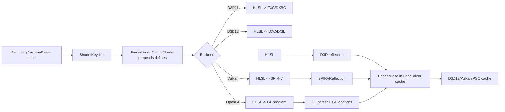
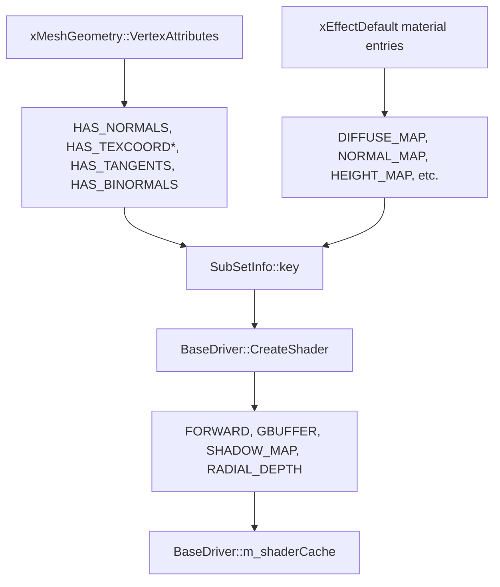
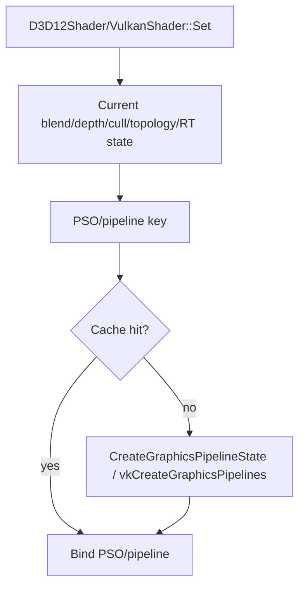

# Framework Ownership Update

Shader precompilation now lives in Framework `ShaderPrecompiler` and the
`ShaderTools` command host; scenes do not enumerate or manage shader caches.
`ConfigRuntime` owns shader-tool options and validation. The recorder owns its
exit flush registration. Existing launcher flags and progress output are retained.
Recorder merges validate the entire existing manifest through Glaze and replace
it atomically through ResourceLocator. Invalid input is preserved and reported
as a failure. Use one recording process per output manifest.

Opaque `DEFAULT_PASS` mesh variants do not require scene depth/color resources.
`FORWARD_PASS` variants explicitly compile compositing reads in all shader
languages, including the offline permutation manifest. Missing required WebGPU
resources are errors, not backend-provided scene-specific substitutes.

See [branch ownership audit](../architecture/webgpu-branch-ownership-audit.md)
for validation and remaining legacy ownership debt.

## Browser Shader Packages

Emscripten builds use the shared WebGPU driver with prepared WGSL and reflection
metadata, not the native HLSL/SPIR-V/Tint compiler. The Framework driver exports
these packages when `--webShaderOutput <directory>` is supplied to native WebGPU
compilation or a scene run. Export startup helpers as well as the recorded
manifest: some helper shaders are anonymous and are only requested at startup.

`WebGPUShaderPackage` checks request identity and payload integrity on loading;
missing, stale or corrupt packages fail explicitly. Browser preparation uses the
same scene and shader requests as native rendering, with no scene-owned cache
logic. Re-export after changing maintained shader sources or permutations.
See [browser build and Firefox validation](../platform/browser.md) for the
reproducible export/build commands, Minecraft evidence and remaining coverage.

# Shader Management

Status: verified against source on 2026-09-14.

This document explains how T850 selects shader source files, builds graphics and compute permutations, prepends compile-time defines, compiles/caches shaders for D3D11, D3D12, OpenGL, and Vulkan, reflects resource/input layouts, and resolves explicit PSO objects on D3D12 and Vulkan. D3D11, D3D12, and Vulkan execute the shared structured-buffer arithmetic kernel plus texture kernels for God Rays, separable blur, Bright, and HDR composition. D3D12 defaults to DXC/DXIL and retains explicit `legacyHLSL` FXC/DXBC artifacts.

Related documents:

- [Main architecture](../architecture/main-architecture.md)
- [Resource locator and cache paths](../architecture/resource-locator.md)
- [Dependency map](../dependency-map.md)
- [Loading geometry](../geometry/loading-geometry.md)
- [Textures, samplers, and IBL](textures-and-ibl.md)
- [Render graph](render-graph.md)
- [Geometry rendering flow](geometry-rendering-flow.md)

## Purpose and responsibilities

The shader system is responsible for:

1. Turning engine state into a stable `ShaderKey`.
2. Generating compile-time `#define` blocks from that key.
3. Selecting HLSL or GLSL source based on backend.
4. Creating backend shader objects and reflected input/resource layouts.
5. Caching compiled artifacts on disk and compiled shader objects in memory.
6. Feeding explicit pipeline-state caches on D3D12 and Vulkan.



## Key files and classes

| File/class | Role |
|---|---|
| `T850/Framework/Descriptors.h` | Defines `PassType`, `ShaderKey`, render formats, topology, buffer types, and related descriptors. |
| `Framework/include/video/BaseDriver.h` | Declares `ShaderBase`, `BaseDriver::CreateShader()`, `GetShader()`, and the in-memory shader cache. |
| `Framework/src/video/BaseDriver.cpp` | Builds `#define` strings from `ShaderKey`, creates backend shaders, records permutation dumps, and manages `m_shaderCache`. |
| `Framework/src/scene/RenderMesh.cpp` | Builds material/attribute keys for static meshes and requests common pass permutations. |
| `Framework/src/scene/RenderSkinnedMesh.cpp` | Adds skinning key bits and compiles skinned variants. |
| `Framework/src/video/d3d11/D3D11Shader.cpp` | D3D11 HLSL compile/cache/reflection/input-layout path. |
| `Framework/src/video/d3d12/D3D12Shader.cpp` | D3D12 HLSL compile/cache/reflection/root-signature path. |
| `Framework/src/video/d3d12/D3D12Compute.cpp` | D3D12 compute define, shared DXC/legacy compiler flow, cache, reflection, root-signature, PSO, dispatch, and readback path. |
| `Framework/src/video/gl/GLShader.cpp` | OpenGL GLSL compile/link or GL program-binary cache path. |
| `Framework/src/video/vulkan/VulkanShader.cpp` | Vulkan HLSL-to-SPIR-V compile/cache/reflection/descriptor-layout path. |
| `Framework/src/utils/ShaderDiskCache.cpp` | Cross-API on-disk shader artifact cache under `Shaders/.t8shadercache`. |
| `Framework/src/utils/SPIRVReflection.cpp` | Lightweight SPIR-V reflection for Vulkan descriptor bindings and vertex inputs. |
| `Framework/src/utils/ShaderPermutationDump.cpp` | Records requested `ShaderKey` permutations to JSON for offline/prewarm workflows. |
| `T850/Assets/Shaders/*` | HLSL and GLSL shader sources plus `shader_permutations.json`. |

## WebGPU Compiler Gate

Windows x64 now has an in-process compiler in
[WebGPUShaderCompiler.cpp](../../T850/Framework/src/video/webgpu/WebGPUShaderCompiler.cpp),
registered in Framework's MSBuild and CMake builds. The compiler is now consumed
by the [WebGPU driver](../development/windows-build-and-run.md#first-normal-webgpu-scene)
through a ShaderBase implementation. Normal forward and deferred runtime scenes
run through the existing mesh/material/render-graph path on Windows x64.
The 2026-09-15 close-out captured all ten available cases in both default `auto`
and strict `spirv` modes. The earlier `WGPU-RENDER-02`/`03` measurements below are
historical; residual image differences and case-specific visual acceptance are
not proof of universal pixel parity. T8ditor remains unavailable.
The stage-two detour adds maintained WGSL counterparts for all 17 HLSL stage
files under `Assets/Shaders`, including the mesh and fullscreen pass families.
The default file-loading path is `LoadShaderFiles(ShaderFileRequest, ...)`, with
`ShaderFileRequest::flow = ShaderFlow::Auto`: prefer handwritten WGSL and fall
back to the matching HLSL/SPIR-V source if WGSL cannot be prepared. Both flows
remain built in and independently selectable at runtime; no rebuild is required
to choose one. Native D3D12 independently uses DXC/DXIL by default and exposes
the old FXC path as `--shaderFlow legacyHLSL`; the shared HLSL sampling
corrections and their D3D12/Vulkan image checks are recorded below.
Maintaining matching HLSL and WGSL behavior is a testable source-maintenance
obligation.

Stage-two completion is limited to the implemented compiler infrastructure and
its documented tests, not 100% shader-port acceptance. The known derivative
uniformity blockers are fixed for the tested corpus as of 2026-09-15, while full rendering parity remains
unverified for the paths listed under [Automated HLSL/WGSL Tests](#automated-hlslwgsl-tests).

### Shader Flow Selection

| Mode | Compiler API | Behavior |
|---|---|---|
| `auto` (default) | `ShaderFlow::Auto` | Load/preprocess/reflect `.wgsl`; on failure, try the matching `.hlsl` through glslang/SPIR-V/Tint |
| `wgsl` | `ShaderFlow::Wgsl` | Direct WGSL only; failure is returned without trying HLSL |
| `spirv` | `ShaderFlow::Spirv` | HLSL/SPIR-V/Tint only; failure is returned without trying direct WGSL |

Set `name` to a resource-relative family stem or a `.hlsl`/`.wgsl` path. The flow,
not the supplied extension, chooses which sibling file to read through
ResourceLocator. Stage, entry point, binding layout, defines, key bits and the
specialization identity are identical for both attempts. The policy is per stage;
the future renderer must still validate stage interfaces and pipeline layouts.

Missing, unreadable, empty, preprocessing-invalid or reflection-invalid WGSL
triggers fallback in `auto`. A corrupt WGSL cache entry first regenerates from
WGSL source; a cache miss or cache-write failure alone does not switch flows.
Fallback returns a warning diagnostic retaining the original WGSL failure. If
both paths fail, both errors are retained and no partial artifact is returned.
SPIR-V fallback is best-effort, not a guarantee for arbitrary future source:
the known derivative-uniformity failures below are now regression-tested. This layer does not catch
later Dawn pipeline validation failures, device loss or rendering errors.

Every call tries the preferred path again, so a restored/fixed WGSL source takes
priority even when a fallback artifact is cached. Both source languages retain
separate cache identities; selection policy itself is not artifact identity,
so a forced `spirv` run may reuse a previous HLSL fallback entry, never a direct
WGSL entry. For controlled comparisons, use a forced mode and track cache state.

`ShaderFlowReport` records the requested policy, whether fallback was attempted,
total elapsed time and each attempted source's language/name, success, cache hit,
preparation time, total attempt time and diagnostic. The actual successful flow
is the successful attempt, not necessarily the requested policy. Attempt/total
time includes loading, caching and failed work; preparation time excludes cache
I/O and is zero on a hit or a missing source. These are CPU loading/compiler
measurements, not Dawn pipeline creation time or GPU frame timings.

For callers that already hold source text, `LoadOrTranslateShader` and
`TranslateShader` remain strict single-language APIs. Their existing HLSL default
is retained for compatibility; `ShaderSourceLanguage::Wgsl` selects direct text
preprocessing without glslang or SPIR-V. File-based consumers should use
`LoadShaderFiles` for the new default/fallback behavior. The stage-two probe exposes
the same modes. Normal DayScene startup and the explicit developer fixture both
accept `--shaderFlow auto|wgsl|spirv`. The runtime stores `webgpuShaderFlow`
(default `auto`), with CLI overriding the optional root JSON field. Missing/invalid
values fail before loading; the Windows host sets the driver policy before
initialization and shader creation on every WebGPU driver recreation. Logs record
the selected startup policy, then each shader's actual flow. Both Windows launchers
retain normal startup behavior and offer a WebGPU-only shader-flow selector for
WGSL preferred (`auto`) or HLSL translation (`spirv`). The saved choice is passed
on the next runtime launch; strict `wgsl` remains CLI-only. No fixture is injected. See
[runtime commands and strict-mode limitations](../development/runtime-configuration.md#webgpu-shader-flow).
All ten available runtime cases captured with the default policy; editor coverage
remains pending. Named engine shaders resolve through `Shaders/`; anonymous HLSL
debug shaders use `LoadOrTranslateShader` and explicitly log SPIR-V translation.
Strict WGSL rejects anonymous HLSL without a paired WGSL source. See
[WebGPU launcher selection](../development/windows-build-and-run.md#webgpu-launcher-selection).

The portable [preprocessor adapter](../../T850/Framework/src/utils/ShaderPreprocessor.cpp)
embeds [simplecpp 1.9.1](../../T850/Librerias/simplecpp/README.t850.md), pinned to
commit `2499b51390e6ea74b8fbad91154f5529134de31a` under 0BSD. Its unmodified
implementation/header and license are vendored, so no setup download or executable
is needed. Templates support nested `#if/#ifdef/#ifndef/#elif/#else/#endif`,
`#define`, `#undef`, and `#error`. The initial contract is ASCII with ordinary
non-nested C-style comments; this is not a general WGSL lexer. Includes, pragmas,
line directives and `__DATE__/__TIME__/__FILE__` are rejected. Caller-supplied text
comes through ResourceLocator; preprocessing does not open shader files. Output
contains no C `#line` markers. WGSL parser line numbers currently refer to emitted
text, not a full original-source map.

`GraphicsV1` maps registers `tN`, `sN`, and `bN` to group 0 bindings `N`, `32+N`,
and `64+N`. `BlurV1` maps compute `b0/t0/u0` to group 0 bindings `0/1/2`.
These are provisional compiler policies, not the final renderer's bind-group
layout. Reflection verifies the requested entry point/stage and returns active
resource kinds, uniform sizes/top-level member offsets, texture dimensions/scalar
types, comparison-sampler status, storage-format status, typed input/output
locations, depth-output status and compute workgroup size. Unsupported resource
kinds fail explicitly. Full nested-layout/access metadata and final pipeline/bind
group layout integration remain work for the renderer.

`LoadOrTranslateShader` reuses `ShaderDiskCache` and `ResourceLocator`. A new
single-stage key includes stage, entry point, source name, source/defines,
`ShaderKey` bits, source language, binding policy and caller specialization identity. The compiler
signature includes the pinned vcpkg revision, installed Dawn/glslang ABI hashes
and translator/preprocessor/simplecpp source/header hashes, generated and checked
by `SetupDawn.ps1`. Changing a WGSL file changes its source key without rebuilding
the compiler. Changing the preprocessor requires refreshing setup metadata.
The specialization argument is identity only; callers must supply specialized
HLSL/defines. WGSL workgroup overrides are not resolved by this API.

Each artifact is a checksummed `stage.wgsl.json` record under the `webgpu` cache.
Hits validate identity/checksum and reparse/reflect WGSL without rerunning
glslang or SPIR-V-to-WGSL translation. Corrupt, stale or invalid records miss and
regenerate. Cache-write failure returns a usable artifact with a diagnostic.
Adapter identity is not part of the portable WGSL key. Existing graphics-pair
cache keys and `ShaderKey` bit layout are unchanged.

### Automated HLSL/WGSL Tests

The [shader probe](../../T850/cmake/dawn-package/ShaderProbe.cpp) and
[numeric fixtures](../../T850/cmake/dawn-package/ShaderNumerics.cpp) provide
several independent checks instead of requiring visual inspection of each variant:

| Layer | Coverage |
|---|---|
| Preprocessing | Nested conditions, inactive parents, expressions, token preservation and malformed/unsupported directives |
| Source/cache | All 17 WGSL stages, native HLSL compilation, corruption recovery, invalidation and fresh-process warm hits |
| Flow selection | WGSL-first default, strict overrides, missing/invalid sources, entry-stage mismatch, fallback diagnostics, recovery to WGSL, invalid requests and cache separation |
| Vertex feature combinations | 1,024 mesh variants: seven attribute flags, four skinning modes, shadow/non-shadow; plus three wireframe skinning variants. Compare translated-HLSL bindings and typed locations, and native uniform layouts |
| Recorded corpus | All 254 recorded entries plus cascade-debug, quad depth-prepass, simple-color and 12 no-environment fixtures: 538 stages through both strict HLSL/SPIR-V/Tint and direct WGSL. Check native active bindings/dimensions/types, uniform sizes/offsets, fragment targets/depth, and vertex/fragment location compatibility in each path; no-environment variants must omit slots 6 and 10-15 |
| Matrix execution | 448 exact native-HLSL/D3D11 versus translated-WGSL/Dawn cases: non-symmetric matrices, multiplication directions, arrays and dynamic indexed matrix/vector/scalar loads |
| Blur execution | 60 fixtures across sizes, patterns and directions; native HLSL/D3D11, direct WGSL/Dawn/D3D12 and CPU reference. Includes borders, one-pixel sizes, non-workgroup-multiple dimensions and padded sentinel pixels |
| Function execution | 6,144 input/mode cases per mesh/fullscreen family call the production functions through test-only compute entry points: GGX distribution/visibility, Fresnel/IBL, attenuation, sheen, octahedral normals and color conversion |
| Test sensitivity | An in-memory mutation changes the blur divisor from 16 to 15; the numerical test must reject it |

GPU references use Dawn's exact DXGI adapter, with its LUID logged. Outputs are
read back after completion and checked for finite values. Blur tolerances are
`0.001 + 0.001 * abs(cpu)` for both implementations and their difference; padded
sentinels must match exactly. Function tests use RGBA16F readback and an absolute
error limit of `0.002 * max(abs(hlsl), 1)`. These tolerances are explicit test
policies, not proof of identical FP32 results. Observed Release maxima on the
RTX 4080 Laptop GPU were 0.00312519 absolute for blur and 0.000571102 scaled for
the function suite. Debug and Release passed locally on 2026-09-14.

The corpus is not an exhaustive inventory of future material combinations. Native
resource checks require all native active resources to exist in WGSL; WGSL can
retain additional resources referenced by functions that HLSL optimizes away.
The WGSL mesh/fullscreen ports no longer downgrade derivative-uniformity diagnostics.
Both paths pass strict validation for the recorded corpus, and the default mesh
stage participates in the same translation/cache checks as every other stage.
This does not establish exhaustive parallax, alpha/discard, transmission, lighting
composition or skinning execution parity. Those still require broader targeted
rendering tests beyond the native before/after captures below.

The shader-only tests above do not select an engine driver. The separate
stage-three graphics fixture uses the real WebGPU driver and shared Windows
factory, but still does not establish scene/editor parity. The driver consumes
the defines retained by `ShaderBase::CreateShader`, so the new file-loading path
does not reconstruct or duplicate the shared ShaderKey-to-defines logic. Visual snapshot
comparisons remain useful for final integration, but are no longer the only
regression signal.
See [build commands](../development/windows-build-and-run.md#shader-compiler-probe).

### Open Follow-Up: Derivative Uniformity

**Tracking ID:** `WGPU-SHADER-01`

**Status:** Known compiler failures fixed and regression-tested on 2026-09-15;
broader rendering acceptance remains open. The historical diagnostics below are
retained for context and are no longer expected failures on the tested variants.

#### Corrections and Native Image Checks

Before editing shaders, captured all seven runtime scene indices on D3D12 and
Vulkan at 1280x720, with five-second fixed-delta runs and every available FrameDumper
render target retained. The extended matrix produced 18 successful scene/API
references with no failed timed captures. Two additional Vulkan Q3 variants were
skipped by the capture script's VRAM guard; both Nexus variants were skipped for
missing model assets. These are skips, not passing tests or proof of hardware
incompatibility. The script now includes the previously omitted Minecraft case.

An unchanged-source replay control was captured before making fixes. VoxelScene
and Minecraft replay timed out on both APIs, so those scenes use preserved,
unchanged-source timed controls instead; their timed runs succeed. Other scenes
are compared against unchanged-source replays of the original snapshots. Shader
sources and the executable were backed up before editing. No accepted reference
was overwritten, and the user's unrelated WGSL edits were preserved.

Corrections in both HLSL and WGSL:

- DOF/DOF2, autofocus/CoC, shadow and SSAO depth/normal reads now explicitly select
  mip zero of single-mip render-target inputs, retaining the sampler's within-mip
  filtering. Conditional forward refraction reads do the same for scene color.
- SSAO noise sampling uses explicit gradients computed before the depth-dependent
  early return. Parallax's unchanged base-UV gradients are computed before its
  height-dependent loop and reused for height/self-shadow samples; material mip
  selection is not globally replaced with level zero.
- The forward lightmap read occurs before the depth-dependent discard, preserving
  its implicit mip selection. This can do extra sampling for fragments that later
  discard; no performance improvement or zero-overhead claim is made.
- Removed `diagnostic(warning, derivative_uniformity)` from both WGSL families.
  The corpus now requires strict SPIR-V translation too, and the former default
  mesh translator exclusion is removed.

Results for every before/after render target, within the same native API:

| Coverage | Result |
|---|---|
| All captured cases | 232 target pairs; identical target-name sets, no size mismatch |
| Exact equality | 228/232 images byte-identical |
| Minecraft deferred target | One channel-level maximum difference on each API, within tolerance 2 |
| Minecraft D3D12 backbuffer | 1/921,600 pixels outside tolerance 2; maximum channel difference 4 |
| Minecraft Vulkan backbuffer | 2/921,600 pixels outside tolerance 2; maximum channel difference 6 |
| All other scenes/targets | Byte-identical to matched unchanged-source controls |

No large native before/after divergence was found. The corrected Minecraft repeat
was byte-identical to the first corrected run: retain the tiny before/after
differences as observed changes, not presumed run-to-run noise. DayScene's saved
state enabled DOF, shadows, SSAO and parallax, but that does not imply exhaustive
material or parallax-self-shadow edge-case coverage. PPM checks do not expose all
HDR/alpha differences. GPU performance was not benchmarked.

The generated review set is under `T850/build/uniformity-native-20260915`:
`reference` (original frames), `replay-control`, `timed-control`, `candidate`,
`before-shaders`, `DayScene-before.exe`, and `all-target-comparison.json`.
`REVIEW.md` links paired PNGs; `reports/minecraft-*/snapshot_report.html` compares
all Minecraft targets. Generated evidence is local, not checked into Git.

All 11 CTests passed in both Debug and Release: strict 514-stage corpus in both
languages, 1,027 vertex variants, default/cache/flow tests, numerical GPU tests
and surface lifecycle. Normal forward SceneTemplate and Sandbox both completed
with `--shaderFlow spirv` and no runtime errors. Strict `wgsl` still encounters
anonymous HLSL debug shaders without WGSL counterparts; that is independent of
derivative uniformity. `WGPU-RENDER-02` remains a separate cross-API image-parity
investigation and was not closed by these native before/after tests.

Historical step-four evidence: one static normal-mapped helmet/IBL scene rendered through
the normal engine path with byte-identical native D3D12/WGSL captures at the tested
sizes. That initial result did not isolate the SPIR-V failure below or validate
broader material behavior; the subsequent corrections and evidence are above.

#### Historical Reproduction

From the source root containing `T850.sln`, with the installed-package Release
shader probe built:

```powershell
.\build\dawn-package\Release\DawnShaderProbe.exe `
    .\Assets\Shaders .\build\dawn-package\diagnostic-mesh-spirv `
    flow spirv FS_Mesh.hlsl
```

Before the fixes: exit code 1, `requested=spirv actual=none success=0 fallback=0`,
entry point `FS`, key `0x0`, and an empty defines list. The relevant diagnostic is:

```text
error: 'textureSample' must only be called from uniform control flow
note: control flow depends on possibly non-uniform value
note: parameter 'input' of 'v_6' may point to a non-uniform value
note: possibly non-uniform value passed via pointer here
note: parameter 'v_5' of 'FS_inner' may be non-uniform
note: possibly non-uniform value passed here
note: user-defined input 'v_99' of 'FS' may be non-uniform
```

Generated symbol names can change with compiler revisions. Capture the complete
diagnostic, source/define identity and Dawn/glslang pin when reproducing again.

The pre-fix 2026-09-15 normal-startup reproduction used
`DayScene.exe --api webgpu --shaderFlow spirv --scene 4 --sceneFile Scenes/ForwardScene.t8scene`.
The first failure was earlier than mesh loading: `RenderQuad::Create()` eagerly
compiled `FS_Quad.hlsl` `DOF_PASS`, key `0x1300008`, with defines `USE_TEXCOORD0`
and `DOF_PASS`. Tint reported `'textureSample' must only be called from uniform
control flow`, noting that a `textureSample` return value may be non-uniform.
The standalone default fullscreen stage passing does not cover this permutation.
Resolve both fullscreen and mesh cases; changing compilation order alone does not
fix the shader compatibility issue. Startup logs are under
`bin/x64/Release/logs/shader-flow-startup-spirv.log` in the local validation run.

Before the fixes, the CLI wiring was tested in normal startup: `auto` completed, strict `spirv`
reported the above failure without a WGSL attempt, and strict `wgsl` rejected an
anonymous HLSL debug shader with no WGSL source. These are distinct limitations:
the missing anonymous WGSL counterpart does not block HLSL/SPIR-V compilation.

#### Confirmed Facts and Open Questions

- Implicit-LOD texture sampling depends on fragment derivatives. Potentially
  divergent branches, loops or discard can invalidate the uniform-control-flow
  requirement; native HLSL compilation alone does not prove portability.
- [TranslateShader](../../T850/Framework/src/video/webgpu/WebGPUShaderCompiler.cpp)
  calls `tint::SpirvToWgsl` with strict validation and the narrowly enabled
  `unrestricted_pointer_parameters` language feature needed by generated indexed
  matrix helpers. WGSL reflection enables the same feature. The direct WGSL mesh and
  fullscreen templates previously contained `diagnostic(warning, derivative_uniformity)`;
  those overrides have been removed, and both paths now use strict validation.
- In [FS_Mesh.hlsl](../../T850/Assets/Shaders/FS_Mesh.hlsl), `BuildSurface` previously
  evaluated `ddx`/`ddy` inside the height-dependent parallax loop. Those invariant
  gradients are now computed before the loop. `SampleGrad` alone was insufficient
  when calculating its arguments already required divergent derivatives.
- Also inspect `ApplyAlphaMask` before subsequent texture samples and the
  conditional `SceneColorTex.Sample` in forward transmission. These are investigation
  targets, not proof that each one causes the reproduced diagnostic.
- The default reproduction has no feature defines, so the parallax loop is not
  the sole cause. The diagnostic names translated functions rather than original
  HLSL statements. Isolate the exact failing sample(s) before attributing the
  default failure to parallax, discard or transmission.
- Conservative uniformity tracking through translated pointer/output parameters
  is another possibility, not a confirmed Tint bug. Preserve a minimal reproducer
  if source data is uniform but the translated program cannot prove it.

#### Investigation and Closure Checklist

- [ ] Map the default failure to the original HLSL operation using a reduced
  shader or diagnostic translation output; keep the validation failure as a regression.
- [ ] Test feature variants separately: normal/height maps, parallax and its
  self-shadowing, alpha masking, and textured/untextured transmission. Extend the
  existing probe/numeric test infrastructure rather than adding a Launcher test mode.
- [x] Where appropriate, compute gradients in uniform control flow before loops,
  branches or discard, and pass them to `SampleGrad`/`textureSampleGrad`. Preserve
  the intended UV transforms and filtering; do not assume moving any gradient
  calculation automatically preserves the rendered result.
- [x] Revalidate affected variants with strict uniformity diagnostics in both flows.
  Remove the mesh/fullscreen warning overrides only once their affected paths pass.
  Blanket suppression or forcing mip level zero is not a correctness fix.
- [ ] Compare native HLSL, direct WGSL and translated WGSL on the same adapter,
  with identical textures, samplers and render settings. Include minification,
  grazing angles, parallax termination boundaries, alpha edges and neighboring
  fragments that take different branches. Record captures and justified tolerances.
- [x] Run the recorded permutation/contract suite and targeted graphics pipelines,
  plus cold/warm cache checks. Exercise `auto` with a deliberately missing/invalid
  WGSL source in isolated test assets and verify successful `actual=spirv` fallback;
  restoring WGSL must restore the preferred flow.
- [ ] Record tested variants and remaining exceptions here. Close this item only
  when the reproduced failure and affected feature cases pass validation and
  rendering checks, not merely because a warning was hidden or a simple draw worked.

### Open Follow-Up: Sandbox Deferred Parity

**Tracking ID:** `WGPU-RENDER-02`

**Status:** Historical initial failure, measured on 2026-09-14 after MRT integration.
The missing float-texture update and subsequent compiler/SSAO fixes supersede
this checkpoint. Current Sandbox final output has 18 pixels outside tolerance 2
at 1280x720, maximum delta 6, in both flows. See the
[runtime handoff](webgpu-runtime-summary.md) for all-target results and limits.
Neither nonblank capture nor this improvement proves universal pixel equality.

The normal Sandbox graph runs unchanged on WebGPU with the existing helmet model
and direct WGSL shaders. No production shader source or diagnostic-severity
setting was changed in the MRT implementation. Native D3D12 and WebGPU both pass
the capture workflow's runtime/error/nonblank checks. At 640x480, comparing raw
targets with tolerance 2 gives:

| Target | Pixels Outside Tolerance | Maximum Channel Delta |
|---|---:|---:|
| GBuffer depth / shadow depth | 0 | 0 |
| GBuffer albedo / PBR | 1 each | 16 |
| Other GBuffer color targets | 0 | 0 or 1 |
| Shadow accumulation | 3,334 (1.09%) | 15 |
| Deferred / Extra16F | 7,090 (2.31%) each | 252 |
| HDR final | 5,431 (1.77%) | 245 |
| Bloom | 1,493 (0.57%) | 38 |
| Backbuffer | 15,641 (5.09%) | 199 |

Artifacts: `build/webgpu-mrt-sandbox-validation/candidate/sandbox/{d3d12,webgpu}`
contains the manifests and final captures. With `-KeepRawDumps`, use each
`capture.json` `SourceDump` under `bin/x64/Release` to compare intermediate targets.
The measured pair was `dumps_d3d12_f6_20260914_231603` and
`dumps_webgpu_f6_20260914_231601`; generated artifacts are not versioned.
See [reproduction commands](../development/windows-build-and-run.md#mixed-format-mrt-follow-up).

A large black-background mismatch was fixed at the driver boundary: binding a
new target must clear RGBA to zero, including GBuffer material-ID alpha. Previously
alpha 1 made background pixels appear to contain a material. The MRT regression
now checks this. The table records the remaining mismatch after that fix.

Comparison controls checked: the paired snapshot documents differ only in the
API tag. Matching native depth-sampler filtering precedence (border mode forces
linear filtering even with a nearest flag) did not change these image metrics in
the tested configuration. The later confirming pair is
`dumps_d3d12_f6_20260914_232608` / `dumps_webgpu_f6_20260914_232606`, with manifests
under `build/webgpu-mrt-sandbox-filter-validation`. This rules out that precedence
difference as the sole cause here, not all filtering/addressing issues. WebGPU
still uses clamp-to-edge rather than native white-border addressing.

- [ ] Reproduce with matched snapshot state and compare the first divergent
  pass, not only the final image. Inspect shadow/SSAO sampling, precision and
  sampler addressing/filtering, including native depth-border behavior versus
  WebGPU clamp behavior. These are investigation targets, not confirmed causes.
- [ ] Check deferred inputs including alpha channels and unclamped HDR values;
  PPM equality alone cannot prove equality of those values.
- [ ] Validate filtered-depth copy interpolation and invalidation with varying
  depth values at discontinuities; the isolated regression currently covers
  constant values, clear/refresh and partial scissor preservation.
- [ ] Isolate fullscreen/mesh shader differences only after matching resource
  and sampling state. Preserve user edits in `FS_Quad.wgsl`; do not replace it
  wholesale or hide diagnostics to pass the comparison.
- [ ] Rerun paired Sandbox targets and native API regressions after fixes.
  Record remaining exceptions explicitly; do not mark full deferred support or
  all-scene compatibility complete while this comparison is failing.

### Open Follow-Up: Translated Shader Rendering

**Tracking ID:** `WGPU-RENDER-03`

**Status:** Demonstrated matrix/compiler/resource defects are fixed; final runtime
validation is recorded in the [handoff](webgpu-runtime-summary.md). Universal
pixel parity is not claimed. The two residuals below were visually
reviewed and accepted by the user on 2026-09-15; they no longer require corrective
work for those captured states. The original failure report is retained below
as historical evidence, not the current result for these cases.

#### Accepted Visual Exceptions

Both pairs compare native D3D12 with strict-SPIR-V WebGPU at 1280x720 using the
same replay snapshot; the resulting snapshots differ only by API.

| Reviewed case | Measured residual | Decision |
|---|---|---|
| RagdollEditor shadow accumulation | 11,739 pixels (1.27%) exceed tolerance 2; maximum RGB-channel delta 69/255. Shadows are disabled and SSAO is enabled. | Visually accepted |
| Quake3Mock final image and PBR close-up | 103 final pixels (0.011%) exceed tolerance 2; maximum delta 194/255. PBR differs at one silhouette pixel, `(926, 221)` (zero-based), with maximum delta 255/255. Shadow accumulation is byte-identical. | Visually accepted |

Ragdoll evidence is under `T850/build/spirv-ssao-view-depth-20260915`, including
the paired buffers and amplified difference image in `reports/ragdoll-editor`.
Quake3 evidence is under `T850/build/spirv-final-fixes-20260915`, including the
paired final images, amplified difference and pixel close-up in `reports/quake3`.
These are different capture checkpoints; the Quake3 pair predates the latest
SSAO formulation change.

Acceptance is case-specific visual approval, not pixel equality or a change to
the automated tolerance of 2. The SSAO noise and kernel inputs were identical
between APIs, so do not attribute the residual to different random inputs.
No blanket all-scene or editor acceptance is implied.

#### Historical Initial Failure

Cross-API rendering validation initially failed on 2026-09-15.
The known derivative-uniformity compiler failures were corrected and strict
translation tests pass, but that does not establish correct rendered output.
This is distinct from the smaller direct-WGSL Sandbox mismatch in `WGPU-RENDER-02`.

Captured the normal runtime scene matrix on Windows x64 Release at 1280x720,
comparing native D3D12 with WebGPU `--shaderFlow spirv`. Both replay-capable runs
use the same native reference snapshot. Minecraft and VoxelScene use matched
five-second fixed-delta timed runs because their replay path previously timed out
even on native APIs. No shader, renderer or scene changes were made for this run.

Ten available native cases captured successfully. Nine corresponding WebGPU
cases passed the runtime/nonblank-image gate, but none passed final-image parity.
Across those pairs, 127 render-target images were compared: 32 match within
tolerance 2 and 95 differ. All completed pairs have identical target-name sets
and dimensions. Final-image differences count pixels whose maximum RGB-channel
delta exceeds 2/255:

| Case | Pixels Outside Tolerance | Maximum Channel Delta |
|---|---:|---:|
| Forward SceneTemplate | 10.07% | 255 |
| Sandbox | 99.76% | 242 |
| DayScene | 100.00% rounded | 101 |
| Quake3Mock | 99.60% | 255 |
| RagdollEditor runtime scene | 98.53% | 154 |
| SceneTemplate / Q3 Jolt | 99.73% | 242 |
| SceneTemplate / Q3 | 93.54% | 255 |
| SceneTemplate / Day | 100.00% | 107 |
| Minecraft | 100.00% | 152 |

VoxelScene exits 1 without a capture, reporting `Sampled texture missing or aliases
active attachment at binding 6` after successful mesh shader translation.
Investigate the shader's actual resource use and scene bindings; do not silently
substitute a dummy material resource to make the test pass. Nexus is skipped on
both APIs for missing `nexus_wars_terrain.glb` and `marine.glb` assets.

#### Verified Controls

- All nine successful WebGPU logs report startup `spirv`, with no `actual=wgsl`
  or `fallback=1` engine shader load. Internal ImGui/renderer utility shaders are
  outside this source-flow option.
- Resulting snapshot documents differ only by API. This confirms captured
  camera/light/render state, not complete simulation-state equivalence.
- Forward and Sandbox SPIR-V repeats have byte-identical targets (17/17 total).
  The large differences are reproducible, not merely capture noise.
- Direct-WGSL-first controls use the same native snapshots and WebGPU driver:
  forward matches native within one channel level; Sandbox GBuffer depth matches
  exactly and normals differ by at most one channel level. Its final backbuffer
  retains the approximately 5.08% direct-WGSL mismatch at this viewport.
- Strict-SPIR-V Sandbox diverges already in GBuffer depth (10.23%), normals
  (15.60%) and albedo (13.79%); shadow depth is exact in that case. The forward
  helmet's geometry/silhouette changes visibly. SceneTemplate/Day also diverges
  in geometry/depth, before post-processing. Therefore this cannot be treated
  solely as the earlier direct-WGSL fullscreen shading difference.

#### Next Checks

- [ ] Isolate translated vertex execution with nonidentity world/view/projection
  transforms and compare to native/direct WGSL using identical raw buffers.
  Check matrix interpretation, vertex input locations/strides, transforms and
  stage-varying semantics. Current layout size/member-offset tests do not prove
  correct matrix interpretation. None of these candidates is yet a confirmed cause.
- [ ] Inspect translated fullscreen varying and environment-direction behavior
  separately from mesh geometry; the Sandbox background is visibly different.
- [ ] Diagnose VoxelScene's binding 6 failure without weakening required-resource
  validation or changing the selected scene.
- [ ] Repeat all per-target comparisons after fixes, preserving these images and
  the prior native before/after shader references. Do not mark the SPIR-V renderer
  visually complete on the strength of shader compilation alone.

Generated evidence is local under `T850/build/spirv-native-parity-20260915`:
`REVIEW.md` links all native/SPIR-V images and HTML per-target reports, direct-WGSL
controls, failure logs and metrics. `candidate/manifest.json` includes failed and
skipped cases; `all-target-comparison.json` contains 127 rows, `comparison-controls.json`
records source-flow/snapshot/target checks, and `repeatability.json` records repeats.
The capture script now supports `-ShaderFlow spirv` and
`-ReplayFromRunSet reference -ReplayApi d3d12`. `-KeepRawDumps` also copies every
PPM beside each case manifest, so reports do not depend on raw dump discovery.
See [commands](../development/windows-build-and-run.md#strict-spir-v-visual-comparison).

## `ShaderKey`

`ShaderKey` is a 64-bit bitfield in `T850/Framework/Descriptors.h`. It combines vertex layout, material features, global toggles, and pass type into one lookup key.

Important details:

- `ShaderKey(0)` means an empty valid key.
- `ShaderKey()` means `0xFFFFFFFFFFFFFFFF` and is an invalid sentinel.
- `BaseDriver::m_shaderCache` stores compiled `ShaderBase*` by `ShaderKey::bits`.
- `BaseDriver::GetShader()` logs a cache miss with key bits and pass number.
- Pass type uses bits 20-25: `PASS_SHIFT = 20`, `PASS_MASK = 0x3F << 20`.

| Bit group | Meaning |
|---|---|
| Bits 0-4 plus 39-40 | Vertex layout bits: normals, tangents, binormals, UV0-UV3. |
| Bits 5-11 plus 31-38 and 41 | Texture/material maps: diffuse, specular, gloss, normal, height, metallic, clearcoat, sheen, occlusion, specular, transmission, lightmap. |
| Bits 12-14 | Special modes such as no-light, fresnel, omni shadows. |
| Bits 15-19 | Effect toggles: parallax, shadows, SSAO, autofocus, god rays. |
| Bits 20-25 | Mutually exclusive `PassType`. |
| Bits 26-30 | Extended toggles: parallax shadow, glTF tangent convention, skinning modes. |

`ShaderKey::VERTEX_ATTRIB_MASK` includes the bits that affect vertex input layout. `MaterialAsset.featureKey` deliberately strips `VERTEX_ATTRIB_MASK` and `PASS_MASK`, so material cache entries do not multiply by vertex layout or render pass.

## Pass types

`PassType` is a 6-bit enum. Common values include:

| Pass | Purpose |
|---|---|
| `FORWARD` | Default lit mesh rendering. |
| `GBUFFER` | Deferred geometry output. |
| `SHADOW_MAP` | Depth/shadow pass. |
| `RADIAL_DEPTH` | Radial/depth shadow or light-depth variant. |
| `FSQUAD_1_TEX`, `FSQUAD_2_TEX`, `FSQUAD_3_TEX` | Fullscreen quad variants by texture input count. |
| `DEFERRED`, `DEFERRED_LDR`, `DEFERRED_LIGHT_VOLUME` | Deferred composition/light volume passes. |
| `BRIGHT`, `HDR_COMP`, `COC`, `DOF`, `GOD_RAY_*`, `SSAO`, `FADE`, `LENS_FLARE_*` | Post-processing and effects passes. |

`ShaderBase::CreateShader()` maps pass values to defines such as `G_BUFFER_PASS`, `SHADOW_MAP_PASS`, `FSQUAD_1_TEX`, `DEFERRED_PASS`, `RADIAL_DEPTH_PASS`, `GOD_RAY_BLEND_PASS`, and others.

## Key creation flow for mesh shaders

`RenderMesh::GatherInfo()` builds the base key for each material subset:

1. Start with `ShaderKey(0)`.
2. Add vertex layout bits from `xMeshGeometry::VertexAttributes`.
3. Add material/texture bits from `xMaterial::EffectInstance.pDefaults`.
4. Add material conventions such as `GLTF_TANGENT_SPACE`.
5. Precompile a base material key and common pass variants.



During draw, the final key is recomposed:

1. Copy `SubSetInfo::key`.
2. Set the current global pass from `gKey.getPass()`.
3. OR in low feature bits from `gKey` using `(1 << PASS_SHIFT) - 1`.
4. If the subset has `HEIGHT_MAP` and runtime parallax is enabled, add `PARALLAX` for `FORWARD` or `GBUFFER`.
5. Call `BaseDriver::GetShader(finalKey)`.

`RenderSkinnedMesh` adds `HAS_SKINNING_TEX` to each subset key, creates a bone texture, and recompiles the same mesh shader sources with skinning defines enabled. It also creates pass variants for `FORWARD`, `GBUFFER`, `SHADOW_MAP`, and `RADIAL_DEPTH`.

## Defines generated from `ShaderKey`

All backends pass through `ShaderBase::CreateShader()`, which prepends defines to the source before backend compilation.

Common define mappings:

| Key bit / pass | Define |
|---|---|
| `HAS_NORMALS` | `USE_NORMALS` |
| `HAS_TEXCOORD0..3` | `USE_TEXCOORD0..3` |
| `HAS_TANGENTS` / `HAS_BINORMALS` | `USE_TANGENTS` / `USE_BINORMALS` |
| `DIFFUSE_MAP`, `NORMAL_MAP`, `HEIGHT_MAP`, etc. | Same-name map define, e.g. `DIFFUSE_MAP`, `NORMAL_MAP`, `HEIGHT_MAP`. |
| `GLTF_TANGENT_SPACE` | `GLTF_TANGENT_SPACE` |
| `HAS_SKINNING`, `HAS_SKINNING_QT`, `HAS_SKINNING_TEX` | `USE_SKINNING`, `USE_SKINNING_QT`, `USE_SKINNING_TEXTURE` |
| `PARALLAX`, `SHADOWS`, `SSAO`, `AUTO_FOCUS`, `GOD_RAYS` | `ENABLE_PARALLAX`, `ENABLE_SHADOWS`, `ENABLE_SSAO`, `AUTO_FOCUS`, `ENABLE_GOD_RAYS` |
| `PassType::GBUFFER` | `G_BUFFER_PASS` |
| `PassType::SHADOW_MAP` | `SHADOW_MAP_PASS` |
| `PassType::RADIAL_DEPTH` | `RADIAL_DEPTH_PASS` |

For OpenGL, `ShaderBase::CreateShader()` also prepends `#version 330` or `#version 300 es` plus `ES_30`, depending on build/platform macros. D3D and Vulkan HLSL do not get GLSL version headers.

## Source selection

`BaseDriver::UsesGLSL()` returns true only for OpenGL. Vulkan is intentionally on the HLSL path.

| Backend | Source files | Compile path |
|---|---|---|
| D3D11 | HLSL, e.g. `Shaders/VS_Mesh.hlsl`, `Shaders/FS_Mesh.hlsl` | `D3DCompile()` to `vs_5_0` / `ps_5_0`. |
| D3D12 | HLSL | Default DXC to the highest supported SM6 profile (up to 6.6) and DXIL; `legacyHLSL` uses `D3DCompile()` SM5/DXBC. |
| Vulkan | HLSL | glslang with `EShSourceHlsl` to SPIR-V, entry points `VS` and `FS`. |
| OpenGL | GLSL, e.g. `Shaders/VS_Mesh.glsl`, `Shaders/FS_Mesh.glsl` | GL shader compile/link or program-binary cache. |

Although D3D12 and Vulkan share the same HLSL source files, they do not share the same compiler or final shader representation. D3D12 defaults to DXIL through DXC, while Vulkan compiles HLSL to SPIR-V through glslang with automatic binding/location mapping and SPIR-V reflection. Treat shared HLSL as shared intent, not proof of identical raster/depth behavior.

Depth-sensitive shaders need extra care across these two backends. Prefer API-rasterized fragment depth (`SV_POSITION.z` in the pixel shader, or `gl_FragCoord.z` in GLSL) when comparing against sampled depth textures. Avoid manually passing clip depth through a regular interpolated varying and recomputing `z / w` for overlay depth tests; tiny meshes can expose Vulkan/D3D differences as shell-like wireframe artifacts.

Important shader assets:

- `VS_Mesh.hlsl` / `FS_Mesh.hlsl`
- `VS_Mesh.glsl` / `FS_Mesh.glsl`
- `VS_Quad.*` / `FS_Quad.*`
- `VS_Text.*` / `FS_Text.*`
- `VS_EditorLine.*` / `FS_EditorLine.*`
- `VS_W.*` / `FS_W.*`
- `FS_WireMesh.*`
- `FS_LineFlat.*`
- `shader_permutations.json`

## Backend compilation and reflection

### D3D11

`D3D11Shader.cpp` compiles HLSL through `D3DCompile()`:

- vertex shader entry point: `VS`, target `vs_5_0`;
- pixel shader entry point: `FS`, target `ps_5_0`;
- compiled artifacts are cached as `vs.dxbc` and `fs.dxbc`;
- D3D reflection collects cbuffer bind slots;
- VS reflection builds `D3D11_INPUT_ELEMENT_DESC` entries and creates the input layout;
- `Set()` binds VS, PS, and input layout.

### D3D12

`D3D12Shader.cpp` loads the staged `dxcompiler.dll`, selects the highest reported
SM6 profile up to 6.6, compiles HLSL through `IDxcCompiler3`, and stores DXIL plus
DXC reflection data. `IDxcUtils::CreateReflection` restores reflected input and
resource layouts from cold or warm artifacts. `--shaderFlow legacyHLSL` retains
the prior SM5 FXC/DXBC path. In both flows reflection is used heavily:

- VS reflection builds the input layout and vertex stride.
- VS/FS reflection collects CBV/SRV/sampler resources.
- `BuildRootSignature()` creates inline root CBV parameters and descriptor tables for SRV/samplers.
- `Set()` binds descriptor heaps, root signature, and a cached PSO.

The D3D12 PSO key includes:

- shader pointer,
- blend/depth/cull state,
- topology,
- color attachment count and formats,
- depth format.

### Vulkan

`VulkanShader.cpp` compiles HLSL to SPIR-V through glslang:

- glslang input language: HLSL;
- entry points: `VS` and `FS`;
- target: Vulkan 1.0 / SPIR-V 1.0;
- automatic bindings and locations are enabled;
- texture/sampler transform mode upgrades HLSL texture/sampler usage into Vulkan-compatible sampled images.

On desktop Vulkan, the runtime shader disk cache stores `vs.spv` and `fs.spv`. On Android, the loader first tries precompiled SPIR-V candidates such as:

- `Shaders/spirv/<shaderName>.<ShaderKey>.spv`
- `Shaders/spirv/<shaderName>.spv`

If precompiled SPIR-V is absent, runtime glslang compilation is attempted. No checked-in `Shaders/spirv/*.spv` files were present during this pass.

`SPIRVReflection` parses the compiled module to classify:

- uniform buffers,
- sampled images,
- vertex stage inputs,
- cubemap sampled images.

UBO bindings are shifted by `VulkanShader::kMaxTextureSlots` through `SPIRVReflection::ShiftUBOBindings()` so UBO bindings do not collide with texture binding slots. Vulkan then builds:

- descriptor set layout from reflected UBO/image bindings,
- pipeline layout from that descriptor set layout,
- vertex input descriptions from reflected VS inputs.

The Vulkan pipeline key includes:

- shader pointer,
- blend/depth/cull state,
- topology,
- vertex stride,
- render target format/depth format,
- render pass key.

### OpenGL

`GLShader.cpp` uses the GLSL shader sources:

- attempts to load `program.glbin` if GL program binaries are supported;
- otherwise compiles vertex/fragment shaders, links a program, and stores a binary when possible;
- parses shader source to find attributes and uniforms;
- queries attribute and uniform locations through GL;
- `Set()` calls `glUseProgram()`, enables active vertex attributes, and disables stale attributes from a previous shader.

OpenGL does not use engine SPIR-V, D3D reflection, root signatures, or explicit PSO objects.

## Shader disk cache

`ShaderDiskCache` stores artifacts under:

```text
Shaders/.t8shadercache/<api>/<sha1>/
```

The cache key includes:

- cache format/version string,
- API name,
- driver signature,
- `ShaderKey::bits`,
- VS/FS names,
- VS/FS source text after defines are prepended.

The cache stores API-specific artifacts:

| API | Artifact |
|---|---|
| D3D11 | `vs.dxbc`, `fs.dxbc` |
| D3D12 default | `vs.dxil`, `fs.dxil`, plus stage reflection artifacts |
| D3D12 compute default | `cs.dxil`, plus reflection artifact |
| D3D12 `legacyHLSL` | `vs.dxbc`, `fs.dxbc`, `cs.dxbc` |
| Vulkan | `vs.spv`, `fs.spv` |
| OpenGL | `program.glbin` |

`metadata.json` stores driver signatures per API. If the signature for an API changes, that API's cache directory is cleared. This prevents reusing binaries across driver/device/compiler changes.

## Shader permutation dump

`ShaderPermutationDump` records permutations requested through `BaseDriver::CreateShader()`. This is useful for prewarm/offline workflows and for checking whether a runtime draw key has actually been requested.

Enable it with:

```text
DayScene --dumpShaderPermutations --shaderPermutationOutput <path>
```

or with JSON config fields:

```json
{
  "dumpShaderPermutations": true,
  "shaderPermutationOutput": "Assets/Shaders/shader_permutations.json"
}
```

`DayScene/App.cpp` starts recording before app/framework creation and flushes after creation instead of running the normal update loop. The version-2 output JSON keeps the established graphics convention homogeneous under `permutations`: every object key is a hexadecimal `ShaderKey`, with matching `key`, `bits`, pass, VS, FS, and defines. Compute entries live separately under `compute_permutations`, use `<file>:<entry-point>:<permutation>` identities, repeat that identity in `key`, and record `kind`, `computeShader`, `entryPoint`, `permutation`, and sorted unique `defines`. One identity has one canonical define set: the recorder rejects conflicting duplicates, and a define-distinct variant requires a different registered permutation name. Compute entries deliberately omit a backend profile: D3D `cs_5_0` and Vulkan SPIR-V are artifacts of the same source permutation and are identified in backend cache manifests/logs. Existing entries of either section are merged by identity; legacy mixed `compute:` entries are migrated when a dump is rewritten.

The checked-in `Assets/Shaders/shader_permutations.json` is an offline inventory
and prewarm input. `ShaderPrecompiler` compiles both sections: graphics entries
continue through `BaseDriver::CreateShader`, while compute entries resolve their
source identity and complete binding layout through the Framework
`ComputeKernelRegistry` before calling `BaseDriver::CreateComputePipeline`.
This validates the same API-neutral descriptor each backend uses at runtime.
D3D12 stores or loads DXIL/reflection or legacy DXBC artifacts from the same
driver-qualified cache hierarchy used by graphics shaders. Default DXC uses the
`d3d12` namespace; FXC uses `d3d12-legacy`, so both warm caches coexist. Compiler
flow, DXC version, shader model policy, adapter, and driver participate in cache
identity. Debug equivalents use `d3d12-debug` and `d3d12-legacy-debug` so debug
symbols/no-optimization flags never reuse Release artifacts.

The D3D12 compute path records an entry only after shader compilation/cache loading, reflection, root-signature creation, and compute PSO creation succeed. `ComputePipelineDesc::permutationName` names the variant, while `ComputePipelineDesc::defines` supplies deterministic compile-time defines. The checked-in compute inventory contains arithmetic, God Rays, horizontal/vertical `CS_Blur`, Bright, HDR-composition, and Minecraft torch-particle identities.

Graphics and compute alternatives are independent inventory entries, not a Cartesian product. A graphics `ShaderKey` continues to identify the VS/PS implementation; a compute manifest identity uses `(file, entry point, permutation)` with one invariant normalized define set. The render graph selects the stage implementation per pass through capability and `--postProcessMode compute|raster`. This avoids multiplying unrelated PS and CS combinations while still allowing any declared pass to retain both implementations.

`CS_Bright` and `CS_HDRComposite` are declared by all maintained render graphs, including T8ditor. The same compute pipeline identity is reused across scenes; scene-specific target names and input edges remain in graph JSON rather than creating duplicate shader permutations.

Minecraft's `CS_TorchParticles` uses the same selector: `compute` writes the
screen-sized `RGBA16F` storage texture, while `raster` selects its transparent
clear fallback. The kernel projects deterministic world-space particle positions,
wraps phases by lifetime, rises and spreads from the authored emitter, and fades
before respawning. The texture is composited before luminance adaptation and bloom.
Desktop OpenGL 4.3+ dispatches the same compute kernel through its GL implementation.
Older desktop GL and OpenGL ES receive a cleared transparent target.

D3D12 compute reflection supports root constants, structured/byte-address buffer SRV/UAV root descriptors, and descriptor-table bindings for typed texture SRVs, typed texture UAVs, and samplers. Render-target textures requested with storage usage carry both SRV and UAV descriptors and share state tracking with their owning render target.

### Refreshing and Compiling Permutations

`--recordShaderPermutations` records through the runtime loop and merges results
at normal process exit, including bounded snapshot exits. Unlike
`--dumpShaderPermutations`, it does not stop immediately after startup. Aborted
or forcibly terminated processes cannot guarantee a completed recording.

From the source root, refresh the manifest using the current bounded scene suite:

```powershell
.\scripts\CaptureVisualBaselines.ps1 -RunSet candidate -Apis d3d12 -DumpSeconds 5 -PermutationOutput .\Assets\Shaders\shader_permutations.json -OutputRoot .\build\shader-permutation-sweep -ContinueOnError
```

On 2026-09-15, the refreshed sweep captured ten available cases, skipped Nexus
because its models were missing, and had zero capture failures. All ten recorder
flushes were verified. The merged manifest grew from 254 to **281 permutations**,
retaining previously recorded coverage and adding **27** newly observed keys.
This is observed scene-suite coverage, not an exhaustive enumeration of all
possible scenes, runtime interactions or feature-bit combinations.

From a built runtime directory, compile the entire manifest without scene loading:

```powershell
.\DayScene.exe --compileShaders --api d3d12
.\DayScene.exe --compileShaders --api webgpu --shaderFlow auto
.\DayScene.exe --compileShaders --api webgpu --shaderFlow spirv
```

`--shaderPermutationInput <path>` selects a different manifest. Current
`ShaderKey` define generation is reused, with GLSL counterparts selected for
OpenGL. Invalid manifests, missing sources and compilation failures produce a
nonzero exit code; per-permutation progress is printed. Driver/compiler caches
use their existing paths and identities. This caches shader artifacts, not every
render-state pipeline combination or final GPU machine code.

Compute entries require the canonical bare filename identity, `kind=compute`, a
sorted unique define list, and the exact `<filename>:<entry>:<permutation>` key.
The registry rejects an unrecognized kernel or entry-point mismatch before asking
a backend to compile it. On 2026-09-16 the checked-in manifest completed all 288
records, including the seven compute entries numbered 282 through 288, with
`DayScene.exe --compileShaders --api webgpu --shaderFlow spirv`.

The **Compile Shaders** button in both Windows launchers runs all four native APIs
and both supported WebGPU flows sequentially, with progress, cancellation and
per-job logs. Unsupported WebGPU architectures are excluded explicitly. Android's
existing Gradle shader task consumes the refreshed manifest for offline SPIR-V;
the Windows cache job does not replace that APK build step.

## Resource binding conventions

Mesh HLSL uses fixed register conventions. Examples from `VS_Mesh.hlsl` / `FS_Mesh.hlsl`:

| Resource | Register |
|---|---|
| `MeshFrameCB` | `b0` |
| `MeshInstanceCB` | `b1` |
| `MeshMaterialCB` | `b2` |
| `TextureRGB` | `t0` |
| `TextureSpecular` | `t1` |
| `TextureGloss` | `t2` |
| `TextureNormal` | `t3` |
| `texEnv` | `t4` |
| `TextureHeight` | `t5` |
| `TextureMetallic` | `t6` |
| scene and IBL textures | `t7` through `t15` |
| advanced PBR maps | `t16` through `t23` |
| `BoneTexture` | `t24` |
| `LightmapTex` | `t25` |
| material samplers | `s0` and up |

D3D backends use native register reflection. Vulkan reflects SPIR-V bindings after glslang auto-mapping and the engine UBO-binding shift. OpenGL uses names and locations.

## PSO interaction

D3D11 and OpenGL bind shader/program objects directly and keep most state mutable.

D3D12 and Vulkan need explicit pipeline objects. T850 keeps shader compilation separate from PSO creation:

1. Shader creation compiles source and reflects input/resources.
2. Draw-time `Shader::Set()` asks the driver for a PSO/pipeline matching the current render state.
3. The driver returns a cached object or creates a new one.



This means two draws with the same `ShaderKey` can still use different PSO objects if render target format, topology, culling, depth, blend, or render pass changes.

## Extension points

When adding shader features:

1. Add a new `ShaderKey` bit if the feature changes compiled shader code.
2. Add a define mapping in `ShaderBase::CreateShader()`.
3. Set the bit from geometry/material/render state, usually in `RenderMesh::GatherInfo()` or a render-graph pass setup.
4. Update HLSL and GLSL variants if the feature must support OpenGL.
5. Update resource binding/reflection assumptions if new textures, buffers, or samplers are introduced.
6. Add/prewarm representative permutations through `shader_permutations.json` or the dump workflow.
7. Validate D3D12 and Vulkan PSO creation if the change affects input layout or resource layout.

## Known limitations and gotchas

- `ShaderKey()` is invalid by design. Use `ShaderKey(0)` when constructing a new key to set bits.
- `EMISSIVE_MAP` aliases `REFLECT_MAP`, so emissive/reflect behavior shares one bit and define path.
- `ShaderKey::VERTEX_ATTRIB_MASK` covers UV0-UV3 only; adding more UV channels requires new bits and layout handling.
- D3D11/D3D12 shader model targets are hard-coded to `vs_5_0` and `ps_5_0`.
- D3D11 and D3D12 compute target `cs_5_0`; Vulkan compute compiles the same HLSL entry point to SPIR-V 1.0 with an explicit API-neutral binding layout.
- D3D11 enables texture compute only at feature level 11 or newer when RGBA8 and RGBA16F expose typed UAV support. Vulkan requires a present-capable graphics queue that also supports compute and explicitly formatted storage-image support for both formats. D3D12 supports the required bindings directly. A failed capability gate selects the raster fallback.
- Desktop OpenGL compute requires a 4.3 or newer compatibility context. The GL backend gates both compute capability reporting and its pipeline/buffer/dispatch methods on `GLEW_VERSION_4_3`; the Windows 3.3 context and OpenGL ES are raster-only fallbacks.
- D3D12 and Vulkan share HLSL sources, but Vulkan's HLSL-to-SPIR-V path can expose differences in interpolation, semantics, resource mapping, and depth behavior.
- Vulkan desktop can compile HLSL at runtime when the SPIR-V cache misses. Android tries precompiled SPIR-V names first, then falls back to runtime compile.
- OpenGL program binary caching only works if the driver reports program-binary support.
- D3D12 and Vulkan PSO caches are keyed by shader pointer, not just `ShaderKey` bits, so destroying/recreating shaders invalidates PSO reuse.
- Input layout is reflected from active shader inputs. If a define removes an input, the reflected stride/layout can change.
- Adding a texture/resource changes D3D12 root signature and Vulkan descriptor set layout, not only shader source.

## Debugging checklist

1. Log or inspect the final `ShaderKey::bits` and `getPass()` used at draw time.
2. Confirm `BaseDriver::CreateShader()` was called for that exact key before `GetShader()`.
3. Check for `GetShader miss` logs.
4. For mesh shaders, compare `xMeshGeometry::VertexAttributes`, `SubSetInfo::key`, `MeshAsset::vertexAttribMask`, and the reflected shader input layout.
5. Check shader-cache logs: `[ShaderCache][D3D11]`, `[ShaderCache][D3D12]`, `[ShaderCache][Vulkan]`, `[ShaderCache][GL]`.
6. For D3D compile failures, inspect the logged HLSL compiler error and the dumped define block.
7. For Vulkan binding errors, enable/inspect SPIR-V reflection logs and compare `cbvBindings`, `srvBindings`, descriptor layout bindings, and shader registers.
8. For D3D12 PSO failures, inspect the logged blend/depth/cull/topology/RT formats and root signature resources.
9. For OpenGL issues, check shader link logs, active attribute locations, and stale attribute disable behavior.
10. Regenerate or inspect `shader_permutations.json` if a runtime path is missing a prewarmed key.
11. For Vulkan-only overlay or wireframe depth artifacts, check for manually interpolated clip-depth varyings and compare sampled depth against pixel-stage `SV_POSITION.z`/`gl_FragCoord.z` instead.
