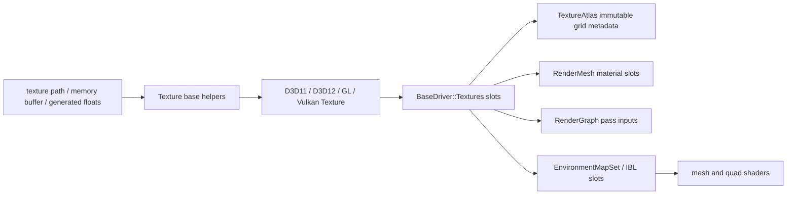
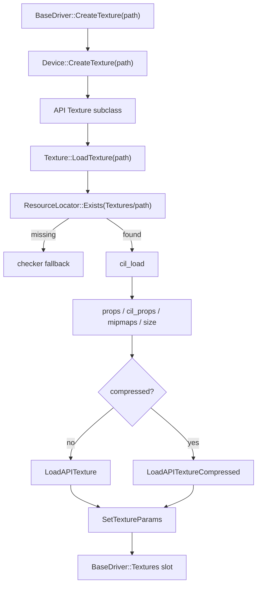

# Textures, Samplers, and IBL Resources

Status: verified against source and four-backend atlas captures on 2026-08-30.

This document explains T850's texture loading and binding path, API-specific texture resources and samplers, material/environment texture slots, generated image-based lighting resources, and the scene/editor cubemap override workflow.

Related documents:

- [Resource locator and cache paths](../architecture/resource-locator.md)
- [Shader management](shader-management.md)
- [Render graph](render-graph.md)
- [Geometry rendering flow](geometry-rendering-flow.md)
- [Scene format and runtime](../scenes/scene-format-and-runtime.md)
- [SceneSetup descriptors](../scenes/scene-setup-descriptors.md)
- [FrameworkImGui runtime UI](../editor/imgui-system.md)

## Purpose and responsibilities

The texture system turns file or memory data into API resources that can be bound by mesh, quad, render-graph, ImGui, animation, and environment-lighting paths.

It is responsible for:

1. Loading regular textures and cubemaps from `Textures/`.
2. Uploading memory-backed images from glTF, editor, generated resources, and debug helpers.
3. Creating float textures for bone matrices and IBL LUTs.
4. Creating float cubemaps for generated diffuse/specular/sheen IBL.
5. Creating sampler state from `Texture::params`.
6. Binding material, scene, environment, and IBL textures to stable shader slots.
7. Caching generated IBL data under `Textures/GeneratedIBLCache`.



## Key files and classes

| File/class | Role |
|---|---|
| `Framework/include/video/BaseDriver.h` | Declares `Texture`, `Device::CreateTexture*`, `BaseDriver::CreateTexture*`, texture bind/update APIs, and render-target attachment formats. |
| `Framework/src/video/BaseDriver.cpp` | Shared `Texture` loading from files/memory/cubemap memory, texture slot cache, destroy path, texture upload dump helper, and `BaseDriver::CreateTexture*` wrappers. |
| `Framework/include/video/TextureAtlas.h` / `Framework/src/video/TextureAtlas.cpp` | Managed rectangular grid atlases, exact tile validation, content-key identity, optional pixelation, and half-texel UV regions. |
| `Framework/src/video/d3d11/D3D11Texture.cpp` / `Framework/src/video/d3d11/D3D11Device.cpp` | D3D11 texture upload, SRV/sampler creation, compressed DDS support, float textures/cubemaps, VS/PS binding. |
| `Framework/src/video/d3d12/D3D12Texture.cpp` / `Framework/src/video/d3d12/D3D12Device.cpp` | D3D12 texture upload resources, SRV/sampler descriptors, compressed support, generated mip upload, float textures/cubemaps, update path. |
| `Framework/src/video/gl/GLTexture.cpp` / `Framework/src/video/gl/GLDevice.cpp` | OpenGL texture upload, compressed support, GL sampler parameters, float texture/cubemap creation, shader uniform binding. |
| `Framework/src/video/vulkan/VulkanTexture.cpp` / `Framework/src/video/vulkan/VulkanDevice.cpp` | Vulkan image/upload/sampler/image-view handling, BC decompression path, descriptor pending texture state, float textures/cubemaps. |
| `Framework/include/scene/IBLResources.h` / `Framework/src/scene/IBLResources.cpp` | Environment IBL resource paths, generated IBL filters/LUTs, cache load/save, IBL texture creation, `SceneProps` IBL settings. |
| `Framework/include/scene/RenderGraph.h` / `Framework/src/scene/RenderGraph.cpp` | Environment texture slots, material extension slots, pass input binding, environment binding to mesh/quad primitives. |
| `Framework/include/scene/MaterialAsset.h` | Material texture slot enum and cached material texture ID/pointer records. |
| `Framework/src/scene/RenderMesh.cpp` | Material texture loading, sampler params, material/env/IBL bind order, state-tracked dedup. |
| `Framework/include/scene/SceneDescriptor.h` / `Framework/src/scene/SceneSetup.cpp` | Scene environment map and explicit IBL path fields loaded from descriptor JSON. |
| `DayScene/SceneTemplate.cpp` | Runtime cubemap/profile selection, IBL load/regeneration, cubemap replacement, save-state cubemap path. |
| `T8ditor/EditorApp.cpp` | Editor cubemap selector/profile path, deferred editor cubemap apply, editor fallback environment update. |

## Shared Texture lifecycle

`Texture` is the API-neutral base class. The common file path is:



`Texture::LoadTexture(fn)` prepends `Textures/` to the requested name, checks the resource locator, and loads through `cil_load()`. If the file is missing, it uploads the built-in checker texture and logs an error.

Common metadata:

| Field | Meaning |
|---|---|
| `filepath` | Stored as `Textures/<requested path>` for file-backed loads. |
| `props` | Engine channel flags such as `CH_RGB`, `CH_RGBA`, or `CH_ALPHA`. |
| `params` | Engine sampler/wrap/filter flags such as `MIPMAPS`, `TILED`, `CLAMP_TO_EDGE`, `CLAMP_TO_BORDER`, `NEAREST_FILTER`, `LINEAR_FILTER`. |
| `cil_props` | Loader flags such as cubemap, compressed, DXT format, half-float, RGB/RGBA. |
| `x`, `y` | Base dimensions. |
| `mipmaps` | Mip count reported by CIL or generated by the backend. |
| `m_channels` | Source channel count. |

`BaseDriver::CreateTexture()` reuses an existing non-null texture slot when `Textures[i]->filepath == "Textures/" + path`. `CreateTextureFromMemory(key, ...)` applies the same ownership model to generated/decoded pixels and deduplicates by the caller-supplied stable key. Destroyed slots are reused for future textures. A scene holding a managed texture pointer does not release it directly.

## File and memory creation APIs

Texture creation entry points:

| API | Use |
|---|---|
| `BaseDriver::CreateTexture(path)` | File-backed texture under `Textures/`. Deduplicates by stored `filepath`. |
| `Device::CreateTexture(path)` | Backend allocation wrapper for a file-backed texture. |
| `Texture::LoadTexture(fn)` | Shared file load, CIL decode, checker fallback, API upload dispatch. |
| `Device::CreateTextureFromMemory(buff, w, h, channels, name)` | Memory-backed 2D texture, used by glTF/external decoded images and runtime-generated pixels. |
| `BaseDriver::CreateTextureFromMemory(key, buff, w, h, channels)` | Registers and owns a memory-backed texture under a stable key, returning a real texture ID. |
| `Texture::LoadFromMemory(buff, w, h, channels, debugName)` | Shared memory metadata setup and API upload. |
| `BaseDriver::CreateCubeMap(buff, w, h)` | Memory-backed RGBA cubemap. |
| `BaseDriver::CreateFloatTexture(w, h, data)` | RGBA32F 2D texture for LUTs and bone/float data. |
| `BaseDriver::CreateFloatCubeMap(size, mipCount, data)` | Face-major RGBA float cubemap with explicit mips for generated IBL. |

Managed memory textures and file textures both live in `BaseDriver::Textures`. Direct `Device::CreateTextureFromMemory()` remains a low-level backend allocation API; Framework assets should prefer the managed driver entry point.

## TextureAtlas

`TextureAtlas` is immutable metadata over one managed texture ID. It is not a second texture owner or a voxel-specific loader.

`TextureAtlasDesc` supplies:

- texture path;
- rectangular tile width and height;
- explicit sampler flags;
- `pixelationFactor` (default 1).

Loading decodes uncompressed RGBA without the global low-resolution policy unless `pixelationFactor > 1`. Pixelation downsamples and nearest-expands while preserving logical atlas dimensions; Minecraft explicitly authors factor 2 to preserve its accepted pixel-art appearance.

Atlas dimensions must be exact multiples of tile dimensions. `TryGetGridRegion(column,row)` rejects out-of-range coordinates and returns pixel bounds plus half-texel UVs:

$$
u_0 = \frac{x+0.5}{W},\quad u_1 = \frac{x+w-0.5}{W},\quad
v_0 = \frac{y+0.5}{H},\quad v_1 = \frac{y+h-0.5}{H}
$$

The registry key includes source identity, dimensions, tile layout, sampler parameters, and a pixel-content hash, so changed procedural/file data cannot reuse stale GPU content.

## CIL and DDS/cubemap loading

The CIL loader is the texture file decoder used by `Texture::LoadTexture()` and IBL source cubemap filtering. It supplies:

- dimensions,
- mip count,
- encoded buffer size,
- channel/compression/format flags,
- cubemap flag,
- half-float flag,
- compressed DXT flags.

Backends branch on:

| Flag/condition | Meaning |
|---|---|
| `CIL_COMPRESSED` | Upload with compressed path. |
| `CIL_DXT1`, `CIL_DXT3`, `CIL_DXT5` | BC1/BC2/BC3 or GL compressed block format selection. |
| `CIL_CUBE_MAP` | Six-face cubemap upload and cubemap SRV/image view. |
| `CIL_HALF_FLOAT` | RGBA half-float source. |
| `CIL_RGB`, `CIL_RGBA` | Source channel layout. |

DDS cubemaps with mip chains are uploaded face-by-face and mip-by-mip when supported. Generated float IBL cubemaps are already in face-major, mip-major RGBA float layout expected by `CreateFloatCubeMap()`.

## API-specific texture resources

### D3D11

D3D11 textures use:

- `ID3D11Texture2D`,
- `ID3D11ShaderResourceView`,
- `ID3D11SamplerState`.

Uncompressed uploads create `DXGI_FORMAT_R8_UNORM`, `DXGI_FORMAT_R16G16B16A16_FLOAT`, or `DXGI_FORMAT_R8G8B8A8_UNORM`. Source mip chains are passed as `D3D11_SUBRESOURCE_DATA`; otherwise D3D11 creates a mip-capable render-target texture and calls `GenerateMips()`.

Compressed uploads use BC1/BC2/BC3 and explicit mip/face subresources.

Float resources:

- `CreateFloatTexture()` creates `DXGI_FORMAT_R32G32B32A32_FLOAT`, one mip, `CLAMP_TO_EDGE | NEAREST_FILTER`.
- `CreateFloatCubeMap()` creates `DXGI_FORMAT_R32G32B32A32_FLOAT`, six faces, explicit mip count, `CLAMP_TO_EDGE | MIPMAPS`.

Binding:

- `Set()` calls `PSSetShaderResources(slot, 1, SRV)`.
- `SetVS()` calls `VSSetShaderResources(slot, 1, SRV)`.
- `SetSampler()` calls `PSSetSamplers(slot, 1, sampler)`.
- `UpdateFloatData()` calls `UpdateSubresource()`.

### D3D12

D3D12 textures use:

- default-heap `ID3D12Resource`,
- upload heap resources for initial/per-frame data,
- SRV descriptors in `D3D12Heap::CBV_SRV_UAV_VISIBLE`,
- sampler descriptors resolved through `D3D12Driver::GetOrCreateSampler()`.

For 8-bit uncompressed textures without source mips, D3D12 generates a CPU-side full mip chain before upload. Compressed textures upload BC1/BC2/BC3 block data to all face/mip subresources.

Float resources:

- `CreateFloatTexture()` creates `DXGI_FORMAT_R32G32B32A32_FLOAT`, persistent upload buffer, one SRV, `CLAMP_TO_EDGE | NEAREST_FILTER`.
- `CreateFloatCubeMap()` creates `DXGI_FORMAT_R32G32B32A32_FLOAT`, six faces, explicit mips, SRV dimension `TEXTURECUBE`.

Binding:

- `Set()` looks up the shader's `srvSlots` root parameter and binds the SRV plus that texture's sampler descriptor as a pair.
- `SetVS()` uses the same SRV slot map for vertex shader resources.
- `SetSampler()` looks up the shader's `samplerSlots` root parameter by sampler slot and binds the sampler descriptor table.

`D3D12Shader::Set()` installs default samplers for unbound slots; normal draw paths establish the shader/root signature first, then `Texture::Set()` replaces the default with texture-specific state. This prevents a default anisotropic sampler from clobbering nearest-filtered atlases.

### OpenGL

OpenGL textures use GL object IDs and shader uniform names.

Uncompressed upload:

- chooses `GL_RGBA16F` for half-float,
- `GL_ALPHA`, `GL_RGB`, or `GL_RGBA` for regular sources,
- uploads each cubemap face and mip with `glTexImage2D`,
- generates mipmaps when the source has one or no mips.

Compressed upload uses S3TC DXT1/DXT3/DXT5 formats and `glCompressedTexImage2D`.

Float resources:

- `CreateFloatTexture()` creates `GL_RGBA32F`, nearest filtering, clamp.
- `CreateFloatCubeMap()` tries `GL_RGBA32F` first, then `GL_RGBA16F` fallback.

Binding:

- `Set()` and `SetVS()` call `glGetUniformLocation`, activate `GL_TEXTURE0 + slot`, bind the texture target, and set the sampler uniform to the slot.
- `SetSampler()` is empty because sampler state is stored on the GL texture object through `SetTextureParams()`.

### Vulkan

Vulkan textures use:

- `VkImage`,
- VMA allocation,
- `VkImageView`,
- `VkSampler`,
- staging buffers,
- layout transitions,
- pending descriptor state in `VulkanDriver::m_pendingTextures`.

Important Vulkan differences:

- RGB8 source textures are converted to RGBA8 because Vulkan RGB8 support is not assumed.
- Vulkan can decompress DXT data to RGBA on the CPU path where direct compressed support is unsuitable.
- `Set()` does not bind descriptors immediately. It records the image view and sampler into the driver's pending texture slot; the Vulkan shader/descriptor path commits them later.
- `SetSampler()` is empty because samplers are part of the combined image sampler descriptor.

Float resources:

- `CreateFloatTexture()` creates `VK_FORMAT_R32G32B32A32_SFLOAT`, one mip, nearest clamp sampler.
- `CreateFloatCubeMap()` uses `VK_FORMAT_R32G32B32A32_SFLOAT` on desktop/Linux/Windows and `VK_FORMAT_R16G16B16A16_SFLOAT` on Android to reduce mobile memory pressure.

## Sampler parameter mapping

Sampler state is rebuilt from `Texture::params` by each backend.

| `Texture::params` | D3D11/D3D12 | GL | Vulkan |
|---|---|---|---|
| default | anisotropic, max 16 for regular 2D textures | linear mipmap linear, clamp, anisotropy for non-cubemaps | linear + linear mipmap, anisotropy when supported and not cube/special filter |
| cubemap default | linear mipmap, anisotropy disabled | linear mipmap, clamp | linear mipmap, anisotropy disabled |
| `NEAREST_FILTER` | point filter, `MaxLOD = 0` | nearest min/mag | nearest, nearest mip, `maxLod = 0` |
| `LINEAR_FILTER` | linear min/mag with mip point, `MaxLOD = 0` | linear without mip chain when no mips | linear, nearest mip, `maxLod = 0` |
| `TILED` | wrap | repeat | repeat |
| `CLAMP_TO_EDGE` | clamp | clamp to edge | clamp to edge |
| `CLAMP_TO_BORDER` | border, opaque white, linear mip | clamp to border, white border | clamp to border, opaque white |

`RenderMesh::LoadTex()` sets `MIPMAPS` plus either `TILED` or `CLAMP_TO_EDGE`, then calls `SetTextureParams()` after the texture is loaded.

## Material texture slots

`MaterialAsset::MatTexSlot` mirrors the material texture pointer/id set used by `RenderMesh`.

Cached materials are immutable after `MaterialAssetCache::Acquire()`. `AcquireTextureVariant(base, slot, texture, textureId)` copies the base content, replaces one binding, recomputes cache identity, and acquires the variant. Mutating an acquired material would invalidate its content hash and deduplication bucket.

| Material asset slot | Shader key / draw slot |
|---|---|
| BaseColor | `DIFFUSE_MAP`, slot 0, `DiffuseTex` |
| Specular | `SPECULAR_MAP`, slot 1, `SpecularTex` |
| Gloss | `GLOSS_MAP`, slot 2, `GlossTex` |
| Normal | `NORMAL_MAP`, slot 3, `NormalTex` |
| Reflect | legacy material asset slot; environment map uses slot 4 separately |
| Parallax | `HEIGHT_MAP`, slot 5, `HeightTex` |
| Metallic | `METALLIC_MAP`, slot 6, `MetallicTex` |
| Emissive | `EMISSIVE_MAP`, slot 8, `EmissiveTex` |
| SheenColor | `SHEEN_COLOR_MAP`, slot 16, `SheenColorTex` |
| SheenRoughness | `SHEEN_ROUGHNESS_MAP`, slot 17, `SheenRoughnessTex` |
| Clearcoat | `CLEARCOAT_MAP`, slot 18, `ClearcoatTex` |
| ClearcoatRoughness | `CLEARCOAT_ROUGHNESS_MAP`, slot 19, `ClearcoatRoughnessTex` |
| Occlusion | `OCCLUSION_MAP`, slot 20, `OcclusionTex` |
| SpecularFactor | `SPECULAR_FACTOR_MAP`, slot 21, `SpecularFactorTex` |
| SpecularColor | `SPECULAR_COLOR_MAP`, slot 22, `SpecularColorTex` |
| Transmission | `TRANSMISSION_MAP`, slot 23, `TransmissionTex` |
| Lightmap | `LIGHTMAP_MAP`, slot 25, `LightmapTex` |

Slot 24 is reserved for skinned bone textures. Scene depth and color are commonly bound at slots 7 and 9.

Sampler slots used by mesh draw:

- material sampler slot 0 for most material textures,
- specific legacy sampler slots for slots 1-9,
- lightmap sampler slot 7,
- environment sampler slot 4,
- IBL sampler slots use their texture slots.

`MeshDrawStateTracker` skips redundant texture binds across subsets and across meshes inside a render-graph pass scope, but samplers are still submitted because backend shader sampler-slot lookup is cheap and backend-specific.

## Render graph environment texture slots

`RenderGraph.h` reserves environment slots:

| Slot | Resource |
|---|---|
| 10 | `EnvironmentTextureSlot::DiffuseIBL` |
| 11 | `EnvironmentTextureSlot::SpecularIBL` |
| 12 | `EnvironmentTextureSlot::BrdfLUT` |
| 13 | `EnvironmentTextureSlot::CharlieIBL` |
| 14 | `EnvironmentTextureSlot::CharlieLUT` |
| 15 | `EnvironmentTextureSlot::SheenELUT` |

`RenderGraph::ExecutePass()` binds these resources when `bind_environment_map` is true. It chooses fallbacks:

- `DiffuseIBL` falls back to sky,
- `SpecularIBL` falls back to sky,
- `CharlieIBL` falls back to explicit Charlie IBL, then specular IBL, then sky,
- LUT slots are null when unavailable.

Both quads and meshes can receive environment resources for a pass. Pass input textures from render targets are bound into the primitive texture array before drawing.

## EnvironmentMapSet

`EnvironmentMapSet` stores texture indices, not pointers:

| Field | Meaning |
|---|---|
| `Sky` | The visible cubemap/environment map. |
| `DiffuseIBL` | Lambertian filtered diffuse cubemap. |
| `SpecularIBL` | GGX filtered specular cubemap. |
| `BrdfLUT` | GGX BRDF integration LUT. |
| `CharlieIBL` | Charlie/sheen filtered cubemap. |
| `CharlieLUT` | Charlie LUT. |
| `SheenELUT` | Sheen E LUT. |

`SetFallback(textureIndex)` points sky, diffuse, specular, and Charlie IBL at the same cubemap and clears LUTs. This is the safe baseline before explicit or generated IBL resources are loaded.

## IBL resource loading and generation

`EnvironmentResourcePaths` contains optional explicit paths:

- diffuse IBL,
- specular IBL,
- BRDF LUT,
- sheen/Charlie IBL,
- Charlie LUT,
- sheen E LUT.

`LoadEnvironmentIBLResources()` resolves environment data in this order:

1. Load explicit descriptor paths when present.
2. Try generated cache for diffuse/specular/Charlie cubemaps based on the current sky cubemap path.
3. On desktop, generate missing diffuse/specular/Charlie cubemaps from the sky cubemap when possible.
4. On Android, skip runtime generation and use cached assets or sky fallback.
5. Load explicit LUT paths when present.
6. Generate or load cached LUTs depending on platform.

Generated constants:

| Resource | Size/samples |
|---|---|
| diffuse Lambertian cubemap | 32x32, 1 mip, 128 samples |
| GGX specular cubemap | 128x128, generated mip chain, 128 samples |
| Charlie sheen cubemap | 128x128, generated mip chain, 128 samples |
| GGX BRDF LUT | 256x256, 256 samples |
| Charlie LUT | 256x256, 256 samples |
| sheen E LUT | 256x256, 128 samples |

Generated float data is cached under:

```text
Textures/GeneratedIBLCache/<kind>_v1_<hash>.t8ibl
```

Cache headers include magic `T8IBLF32`, cache version, kind, dimensions, face/mip/channel counts, sample count, and byte count. A mismatch logs a stale-cache message and regenerates or falls back.

`UpdateSceneIBLSettings()` updates `SceneProps`:

- `IBLMipCount` starts at 4 and uses specular texture mip count when available;
- `IBLDiffuseMipLevel` is set to a high mip when diffuse falls back to sky;
- `IBLBRDFLUTEnabled` is 1 when a BRDF LUT texture exists.

## Scene descriptor and profile workflow

`SceneDescriptor` has environment fields:

| Field | Meaning |
|---|---|
| `environment_map` | Sky/environment cubemap path. |
| `environment_diffuse_ibl` | Optional explicit diffuse IBL cubemap. |
| `environment_specular_ibl` | Optional explicit specular IBL cubemap. |
| `environment_brdf_lut` | Optional explicit GGX BRDF LUT. |
| `environment_sheen_ibl` | Optional explicit Charlie/sheen cubemap. |
| `environment_charlie_lut` | Optional explicit Charlie LUT. |
| `environment_sheen_e_lut` | Optional sheen E LUT. |

`SceneSetup::Load()` copies these fields into `SceneSetup` strings. Runtime scenes then build `EnvironmentResourcePaths` from those strings.

`SandboxProfileDesc::cubemap_path` can override the startup cubemap. The runtime profile selection path normalizes this resource path and can map it back to the `cubemap` selector index.

## SceneTemplate cubemap replacement flow

SceneTemplate startup:

1. Load the scene descriptor through `SceneSetup`.
2. Resolve `startupCubemapPath` from `environment_map`, profile `cubemap_path`, selector defaults, or fallback `sky/Ennis.dds`.
3. Load the sky cubemap with `BaseDriver::CreateTexture(startupCubemapPath)`.
4. Call `EnvMaps.SetFallback(EnvMapTexIndex)`.
5. Call `LoadEnvironmentIBLResources()` with descriptor IBL paths.
6. Call `UpdateSceneIBLSettings()`.

Runtime cubemap change:

1. Wait for GPU to avoid destroying a texture still referenced by the previous frame.
2. Create the new sky cubemap.
3. Destroy the old environment texture if it differs.
4. If descriptor IBL paths are empty, destroy generated diffuse/specular/sheen IBL textures so they can be regenerated or reloaded from cache for the new sky.
5. Reset fallback, reload IBL resources, and update `SceneProps`.

Quake3Mock and SandboxScene retain the same pattern.

## T8ditor cubemap workflow

T8ditor uses editor-specific selector helpers:

- `EditorCubemapPathForSelectorIndex()` maps selector option to `sky/<option>`.
- `EditorCubemapSelectorIndexForPath()` maps a resource path back to selector index.
- `EditorCubemapSelectorIndexFromProfile()` reads profile selector overrides.

`EditorApp::ApplyPendingEditorCubemap()`:

1. Waits for GPU.
2. Loads the new cubemap with `BaseDriver::CreateTexture()`.
3. Destroys the old dummy environment map when safe.
4. Updates `m_editorCurrentCubemapPath` and selector index.
5. Creates an `EnvironmentMapSet` fallback from the new cubemap.
6. Calls `UpdateSceneIBLSettings()` for editor scene props.
7. Updates the deferred quad environment map when deferred resources are ready.

The editor currently uses sky fallback for editor IBL rather than calling the full runtime `LoadEnvironmentIBLResources()` path.

## Texture debugging

Useful logs and diagnostics:

- `Texture creation failed: '<path>'` from `BaseDriver::CreateTexture()`.
- `Texture '<path>' not found, loading checker` from `Texture::LoadTexture()`.
- backend-specific upload/SRV/sampler errors from D3D11/D3D12/GL/Vulkan texture files;
- `[IBL] Loaded cached...`, `[IBL] Generated...`, or stale/truncated cache logs;
- `T850_DUMP_TEXTURE_UPLOADS`, which writes uploaded textures as DDS plus metadata;
- `RenderTrace`, which records texture/sampler binds and logical sampler signatures across APIs.

## Extension rules

When adding a material texture:

1. Add a `MatTexSlot` entry if it must be cached in `MaterialAsset`.
2. Add a render graph/material slot constant if it needs a fixed shader slot.
3. Add shader key bits and material extraction from glTF/X data.
4. Load the texture in `RenderMesh::Create()`/material gathering.
5. Bind it in `RenderMesh::Draw()` with a stable shader texture name and sampler slot.
6. Update shader resource declarations/reflection expectations.

When adding an IBL resource:

1. Add path fields to `EnvironmentResourcePaths` and `SceneDescriptor` if authorable.
2. Add an `EnvironmentMapSet` slot and render graph slot.
3. Update `LoadEnvironmentIBLResources()` and fallback rules.
4. Include generation/cache version/key fields if the data is generated.
5. Audit Android behavior; do not assume runtime generation is acceptable on mobile.

## Known limitations and gotchas

- `Texture::LoadTexture()` always prepends `Textures/`; callers should pass paths relative to that folder.
- Missing textures load a checker fallback and can still produce a valid texture object.
- File-backed texture dedup keys on stored `filepath`, so memory/generated textures are not deduplicated.
- Texture `params` can be changed after load, but callers must call `SetTextureParams()` to rebuild backend sampler state.
- Android skips runtime generated IBL and relies on cached/generated assets or sky fallback.
- GL has its own shader names/uniform lookups; missing uniforms can silently skip non-bone binds.
- Vulkan texture `Set()` records pending descriptors; actual descriptor commit happens later in the Vulkan shader path.
- Slot 24 is reserved for bone textures; avoid assigning material or IBL resources there.

## Debugging checklist

1. Confirm the requested file path is relative to `Textures/` unless the caller intentionally bypasses `Texture::LoadTexture()`.
2. Check whether the log says the checker fallback was used.
3. Verify `cil_props`: cubemap, compressed, DXT type, half-float, and mip count.
4. If sampling is wrong, check `Texture::params` and whether `SetTextureParams()` was called after changing params.
5. If only one backend fails, compare format/mip/cubemap handling in the API texture implementation.
6. If IBL is black or too sharp, check generated cache logs, `IBLMipCount`, `IBLDiffuseMipLevel`, and whether explicit IBL paths are empty.
7. If Android lighting differs, verify `Textures/GeneratedIBLCache` contains packaged cache files or expect sky fallback.
8. If shader binding differs across APIs, enable `T850_RENDER_TRACE` and compare texture/sampler bind events.
