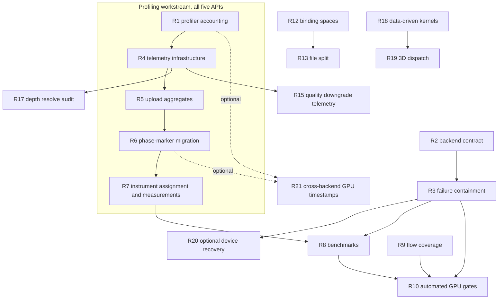

# WebGPU, Compute and Browser Remediation Record

Status: implementation record and remaining-work register, updated 2026-09-22.
The original 2026-09-18 source review is retained in item problem statements for
traceability. Current status and completion records supersede those baselines.
Measured CPU, GPU, throughput, and shader-preparation results are maintained in
the [profiling workflow](gpu-performance-profiling-workflow.md).

This record describes completed remediation and the remaining gaps in the Dawn
WebGPU backend, cross-backend compute path, shader flows, and browser target.
It is not the primary architecture description; use
[WebGPU backend implementation](proposal-webgpu.md) for current behavior.

Revision 2026-09-18c: action IDs, index, sections and dependencies follow the
default implementation order. The index retains former IDs only to identify
older reviews; use the current IDs everywhere else. Device-loss containment and
recovery are separate items. Profiling infrastructure precedes upload accounting
and phase-marker migration. This revision preserves the corrected shader audit,
depth-version invariant and capability-aware policy from the second review.

The reordered plan is not itself implementation evidence. Item status and the
completion records below track subsequent work; completion requires that item's
acceptance and test gates to pass.

## How to use this document

1. Read [Do not "fix" these](#do-not-fix-these) first. Several things look like
   defects and are not; changing them would be a regression.
2. Start at the first unfinished item in the [action item index](#action-item-index)
  and follow the numbered order. Dependencies are listed there. Independent
  work may proceed around an environment block, but record the block and do
  not skip a dependency or silently mark an earlier item complete.
3. Each item states the problem, the evidence, the required change, explicit
   acceptance criteria and the command that proves it.
4. Do not mark an item complete on a build alone. Every item has a runtime or
   test gate; a clean compile is not evidence.
5. Update the item's status line and completion checklist in this file as part
  of the same implementation change. Do not check off unrun or failed gates.

### Completion tracking

Use `open`, `in progress`, `blocked` or `completed` in each item's Status line.
Only mark `completed` after the implementation (or documented audit/scope
deliverable), every acceptance criterion, required tests and owning documents
are verified. A partial implementation or environment-blocked test stays open
or blocked; a skip is not a pass.

Fill each item's completion checklist with the tested commit or exact working
tree, commands, results and local evidence path. Audit-only items may complete
without a code change when their tests establish that existing behavior is
correct. Record any optional follow-up separately rather than claiming it ran.

Update the index Status cell and the item's Status line together. Record a
completion date only after every checkbox is supported by evidence. Never mark
an implementation complete because this plan was edited or its links passed.

## Before you start

### Roots

Determine roots from Git, not from the terminal's current directory:

```powershell
$RepoRoot = git rev-parse --show-toplevel      # contains documentation/, LaunchSolution.bat
$SourceRoot = Join-Path $RepoRoot 'T850'       # contains T850.sln, Framework/, DayScene/, scripts/
```

Paths in this document are relative to `$SourceRoot` unless they begin with
`documentation/`.

### Required reading before the first edit

| Read | Why |
|---|---|
| `AGENTS.md` at the repository root | Build commands, solution layout, workflow rules, the post-build asset junctions |
| `t850-engine` skill | Router: non-negotiable architecture rules, validation routing, completion report format |
| `documentation/doc-conventions.md` | House style for every documentation change this plan requires |
| `documentation/dependency-map.md` | What else changes when you touch a subsystem |

### Skill routing per item

Load the smallest authoritative context. Do not read the whole documentation
tree.

| Items | Skill |
|---|---|
| R1, R4, R5, R6, R7 | `t850-profiling` |
| R3, R5 | `t850-gpu-resource-lifetime` |
| R2, R8, R9 | `t850-api-frame-comparison` |
| R10 | `t850-visual-regression`, `t850-github-ci-validation` |
| R3 | `t850-crash-debugging` |
| R20 | `t850-gpu-resource-lifetime`, `t850-crash-debugging`, `t850-api-frame-comparison` |
| All | `t850-build-run`, `t850-local-build-validation` |

### Rules that apply to every item

- **Registration is a hard gate.** Every new Framework `.cpp` must appear in
  `Framework/Framework.vcxproj`, `Framework.vcxproj.filters` **and**
  `Framework/CMakeLists.txt`. `scripts/ValidateBuildRegistration.ps1` runs in CI.
- **CMake stays in parity.** Android and Steam Deck consume the CMake lists.
  Never edit a `CMakeLists.txt` to work around a linker error; the `.vcxproj` is
  the source of truth on Windows.
- **Use `ResourceLocator`**, never raw filesystem paths.
- **Five peer backends.** D3D11, D3D12, OpenGL, Vulkan and WebGPU. A capability
  one backend lacks is resolved by a shared capability query and render-graph
  validation, never by one backend throwing where the others silently skip. This
  is the whole of R2 and it applies to every later item.
- **Do not loosen a visual tolerance or rebaseline to hide a failure.**
- **Distinguish pass, skip and environment block.** An unavailable toolchain is
  not a passing gate.

### Evidence and artifacts

Captures, telemetry JSON, PresentMon CSV, ETW traces, baseline dumps and
benchmark reports are local artifacts. Write them under
`%LOCALAPPDATA%\T850Profiles\<topic>-<date>` and **never commit them**. Cite the
path in the completion report instead.

### Definition of done for one item

1. The change is implemented and the item's Status line in this file is updated.
2. The item's acceptance criteria are each demonstrated, not asserted.
3. The item's verification command has been run and its output retained.
4. Build registration passes if files were added.
5. The documentation listed in [Documentation to update](#documentation-to-update)
   for that item has been updated in the same change.
6. A completion report is produced in the format the `t850-engine` skill
   defines: behavior and files changed, build metadata added, commands run and
   result, visual cases and tolerance, docs updated, unrun or blocked platforms,
   remaining risks.

### Preparation before implementation

Capture bounded baseline evidence before changing runtime code: a focused
Release run of scenes 1, 3 and 6 under D3D12 and WebGPU, with matched adapter,
scene state, shader flow, resolution, frames in flight and validation settings.
Record telemetry-disabled, sampled and fully enabled runs separately; preserve
raw frame times and useful-work counters without trusting the currently broken
nested profiler averages. Use explicit sampling settings, warmup exclusions,
at least three alternating runs and unique evidence paths.

Keep presented and offscreen submit-only measurements separate. Arrange GPU
runner access and editor-scope ownership early, without treating that preparation
as completion of their later items. Verification snippets below are starting
commands, not proof that every acceptance criterion has already been exercised;
add the focused tests specified by the item and retain their exact commands.

## Evidence basis

| Reviewed | Scope |
|---|---|
| `T850/Framework/src/video/webgpu/**` | Driver, context, shader compiler, shader package |
| `T850/Framework/src/video/{d3d11,d3d12,vulkan,gl}/*Compute.cpp` | Cross-backend compute |
| `T850/Framework/src/utils/ComputeKernelRegistry.cpp`, `ComputeReflection.cpp` | Kernel contracts and reflection |
| `T850/Framework/src/scene/RenderGraph.cpp` | Compute pass integration |
| `T850/Framework/src/debug/{GraphicsFixture,ComputeSelfTest}.cpp` | Existing GPU gates |
| `T850/cmake/dawn-package/**`, `.github/workflows/build.yml` | Automated gates |
| `T850/Framework/src/core/WebFramework.cpp`, `T850/web/**`, `T850/cmake/WebBuild.cmake` | Browser target |
| `T850/Assets/Shaders/*.wgsl` vs `*.hlsl` | Shader port coverage |

## Priority model

| Priority | Meaning |
|---|---|
| P0 | User-visible incorrect behavior or a contract inconsistency between backends. Do first. |
| P1 | The project's stated objectives that were not delivered. Do next. |
| P2 | Maintainability, hardening and parity debt. Schedule deliberately. |

### Profiling workstream

This workstream is **engine-wide and API-agnostic**. It is not WebGPU work.
Everything below applies equally to D3D11, D3D12, Vulkan, OpenGL and WebGPU,
uses the same scope and counter names on all five, and lives in shared code.
WebGPU appears often in the evidence only because that is where the worst
instrumentation was recently added, not because the fix is backend-specific.

There are exactly two objectives.

**Objective 1 — API-agnostic CPU phase profiling.** Know which part of the frame
cost time: physics, AI and agents, navigation, streaming, animation, render
submission. This is where the engine spends most of its controllable time and it
has nothing to do with the graphics backend. Covered by
[R6](#r6-delete-per-call-profiling-and-replace-it-with-phase-markers),
[R1](#r1-fix-profiler-scope-accounting-and-remove-the-vulkan-leak) and
[R4](#r4-build-a-low-overhead-cpu-instrumentation-path).

**Objective 2 — Very low overhead upload profiling.** Catch bottlenecks in
texture uploads and geometry uploads. These are easy to miss, they do not show
up in a GPU capture as a single obvious cost, and they dominate in scenes with
frequent updates such as Minecraft chunk streaming. Covered by
[R5](#r5-instrument-memory-upload-and-streaming-as-per-frame-aggregates).

**Explicit non-goal — built-in GPU execution timing.** Per-draw and per-dispatch
GPU time is better obtained from external tools: PresentMon for frame-level GPU
busy and wait, PIX, RenderDoc or Nsight for per-pass and per-draw breakdowns.
The engine should not carry that burden.
[R7](#r7-assign-each-performance-question-to-the-right-instrument) records the
tool assignment, and [R21](#r21-implement-opt-in-cross-backend-gpu-timestamp-queries) is
demoted to P2 accordingly — it closes a consistency gap with the other four
backends, but it is not required by either objective.

Order: **R1 -> R4 -> R5 -> R6 -> R7 -> R8**. R4 owns the reusable
infrastructure; R6 owns the subsystem and driver marker migration. R5 lands
before upload scopes are removed so the upload signal is never discarded.
R21 remains optional and does not gate CPU or upload measurements.

### Profiling implementation checkpoint, 2026-09-18

Per the current request, R4-R8 implementation proceeds while rendering/platform
follow-ups are parked. Validation in this pass is limited to Framework/DayScene
Debug compilation, shared regression tests, a compile-out build and short
profiling-specific captures. Do not rerun rendering/platform matrices for every
instrumentation edit. Required measurement evidence is still required before
marking the corresponding item completed.

Implemented: stable scope/counter IDs; indexed profiler lookup; cached pass
handles; bounded worker-owned telemetry publication with issue-frame identity;
CPU-only mode and build-time compile-out; resource/source upload matrices and
totals; sampling-independent budgets; neutral ring/pool/work counters; phase-marker
migration; an alternating finite CPU comparison script; WebGPU matrix rows and
a paired subset with provider/backend/adapter/shader-flow metadata.

The requested development follow-up is finished:

- Initial raw/compressed/float/cubemap uploads, mip/layer sizing and observed
  staging copies are instrumented. Shared texture wrappers and thread-pool jobs
  preserve streaming provenance; late staging retains its issue frame/source.
- Upload budgets and ring-overflow warnings operate on unsampled frames and
  after detailed storage fills. Flagged unsampled records are marked
  `detailed: false`; late budget history is bounded to 64 frames.
- Actual camera and physics-query work is attributed at its owner. Fragmented
  agent, pose, culling and upload work uses fixed-slot sums, not event scopes.
- The one-quad paired-work discrepancy was the startup fade. Loading/fade pump
  frames no longer consume the profiling frame limit; fixed-step fades now
  advance the same simulation state. Raw totals were preserved, not filtered
  to conceal the mismatch. Per-pass/effect/text counters localize future gaps.
- Startup reports include shader preparation/translation, cache provenance,
  module/pipeline creation and first real frame start/completion. Milestones use
  telemetry initialization as their epoch, not OS process creation; completion
  is CPU submission/present return, not GPU/display completion. The harness
  separates these from steady-state samples and does not force caches cold.

Latest evidence: `%LOCALAPPDATA%/T850Profiles/profiling-finish-20260918`.
`final-tests.log` passes 69 tests. `final-compiled-out-tests.log` passes 65 tests,
including disabled-macro semantics; the four enabled-profiler-only cases are
excluded. Both build modes pass and `final-enabled-restore-build.log` confirms
the normal Debug executable was restored. The `final-paired` 30-frame Debug
D3D12/WebGPU correctness probe has matching adapter/draw/index/pass counts,
startup pipeline/cache data, and zero dropped/unfinished records. It is not a
performance result. Earlier streaming and dynamic-texture integrity captures
remain under `%LOCALAPPDATA%/T850Profiles/profiling-workstream-20260918`.

R6 clarification: fragmented animation/culling/agent work uses fixed-slot CPU
work sums (`accumulatedWork: true`), not per-call event scopes. Existing phase
boundaries use elapsed scopes. Full navigation rebuild is labelled
`navigation.rebuild`; there is no implemented incremental tile-update operation
to instrument separately. Upload staging/rename values cover observed engine
operations, not opaque driver-internal behavior. Detailed sample storage remains
bounded to 8192; records that cannot be retained are reported as dropped while
budget monitoring continues.

Not demonstrated yet: allocation-profiler proof beyond the registered-path
regression, long-duration worker/session stress, broad runtime coverage,
instrumentation overhead versus compiled-out/runtime-disabled baselines,
the sub-percent upload target, matched repeated Release performance results,
forced-cold startup measurements, or PresentMon/ETW evidence. These are
not implied by passing builds or the short functional captures. No GPU timestamp
backend was added. Development is complete for this profiling scope; R4-R8 stay
`in progress` because their measurement/acceptance checklists are not complete.
Rendering fixes remain outside this workstream.

## Action item index

| ID | Action | Priority | Depends on | Status | Former ID | Primary files |
|---|---|---|---|---|---|---|
| [R1](#r1-fix-profiler-scope-accounting-and-remove-the-vulkan-leak) | Fix profiler scope accounting and remove the Vulkan leak | P1 | None | blocked | `R16` | `Profiler.h`, `Profiler.cpp` |
| [R2](#r2-reconcile-strict-versus-lenient-backend-behavior) | Reconcile strict versus lenient backend behavior | P0 | None | blocked | `R01` | `WebGPUDriver.cpp`, `RenderGraph.cpp`, `BaseDriver.h` |
| [R3](#r3-remove-exceptions-from-the-frame-loop-and-add-device-loss-handling) | Remove exceptions from the frame loop and add device-loss handling | P0 | R2 | in progress | `R02a` | `WebGPUDriver.cpp`, `WebGPUContext.cpp` |
| [R4](#r4-build-a-low-overhead-cpu-instrumentation-path) | Build a low-overhead CPU instrumentation path | P1 | R1 | in progress | `R17 (infrastructure)` | `Profiler.cpp`, `RuntimeTelemetry.cpp` |
| [R5](#r5-instrument-memory-upload-and-streaming-as-per-frame-aggregates) | Instrument memory upload and streaming as per-frame aggregates | P1 | R4 | in progress | `R20` | `BaseDriver.h`, per-backend buffer/texture update paths |
| [R6](#r6-delete-per-call-profiling-and-replace-it-with-phase-markers) | Delete per-call profiling and replace it with phase markers | P1 | R4, R5 | in progress | `R19 + R17 (marker migration)` | `WebGPUDriver.cpp`, `RenderMesh.cpp`, `NavigationSystem.cpp`, `JoltPhysicsSystem.cpp` |
| [R7](#r7-assign-each-performance-question-to-the-right-instrument) | Assign each performance question to the right instrument | P1 | R6 | in progress | `R18` | `diagnostics.md`, PresentMon, ETW |
| [R8](#r8-add-webgpu-to-the-benchmark-matrix-and-publish-dawn-versus-native-numbers) | Add WebGPU to the benchmark matrix and publish Dawn versus native numbers | P1 | R3, R7 | in progress | `R04` | `DayScene.cpp`, `App.cpp` |
| [R9](#r9-close-or-formalize-the-fs_quad-wgsl-coverage-gap) | Close or formalize the `FS_Quad` WGSL coverage gap | P2 | None | open | `R10` | `FS_Quad.wgsl`, `ShaderProbe.cpp` |
| [R10](#r10-automate-the-gpu-hardware-gates) | Automate the GPU hardware gates | P2 | R3, R8, R9 | open | `R12` | `.github/workflows/**`, `scripts/**` |
| [R11](#r11-scope-editor-and-multi-viewport-parity) | Scope editor and multi-viewport parity | P2 | None | open | `R15` | `ImGuiWebGPUBackend.cpp`, `T8ditor/**` |
| [R12](#r12-centralize-and-validate-the-binding-space-convention) | Centralize and validate the binding-space convention | P2 | None | open | `R07` | `WebGPUDriver.cpp`, `WebGPUShaderCompiler.cpp` |
| [R13](#r13-split-the-monolithic-webgpu-translation-unit) | Split the monolithic WebGPU translation unit | P2 | R12 | open | `R06` | `video/webgpu/**` |
| [R14](#r14-move-hardcoded-runtime-constants-into-configuration) | Move hardcoded runtime constants into configuration | P2 | None | open | `R08` | `WebBuild.cmake`, `WebGPUContext.cpp`, `ConfigRuntime.cpp` |
| [R15](#r15-surface-silent-quality-downgrades) | Surface silent quality downgrades | P2 | R4 | open | `R11` | `WebGPUDriver.cpp` |
| [R16](#r16-add-a-content-security-policy-to-the-browser-target) | Add a Content-Security-Policy to the browser target | P2 | None | open | `R13` | `pages-worker.mjs`, `server.mjs` |
| [R17](#r17-resolve-the-filtered-depth-copy-once-per-depth-version) | Resolve the filtered-depth copy once per depth version | P2 | R4 | open | `R14` | `WebGPUDriver.cpp` |
| [R18](#r18-data-drive-the-compute-kernel-registry) | Data-drive the compute kernel registry | P2 | None | open | `R05` | `ComputeKernelRegistry.cpp`, `ComputeReflection.cpp` |
| [R19](#r19-support-three-dimensional-compute-dispatch) | Support three-dimensional compute dispatch | P2 | R18 | open | `R09` | `RenderGraph.cpp`, `RenderGraphDescriptor.h` |
| [R20](#r20-recreate-a-lost-webgpu-device-and-reload-the-scene) | Recreate a lost WebGPU device and reload the scene | P2 | R3 | in progress | `R02b` | `WebGPUDriver.cpp`, `WebGPUContext.cpp` |
| [R21](#r21-implement-opt-in-cross-backend-gpu-timestamp-queries) | Implement opt-in cross-backend GPU timestamp queries | P2 | R1, R6 | in progress | `R03` | `GpuTimestampProfiler.cpp`, D3D12/Vulkan/WebGPU drivers |

---

## R1. Fix profiler scope accounting and remove the Vulkan leak

Dependencies: none.

Status: blocked. Priority P1. Implementation and deterministic tests are done;
the offscreen runtime gate now passes; SteamRT validation remains unavailable. Prerequisite
for R21, R8 and R4. Last verified: 2026-09-18.

The problem and source-line evidence below describe the reviewed baseline.
The completion record describes the current implementation and validation.

### Problem

The profiling layer is correctly split — `Profiler` is API-neutral and
`ProfilerGpuBackend` is the per-API strategy selected by one factory. The
layering is not the problem. The problem is that the neutral layer mis-accounts
nested scopes, mixes CPU and GPU sample counts, and carries one Vulkan-specific
method.

**Nested scopes are silently wrong.** `BeginScope` increments
`m_activeQueryCount`; `EndScope` reads `m_activeQueryCount - 1` and never
decrements it. Sequential scopes work. Nested scopes do not: the inner scope is
closed twice and the outer scope is never closed, so the inner accumulates a
second bogus sample and the outer records nothing.

```text
BeginScope("Frame")   -> index 0, count = 1
BeginScope("GBuffer") -> index 1, count = 2
EndScope()            -> reads index 1, closes "GBuffer"     (correct)
EndScope()            -> reads index 1 again, closes "GBuffer" (wrong)
                         "Frame" never recorded
```

This matters immediately: `RenderGraph.cpp:1107` opens a scope per render pass,
and the driver opens CPU scopes such as `D3D12_CmdClose+Execute` inside that
same region.

### Evidence

- `T850/Framework/src/debug/Profiler.cpp:86-94` — `BeginScope` increments.
- `Profiler.cpp:96-108` — `EndScope` reads `m_activeQueryCount - 1`, no decrement.
- `Profiler.cpp:110-127` — `BeginCPUScope`/`EndCPUScope` repeat the same pattern.
- `T850/Framework/include/debug/Profiler.h:35-36` — `GpuAvgMs()` and `CpuAvgMs()`
  divide by the same `sampleCount`.
- `Profiler.cpp:106` — `sampleCount` is incremented only when there is no GPU
  backend, so with a backend the CPU average is divided by the GPU sample count.
- `Profiler.h:92` and the `ProfilerGpuBackend::FlushQueryReset(void*)` default —
  `FlushVulkanQueryReset` is a Vulkan-specific method on the neutral class.
- `Profiler.h:82` — the comment claims scopes are "nest-safe", which is wrong.

### Required change

1. Replace the implicit index arithmetic with an explicit scope stack. `EndScope`
   must close the scope opened by the matching `BeginScope`, and must pop.
2. Detect and report unbalanced begin/end at frame end instead of silently
   mis-attributing time.
3. Separate `cpuSampleCount` from `gpuSampleCount`. CPU samples are known
   immediately; GPU samples arrive later and can be dropped. Never divide one by
   the other's count.
4. Rename `FlushVulkanQueryReset` to a neutral `FlushDeferredQueryReset` on
   `Profiler`, keep the existing no-op default on the strategy, and delete the
   Vulkan naming from the neutral header. The mechanism is fine; only the name
   leaks.
5. Correct the misleading "nest-safe" comment to describe the real contract.
6. Keep monotonically allocated query slots separate from the active scope
  stack. Return or retain a scope token so an ignored begin (for example,
  capacity overflow) cannot cause its guard to close a different scope.
  Attribute draws using the actual active scope, not the last allocated slot.
7. Define reset behavior for pending GPU results and clear or generation-tag
  stale records so they cannot be attributed to a newly registered scope.

### Acceptance criteria

- A deliberately nested scope pair reports two distinct scopes with plausible
  inclusive times; the outer is greater than or equal to the inner.
- An unbalanced `BeginScope` without `EndScope` produces a named warning.
- CPU averages are unchanged when the GPU backend is disabled and no longer
  change merely because GPU results were dropped.
- No identifier containing `Vulkan` remains in `Profiler.h`.
- Deterministic tests cover sequential and nested scopes, mixed CPU/GPU scopes,
  capacity overflow, unmatched ends, draw attribution, reset and delayed or
  dropped GPU results. The scope stack empties without reusing active query slots.

### Verification

```powershell
Set-Location (Join-Path $SourceRoot 'bin/x64/Debug')
foreach ($api in 'd3d11','d3d12','vulkan','gl') { .\DayScene.exe --api $api --scene 1 --profileFrames 120 --profile --offscreen }
```

`--profileFrames` is the verified profiler exit limit; `--frames` is ignored
by this runtime. Use explicit process timeouts as a safety net. Presented runs
may help isolate an offscreen failure, but do not silently replace this gate.

Confirm the per-pass scopes from `RenderGraph` and the nested driver CPU scopes
both appear, and that an outer scope's inclusive time is greater than or equal
to the inner scopes it contains. Do **not** sum pass times and compare against
frame time: these are inclusive nested measurements and summing them
double-counts. Report them as a tree, not as a partition.

### Completion record

- [x] Implementation or audit/scope deliverable finished.
- [x] Every acceptance criterion verified.
- [x] Required tests passed; exact commands and results retained.
- [ ] Owning docs updated; applicable registration and platform gates passed.
- [x] Evidence linked; index and item status updated together.

Tested revision: uncommitted R1 working tree based on
`98d1e16c683c351ac946429f8e3599a4945ee168`. SHA-256 hashes for the five changed
source files are retained in `tested-source.json` under the evidence directory.

Implementation: `Profiler.h/.cpp`, `ProfilerGpuBackend.cpp`, the deferred-query
reset call in `VulkanDriver.cpp`, and four tests in existing `GameSelfTest.cpp`.
Active stacks and guard tokens are separate from query allocation. CPU/GPU sample
counts are independent; reset generations reject late results; reports are
inclusive trees. D3D12 no longer resolves uninitialized CPU-only query slots.
No sources or build registrations were added.

Commands and results (run from `$SourceRoot` unless specified):

- Baseline Debug build plus `DayScene.exe --game-selftest`: the added nested
  test failed as expected before the fix; `baseline-selftest.log` retains it.
- `scripts/build.ps1 -Config Debug -Platform x64 -Action Build` and
  `bin/x64/Debug/DayScene.exe --game-selftest`: PASS, 65/65 including all four
  profiler tests. Exact-clock tests cover inclusive times, sequential and mixed
  scopes, overflow, unmatched ends, draws, reset and delayed/dropped results.
- `scripts/RunWindowsBuildMatrix.ps1 -Action Build`: PASS, all six Windows
  builds and Win32/x64 Debug/Release shared tests; `windows-matrix-final.log`.
  These were incremental builds, not a clean Windows rebuild.
- `scripts/ValidateBuildRegistration.ps1`: PASS; no metadata changes required.
- `cmake --build build/web --target T850WebSelfTests --parallel 4`, then
  `ctest --test-dir build/web -R '^T850WebSelfTests$' --output-on-failure`:
  PASS, 1/1 suite including the profiler tests; `web-build.log`, `web-selftest.log`.
- `scripts/android/BuildAndroid.bat Release --allow-unsigned-release --sdk
  "$env:LOCALAPPDATA/Android/Sdk" --abi arm64-v8a --clean`, then the same command
  with `--abi x86_64`: both clean Release builds PASS; `android-arm64.log` and
  `android-x64.log`. No Android device runtime claim.
- From `bin/x64/Debug`, `DayScene.exe --api <api> --scene 1 --profileFrames 120
  --profile --width 640 --height 360 --regressionFixedDt 0.0166666667
  --logLevel info --logFile <evidence>/presented-<api>.log`: PASS on D3D11,
  D3D12, Vulkan, GL and WebGPU. Exactly 120 frames, populated CPU reports, zero
  engine/profiler errors. The four GPU strategies report samples; WebGPU reports
  GPU timing unavailable. Each process had a 180-second timeout.
- The same presented D3D12 check with `--d3d12debug`: PASS, debug layer enabled,
  120 frames with GPU samples and no engine/profiler errors;
  `presented-d3d12-debug-layer.log`.
- Offscreen runs: D3D11, D3D12 and GL exited successfully with populated reports.
  Vulkan reports `VUID-vkCmdDrawIndexed-renderPass-02684` (RGBA8/BGRA8 attachment
  incompatibility); it reproduces with profiling disabled. WebGPU exits 1 on
  the analogous attachment incompatibility, also reproduced using the untouched
  pre-R1 Release executable. `profile-vulkan.log`, `vulkan-without-profiler.log`
  and `prior-release-webgpu.log` retain the failures. Early probes used ignored
  `--frames`; only the `presented-*` runs assert exactly 120 frames. The unbounded
  no-profile diagnostic was stopped; it is not counted as a passing run.
- Source whitespace and editor diagnostics: PASS. Documentation checks recorded
  alongside the final evidence. No test process remained after validation.

### Offscreen blocker follow-up

The historical offscreen failures above are resolved in the same uncommitted
working tree. Surface-format ImGui pipelines were incompatible with the shared
RGBA8 targets. Vulkan and WebGPU adapters now select compatible renderer
pipelines at GUI-frame target transitions. WebGPU also completes the shared
offscreen lifecycle after submission, restoring ring rotation and debug dumps.
This fix adds `scripts/TestOffscreenOverlays.ps1`; no Framework source or build
registration was added.

Additional evidence: `%LOCALAPPDATA%/T850Profiles/offscreen-overlay-20260918`.

- `scripts/TestOffscreenOverlays.ps1 -Config Debug -Apis
  d3d11,d3d12,vulkan,gl,webgpu`: all ten surface/offscreen cases PASS, each exactly
  120 frames with no engine/profiler/validation errors (`all-api-debug`).
- The script with `-Config Debug -Apis vulkan,webgpu -ProfileFrames 600 -Capture`,
  and again with `-Config Release`: PASS, with nonuniform post-overlay captures
  and readable text inspected (`captures-final`, `release-captures`).
- The script with `-Apis webgpu -ShaderFlow wgsl`, then `spirv`: both modes PASS
  in each flow (`strict-wgsl`, `strict-spirv`).
- `DayScene.exe --graphics-fixture --compare --shaderFlow wgsl|spirv --output
  <evidence>/fixture-<flow>`: both PASS at unchanged tolerance 2. Strict WGSL
  explicitly skips the inline-HLSL mixed-format case; SPIR-V runs it, including
  expected negative active-attachment diagnostics. No unexpected errors passed.
- The full-scene Vulkan/WebGPU frame-340 images are not pixel-identical:
  57,290 pixels outside tolerance 2, maximum channel delta 44, mean 1.5725.
  `captures-final/frame340-comparison.json` retains the measurement; it is not
  presented as a passing full-scene visual parity gate.
- Windows six-cell matrix and native shared tests: PASS (`windows-matrix.log`).
- WebAssembly `DayScene` and `T850WebSelfTests` rebuild, then the shared ctest:
  PASS, 1/1 (`web-build.log`, `web-selftest.log`).
- Clean Android Release arm64-v8a and x86_64 builds, run sequentially: PASS
  (`android-arm64-v8a.log`, `android-x86_64.log`). No device-runtime claim.

Owning docs updated: `debug/diagnostics.md`, `current-status-and-roadmap.md` and
the profiling skill; the overlay follow-up also updates `editor/imgui-system.md`,
`testing/verification.md` and `rendering/webgpu-runtime-summary.md`. No visual
tolerance was changed and no performance gain is claimed by this accounting fix.

Evidence path: `%LOCALAPPDATA%/T850Profiles/profiler-r1-20260918`.
Completion date: pending; do not mark complete yet.
Remaining risks or blocked gates: local SteamRT is unavailable (no Podman or
installed WSL distribution); no new CI run was
requested. Existing string lookup/telemetry overhead and GPU-query wait policy
remain work for later items. No commit, push, merge or deployment performed.

---

## R2. Reconcile strict versus lenient backend behavior

Dependencies: none.

Status: blocked. Priority P0. Shared validation and focused tests are implemented;
the all-scenes runtime gate has unresolved diagnostics. SteamRT is unavailable
locally. Last verified: 2026-09-18.

The problem/evidence describes the reviewed baseline. Current implementation
and unpassed gates are recorded below; no failing gate is waived by a build.

### Problem

WebGPU is the only backend that throws on shared render-graph inputs the other
four accept silently. A render graph authored and validated on D3D12 can abort
on WebGPU, and the user-visible conclusion is "WebGPU is broken" rather than
"this graph uses an unsupported feature".

### Evidence

| Input | WebGPU | D3D12 / Vulkan |
|---|---|---|
| `generate_mips: true` | `Require(!GenMips, ...)` throws, `T850/Framework/src/video/webgpu/WebGPUDriver.cpp:572` | `SupportsRenderTargetMipGeneration()` returns false and `RenderGraph` skips mip allocation |
| Depth format other than `F32`/`NOTHING` | Throws, `WebGPUDriver.cpp:574` | Vulkan maps `FD16` to `D32_SFLOAT` |
| Unmapped color format | `throw std::runtime_error("Unsupported render target color format")`, `WebGPUDriver.cpp:586` | `default:` falls through to `RGBA8` |
| `cube_faces` / cube depth | `throw ... "Cube render targets are not implemented"`, `WebGPUDriver.cpp:617` | Implemented |
| Comparison sampler | `Require(!binding.comparisonSampler, ...)`, `WebGPUDriver.cpp:504` and `:772` | Implemented |

Source correction during implementation: Vulkan cube render targets were not
implemented; its path allocated a 2D depth image. D3D11/12 sampler creation uses
ordinary filtering and Vulkan sets `compareEnable = false`, so comparison
sampling was not an implemented capability there either. Desktop GL has an
existing depth-only comparison path. Queries now describe those actual engine
paths, not the underlying graphics API's theoretical features.

No shipped render graph currently uses cube targets: a search of
`T850/Assets/Scenes/*_RenderGraph.json` for `cube_faces`, `CUBE_F32` and `omni`
returns nothing. The gap is therefore latent, not active — but the mip and
format cases are reachable from existing authoring.

### Required change

Pick one contract for all five backends and implement it once, in shared code:

1. Add a capability query per feature to `BaseDriver` alongside the existing
   `SupportsRenderTargetMipGeneration()`; at minimum
   `SupportsCubeRenderTargets()`, `SupportsComparisonSamplers()` and
   `SupportsRenderTargetDepthFormat(int)`.
2. Move the decision into `RenderGraph` validation, before GPU allocation, so
  every backend uses the same policy with its own reported capabilities.
3. For a capability the active backend lacks, either skip the feature the way
   D3D12 already skips mips, or fail the graph load with a diagnostic naming the
   pass, the target, the unsupported feature and the backend. Do not throw from
   resource creation.
4. Replace the unmapped-format `default:` fallthrough in every backend with the
   chosen behavior. Silent substitution to `RGBA8` in three backends and a throw
   in a fourth is the defect; pick one.

Recommendation: distinguish two categories rather than forcing identical
behavior everywhere.

| Category | Policy |
|---|---|
| **Invalid input** — an unmapped format, a malformed descriptor | Fail consistently on every backend with one named diagnostic. Silent substitution to `RGBA8` is the defect. |
| **Valid but unsupported on this backend** — cube targets, comparison samplers, render-target mips | Reject with a named capability diagnostic, or take an explicitly permitted fallback. Never throw from resource creation for the detectable condition. |

A backend that *can* do something must not lose the capability because another
backend cannot. Levelling down is not the goal; predictable, named behavior is.

Comparison samplers are a shader-derived requirement, not a graph field, so they
need validation at **shader load** as well as at graph validation. A permutation
that reflects a comparison sampler on a backend without support must fail with
the shader family, stage and key bits, not at first draw.

### Acceptance criteria

- Invalid input produces the same named diagnostic on all five backends.
- A valid-but-unsupported feature produces a capability diagnostic naming the
  pass, target, feature and backend, and never an exception from resource
  creation.
- No backend silently substitutes a render-target format.
- A comparison-sampler permutation fails at shader load on an unsupporting
  backend, naming the shader key.
- All seven runtime scenes still load on all five APIs, and no backend loses a
  capability it previously had.

### Verification

```powershell
Set-Location (Join-Path $SourceRoot 'bin/x64/Debug')
.\DayScene.exe --graphics-fixture --compare
foreach ($api in 'd3d11','d3d12','vulkan','gl','webgpu') { .\DayScene.exe --api $api --scene 1 --profile --profileFrames 120 --offscreen }
```

Use a per-process timeout and retain exit codes and diagnostics. Expand the
scene loop to 0-6; scene 4 needs `--sceneFile Scenes/DayScene.t8scene` for the
maintained authored scene. `--frames` is not a supported runtime exit limit.

### Completion record

- [x] Implementation or audit/scope deliverable finished.
- [ ] Every acceptance criterion verified.
- [ ] Required tests passed; exact commands and results retained.
- [ ] Owning docs updated; applicable registration and platform gates passed.
- [x] Evidence linked; index and item status updated together.

Tested revision: uncommitted R2 working tree on
`98d1e16c683c351ac946429f8e3599a4945ee168`, including the prior R1 and offscreen
follow-up. Final tested source hashes are retained with the evidence.

Implemented behavior:

- `BaseRT::ValidateDescriptor` rejects invalid numeric format/count/extent
  combinations. `BaseDriver::ValidateRenderTarget` applies backend capabilities
  and is used by direct creation and all five backend allocation paths.
- Graph load rejects unknown format names and invalid cube-face declarations.
  `CreateRenderTargets` preflights every resolved target before any GPU allocation,
  returns `bool`, and rolls back on allocation failure. `RenderContainer`
  initialization/resize propagate failure; other callers receive a failed graph
  with no executable nodes. Direct `CreateRT` returns `-1` without dereferencing
  null; failed `ModifyRT` preserves the old target.
- Unsupported graph mips take the named single-level fallback. Depth/cube
  requests fail instead of being silently substituted. D3D11/12/GL cube paths
  remain available; FD16 remains a native D3D11 path with R16_UNORM sampling.
  Vulkan RGBA32F and WebGPU F32 color formats have explicit native mappings.
- Comparison-sampler requirements are rejected at shader load through the shared
  diagnostic. D3D uses binding flags, Vulkan detects depth-comparison SPIR-V
  instructions, and WebGPU uses Tint sampler metadata. Shader name, stage and
  key are included. Vulkan rejection releases partially created shader resources.
  `DepthTexture` is appended to reflection resource kinds without adding fields
  to existing serialized shader-package records.
- No Framework source files or build registrations were added. Existing shared
  tests and the real-driver graphics fixture were extended.

Commands and results, evidence under
`%LOCALAPPDATA%/T850Profiles/capabilities-r2-20260918`:

- Baseline x64 Debug build plus `--game-selftest`: expected failure for an unknown
  graph color name (`baseline-selftest.log`). After implementation, 67/67 shared
  tests PASS, including `T-RENDER-TARGET-DESCRIPTOR-01` and
  `T-RENDER-TARGET-CAPABILITY-01` (`final-selftest.log`). Tests cover malformed
  inputs, named capability diagnostics, capable-backend preservation, all-target
  preflight, mip fallback and partial-allocation rollback.
- `scripts/SetupDawn.ps1 -Mode Install`: audit refreshed for changed translator
  metadata; pinned packages were already installed (`dawn-audit.log`).
- `cmake --build build/dawn-package --config Debug --parallel 4` and
  `ctest --test-dir build/dawn-package -C Debug --output-on-failure`: PASS, 12/12
  including strict flows, compute contracts, permutation corpus, caches and GPU
  numerics (`dawn-probes-build.log`, `dawn-probes-test.log`).
- `DayScene.exe --graphics-fixture --compare --shaderFlow wgsl|spirv --output
  <evidence>/final-fixture-<flow>`: both PASS. D3D12/WebGPU reject bad descriptors
  without allocation and reject a real comparison-sampler permutation at load.
  Existing image comparisons remain within tolerance 2. Expected negative-test
  diagnostics and the strict-WGSL inline-HLSL skip are retained in the logs.
  The same fixtures also PASS in Release (`release-fixture-<flow>.log`).
- `scripts/RunWindowsBuildMatrix.ps1 -Action Build`: six builds and Win32/x64
  Debug/Release shared tests PASS (`windows-matrix.log`). This also runs build
  registration. The final Vulkan rejection-cleanup change is covered by a
  subsequent complete six-cell PASS (`windows-matrix-final.log`).
- `cmake --build build/web --target DayScene T850WebSelfTests --parallel 4`, then
  `ctest --test-dir build/web -R '^T850WebSelfTests$' --output-on-failure`: PASS,
  1/1 shared suite and runtime build (`web-build.log`, `web-selftest.log`).
- `scripts/android/BuildAndroid.bat Release --allow-unsigned-release --sdk
  "$env:LOCALAPPDATA/Android/Sdk" --abi arm64-v8a --clean`, then `x86_64`:
  clean builds PASS (`android-<abi>.log`). A final incremental refresh after
  Vulkan cleanup also PASSES for both ABIs (`android-<abi>-final.log`). These
  are compile gates, not Android device-runtime evidence.
- `DayScene.exe --compute-selftest --api <api>`: PASS on all five APIs; D3D12
  also uses `--d3d12debug`. Expected malformed-layout diagnostics remain in
  `compute-<api>.log`; arithmetic, odd-sized images, chaining and particle-depth
  checks pass.
- Runtime scene matrix: all seven D3D11/D3D12/GL scenes and WebGPU scenes 0-5
  loaded and produced reports without engine errors. Vulkan scenes 1/4/5 also
  produced clean reports. The initial long command did not retain its final
  process-result table; `scenes/log-audit.json` classifies the individual logs
  rather than inventing missing exit evidence.
- Vulkan scenes 0/2/3 log two live-sampler teardown errors. Vulkan scene 6 logs
  overlay render-pass incompatibility and teardown errors. WebGPU scene 6 fails
  before a report with attachment incompatibility. Representative Vulkan 0/6
  and WebGPU 6 failures reproduce with `--profileFrames 120` and bounded process
  waits (`affected-scenes-120.json`). The pre-R2 Win32 comparison had no Vulkan
  validation layer and cannot establish that the leaks predate R2.

Docs updated: `rendering/render-graph.md`, `rendering/textures-and-ibl.md`,
`rendering/webgpu-runtime-summary.md` and the status roadmap. No visual tolerance
or accepted baseline was changed. Completion date: pending.

Remaining gates: resolve/classify Vulkan sampler teardown and Minecraft overlay
failures and rerun the all-scenes acceptance matrix with a complete exit/result
table. SteamRT remains unavailable locally; no new CI run, commit, push, merge
or deployment has been performed. R3 device-loss handling is not implemented by
this item.

---

## R3. Remove exceptions from the frame loop and add device-loss handling

Dependencies: R2.

Status: in progress. Priority P0. Confirmed device-failure containment is
implemented; the broader no-frame-loop-throw criterion remains open.

### Problem

The WebGPU backend uses `Require(...)` — which throws `std::runtime_error` — as
its error strategy inside per-frame work, and a lost device is recorded but not
recovered. The other backends degrade or log; WebGPU terminates.

### Evidence

- `T850/Framework/src/video/webgpu/WebGPUDriver.cpp:37` — `Require` throws.
- `T850/Framework/src/video/webgpu/WebGPUContext.cpp:29`, `:58` — `Require` and
  `CheckHealth()` throw; `CheckHealth` is called from frame paths.
- `WebGPUContext.cpp:127-131` — uncaptured-error and device-lost callbacks are
  installed and record into `Health`, but nothing rebuilds the device.
- Surface acquisition reconfigures once and then fails hard.

### Required change

This item covers containment and safe teardown only. Device recreation and a
full scene reload are a separate item, R20, and do not block this completion.

1. Keep `Require` for initialization and for programmer errors that cannot occur
   at runtime. Remove it from per-frame paths.
2. Add an explicit device state to `WebGPUDriver`: `Healthy`, `Recovering`,
   `Failed`. On uncaptured error or device loss, transition, log provider,
   backend, adapter, driver, reason, last submitted and completed serial, active
   scene and live resource counts, and stop submitting.
3. Drain or cancel pending map and work-done operations where the API permits;
  invalidate late callbacks through lifetime-safe state before teardown so
  `ChangeAPI` and the benchmark matrix can switch away repeatedly. Never let
  a callback access a destroyed driver, and never add an unbounded teardown wait.
4. On an unrecoverable condition, shut down cleanly with a named diagnostic.

### Acceptance criteria

- No `throw` is reachable from `BeginFrame`, `EndFrame`, `CompleteFrame` or draw
  submission.
- Repeated in-process API switches to and from WebGPU leave no live resources
  and no pending callbacks. Exercise at least ten switch cycles.
- A forced device loss produces a named diagnostic and a clean shutdown, with no
  unhandled exception and no use of a destroyed device.

### Verification

```powershell
Set-Location (Join-Path $SourceRoot 'bin/x64/Debug')
.\DayScene.exe --graphics-fixture --compare   # runs D3D12 -> WebGPU -> D3D12
```

Add a loop that switches API ten times and assert zero leaked resources in the
driver's live-resource counters.

### Completion record

- [ ] Implementation or audit/scope deliverable finished.
- [ ] Every acceptance criterion verified.
- [ ] Required tests passed; exact commands and results retained.
- [ ] Owning docs updated; applicable registration and platform gates passed.
- [ ] Evidence linked; index and item status updated together.

Tested revision: pending.
Commands and results: not run.
Evidence path or run URL: pending.
Completion date: pending.
Remaining risks or blocked gates: not yet assessed.

---

## R4. Build a low-overhead CPU instrumentation path

Dependencies: R1.

Status: in progress. Development implementation and focused tests pass; overhead and
broader acceptance evidence are pending (see profiling implementation checkpoint).
The problem section below describes the pre-change baseline. Priority P1. **Objective 1** of the profiling
workstream. This item delivers shared instrumentation infrastructure. R6
performs subsystem and driver marker migration after this item and R5; those
later migrations are not prerequisites for completing this foundation.

### Problem

There are two CPU timing systems and neither is cheap enough to leave enabled in
a measurement build. The documentation recommends the more expensive one as the
"low-overhead" option.

**`Profiler` does a linear string scan per scope entry.**
`FindOrCreateScope(const char* name)` compares the incoming name against every
registered scope using `std::string == const char*`. With `maxScopes = 64` and a
scope opened per render-graph pass, a DayScene frame performs on the order of
hundreds of string comparisons before any timing work happens, and the cost grows
quadratically with the number of distinct scopes.

**`RuntimeTelemetry::ScopedTimer` allocates per scope.** The timer stores a
`std::string m_name` member, so every scope entry constructs a string. Scope
names in use exceed the small-string buffer — `webgpu.buffer_upload` and
`game.spatial_queries` are 20 characters — so each one heap-allocates. On exit,
`RecordScope` takes a `const std::string&`, locks a `std::mutex` and hashes into
an `std::unordered_map<std::string, ScopeStats>`.

On sampled frames, the path can cost a name allocation, a mutex acquisition,
a string hash and a map lookup per scope. The exact cost depends on the name
and standard-library implementation. It is unsuitable for per-call use; coarse
CPU phases, not per-API-call scopes, answer the engine-side question in R8.

### Evidence

- `T850/Framework/src/debug/Profiler.cpp:74-83` — linear `FindOrCreateScope`.
- `T850/Framework/src/scene/RenderGraph.cpp:1107` —
  `T8_PROFILE_SCOPE(t850::g_profiler, pass.name.c_str())`, once per pass per frame.
- `T850/Framework/include/debug/RuntimeTelemetry.h:13-25` — `ScopedTimer` holds
  `std::string m_name`.
- `T850/Framework/src/debug/RuntimeTelemetry.cpp:40-53` — `std::mutex` plus
  `std::unordered_map<std::string, ScopeStats>` per frame.
- `documentation/debug/diagnostics.md:409` — "Prefer `T8_TELEMETRY_SCOPE` for
  low-overhead scoped timing", which the implementation does not support.

### Two hot-path offenders

Coverage is not the problem; placement is. Two existing call sites put the
expensive path where it does the most damage, and both sit directly on the
Dawn-versus-native comparison the project needs.

| Site | Cost |
|---|---|
| `T850/Framework/src/video/webgpu/WebGPUDriver.cpp:995` — `T8_TELEMETRY_SCOPE("webgpu.draw")` | Runs **per draw call**. At Minecraft draw counts this is on the order of hundreds of heap allocations, mutex acquisitions and map lookups per frame, in the backend whose CPU cost is being measured. The instrumentation competes with the signal. |
| `T850/Framework/src/scene/RenderGraph.cpp:1108` — `RuntimeTelemetry::ScopedTimer telemetryPass("render.pass." + pass.name)` | Builds a **new string by concatenation** every pass, every frame, then hashes it. DayScene has 24 passes. |

No other backend instruments individual draws; this is a WebGPU-only asymmetry
that will bias any native-versus-Dawn CPU comparison against Dawn.

### Required change

1. **Intern scope identifiers at registration, not at use.** Register a scope
   once and hand back a stable integer handle; the hot path indexes an array.
  Handles must remain valid across profiler reset/recreation or explicitly
  detect a generation mismatch. Do not cache a handle against a possibly null
  global profiler on its first use. Dynamic graph-pass names are registered at
  graph load when R6 migrates the call sites.

2. **Remove allocation from the telemetry hot path.** Store a `const char*` or an
   interned handle in `ScopedTimer`, not a `std::string`. Keep the
   `std::string` overload for genuinely dynamic names and mark it as the slow
   path.

3. **Remove the lock and the map from the hot path.** Accumulate into a
  per-thread, fixed-size array indexed by handle. Publish completed buffers
  through a race-free handoff, then merge at a frame boundary. The consumer must
  never read a worker's actively written array. Define frame IDs, bounded late
  publication, overflow reporting, worker exit and shutdown; never wait for
  worker completion just to produce telemetry.

4. **Make instrumentation compile-out cleanly.** Provide a build option that
   reduces the macros to nothing, so a shipping build carries no cost and the
  measurement build's overhead can be quantified by differencing against it.
  Direct telemetry calls also need a cheap disabled path before locking or
  constructing names. Measure compiled-out, runtime-disabled, unsampled and
  fully sampled states separately.

5. **Separate CPU instrumentation from GPU queries.** Provide a CPU-only mode
  that does not create or resolve a GPU profiler backend. In particular, the
  existing Vulkan `VK_QUERY_RESULT_WAIT_BIT` must not contaminate CPU-only
  overhead measurements. Fixing GPU query behavior is separate from adding
  WebGPU timestamps.

6. **Define report compatibility.** Preserve existing counter meanings; use a
  schema version and documented mappings where names or shape change. Represent
  unavailable metrics explicitly rather than manufacturing zero samples.

### Acceptance criteria

- No heap allocation, mutex acquisition or string hash occurs on scope entry or
  exit in the warmed-up handle path. Verify with targeted allocation and locking
  checks, not frame-time averages alone.
- Scope lookup is constant time; adding scopes does not change per-scope cost.
- Tests cover handle validity after reset/recreation, worker publication across
  frame boundaries, thread exit, bounded overflow and shutdown. Late records
  never mutate a reused frame slot.
- CPU-only mode performs no GPU query waits. Disabled direct counter calls take
  no telemetry mutex and allocate no names.
- Infrastructure overhead and sampling settings are recorded in
  `documentation/debug/diagnostics.md`; full migrated-frame cost is measured in
  R6. Existing report meanings are preserved or explicitly versioned.

### Verification

```powershell
Set-Location (Join-Path $SourceRoot 'bin/x64/Release')
.\DayScene.exe --api d3d12 --scene 6 --profileCpuOnly --profileFrames 600 --offscreen
.\DayScene.exe --api d3d12 --scene 6 --profileCpuOnly --profileFrames 600 --offscreen --telemetry
```

Measure **three** states separately, because they cost differently: telemetry
disabled, telemetry enabled on an unsampled frame, and telemetry enabled on a
sampled frame. The disabled handle/counter path now returns before registration
or locking; it still needs its own overhead measurement. Both bounded commands
above retain the same CPU-only frame-count harness. Do not use the unsupported
`--frames` switch or enable GPU queries merely to obtain a finite exit.

Repeat each configuration at least three times in alternating order and report
p50, p95 and spread. A single 600-frame A/B pair cannot establish a sub-percent
result. Run the same comparison on `webgpu`; it has no dependency on R21.
Add the CPU-only and compiled-out variants introduced by this item and record
their actual CLI/build options. Do not substitute the existing GPU-enabled
`--profile` run for the CPU-only measurement.

### Completion record

- [x] Development implementation finished; measurement acceptance remains pending.
- [ ] Every acceptance criterion verified.
- [ ] Required tests passed; exact commands and results retained.
- [ ] Owning docs updated; applicable registration and platform gates passed.
- [x] Evidence linked; index and item status updated together.

Tested revision: local uncommitted profiling implementation on `98d1e16c683c351ac946429f8e3599a4945ee168`; see the shared profiling implementation checkpoint.
Commands and results: focused Framework/DayScene Debug build and 69 shared tests PASS; MSBuild compile-out build PASS. Short paired, streaming and dynamic-texture captures passed report-integrity checks. These are functional checks, not overhead acceptance.
Evidence paths: `%LOCALAPPDATA%/T850Profiles/profiling-workstream-20260918` and `profiling-finish-20260918`; latest tests: enabled 69 PASS, compiled-out 65 PASS; normal Debug build restored.
Completion date: pending.
Remaining gates: the measurement/coverage requirements in the profiling implementation checkpoint are still pending. No performance threshold or external capture is claimed. Rendering follow-ups are parked.

---

## R5. Instrument memory upload and streaming as per-frame aggregates

Dependencies: R4.

Status: in progress. Upload hooks, matrices, totals and budget checks are
implemented, including unsampled budgets and source/staging coverage. Broad
runtime coverage and overhead acceptance remain pending.
Priority P1. **Objective 2** of the profiling workstream. Do
after R4 infrastructure and before R6 removes upload scopes. This item
preserves their signal in the shared aggregate mechanism.

This must land on **all five backends** with identical class names and counter
names. An upload bottleneck is an engine problem, not a backend problem, and the
whole point is to be able to compare the same numbers across APIs.

### Problem

Texture uploads and geometry uploads are the bottleneck class that is easiest to
miss. They do not appear in a GPU capture as one obvious cost, they are spread
across many small calls, and they dominate in scenes with frequent updates —
Minecraft chunk streaming rebuilds and re-uploads geometry continuously, and
skinned scenes re-upload bone textures every frame. A frame spike caused by one
oversized chunk upload currently leaves no trace in any report.

R6 removes the per-call scopes because their bookkeeping cost exceeded the work
measured. Removing them without a replacement would throw away the signal.

The resolution rests on one distinction: **the expensive part of the current
instrumentation is the bookkeeping, not the timing.** A `std::string`
construction, a mutex acquisition, a hash and a map insert cost hundreds of
nanoseconds. Two timestamp reads and an addition into a struct field cost a few
tens of nanoseconds. The second is affordable per call; the first is not.

So the rule is not "never measure per call". It is **accumulate per call into a
fixed slot, publish once per frame**.

A second point matters more than the timing: CPU time inside the upload call is
frequently not where the cost lands. Uploading into a resource the GPU is still
reading forces a rename or a stall; a ring that overflows forces a reallocation;
a pool miss forces an allocation. Those show up as GPU wait or as a frame spike,
not as time inside `UpdateFromBuffer`. The counters below are therefore at least
as valuable as the durations.

### Existing choke points

The existing upload entry points are accounting locations. Resource type can
usually be inferred there, but source provenance must be carried from the
owning batch, job or descriptor; it cannot be inferred reliably from byte size.
Audit initial-data creation as well as updates so streamed replacement buffers
are not omitted:

| Path | Entry point | Covers |
|---|---|---|
| Dynamic buffers | `Buffer::UpdateFromBuffer`, `T850/Framework/include/video/BaseDriver.h:153` | Vertex, index and constant buffers on all five backends |
| Dynamic textures | `Texture::UpdateFloatData`, `BaseDriver.h:216` | Bone textures, tiled light header and index textures, IBL updates |
| Bulk upload phases | `BaseDriver::BeginResourceUploadBatch` / `EndResourceUploadBatch`, `BaseDriver.h:406` | Mesh asset cache, mutable mesh replacement, glTF image upload |
| Uniform ring allocation | `m_cbRingOffset`, `m_cbRingPeakUsage`, `kCBRingBufferSize` in `D3D12Driver.cpp:1640-1653` and `VulkanDriver.cpp:2675-2698` | Per-frame constant slices |
| Buffer pool | `webgpu.buffer_reuses`, `buffer_allocations`, `buffer_evictions` in `WebGPUContext.cpp:337-350` | WebGPU pooled allocations |

The ring peak and overflow are currently reported only as a log error. They are
the single best early warning of an upload bottleneck and should be counters.

### Required change

1. **Classify on two independent axes**, not one enum. An earlier revision mixed
   resource type with provenance, so a streamed chunk vertex upload could be
   counted as both `DynamicVertex` and `StreamingGeometry`. Separate them:

   ```cpp
   enum class UploadResource : uint8_t { Vertex, Index, Uniform, Texture, Count };
   enum class UploadSource   : uint8_t { PerFrame, Streaming, AssetLoad, Count };
   ```

   Accumulate into a two-dimensional array indexed by both. Every upload is
   counted exactly once, and the report can still be collapsed along either
   axis. Publish the resource axis, the source axis and the full matrix.

2. **Define what a byte means.** Record *logical* bytes requested by the caller
   and *staging* bytes actually copied through an intermediate buffer as
   separate figures. A backend that stages and a backend that writes directly
   are otherwise incomparable, which defeats the cross-API purpose.

3. **Accumulate per call into a fixed slot.** No map, no mutex, no string on
   this path:

   ```cpp
   struct UploadStats {
     uint64_t logicalBytes = 0;
     uint64_t stagingBytes = 0;
     uint32_t calls = 0;
     uint64_t nanoseconds = 0;   // summed raw timestamp deltas
     uint32_t reallocations = 0; // ring growth, pool miss, resource rename
     uint64_t largestBytes = 0;  // biggest single upload this frame
   };
   ```

   `largestBytes` is what catches the single eight-megabyte chunk that spikes a
   frame; a mean would hide it.

4. **Define thread ownership.** Uploads issued from the thread pool must
   accumulate into worker-local slots and merge at the frame boundary, using the
  same publication protocol as R4. Capture the issue-frame ID on entry. Late
  timing records retain that ID and are published through bounded pending
  storage, never into an already-reused frame slot. Report late/dropped records
  explicitly; do not delay the frame to collect them. Startup uploads use a
  named startup epoch. Durations describe CPU upload work, not GPU completion.

5. **Publish once per frame** with `SetCounter`, then reset.

6. **Add one phase marker per upload region**, not per call:
   `gpu.upload_batch` around `Begin`/`End` pairs, and `terrain.voxel.upload` for
   streaming.

7. **Promote the ring and pool signals to counters** on every backend:
   `gpu.ring.peak_bytes`, `gpu.ring.capacity_bytes`, `gpu.ring.overflows`,
   `gpu.pool.hits`, `gpu.pool.misses`, `gpu.pool.evictions`. Where a backend has
   no equivalent concept, report the counter as **unavailable**, never as zero;
   a zero is indistinguishable from a healthy backend and will be misread.

8. **Never add a flush, wait or readback to make a metric available.** If a
   number cannot be obtained without perturbing the frame, it is unavailable.

9. **Add a per-frame budget check.** When total dynamic upload bytes crosses a
   configurable threshold, or when `gpu.ring.overflows` is non-zero, emit one
   warning naming the dominant resource and source.

10. **Correlate, do not guess.** Document the interpretation in
   `documentation/debug/diagnostics.md`:

   | Symptom | Likely cause |
   |---|---|
   | Bytes spike, `gpu.gpu_wait` spikes, CPU encode flat | Bandwidth or in-flight stall; look at renames and double-buffering |
   | Bytes spike, CPU encode spikes, GPU wait flat | CPU-side packing or format conversion before upload |
   | Bytes flat, `reallocations` rises | Ring or pool sized wrong; raise capacity |
   | `largestBytes` spikes on one frame | Single oversized upload; split or stream it |

   The GPU-wait side comes from the R6 marker set and the PresentMon capture in
   R7; neither is available from the upload path alone.

11. **Keep deep inspection out of the always-on path.** When a frame is flagged,
   the follow-up is a PIX or RenderDoc capture, not more instrumentation.

### Acceptance criteria

- Upload accounting introduces no string, mutex or map operation inside update
  or initial-data creation paths on any backend. Do not remove synchronization
  required by the underlying resource implementation to satisfy this gate.
- Captures report logical bytes, staging bytes, calls, CPU nanoseconds,
  reallocations and largest logical upload for the four-resource by three-source
  matrix on all five backends. Row/column totals agree with the matrix; every
  logical upload is counted once and staging does not inflate logical totals.
- Ring peak, ring capacity, overflow count and pool hit/miss/eviction counts
  appear under identical names with explicit availability on all five backends.
- A deliberately oversized dynamic upload triggers the budget warning and is
  attributable to one resource/source cell from the capture alone.
- Tests cover streaming buffer replacement, startup uploads, sampled frames and
  late worker publication without double-counting or frame-slot corruption.
- Measured overhead of the upload accounting is under one percent of frame time
  in the draw-heavy scene using repeated matched runs. Record the estimate and
  uncertainty; if the bound cannot establish this target, leave the gate open.

### Verification

```powershell
Set-Location (Join-Path $SourceRoot 'bin/x64/Release')
# Streaming-heavy: voxel chunk upload and mutable mesh replacement
.\DayScene.exe --api d3d12  --scene 6 --minecraftDrawDistance 16 --profileCpuOnly --profileFrames 600 --telemetry
.\DayScene.exe --api webgpu --scene 6 --minecraftDrawDistance 16 --profileCpuOnly --profileFrames 600 --telemetry
# Skinning-heavy: per-frame bone texture upload
.\DayScene.exe --api d3d12  --scene 3 --profileCpuOnly --profileFrames 600 --telemetry
```

Confirm streamed vertex/index replacements appear under source `Streaming`,
bone textures under `Texture` / `PerFrame`, and loaded assets under `AssetLoad`.
Both backends must report the same schema, units and availability semantics.

### Completion record

- [x] Development implementation finished; measurement acceptance remains pending.
- [ ] Every acceptance criterion verified.
- [ ] Required tests passed; exact commands and results retained.
- [ ] Owning docs updated; applicable registration and platform gates passed.
- [x] Evidence linked; index and item status updated together.

Tested revision: local uncommitted profiling implementation on `98d1e16c683c351ac946429f8e3599a4945ee168`; see the shared profiling implementation checkpoint.
Commands and results: focused Framework/DayScene Debug build and 69 shared tests PASS; MSBuild compile-out build PASS. Short paired, streaming and dynamic-texture captures passed report-integrity checks. These are functional checks, not overhead acceptance.
Evidence paths: `%LOCALAPPDATA%/T850Profiles/profiling-workstream-20260918` and `profiling-finish-20260918`; latest tests cover unsampled/full-storage budgets, late staging, mip sizing, and worker/shared-texture provenance.
Completion date: pending.
Remaining gates: the measurement/coverage requirements in the profiling implementation checkpoint are still pending. No performance threshold or external capture is claimed. Rendering follow-ups are parked.

---

## R6. Delete per-call profiling and replace it with phase markers

Dependencies: R4, R5.

Status: in progress. Phase/work attribution and the identified per-call marker
migration are implemented; full capture coverage and before/after overhead remain pending.
Priority P1. Depends on R4 infrastructure and R5 upload
accounting. This item owns the full subsystem and driver phase migration,
including the marker-coverage work formerly grouped with R4. Remove upload
scopes only after their replacement counters are available.

Scope is engine-wide. The marker set defined here is the contract for all five
backends and for every subsystem. The removal list is weighted toward WebGPU and
toward physics and navigation query paths simply because that is where per-call
scopes were placed; the rule applies everywhere.

### Problem

Scopes were placed at call sites instead of phase boundaries. Several fire once
per draw, once per constant-buffer upload or once per spatial query, on the
expensive path described in R4: a heap allocation, a mutex acquisition, a
string hash and a map lookup each time.

This is not merely wasteful. It is actively misleading:

- **The instrumentation competes with the signal.** `webgpu.uniform_snapshot`
  runs per constant-buffer upload, and the engine uploads three constant buffers
  per draw. At Minecraft draw counts that is on the order of a thousand
  instrumented events per frame, each costing more than the work it wraps.
- **It biases the Dawn comparison.** WebGPU is the only backend with per-draw
  and per-upload scopes. Any native-versus-Dawn CPU number measured today is
  partly measuring T850's own telemetry, and it penalises Dawn.
- **It answers a question nobody asked.** Knowing the mean cost of one draw
  submission is not actionable. Knowing that the encode phase grew by two
  milliseconds is.

The rule going forward: **a scope marks a phase, not a call.** If the question
is "how many", use a fixed-slot counter published at a frame boundary. If the
question is "how long did this stage take", use a marker at the stage boundary.
Entry counts scale with phases, simulation ticks and graph passes, not with
draws, meshes or spatial queries.

### Scopes to remove or convert

| Scope | Location | Frequency | Action |
|---|---|---|---|
| `webgpu.draw` | `src/video/webgpu/WebGPUDriver.cpp:995` | Per draw call | **Delete.** Keep the existing `webgpu.draws` counter, accumulated locally and published once per frame. |
| `webgpu.binding_prepare` | `WebGPUDriver.cpp:1059` | Per draw call | **Delete.** Keep `webgpu.bind_group_allocations` as a locally accumulated counter. |
| `webgpu.uniform_snapshot` | `src/video/webgpu/WebGPUContext.cpp:355` | Per constant-buffer upload, several per draw | **Replace.** Route its bytes into the R5 `Uniform` resource row with the actual source provenance. |
| `webgpu.buffer_upload` | `WebGPUDriver.cpp:155` | Per buffer upload | **Replace**, do not simply delete. Route the event into the resource/source matrix in [R5](#r5-instrument-memory-upload-and-streaming-as-per-frame-aggregates). |
| `webgpu.create_buffer`, `webgpu.write_buffer` | `WebGPUDriver.cpp:173`, `:179` | Per buffer operation | **Replace** via R5 aggregates. |
| `webgpu.uniform_upload` | `WebGPUContext.cpp:416` | Per upload flush | **Fold** into `gpu.encode`; account for the physical copy in R5 without counting the same logical uniform bytes twice. |
| `render.mesh.draw` | `src/scene/RenderMesh.cpp:1917` | Per mesh instance per pass | **Delete.** Mesh submission cost belongs to the owning `render.pass.<name>` marker. |
| `render.mutable_mesh.draw` | `src/scene/MutableMesh.cpp:342` | Per mutable mesh per pass | **Delete.** Same reasoning. |
| `physics.jolt.cast_capsule`, `physics.jolt.cast_box` | `src/physics/JoltPhysicsSystem.cpp:1493`, `:1593` | Per query, called in gameplay loops | **Convert** to locally accumulated counters plus one `physics.queries` marker around the calling phase. |
| `character.q3_sweep_box` | `src/physics/Q3BspCollision.cpp:548` | Per sweep | **Convert** to a counter. |
| `game.spatial_queries` | `src/game/GamePhysicsService.cpp:44`, `:87` | Per query, two sites | **Convert** to one marker around the gameplay phase that issues the queries, plus a counter. |
| `navigation.detour.find_path` | `src/navigation/NavigationSystem.cpp:1112` | Per path query | **Convert** to a counter plus one `navigation.update` marker around the batch. The batched entry point already has `navigation.find_paths_batch`; keep that one. |
| `navigation.project_point` | `NavigationSystem.cpp:2154` | Per projection | **Convert** to a counter. |
| `render.pass.<name>` | `src/scene/RenderGraph.cpp:1108` | Per pass per frame | **Keep the marker, remove the cost.** Replace `"render.pass." + pass.name` with a handle cached on the pass at graph load. |

Counters are not free either: `AddCounter` currently takes the same mutex and
map as a scope. Accumulate into thread-owned fixed slots and publish at the
phase boundary using R4. This avoids bookkeeping contention in the loop;
measure the remaining cost rather than calling it zero.

### The markers that remain

This is the complete target set. Anything not on this list needs a justification
before it is added.

| Phase | Marker |
|---|---|
| Simulation | `game.update`, `game.events.dispatch`, `game.components.pre_physics`, `game.components.logic`, `game.state_machines`, `game.agents.steer`, `game.agents.groups`, `camera.update` |
| Physics | `physics.jolt.update_total`, `physics.jolt.simulate`, `physics.queries`, `character.fps_update` |
| Navigation | `navigation.update`, `navigation.find_paths_batch`, `navigation.build`, `navigation.tile_update` |
| Streaming | `terrain.voxel.stream_update`, `terrain.voxel.mesh_build`, `terrain.voxel.upload`, `terrain.heightmap.commit` |
| Animation | `animation.update_and_upload`, `animation.bone_texture_upload` |
| Render | `render.cull`, `render.pass.<name>` |
| Driver | `gpu.encode`, `gpu.submit`, `gpu.present`, `gpu.gpu_wait`, `gpu.upload_batch` |
| Assets, event-scoped | `asset.gltf.parse`, `asset.gltf.image_decode`, `asset.gltf.draco` |

The build, streaming and asset markers fire on events rather than every frame.
Do not impose a fixed total: graph passes and simulation ticks vary by workload.

### Required change

1. Delete the scopes marked **Delete**. Do not replace them with a cheaper
   scope; they should not exist at any cost.
2. Convert the scopes marked **Convert** to locally accumulated counters
   published once per frame, and add the single phase marker named in the table.
3. Replace the `render.pass.<name>` string concatenation with a cached handle.
4. Add missing markers from the subsystem coverage tables in this item, using
  the R4 handles and publication mechanism. Do not add per-entity scopes to
  obtain agent or animation coverage; aggregate at the owning update phase.
5. Add a short rule to `documentation/debug/diagnostics.md`: scopes mark phases,
   counters count events, and a scope on a per-call path is a defect. Include
   the target marker set so the list does not drift.

### Driver phase migration

**Level and rename the per-API CPU submission scopes.** Coverage exists but
is asymmetric and inconsistently named, which blocks direct differencing.

| Backend | Present | Submit / execute | Fence or future wait |
|---|---|---|---|
| D3D11 | `gpu.d3d11.present` | — | — |
| D3D12 | `gpu.d3d12.present` | `gpu.d3d12.cmd_close_execute` | `gpu.d3d12.fence_wait` |
| Vulkan | `gpu.vulkan.present` | `gpu.vulkan.queue_submit` | `gpu.vulkan.fence_wait` |
| OpenGL | missing | missing | missing |
| WebGPU | missing | missing | `webgpu.queue_wait`, `webgpu.inflight_wait` |

Adopt one neutral name per phase — `gpu.present`, `gpu.submit`,
`gpu.gpu_wait`, `gpu.encode` — emitted by every backend, and keep the
backend-specific names only where a phase has no cross-API equivalent. R8
can then difference the same four rows between native D3D12 and Dawn instead
of hand-mapping names.

### Required instrumentation points

The goal is coarse phase attribution, not call tracing. One scope per meaningful
phase of the frame, plus counters for volume. Do not add entry/exit to
individual API functions.

The tables below inventory current coverage. Add missing phases at their owning
system boundaries; remove or aggregate present per-call scopes according to the
removal table. Do not retain a per-call scope merely because it is listed here.

**Simulation phase**

| Phase | Scope | Status | Source |
|---|---|---|---|
| Gameplay update, whole phase | `game.update` | Present | `src/game/GameLogicSystem.cpp:249` |
| Event dispatch | `game.events.dispatch` | Present | `GameLogicSystem.cpp:252` |
| Components, pre-physics | `game.components.pre_physics` | Present | `GameLogicSystem.cpp:262` |
| Components, logic | `game.components.logic` | Present | `GameLogicSystem.cpp:269` |
| State machines | `game.state_machines` | Present | `GameLogicSystem.cpp:273` |
| Agent steering and path following | `game.agents.steer` | **Missing** | `src/game/examples/PathFollowComponent.cpp:50`, `src/game/MovementComponent.cpp:51` |
| Group and formation update | `game.agents.groups` | **Missing** | `src/game/examples/GroupManager.cpp:61` |
| Camera update | `camera.update` | **Missing** | `src/utils/CameraProfiles.cpp:498` |

`game.components.logic` currently absorbs agent steering, group management and
weapon logic in one bucket. Splitting out the two agent rows is the difference
between "gameplay is slow" and "path following is slow".

**Physics phase**

| Phase | Scope | Status | Source |
|---|---|---|---|
| Physics update, whole phase | `physics.jolt.update_total` | Present | `src/physics/JoltPhysicsSystem.cpp:1031` |
| Solver step | `physics.jolt.simulate` | Present | `JoltPhysicsSystem.cpp:1054` |
| Contact stats | `physics.jolt.contact_stats` | Present | `JoltPhysicsSystem.cpp:1070` |
| Character controller | `character.fps_update` | Present | `src/physics/CharacterController.cpp:842` |
| Shape casts | `physics.jolt.cast_capsule`, `physics.jolt.cast_box` | Present | `JoltPhysicsSystem.cpp:1493`, `:1593` |
| BSP sweep | `character.q3_sweep_box` | Present | `src/physics/Q3BspCollision.cpp:548` |

The cast scopes are per-query. Replace them with fixed-slot counters and one
owning phase scope; do not retain per-query timers on the default path.

**Navigation phase**

| Phase | Scope | Status | Source |
|---|---|---|---|
| Path query | `navigation.detour.find_path` | Present | `src/navigation/NavigationSystem.cpp:1112` |
| Batched path queries | `navigation.find_paths_batch` | Present | `NavigationSystem.cpp:2226` |
| Point projection | `navigation.project_point` | Present | `NavigationSystem.cpp:2154` |
| Navmesh build or rebake | `navigation.build` | **Missing** | `src/navigation/NavigationSystem.cpp` |
| Navmesh tile update after terrain edit | `navigation.tile_update` | **Missing** | `src/navigation/NavigationSystem.cpp` |

Query-side navigation is well covered. Build and incremental tile update are
not, and those are the expensive operations — a terrain edit that rebakes tiles
is currently invisible in the frame breakdown.

**Streaming and assets**

| Phase | Scope | Status | Source |
|---|---|---|---|
| Voxel streaming update | `terrain.voxel.stream_update` | **Missing** | `src/terrain/VoxelStreaming.cpp:109` |
| Chunk mesh build | `terrain.voxel.mesh_build` | **Missing** | `src/terrain/VoxelStreaming.cpp` |
| Chunk GPU upload | `terrain.voxel.upload` | **Missing** | `src/terrain/VoxelStreaming.cpp` |
| Heightmap commit | `terrain.heightmap.commit` | **Missing** | `src/terrain/HeightmapMesh.cpp` |
| glTF parse, image decode, Draco | `asset.gltf.*` | **Missing** | `src/utils/gltf/GLTFLoader.cpp`, `GLTFImage.cpp`, `GLTFMesh.cpp` |

Voxel streaming has counters but no phase scopes. Asset loading also needs
worker-safe event scopes, using R4 publication. Record startup events explicitly
when there is no active render frame, rather than silently dropping them.

**Render phase**

| Phase | Scope | Status | Source |
|---|---|---|---|
| Per render-graph pass | `render.pass.<name>` | Present, but allocates | `src/scene/RenderGraph.cpp:1108` |
| Mesh draw submission | `render.mesh.draw` | Present | `src/scene/RenderMesh.cpp:1917` |
| Frustum culling | `render.mesh.culling` | Present | `RenderMesh.cpp:1993` |
| Geometry and subset sort | `render.mesh.geometry_sort`, `render.mesh.subset_sort` | Present | `RenderMesh.cpp:2035`, `:2189` |
| Light packing | `render.mesh.light_pack` | Present | `RenderMesh.cpp:2119` |
| Skinning pose and bone upload | `animation.pose_update`, `animation.bone_texture_upload` | Present | `src/scene/RenderSkinnedMesh.cpp:1119`, `:1139` |
| Mutable mesh draw | `render.mutable_mesh.draw` | Present | `src/scene/MutableMesh.cpp:342` |

**Driver phase**: use the neutral names in the driver migration requirements.

### Acceptance criteria

- No default `T8_TELEMETRY_SCOPE` or profiler scope remains on a per-draw,
  per-mesh, per-entity, per-upload or per-query path. Inspect every remaining
  call site; event scopes and repeated simulation ticks are distinct phases.
- Scope entries per frame scale with **phases and render-graph passes**, not
  with draws, meshes, entities or queries. A frame's entry count should be close
  to the pass count plus the fixed phase markers, and must not grow when scene
  complexity grows at a fixed pass count. Do not set a fixed numeric cap: the
  render graph alone contributes 24 passes in DayScene.
- Existing counters keep their names and values so previous captures remain
  comparable.
- Record before/after frame time and scope-entry counts on D3D12 and WebGPU.
  Report an improvement only when it exceeds measurement uncertainty.
- Every missing phase appears in an exercising capture. All five backends use
  the neutral driver names where the phase exists, with unavailable phases
  labelled rather than introducing artificial submits, flushes or waits.
- The WebGPU default path no longer carries asymmetric per-call profiling.

### Verification

```powershell
Set-Location (Join-Path $SourceRoot 'bin/x64/Release')
.\DayScene.exe --api webgpu --scene 6 --profileCpuOnly --profileFrames 600 --offscreen --telemetry
.\DayScene.exe --api d3d12  --scene 6 --profileCpuOnly --profileFrames 600 --offscreen --telemetry
```

Scene 6 is the draw-heavy Minecraft scene and shows this most clearly. Compare
the per-frame scope count and the p50 frame time against the same runs before
the change, and confirm the WebGPU and D3D12 captures now contain the same
scope names.

### Completion record

- [x] Development implementation finished; measurement acceptance remains pending.
- [ ] Every acceptance criterion verified.
- [ ] Required tests passed; exact commands and results retained.
- [ ] Owning docs updated; applicable registration and platform gates passed.
- [x] Evidence linked; index and item status updated together.

Tested revision: local uncommitted profiling implementation on `98d1e16c683c351ac946429f8e3599a4945ee168`; see the shared profiling implementation checkpoint.
Commands and results: focused Framework/DayScene Debug build and 69 shared tests PASS; MSBuild compile-out build PASS. Short paired, streaming and dynamic-texture captures passed report-integrity checks. These are functional checks, not overhead acceptance.
Evidence paths: `%LOCALAPPDATA%/T850Profiles/profiling-workstream-20260918` and `profiling-finish-20260918`; final marker audit and focused compilation PASS.
Completion date: pending.
Remaining gates: the measurement/coverage requirements in the profiling implementation checkpoint are still pending. No performance threshold or external capture is claimed. Rendering follow-ups are parked.

---

## R7. Assign each performance question to the right instrument

Dependencies: R6.

Status: complete with one disclosed environment limitation. Instrument
assignment, bounded capture/report tooling, PresentMon, GPU Engine counters,
native/browser CPU telemetry, and ARM64 WPR/ETW evidence are retained. x64 WPR
remained privilege-blocked and is explicitly unavailable rather than inferred.

### Problem

There is no written statement of which tool answers which question, so the
project has been treating "add timestamps" and "measure Dawn overhead" as the
same task. They are not, and the cheapest correct instrument differs per
question. Built-in instrumentation is the wrong tool for two of the five
questions below, and the right tool for the one that matters most is already
installed but unused for this purpose.

### Instrument assignment

| Question | Instrument | Cost | Status |
|---|---|---|---|
| Frame pacing, present latency, dropped frames, GPU busy versus GPU wait | **PresentMon** over ETW | No engine markers required; tracing overhead must be considered | Use matched presented runs and report unsupported fields as unavailable |
| Per-pass or per-draw GPU execution time | **PIX, RenderDoc or Nsight** | Capture hooks and replay can perturb execution | Preferred for diagnosis, not an unperturbed baseline; R21 is optional |
| CPU cost per frame phase: physics, AI, navigation, streaming, animation, encode, submit, wait | **Built-in markers** | Must be made cheap first | Objective 1: R1, R4, R6 |
| Texture and geometry upload volume, stalls and spikes | **Built-in per-frame aggregates** | Fixed-slot accumulation, published once per frame | Objective 2: R5 |
| Where CPU time goes *inside* Dawn versus inside D3D12 | **ETW sampling profile** with module and symbol attribution | Sampling and stack collection have overhead | Requires matching symbols, including static Dawn symbols when applicable |
| Whether the two runs did the same work | **Counters**: draws, dispatches, pipeline and bind-group creations, upload bytes | Negligible | Partly present |

Upload volume is the one row where built-in instrumentation beats every external
tool. A GPU capture shows the copies but not their aggregate cost across a
frame, and it cannot be left running. That is why R5 is a built-in aggregate
and per-draw GPU timing is not.

The key point for the Dawn question: **do not try to instrument your way to the
answer.** Wrapping Dawn entry points would perturb exactly the cost being
measured, and would still not attribute time inside Dawn's own translation and
validation layers. The correct method is a matched workload plus an external
sampling profile.

### Required change

1. **Extend PresentMon coverage to WebGPU.** PresentMon is already used for
   native captures and is API-agnostic, so a WebGPU run needs no new code.
   Capture the same scene, resolution and presentation mode under D3D12 and
   WebGPU and compare `FrameTime`, `GPUBusy`, `GPUWait` and display latency.
  Correlate with useful-work counters and CPU scopes; these fields alone do
  not establish a causal explanation for a slowdown.
2. **Define the Dawn CPU-overhead procedure** and record it in
   `documentation/debug/diagnostics.md`:
   - Run offscreen, submit-only, so presentation policy is not a confounder.
   - Fix scene, camera, seed, resolution and frames in flight; assert the same
     adapter with the LUID check from `GraphicsFixture.cpp`.
   - Assert equal useful work from counters before comparing any time.
   - Record the coarse phase deltas from R4 scopes: encode, submit, GPU wait.
   - If a delta appears, capture an ETW sampling profile of both runs with
     Windows Performance Recorder and attribute CPU samples by module. Dawn's
     cost is directly visible as its own module or static symbols, separate from
     `d3d12.dll`.
3. **Do not add per-API-call instrumentation** to answer this. State that
   explicitly in the diagnostics document so it is not attempted later.
4. **Record the shader flow and pipeline-creation counts** in the comparison,
   since cold translation and pipeline creation are startup costs that must not
   be mixed into steady-state frame numbers.
5. **Publish the limits of each instrument.** PresentMon cannot see per-pass
   time. Timestamps cannot see CPU cost. Scopes cannot see inside Dawn. ETW
   sampling cannot give exact per-frame attribution. A conclusion that needs two
   instruments must cite both.

### Acceptance criteria

- `documentation/debug/diagnostics.md` contains the instrument-assignment table
  and the Dawn CPU-overhead procedure.
- A PresentMon capture exists for the same scene under native D3D12 and WebGPU,
  on the same adapter, with the comparison recorded.
- At least one ETW sampling profile exists for a WebGPU run with module-level
  attribution, retained alongside the benchmark evidence.
- The R8 report cites which instrument produced each number, and marks any
  number no instrument could produce as unavailable rather than estimating it.

### Verification

```powershell
# External presentation metrics, no engine changes required
& "$env:LOCALAPPDATA\T850Tools\PresentMon\v2.5.1\PresentMon-2.5.1-x64.exe" -process_name DayScene.exe -output_file presentmon-webgpu.csv -timed 60
```

Run the engine under `--api d3d12` and `--api webgpu` with identical arguments,
then difference the two CSV files.

### Completion record

- [x] Development/tooling deliverable finished.
- [x] Every available acceptance criterion verified; x64 WPR is environment-blocked.
- [x] Required tests passed; exact commands and results retained.
- [x] Owning docs updated; applicable registration and platform gates passed.
- [x] Evidence linked; index and item status updated together.

Tested revision: profiling PR; exact revisions and executable identities are in
the profiling workflow. Commands and results: repeated x64/ARM64 native and Edge
captures, PresentMon zero-present checks, GPU Engine counters, ARM64 ETW with
zero lost buffers/events, and matched CPU telemetry passed.
Evidence paths: retained local evidence and the integrated cross-machine report.
Completion date: 2026-09-22.
Remaining limitation: rerun x64 WPR from an already elevated interactive shell
if trace parity with ARM64 is required.

---

## R8. Add WebGPU to the benchmark matrix and publish Dawn versus native numbers

Dependencies: R3, R7.

Status: complete. WebGPU matrix inclusion, paired filtering, CPU reporting,
startup attribution, repeated Release captures, cold/warm shader costs, native
GPU timestamps, browser throughput, and integrated reporting are implemented.
R21 retains separate perturbation and external-correlation gates.

### Problem

Measuring Dawn against native D3D12 was the second objective of the original
proposal. It was never done. The benchmark matrix still enumerates four APIs, so
no automated comparison exists, and the team's own compute assessment states
that GPU performance was not benchmarked and that a particle performance concern
remains unprofiled.

### Evidence

- `T850/DayScene/DayScene.cpp:1150-1153` — the API list is `d3d11`, `d3d12`,
  `vulkan`, `gl`. No `WEBGPU` entry.
- `T850/DayScene/App.cpp` forces the starting API and resolution when
  `--benchmarkMatrix` is set.

### Required change

1. Add `{t850::GraphicsApi::WEBGPU, "webgpu"}` to the API list in
   `InitializeBenchmarkMatrix`.
2. Record provider, underlying backend, capability profile and shader flow in
   `BenchmarkMatrixResult` and in the generated report.
3. Add a filtered configuration for paired comparison runs so a full sweep is
   not required for a single answer. A full sweep is now five APIs by three
   resolutions by two presentation modes — thirty runs at the ninety-second
   default.
4. Assert the same adapter for the native and Dawn runs, reusing the LUID check
   already implemented in `GraphicsFixture.cpp`.
5. Run offscreen submit-only first to remove presentation policy as a
   confounder. Separate CPU encode, submit and present-wait phases. Report
   absolute delta and relative change with spread visible.
6. Measure cold shader translation, pipeline creation and first-frame latency in
   a separate startup run, and label it as such.

### Acceptance criteria

- `--benchmarkMatrix` produces a report containing WebGPU rows with provider and
  backend metadata.
- A paired D3D12/WebGPU comparison exists for at least one scene at one
  resolution, with p50 and p95 CPU phase times, sample counts and run-to-run
  spread.
- The report states explicitly whether GPU-side numbers were available.
- A delta within timer resolution or run variance is reported as inconclusive,
  not as a result.

### Verification

```powershell
Set-Location (Join-Path $SourceRoot 'bin/x64/Release')
.\DayScene.exe --benchmarkMatrix --benchmarkSeconds 90 --benchmarkReport benchmark_reports\webgpu-vs-d3d12\Report.md
```

### Completion record

- [x] Development/reporting deliverable finished.
- [x] Every R8 acceptance criterion verified.
- [x] Required tests passed; exact commands and results retained.
- [x] Owning docs updated; applicable registration and platform gates passed.
- [x] Evidence linked; index and item status updated together.

Tested revision: profiling PR; exact revisions and executable identities are in
the profiling workflow. Commands and results: final five-repeat x64/ARM64 GPU
and throughput matrices, three-repeat matched CPU matrices, Edge throughput,
shader/startup costs, and report-integrity checks passed.
Evidence paths: retained local evidence and the integrated cross-machine report.
Completion date: 2026-09-22.
Remaining work belongs to R21 validation, not R8 publication.

---

## R9. Close or formalize the `FS_Quad` WGSL coverage gap

Dependencies: none.

Status: open. Priority P2.

### Problem

Shader-flow coverage needs an explicit, tested inventory. The earlier claim
that six `FS_Quad` passes were missing was incorrect; this is an audit of
permutation behavior, not an established missing-port defect.

### Evidence

- `T850/Assets/Shaders/FS_Quad.wgsl` is 796 lines against 1,748 for
  `FS_Quad.hlsl`; `FS_Mesh.wgsl` is 727 against 994.
- **Correction, 2026-09-18.** An earlier revision of this item claimed six
  missing passes. That was a methodology error: the check matched only
  `#if defined(X)` and `#elif defined(X)`, while `FS_Quad.wgsl` uses 20 `#ifdef`
  directives. Re-checking by symbol shows `BRIGHT_PASS`, `DEFERRED_LDR_PASS`,
  `DOF_PASS`, `HORIZONTAL_BLUR_PASS` and `VERTICAL_BLUR_PASS` are all present in
  the WGSL. `FSQUAD_1_TEX` has no direct occurrence, but the default branch near
  `FS_Quad.wgsl:794` implements the same one-texture sample at source level.
  Explicit permutation and pixel tests are still required.
- Line-count difference alone is not evidence of missing functionality. WGSL is
  usually more verbose than HLSL, so a shorter file warrants investigation, not
  a conclusion.
- `documentation/rendering/shader-management.md` records that strict `wgsl`
  encounters shaders without WGSL counterparts. That statement is about the
  wider shader inventory, not specifically `FS_Quad`.

This item is therefore an **audit**, not a known deficit. Do not author
duplicate passes and do not declare expected fallbacks without evidence.

### Required change

1. Enumerate every pass symbol in both languages using a symbol-level check, not
   a directive-style regex. Record which permutations resolve through direct
   WGSL and which fall back to HLSL/SPIR-V/Tint.
2. Test the `FSQUAD_1_TEX` default branch against the HLSL permutation.
3. Declare a supported-flow manifest per shader family and pass, and extend the
   corpus test to assert that each entry resolves through the declared flow and
   no other. A fallback that was expected is a pass; an unexpected fallback is a
   failure, and so is an unexpected direct resolve.
4. Log the flow actually used at shader load so a fallback is visible.
5. Author a missing pass only where the audit proves one is missing.

Reflection parity is not pixel parity. A pass that reflects identically can
still render differently; the visual comparison in R10 remains the authority.

### Acceptance criteria

- The flow actually used is recorded per shader and visible in diagnostics.
- The corpus test fails when a shader that is expected to resolve as direct WGSL
  falls back, and when one expected to fall back suddenly does not.
- `documentation/rendering/shader-management.md` states the per-family coverage.

### Verification

```powershell
ctest --test-dir (Join-Path $SourceRoot 'build/dawn-package') -C Release --output-on-failure
Set-Location (Join-Path $SourceRoot 'bin/x64/Release')
.\DayScene.exe --graphics-fixture --shaderFlow wgsl
.\DayScene.exe --graphics-fixture --shaderFlow spirv
```

### Completion record

- [ ] Implementation or audit/scope deliverable finished.
- [ ] Every acceptance criterion verified.
- [ ] Required tests passed; exact commands and results retained.
- [ ] Owning docs updated; applicable registration and platform gates passed.
- [ ] Evidence linked; index and item status updated together.

Tested revision: pending.
Commands and results: not run.
Evidence path or run URL: pending.
Completion date: pending.
Remaining risks or blocked gates: not yet assessed.

---

## R10. Automate the GPU hardware gates

Dependencies: R3, R8, R9.

Status: open. Priority P2.

### Problem

The strongest assets in this work are manual. `.github/workflows/build.yml`
runs registration validation, the Dawn package probes under `ctest`, the
launcher routing test and the gameplay self-tests — but not the graphics
fixture, the compute self-test, the visual baselines or the Selenium suite,
because hosted runners have no GPU.

### Required change

1. Add a self-hosted Windows runner with a GPU, or a scheduled job on a
   developer machine, that runs on merge to the integration branch:
   - `DayScene.exe --graphics-fixture --compare` for `auto`, `wgsl` and `spirv`
   - `DayScene.exe --compute-selftest` for all five APIs
   - `CaptureVisualBaselines.ps1` with `-Apis d3d12,webgpu` and a replay
     comparison against the reference run set
   - `web/test-firefox.mjs` for Chrome and Firefox
2. Publish the artifacts — captures, diffs and reports — from the job.
3. Keep the hosted matrix as-is; it is the platform gate and should not depend
   on GPU availability.
4. Record in `documentation/testing/verification.md` which gates are hosted and
   which require hardware.

### Acceptance criteria

- A regression in cross-API pixel parity is caught by an automated run rather
  than by a manual invocation.
- The job reports which harnesses ran and which were skipped for missing
  hardware; a skip is never reported as a pass.

### Verification

Run the new hardware job on the exact tested head and retain its run URL,
commands, harness results and artifacts. Exercise a controlled failing fixture
comparison to prove the job fails, and a missing-hardware case to prove it
reports a skip rather than success. Do not mark this item complete merely
because the workflow YAML validates or the hosted build matrix passes.

### Completion record

- [ ] Implementation or audit/scope deliverable finished.
- [ ] Every acceptance criterion verified.
- [ ] Required tests passed; exact commands and results retained.
- [ ] Owning docs updated; applicable registration and platform gates passed.
- [ ] Evidence linked; index and item status updated together.

Tested revision: pending.
Commands and results: not run.
Evidence path or run URL: pending.
Completion date: pending.
Remaining risks or blocked gates: not yet assessed.

---

## R11. Scope editor and multi-viewport parity

Dependencies: none.

Status: open. Priority P2. This item is scoping work, not implementation.

### Problem

T8ditor received essentially no WebGPU work — four lines in `main.cpp` and three
in `EditorHost.targets`. Multi-viewport is force-disabled in the WebGPU ImGui
backend. Editor parity was a stated release gate in the original proposal and is
currently unmet and unscheduled.

### Evidence

- `T850/FrameworkImGui/src/ImGuiWebGPUBackend.cpp:20` —
  `ImGui::GetIO().ConfigFlags &= ~ImGuiConfigFlags_ViewportsEnable;`
- The diff for `T850/T8ditor/**` between the proposal commit and this head is
  seven lines.

### Required change

Produce a scoped plan, not an implementation, covering: hosted HWND surface
creation, editor viewport resize and reconfiguration, render-target previews and
their texture-view lifetime, Play Scene and frozen-frame behavior, API switching
without stale ImGui texture identifiers, `T8ditorCore` static-host linkage and
runtime staging, and whether multi-viewport is in or out of scope.

Add the result to `documentation/editor/editor-sdk.md` and link it here.

### Acceptance criteria

- A written scope with an explicit in/out list and a dependency order.
- The release gate in `documentation/rendering/proposal-webgpu.md` is updated to
  match reality: either editor parity is scheduled, or WebGPU is declared
  runtime-only for this release.

### Verification

Review the written scope against each scenario in Required change and confirm
that the editor SDK and release-gate documents agree. Retain a scenario-to-scope
checklist, run a relative-link audit and `git diff --check` on the changed
documents. Completion means the scope is verified, not that editor parity has
been implemented or its runtime tests have passed.

### Completion record

- [ ] Implementation or audit/scope deliverable finished.
- [ ] Every acceptance criterion verified.
- [ ] Required tests passed; exact commands and results retained.
- [ ] Owning docs updated; applicable registration and platform gates passed.
- [ ] Evidence linked; index and item status updated together.

Tested revision: pending.
Commands and results: not run.
Evidence path or run URL: pending.
Completion date: pending.
Remaining risks or blocked gates: not yet assessed.

---

## R12. Centralize and validate the binding-space convention

Dependencies: none.

Status: open. Priority P2.

### Problem

The mapping from HLSL register spaces to WGSL binding numbers is expressed as
bare arithmetic scattered across the driver, with no single definition and no
load-time validation.

### Evidence

- `T850/Framework/src/video/webgpu/WebGPUDriver.cpp:517` — `slot >= 64 && slot < 80 && dynamicUniformCount < 8`
- `WebGPUDriver.cpp:519` — `dynamicUniforms[slot - 64]`
- `WebGPUDriver.cpp:543` — `entry.binding >= 32 && entry.binding < 64`
- `WebGPUDriver.cpp:1065` — `resource.binding >= 64 && resource.binding - 64 < constants.size()`
- `WebGPUDriver.cpp:1084` — `resource.binding >= 32 && resource.binding - 32 < samplers.size()`
- `T850/Framework/src/video/webgpu/WebGPUShaderCompiler.cpp` sets the matching
  glslang binding shifts, in a different file, with no shared constant.

### Required change

1. Define the binding spaces once, in a header, as named constants with a
  comment stating the graphics contract: textures `0..31`, samplers `32..63`,
  uniforms `64..79`, storage bindings and the dynamic-uniform budget. Preserve
  the distinct `ComputeV1` and legacy `BlurV1` mappings; do not apply graphics
  offsets to compute bindings.
2. Use those constants in both the compiler shift configuration and the driver
   binding code so the two cannot drift.
3. Validate at shader load: every reflected binding must fall in a declared
   space, and the count must fit the space. Fail with the shader family, stage,
   key bits and offending binding.
4. Derive the per-space capacities from the adapter limits where WebGPU defines
   one, rather than from literals.

### Acceptance criteria

- No bare `- 64` or `- 32` remains in the driver.
- A shader with a binding outside a declared space fails at load with a named
  diagnostic instead of an out-of-range access.
- The existing shader corpus test still passes unchanged.

### Verification

```powershell
ctest --test-dir (Join-Path $SourceRoot 'build/dawn-package') -C Debug --output-on-failure
```

### Completion record

- [ ] Implementation or audit/scope deliverable finished.
- [ ] Every acceptance criterion verified.
- [ ] Required tests passed; exact commands and results retained.
- [ ] Owning docs updated; applicable registration and platform gates passed.
- [ ] Evidence linked; index and item status updated together.

Tested revision: pending.
Commands and results: not run.
Evidence path or run URL: pending.
Completion date: pending.
Remaining risks or blocked gates: not yet assessed.

---

## R13. Split the monolithic WebGPU translation unit

Dependencies: R12.

Status: open. Priority P2.

### Problem

`T850/Framework/src/video/webgpu/WebGPUDriver.cpp` is roughly 1,560 lines and
defines `WebGPUBuffer`, `WebGPUTexture`, `WebGPUShader`, `WebGPUComputePipeline`,
`WebGPUDevice`, `WebGPUDeviceContext`, `WebGPURT` and `WebGPUDriverState`
inline. Every other backend exposes these as separate headers. No other
translation unit can name a `WebGPUTexture*`, which blocks editor and tooling
reuse and makes the file expensive to review.

### Required change

Mirror the D3D12 layout: one header and one source file per type under
`include/video/webgpu/` and `src/video/webgpu/`, with Dawn types confined to the
backend. Keep `WebGPUContext` as it is; that separation is already correct.

Register every new file in `Framework.vcxproj`, `Framework.vcxproj.filters` and
`Framework/CMakeLists.txt` — the registration validator requires all three, and
it runs in CI.

### Acceptance criteria

- No behavior change. `--graphics-fixture --compare` and the compute self-test
  produce identical results before and after.
- `ValidateBuildRegistration.ps1` passes.
- No Dawn type appears in any shared header outside `video/webgpu/`.

### Verification

```powershell
& (Join-Path $SourceRoot 'scripts/ValidateBuildRegistration.ps1')
Set-Location (Join-Path $SourceRoot 'bin/x64/Debug'); .\DayScene.exe --graphics-fixture --compare
```

### Completion record

- [ ] Implementation or audit/scope deliverable finished.
- [ ] Every acceptance criterion verified.
- [ ] Required tests passed; exact commands and results retained.
- [ ] Owning docs updated; applicable registration and platform gates passed.
- [ ] Evidence linked; index and item status updated together.

Tested revision: pending.
Commands and results: not run.
Evidence path or run URL: pending.
Completion date: pending.
Remaining risks or blocked gates: not yet assessed.

---

## R14. Move hardcoded runtime constants into configuration

Dependencies: none.

Status: open. Priority P2.

### Problem

Tuning the browser build or the WebGPU memory behavior currently requires
editing CMake or C++ and rebuilding.

### Evidence

| Value | Location |
|---|---|
| 256 MB initial heap, 2 GB maximum | `T850/cmake/WebBuild.cmake` link options |
| `PTHREAD_POOL_SIZE=8` | `T850/cmake/WebBuild.cmake` |
| 120 Hz main loop | `T850/Framework/src/core/WebFramework.cpp` |
| Asyncify and main stack sizes | `T850/cmake/WebBuild.cmake` |
| 1 MB minimum buffer allocation | `T850/Framework/src/video/webgpu/WebGPUContext.cpp:360` |
| 32 MB buffer pool ceiling | `T850/Framework/include/video/webgpu/WebGPUContext.h` |
| 30-second GPU timeout, three sites | `WebGPUContext.cpp:35`, `WebGPUDriver.cpp:1333`, `:1480` |
| `NumFramesInFlight = 3`, `Depth32Float` | `T850/FrameworkImGui/src/ImGuiWebGPUBackend.cpp` |
| GL compute GLSL version `430` | `T850/Framework/src/video/gl/GLCompute.cpp` |

### Required change

1. Route the runtime-tunable values through `ConfigRuntime` and `config.json`
   with the existing CLI override pattern: pool ceiling, minimum allocation,
   GPU timeout, main-loop frequency.
2. Keep link-time values in CMake, but define them once as named cache variables
   with documented defaults rather than inline literals, so a web build can be
   retargeted without editing the recipe body.
3. Replace the three duplicated timeout literals with one named constant, and
   document why the Emscripten path uses an unbounded wait — or bound it.
4. Derive frames-in-flight from the driver rather than restating `3` in the
   ImGui backend.

### Acceptance criteria

- Changing the buffer pool ceiling, the GPU timeout and the main-loop frequency
  requires no rebuild.
- Defaults are unchanged; existing runs behave identically.
- The browser build still passes its shared self-tests.

### Verification

```powershell
& (Join-Path $SourceRoot 'scripts/BuildWeb.ps1')
Set-Location (Join-Path $SourceRoot 'web'); npm test
```

### Completion record

- [ ] Implementation or audit/scope deliverable finished.
- [ ] Every acceptance criterion verified.
- [ ] Required tests passed; exact commands and results retained.
- [ ] Owning docs updated; applicable registration and platform gates passed.
- [ ] Evidence linked; index and item status updated together.

Tested revision: pending.
Commands and results: not run.
Evidence path or run URL: pending.
Completion date: pending.
Remaining risks or blocked gates: not yet assessed.

---

## R15. Surface silent quality downgrades

Dependencies: R4.

Status: open. Priority P2.

### Problem

Two paths change rendered output without telling anyone but the log, and one
uses an unexplained threshold.

### Evidence

- `T850/Framework/src/video/webgpu/WebGPUDriver.cpp:328-346` — when the adapter
  lacks `texture-compression-bc`, BC data is decompressed to RGBA8, and a loop
  skips high mips for cubemaps wider than 512 pixels.
- `WebGPUDriver.cpp:903-910` — float32 cubemaps are uploaded as RGBA16F when
  `float32-filterable` is unavailable, changing IBL precision.

### Required change

1. Record both downgrades as telemetry counters and include them in frame-dump
   metadata, so a capture that differs from a native baseline is explainable.
2. Replace the 512-pixel mip-skip heuristic with an explicit budget derived from
   the adapter's maximum texture dimension and the available memory, or delete
   it and document why the full chain is affordable.
3. Surface an aggregated one-line warning at scene load when any downgrade was
   applied, naming the count and the reason.

### Acceptance criteria

- A run on an adapter lacking BC or float32 filtering reports both the fact and
  the count, in telemetry and in dump metadata.
- The mip-skip decision is derived from a queried limit, not a literal.
- Visual baselines captured on a downgraded adapter carry the downgrade flags.

### Verification

Use the existing browser feature-removal emulation, which already exercises both
paths:

```powershell
Set-Location (Join-Path $SourceRoot 'web')
node .\test-firefox.mjs --browser chrome --headless --url 'http://127.0.0.1:8765/'
```

### Completion record

- [ ] Implementation or audit/scope deliverable finished.
- [ ] Every acceptance criterion verified.
- [ ] Required tests passed; exact commands and results retained.
- [ ] Owning docs updated; applicable registration and platform gates passed.
- [ ] Evidence linked; index and item status updated together.

Tested revision: pending.
Commands and results: not run.
Evidence path or run URL: pending.
Completion date: pending.
Remaining risks or blocked gates: not yet assessed.

---

## R16. Add a Content-Security-Policy to the browser target

Dependencies: none.

Status: open. Priority P2.

### Problem

The browser stack sets COOP, COEP, CORP and `X-Content-Type-Options`, guards
path traversal and keeps the Cloudflare token in an environment variable, but
sets no CSP. This is the one missing layer in an otherwise sound posture.

### Evidence

`T850/web/pages-worker.mjs` and `T850/web/server.mjs` set the isolation headers
but no `Content-Security-Policy`. `T850/web/shell.html` carries inline scripts.

### Required change

1. Add a CSP to both the production worker and the dev server. Start from
   `default-src 'self'; script-src 'self' 'wasm-unsafe-eval'; style-src 'self' 'unsafe-inline'; img-src 'self' data:; connect-src 'self' <r2-origin>; object-src 'none'; base-uri 'none'`.
2. `wasm-unsafe-eval` is required for WebAssembly compilation; confirm against
   the Emscripten output rather than assuming.
3. Move the inline scripts in `shell.html` to a file, or add a nonce, so
   `script-src` does not need `'unsafe-inline'`.
4. Extend `pages.test.mjs` to assert the CSP is present and contains the
   expected directives.

### Acceptance criteria

- Both servers return a CSP.
- The engine loads and runs in Chrome and Firefox with no CSP violations in the
  console.
- The header assertion is covered by `npm test`.

### Verification

```powershell
Set-Location (Join-Path $SourceRoot 'web'); npm test
node .\test-firefox.mjs --browser chrome --headless
```

### Completion record

- [ ] Implementation or audit/scope deliverable finished.
- [ ] Every acceptance criterion verified.
- [ ] Required tests passed; exact commands and results retained.
- [ ] Owning docs updated; applicable registration and platform gates passed.
- [ ] Evidence linked; index and item status updated together.

Tested revision: pending.
Commands and results: not run.
Evidence path or run URL: pending.
Completion date: pending.
Remaining risks or blocked gates: not yet assessed.

---

## R17. Resolve the filtered-depth copy once per depth version

Dependencies: R4.

Status: open. Priority P2. Measure before changing; this may already be optimal.

### Problem

WebGPU cannot filter a depth texture directly, so the backend keeps an auxiliary
`R32Float` copy and refreshes it with a dedicated render pass, driven lazily
from `SampleView()`.

**Correction, 2026-09-18.** An earlier revision proposed resolving "once per
frame". That is wrong and would serve stale depth: a depth target written twice
in a frame needs a second resolve before its second consumer. The existing
dirty flag already implements the correct invariant.

### Evidence

- `T850/Framework/src/video/webgpu/WebGPUDriver.cpp:194` — `depthSamplingDirty`
  initialised true.
- `WebGPUDriver.cpp:210` — `SampleView()` returns the cached view when not dirty,
  so repeated reads between writes already cost nothing.
- `WebGPUDriver.cpp:252` — the flag clears after the copy.
- `WebGPUDriver.cpp:990` — re-dirtied on clear.
- `WebGPUDriver.cpp:1123` — re-dirtied on a depth write.

The correct invariant is **one resolve per required depth version**, not per
frame, and the code appears to satisfy it.

### Required change

1. Measure first. Count resolves per frame per depth target in the scenes that
  sample depth, using a focused fixture counter or the R4 fixed-slot mechanism,
  not the CPU upload-byte counters. If the count equals the number of depth
   versions consumed, there is nothing to fix and this item closes as verified.
2. Only if redundant resolves are measured, batch the still-dirty targets at a
   defined point before their consumers, preserving the dirty flag so a later
   write forces another resolve.
3. Do not introduce a per-frame cap.

### Acceptance criteria

- Resolve count per depth target equals the number of distinct depth versions
  consumed in that frame, no more and no fewer.
- A target written twice and sampled twice produces two resolves and two correct
  results.
- Fixture depth-sampling cases still pass at their existing per-pixel tolerance.

### Verification

```powershell
Set-Location (Join-Path $SourceRoot 'bin/x64/Release')
.\DayScene.exe --graphics-fixture --compare
```

### Completion record

- [ ] Implementation or audit/scope deliverable finished.
- [ ] Every acceptance criterion verified.
- [ ] Required tests passed; exact commands and results retained.
- [ ] Owning docs updated; applicable registration and platform gates passed.
- [ ] Evidence linked; index and item status updated together.

Tested revision: pending.
Commands and results: not run.
Evidence path or run URL: pending.
Completion date: pending.
Remaining risks or blocked gates: not yet assessed.

---

## R18. Data-drive the compute kernel registry

Dependencies: none.

Status: open. Priority P2.

### Problem

The render graph is data-driven but compute kernels are not. Adding a kernel
requires four C++ edits and a rebuild, even though the engine already vendors
and uses SPIRV-Reflect and can derive the same information.

### Evidence

- `T850/Framework/src/utils/ComputeKernelRegistry.cpp:140` — `kKernels[]` is a
  `constexpr` table; each entry points at a hand-written binding array.
- `BuildComputeConstants` branches on `kernel.id` to pack constants per kernel.
- `T850/Framework/src/utils/ComputeReflection.cpp` already derives binding
  index, type, storage format and workgroup size from SPIR-V, and rejects
  anything it does not recognize.
- `T850/Assets/Scenes/MinecraftScene_RenderGraph.json:187-193` already declares
  `compute_shader`, `compute_entry`, `compute_permutation`,
  `compute_extent_from` and `compute_resources` in data.

### Required change

1. Derive the binding layout from reflection at load, and keep the hand-written
   table only as an optional expected-layout assertion during development.
2. Move the constants contract into data. The graph already names resources and
   registers; extend it so a kernel declares its constant fields and their
   sources instead of requiring a C++ branch.
3. Keep the validation strictness. Reflection currently fails closed on unknown
   descriptor types, non-2D images and unsupported storage formats; preserve
   that behavior.
4. Reduce `ComputeKernelId` to identifiers still required by code paths that
   genuinely differ, and delete the rest.
5. Preserve both strict shader flows and package reflection metadata for the
  browser. Do not require a runtime HLSL or SPIR-V compiler in Emscripten.

### Acceptance criteria

- A new compute kernel can be added by adding a shader file and a render-graph
  entry, with no change to `ComputeKernelRegistry.cpp` and no engine rebuild.
- All existing kernels keep byte-identical dispatch behavior; prove with the
  existing compute self-test on all five APIs.
- A kernel whose reflected layout disagrees with its declared graph resources
  fails at load with a diagnostic naming the kernel and the mismatched binding.

### Verification

```powershell
Set-Location (Join-Path $SourceRoot 'bin/x64/Debug')
foreach ($api in 'd3d11','d3d12','vulkan','gl','webgpu') { .\DayScene.exe --compute-selftest --api $api }
```

### Completion record

- [ ] Implementation or audit/scope deliverable finished.
- [ ] Every acceptance criterion verified.
- [ ] Required tests passed; exact commands and results retained.
- [ ] Owning docs updated; applicable registration and platform gates passed.
- [ ] Evidence linked; index and item status updated together.

Tested revision: pending.
Commands and results: not run.
Evidence path or run URL: pending.
Completion date: pending.
Remaining risks or blocked gates: not yet assessed.

---

## R19. Support three-dimensional compute dispatch

Dependencies: R18.

Status: open. Priority P2.

### Problem

The render graph computes the Z group count from a literal, so every dispatch is
a single slice. Volumetric work, 3D textures and array processing are
unreachable from the graph.

### Evidence

`T850/Framework/src/scene/RenderGraph.cpp:914` —
`const uint32_t groupsZ = (1u + threads[2] - 1u) / threads[2];`

The X and Y group counts derive from the resolved output extent; Z does not.

### Required change

1. Extend the resolved compute extent to three dimensions. Source Z from the
   bound resource's depth or array layer count, or from an explicit
   `compute_extent` field in the pass.
2. Extend the extent-match validation that already exists for X and Y.
3. Validate the resulting group counts against each backend's per-dimension
   dispatch limits, which are already queried.
4. Leave existing 2D graphs byte-identical: an absent Z resolves to one.

### Acceptance criteria

- An existing 2D graph produces an identical dispatch log line.
- A kernel declaring a Z extent dispatches the expected group count on D3D11,
  D3D12, Vulkan, GL and WebGPU.
- An out-of-range Z fails validation with a named diagnostic.

### Verification

```powershell
Set-Location (Join-Path $SourceRoot 'bin/x64/Debug')
foreach ($api in 'd3d11','d3d12','vulkan','gl','webgpu') { .\DayScene.exe --compute-selftest --api $api }
```

### Completion record

- [ ] Implementation or audit/scope deliverable finished.
- [ ] Every acceptance criterion verified.
- [ ] Required tests passed; exact commands and results retained.
- [ ] Owning docs updated; applicable registration and platform gates passed.
- [ ] Evidence linked; index and item status updated together.

Tested revision: pending.
Commands and results: not run.
Evidence path or run URL: pending.
Completion date: pending.
Remaining risks or blocked gates: not yet assessed.

---

## R20. Recreate a lost WebGPU device and reload the scene

Dependencies: R3.

Status: in progress. Priority P2. One-attempt native and browser recreation is
implemented; visual/leak and failed-recovery acceptance remain open.

### Problem

Safe shutdown after device loss does not restore rendering. Device recreation
invalidates every resource owned by that device, not just surface-sized targets.

### Required change

1. Recreate device and surface, then reload the scene through the existing
   lifecycle. Recreate buffers, textures, samplers, bind groups, pipelines and
   shader modules; never reuse an old device's objects or callback state.
2. Bound recovery attempts. If recreation fails, use R3's named diagnostic and
   clean shutdown path rather than looping indefinitely.

### Acceptance criteria

- Forced device loss is followed by device recreation and a successful scene
  reload, with every device-owned resource recreated and none reused.
- The recovered output matches a fresh start within the existing fixture
  tolerance, with no live-object leaks or stale callbacks.
- A failed recovery attempt shuts down cleanly without an unhandled exception.

### Verification

Extend the device-loss fixture introduced by R3 with successful and failed
recreation cases. Run it through the graphics-fixture harness, compare recovered
and fresh-start captures, and retain the exact injection options and commands.

### Completion record

- [x] One-attempt framework-owned recreation implemented for Windows and browser.
- [ ] Every acceptance criterion verified.
- [x] Native scene and asset-free browser successful-recovery tests passed.
- [x] Owning docs updated; focused platform gates passed.
- [ ] Evidence linked; index and item status updated together.

Tested revision: pending.
Commands and results: native x64 Debug forced `device.Destroy()` recovery PASS;
Emscripten Release self-tests PASS; Edge/SwiftShader browser recovery PASS.
Evidence path or run URL: `T850/bin/x64/Debug/logs/device-recovery-actual-loss-final.log`
and `T850/build/web/edge-device-recovery-final/report.json`.
Completion date: partial implementation validated 2026-09-21.
Remaining risks or blocked gates: recovered/fresh image comparison, live-object
leak accounting, stale-callback assertion and injected failed-recovery validation.

---

## R21. Implement opt-in cross-backend GPU timestamp queries

Dependencies: R1, R6.

Status: implementation complete; validation remains open. The compile-time
opt-in whole-frame and logical-pass paths are implemented for D3D12, Vulkan, and
native Dawn/WebGPU. Repeated x64/ARM64 held-frame matrices pass with no dropped
or failed accepted samples. Remaining acceptance is external correlation,
whole-frame/pass-mode perturbation, and pending-callback/device-loss stress as
listed in [GPU timestamp profiling](gpu-timestamp-profiling.md). OpenGL is
explicitly outside this scope.

### Problem

The ARM64 investigation demonstrated that PresentMon can be refresh-paced and
that GPU-drained completed-frame throughput includes CPU submission and backend
queue utilization. Neither is a substitute for timestamp-derived GPU execution
duration. The implemented dedicated profiler therefore uses completion-driven
work on D3D12, Vulkan, and WebGPU rather than extending the legacy profiler.

### Evidence

- `GpuTimestampProfiler` owns a bounded batch ring and dedicated JSON output.
- D3D12 consumes query data only after the owning fence completes.
- Vulkan consumes nonblocking query data after submission completion and handles
  timestamp valid-bit wraparound.
- Dawn uses timestamp-query, submitted-work completion, asynchronous mapping,
  and event processing.
- `RenderGraph::Execute` supplies stable logical pass regions.

### Required change

The implemented contract and remaining validation are documented in
[GPU timestamp profiling](gpu-timestamp-profiling.md).

### Acceptance criteria

- The define defaults OFF and query instrumentation compiles out of normal builds.
- D3D12, Vulkan and native WebGPU report timestamp-derived whole-frame GPU time
  for the same deterministic no-present workload.
- Query batches recycle only after actual backend completion; no frame-path wait
  resolves results.
- At least 95% of post-warmup requested samples are valid, with explicit drops
  and failures.
- Pass-level timing is a separate gate after whole-frame timing passes.

### Verification

Use the build, runtime, external-correlation and perturbation commands in the
[GPU timestamp profiling plan](gpu-timestamp-profiling.md#tests). `--frames` is
not an accepted bounded runtime argument.

### Completion record

- [x] Audit/scope deliverable finished.
- [x] Whole-frame D3D12, Vulkan, and native WebGPU backends implemented.
- [x] Logical render-graph pass timing implemented and validated on all three.
- [x] Default-OFF and ordinary WebGPU feature isolation verified locally.
- [x] ARM64 six-cell held-frame matrix passed 720/720 samples.
- [ ] External-correlation, perturbation, and callback/device-loss acceptance verified.
- [ ] Required tests passed; exact commands and results retained.
- [x] Owning docs updated; applicable registration and platform gates passed.
- [x] Evidence linked; index and item status updated together.

Tested revision: profiling PR; exact revisions and executable hashes are in the
workflow evidence. Commands and results: x64/ARM64 Release ON builds, D3D12,
Vulkan, and Dawn runtime gates, and final five-by-600 D3D12/WGSL/SPIR-V matrices
passed. Ordinary Dawn retained `timestamp-query requested=0 active=0`.
Evidence path or run URL: local profile evidence outside Git and the ARM64
benchmark skill's timestamp matrix harness.
Completion date: implementation complete 2026-09-22; validation remains open.
Remaining risks or blocked gates: external correlation, profiling perturbation,
pending-callback/device-loss stress, and feature-negative hardware.

---

## Do not "fix" these

These were examined and found correct. Changing them would be a regression.

| Observation | Why it is fine |
|---|---|
| `ImGuiWebGPUBackend.cpp` is only 62 lines | It is a complete implementation over upstream `imgui_impl_wgpu`, obtained through the `imgui[webgpu-binding]` vcpkg feature. Brevity is correct. |
| Bind groups appear to be created per draw | `WebGPUDriver.cpp:1054-1111` recreates only when a binding actually changed, and counts allocations in telemetry. |
| WebGPU seems to bypass the shader disk cache | It uses `ShaderDiskCache::MakeStageKey("webgpu", ...)` with a `stage.wgsl.json` artifact and a content checksum. This is the per-stage key form the proposal asked for. |
| D3D11 compute has no UAV barriers | D3D11 has no explicit UAV barrier API. The immediate-context runtime manages the dependency; unbinding conflicting SRVs and UAVs, which the code does, is the correct pattern. |
| Cube render targets are unimplemented | No shipped render graph uses `cube_faces` or `CUBE_F32`. Track it under R2 as a capability, do not prioritize implementing it. |
| The hand-written WGSL duplicates the HLSL | It is guarded by an automated corpus test that loads both languages for every recorded permutation and compares against native reflection. See `T850/cmake/dawn-package/ShaderProbe.cpp` corpus mode. |
| `compute_if_supported` graph passes | Correct by design: unknown `execution` values are rejected at `RenderGraph.cpp:304`, and a graphics fallback exists at `:1183`. |
| The browser `setImmediate` batching | A deliberate scheduling workaround in `WebFramework.cpp`, documented, and required to avoid starving the browser. |
| The Draco `<algorithm>` patch | A legitimate missing-include fix. Send it upstream rather than removing it. |
| The profiler's two-layer split | `Profiler` is API-neutral and `ProfilerGpuBackend` is a per-API strategy chosen by one factory. The layering is correct and should be preserved; R1 fixes accounting inside the neutral layer, not the split. |
| `RuntimeTelemetry` existing alongside `Profiler` | Two systems with different jobs: sampled frame counters and JSON output versus scoped CPU/GPU timing and a log report. Keep both; R4 makes their hot paths cheap, it does not merge them. |

## Suggested sequencing



The index and physical section order are the default execution order; diagram
edges show actual prerequisites, not permission to mark intervening work done.
Start with R1 accounting, then R2 capability validation and R3 containment.
Continue through R4 infrastructure, R5 upload accounting and R6 phase
migration before the R7 measurements and R8 benchmark report.

Arrange hardware access and editor ownership during preparation. R9 and R17
are audits: test first and change behavior only if the audit proves a gap.
R12 precedes R13, and R18 precedes R19. Device recovery and WebGPU timestamps
are the last optional items; neither blocks the core profiling deliverables.

## Documentation to update

Every item changes behavior that some document already describes. Updating the
owning document is part of the item, not follow-up work. Leaving a document
describing the old behavior is a regression.

| Item | Documents to update |
|---|---|
| R1 | `debug/diagnostics.md` profiler scope semantics and the nesting contract |
| R2 | `rendering/render-graph.md` capability and validation behavior; `rendering/textures-and-ibl.md` format handling; `rendering/webgpu-runtime-summary.md` remove the throw-based limitations |
| R3 | `debug/diagnostics.md` device-loss diagnostics; `rendering/webgpu-runtime-summary.md` lifecycle |
| R4 | `debug/diagnostics.md` handle lifetime, worker publication, CPU-only mode, report schema and measured infrastructure overhead |
| R5 | `debug/diagnostics.md` upload classes, counters and the interpretation table; `terrain/voxel-terrain.md` streaming counters |
| R6 | `debug/diagnostics.md` the scopes-mark-phases rule, migrated marker coverage and measured end-to-end overhead |
| R7 | `debug/diagnostics.md` instrument-assignment table and the Dawn CPU-overhead procedure |
| R8 | `development/windows-build-and-run.md` benchmark commands; `debug/diagnostics.md` benchmark matrix |
| R9 | `rendering/shader-management.md` per-family flow coverage table |
| R10 | `testing/verification.md` which gates are hosted and which need hardware; `debug/visual-regression.md` |
| R11 | `editor/editor-sdk.md` scope; `rendering/proposal-webgpu.md` release gate |
| R12 | `rendering/shader-management.md` binding-space contract |
| R13 | `dependency-map.md` if file ownership moves; no behavior doc |
| R14 | `development/runtime-configuration.md` new config keys; `platform/browser.md` build constants |
| R15 | `debug/diagnostics.md` downgrade telemetry; `rendering/textures-and-ibl.md` |
| R16 | `platform/browser.md` security headers |
| R17 | `rendering/webgpu-runtime-summary.md` depth sampling |
| R18 | `rendering/compute-shader-implementation.md` kernel authoring becomes data-driven; `rendering/render-graph.md` compute pass schema |
| R19 | `rendering/render-graph.md` compute extent schema; `rendering/compute-shader-implementation.md` |
| R20 | `debug/diagnostics.md` recovery diagnostics; `rendering/webgpu-runtime-summary.md` complete device reload |
| R21 | `debug/diagnostics.md` profiler backend table; `testing/verification.md` |

Also keep these synchronized as the plan progresses:

- `documentation/README.md` — the index row for this document.
- `documentation/current-status-and-roadmap.md` — move items from open to done.
- `.github/skills/t850-profiling/SKILL.md` — the marker set and known-defect
  list must match R1, R4, R5, R6 and R7 once they land.
- `.github/skills/t850-engine/SKILL.md` — the peer-backend and profiling rules.
- `documentation/rendering/proposal-webgpu.md` — its release gate is the
  contract R2, R10 and R11 are measured against.

## Related documents

- [WebGPU implementation](proposal-webgpu.md)
- [WebGPU runtime summary](webgpu-runtime-summary.md)
- [WebGPU platform dependency gaps](webgpu-platform-gaps.md)
- [Compute shader implementation](compute-shader-implementation.md)
- [Compute flow assessment](compute-flow-assessment-2026-09-17.md)
- [Shader management](shader-management.md)
- [Render graph](render-graph.md)
- [Diagnostics and profiling](../debug/diagnostics.md)
- [Verification gates](../testing/verification.md)
- [Windows build and run](../development/windows-build-and-run.md)
- [Browser target](../platform/browser.md)
