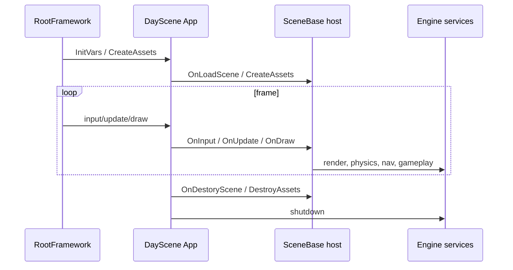

# Runtime Hosts and Scene Selection

Status: verified against DayScene and T8ditor entry points on 2026-08-19.

The executable is named `DayScene.exe`, but it hosts six different runtime scene classes. Choose the host before changing code or selecting a regression case.

## Executables

| Executable | Purpose |
|---|---|
| `DayScene.exe` | Runtime shell containing Sandbox, DayScene, Quake3Mock, RagdollEditor, SceneTemplate, and VoxelScene |
| `T8ditor.exe` | Authored scene editor and hosted Play/Mesh/Ragdoll tools |

Framework libraries are not standalone applications.

## DayScene Scene Indices

| Index | Class | Primary input | Use it for |
|---:|---|---|---|
| 0 | `SandboxScene` | `--model` or `--sceneFile` | model/material/animation inspection and isolated rendering work |
| 1 | `DayScene` | built-in descriptor/assets | shipping/demo Sponza flow, benchmark matrix, full post stack |
| 2 | `Quake3Mock` | model or Q3 `.t8scene` | legacy Q3 compatibility and scene experiments |
| 3 | `RagdollEditor` | animated `--model` | runtime ragdoll/animation authoring behavior |
| 4 | `SceneTemplate` | authored `--sceneFile` | long-term `.t8scene` runtime, gameplay, physics, navigation, profiles |
| 5 | `VoxelScene` | generated chunks + persisted deltas | mutable block terrain, FPS traversal, streaming, place/remove reference |

## Which Host to Change

- New authored scene/runtime behavior: `SceneTemplate`.
- Gameplay object/component/control/service work: Framework game module plus `SceneTemplate` integration.
- General rendering mesh/material change: Framework renderer; validate Sandbox and authored scenes.
- Day demo pass/benchmark behavior: `DayScene`.
- Q3 legacy behavior only: `Quake3Mock`.
- Full-skeleton runtime ragdoll tooling: `RagdollEditor` and shared ragdoll Framework code.
- Authoring UI, undo, validation, overlays, or Play Scene: T8ditor.
- Mutable/procedural block worlds: Framework terrain module plus `VoxelScene` reference integration.

Do not add new general runtime behavior to all legacy scene copies when `SceneTemplate` is the owning path. Audit duplicates only when a shared input/camera/rendering change requires parity.

## Launch Examples

From `bin/x64/Release`:

```powershell
# Sandbox static model
.\DayScene.exe --api d3d11 --scene 0 --model Models/DamagedHelmet.glb

# Day demo
.\DayScene.exe --api d3d12 --scene 1

# Quake3Mock
.\DayScene.exe --api gl --scene 2 --model Models/DamagedHelmet.glb

# Ragdoll runtime
.\DayScene.exe --api d3d11 --scene 3 --model Models/Tyrant.glb

# Authored runtime
.\DayScene.exe --api d3d11 --scene 4 --sceneFile Scenes/DayScene.t8scene
.\DayScene.exe --api d3d12 --scene 4 --sceneFile Scenes/Q3/q3dm6_mod_3_jolt.t8scene

# Streamed mutable voxel terrain
.\DayScene.exe --api d3d12 --scene 5 --width 1280 --height 720
```

## SceneTemplate Ownership

SceneTemplate:

- loads `.t8scene` through `EditorSceneFile`;
- loads render meshes and links physics/ragdolls/navigation;
- owns `GameLogicSystem`;
- builds/loads NavMesh and binds `GameNavigationService`;
- executes the JSON render graph;
- exposes runtime DevGui panels;
- shuts game logic down before navigation/render assets are destroyed or rebuilt.

The fixed-tick gameplay phases are separate from variable-rate camera/render presentation.

## T8ditor and Play Scene

Launch:

```powershell
.\T8ditor.exe --api d3d12
.\T8ditor.exe --api d3d11 --sceneFile Scenes/DayScene.t8scene
```

T8ditor authors shared `EditorSceneFile` data: objects, cameras, lights, physics, navigation, ragdolls, splines, game entities/groups/settings, and profiles.

Play Scene currently uses Fidelity mode only:

1. build an editor snapshot;
2. assign/migrate stable gameplay IDs;
3. validate gameplay data;
4. export a temporary `.t8scene`;
5. load it through the real SceneTemplate file path.

Validation errors block Play. Fast in-memory Play is not implemented.

## Regression Cases

`CaptureVisualBaselines.ps1` maps hosts to fixed inputs:

| Case | Host/input |
|---|---|
| `sandbox` | Sandbox + DamageHelmet + fixed orbit yaw |
| `day` | DayScene |
| `quake3` | Quake3Mock + DamageHelmet |
| `ragdoll-editor` | RagdollEditor + Tyrant |
| `scene-template-q3-jolt` | SceneTemplate + Q3 Jolt scene |
| `scene-template-q3` | SceneTemplate + Q3 non-Jolt scene |
| `scene-template-day` | SceneTemplate + DayScene.t8scene |
| `scene-template-nexus` | SceneTemplate + Nexus, skipped when source models are absent |
| `voxel-streaming` | VoxelScene + generated streamed chunks; no external assets |

Use the case closest to the changed owner, then run the full matrix for shared rendering or final gates.

## Lifecycle



The hook is intentionally spelled `OnDestoryScene` in the existing interface. Match it exactly.

## Related Documents

- [Main architecture](../architecture/main-architecture.md)
- [Scene format and runtime](../scenes/scene-format-and-runtime.md)
- [Editor overview](../editor/editor-overview.md)
- [Game entity system](../game/game-entity-system-spec.md)
- [Visual regression](../debug/visual-regression.md)
