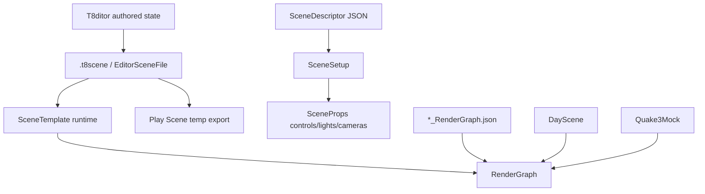
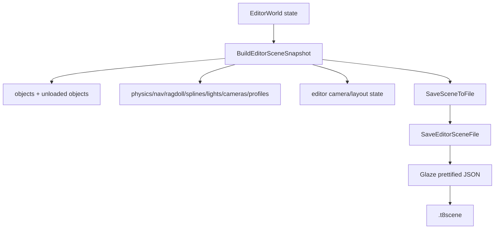

# Scene Format and Runtime

Status: verified against source on 2026-08-19.

This document explains T850's scene formats and runtime scene loaders: `.t8scene`, editor serialization, `SceneTemplate`, legacy/runtime JSON descriptors, render graph references, profiles, cameras/lights/splines, physics, ragdolls, navigation, Quake3 scene variants, and the differences between DayScene, Quake3Mock, SceneTemplate, and editor Play Scene.

Related documents:

- [Main architecture](../architecture/main-architecture.md)
- [Resource locator and cache paths](../architecture/resource-locator.md)
- [Input, camera, and controls](../input/camera-and-controls.md)
- [FrameworkImGui runtime UI](../editor/imgui-system.md)
- [Textures, samplers, and IBL](../rendering/textures-and-ibl.md)
- [Dependency map](../dependency-map.md)
- [SceneSetup descriptors](scene-setup-descriptors.md)
- [Render graph](../rendering/render-graph.md)
- [Loading geometry](../geometry/loading-geometry.md)
- [Animation system](../animation/animation-system.md)
- [Jolt physics](../physics/jolt-physics.md)
- [NavMesh and Detour](../navigation/navmesh-detour.md)
- [Editor overview](../editor/editor-overview.md)

## Scene format families

T850 currently has two important scene-description families.

| Format | Primary structs | Main users | Purpose |
|---|---|---|---|
| `.t8scene` | `t850::scene::EditorSceneFile` | T8ditor, SceneTemplate, Play Scene | Authored game/editor scene with objects, cameras, physics, ragdolls, navigation, splines, profiles, lights, editor state. |
| scene descriptor JSON | `t850::SceneDescriptor` | DayScene, Quake3Mock, SceneTemplate controls, editor rendering panel | Runtime/render settings descriptor: cameras, lights, Gauss kernels, splines, render quality, UI slider/checkbox/selector metadata, profiles. |
| render graph JSON | `RenderGraphDesc` | All major scenes/editor | Data-driven render target/pass graph. See [Render graph](../rendering/render-graph.md). |

## Key files and classes

| File/class | Role |
|---|---|
| `Framework/include/scene/EditorSceneFile.h` | Full `.t8scene` schema. |
| `Framework/src/scene/EditorSceneFile.cpp` | `.t8scene` Glaze JSON load/save and mesh fallback resolution. |
| `T8ditor/EditorScene.cpp` | Editor wrapper for save/load dialogs and scene file IO. |
| `T8ditor/EditorApp.cpp` | Builds editor scene snapshots, loads editor scenes into editor state, exports Play Scene temp files. |
| `T8ditor/EditorSceneSerialization.cpp` | Conversion helpers between editor/runtime structs and scene schema for NavMesh, physics, links, volumes. |
| `Framework/include/scene/SceneDescriptor.h` | Runtime scene descriptor schema for settings, controls, lights, cameras, profiles. |
| `Framework/src/scene/SceneDescriptor.cpp` | Glaze load/save for runtime `SceneDescriptor`. |
| `Framework/include/scene/SceneSetup.h` and `Framework/src/scene/SceneSetup.cpp` | Builds cameras/lights/kernels/splines from `SceneDescriptor` and applies them to `SceneProps`. |
| `documentation/scenes/scene-setup-descriptors.md` | Deep appendix for `SceneDescriptor`, `SceneSetup`, control metadata, profile overrides, and `SceneProps` mappings. |
| `DayScene/SceneTemplate.cpp` | Main `.t8scene` runtime loader and long-term editor-authored scene runtime. |
| `DayScene/DayScene.cpp` | Older runtime/demo scene with its own setup and benchmark matrix support. |
| `DayScene/Quake3Mock.cpp` | Quake3-oriented runtime scene with Q3 collision/navigation/gameplay experiments. |
| `Assets/Scenes/*.t8scene` | Authored scene examples such as `DayScene.t8scene`, `Nexus.t8scene`, and Q3 scenes. |
| `Assets/Scenes/*_RenderGraph.json` | Render graph files referenced by scenes. |

## `.t8scene` schema

The `.t8scene` root maps to `EditorSceneFile`.

| Field | Type | Meaning |
|---|---|---|
| `version` | int | Scene format version. Game-logic schema v2 is migrated explicitly. |
| `collision` | string | Optional legacy/Q3 collision resource, e.g. `.t8q3clip`. |
| `render_graph` | string | Optional render graph override path. |
| `control_descriptor` | string | Optional `SceneDescriptor` path providing rendering defaults and UI control metadata. |
| `editor` | `EditorStateDesc` | Editor camera, view toggles, layout mode/data. |
| `objects` | array | Mesh scene objects. |
| `game_entities` | array | Stable gameplay entities, links, control, components, and optional behavior. |
| `game_groups` | array | Stable-id gameplay group membership plus formation/flock settings. |
| `game_logic_settings` | optional object | Fixed tick, catch-up cap, and optional spatial-grid settings. |
| `physics_entities` | array | Authored runtime physics/player/character/static collision entities. |
| `navigation_mesh` | optional object | Authored NavMesh settings, volumes, links, baked asset path. |
| `splines` | array | Camera/agent path splines. |
| `cameras` | array | Authored scene cameras. |
| `light_cameras` | array | Authored shadow/God Rays light cameras. |
| `camera_animations` | array | Timeline/keyframe camera animation data. |
| `god_rays_volume` | optional object | Authored God Rays clipping volume. |
| `lights` | array | Directional/omni lights, including optional Q3 source metadata. |
| `profiles` | array | Runtime/profile overrides using `SandboxProfileDesc`. |
| `voxel_world` | optional object | Procedural voxel-world content and runtime settings used by MinecraftScene. |

### Voxel world component

`voxel_world` makes procedural voxel content authored scene data rather than C++ scene
constants. It contains bounded runtime dimensions, terrain/noise parameters, named block
roles, ore rules, block face tiles/colors, hotbar entries, player movement/collision,
streaming limits, day/night behavior, environment choices, mob/weapon box parts, interaction
reach/cooldowns, and debug defaults.

Minecraft uses three data files with non-overlapping ownership:

- `Scenes/Minecraft.t8scene`: authoritative content, cameras, stable light IDs, voxel world,
  navigation settings, rendering profile values, and render-graph/control-descriptor paths.
- `Scenes/MinecraftScene.json`: reusable rendering defaults plus DayScene-style slider,
  checkbox, selector, and Gaussian-filter metadata. It does not own cameras or lights.
- `Scenes/MinecraftScene_RenderGraph.json`: rendering targets, CSM projection, and passes.

MinecraftScene accepts an explicit `--sceneFile`/`--t8scene` path when scene 6 is selected.
Authored dimensions are validated against engine safety capacities and rejected when invalid;
they are not silently clamped. T8ditor scene snapshots preserve the optional component even
though a dedicated voxel-authoring panel is not yet present.

Minecraft has three runtime camera roles selected from the ImGui `Cameras` section:

- **Player** is the character-owned first-person camera. It is always the source for CSM
  split generation and render-mesh frustum culling.
- **Free spectator** is an independently authored perspective camera. It receives free-fly
  WASD/Space/Shift and mouse-look input when selected, but never changes CSM or culling. This
  intentionally exposes geometry rejected by the player frustum when viewed from outside it.
- **Light** is a passive view through the authored Sun camera. Selecting it does not grant
  movement input. During automatic day/night simulation, its position and orientation follow
  the directional Sun, while CSM receiver slices and culling remain player-owned.

`Move light camera` is the explicit ownership transition for manual Sun authoring. It selects
the Light view, pauses the trajectory, and enables free-fly input. While editing, the light
camera writes the attached directional light's position and direction, so generated CSM views
update from the manual orientation. `Finish moving light camera` disables input but leaves the
trajectory paused. `Resume sun trajectory` returns ownership to the automatic orbit.

`ActiveCam` controls rendering only; `SceneProps::pCullingCamera` and
`ShadowSystem::UpdateProjection` remain bound to the player camera. The `Save scene and
cameras` button writes player and spectator camera position/orientation to `cameras`, writes
the light camera to `light_cameras`, synchronizes the player eye to
`voxel_world.player.spawn`, and persists the selected `camera_mode`. Orientation is stored as
the authored `target = position + runtime look` convention. Older Minecraft scenes with only
one camera receive a deterministic spectator fallback that is included on the next save.

Saving also persists `day_night.trajectory_paused`, current orbit time, animation speed,
manual ambient color, authored day/night Sun intensities, and the attached Sun light. The
animation speed is a multiplier on `dt / day_length_seconds`; Minecraft defaults it to `0.1`.
A saved paused trajectory therefore reloads at the edited camera and Sun transform without
one frame of simulation overwriting it.

The same action persists all user-editable Minecraft rendering controls. Scene-specific
values are written to `voxel_world`, descriptor-driven sliders, selectors, and checkboxes are
written to the first rendering `profile`, and shadow projection settings are written to that
profile's first `shadow_projections` entry. Action buttons and the temporary light-camera
edit mode are intentionally transient. Render-graph pass state such as DOF is reconstructed
from its saved profile toggle during the next load.

Fullscreen shadow composition reconstructs the visible world position using `ActiveCam`, but
it must transform that world position through the player camera before selecting a cascade.
Using active-camera linear depth directly makes spectator movement choose different cascade
tiles even though atlas generation is correctly player-owned. Both production shadow
sampling and cascade-region debug coloring therefore use the player camera view matrix for
split depth and its view-projection matrix for frustum containment. Points outside the player
frustum receive no cascade debug tint and no CSM sample.

Fitted light bounds still depend on directional-light orientation. With authored day/night
enabled, those bounds can rotate over time even while both player and spectator are stationary;
that is light movement, not spectator ownership of the cascades.

Minecraft runtime tuning belongs to `voxel_world`: Sun orbit basis/center/radius/phase,
horizon blend, day/night colors and intensities, ambient tint, cascade debug palette, camera
pitch limit and speed, collision sweep resolution, navmesh rebuild throttle, mob smoothing,
and voxel material parameters are authored there. Mathematical constants, fixed vertex/index
formats, array capacities, and topology remain code invariants. Keyboard bindings remain in
the shared input layer until the engine has a cross-scene keymap schema; do not add a
Minecraft-only string-to-key parser.

Minecraft chunk residency is controlled by `render_distance`; the shipped scene uses six
chunks in every horizontal direction and the runtime supports up to eight. The resident grid
uses world-coordinate ring slots, so recentering does not copy the full voxel array or mesh
instance table. `streaming_recenter_threshold` keeps the player inside the preloaded area
before requesting another ring update. Entering terrain is generated into private worker
payloads, mesh snapshots are built on worker threads, and `max_uploads_per_frame` limits GPU
commits on the render thread.

Chunk geometry uses reusable `MutableMesh` buffers instead of appending each streamed chunk
to the shared immutable mesh pool. D3D12 and Vulkan therefore retire only the replaced
chunk's buffers; they do not rebuild an ever-growing global vertex/index pool. Graphics API
calls remain on the render thread because the current driver command allocators and descriptor
state are not thread-safe scene-worker interfaces. D3D12 and Vulkan upload each replacement
through staging buffers into GPU-local vertex/index memory. Upload command buffers and staging
allocations remain alive until backend fences complete, so each budgeted commit is submitted
without a CPU wait and subsequent rendering is ordered on the same graphics queue.

Minecraft block edits update the authoritative voxel grid immediately, then queue the edited
chunk (and a boundary neighbor when required) through the same worker-mesh pipeline. The old
chunk mesh remains visible until its GPU-local replacement is ready. Edits also debounce an
asynchronous Recast/Detour rebuild built from an immutable voxel snapshot; the previous
navigation mesh remains active until the replacement is published. Minecraft collision does
not rebuild Jolt bodies for block edits: player and mob collision query voxel occupancy
directly, so edit-time pauses should be diagnosed in remeshing or navigation rather than Jolt.

Minecraft owns a gameplay HUD through the scene-level `DrawGameplayGui` hook, independently
of the docked developer controls. It draws a target-aware crosshair, world/target status,
desktop control hints, transient placement feedback, and a nine-slot hotbar using each
authored block's display color. A live raycast target receives a bright block outline. When
the ray has no block within reach, the last valid target remains as a dim amber outline and
is labeled `Last target`; it is visual history only and cannot be edited until reacquired.
Other scenes inherit the no-op hook and render no gameplay HUD.

Minecraft's rendering panel mirrors the applicable DayScene controls: shared lighting,
material, parallax and parallax-shadow settings; SSAO; DOF; active light count; Gaussian
kernel selection, radius, sigma and tap support; luminance mode; and graph-resource debug
views. Camera and cubemap selection remain in Minecraft-specific sections because their
ownership differs from DayScene's spline scene.

The `Debug RT` selector exposes only resources present in the Minecraft graph: all seven
GBuffer attachments, GBuffer depth, the CSM atlas, blurred `ShadowAccum`, Deferred,
pre-tonemap composite, HDR, raw Bright, Bloom, CoC, and adapted luminance. Minecraft now
includes the CoC/DOF graph slice used by its existing DOF controls. God Rays are intentionally
not exposed: DayScene's ray-march pass assumes a single light-depth projection and cannot
sample Minecraft's CSM atlas correctly without a dedicated implementation.

Minecraft debug controls are functional rather than state-only: chunk bounds and player/mob
collision envelopes draw through a depth-read render-graph callback with authored colors;
NavMesh draws through `NavMeshDebugRenderer`; and culling controls retain the player camera
as the culling owner while the spectator remains an independent view.

Runtime block edits synchronously replace one or more `RenderMesh` chunk instances. Destroying
the old mesh must retire its constant buffers, line-renderer buffer, and optional wireframe
buffers through `BaseDriver::RetireBuffer`; do not call `Buffer::release()` directly. D3D12
and Vulkan defer those releases until in-flight frames complete, while D3D11/OpenGL use the
immediate base implementation. Immediate explicit-API release can remove the device on the
next block edit; later CB/VB/IB allocation failures with `DXGI_ERROR_DEVICE_REMOVED` are only
aftermath, not the originating allocation problem.

`MeshAssetCache::UploadDirtyPools()` recreates the shared vertex and index pool buffers after
procedural geometry is appended. Pool replacement and pool destruction must retire the old
GPU buffer through the same driver API. Releasing a shared pool immediately is especially
unsafe because all visible chunks in the previous frame reference it, and was the direct
device-removal hazard in the block-edit path.

Block edits also cancel pending asynchronous geometry for the edited chunk and border
neighbors before the synchronous rebuild. This avoids stale snapshot uploads racing the
replacement mesh, but it does not replace GPU resource retirement; both protections are
required.

Minecraft DOF uses normalized world-space autofocus rather than DayScene's legacy lens-unit
equation. `dof.focus_range` defines the sharp band around the focused distance,
`dof.focus_falloff` defines how quickly CoC reaches `MaxCoc`, and
`dof.auto_focus_radius` defines a screen-space center search radius. A valid center depth has
priority. If the center is sky/clear depth, a 5x5 neighborhood chooses the nearest valid
geometry; if none exists, CoC is zero for that frame.

Near and far CoC channels combine with `max`, so the far channel is not doubled. DOF sample
loops accumulate into a zero-initialized sum and divide by the actual sample count; do not
seed the sum with the center color and then sample the center a second time. These rules keep
a centered tree or voxel surface sharp while allowing a gradual authored transition into
foreground/background blur.

This behavior is opt-in through `SceneProps::DOFNormalizedFocus`. Its default is false, so
DayScene and existing scenes retain their legacy lens equation, far-CoC boost, invalid-center
fallback, and historical blur accumulation. Minecraft sets it from `voxel_world.dof` and uses
the normalized path. Shared shaders receive the mode explicitly for CoC, CoC combination,
and both DOF passes; do not infer compatibility mode from stale pass constants.

Unknown JSON keys are ignored by Glaze on load, so game schema changes require
`MigrateEditorSceneGameLogic()` and `ValidateEditorSceneGameLogic()` rather than relying on
parser errors.

## Object records

`SceneObjectDesc` stores one render object.

Important fields:

- `name`
- `mesh`
- legacy `ragdoll`
- `position`, `rotation`, `scale`
- `visible`, `mobile_visible`, `frozen`, `show_wire`, `show_orientation`
- Nav agent metadata: `nav_agent_front_yaw_offset_deg`, `nav_agent_face_yaw_sign`, `nav_agent_target_mode`, `nav_agent_follow_distance`, `nav_agent_side_offset`, `nav_agent_formation_depth_step`, `nav_agent_slot`
- optional `physics`
- optional `navigation`
- optional `ragdoll_authoring`

Runtime notes:

- `SceneTemplate` skips invisible objects for rendering, except navigation source extraction can still include hidden objects when they have explicit navigation include metadata.
- Android can skip objects with `mobile_visible == false`.
- Rotation is stored in degrees in `.t8scene`; `PrimitiveInst` APIs also expect degrees for absolute rotation.
- `mesh` is normalized through resource lookup/fallback logic.

## Editor state and layout

`EditorStateDesc` stores:

- orbit camera target/yaw/pitch/distance,
- `show_skybox`,
- `show_wireframe`,
- `allow_custom_layout`,
- optional `imgui_layout`.

T8ditor only stores scene-specific ImGui layout when `allow_custom_layout` is true. Otherwise the scene clears `imgui_layout` and the global ImGui layout is used.

## Cameras, lights, splines, and God Rays

`SceneCameraDesc`:

- perspective/ortho type,
- position and target,
- FOV/ortho dimensions,
- near/far planes,
- visibility/frozen state.

`SceneLightDesc`:

- directional or omni/point type,
- position/direction/color/intensity/radius,
- enabled/visible/frozen,
- optional `SceneQ3LightDesc` source metadata.

`SceneLightCameraDesc`:

- perspective/ortho light camera,
- attached light index,
- yaw rate,
- visibility/frozen state.

`SceneSplineDesc`:

- named point list,
- loop flag,
- agent velocity/offset,
- attached camera,
- editor visibility/frozen/wire state.

`SceneCameraAnimationDesc`:

- target kind: camera or light camera,
- camera index,
- start time/duration/loop,
- velocities,
- optional keyframes for position/target/rotation/FOV/ortho size.

`SceneGodRaysVolumeDesc`:

- position and half extents,
- assigned light camera,
- enabled/clip/visible/frozen/wire flags,
- authored marker.

## Physics, ragdoll, and navigation metadata

Physics:

- Per-object `SceneObjectPhysicsDesc` is a quick object-owned physics request.
- Top-level `ScenePhysicsEntityDesc` provides authored static triangle mesh, player, and character data.
- `ScenePhysicsCookSettingsDesc` configures Jolt triangle mesh cook/cache behavior.
- `ScenePhysicsCharacterDesc` stores runtime movement/character settings.

Ragdoll:

- Legacy `object.ragdoll` stores a direct ragdoll authoring asset path.
- `object.ragdoll_authoring` stores richer metadata: enabled state, asset path, preview flag, drive-from-animation flag, runtime motion.
- Runtime ragdoll authoring assets live under `Models/RagdollEdits`.

Navigation:

- Per-object `SceneObjectNavigationDesc` controls source inclusion/static/walkable/area/cost.
- Top-level `SceneNavigationMeshDesc` stores build settings, runtime mode, baked asset, volumes, and authored off-mesh links.
- Runtime modes are `build_cached`, `build`, and `baked_asset`.

See [Jolt physics](../physics/jolt-physics.md) and [NavMesh and Detour](../navigation/navmesh-detour.md) for subsystem details.

## Editor save path

T8ditor writes `.t8scene` through `EditorApp::BuildEditorSceneSnapshot()` and `SaveEditorSceneSnapshot()`.

`BuildEditorSceneSnapshot()`:

- starts from loaded scene file if available,
- writes editor camera and layout state,
- skips transient objects,
- writes mesh objects and their authored metadata,
- preserves unloaded scene objects,
- writes game entities, splines, light cameras, camera animations, God Rays, physics entities, NavMesh, cameras, lights, collision path, and profiles,
- upserts the current editor profile.

`SaveEditorSceneFile()`:

- serializes with `glz::write` and prettify,
- creates parent directories,
- writes the JSON file,
- logs success/failure.

## Editor load path

`LoadEditorSceneFile()`:

1. Reads JSON through `ResourceLocator`.
2. Parses with Glaze, ignoring unknown keys.
3. Resolves missing glTF mesh paths using fallback directories.
4. Logs object/camera/light counts.

`EditorApp::ApplyEditorUndoState()` and the scene-load path rebuild editor state from `EditorSceneFile`:

- clear current objects, physics, ragdolls, NavMesh, groups, cameras, lights, splines,
- recreate primitives through `ImportMesh()`,
- apply transforms and metadata,
- restore physics entities,
- restore game entities,
- restore light cameras/camera animations/God Rays,
- restore NavMesh authoring,
- restore cameras and lights,
- restore editor camera/layout/profile state,
- reconcile selection and groups.

This same rebuild logic is used by scene-wide undo snapshots.

## Play Scene temporary export

Play Scene writes a temporary `.t8scene` and runs it through `SceneTemplate`.

Flow:

1. If authored NavMesh is dirty, regenerate it first.
2. Create `%TEMP%\T850\T8ditorPlay`.
3. Build a virtual editor scene snapshot.
4. Save `play_scene_<timestamp>.t8scene`.
5. Create hosted `SceneTemplate` with its own `EngineContext` and physics runtime.
6. Restore editor state and delete the temp file when Play Scene closes.

This makes Play Scene a high-fidelity test of the actual runtime `.t8scene` loader.
The exported temp scene is later loaded like any other `.t8scene`; if the Play Scene window fails to launch, inspect both the export log and the temp path passed to `LoadSceneFromFile()` / SceneTemplate.

## Runtime `.t8scene` load: SceneTemplate

`SceneTemplate` is the long-term runtime for editor-authored scenes.

Scene path selection:

1. launch descriptor `sceneFilePath`,
2. `g_config.sceneFilePath`,
3. default `Scenes/Q3/q3dm6_mod_3_jolt.t8scene`.

`CreateAssets()` pre-reads the scene file when present so it can:

- select profiles,
- select render graph override from `render_graph`,
- apply startup profile render-target settings before creating render targets.

Then it loads the render graph and render targets, creates primitive managers/quads, and loads the active scene/model.

Runtime object load:

1. Iterate visible scene objects, with Android mobile visibility filtering.
2. Normalize mesh path.
3. Create mesh through `PrimitiveManager::CreateMesh()`.
4. Create `PrimitiveInst`, set scale/rotation/translation/visibility, and update transform.
5. Process object physics metadata.
6. Attach skinned ragdoll if authored.
7. Store scene mesh paths, object names, navigation metadata, ragdoll metadata, nav agent metadata.
8. Create top-level physics entities.
9. Apply cameras/lights/profiles/navigation/player setup.
10. Initialize `GameLogicSystem`, register example factories, resolve render/physics/camera/nav links, and load game entities/groups.

SceneTemplate then drives:

- render graph execution,
- physics update integration from app context,
- NavMesh build/cache/baked load,
- nav agents,
- fixed-tick gameplay objects, components, events, state machines, groups, and service facades,
- splines,
- ragdoll animation/physics handoff,
- camera/profile controls,
- debug overlays.

The runtime Game Logic DevGui shows objects, components, recent events, forced state transitions, and a fixed-tick pause control. Gameplay telemetry uses the `game.*` counter/scope namespace.

`Quake3Mock` and `SandboxScene` also contain embedded editor-scene loading paths for compatibility and experiments. Both can load `.t8scene` through `LoadEditorSceneFile()`, infer or use Q3 collision clips from the scene `collision` field or mesh data, and then apply their own scene-specific runtime behavior. `RagdollEditor` is primarily profile/model-centric and normally loads `Scenes/RagdollEditor.json`, but it can pre-read embedded scene profiles when launched in an embedded-scene mode.

## SceneDescriptor and SceneSetup

`SceneDescriptor` is a separate runtime JSON format used for scene setup and editor rendering controls.

It contains:

- cameras,
- light cameras,
- lights,
- Gaussian filters,
- splines,
- mesh paths,
- environment/IBL resources,
- quality settings,
- scene settings,
- UI slider/checkbox/selector descriptions,
- profiles.

`SceneSetup::Load()` parses it, builds runtime `Camera`, `GaussFilter`, `Spline`, and `SplineAgent` objects, and stores asset paths.

`SceneSetup::Apply()` wires cameras, light cameras, lights, Gauss kernels, quality, and settings into `SceneProps`.

T8ditor uses `Scenes/Quake3Mock.json` as the editor's runtime render-control descriptor for Look & Lighting. SceneTemplate uses `Scenes/SceneTemplate.json` for control setup and profile defaults.

## Profiles

Profiles use `SandboxProfileDesc` and can live in both scene descriptor JSON and `.t8scene`.

Profiles can target:

- platform,
- architecture,
- GPU family,
- GPU name substring,
- model path/key.

They can override:

- sliders,
- checkboxes,
- selectors,
- lights,
- animations,
- cubemap path,
- camera/orbit camera,
- frustum culling/debug flags,
- current keyframe.

SceneTemplate scores runtime profile matches and applies base/model-specific/runtime profiles before render target creation and during scene load. T8ditor upserts the current editor scene profile when saving.

## Render graph references

`.t8scene` may set `render_graph`.

If empty, runtimes use their defaults:

- SceneTemplate default: `Scenes/SceneTemplate_RenderGraph.json`
- DayScene default: `Scenes/DayScene_RenderGraph.json`
- Quake3Mock default: `Scenes/Quake3Mock_RenderGraph.json`
- T8ditor default: `Scenes/T8ditor_RenderGraph.json`

SceneTemplate disables or toggles certain passes depending on render graph and scene properties, such as disabling `Light Add` for default SceneTemplate graph or toggling DOF passes based on `SceneProps.ToogleDOF`.

## Runtime scene variants

### DayScene

DayScene is an older high-end demo/benchmark scene. It:

- uses `DayScene_RenderGraph.json`,
- supports benchmark/offscreen matrix workflows,
- has its own runtime profile setup,
- can now be represented by `Assets/Scenes/DayScene.t8scene`, but the C++ scene still owns much of its runtime/benchmark behavior.
`DayScene.t8scene` is a useful example of authored render graph, objects, static physics, cameras, lights, light cameras, camera animations, God Rays, splines, and profiles in one file.

### SceneTemplate

SceneTemplate is the target runtime for `.t8scene` authored content. It loads editor-authored objects, physics, ragdolls, navigation, profiles, cameras, lights, splines, God Rays, and render graph overrides.

### Quake3Mock

Quake3Mock is a Quake3-inspired experimental scene. It uses:

- Quake3 assets,
- Q3 collision resources such as `.t8q3clip`,
- Quake-style character movement and jump pads,
- Quake3Mock render graph,
- navigation and ragdoll experiments.

### Quake3 Jolt `.t8scene`

`Scenes/Q3/q3dm6_mod_3_jolt.t8scene` is the default SceneTemplate `.t8scene`. It combines:

- Q3 map mesh,
- `.t8q3clip` collision reference,
- static triangle mesh physics,
- player physics entity,
- character/nav-agent game entity,
- skinned ragdoll object,
- ragdoll authoring asset,
- NavMesh settings and authored links.

This is the bridge between earlier Quake3Mock experiments and the long-term SceneTemplate path.

### Nexus `.t8scene`

`Nexus.t8scene` is a large editor-authored terrain/RTS-style test. It demonstrates:

- hidden but navigation-included terrain,
- static triangle mesh physics entity,
- authored NavMesh include/exclude volumes,
- runtime mode `build_cached`,
- editor camera/layout state.

### Other `.t8scene` examples

`Scenes/Q3/q3dm6_mod_3.t8scene` is a Q3 authored scene without the full Jolt/NavMesh block used by `q3dm6_mod_3_jolt.t8scene`; it is useful for comparing pre-Jolt and Jolt-enabled authoring. Several scenes include `profiles` sections so render/camera/material behavior can be adjusted without hardcoding per-platform variants.

## Extension points

When extending scene formats:

1. Add fields to `EditorSceneFile.h`.
2. Update `BuildEditorSceneSnapshot()` to save the data.
3. Update editor load/restore paths to apply the data.
4. Update SceneTemplate runtime load to consume the data.
5. Add conversion helpers in `EditorSceneSerialization.cpp` if mapping between editor/runtime structs is non-trivial.
6. Update Play Scene export if the data must be included in temporary runtime scenes.
7. Update cache keys for systems affected by the new data, such as NavMesh or physics cooked assets.
8. Update this documentation and examples.

## Known limitations and gotchas

- `.t8scene` and `SceneDescriptor` are different formats and are both actively used.
- Unknown `.t8scene` keys are ignored, so typos may silently do nothing.
- SceneTemplate skips invisible render objects, but hidden explicitly included navigation sources can still matter when authored correctly.
- SceneTemplate caps runtime mesh slots through `kMaxSandboxMeshes`.
- `render_graph` is optional; empty means default graph.
- Legacy `object.ragdoll` and newer `ragdoll_authoring` both exist.
- Rotation units differ by layer: `.t8scene` stores degrees for object/camera authoring, while many runtime fields use radians internally.
- Play Scene uses a temporary `.t8scene`; if behavior differs, inspect the exported file.
- DayScene/Quake3Mock still contain significant hardcoded runtime behavior outside `.t8scene`.

## Debugging checklist

1. If a scene does not load, check `LoadEditorSceneFile()` logs for read/parse errors.
2. If a mesh path fails, check resource normalization and fallback directories.
3. If objects are missing at runtime, check visibility, `mobile_visible`, and `kMaxSandboxMeshes`.
4. If render output differs, verify `render_graph` path and active profiles.
5. If physics differs, inspect both object `physics` metadata and top-level `physics_entities`.
6. If ragdoll does not attach, verify the mesh is skinned and the ragdoll authoring asset path resolves.
7. If navigation differs, check object navigation flags, top-level `navigation_mesh`, runtime mode, baked asset path, volumes, and links.
8. If Play Scene differs from editor, inspect the temp `.t8scene` exported under `T850/T8ditorPlay`.
9. If editor undo restores unexpected state, inspect `BuildEditorSceneSnapshot()` and `ApplyEditorUndoState()`.
10. If a profile does not apply, check target fields and model key matching.
