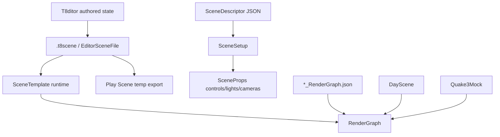
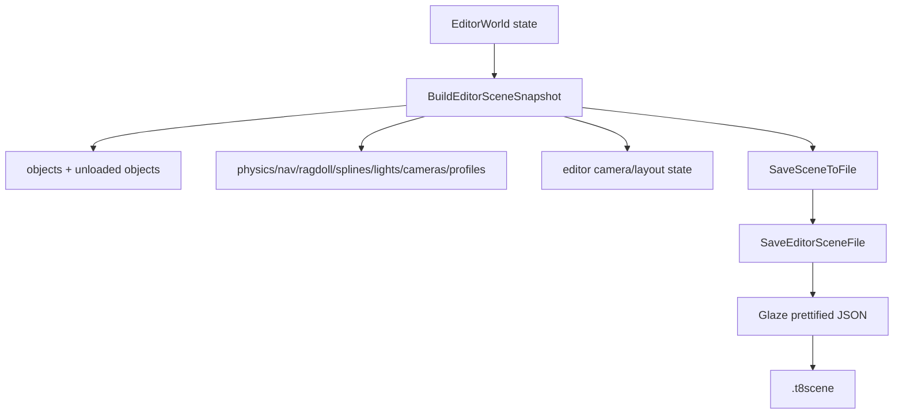

# Scene Format and Runtime

Status: verified against source on 2026-08-19.

This document explains T850's scene formats and runtime scene loaders: `.t8scene`, editor serialization, `SceneTemplate`, legacy/runtime JSON descriptors, render graph references, profiles, cameras/lights/splines, physics, ragdolls, navigation, Quake3 scene variants, and the differences between DayScene, Quake3Mock, SceneTemplate, and editor Play Scene.

Related documents:

- [Main architecture](../architecture/main-architecture.md)
- [Resource locator and cache paths](../architecture/resource-locator.md)
- [Input, camera, and controls](../input/camera-and-controls.md)
- [FrameworkImGui runtime UI](../editor/imgui-system.md)
- [Textures, samplers, and IBL](../rendering/textures-and-ibl.md)
- [Dependency map](../dependency-map.md)
- [SceneSetup descriptors](scene-setup-descriptors.md)
- [Render graph](../rendering/render-graph.md)
- [Loading geometry](../geometry/loading-geometry.md)
- [Animation system](../animation/animation-system.md)
- [Jolt physics](../physics/jolt-physics.md)
- [NavMesh and Detour](../navigation/navmesh-detour.md)
- [Editor overview](../editor/editor-overview.md)

## Scene format families

T850 currently has two important scene-description families.

| Format | Primary structs | Main users | Purpose |
|---|---|---|---|
| `.t8scene` | `t850::scene::EditorSceneFile` | T8ditor, SceneTemplate, Play Scene | Authored game/editor scene with objects, cameras, physics, ragdolls, navigation, splines, profiles, lights, editor state. |
| scene descriptor JSON | `t850::SceneDescriptor` | DayScene, Quake3Mock, SceneTemplate controls, editor rendering panel | Runtime/render settings descriptor: cameras, lights, Gauss kernels, splines, render quality, UI slider/checkbox/selector metadata, profiles. |
| render graph JSON | `RenderGraphDesc` | All major scenes/editor | Data-driven render target/pass graph. See [Render graph](../rendering/render-graph.md). |

## Key files and classes

| File/class | Role |
|---|---|
| `Framework/include/scene/EditorSceneFile.h` | Full `.t8scene` schema. |
| `Framework/src/scene/EditorSceneFile.cpp` | `.t8scene` Glaze JSON load/save and mesh fallback resolution. |
| `T8ditor/EditorScene.cpp` | Editor wrapper for save/load dialogs and scene file IO. |
| `T8ditor/EditorApp.cpp` | Builds editor scene snapshots, loads editor scenes into editor state, exports Play Scene temp files. |
| `T8ditor/EditorSceneSerialization.cpp` | Conversion helpers between editor/runtime structs and scene schema for NavMesh, physics, links, volumes. |
| `Framework/include/scene/SceneDescriptor.h` | Runtime scene descriptor schema for settings, controls, lights, cameras, profiles. |
| `Framework/src/scene/SceneDescriptor.cpp` | Glaze load/save for runtime `SceneDescriptor`. |
| `Framework/include/scene/SceneSetup.h` and `Framework/src/scene/SceneSetup.cpp` | Builds cameras/lights/kernels/splines from `SceneDescriptor` and applies them to `SceneProps`. |
| `documentation/scenes/scene-setup-descriptors.md` | Deep appendix for `SceneDescriptor`, `SceneSetup`, control metadata, profile overrides, and `SceneProps` mappings. |
| `DayScene/SceneTemplate.cpp` | Main `.t8scene` runtime loader and long-term editor-authored scene runtime. |
| `DayScene/DayScene.cpp` | Older runtime/demo scene with its own setup and benchmark matrix support. |
| `DayScene/Quake3Mock.cpp` | Quake3-oriented runtime scene with Q3 collision/navigation/gameplay experiments. |
| `Assets/Scenes/*.t8scene` | Authored scene examples such as `DayScene.t8scene`, `Nexus.t8scene`, and Q3 scenes. |
| `Assets/Scenes/*_RenderGraph.json` | Render graph files referenced by scenes. |

## `.t8scene` schema

The `.t8scene` root maps to `EditorSceneFile`.

| Field | Type | Meaning |
|---|---|---|
| `version` | int | Scene format version. Game-logic schema v2 is migrated explicitly. |
| `collision` | string | Optional legacy/Q3 collision resource, e.g. `.t8q3clip`. |
| `render_graph` | string | Optional render graph override path. |
| `editor` | `EditorStateDesc` | Editor camera, view toggles, layout mode/data. |
| `objects` | array | Mesh scene objects. |
| `game_entities` | array | Stable gameplay entities, links, control, components, and optional behavior. |
| `game_groups` | array | Stable-id gameplay group membership plus formation/flock settings. |
| `game_logic_settings` | optional object | Fixed tick, catch-up cap, and optional spatial-grid settings. |
| `physics_entities` | array | Authored runtime physics/player/character/static collision entities. |
| `navigation_mesh` | optional object | Authored NavMesh settings, volumes, links, baked asset path. |
| `splines` | array | Camera/agent path splines. |
| `cameras` | array | Authored scene cameras. |
| `light_cameras` | array | Authored shadow/God Rays light cameras. |
| `camera_animations` | array | Timeline/keyframe camera animation data. |
| `god_rays_volume` | optional object | Authored God Rays clipping volume. |
| `lights` | array | Directional/omni lights, including optional Q3 source metadata. |
| `profiles` | array | Runtime/profile overrides using `SandboxProfileDesc`. |

Unknown JSON keys are ignored by Glaze on load, so game schema changes require `MigrateEditorSceneGameLogic()` and `ValidateEditorSceneGameLogic()` rather than relying on parser errors.

## Object records

`SceneObjectDesc` stores one render object.

Important fields:

- `name`
- `mesh`
- legacy `ragdoll`
- `position`, `rotation`, `scale`
- `visible`, `mobile_visible`, `frozen`, `show_wire`, `show_orientation`
- Nav agent metadata: `nav_agent_front_yaw_offset_deg`, `nav_agent_face_yaw_sign`, `nav_agent_target_mode`, `nav_agent_follow_distance`, `nav_agent_side_offset`, `nav_agent_formation_depth_step`, `nav_agent_slot`
- optional `physics`
- optional `navigation`
- optional `ragdoll_authoring`

Runtime notes:

- `SceneTemplate` skips invisible objects for rendering, except navigation source extraction can still include hidden objects when they have explicit navigation include metadata.
- Android can skip objects with `mobile_visible == false`.
- Rotation is stored in degrees in `.t8scene`; `PrimitiveInst` APIs also expect degrees for absolute rotation.
- `mesh` is normalized through resource lookup/fallback logic.

## Editor state and layout

`EditorStateDesc` stores:

- orbit camera target/yaw/pitch/distance,
- `show_skybox`,
- `show_wireframe`,
- `allow_custom_layout`,
- optional `imgui_layout`.

T8ditor only stores scene-specific ImGui layout when `allow_custom_layout` is true. Otherwise the scene clears `imgui_layout` and the global ImGui layout is used.

## Cameras, lights, splines, and God Rays

`SceneCameraDesc`:

- perspective/ortho type,
- position and target,
- FOV/ortho dimensions,
- near/far planes,
- visibility/frozen state.

`SceneLightDesc`:

- directional or omni/point type,
- position/direction/color/intensity/radius,
- enabled/visible/frozen,
- optional `SceneQ3LightDesc` source metadata.

`SceneLightCameraDesc`:

- perspective/ortho light camera,
- attached light index,
- yaw rate,
- visibility/frozen state.

`SceneSplineDesc`:

- named point list,
- loop flag,
- agent velocity/offset,
- attached camera,
- editor visibility/frozen/wire state.

`SceneCameraAnimationDesc`:

- target kind: camera or light camera,
- camera index,
- start time/duration/loop,
- velocities,
- optional keyframes for position/target/rotation/FOV/ortho size.

`SceneGodRaysVolumeDesc`:

- position and half extents,
- assigned light camera,
- enabled/clip/visible/frozen/wire flags,
- authored marker.

## Physics, ragdoll, and navigation metadata

Physics:

- Per-object `SceneObjectPhysicsDesc` is a quick object-owned physics request.
- Top-level `ScenePhysicsEntityDesc` provides authored static triangle mesh, player, and character data.
- `ScenePhysicsCookSettingsDesc` configures Jolt triangle mesh cook/cache behavior.
- `ScenePhysicsCharacterDesc` stores runtime movement/character settings.

Ragdoll:

- Legacy `object.ragdoll` stores a direct ragdoll authoring asset path.
- `object.ragdoll_authoring` stores richer metadata: enabled state, asset path, preview flag, drive-from-animation flag, runtime motion.
- Runtime ragdoll authoring assets live under `Models/RagdollEdits`.

Navigation:

- Per-object `SceneObjectNavigationDesc` controls source inclusion/static/walkable/area/cost.
- Top-level `SceneNavigationMeshDesc` stores build settings, runtime mode, baked asset, volumes, and authored off-mesh links.
- Runtime modes are `build_cached`, `build`, and `baked_asset`.

See [Jolt physics](../physics/jolt-physics.md) and [NavMesh and Detour](../navigation/navmesh-detour.md) for subsystem details.

## Editor save path

T8ditor writes `.t8scene` through `EditorApp::BuildEditorSceneSnapshot()` and `SaveEditorSceneSnapshot()`.

`BuildEditorSceneSnapshot()`:

- starts from loaded scene file if available,
- writes editor camera and layout state,
- skips transient objects,
- writes mesh objects and their authored metadata,
- preserves unloaded scene objects,
- writes game entities, splines, light cameras, camera animations, God Rays, physics entities, NavMesh, cameras, lights, collision path, and profiles,
- upserts the current editor profile.

`SaveEditorSceneFile()`:

- serializes with `glz::write` and prettify,
- creates parent directories,
- writes the JSON file,
- logs success/failure.

## Editor load path

`LoadEditorSceneFile()`:

1. Reads JSON through `ResourceLocator`.
2. Parses with Glaze, ignoring unknown keys.
3. Resolves missing glTF mesh paths using fallback directories.
4. Logs object/camera/light counts.

`EditorApp::ApplyEditorUndoState()` and the scene-load path rebuild editor state from `EditorSceneFile`:

- clear current objects, physics, ragdolls, NavMesh, groups, cameras, lights, splines,
- recreate primitives through `ImportMesh()`,
- apply transforms and metadata,
- restore physics entities,
- restore game entities,
- restore light cameras/camera animations/God Rays,
- restore NavMesh authoring,
- restore cameras and lights,
- restore editor camera/layout/profile state,
- reconcile selection and groups.

This same rebuild logic is used by scene-wide undo snapshots.

## Play Scene temporary export

Play Scene writes a temporary `.t8scene` and runs it through `SceneTemplate`.

Flow:

1. If authored NavMesh is dirty, regenerate it first.
2. Create `%TEMP%\T850\T8ditorPlay`.
3. Build a virtual editor scene snapshot.
4. Save `play_scene_<timestamp>.t8scene`.
5. Create hosted `SceneTemplate` with its own `EngineContext` and physics runtime.
6. Restore editor state and delete the temp file when Play Scene closes.

This makes Play Scene a high-fidelity test of the actual runtime `.t8scene` loader.
The exported temp scene is later loaded like any other `.t8scene`; if the Play Scene window fails to launch, inspect both the export log and the temp path passed to `LoadSceneFromFile()` / SceneTemplate.

## Runtime `.t8scene` load: SceneTemplate

`SceneTemplate` is the long-term runtime for editor-authored scenes.

Scene path selection:

1. launch descriptor `sceneFilePath`,
2. `g_config.sceneFilePath`,
3. default `Scenes/Q3/q3dm6_mod_3_jolt.t8scene`.

`CreateAssets()` pre-reads the scene file when present so it can:

- select profiles,
- select render graph override from `render_graph`,
- apply startup profile render-target settings before creating render targets.

Then it loads the render graph and render targets, creates primitive managers/quads, and loads the active scene/model.

Runtime object load:

1. Iterate visible scene objects, with Android mobile visibility filtering.
2. Normalize mesh path.
3. Create mesh through `PrimitiveManager::CreateMesh()`.
4. Create `PrimitiveInst`, set scale/rotation/translation/visibility, and update transform.
5. Process object physics metadata.
6. Attach skinned ragdoll if authored.
7. Store scene mesh paths, object names, navigation metadata, ragdoll metadata, nav agent metadata.
8. Create top-level physics entities.
9. Apply cameras/lights/profiles/navigation/player setup.
10. Initialize `GameLogicSystem`, register example factories, resolve render/physics/camera/nav links, and load game entities/groups.

SceneTemplate then drives:

- render graph execution,
- physics update integration from app context,
- NavMesh build/cache/baked load,
- nav agents,
- fixed-tick gameplay objects, components, events, state machines, groups, and service facades,
- splines,
- ragdoll animation/physics handoff,
- camera/profile controls,
- debug overlays.

The runtime Game Logic DevGui shows objects, components, recent events, forced state transitions, and a fixed-tick pause control. Gameplay telemetry uses the `game.*` counter/scope namespace.

`Quake3Mock` and `SandboxScene` also contain embedded editor-scene loading paths for compatibility and experiments. Both can load `.t8scene` through `LoadEditorSceneFile()`, infer or use Q3 collision clips from the scene `collision` field or mesh data, and then apply their own scene-specific runtime behavior. `RagdollEditor` is primarily profile/model-centric and normally loads `Scenes/RagdollEditor.json`, but it can pre-read embedded scene profiles when launched in an embedded-scene mode.

## SceneDescriptor and SceneSetup

`SceneDescriptor` is a separate runtime JSON format used for scene setup and editor rendering controls.

It contains:

- cameras,
- light cameras,
- lights,
- Gaussian filters,
- splines,
- mesh paths,
- environment/IBL resources,
- quality settings,
- scene settings,
- UI slider/checkbox/selector descriptions,
- profiles.

`SceneSetup::Load()` parses it, builds runtime `Camera`, `GaussFilter`, `Spline`, and `SplineAgent` objects, and stores asset paths.

`SceneSetup::Apply()` wires cameras, light cameras, lights, Gauss kernels, quality, and settings into `SceneProps`.

T8ditor uses `Scenes/Quake3Mock.json` as the editor's runtime render-control descriptor for Look & Lighting. SceneTemplate uses `Scenes/SceneTemplate.json` for control setup and profile defaults.

## Profiles

Profiles use `SandboxProfileDesc` and can live in both scene descriptor JSON and `.t8scene`.

Profiles can target:

- platform,
- architecture,
- GPU family,
- GPU name substring,
- model path/key.

They can override:

- sliders,
- checkboxes,
- selectors,
- lights,
- animations,
- cubemap path,
- camera/orbit camera,
- frustum culling/debug flags,
- current keyframe.

SceneTemplate scores runtime profile matches and applies base/model-specific/runtime profiles before render target creation and during scene load. T8ditor upserts the current editor scene profile when saving.

## Render graph references

`.t8scene` may set `render_graph`.

If empty, runtimes use their defaults:

- SceneTemplate default: `Scenes/SceneTemplate_RenderGraph.json`
- DayScene default: `Scenes/DayScene_RenderGraph.json`
- Quake3Mock default: `Scenes/Quake3Mock_RenderGraph.json`
- T8ditor default: `Scenes/T8ditor_RenderGraph.json`

SceneTemplate disables or toggles certain passes depending on render graph and scene properties, such as disabling `Light Add` for default SceneTemplate graph or toggling DOF passes based on `SceneProps.ToogleDOF`.

## Runtime scene variants

### DayScene

DayScene is an older high-end demo/benchmark scene. It:

- uses `DayScene_RenderGraph.json`,
- supports benchmark/offscreen matrix workflows,
- has its own runtime profile setup,
- can now be represented by `Assets/Scenes/DayScene.t8scene`, but the C++ scene still owns much of its runtime/benchmark behavior.
`DayScene.t8scene` is a useful example of authored render graph, objects, static physics, cameras, lights, light cameras, camera animations, God Rays, splines, and profiles in one file.

### SceneTemplate

SceneTemplate is the target runtime for `.t8scene` authored content. It loads editor-authored objects, physics, ragdolls, navigation, profiles, cameras, lights, splines, God Rays, and render graph overrides.

### Quake3Mock

Quake3Mock is a Quake3-inspired experimental scene. It uses:

- Quake3 assets,
- Q3 collision resources such as `.t8q3clip`,
- Quake-style character movement and jump pads,
- Quake3Mock render graph,
- navigation and ragdoll experiments.

### Quake3 Jolt `.t8scene`

`Scenes/Q3/q3dm6_mod_3_jolt.t8scene` is the default SceneTemplate `.t8scene`. It combines:

- Q3 map mesh,
- `.t8q3clip` collision reference,
- static triangle mesh physics,
- player physics entity,
- character/nav-agent game entity,
- skinned ragdoll object,
- ragdoll authoring asset,
- NavMesh settings and authored links.

This is the bridge between earlier Quake3Mock experiments and the long-term SceneTemplate path.

### Nexus `.t8scene`

`Nexus.t8scene` is a large editor-authored terrain/RTS-style test. It demonstrates:

- hidden but navigation-included terrain,
- static triangle mesh physics entity,
- authored NavMesh include/exclude volumes,
- runtime mode `build_cached`,
- editor camera/layout state.

### Other `.t8scene` examples

`Scenes/Q3/q3dm6_mod_3.t8scene` is a Q3 authored scene without the full Jolt/NavMesh block used by `q3dm6_mod_3_jolt.t8scene`; it is useful for comparing pre-Jolt and Jolt-enabled authoring. Several scenes include `profiles` sections so render/camera/material behavior can be adjusted without hardcoding per-platform variants.

## Extension points

When extending scene formats:

1. Add fields to `EditorSceneFile.h`.
2. Update `BuildEditorSceneSnapshot()` to save the data.
3. Update editor load/restore paths to apply the data.
4. Update SceneTemplate runtime load to consume the data.
5. Add conversion helpers in `EditorSceneSerialization.cpp` if mapping between editor/runtime structs is non-trivial.
6. Update Play Scene export if the data must be included in temporary runtime scenes.
7. Update cache keys for systems affected by the new data, such as NavMesh or physics cooked assets.
8. Update this documentation and examples.

## Known limitations and gotchas

- `.t8scene` and `SceneDescriptor` are different formats and are both actively used.
- Unknown `.t8scene` keys are ignored, so typos may silently do nothing.
- SceneTemplate skips invisible render objects, but hidden explicitly included navigation sources can still matter when authored correctly.
- SceneTemplate caps runtime mesh slots through `kMaxSandboxMeshes`.
- `render_graph` is optional; empty means default graph.
- Legacy `object.ragdoll` and newer `ragdoll_authoring` both exist.
- Rotation units differ by layer: `.t8scene` stores degrees for object/camera authoring, while many runtime fields use radians internally.
- Play Scene uses a temporary `.t8scene`; if behavior differs, inspect the exported file.
- DayScene/Quake3Mock still contain significant hardcoded runtime behavior outside `.t8scene`.

## Debugging checklist

1. If a scene does not load, check `LoadEditorSceneFile()` logs for read/parse errors.
2. If a mesh path fails, check resource normalization and fallback directories.
3. If objects are missing at runtime, check visibility, `mobile_visible`, and `kMaxSandboxMeshes`.
4. If render output differs, verify `render_graph` path and active profiles.
5. If physics differs, inspect both object `physics` metadata and top-level `physics_entities`.
6. If ragdoll does not attach, verify the mesh is skinned and the ragdoll authoring asset path resolves.
7. If navigation differs, check object navigation flags, top-level `navigation_mesh`, runtime mode, baked asset path, volumes, and links.
8. If Play Scene differs from editor, inspect the temp `.t8scene` exported under `T850/T8ditorPlay`.
9. If editor undo restores unexpected state, inspect `BuildEditorSceneSnapshot()` and `ApplyEditorUndoState()`.
10. If a profile does not apply, check target fields and model key matching.
