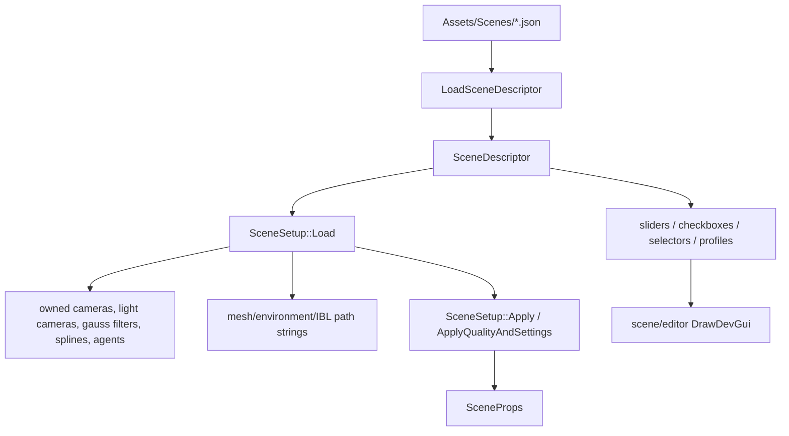
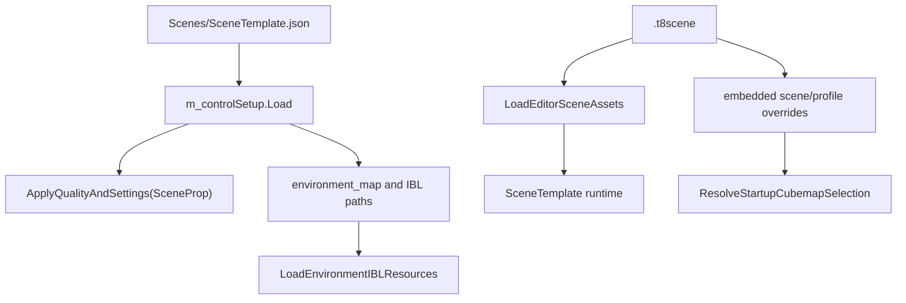

# SceneSetup and Runtime Control Descriptors

Status: Stage 18 draft.

This document is the deeper appendix for T850's legacy/runtime `SceneDescriptor` and `SceneSetup` path. It explains the exact mapping from descriptor JSON into `SceneProps`, how runtime UI metadata is consumed, how cameras/lights/splines/environment fields are built, how SceneTemplate combines `.t8scene` content with descriptor-driven controls, and where older scene variants still depend on this path.

Related documents:

- [Scene format and runtime](scene-format-and-runtime.md)
- [Main architecture](../architecture/main-architecture.md)
- [Resource locator and cache paths](../architecture/resource-locator.md)
- [Input, camera, and controls](../input/camera-and-controls.md)
- [FrameworkImGui runtime UI](../editor/imgui-system.md)
- [Textures, samplers, and IBL](../rendering/textures-and-ibl.md)
- [Render graph](../rendering/render-graph.md)
- [Editor overview](../editor/editor-overview.md)

## Purpose and responsibilities

`SceneDescriptor` is the older runtime JSON descriptor format used for render controls and scene setup defaults. It does not replace `.t8scene`; instead, it supplies runtime/editor control metadata, quality settings, cameras/lights/splines, environment paths, and profile overrides that several scenes still use.

`SceneSetup` is the loader/applier for that descriptor:

## Key files and examples

| File | Role |
|---|---|
| `Framework/include/scene/SceneDescriptor.h` | JSON-serializable descriptor structs. |
| `Framework/src/scene/SceneDescriptor.cpp` | Glaze read/write through `ResourceLocator::ReadText` and `WriteText`. |
| `Framework/include/scene/SceneSetup.h` | `SceneSetup` owned runtime objects, descriptor copy, and environment path strings. |
| `Framework/src/scene/SceneSetup.cpp` | Descriptor load, object construction, `SceneProps` mapping, and `SaveState`. |
| `Assets/Scenes/DayScene.json` | Descriptor for the older DayScene runtime. |
| `Assets/Scenes/SceneTemplate.json` | Control descriptor used by SceneTemplate. |
| `Assets/Scenes/Quake3Mock.json` | Control descriptor used by Quake3Mock and T8ditor rendering panel defaults. |
| `Assets/Scenes/SandboxScene.json` | Control descriptor used by SandboxScene. |
| `Assets/Scenes/RagdollEditor.json` | Control descriptor used by RagdollEditor and hosted mesh/ragdoll editing views. |

## Descriptor families and ownership

`SceneDescriptor` contains:

| Field group | Struct(s) | Meaning |
|---|---|---|
| cameras | `CameraDesc` | Runtime camera definitions. |
| light cameras | `CameraDesc` | Shadow/God Rays/light camera definitions. |
| lights | `LightDesc` | Directional and point light definitions. |
| filters | `GaussFilterDesc` | Blur kernels for shadow, bloom, DOF, or scene-specific effects. |
| splines | `SplineDesc`, `SplinePointDesc` | Camera/agent path splines and runtime agent defaults. |
| meshes | `std::vector<std::string>` | Model paths; copied by `SceneSetup` but instantiated by scene code. |
| environment | string fields | Sky cubemap and optional explicit IBL resource paths. |
| quality | `QualityDesc` | Render-quality settings copied into `SceneProps`. |
| settings | `SceneSettingsDesc` | Runtime render/lighting/material toggles copied into `SceneProps`. |
| controls | `SliderDesc`, `CheckboxDesc`, `SelectorDesc` | Runtime UI metadata consumed by scene/editor panels. |
| profiles | `SandboxProfileDesc` | Platform/model/GPU-specific override sets. |

`SceneSetup` owns vectors of constructed cameras, light cameras, Gauss filters, splines, and spline agents. `SceneProps` stores pointers into those vectors after `SceneSetup::Apply()`, so `SceneSetup` is intentionally non-copyable.

## Load flow

`SceneSetup::Load(jsonPath)`:

1. Resets `descriptor`, path strings, and owned vectors.
2. Calls `LoadSceneDescriptor(jsonPath, descriptor)`.
3. Copies descriptor name, mesh paths, and environment path fields into `SceneSetup`.
4. Builds owned cameras.
5. Builds owned light cameras.
6. Builds owned Gauss filters and calls `GaussFilter::Update()`.
7. Builds owned splines and spline agents.
8. Logs object counts.

`LoadSceneDescriptor()` uses `ResourceLocator::ReadText()` and Glaze with `error_on_unknown_keys = false`. Unknown JSON keys are ignored.

## Built object mapping

### Cameras and light cameras

For each `CameraDesc` in `cameras` and `light_cameras`:

| Descriptor field | Runtime mapping |
|---|---|
| `position` | Used as the camera position and assigned to `Camera::Eye`. |
| `eye` | Serialized, but `SceneSetup::Load()` currently ignores it and uses `position`. |
| `ortho` | Chooses `Camera::InitOrtho` vs `Camera::InitPerspective`. |
| `width`, `height` | Orthographic dimensions when `ortho` is true. |
| `fov`, `aspect` | Perspective projection values when `ortho` is false. |
| `near_plane`, `far_plane` | Projection near/far planes. |
| `left_handed` | Passed into camera initialization. |
| `speed` | Assigned to `Camera::Speed`. |
| `pitch`, `roll`, `yaw` | Assigned after initialization, then `Update(0.0f)` runs. |

`SceneSetup::Apply()` adds all built cameras with `SceneProps::AddCamera()` and all light cameras with `SceneProps::AddLightCamera()`.

### Lights

For each `LightDesc`:

| Descriptor field | Runtime mapping |
|---|---|
| `type == "directional"` | Calls `SceneProps::AddDirectionalLight(direction, color, intensity, enabled)`. |
| any other `type` | Calls `SceneProps::AddLight(position, color, radius, intensity, LIGHT_POINT, enabled)`. |
| `position` | Used for point lights. |
| `direction` | Used for directional lights. |
| `color` | Used for both directional and point lights. |
| `radius` | Used for point lights. |
| `intensity` | Used for both. |
| `enabled` | Used for both. |

Directional light `position` and `radius` are currently ignored by `SceneSetup::Apply()`.

### Gauss filters

For each `GaussFilterDesc`:

| Descriptor field | Runtime mapping |
|---|---|
| `kernel_size` | `GaussFilter::kernelSize` |
| `radius` | `GaussFilter::radius` |
| `sigma` | `GaussFilter::sigma` |

After assignment, `GaussFilter::Update()` is called. `SceneSetup::Apply()` adds the built filters to `SceneProps` through `AddGaussKernel()`.

### Splines and agents

For each `SplineDesc`:

| Descriptor field | Runtime mapping |
|---|---|
| `points[].position` | Appended as `SplinePoint(x, y, z)`. |
| `points[].velocity` | Stored on the appended spline point. |
| `looped` | `Spline::m_looped`. |
| `agent_offset` | Passed to `SplineAgent::SetOffset()`. |
| `agent_velocity` | Assigned to `SplineAgent::m_velocity`. |
| `attached_camera` | Stored in descriptor only; scene code consumes it where needed. |

`SceneSetup::Load()` calls `Spline::Init()`, assigns each agent's `m_pSpline`, sets `m_moving = true`, and stores agent velocity.

### Environment fields

`SceneSetup::Load()` copies these strings:

| Descriptor field | SceneSetup field | Typical consumer |
|---|---|---|
| `environment_map` | `environmentMap` | Runtime/editor cubemap load path. |
| `environment_diffuse_ibl` | `environmentDiffuseIBL` | Explicit diffuse IBL path. |
| `environment_specular_ibl` | `environmentSpecularIBL` | Explicit specular IBL path. |
| `environment_brdf_lut` | `environmentBrdfLUT` | Explicit GGX BRDF LUT path. |
| `environment_sheen_ibl` | `environmentSheenIBL` | Explicit Charlie/sheen IBL path. |
| `environment_charlie_lut` | `environmentCharlieLUT` | Explicit Charlie LUT path. |
| `environment_sheen_e_lut` | `environmentSheenELUT` | Explicit sheen E LUT path. |

The actual texture creation happens in scene code through `BaseDriver::CreateTexture()` and `LoadEnvironmentIBLResources()`, not inside `SceneSetup`.

## Exact `quality` to `SceneProps` mapping

`SceneSetup::ApplyQualityAndSettings()` copies `QualityDesc` fields into `SceneProps`:

| `QualityDesc` field | `SceneProps` field / behavior |
|---|---|
| `shadow_map_resolution` | `ShadowMapResolution` |
| `god_rays_resolution` | `GoodRaysResolution` |
| `pcf_scale` | `PCFScale` |
| `pcf_samples` | `PCFSamples` |
| `parallax_low_samples` | `ParallaxLowSamples` |
| `parallax_high_samples` | `ParallaxHighSamples` |
| `parallax_height` | `ParallaxHeight` |
| `light_volume_steps` | `LightVolumeSteps` |
| `ssao_radius` | `SSAOKernel.Radius`, then `SSAOKernel.Update()` |
| `ssao_kernel_size` | `SSAOKernel.KernelSize`, then `SSAOKernel.Update()` |
| `dof_near_samples` | `DOF_Near_Samples_squared` |
| `dof_far_samples` | `DOF_Far_Samples_squared` |

`GoodRaysResolution` is the current field name in `SceneProps` even though descriptor JSON names the concept `god_rays_resolution`.

## Exact `settings` to `SceneProps` mapping

`SceneSettingsDesc` fields map as follows:

| `SceneSettingsDesc` field | `SceneProps` field / behavior |
|---|---|
| `exposure` | `Exposure` |
| `bloom_factor` | `BloomFactor` |
| `bloom_threshold` | `BloomThreshold` |
| `tone_map_white_level` | `ToneMapWhiteLevel` |
| `luminance_tau` | `LuminanceTau` |
| `luminance_mode` | `LuminanceMode` |
| `aperture` | `Aperture` |
| `focal_length` | `FocalLength` |
| `max_coc` | `MaxCoc` |
| `ambient_color` | `AmbientColor` |
| `active_lights` | `ActiveLights` |
| `shadow_enabled` | `ToogleShadow` |
| `ssao_enabled` | `ToogleSSAO` |
| `dof_enabled` | `ToogleDOF` |
| `parallax_enabled` | `ToogleParallax` |
| `godrays_enabled` | `ToogleGodRays` |
| `debug_mode` | `DebugMode` |
| `auto_focus` | `AutoFocus` |
| `shadow_bias` | `ShadowBias` |
| `shadow_min` | `ShadowMin` |
| `env_factor` | `EnvFactor` |
| `ibl_factor` | `IBLFactor` |
| `godrays_factor` | `GodRaysFactor` |
| `light_radius_scale` | `LightRadiusScale` |
| `light_intensity_scale` | `LightIntensityScale` |
| `material_emissive_intensity` | `MaterialEmissiveIntensity` |
| `material_transmission_multiplier` | `MaterialTransmissionMultiplier` |
| `material_refraction_strength` | `MaterialRefractionStrength` |
| `lightmap_intensity` | `LightmapIntensity` |
| `point_lights_enabled` | `PointLightsEnabled` when present; otherwise defaults to true. |

After applying descriptor settings, `ActiveGaussKernel` is reset to `0`.

## UI control metadata

Descriptor UI metadata defines how runtime/editor panels should present controls; it does not automatically bind controls by itself.

| Metadata struct | Fields | Meaning |
|---|---|---|
| `SliderDesc` | `name`, `label`, `min_val`, `max_val`, `step`, `default_val` | Slider presentation metadata. |
| `CheckboxDesc` | `name`, `label`, `default_val`, `enabled` | Checkbox presentation metadata. |
| `SelectorDesc` | `name`, `label`, `options`, `default_index` | Combo/selector presentation metadata. |

Panel code consumes these arrays by name:

1. Iterate descriptor metadata.
2. Find the name in a scene-specific mapping table.
3. Read the current runtime value from `SceneProps` or scene-local state.
4. Draw through `DevGuiContext::Slider`, `Checkbox`, or `Combo`.
5. Write changed values back to `SceneProps`, render graph pass state, camera state, animation state, or scene-local flags.

Unknown `name` values are ignored by those mapping loops.

`default_val` and `default_index` are UI/default metadata. The actual runtime initial values come from `quality`, `settings`, scene startup state, profile overrides, or explicit scene code.

## Common runtime control names

The active scenes use overlapping, name-based mappings. Common slider names include:

| Name | Typical target |
|---|---|
| `exposure` | `SceneProps::Exposure` |
| `bloom_factor` | `SceneProps::BloomFactor` |
| `bloom_threshold` | `SceneProps::BloomThreshold` |
| `tm_white_level` | `SceneProps::ToneMapWhiteLevel` |
| `tm_adapt_tau` | `SceneProps::LuminanceTau` |
| `pcf_radius` | `SceneProps::PCFScale` |
| `pcf_samples` | `SceneProps::PCFSamples` |
| `ssao_kernel_size` | `SceneProps::SSAOKernel.KernelSize` + `Update()` |
| `ssao_radius` | `SceneProps::SSAOKernel.Radius` |
| `dof_aperture` | `SceneProps::Aperture` |
| `dof_focal_length` | `SceneProps::FocalLength` |
| `dof_max_coc` | `SceneProps::MaxCoc` |
| `dof_far_samples` | `SceneProps::DOF_Far_Samples_squared` |
| `dof_near_samples` | `SceneProps::DOF_Near_Samples_squared` |
| `gauss_kernel_radius` | Active `GaussFilter::radius` + `Update()` |
| `gauss_kernel_deviation` | Active `GaussFilter::sigma` + `Update()` |
| `fov` | Active camera FOV |
| `shadow_bias` | `SceneProps::ShadowBias` |
| `shadow_min` | `SceneProps::ShadowMin` |
| `env_factor` | `SceneProps::EnvFactor` |
| `ibl_factor` | `SceneProps::IBLFactor` |
| `lightmap_intensity` | `SceneProps::LightmapIntensity` |
| `material_emissive_intensity` | `SceneProps::MaterialEmissiveIntensity` |
| `material_transmission_multiplier` | `SceneProps::MaterialTransmissionMultiplier` |
| `material_refraction_strength` | `SceneProps::MaterialRefractionStrength` |

SceneTemplate/Quake3Mock/Sandbox/RagdollEditor also expose scene-specific names such as `anim_speed`; DayScene exposes extra parallax shadow controls.

Common checkbox names:

| Name | Typical target |
|---|---|
| `shadow_toggle` | `SceneProps::ToogleShadow` |
| `ssao_toggle` | `SceneProps::ToogleSSAO` |
| `dof_toggle` | `SceneProps::ToogleDOF` plus DOF render graph pass enablement in DayScene |
| `dof_auto_focus` | `SceneProps::AutoFocus` |
| `parallax_toggle` | `SceneProps::ToogleParallax` plus mesh parallax state in DayScene |
| `parallax_shadow_toggle` | `SceneProps::ToogleParallaxShadow` / shadow strength |
| `godrays_toggle` | `SceneProps::ToogleGodRays` |
| `point_lights_enabled` | `SceneProps::PointLightsEnabled` |
| `show_wireframe`, `show_skeleton`, `show_physics`, `show_navmesh`, `show_light_volumes` | Scene-local debug flags. |
| `debug_luminance` | `SceneProps::DebugLuminanceEnabled`. |

Common selector names:

| Name | Typical target |
|---|---|
| `cubemap` | Current cubemap selector and pending cubemap path. |
| `debug_render_target` | Debug RT selection. |
| `gauss_kernel_sample_count` | Active `GaussFilter::kernelSize` + `Update()`. |
| `active_gauss_kernel` | Active gauss kernel index. |
| `luminance_mode` | `SceneProps::LuminanceMode`. |
| `num_lights` | `SceneProps::ActiveLights` in DayScene. |
| `active_camera` | Active camera selection in DayScene. |
| `anim_select`, `anim_mode` | Current skinned animation set/mode in SceneTemplate-like scenes. |

## Profiles

`SandboxProfileDesc` is the descriptor's override format for runtime-specific state:

| Field | Meaning |
|---|---|
| `name` | Profile label. |
| `platform`, `architecture`, `gpu_family`, `gpu_name_contains`, `model` | Matching filters used by runtime profile selection code. |
| `sliders` | `FloatOverrideDesc` name/value overrides. |
| `checkboxes` | `BoolOverrideDesc` name/value overrides. |
| `selectors` | `IntOverrideDesc` name/value overrides. |
| `lights` | Per-light transform/color/intensity/attachment overrides. |
| `animations` | Per-animation override state. |
| `cubemap_path` | Explicit environment map override. |
| `camera`, `orbit_camera` | Camera/profile pose override state. |
| `frustum_culling`, `show_culling_debug`, `current_keyframe` | Runtime debug/animation state. |

Profiles use the same `name` strings as slider/checkbox/selector metadata. Scene code computes sparse profile diffs by comparing current state to a baseline profile state, then stores only changed overrides.

## SceneTemplate and `.t8scene` composition

SceneTemplate combines two systems:

1. `.t8scene` / `EditorSceneFile` supplies authored world content: objects, physics, ragdolls, navigation, lights, cameras, splines, editor state, and scene-local profile data.
2. `SceneSetup` / `SceneDescriptor` supplies runtime render-control schema, quality defaults, environment defaults, selectors, and profile override machinery.

Startup flow:

The descriptor does not author the world objects for SceneTemplate; it provides the control/render baseline around the `.t8scene` world.

## Existing scene dependencies

| Scene/tool | Descriptor dependency |
|---|---|
| DayScene | Owns `m_sceneSetup`, applies full setup, uses descriptor sliders/checkboxes/selectors, and can call `SaveState("Scenes/DayScene.json")`. |
| SceneTemplate | Owns `m_controlSetup`, applies quality/settings, uses descriptor environment/IBL and UI metadata, then combines with `.t8scene` content. |
| Quake3Mock | Owns `m_controlSetup`, loads `Scenes/Quake3Mock.json`, uses the same control/profile pattern as SceneTemplate. |
| SandboxScene | Owns `m_controlSetup`, loads `Scenes/SandboxScene.json`, uses the same control/profile pattern as Quake3Mock. |
| RagdollEditor | Owns `m_controlSetup`, loads `Scenes/RagdollEditor.json`, uses descriptor controls in runtime/hosted editor contexts. |
| T8ditor | Uses `m_editorSceneSetup` and often loads `Scenes/Quake3Mock.json` for the editor rendering panel control metadata and defaults. Mesh Edit has its own `m_meshEditorSceneSetup`. |

## SaveState behavior

`SceneSetup::SaveState(scene, jsonPath)` writes runtime state back into the already-loaded descriptor and then calls `SaveSceneDescriptor()`.

It saves:

- camera and light camera transforms/projection parameters,
- light position/direction/color/radius/intensity/enabled/type,
- Gauss filter kernel/radius/sigma,
- `quality` fields listed above,
- `settings` fields listed above,
- optional `point_lights_enabled` only when it differs from the default true value.

It does not save:

- `meshPaths`,
- environment path strings,
- slider/checkbox/selector metadata,
- profiles,
- splines or spline agents,
- `.t8scene` authored objects/physics/navigation/ragdolls,
- scene-local debug flags that are not mapped through `SceneProps`.

`SaveState()` is therefore a runtime descriptor state writer, not a full scene authoring save path.

## Extension rules

When adding a new descriptor field:

1. Add the field to `SceneDescriptor.h`.
2. Update `SceneSetup::Load()` if it becomes an owned object or copied path.
3. Update `ApplyQualityAndSettings()` if it maps into `SceneProps`.
4. Update `SaveState()` if runtime edits should persist back to descriptor JSON.
5. Update scene/editor `DrawDevGui()` mapping tables if the field is exposed through UI metadata.
6. Update this document and [scene-format-and-runtime.md](scene-format-and-runtime.md).

When adding a new UI control:

1. Add a slider/checkbox/selector metadata entry to the descriptor JSON.
2. Add name-to-setting mapping in every scene/tool that should respond to it.
3. Add get/set behavior for that setting.
4. Decide whether profiles should store sparse overrides for it.
5. Avoid relying on `default_val` alone for runtime initialization; set initial state in `quality`, `settings`, profile overrides, or scene code.

## Known limitations and gotchas

- Unknown descriptor JSON keys are ignored by Glaze, so typos can be silent.
- `CameraDesc::eye` is saved but currently ignored on load; `position` drives runtime `Camera::Eye`.
- UI metadata is not self-binding. Each scene must map control names manually.
- Descriptor profiles and `.t8scene` profiles overlap conceptually but are applied by scene-specific code.
- `SaveState()` is partial and does not write profiles or authored `.t8scene` content.
- `SceneSetup::Apply()` appends cameras/lights/kernels into `SceneProps`; callers should avoid applying repeatedly without resetting target state.

## Debugging checklist

1. If a JSON setting appears ignored, verify its key exists in `SceneDescriptor.h` and in the scene-specific mapping table.
2. If a UI slider appears but does nothing, check the `desc.name` mapping and get/set lambdas in the scene's `DrawDevGui()`.
3. If startup render quality is wrong, check `SceneSetup::ApplyQualityAndSettings()` before profile overrides.
4. If cubemap/IBL selection is wrong, check `environment_map`, profile `cubemap_path`, selector `cubemap`, and the scene's cubemap resolution helper.
5. If a saved descriptor does not include a field, check whether `SaveState()` writes that field.
6. If SceneTemplate differs from T8ditor Play Scene, check both the `.t8scene` export and the `Scenes/SceneTemplate.json` control descriptor.

