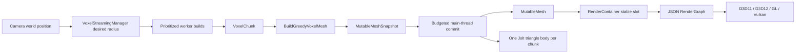

# Mutable Voxel Terrain and Streaming

Status: implemented and verified against source, 43 self-tests, and four-backend captures on 2026-08-31.

This subsystem provides backend-neutral mutable geometry, voxel chunks, atlas-aware greedy meshing, bounded asynchronous streaming, voxel selection/player collision, per-chunk Jolt collision, and sparse persistent edits. `VoxelScene` is the executable reference integration.

## Key Files

| Area | Files |
|---|---|
| mutable CPU data | `Framework/include/scene/MutableMeshData.h`, `src/scene/MutableMeshData.cpp` |
| mutable GPU primitive | `Framework/include/scene/MutableMesh.h`, `src/scene/MutableMesh.cpp` |
| stable render instances | `Framework/include/scene/RenderContainer.h`, `src/scene/RenderContainer.cpp` |
| block definitions | `Framework/include/terrain/BlockRegistry.h`, `src/terrain/BlockRegistry.cpp` |
| chunk storage | `Framework/include/terrain/VoxelChunk.h`, `src/terrain/VoxelChunk.cpp` |
| world coordinates and DDA | `Framework/include/terrain/VoxelWorld.h`, `src/terrain/VoxelWorld.cpp` |
| greedy meshing | `Framework/include/terrain/VoxelMesher.h`, `src/terrain/VoxelMesher.cpp` |
| streaming scheduler | `Framework/include/terrain/VoxelStreaming.h`, `src/terrain/VoxelStreaming.cpp` |
| persisted edits | `Framework/include/terrain/VoxelPersistence.h`, `src/terrain/VoxelPersistence.cpp` |
| voxel navigation | `Framework/include/terrain/VoxelNavigation.h`, `src/terrain/VoxelNavigation.cpp` |
| exact voxel box collision | `Framework/include/terrain/VoxelCollision.h`, `src/terrain/VoxelCollision.cpp` |
| general atlas asset | `Framework/include/video/TextureAtlas.h`, `src/video/TextureAtlas.cpp` |
| reference runtime | `DayScene/VoxelScene.h`, `DayScene/VoxelScene.cpp` |
| authored block-world runtime | `DayScene/MinecraftScene.h`, `DayScene/MinecraftScene.cpp`, `Assets/Scenes/Minecraft.t8scene` |
| crash handling | `Framework/include/debug/CrashDiagnostics.h`, `src/debug/CrashDiagnostics.cpp` |

Every Framework source is registered in MSBuild, filters, and CMake.

## Runtime Flow



Worker jobs never create GPU resources, mutate `VoxelWorld`, or retain render objects. They produce owned `VoxelChunkBuildResult` values. The main thread accepts only results whose key and epoch are still desired.

## Block Registry

`BlockId` is `uint16_t`; ID 0 is always air. Register blocks before starting worker jobs. `BlockDefinition` currently contains:

- name;
- base color;
- opaque, mask, or blend mode;
- metallic/roughness/cutoff;
- base-color atlas rectangle and texture-use flag;
- renderable, occluding, collidable, and double-sided flags.

Registration order defines runtime IDs, so changing it can invalidate an existing delta file. A future named block-palette migration is required before block packs become user-modifiable.

## Chunk and World Coordinates

Default dimensions are 16x64x16 in the generic type; `VoxelScene` uses 16x16x16 chunks. `VoxelWorld` uses floor division/modulo, so negative world coordinates map correctly:

```text
world -1 with chunk size 16 -> chunk -1, local 15
```

`VoxelWorld` owns only loaded chunks. Missing chunks read as air. `AdoptChunk()` accepts worker-generated chunks only when dimensions match the world.

`VoxelWorld::Raycast()` implements normalized 3D DDA and reports:

- hit block coordinates;
- previous cell for placement;
- block ID;
- ray distance.

## Greedy Meshing

`BuildGreedyVoxelMesh()` merges coplanar faces with identical block/material and orientation. It emits one material section per represented block ID. Textured block faces remain unit quads so each face maps to its assigned atlas rectangle rather than stretching one tile across a merged surface.

The optional `NeighborBlockSampler` suppresses faces shared with adjacent loaded chunks. Streaming worker builds currently treat unavailable neighbors as air, avoiding holes at the active radius at the cost of hidden duplicate boundary faces. Synchronous edit remeshing samples loaded neighbors and removes shared faces.

A `MutableMeshSnapshot` contains:

- monotonically meaningful version;
- position/normal/UV vertices;
- 32-bit triangle indices;
- sections and materials;
- local AABB.

Validation rejects non-finite data, invalid bounds, non-triangle counts, bad section ranges, missing materials, and out-of-range indices.

## Mutable GPU Geometry

`MutableMesh::ReplaceSnapshot()` is render-thread-only. It validates first, creates replacement buffers, then retires the old buffers. Older versions cannot replace a committed newer snapshot.

It reuses existing mesh shader permutations for:

- forward;
- GBuffer;
- shadow map;
- radial depth;
- optional base-color texture.

The primitive performs AABB frustum culling and honors material alpha/double-sided state. Base-color textures use the established `DiffuseTex` binding. The generic VoxelScene creates a small generated atlas for its reference blocks. Minecraft loads `terrain.png` through the Framework `TextureAtlas`, receives a managed texture ID, validates every authored face tile, and acquires immutable material variants for atlas-bound mob/weapon materials.

Minecraft authors `atlas_tile_px: 16` and `atlas_pixelation_factor: 2`. Its water block maps all faces to the first blue water frame at grid tile `(13,12)`. The PNG tile itself is fully opaque; the block is authored as non-opaque for voxel face-neighbor behavior. This is a static visual tile; animated water frames, translucent water rendering, and fluid simulation are separate future features.

The canonical `terrain.png` mapping uses face order `+X, -X, +Y, -Y, +Z, -Z`:

| Block | Side | Top | Bottom |
|---|---|---|---|
| grass | `(3,0)` | `(1,0)` | `(2,0)` |
| dirt | `(2,0)` | `(2,0)` | `(2,0)` |
| stone | `(0,0)` | `(0,0)` | `(0,0)` |
| sand | `(2,1)` | `(2,1)` | `(2,1)` |
| water | `(13,12)` | `(13,12)` | `(13,12)` |
| log | `(4,1)` | `(5,1)` | `(5,1)` |
| leaves | `(4,3)` | `(4,3)` | `(4,3)` |
| planks | `(4,0)` | `(4,0)` | `(4,0)` |
| bedrock | `(1,1)` | `(1,1)` | `(1,1)` |
| cobblestone | `(0,1)` | `(0,1)` | `(0,1)` |
| gravel | `(3,1)` | `(3,1)` | `(3,1)` |
| coal ore | `(2,2)` | `(2,2)` | `(2,2)` |
| iron ore | `(1,2)` | `(1,2)` | `(1,2)` |
| gold ore | `(0,2)` | `(0,2)` | `(0,2)` |
| diamond ore | `(2,3)` | `(2,3)` | `(2,3)` |
| brick | `(7,0)` | `(7,0)` | `(7,0)` |
| glass | `(1,3)` | `(1,3)` | `(1,3)` |
| snow | `(2,4)` | `(2,4)` | `(2,4)` |
| stone bricks | `(6,3)` | `(6,3)` | `(6,3)` |

Cube UVs are face-aware rather than assigning one corner order to all six faces. On `+X/-X` and `+Z/-Z`, the top edge of an atlas tile always follows world `+Y`; `+Z/-Z` also map atlas U horizontally instead of rotating the image onto its side. Top and bottom faces retain their planar X/Z orientation. This keeps the grass side strip at the top of every wall and log bark vertical on every side while preserving grass/log top and bottom tiles.

`scripts/verify_minecraft_atlas.py` locks all 120 authored face assignments to this table and fingerprints the audited atlas. Run it whenever either the scene mapping or `terrain.png` changes.

### Backend Behavior

| Backend | Current mutable-buffer behavior |
|---|---|
| D3D11 | dynamic VB/IB, CPU write-discard replacement |
| OpenGL | dynamic buffers through `glBufferData`/`glBufferSubData` |
| D3D12 | exact-size upload-heap VB/IB; replaced buffers retire after every in-flight frame advances |
| Vulkan | host-visible VMA VB/IB; replaced buffers retire after every in-flight frame advances |

D3D12/Vulkan are correctness-first. A later optimization may use device-local buffers and copies recorded in frame command buffers, but must preserve the same `MutableMeshSnapshot` API and nonblocking retirement contract.

## Stable Lifetimes

Terrain work exposed two lifetime requirements now fixed in shared Framework code:

- `GameObjectRegistry` uses stable list nodes; component/controller raw owner pointers survive insertion and unrelated deletion.
- `PhysicsBodyHandle` includes a generation; destroyed slots are reused and stale handles cannot resolve replacement bodies.

`RenderContainer` uses `RenderInstanceHandle {index,generation}`. Removing a chunk invalidates its old handle; slots are reused without allowing stale removal. It builds a contiguous active scratch array only when executing the render graph.

## Streaming Scheduler

`VoxelStreamingSettings` controls:

| Setting | Reference value |
|---|---:|
| horizontal radius | 2 (5x5 chunks) |
| vertical radius | 0 |
| maximum in flight | 4 |
| launches per update | 4 |
| commits per update | 4 |
| unloads per update | 4 |

`VoxelStreamingManager`:

1. computes the desired key set around focus;
2. sorts missing keys by squared chunk distance;
3. submits only within launch/in-flight budgets;
4. exposes cooperative cancellation tokens;
5. increments per-key epochs when requests become stale;
6. rejects canceled/stale/failed results;
7. returns bounded completion and unload batches.

`Reset()` cancels and drains all futures. Call it before destroying data captured by the generator callback.

## Persistence

`VoxelDeltaStore` stores only authored differences from deterministic generation. It is mutex-protected because workers apply edits while the main thread can record them.

The binary `.t8vox` format contains:

- `T8VOXDL1` magic;
- schema version 1;
- record count with a 16-million safety limit;
- FNV-1a payload hash;
- sorted `(x,y,z,BlockId)` records.

`ResourceLocator::WriteBinaryAtomic()` writes a uniquely named temporary file, flushes it, then atomically replaces the destination. `VoxelScene` stores:

```text
<Voxel cache root>/VoxelWorlds/default/edits.t8vox
```

Regression mode ignores persisted edits to keep references deterministic.

## VoxelScene

Run Release from its output directory:

```powershell
.\DayScene.exe --api d3d12 --scene 5 --width 1280 --height 720
```

Controls:

| Input | Action |
|---|---|
| W/A/S/D | grounded FPS movement |
| mouse | look |
| Space | jump |
| Shift | sprint |
| left click | remove targeted block |
| right click | place grass in the previous DDA cell |

Minecraft exposes **Draw distance (chunks)** in the runtime ImGui Minecraft section. The value can be changed from 1 through 32 while the scene is running. The scene keeps a fixed-capacity 65x65 chunk ring so changing the active radius does not remap existing storage or mesh slots. A requested change waits for outstanding chunk jobs, hides chunks leaving the radius, generates only newly entering chunks, remeshes the new boundary, and increments the voxel revision so active paths are discarded immediately.

`--minecraftDrawDistance N` queues the same live transition after the authored world loads, which is useful for automated validation. Expansion is progressive and obeys `max_uploads_per_frame`; the panel shows `(streaming)` until completion, and the log reports `Draw distance ready: radius=N chunkMeshes=X expected=X`. With the current one-upload-per-frame Minecraft setting, a 6-to-32 transition can take tens of seconds before all 4,225 chunk meshes are visible.

Minecraft also exposes a discrete integer **Enemy count** from 0 through 8. Eight independent mesh/controller slots are created once; changing the slider resets and shows newly active slots or immediately hides and invalidates removed slots without allocating during the UI interaction. Spawn offsets and repath staggering are deterministic. `--minecraftEnemyCount N` applies the same live `SetMobCount` path after the authored count loads, so `--minecraftEnemyCount 0` and `8` validate real 1-to-0 and 1-to-8 transitions.

**Enemy speed** is a live floating-point control from 0.25 through 6.0 blocks per second. Changes update the shared mob settings and all eight active/reserved controllers immediately. `--minecraftEnemySpeed N` invokes the same `SetMobSpeed` path for deterministic validation.

Enemy body-part boxes use the same outward-wound `kFaces` table as terrain cubes. Their movement enforces the authored `player_avoidance_radius` (1.35 blocks in the shipped scene) with a small dead band and applies local separation between active enemies, preventing them from occupying the player or collapsing into one stack. Grounded models sweep their full collision footprint downward and derive visual feet from the exact support impact. `visual_ground_clearance` adds a 0.001-unit non-contact gap; airborne models retain the controller height. Controller feet, paths, and debug bounds are unchanged.

Minecraft commits mutable chunk buffers with metadata-only CPU retention: bounds, materials, sections, version, and vertex/index counts remain available, while uploaded CPU vertex/index arrays and backend system copies are released. Completed D3D12/Vulkan staging batches are also reclaimed during startup uploads instead of waiting for the first rendered frame. A Release D3D12 radius-32 frame-3 validation peaked at about 2.1 GB after these changes (down from about 9.4 GB before retention cleanup). The equivalent Steam Deck Vulkan run completed in 31.2 seconds with a 716.9 MB cgroup memory peak and no swap. Generating and meshing all 4,225 chunks still makes radius 32 a deliberately expensive setting.

The scene uses `CharacterCollisionWorld` swept AABBs against loaded collidable voxels for player traversal. It never creates one Jolt body per block. Instead, each active rendered chunk owns one static generated Jolt triangle body so arbitrary Jolt objects can collide with terrain. Stream commits and synchronous edit remeshes create a replacement body before swapping the generational handle; unload and teardown destroy it.

## Physics and Navigation

Implemented:

- voxel-grid player collision;
- voxel-native multi-level A* over loaded standable cells;
- agent-radius, height, support, headroom, and step-clearance validation;
- revision-invalidated mob paths with off-ring recovery and stuck detection;
- collision-authoritative mob movement through the shared kinematic controller;
- live 0-to-8 enemy population with player and enemy separation;
- exact swept-AABB mob collision against loaded voxels, with unloaded columns blocked;
- DDA block selection;
- one generated static Jolt triangle body per active chunk through `PhysicsTriangleMeshBodyDesc`;
- no-disk-cache, build-speed-oriented collision cooking for mutable chunks;
- reusable generational body slots.

Minecraft does not rebuild a global Recast mesh for gameplay. The optional developer overlay builds Recast geometry only while requested, includes every standable vertical span, and rejects async results whose center or voxel revision became stale. Generic mesh scenes continue to use Recast/Detour. Detour path queries reject partial polygon corridors instead of exposing them as successful paths.

Not implemented:

- asynchronous/off-thread chunk collision cooking or incremental collision updates;
- tiled Detour updates.

For many voxel NPCs, add chunk-region portals and hierarchical search over the existing standable-cell rules before considering tiled Detour. Physics remains authoritative over every planned segment.

## Diagnostics and Gates

The 43-test suite currently includes:

- stable gameplay owner pointers;
- stale physics-handle rejection and slot reuse;
- initialized generated-triangle Jolt body creation and destruction;
- mutable snapshot validation/bounds;
- stable render handles;
- chunk mutation;
- greedy merge and neighbor suppression;
- negative coordinates and DDA;
- asynchronous streaming budgets/unloads;
- atomic delta round trip.
- complete voxel path routing, solid barriers, one-block steps, and lift clearance;
- exact swept-box anti-tunneling and initial-contact normals;
- rectangular atlas bounds/half-texel UVs;
- immutable material texture variants.

Focused visual gate:

```powershell
.\scripts\CaptureVisualBaselines.ps1 `
  -RunSet candidate `
  -Cases voxel-streaming `
  -Apis d3d11,d3d12,gl,vulkan `
  -Width 1280 -Height 720 `
  -DumpSeconds 5 `
  -Force -ContinueOnError
```

Verified 2026-08-30: Minecraft frame 61 captured on D3D11, D3D12, Vulkan, and OpenGL with zero engine errors. The atlas redesign and graphics-backend polymorphism refactor preserve the accepted D3D12 output exactly across all 12 dumped targets; cross-API variance remains unchanged.

For native crashes use [CDB crash debugging](../../.github/skills/t850-crash-debugging/SKILL.md). Debug entry points suppress CRT assertion dialogs and break directly into CDB.

## Current Limits

- generic VoxelScene uses a generated atlas; Minecraft has a production file-backed grid atlas, but named region descriptors and mip-safe edge extrusion are not implemented;
- Minecraft has a static translucent blue water tile, but no fluid simulation/animation; sunlight propagation, emissive block lighting, voxel ambient occlusion, and a general transparent sorting policy are not implemented;
- no LOD, occlusion culling, indirect draw, or device-local streaming uploads;
- no inventory, crafting, drops, block scripts, or multiplayer;
- no T8ditor voxel authoring tools;
- no floating origin for extremely large coordinates;
- block IDs are registration-order IDs rather than a persisted named palette;
- edit remeshing currently rebuilds every loaded chunk synchronously;
- chunk triangle-body cooking and replacement currently run synchronously on the owning thread;
- Android/Steam Deck builds pass; runtime performance remains unverified on equipped devices.

These are follow-up features, not prerequisites for the current finite streamed block-world reference.

## Related Documents

- [Geometry rendering](../rendering/geometry-rendering-flow.md)
- [Render graph](../rendering/render-graph.md)
- [Camera and controls](../input/camera-and-controls.md)
- [Jolt physics](../physics/jolt-physics.md)
- [Resource locator](../architecture/resource-locator.md)
- [Visual regression](../debug/visual-regression.md)
- [Verification](../testing/verification.md)
