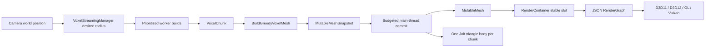

# Mutable Voxel Terrain and Streaming

Status: implemented and verified against source, tests, CDB runs, and four-backend captures on 2026-08-19.

This subsystem provides backend-neutral mutable geometry, voxel chunks, atlas-aware greedy meshing, bounded asynchronous streaming, voxel selection/player collision, per-chunk Jolt collision, and sparse persistent edits. `VoxelScene` is the executable reference integration.

## Key Files

| Area | Files |
|---|---|
| mutable CPU data | `Framework/include/scene/MutableMeshData.h`, `src/scene/MutableMeshData.cpp` |
| mutable GPU primitive | `Framework/include/scene/MutableMesh.h`, `src/scene/MutableMesh.cpp` |
| stable render instances | `Framework/include/scene/RenderContainer.h`, `src/scene/RenderContainer.cpp` |
| block definitions | `Framework/include/terrain/BlockRegistry.h`, `src/terrain/BlockRegistry.cpp` |
| chunk storage | `Framework/include/terrain/VoxelChunk.h`, `src/terrain/VoxelChunk.cpp` |
| world coordinates and DDA | `Framework/include/terrain/VoxelWorld.h`, `src/terrain/VoxelWorld.cpp` |
| greedy meshing | `Framework/include/terrain/VoxelMesher.h`, `src/terrain/VoxelMesher.cpp` |
| streaming scheduler | `Framework/include/terrain/VoxelStreaming.h`, `src/terrain/VoxelStreaming.cpp` |
| persisted edits | `Framework/include/terrain/VoxelPersistence.h`, `src/terrain/VoxelPersistence.cpp` |
| reference runtime | `DayScene/VoxelScene.h`, `DayScene/VoxelScene.cpp` |
| crash handling | `Framework/include/debug/CrashDiagnostics.h`, `src/debug/CrashDiagnostics.cpp` |

Every Framework source is registered in MSBuild, filters, and CMake.

## Runtime Flow



Worker jobs never create GPU resources, mutate `VoxelWorld`, or retain render objects. They produce owned `VoxelChunkBuildResult` values. The main thread accepts only results whose key and epoch are still desired.

## Block Registry

`BlockId` is `uint16_t`; ID 0 is always air. Register blocks before starting worker jobs. `BlockDefinition` currently contains:

- name;
- base color;
- opaque, mask, or blend mode;
- metallic/roughness/cutoff;
- base-color atlas rectangle and texture-use flag;
- renderable, occluding, collidable, and double-sided flags.

Registration order defines runtime IDs, so changing it can invalidate an existing delta file. A future named block-palette migration is required before block packs become user-modifiable.

## Chunk and World Coordinates

Default dimensions are 16x64x16 in the generic type; `VoxelScene` uses 16x16x16 chunks. `VoxelWorld` uses floor division/modulo, so negative world coordinates map correctly:

```text
world -1 with chunk size 16 -> chunk -1, local 15
```

`VoxelWorld` owns only loaded chunks. Missing chunks read as air. `AdoptChunk()` accepts worker-generated chunks only when dimensions match the world.

`VoxelWorld::Raycast()` implements normalized 3D DDA and reports:

- hit block coordinates;
- previous cell for placement;
- block ID;
- ray distance.

## Greedy Meshing

`BuildGreedyVoxelMesh()` merges coplanar faces with identical block/material and orientation. It emits one material section per represented block ID. Textured block faces remain unit quads so each face maps to its assigned atlas rectangle rather than stretching one tile across a merged surface.

The optional `NeighborBlockSampler` suppresses faces shared with adjacent loaded chunks. Streaming worker builds currently treat unavailable neighbors as air, avoiding holes at the active radius at the cost of hidden duplicate boundary faces. Synchronous edit remeshing samples loaded neighbors and removes shared faces.

A `MutableMeshSnapshot` contains:

- monotonically meaningful version;
- position/normal/UV vertices;
- 32-bit triangle indices;
- sections and materials;
- local AABB.

Validation rejects non-finite data, invalid bounds, non-triangle counts, bad section ranges, missing materials, and out-of-range indices.

## Mutable GPU Geometry

`MutableMesh::ReplaceSnapshot()` is render-thread-only. It validates first, creates replacement buffers, then retires the old buffers. Older versions cannot replace a committed newer snapshot.

It reuses existing mesh shader permutations for:

- forward;
- GBuffer;
- shadow map;
- radial depth;
- optional base-color texture.

The primitive performs AABB frustum culling and honors material alpha/double-sided state. Base-color textures use the established `DiffuseTex` binding. The reference scene creates one shared 6x2 RGBA atlas in memory, assigns one 2x2 nearest-filtered tile to stone, dirt, and grass, and binds it through `PrimitiveInst::SetTexture(0)`.

### Backend Behavior

| Backend | Current mutable-buffer behavior |
|---|---|
| D3D11 | dynamic VB/IB, CPU write-discard replacement |
| OpenGL | dynamic buffers through `glBufferData`/`glBufferSubData` |
| D3D12 | exact-size upload-heap VB/IB; replaced buffers retire after every in-flight frame advances |
| Vulkan | host-visible VMA VB/IB; replaced buffers retire after every in-flight frame advances |

D3D12/Vulkan are correctness-first. A later optimization may use device-local buffers and copies recorded in frame command buffers, but must preserve the same `MutableMeshSnapshot` API and nonblocking retirement contract.

## Stable Lifetimes

Terrain work exposed two lifetime requirements now fixed in shared Framework code:

- `GameObjectRegistry` uses stable list nodes; component/controller raw owner pointers survive insertion and unrelated deletion.
- `PhysicsBodyHandle` includes a generation; destroyed slots are reused and stale handles cannot resolve replacement bodies.

`RenderContainer` uses `RenderInstanceHandle {index,generation}`. Removing a chunk invalidates its old handle; slots are reused without allowing stale removal. It builds a contiguous active scratch array only when executing the render graph.

## Streaming Scheduler

`VoxelStreamingSettings` controls:

| Setting | Reference value |
|---|---:|
| horizontal radius | 2 (5x5 chunks) |
| vertical radius | 0 |
| maximum in flight | 4 |
| launches per update | 4 |
| commits per update | 4 |
| unloads per update | 4 |

`VoxelStreamingManager`:

1. computes the desired key set around focus;
2. sorts missing keys by squared chunk distance;
3. submits only within launch/in-flight budgets;
4. exposes cooperative cancellation tokens;
5. increments per-key epochs when requests become stale;
6. rejects canceled/stale/failed results;
7. returns bounded completion and unload batches.

`Reset()` cancels and drains all futures. Call it before destroying data captured by the generator callback.

## Persistence

`VoxelDeltaStore` stores only authored differences from deterministic generation. It is mutex-protected because workers apply edits while the main thread can record them.

The binary `.t8vox` format contains:

- `T8VOXDL1` magic;
- schema version 1;
- record count with a 16-million safety limit;
- FNV-1a payload hash;
- sorted `(x,y,z,BlockId)` records.

`ResourceLocator::WriteBinaryAtomic()` writes a uniquely named temporary file, flushes it, then atomically replaces the destination. `VoxelScene` stores:

```text
<Voxel cache root>/VoxelWorlds/default/edits.t8vox
```

Regression mode ignores persisted edits to keep references deterministic.

## VoxelScene

Run Release from its output directory:

```powershell
.\DayScene.exe --api d3d12 --scene 5 --width 1280 --height 720
```

Controls:

| Input | Action |
|---|---|
| W/A/S/D | grounded FPS movement |
| mouse | look |
| Space | jump |
| Shift | sprint |
| left click | remove targeted block |
| right click | place grass in the previous DDA cell |

The scene uses `CharacterCollisionWorld` swept AABBs against loaded collidable voxels for player traversal. It never creates one Jolt body per block. Instead, each active rendered chunk owns one static generated Jolt triangle body so arbitrary Jolt objects can collide with terrain. Stream commits and synchronous edit remeshes create a replacement body before swapping the generational handle; unload and teardown destroy it.

## Physics and Navigation

Implemented:

- voxel-grid player collision;
- DDA block selection;
- one generated static Jolt triangle body per active chunk through `PhysicsTriangleMeshBodyDesc`;
- no-disk-cache, build-speed-oriented collision cooking for mutable chunks;
- reusable generational body slots.

Not implemented:

- asynchronous/off-thread chunk collision cooking or incremental collision updates;
- voxel-aware NPC navigation;
- tiled Detour updates.

Do not rebuild the current whole-world Recast mesh after every block edit. Prefer grid/voxel navigation for block worlds or add a true tiled `INavigationMesh` implementation.

## Diagnostics and Gates

Self-tests currently include:

- stable gameplay owner pointers;
- stale physics-handle rejection and slot reuse;
- initialized generated-triangle Jolt body creation and destruction;
- mutable snapshot validation/bounds;
- stable render handles;
- chunk mutation;
- greedy merge and neighbor suppression;
- negative coordinates and DDA;
- asynchronous streaming budgets/unloads;
- atomic delta round trip.

Focused visual gate:

```powershell
.\scripts\CaptureVisualBaselines.ps1 `
  -RunSet candidate `
  -Cases voxel-streaming `
  -Apis d3d11,d3d12,gl,vulkan `
  -Width 1280 -Height 720 `
  -DumpSeconds 5 `
  -Force -ContinueOnError
```

Verified 2026-08-19: four captures, zero engine errors, zero invalid captures. D3D11/D3D12 backbuffers were byte-identical; Vulkan differed only slightly. A retained-target probe proved D3D11/OpenGL GBuffer albedo byte-identical and normals nearly identical. The darker OpenGL final image begins in deferred lighting, not mutable geometry or atlas sampling.

For native crashes use [CDB crash debugging](../../.github/skills/t850-crash-debugging/SKILL.md). Debug entry points suppress CRT assertion dialogs and break directly into CDB.

## Current Limits

- reference atlas is generated in memory; production atlas assets, named tile metadata, mip-safe padding, cutout foliage, and transparent reference blocks are not implemented;
- no sunlight propagation, emissive block lighting, ambient occlusion, water, or transparent sorting policy beyond material sections;
- no LOD, occlusion culling, indirect draw, or device-local streaming uploads;
- no inventory, crafting, drops, block scripts, or multiplayer;
- no T8ditor voxel authoring tools;
- no floating origin for extremely large coordinates;
- block IDs are registration-order IDs rather than a persisted named palette;
- edit remeshing currently rebuilds every loaded chunk synchronously;
- chunk triangle-body cooking and replacement currently run synchronously on the owning thread;
- Android and Steam Deck runtime performance remain unverified on equipped hardware.

These are follow-up features, not prerequisites for the current finite streamed block-world reference.

## Related Documents

- [Geometry rendering](../rendering/geometry-rendering-flow.md)
- [Render graph](../rendering/render-graph.md)
- [Camera and controls](../input/camera-and-controls.md)
- [Jolt physics](../physics/jolt-physics.md)
- [Resource locator](../architecture/resource-locator.md)
- [Visual regression](../debug/visual-regression.md)
- [Verification](../testing/verification.md)
