# 2. Create RTS Terrain

Status: illustrated from the working editor on 2026-09-07.

## Goal

Create a 64-by-64 terrain, prepare flat pads for structures, and save a map that
does not require a new C++ scene class. Read [grid and scale](01-grid-and-scale.md)
first if cell measurements are unfamiliar.

The screenshots use a terrain named `RTS Terrain`. New imports may have a different
name. Panel positions can vary with your saved layout; the labels and values are
the important checkpoints.

## Step 1: Open the Starter Scene

Choose **File > Load Scene** and open
[RtsBlockout.t8scene](../../T850/Assets/Scenes/RtsBlockout.t8scene). It supplies
camera, lighting, and render settings so you can concentrate on terrain.

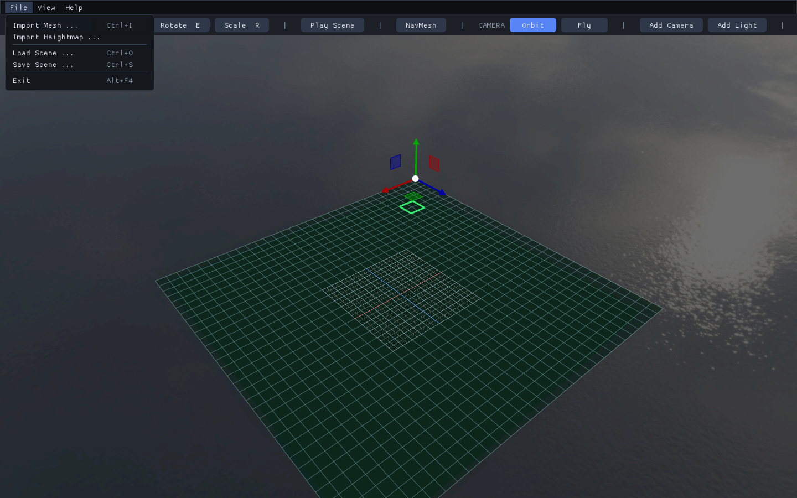

**Check:** Load Scene is in the File menu. Work in your own copy rather than
overwriting the starter scene.

## Step 2: Clear the Starter Geometry

In Hierarchy, select and delete the terrain's physics entity, then select and
delete the old terrain object. Keep the camera and lights. This is the starting
state for creating a new terrain rather than adding one on top of the old one.

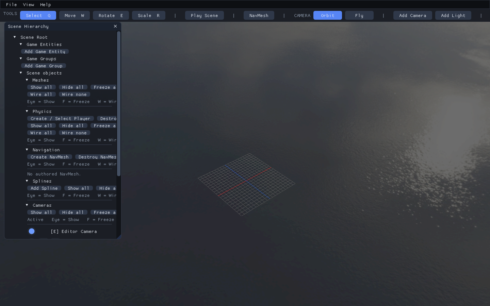

**Check:** the old terrain and its collision entity are absent; cameras and lights remain.

## Step 3: Configure a Flat Terrain

Choose **File > Import Heightmap**. Enable **Flat Terrain**, set Width `64`, Depth
`64`, Elevation Offset `0`, and Grid Samples `65, 65`. Choose the ground color,
then click **Import**. Elevation Scale does not affect a flat zero-valued source.

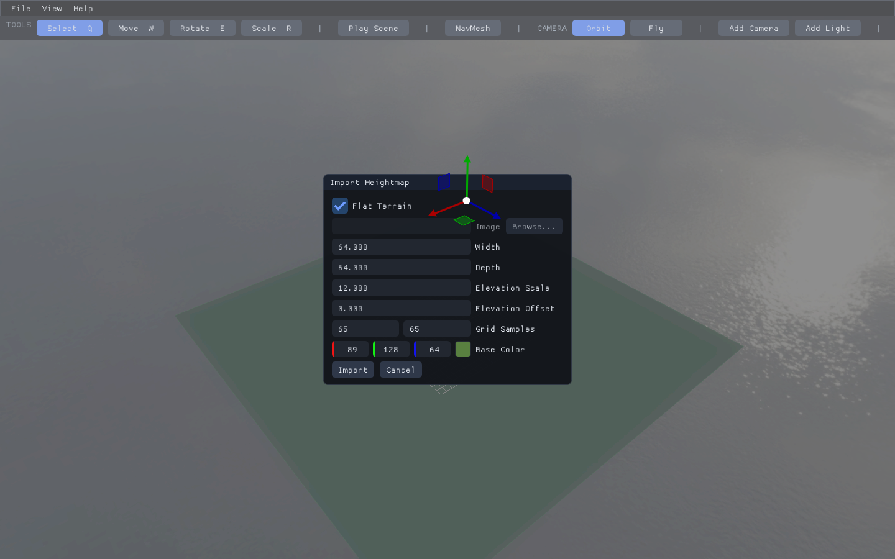

**Check:** Flat Terrain is checked and both dimensions and sample counts match.

## Step 4: Center the Terrain

Select the imported terrain. In Properties, set Position to `(-32, 0, -32)`,
Rotation to `(0,0,0)`, and Scale to `(1,1,1)`.

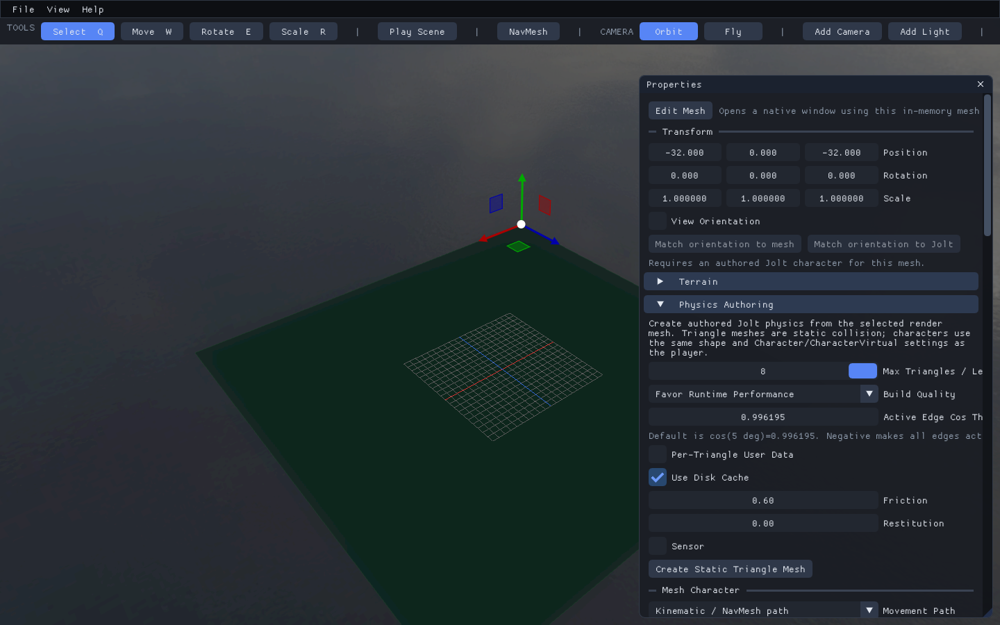

**Check:** use terrain dimensions to change size, not object scaling. Placement
terrain must remain unrotated at unit scale.

## Step 5: Open the Terrain Tools

Choose **View > Terrain Editor**. For the clean guide-line view used in these
lessons, turn off **Selection Wireframe** and leave **Wireframe Overlay** off.

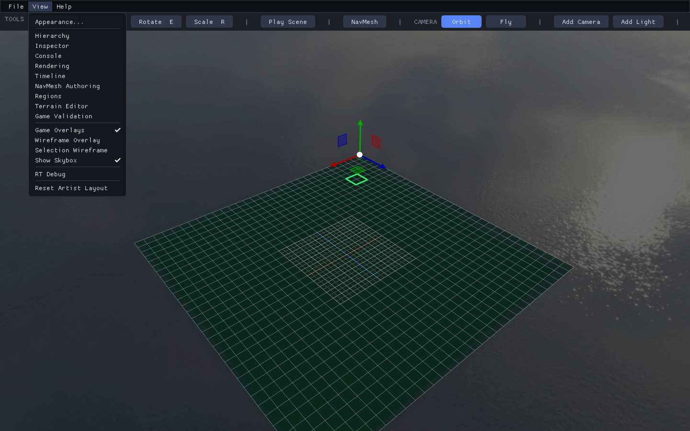

**Check:** these are visibility controls; they do not change geometry or collision.

## Step 6: Verify the Flat Result

Choose your terrain in **Terrain Object** and expand **Geometry and LOD**.
Confirm Width `64`, Depth `64`, and Grid `65 x 65`.

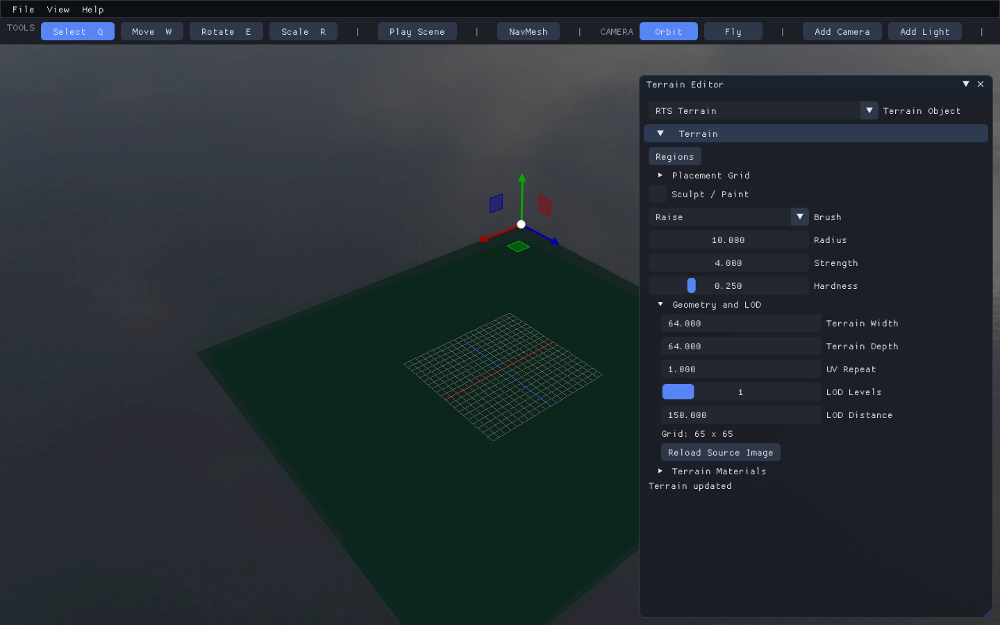

**Check:** the surface is flat. A placement grid will be enabled in the next lesson.

## Step 7: Optional Image-Based Import

Instead of Flat Terrain, choose an image in the import dialog. This example uses
`Textures/Terrain/HeightmapExample.bmp`, Width/Depth `64`, Scale `12`, Offset `-2`,
and Samples `65,65`. Native 16-bit PNG is also supported for your own heightmaps.

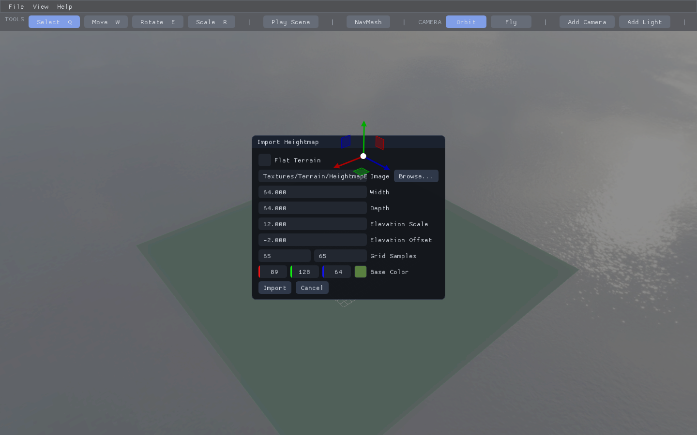

**Check:** Flat Terrain is unchecked. Height is `offset + normalized_pixel * scale`;
black maps to -2 and white to 10 with these values.

## Step 8: Verify the Image-Based Surface

After importing the image, inspect the elevated surface and its dimensions.

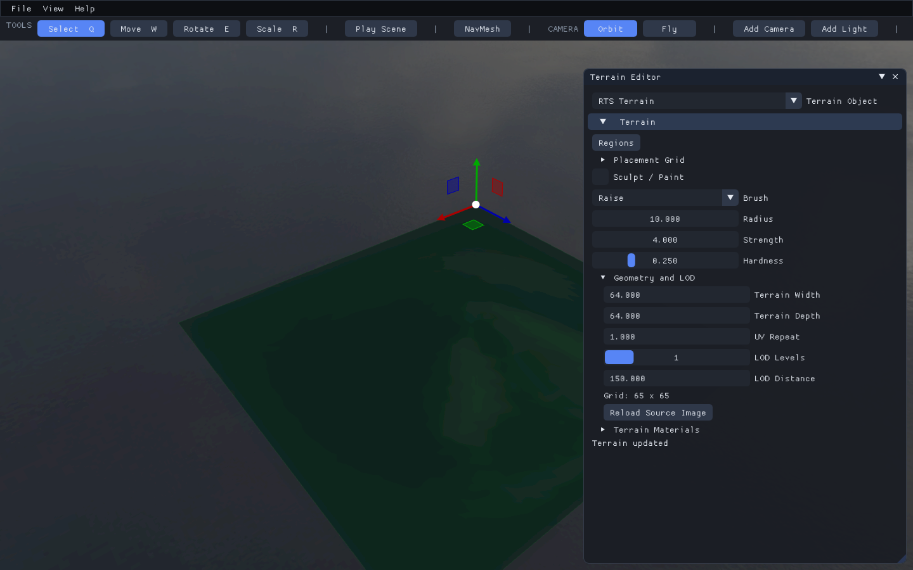

**Check:** elevation varies while terrain Width and Depth remain `64`. Terrain
sample spacing still does not define the building-cell size.

## Step 9: Raise a Hill

For a sculpting exercise on an empty flat terrain, enable **Sculpt / Paint**,
choose **Raise**, and use Radius `10`. Drag over the terrain to build up a hill.
Lower reverses the direction; Smooth reduces abrupt changes.

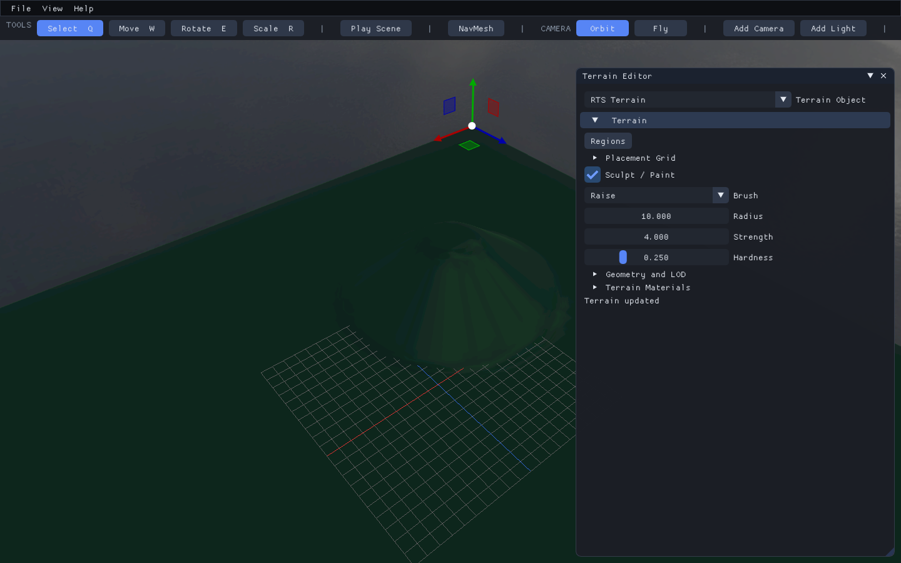

**Check:** the surface changes under the brush. Smooth alone does not guarantee
a flat building foundation.

## Step 10: Flatten a Building Pad

Choose **Flatten**, set Flatten Height `0`, Hardness `1`, Strength `10`, and
Radius `7` for this example. Paint a pad large enough for the footprint plus a
terrain-sample margin. The image shows a flattened center with higher terrain
remaining around it.

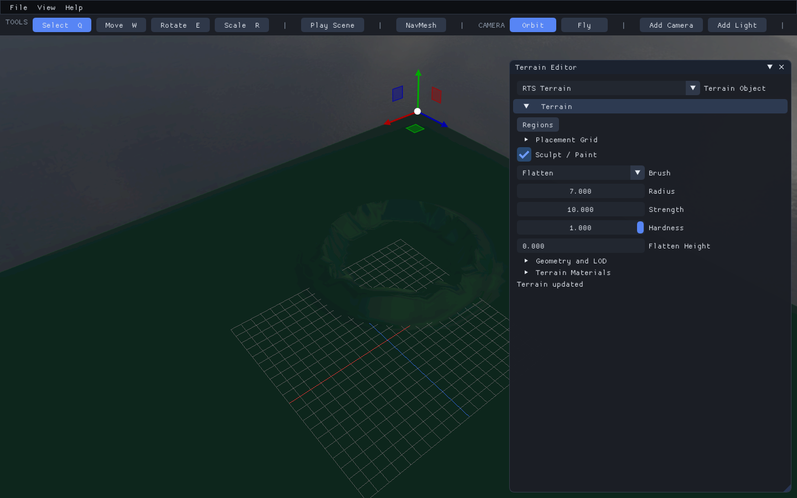

**Check:** flatten beyond the intended building outline. Boundary samples and
interior slopes can reject a site even when its center looks flat. Existing
buildings prevent edits that invalidate their foundations.

## Step 11: Paint a Material

Under **Terrain Materials**, add a second material named `Path`, choose a
contrasting color, select it, then use **Paint Material** on the terrain.

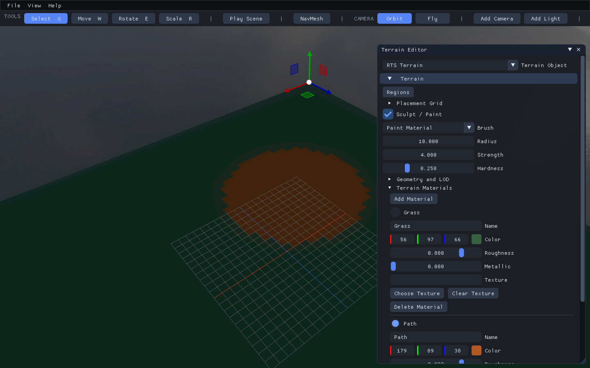

**Check:** the material changes but the terrain's elevation and placement rules do
not. A color does not automatically create water or another gameplay rule.

## Step 12: Save Your Map

Choose **File > Save Scene** and save to your own `.t8scene` filename. Geometry
edits and material assignments are scene data; referenced textures still need
to accompany the map.

**Check:** save a copy, not the original example. The final lesson checks reload and Play.

Next: [Place blockout buildings](03-place-buildings.md).