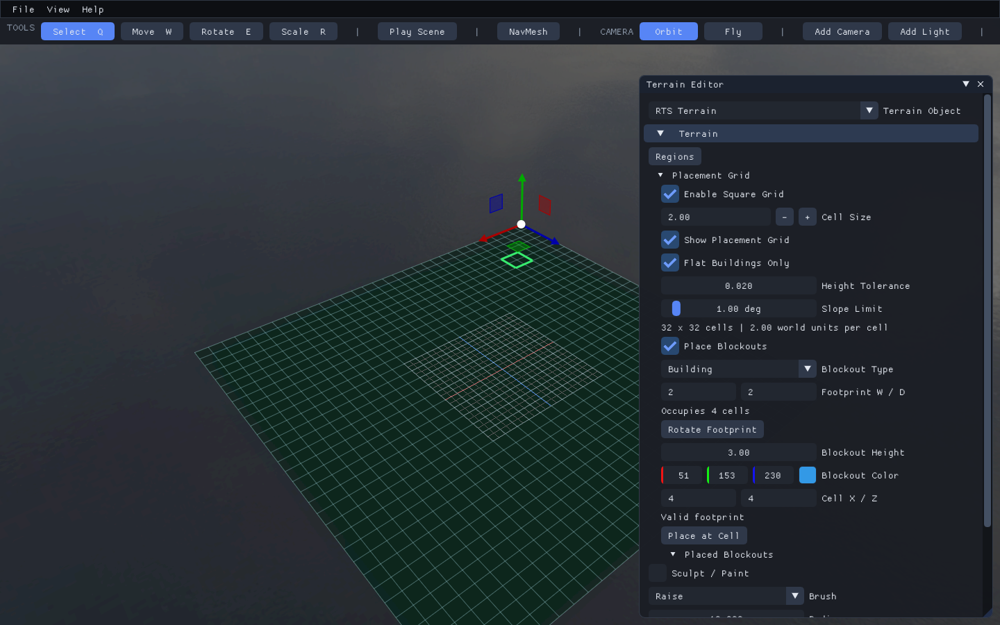
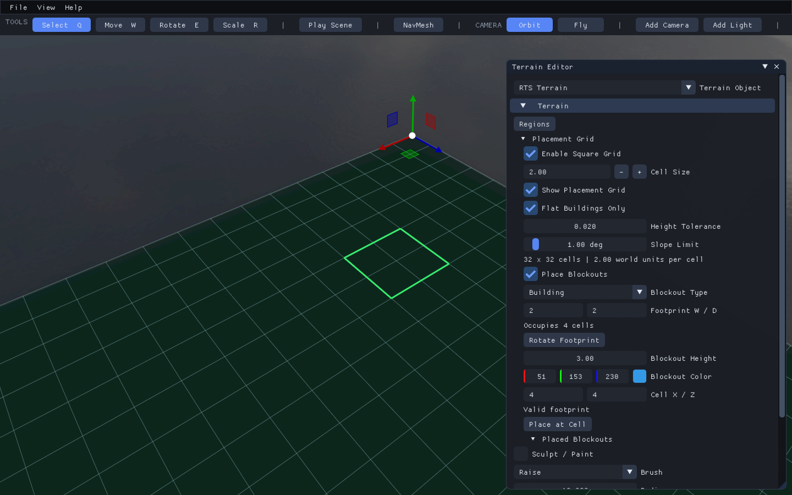
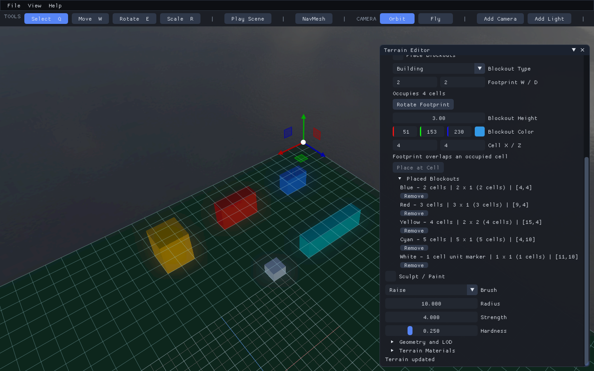
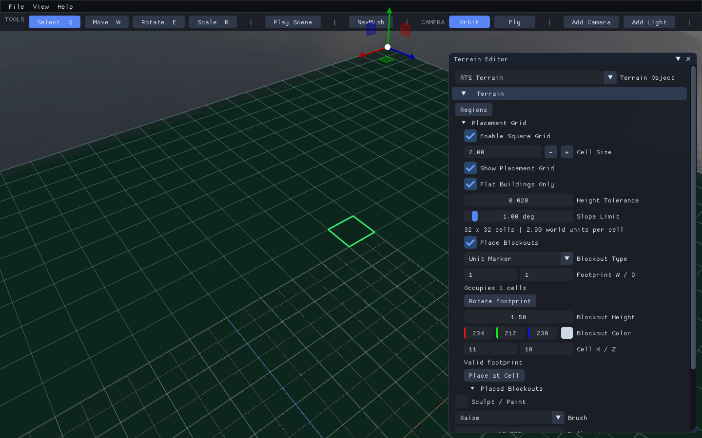
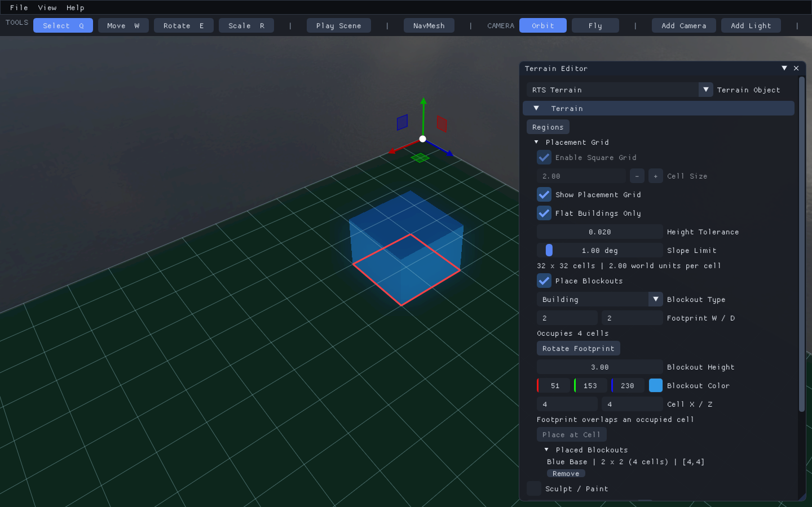
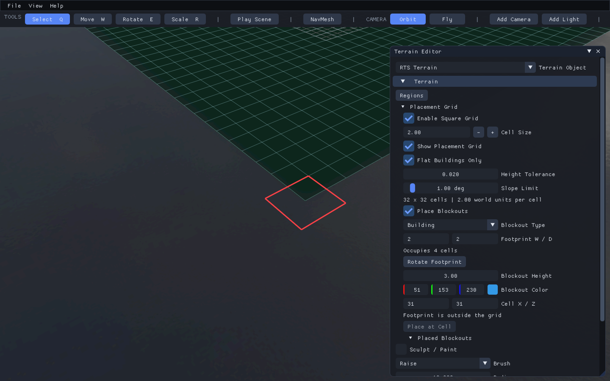
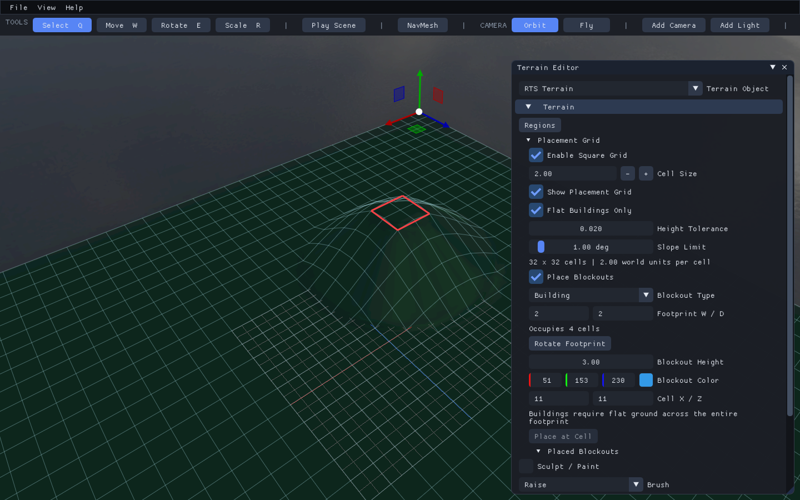
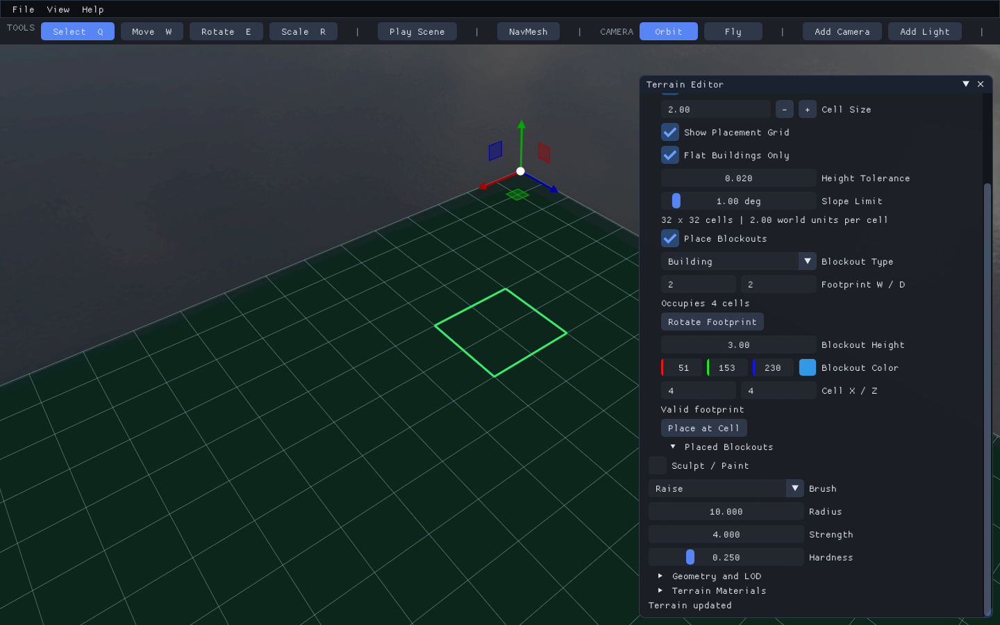

# 3. Place Blockout Buildings

Status: illustrated from the working editor on 2026-09-07.

## Goal

Measure buildings in square cells, place colored box placeholders, and verify
that slopes, map edges, and occupied footprints prevent invalid placement.
Complete [terrain creation](02-create-rts-terrain.md) first.

## Step 1: Generate the Placement Grid

In **Terrain Editor > Placement Grid**, enable **Enable Square Grid**, set Cell
Size `2`, and enable **Show Placement Grid**. Leave **Flat Buildings Only** enabled,
Height Tolerance `0.02`, and Slope Limit `1` degree.

**Check:** the panel reports `32 x 32 cells`. The tolerances account for numerical
noise; they are not intended to permit building on ramps.

The grid is generated from dimensions and cell size; no separate mesh import or
manual drawing is needed. Partial cells at the far edge are not placeable.
Cell size and grid enablement are locked while blockouts exist; remove them before
changing the measurement system. Large grids display coarser guide lines for
readability, but placement still uses the actual cell size.

## Step 2: Configure a Four-Cell Building

Choose Building, set **Footprint W / D** to `2,2`, Height `3`, and a blue color.
Enable **Place Blockouts** and hover over a flat pad. The pictured candidate uses
cell `(4,4)`.

**Check:** **Occupies 4 cells** and **Valid footprint** are visible. The cursor's
cell anchors the minimum X/Z corner, not the center.

## Step 3: Place the Building

Left-click the valid cell. Alternatively, turn off Place Blockouts, enter Cell X/Z
`4,4`, and click **Place at Cell**. Both paths use the same validation.

**Check:** the box exists and has a placement record. Its occupied location now
rejects another placement, so the same candidate can show an overlap message.

For exact layout, turn off Place Blockouts, enter **Cell X / Z**, and click
**Place at Cell**. Both paths use the same Framework validation and deferred commit.

Placement modifies the scene; merely hovering does not. GPU/collision resources
are updated at a safe frame boundary, not inside the button's draw call.

## Step 4: Build a Size Test Row

On a flat map with Cell Size `2`, try:

| Name/color suggestion | W / D | Cell X / Z | Occupied cells |
|---|---|---|---:|
| Blue building | 2 / 1 | 4 / 4 | 2 |
| Red building | 3 / 1 | 9 / 4 | 3 |
| Yellow building | 2 / 2 | 15 / 4 | 4 |
| Cyan building | 5 / 1 | 4 / 10 | 5 |
| White Unit Marker | 1 / 1 | 11 / 10 | 1 |

These coordinates are already populated in
[RtsBlockout.t8scene](../../T850/Assets/Scenes/RtsBlockout.t8scene). Remove the
corresponding examples before recreating them, or use free cells elsewhere.

**Check:** the long cyan box and square yellow box have different shapes and cell
counts, despite both being generated from the same placement system.

**Rotate Footprint** swaps width and depth. A 3-by-1 strip becomes 1-by-3 with the
same three-cell area. The placeholders are boxes because a multi-cell rectangular
building is not necessarily a mathematical cube.

## Step 5: Inspect the Recorded Footprints

Expand **Placed Blockouts** and scroll the panel to see each record's dimensions,
occupied-cell count, and minimum-cell coordinates.

**Check:** the `2 x 2` entry is four cells; the `5 x 1` entry is five cells.

## Step 6: Configure a One-Cell Unit Marker

Choose **Unit Marker**, Footprint `1,1`, Height `1.5`, and a light color. The
pictured candidate is at `(11,10)`.

**Check:** this is a static scale reference, not a moving actor.

## Step 7: Verify Occupied-Cell Rejection

Try another `2,2` building at the blue building's `(4,4)` cell.

**Check:** the red outline and overlap reason appear; Place at Cell is disabled.

## Step 8: Verify Map-Edge Rejection

Try a `2,2` building at `(31,31)` on the 32-by-32 grid.

**Check:** the footprint extends beyond the grid and is rejected.

## Step 9: Verify Flat-Ground Rejection

Try placing a building across raised ground with Flat Buildings Only still enabled.

**Check:** the entire foundation is checked, not just its center. Flatten the full
pad before retrying; placement itself does not level the terrain.

## Step 10: Remove a Blockout

Click **Remove** under the blockout's entry. The pictured result is an empty
placement list after removing the blue building.

**Check:** the cells are available again. Undo/redo restores both the box and its
occupancy record together.

The first implementation checks occupancy within one terrain's placement records.
It does not test arbitrary imported props, tagged regions, or other terrains.
Those are separate constraints to add through shared validation when needed.

## Units and Gameplay Boundaries

Unit Marker bypasses the building-flatness rule, but still needs an in-bounds,
unoccupied footprint. It is a static colored box used to measure scale. Like the
other blockouts, it participates in static collision when terrain collision is
authored, and its footprint is excluded from navigation.

It is not a moving unit, does not reserve cells while moving, and is not a complete
game entity. Production units should use movement controllers and navigation-agent
clearance; production buildings will eventually link footprint records to gameplay
entities and real model assets. No economy or combat rules are hardcoded here.

Next: [Test and iterate](04-test-and-iterate.md).