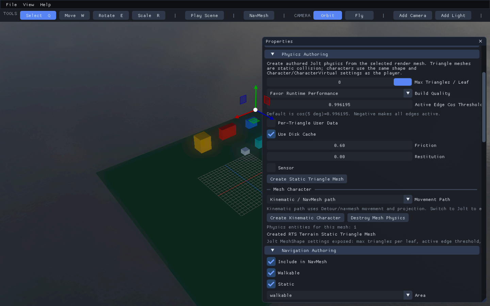
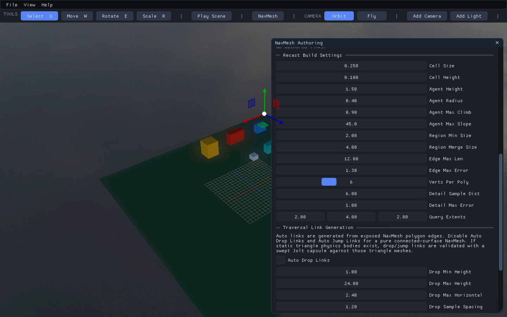
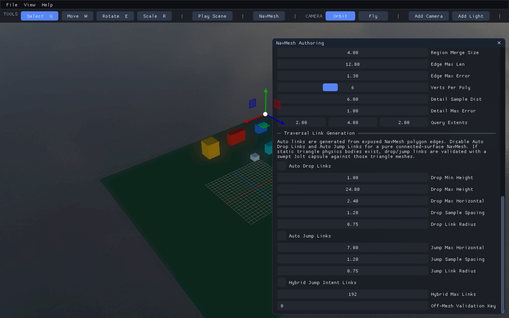
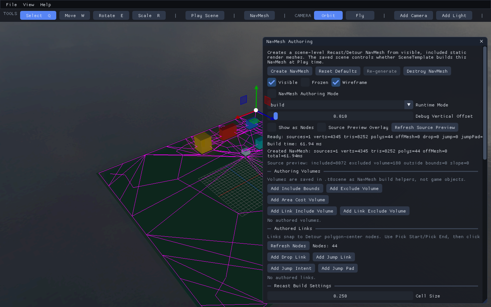
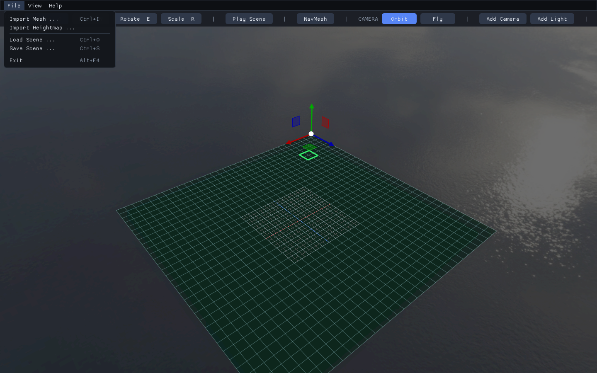
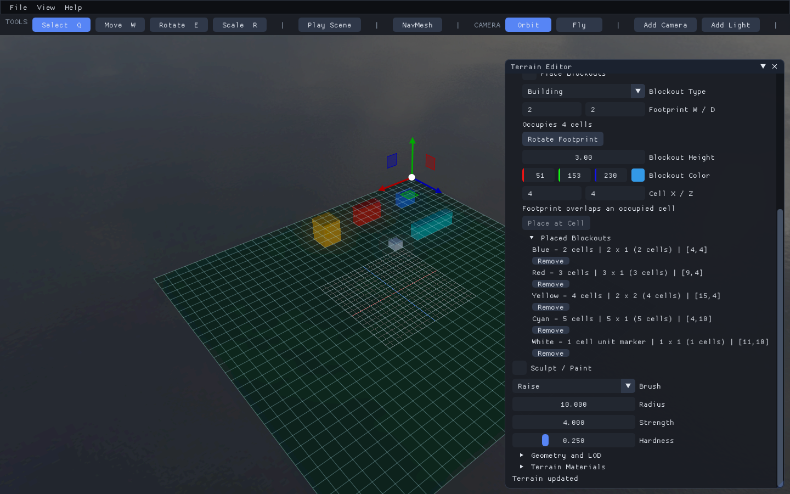
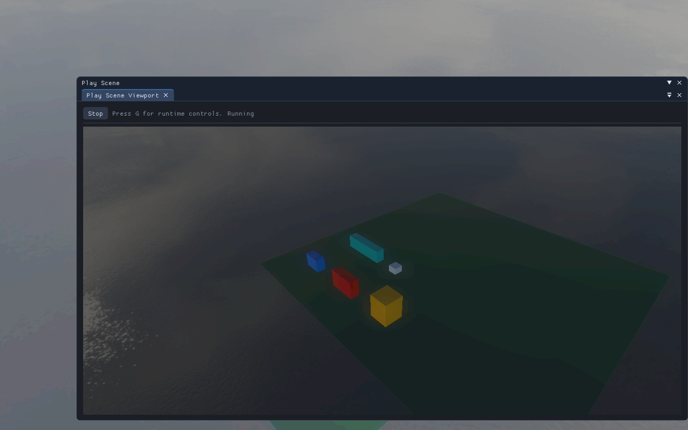
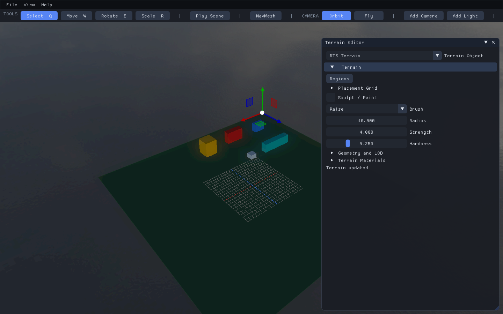

# 4. Test and Iterate

Status: illustrated from the working editor on 2026-09-07.

## Step 1: Add or Check Collision

If you started from the blockout example, the terrain already has static triangle
collision. Otherwise:

Select the terrain, open **Properties > Physics Authoring**, and choose
**Create Static Triangle Mesh** if no collision entity exists yet. Do not create
duplicates when the panel already reports a physics entity for the terrain.

**Check:** the screenshot reports one physics entity and a created static triangle mesh.

Terrain and its blockout boxes share the generated collision geometry. Placement,
deletion, and valid terrain edits replace existing collision through the Framework
terrain transaction. Terrain without authored collision does not gain it merely
because a placement grid was enabled.

## Step 2: Set Navigation Resolution and Agent Size

Open **View > NavMesh Authoring** and scroll to the build settings. Use Cell Size
`0.25`, Cell Height `0.1`, Agent Height `1.5`, and Agent Radius `0.4` for this lesson.
The terrain must remain included, walkable, and static in its navigation metadata.

**Check:** these values describe pathfinding, not the two-unit placement cells.

## Step 3: Disable Automatic Traversal Links

Scroll to **Traversal Link Generation** and disable automatic drop, jump, and
hybrid links for this ground-only prototype.

**Check:** the automatic-link checkboxes are off. This is scene data, not a global
restriction on other game types.

## Step 4: Generate and Inspect Navigation

Choose **Create NavMesh** or **Re-generate**, then enable its Visible and Wireframe
options to inspect the result.

**Check:** Ready statistics and the navmesh overlay are visible.

Expected: traversable ground surrounds building footprints, but building interiors
and roofs are not navigable. Footprint exclusion is generated in Framework for
both the editor and runtime. Recast radius/clearance can exclude more space around
buildings than the placement grid reserves; that is expected for physical agents.

Walkable and buildable are different: a unit may walk up a ramp where buildings
are forbidden. Navigation exclusion volumes do not automatically forbid building
placement, and a region tagged `buildable` does not override placement validation.
Only rules explicitly implemented by a game module should connect those systems.

## Step 5: Save a Map Copy

Choose **File > Save Scene** and use your own `.t8scene` filename.

**Check:** use a new file rather than overwriting the example or Nexus.

## Step 6: Reload and Compare Records

Choose **File > Load Scene**, open the saved copy, and inspect **Placed Blockouts**.
Compare cell size, record count, footprints, and coordinates with your saved layout.

**Check:** the saved IDs and footprints survived reload; the screenshot shows the
five-record example restored from a temporary saved scene.

## Step 7: Enter Play

Click **Play Scene**. The Play viewport loads the authored map through the runtime.
Focus it and use WASD/Q/E to move the free-fly camera, mouse to look, and Shift
for faster movement. G opens runtime controls.

**Check:** Running and Stop are visible and the blockouts appear in the runtime.
For image capture the Play panel is kept in the main framebuffer; normal editor
sessions open the same panel in a separate hosted window.

## Step 8: Return to Editing

Click **Stop** or press Escape to close Play.

**Check:** the editor controls and authored scene are restored. Playing does not
silently replace your editor data.

To walk as a grounded character, author a `player` physics entity with a spawn.
Collision and a terrain mesh alone do not create a player. For an RTS, a strategic
camera and unit-command layer will usually be a separate gameplay feature.

## Additional Verification

Repeatable automated tests and capture commands are documented in the
[terrain reference](../terrain/heightmap-terrain.md). They complement these visual
checks without modifying your map or Nexus.

## Troubleshooting

| Symptom | Check |
|---|---|
| No grid visible | Select a terrain; enable its grid and Show Placement Grid; leave Play first |
| Flat-looking pad rejected | Inspect the full footprint, boundary samples, height tolerance, and slope limit; Smooth is not Flatten |
| Wrong footprint size | Multiply W by D; 4-by-4 is 16 cells, not four |
| Grid scaling/rotation rejected | Keep the terrain unrotated at unit scale; edit terrain dimensions instead |
| Building cannot move through gizmo | Blockouts are terrain-owned records; remove and place at new cell coordinates |
| Box floats on an uneven surface | Unit markers/non-flat policy place the base at the highest supporting sample; automatic foundations are not implemented |
| Saved map lost fields in another editor | Use the updated build; old readers can discard unknown fields on save |
| Play view disappears | Use a no-player free-fly preview or an explicit valid player spawn; old builds forced FPS gravity |
| Small window feels cramped | Resize/collapse docked panels; map size does not depend on viewport size |

Return to the [tutorial index](README.md) or see the
[placement reference](../terrain/placement-grid.md).