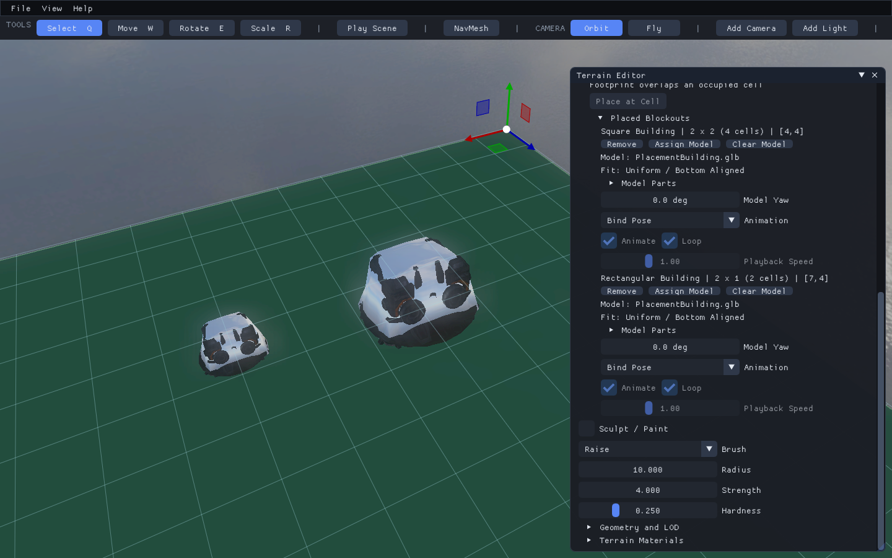
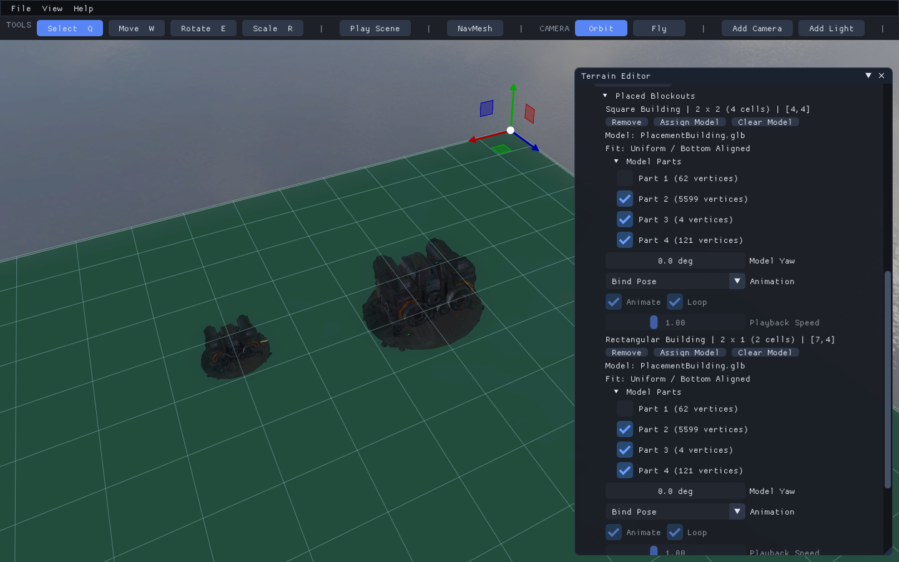
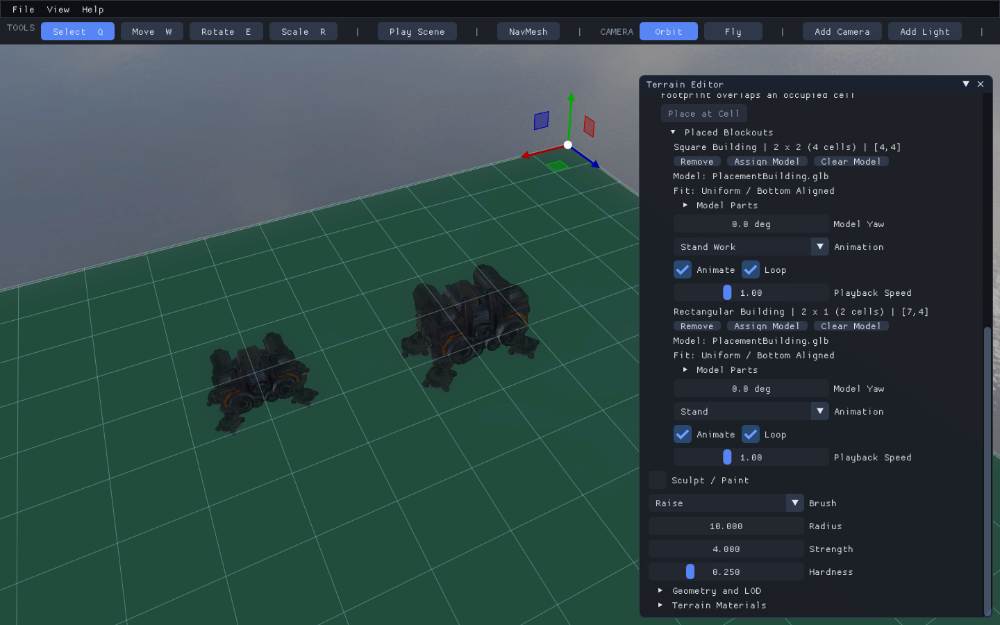
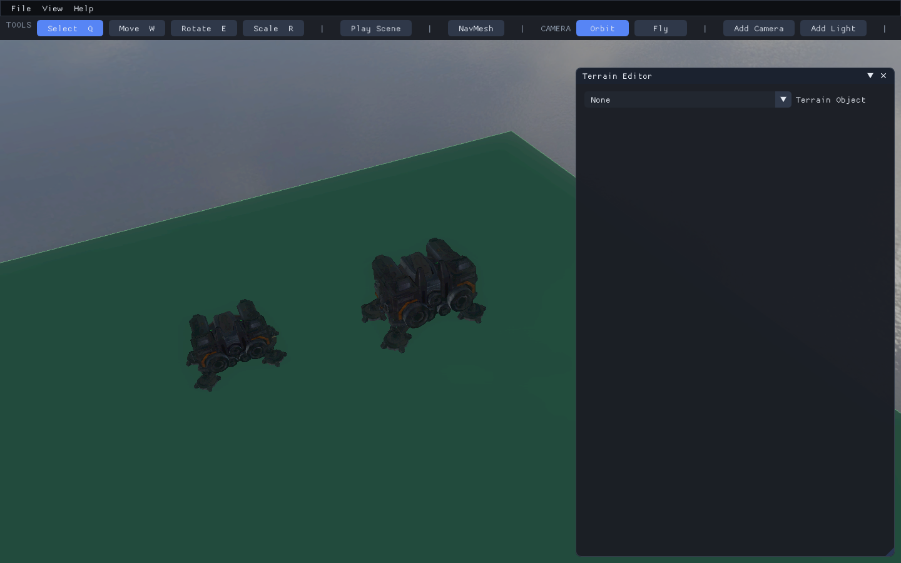
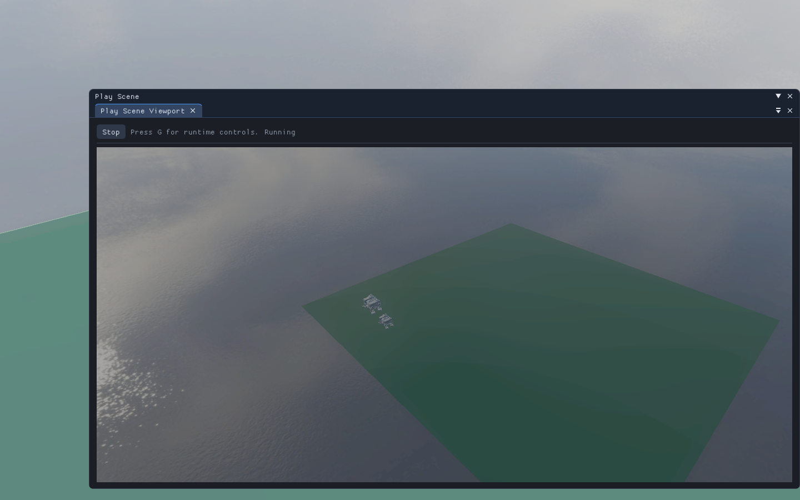

# Assign Building Models

Keep the building footprint and assign a GLB as its visual. A mesh import by itself
does not reserve grid cells. The placement continues to own its occupied cells,
flatness rule, and static collision/navigation box after the colored box is hidden.

Start with a two-by-two footprint and a two-by-one footprint on flat terrain from
[lesson 3](03-place-buildings.md). Their height is 3 and the cell size is 2. Enable
the placement grid and disable **View > Selection Wireframe** for the views below.

Use a locally available, self-contained building GLB. This lesson's images use a
third party reference with 92 joints and 17 clips. The model is not distributed
with the project. Clip names and part counts depend on your asset. The close-ups
use sun intensity 12 and exposure 3; these are scene lighting settings, not changes
to the model's texture colors.
Use D3D12 for the illustrated workflow. The OpenGL editor preview currently has an
exposure discrepancy; a successful import log alone is not visual verification.

## Step 1: Assign a Model to Each Footprint

In **Terrain Editor > Placement Grid > Placed Blockouts**, click **Assign Model**
on each record and select the GLB. Keep **Model Yaw** at zero initially. Assignment
starts in **Bind Pose**. The outer shape shown here is part of this source GLB,
not the original colored blockout.



**Check:** Each record shows its model filename and its unchanged cell dimensions.
The smaller rectangle scales the model uniformly; it does not squeeze one axis.

## Step 2: Choose the Visible Model Parts

Expand **Model Parts**. For this reference, uncheck **Part 1 (62 vertices)** on both
records. It is an exported untextured outer shape that obscures the detailed mesh.
Leave the other parts enabled. Do not assume the first part of another model is a
helper: inspect it before hiding anything. The importer never guesses from names.



**Check:** The detailed textured building is visible, and the unchecked part stays
hidden. Hidden parts are excluded from fitting as well as drawing. Hiding every
part is rejected. This changes the scene record, not the source GLB.

## Step 3: Select and Play an Animation

Choose **Stand Work** for the square and **Stand** for the rectangle in this reference.
Enable **Animate** and **Loop**, and set **Playback Speed** to 1. Use your asset's
own idle/work clip names. An empty selection is **Bind Pose**, never a guessed clip.



**Check:** Both buildings retain their proportions and have independent playback.
Bones, weights, materials, and clips remain intact. **Model Yaw** rotates the visual
and recalculates its fit without changing occupied cells.

Fitting uses the visible mesh bounds at the selected clip's initial pose (or bind
pose), centers XZ, and aligns the bottom to the supporting terrain. It scales to fit
within footprint width, depth, and height using one scale factor. Some space can
remain unused. Fit is fixed during playback: a flying or expanding clip can extend
outside the box; animation does not enlarge occupancy or collision.

## Step 4: Save and Reload

Use **File > Save Scene** with your own filename, then **File > Load Scene** on that
file. Return to the placed records in the Terrain Editor.



**Check:** Footprints, model paths, hidden parts, orientation, and playback settings
survive reload. Playback restarts; elapsed animation time is not saved. **Clear Model**
restores the colored box without releasing its cells, and supports undo/redo.

## Step 5: Enter Play

Click **Play Scene**. The runtime loads the same placement records and animated
visuals. Stop Play to return to authoring.



**Check:** The buildings remain present and animate. Their proxy boxes still block
navigation and provide collision when terrain collision is enabled. This does not
create construction queues, selectable gameplay actors, or animation-event logic.

## Local Example

The optional helper creates a local copy and a separate example scene. It never
rewrites the source GLB or the blockout starter. It refuses to overwrite a different
model already stored at its local example path.

```powershell
.\scripts\CreatePlacementModelExample.ps1 -ModelPath 'D:\Assets\Building.glb' -Animation 'Stand Work' -HiddenGeometry 0
Set-Location .\bin\x64\Debug
.\T8ditor.exe --api d3d12 --sceneFile PlacementModel.t8scene
```

The default output and copied model are ignored by source control. These clip/part
arguments are specific to this reference; omit them to start with all parts in bind
pose. For a portable map, keep the model under project assets and author a
`Models/...` path. An absolute external path works locally but must be relocated
before packaging. Missing files or invalid clips reject the edit and preserve the
previous terrain; scene loading reports an error instead of silently substituting
a different model.

Return to the [tutorial index](README.md) or the [placement contract](../terrain/placement-grid.md).