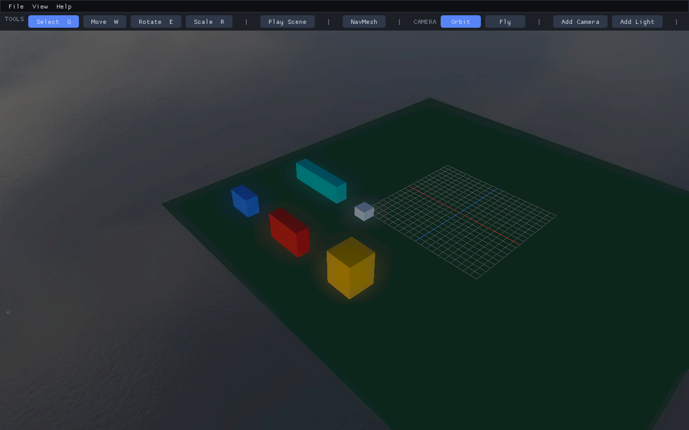

# Editor Tutorials

Status: illustrated against the working terrain and placement tools on 2026-09-07.

These are hands-on authoring lessons, separate from the engine reference docs.
The first four build an RTS blockout map without external unit or building models.
The optional fifth lesson assigns a locally supplied animated building GLB. The same
Framework terrain and placement services remain available to other game genres.

Every numbered lesson step has a matching editor screenshot and a **Check**
caption. The images show the actual controls, entered values, rejection messages,
or completed operation for that step, rather than reusing a final-scene image as
an illustration for unrelated actions. There are 39 illustrated steps and 34
step captures; shared menu/setup views are reused where the action is identical.

## Learning Path

| Order | Lesson | Result |
|---|---|---|
| 1 | [Choose a grid and scale](01-grid-and-scale.md) | Understand cells, footprints, camera projection, and navigation |
| 2 | [Create RTS terrain](02-create-rts-terrain.md) | A saved flat or heightmap terrain with sculpted land and building pads |
| 3 | [Place blockout buildings](03-place-buildings.md) | Colored boxes with explicit 1/2/3/4/5-cell occupancy |
| 4 | [Test and iterate](04-test-and-iterate.md) | Navigation, collision, save/reload, and Play checks |
| 5 | [Assign building models](05-assign-building-models.md) | Fitted GLBs, explicit parts, and independent animations |

## Start With the Example

Open [RtsBlockout.t8scene](../../T850/Assets/Scenes/RtsBlockout.t8scene) using
**File > Load Scene**. It includes a flat 64-by-64 terrain, a two-world-unit cell
size, colored building blockouts, a one-cell unit marker, camera/lights, collision,
and navigation. It has no external terrain image or building model dependency.
Normal engine shader, sky, and lighting assets must still be installed.



The completed example. Individual lessons show the intermediate tool states as
well as this final layout.

From the source root (the directory containing the solution):

```powershell
.\scripts\build.ps1 -Config Release -Platform x64 -Action Build
Set-Location .\bin\x64\Release
.\T8ditor.exe --api d3d12 --sceneFile Scenes/RtsBlockout.t8scene
```

Use Save Scene with a new filename for your own map. Do not overwrite Nexus or
the examples while learning. The editor and runtime read the same `.t8scene` data;
you do not need to add a C++ scene class for each map.

## What You Will and Will Not Build

You will create terrain, mark traversability, measure square footprints, reject
sloped building sites, and author static colored placeholders. You will not yet
have selectable moving armies, construction queues, combat, resource gathering,
territory ownership, or networking. A Unit Marker is a static scale reference,
not a gameplay agent. Those systems belong to game modules above Framework.

## Reference Docs

These links lead to this project's technical documentation, not external game
comparisons.

- [Editor overview](../editor/editor-overview.md)
- [Terrain tools](../terrain/heightmap-terrain.md)
- [Placement grid contract](../terrain/placement-grid.md)
- [Tagged regions](../scenes/scene-regions.md)
- [Windows setup](../development/windows-build-and-run.md)

## Screenshot Notes

Images are real 1440-by-900 editor framebuffer captures. Panels are arranged for
readability and Selection Wireframe is disabled using the View menu. The capture
helper applies the documented values/operations to temporary in-memory scene
copies; it does not draw substitute controls or alter screenshots afterward.
For capture only, Play is kept in the main framebuffer. Normal editing still uses
a separate hosted Play window. Layout and camera framing may differ on your system.

The capture process uses a transient layout and does not overwrite your normal
editor layout, Nexus, or the starter scene. Regeneration instructions are in
[the image maintenance notes](images/README.md).